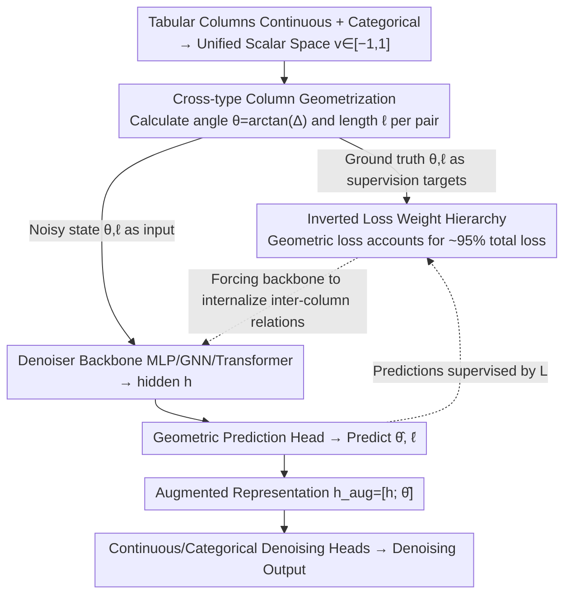

# Geometry-Aware Tabular Diffusion

**Conference**: ICML 2026  
**arXiv**: [2606.02607](https://arxiv.org/abs/2606.02607)  
**Code**: To be confirmed  
**Area**: Tabular Data Generation / Diffusion Models / Geometric Deep Learning  
**Keywords**: Tabular Diffusion, Inter-column Geometric Features, Auxiliary Supervision, Transferable Inductive Bias, TabDiff

## TL;DR
The authors propose GATD (Geometry-Aware Tabular Diffusion), which explicitly incorporates "angles and lengths between column pairs" as geometric features in the input and loss of a tabular diffusion denoiser as auxiliary supervision signals. With a small MLP (parameter size only 1/3.5 of TabDiff, and 1/25 for classification tasks), it achieves victory in 8/10 Shape, 7/10 Trend, and 9/10 Downstream Utility across 10 datasets. Furthermore, the same set of default hyperparameters can be directly transferred to GNN and Transformer denoisers (improving 27/30 Shape and 25/30 Trend scores).

## Background & Motivation

**Background**: Tabular data is the most common data format in enterprise, healthcare, and scientific research. Synthetic tabular data is widely used for privacy-preserving data sharing and data augmentation. In recent years, diffusion models have become the mainstream for tabular synthesis, with TabDDPM, STaSy, TabSyn, and TabDiff sequentially improving the state-of-the-art. Among them, TabDiff uses Transformer self-attention to model inter-column relationships and is the current SOTA.

**Limitations of Prior Work**: All these methods rely entirely on the denoising loss to implicitly learn "how columns should vary together." While Transformer attention is flexible, it must discover inter-column structures on its own through remote, weakly supervised objectives like denoising MSE. Consequently, models require larger sizes and longer training times to learn well, and there is no shared inductive bias across different architectures.

**Key Challenge**: Objective geometric relationships exist between tabular columns (such as the direction and magnitude of the difference between two numerical columns), yet existing architectures neither feed these to the model nor require the model to explicitly predict them. This effectively discards a free, supervisable structural signal.

**Goal**: (1) Transform column-pair geometric relationships into explicit, differentiable features + auxiliary prediction targets; (2) verify whether this supervisory signal can be transferred across MLP, GNN, and Transformer denoisers; (3) challenge the Transformer SOTA using a minimal MLP.

**Key Insight**: Borrowing ideas from geometric deep learning—given that the success of GNNs, point clouds, and Transformer positional encodings stems from "explicitly providing geometric structure"—the differences between tabular column pairs can be parameterized as geometric quantities similar to graph edges. However, the key lies in their architecture-matched ablation: **simply feeding geometric features as input yields no benefit ($d = -0.08$), whereas using them as auxiliary prediction targets provides a massive effect ($d = 0.81$)**. In other words, the real effect comes from "being forced to learn geometry," not just "seeing geometry."

**Core Idea**: Construct explicit geometric targets using the $\arctan$ (angle) and $\frac{1}{2}\log(1+\Delta^2)$ (length) of each pair of column value differences. These weights far exceed the diffusion loss itself (accounting for ~95% of the total loss), forcing the denoiser to internalize inter-column relationships into its representations. This serves as a relational inductive bias that is "portable to any denoising architecture."

## Method

### Overall Architecture
GATD addresses the problem where inter-column relationships are learned implicitly, slowly, and non-transferably via denoising MSE. The approach retains the diffusion backbone of TabDiff (EDM for continuous columns, masked diffusion for categorical columns, per-column learnable $\rho$ noise scheduling) and wraps the denoiser with "geometric input + geometric prediction head + geometric supervision," converting discarded free signals into mandatory auxiliary targets.

Specifically, all columns are first mapped to a unified scalar space $v\in[-1,1]^d$. For $\binom{d}{2}$ column pairs, the ground truth angle $\theta_{ij}$ and length $\ell_{ij}$ are calculated as supervision targets, and the corresponding geometric quantities in the noisy state are used as inputs. The denoiser takes `[time embedding; noisy continuous; one-hot categorical; input angle; input length]` and produces hidden $\mathbf{h}$. A geometric head predicts $\hat{\boldsymbol{\theta}}$ (constrained by $\frac{\pi}{2}\tanh$) and $\hat{\boldsymbol{\ell}}$ from $\mathbf{h}$. The augmented representation $\mathbf{h}_{\text{aug}}=[\mathbf{h};\hat{\boldsymbol{\theta}}]$ is then fed back into the continuous/categorical denoising heads. During sampling, geometric inputs are calculated but geometric supervision is omitted, and the length head is detached (since length loses sign information via squaring, it acts only as a regularizer during training and does not enter $\mathbf{h}_{\text{aug}}$). After generation, values are folded back into $[0,1]$ using reflection ($s\mapsto 2-s$ or $s\mapsto -s$) instead of hard clipping to prevent synthetic data from piling up at quantile boundaries.

### Key Designs

**1. Cross-type Column Geometrization: Losslessly encoding differences between any two columns into bounded geometric quantities**

To allow a unified geometric signal to cover both continuous and categorical columns, they must share a common scalar space. Continuous columns undergo quantile transformation $v=2\cdot\text{QT}(x)-1$, while categorical columns use a fixed deterministic mapping $v=2\cdot\text{idx}/\max(\text{card}-1,1)-1$, both falling into $[-1,1]$. Subsequently, for each $i<j$, angle $\theta_{ij}=\arctan(v_j-v_i)$ and length $\ell_{ij}=\frac{1}{2}\log(1+(v_j-v_i)^2)$ are computed. $\arctan$ makes the angle naturally bounded and anti-symmetric, while $\log$ compresses large differences. Ablations show using raw differences is slightly weaker because bounded targets are more stable. Since $v_j-v_i=\tan(\theta_{ij})$ can be solved from the angle, the angle information is strictly stronger than length; thus, only the predicted angle is concatenated into $\mathbf{h}_{\text{aug}}$. Using fixed mappings instead of learnable embeddings keeps geometric features "calculate-on-the-fly" without additional trainable parameters, while automatically granting ordinal categories (e.g., education level, Likert scales) an ordered enhancement.

**2. Architecture-Matched "Input vs. Supervision" Comparison: Isclating benefits to supervision rather than capacity**

Does geometry work because it is "seen" by the model or because the model is "forced to predict" it? To decouple this confounding variable, the authors constructed three configurations: NoGeom (no geometry), InputsOnly (geometric input + prediction head, but $\lambda_\theta=\lambda_\ell=\lambda_c=0$), and +Geom (geometric input + prediction head + weights enabled). All three have identical architecture, parameter counts, and gradient topologies. The only switch is the "geometric loss weight." Results showed InputsOnly vs. NoGeom yielded a Cohen's $d=-0.08$ (negligible), while +Geom vs. NoGeom yielded $d=0.81$ (large effect). This cleanly proves that the actual benefit comes from auxiliary supervision, not geometric input or extra capacity. This also answers why Transformer self-attention fails to learn this structure naturally—not because it can't, but because it isn't forced to; this is the most persuasive methodological contribution of the paper.

**3. Inverted Loss Weight Hierarchy: Making auxiliary tasks account for ~95% of total loss**

Default weights are set to $(\lambda_\epsilon,\lambda_{\text{cat}},\lambda_\theta,\lambda_\ell,\lambda_c)=(1.0,0.05,15,15,8)$, such that geometric terms account for roughly 95% of the total loss at convergence, leaving denoising with index 5%. This forces the backbone to encode inter-column relationships into the representation first and complete denoising "by the way." The consistency loss $\mathcal{L}_c=\mathbb{E}[(1-t)^2]\cdot(\|\hat{\boldsymbol{\theta}}-\text{sg}(\boldsymbol{\theta}_{\text{pred}})\|^2+\|\hat{\boldsymbol{\ell}}-\text{sg}(\boldsymbol{\ell}_{\text{pred}})\|^2)$ uses $(1-t)^2$ to strictly constrain geometric head predictions to align with geometry recalculated from the denoising output during low-noise stages. This hierarchy contradicts the multitask learning common sense that "auxiliary task weights should be small." Lowering geometric weights to the magnitude of diffusion leads to performance drops because denoising MSE is a spatially local, element-wise target whose gradients do not point toward "understanding column-pair relations." It must be pulled by heavier auxiliary losses. Furthermore, this same set of weights works across MLP, GNN, and Transformer backbones without retuning, indicating it is structural rather than heuristic.

### Loss & Training
The total loss is $\mathcal{L}=\lambda_\epsilon\mathcal{L}_{\text{cont}}+\lambda_{\text{cat}}\mathcal{L}_{\text{cat}}+\lambda_\theta\mathcal{L}_{\text{angle}}+\lambda_\ell\mathcal{L}_{\text{length}}+\lambda_c\mathcal{L}_{\text{consistency}}$. $\mathcal{L}_{\text{cont}}$ is EDM-weighted denoising MSE, $\mathcal{L}_{\text{cat}}$ is weighted cross-entropy on masked tokens, $\mathcal{L}_{\text{angle}}/\mathcal{L}_{\text{length}}$ are L2 relative to ground truth $\theta/\ell$, and $\mathcal{L}_{\text{consistency}}$ aligns predicted geometry with geometry derived from denoising output (with stop-gradient). Optimization uses AdamW + EMA for 20,000 epochs (TabDiff used 8,000), selecting the best after 10,000. Despite 2.5× more epochs, the end-to-end wall-clock time is 1.7× faster than TabDiff due to smaller model size. Sampling uses EDM Euler 1000 steps + iteration unmasking for categories + reflection boundary handling.

## Key Experimental Results

### Main Results
Benchmark on 10 TabDiff-style datasets (5 classification + 5 regression: Adult, Beijing, Bikesharing, California, Default, Diabetes, Magic, News, Powerplant, Shoppers), using 3 training seeds × 20 generation seeds.

| Evaluation Dimension | Ours (GATD-MLP) | TabDiff (Transformer SOTA) | Key Improvement |
|---|---|---|---|
| Parameters | ~400K–6M | ~10M | avg 3.5×, up to 25× smaller (classification) |
| Shape Wins | **8/10** | 2/10 | 27% reduction in Shape error |
| Trend Wins | **7/10** | 3/10 | 20% reduction in Trend error |
| Utility (F1/RMSE) | **9/10** | 1/10 | XGBoost performance on real test set |
| Training Time | **1.7× Faster** | Baseline | Even with 2.5× more epochs |

Cross-architecture Portability (using same $(\lambda_\theta,\lambda_\ell,\lambda_c)=(15,15,8)$ default):

| Denoiser Backbone | Shape Wins (+Geom vs. own baseline) | Trend Wins |
|---|---|---|
| Residual MLP | 9/10 | 8/10 |
| GNN + Laplacian eigenmap | 8/10 | 9/10 |
| Column-wise Transformer | 10/10 | 8/10 |
| **Total** | **27/30** | **25/30** |

Treating each "Architecture × Dataset × Metric" cell as a Bernoulli trial, 52 wins out of 60 yields a two-sided sign-test $p=5.21\times 10^{-9}$.

### Ablation Study
The most critical is the "Input vs. Supervision" architecture-matched ablation (same params, same gradients, only toggling geometric loss weights):

| Config | Geometric Input? | Geometric Head? | Geometric Loss? | Effect Size (vs NoGeom) |
|---|---|---|---|---|
| NoGeom | No | No | No | baseline |
| InputsOnly | **Yes** | **Yes** | **No** | Cohen's $d=-0.08$ (negligible) |
| +Geom (GATD) | Yes | Yes | **Yes** | Cohen's $d=0.81$ (large effect) |

Other ablations: (1) Replacing $\arctan/\log$ with raw differences was slightly weaker; (2) Reducing geometric weights to diffusion levels led to significant drops; (3) MLP $n_{\text{blocks}}$ set to 0 for classification and 8 for regression; (4) The "categorical column anchor" mechanism ($\rho=0.70$) observed in prior MLPs did not generalize, downgraded by the authors to an "operational mechanism" rather than a necessity.

### Key Findings
- **Supervision is the unique variable**: Seeing geometric features is useless; the model must be forced to predict them. This solidifies the "explicit inductive bias = explicit supervision" argument.
- **Geometric signals are structural**: The same default weights improved three distinctly different denoisers, suggesting this is a universal auxiliary task for tabular diffusion, not just an MLP patch.
- **Small models can challenge large ones**: An MLP with at most 6M parameters can outperform a 10M Transformer SOTA via auxiliary supervision, suggesting a significant tradeoff between compute and explicit structure, especially in relatively low-dimensional tabular data.
- **Invert the weights**: Contrary to multitask learning norms, the auxiliary task weight must be significantly larger than the primary task to be effective. Only then do local denoising MSE gradients get pulled by the goal of "understanding inter-column relations."

## Highlights & Insights
- **Methodological over Method Contribution**: The architecture-matched ablation (InputsOnly vs +Geom) is exemplary—it independently excludes "extra capacity," "extra feature channels," and "extra heads" as explanations, attributing efficacy to "auxiliary supervision."
- **Portable Inductive Bias**: Packaging "geometric input + head + loss + $\mathbf{h}_{\text{aug}}$" as a drop-in module works across backbones without hyperparameter modification. This "backbone-agnostic auxiliary task" can be extended to time-series, sensors, and graphs.
- **Unified Scalar Space Trick**: Using fixed deterministic mappings to turn categories into $[-1, 1]$ allows them to share calculation logic with continuous columns, avoiding the difficulty of constructing differentiable distances for categories.
- **Reflection Boundary Handling**: Compared to hard clipping, reflection ($s\mapsto 2-s$ or $s\mapsto -s$) for up to 10 iterations effectively prevents synthetic data from accumulating at quantile boundaries, a useful trick for any diffusion method with $[0,1]$ output ranges.

## Limitations & Future Work
- **$O(d^2)$ Column-pair Expansion**: Geometric features grow quadratically with the number of columns, which may consume significant memory and compute for wide tables (hundreds of columns). The largest dataset in the paper had ~48 columns.
- **Categorical Ordering Bias**: Using deterministic index mappings for non-ordinal categories introduces a bias where adjacent indices are more easily confused. While the authors claim this doesn't affect predictive accuracy, it warrants closer inspection for fairness/privacy.
- **Non-transferable Anchor Mechanism**: The "categorical columns as anchors" explanation found on MLPs did not hold across GNNs/Transformers, leaving the unified mechanism for *why* it works on those architectures as an open puzzle.
- **Diffusion-specific Verification**: The authors explicitly state portability was only confirmed within diffusion frameworks; whether it transfers to GANs, VAEs, or autoregressive models remains unknown.
- **Improvements**: Future work could explore (1) reducing column pairs from $O(d^2)$ to $O(d\log d)$ using low-rank or sparse methods (e.g., top-k pairs by Mutual Information); (2) making categorical mappings learnable isometric embeddings; (3) testing geometric supervision in conditional sampling.

## Related Work & Insights
- **vs. TabDiff (Shi et al., 2025)**: Same EDM + masked diffusion base, but TabDiff uses Transformer self-attention to learn relationships **implicitly**. GATD uses auxiliary loss to force the denoiser to learn **explicitly**. GATD outperforms with 1/3.5 the parameters, and feeding the same signal to a Transformer backbone improves it further, showing they are **complementary**.
- **vs. TabDDPM / TabSyn**: The former is a pure MLP without relationship modeling; the latter uses VAE then diffusion. Both lack explicit column-pair supervision.
- **vs. Geometric Deep Learning**: Traditional GDL applies geometry to data with *pre-existing* graph structures (molecules). GATD reverses this—it **manufactures** a geometric relationship graph for seemingly structureless tabular data and supervises it.
- **Insight**: Auxiliary task supervision is an undervalued design dimension—when the primary task gradient doesn't point toward your desired representation, don't just add capacity; design an auxiliary task that supervises that representation directly.

## Rating
- Novelty: ⭐⭐⭐⭐ Reversing GDL for structureless tabular data and attributing gains to supervision via rigorous ablation is novel.
- Experimental Thoroughness: ⭐⭐⭐⭐⭐ 10 datasets × 3 train seeds × 20 generation seeds × 3 backbones, 60-cell cross-architecture evaluation + sign-test, plus architecture-matched ablations.
- Writing Quality: ⭐⭐⭐⭐ The argument progresses logically (Supervision → Portability → Small SOTA), with clear design motivations.
- Value: ⭐⭐⭐⭐ Provides a drop-in auxiliary module for tabular diffusion and foregrounds the "auxiliary supervision vs. implicit capacity" methodological debate.

<!-- RELATED:START -->

## Related Papers

- [\[CVPR 2026\] SPREAD: Spatial-Physical REasoning via geometry Aware Diffusion](../../CVPR2026/image_generation/spread_spatial-physical_reasoning_via_geometry_aware_diffusion.md)
- [\[ICML 2026\] GASS: Geometry-Aware Spherical Sampling for Disentangled Diversity Enhancement in Text-to-Image Generation](gass_geometry-aware_spherical_sampling_for_disentangled_diversity_enhancement_in.md)
- [\[ICML 2026\] Rethinking FID Through the Geometry of the Reference Dataset](rethinking_fid_through_the_geometry_of_the_reference_dataset.md)
- [\[ICML 2026\] Geometry-based Schrödinger Bridges for Trustworthy Multimodal Fusion](geometry-based_schrödinger_bridges_for_trustworthy_multimodal_fusion.md)
- [\[ICLR 2026\] The Spacetime of Diffusion Models: An Information Geometry Perspective](../../ICLR2026/image_generation/the_spacetime_of_diffusion_models_an_information_geometry_perspective.md)

<!-- RELATED:END -->
