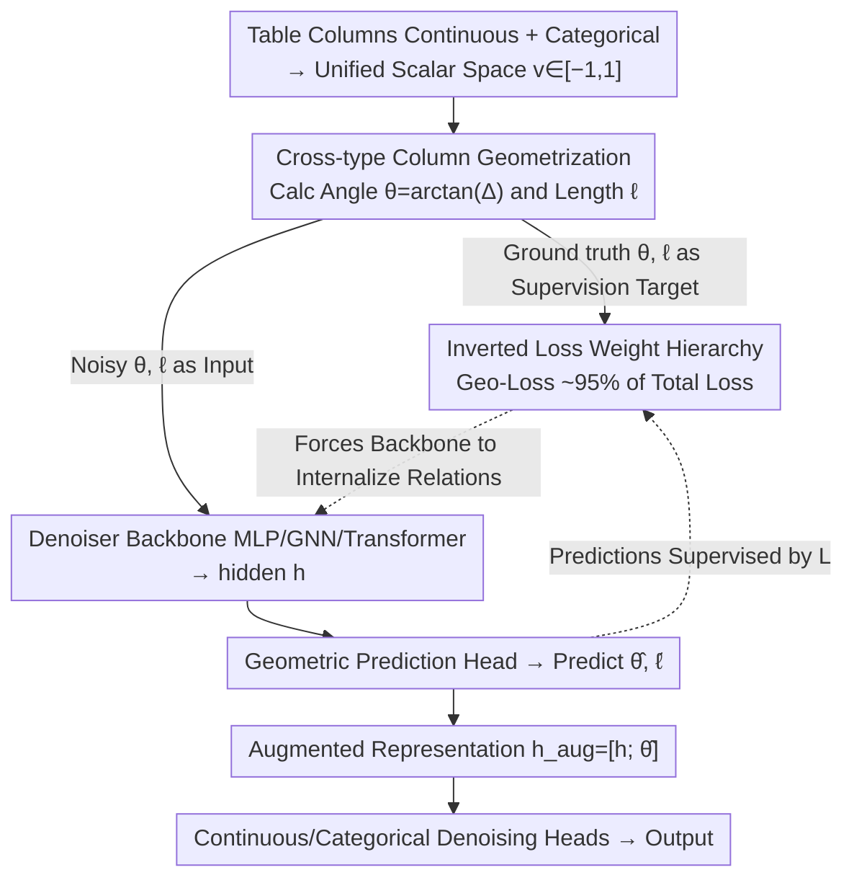

# Geometry-Aware Tabular Diffusion

**Conference**: ICML 2026  
**arXiv**: [2606.02607](https://arxiv.org/abs/2606.02607)  
**Code**: To be confirmed  
**Area**: Tabular Data Generation / Diffusion Models / Geometric Deep Learning  
**Keywords**: Tabular Diffusion, Inter-column Geometric Features, Auxiliary Supervision, Portable Inductive Bias, TabDiff

## TL;DR
The authors propose GATD (Geometry-Aware Tabular Diffusion), which explicitly incorporates "angles and lengths between column pairs" as geometric features into the denoising inputs and loss functions as auxiliary supervision signals. Using a small MLP with only 1/3.5 the parameters of TabDiff (and as low as 1/25 for classification tasks), GATD achieves wins in 8/10 Shape, 7/10 Trend, and 9/10 downstream utility metrics across 10 datasets. Furthermore, the same set of default hyperparameters can be directly transferred to GNN and Transformer denoisers, yielding improvements in 27/30 Shape and 25/30 Trend metrics.

## Background & Motivation

**Background**: Tabular data is the most common data format in enterprise, medical, and scientific research. Synthetic tables are widely used for data sharing and augmentation under privacy constraints. In recent years, diffusion models have become the mainstream for tabular synthesis, with TabDDPM, STaSy, TabSyn, and TabDiff successively setting new SOTA. TabDiff, which uses Transformer self-attention to model inter-column relationships, is the current SOTA.

**Limitations of Prior Work**: All existing methods rely entirely on the denoising loss to implicitly learn "how columns should co-vary." While Transformer attention is flexible, it must discover inter-column structures on its own through distal, weakly supervised objectives like denoising MSE. Consequently, models require larger sizes and longer training times to learn effectively, and there is no shared inductive bias for cross-architecture transfer.

**Key Challenge**: Objective geometric relationships exist between tabular columns (e.g., the direction and magnitude of values between two columns), but existing architectures neither feed these to the model nor require the model to explicitly predict them. This effectively discards a free, supervisable structural signal.

**Goal**: (1) Transform column-pair geometric relationships into explicit, differentiable features and auxiliary prediction targets; (2) Verify if this supervision signal can transfer across MLP, GNN, and Transformer denoisers; (3) Challenge the Transformer SOTA using a minimal MLP.

**Key Insight**: Borrowing from geometric deep learning—where the success of GNNs, point clouds, and Transformer positional encodings stems from "explicitly providing geometric structure"—column-pair differences in tables can be parameterized as geometric quantities similar to graph edges. Critically, through architecture-matched ablations, the authors demonstrate that **simply feeding geometric features as input provides no yield (Cohen's $d=-0.08$), whereas using them as auxiliary prediction targets for supervision results in a large effect ($d=0.81$)**. Essentially, the benefit comes not from "seeing geometry" but from being "forced to learn geometry."

**Core Idea**: Construct explicit geometric targets using $\arctan$ (angle) and $\frac{1}{2}\log(1+\Delta^2)$ (length) for each pair of column-value differences. The weights for these targets significantly outweigh the diffusion loss itself (accounting for ~95% of total loss), forcing the denoiser to internalize inter-column relationships into its representations. This serves as a relational inductive bias portable to any denoising architecture.

## Method

### Overall Architecture
GATD addresses the problem where inter-column relationships are learned implicitly, slowly, and non-portably via denoising MSE. It retains the diffusion backbone of TabDiff (EDM for continuous columns, masked diffusion for categorical columns, and per-column learnable $\rho$ noise scheduling) while wrapping the denoiser with "geometric input + geometric prediction head + geometric supervision." This converts the angle/length between column pairs from a discarded signal into a mandatory auxiliary learning objective.

Specifically, all columns are mapped to a unified scalar space $v\in[-1,1]^d$. For $\binom{d}{2}$ column pairs, the true angle $\theta_{ij}$ and length $\ell_{ij}$ are calculated as supervision targets, while the same geometric quantities under noisy states are used as inputs. The denoiser takes `[time embedding; noisy continuous; one-hot categorical; input angles; input lengths]` and produces a hidden representation $\mathbf{h}$. A geometric head predicts $\hat{\boldsymbol{\theta}}$ (constrained by $\frac{\pi}{2}\tanh$) and $\hat{\boldsymbol{\ell}}$ from $\mathbf{h}$. The augmented representation $\mathbf{h}_{\text{aug}}=[\mathbf{h};\hat{\boldsymbol{\theta}}]$ is then fed back into the continuous/categorical denoising heads. During the sampling phase, geometric inputs are calculated but geometric supervision is omitted, and the length head is detached (since length loses sign information due to squaring and only serves as regularization during training). Post-generation, boundary values are folded back into $[0,1]$ using reflection ($s\mapsto 2-s$ or $s\mapsto -s$) rather than hard clipping to avoid accumulation at quantile boundaries.

### Key Designs

**1. Cross-type Column Geometrization: Losslessly encoding differences as bounded geometric quantities**

To allow a unified geometric signal to cover both continuous and categorical columns, a shared scalar space is required. Continuous columns undergo quantile transformation $v=2\cdot\text{QT}(x)-1$, and categorical columns use a fixed deterministic mapping $v=2\cdot\text{idx}/\max(\text{card}-1,1)-1$, both falling within $[-1,1]$. For each $i<j$, the angle $\theta_{ij}=\arctan(v_j-v_i)$ and length $\ell_{ij}=\frac{1}{2}\log(1+(v_j-v_i)^2)$ are computed: $\arctan$ ensures angles are naturally bounded and anti-symmetric, while $\log$ compresses large differences. Ablations show that using raw differences as targets is slightly weaker, as bounded targets are more stable. Since $v_j-v_i=\tan(\theta_{ij})$ can be solved from the angle, the angle information is strictly stronger than length, so only the predicted angle is concatenated into $\mathbf{h}_{\text{aug}}$. Fixed mappings instead of learnable embeddings are used to keep geometric features "ready-to-use" without adding parameters, which also inherently strengthens ordinal categories (e.g., education level, Likert scales).

**2. Architecture-Matched "Input vs Supervision" Comparison: Attributing gains to supervision, not capacity**

Does geometry work because it is "seen" by the model or "forced to be predicted"? To isolate this, the authors constructed three configurations: NoGeom (no geometry), InputsOnly (geometry fed as input with prediction heads, but $\lambda_\theta=\lambda_\ell=\lambda_c=0$), and +Geom (input + prediction head + loss weights enabled). All three share identical architectures, parameter counts, and gradient topologies; the only difference is the geometric loss weight. Results showed InputsOnly vs NoGeom yielded a Cohen's $d=-0.08$ (near zero), while +Geom vs NoGeom yielded $d=0.81$ (large effect). This cleanly proves that auxiliary supervision, not geometric input or extra capacity, drives the performance. It also answers why Transformers don't learn this structure naturally—not because they can't, but because they aren't forced to.

**3. Inverted Loss Weight Hierarchy: Making auxiliary tasks dominate ~95% of the total loss**

Default weights $(\lambda_\epsilon,\lambda_{\text{cat}},\lambda_\theta,\lambda_\ell,\lambda_c)=(1.0,0.05,15,15,8)$ ensure that at convergence, the weighted geometric terms account for approximately 95% of the total loss, leaving only 5% for the denoising task. This forces the backbone to first encode inter-column relationships into representations and then "by the way" complete the denoising. The consistency loss $\mathcal{L}_c=\mathbb{E}[(1-t)^2]\cdot(\|\hat{\boldsymbol{\theta}}-\text{sg}(\boldsymbol{\theta}_{\text{pred}})\|^2+\|\hat{\boldsymbol{\ell}}-\text{sg}(\boldsymbol{\ell}_{\text{pred}})\|^2)$ uses $(1-t)^2$ to enforce strong constraints in low-noise regions. This hierarchy contradicts the common multi-task learning intuition that auxiliary weights should be small. Ablations show reducing geometric weights to be commensurate with diffusion loss leads to performance drops, as denoising MSE provides local gradients that do not inherently point toward understanding column pairs.

### Loss & Training
The total loss is $\mathcal{L}=\lambda_\epsilon\mathcal{L}_{\text{cont}}+\lambda_{\text{cat}}\mathcal{L}_{\text{cat}}+\lambda_\theta\mathcal{L}_{\text{angle}}+\lambda_\ell\mathcal{L}_{\text{length}}+\lambda_c\mathcal{L}_{\text{consistency}}$. $\mathcal{L}_{\text{cont}}$ is the EDM-weighted denoising MSE, $\mathcal{L}_{\text{cat}}$ is weighted cross-entropy on masked tokens, $\mathcal{L}_{\text{angle}}/\mathcal{L}_{\text{length}}$ are L2 losses on ground truth $\theta/\ell$, and $\mathcal{L}_{\text{consistency}}$ aligns predicted geometry with geometry derived from the denoised output (using stop-gradient). The optimizer used is AdamW with EMA, training for 20,000 epochs (vs 8,000 for TabDiff). Despite the 2.5× more epochs, the end-to-end wall-clock time is 1.7× faster than TabDiff due to the smaller model size. Sampling uses EDM Euler 1000 steps, categorical iterative unmasking, and reflection boundary handling.

## Key Experimental Results

### Main Results
Evaluated on 10 TabDiff-style benchmarks (5 classification + 5 regression) with 3 training seeds and 20 generation seeds.

| Metric | Ours (GATD-MLP) | TabDiff (Transformer SOTA) | Key Gain |
|---|---|---|---|
| Parameters | ~400K–6M | ~10M | 3.5× smaller avg, up to 25× for classification |
| Shape Wins | **8/10** | 2/10 | 27% reduction in Shape error |
| Trend Wins | **7/10** | 3/10 | 20% reduction in Trend error |
| Downstream Utility (F1/RMSE) | **9/10** | 1/10 | XGBoost performance on real test set |
| Training Time | **1.7× Faster** | Baseline | Despite 2.5× more epochs |

Cross-architecture Portability (using the same default weights $(\lambda_\theta,\lambda_\ell,\lambda_c)=(15,15,8)$):

| Denoiser Backbone | Shape Wins (+Geom vs baseline) | Trend Wins |
|---|---|---|
| Residual MLP | 9/10 | 8/10 |
| GNN + Laplacian eigenmap | 8/10 | 9/10 |
| Column-wise Transformer | 10/10 | 8/10 |
| **Total** | **27/30** | **25/30** |

Treating each "Architecture × Dataset × Metric" cell as a Bernoulli trial, 52 wins out of 60 yields a two-sided sign-test $p=5.21\times 10^{-9}$.

### Ablation Study
The critical "Input vs Supervision" ablation (identical parameters/topology, switching loss weights):

| Config | Geometric Input | Geometric Prediction Head | Geometric Loss | Effect Size vs NoGeom |
|---|---|---|---|---|
| NoGeom | No | No | No | baseline |
| InputsOnly | **Yes** | **Yes** | **No** | Cohen's $d=-0.08$ (negligible) |
| +Geom (GATD) | Yes | Yes | **Yes** | Cohen's $d=0.81$ (large effect) |

Other ablations: (1) Replacing $\arctan/\log$ with raw differences was slightly weaker; (2) Reducing geometric weights to diffusion levels led to significant drops; (3) Number of MLP blocks $n_{\text{blocks}}$ was 0 for classification and 8 for regression; (4) The "categorical column anchor" mechanism ($\rho=0.70$) previously observed on MLP was not universal across architectures.

### Key Findings
- **Supervision is the only variable**: Feeding geometric features as input is useless; models must be forced to predict them. This reinforces the argument: "Explicit inductive bias = Explicit supervision."
- **Geometric signals are structural**: The same default weights improved three distinctly different denoisers, suggesting this is a universal auxiliary task for tabular diffusion rather than an MLP-specific patch.
- **Small models can challenge large ones**: An MLP with at most 6M parameters can outperform a 10M Transformer SOTA via auxiliary supervision, suggesting a significant tradeoff between compute/capacity and explicit structure, especially for low-dimensional tabular data.
- **Weights must be inverted**: Contrary to multi-task learning norms, auxiliary weights must be much larger than the main task to steer the denoising MSE's local gradients toward structural understanding.

## Highlights & Insights
- **Methodology > Method**: The "InputsOnly vs +Geom" ablation is exemplary—it isolates the benefit to "auxiliary supervision" by excluding capacity, feature channels, and heads as confounding variables.
- **Portable Inductive Bias**: Packaging "geometric input + head + loss + $\mathbf{h}_{\text{aug}}$" as a drop-in module that works across MLP/GNN/Transformer without tuning proves that "backbone-agnostic auxiliary tasks" are a viable path for structured data diffusion (e.g., time series, sensors).
- **Unified Scalar Space Trick**: Using deterministic mappings to transform categorical columns into $[-1, 1]$ allows them to share geometric calculations with continuous columns, a practical trick for mixed-type geometric modeling.
- **Reflection Boundary Handling**: Using reflection $s\mapsto 2-s$ or $s\mapsto -s$ for 10 rounds is more effective than hard clipping, preventing data accumulation at quantile boundaries.

## Limitations & Future Work
- **$O(d^2)$ Complexity**: The number of geometric features grows quadratically with columns, which may tax memory/compute for very wide tables (hundreds of columns). The largest dataset tested was ~48 columns (News).
- **Categorical Sorting Bias**: Deterministic index mapping for non-ordinal categories introduces bias where "adjacent" categories are more easily confused. While precision was unaffected, this might impact fairness or categorical symmetry.
- **Non-universal Anchor Mechanism**: The "categorical anchor" explanation was specific to MLPs. Why GATD also improves GNNs/Transformers remains an open theoretical question.
- **Diffusion Framework Constraint**: Portability was only verified within diffusion denoisers; extension to GANs, VAEs, or autoregressive models is unknown.
- **Future Directions**: (1) Reducing pairs to $O(d\log d)$ via mutual information top-k; (2) Learnable isometric embeddings for categories; (3) Testing geometric supervision in conditional sampling.

## Related Work & Insights
- **vs TabDiff (Shi et al., 2025)**: Uses the same EDM + masked diffusion base, but TabDiff relies on Transformer self-attention to learn relations **implicitly**. GATD uses auxiliary loss to **explicitly** force learning, allowing a much smaller MLP to win and even improving the Transformer backbone when added.
- **vs TabDDPM / TabSyn**: These lack explicit column-pair supervision; they serve as "implicit only" baselines.
- **vs Geometric Deep Learning**: While GNNs use geometry for data with *inherent* graph structures (molecules), GATD "manufactures" a geometric graph for tables where none exists and supervises it. This "artificial" inductive bias can be generalized to any structured field data.
- **Insight**: Auxiliary task supervision is an undervalued design dimension—when the main objective gradient doesn't direct the model toward the desired representation, it is better to design a specific supervision for that representation rather than just adding model capacity.

## Rating
- Novelty: ⭐⭐⭐⭐ Applying geometric deep learning "in reverse" to structureless tabular data and attributing gains to supervision via rigorous ablation is novel.
- Experimental Thoroughness: ⭐⭐⭐⭐⭐ 10 datasets, multiple seeds, 3 backbones, cross-architecture assessments, and rigorous architecture-matched ablations.
- Writing Quality: ⭐⭐⭐⭐ Clear progression of logic (supervision is key → portable → small MLP can be SOTA).
- Value: ⭐⭐⭐⭐ Provides a drop-in module for tabular diffusion and brings "explicit auxiliary supervision vs implicit capacity" to the forefront as a methodology for structured generation.

<!-- RELATED:START -->

## Related Papers

- [\[ICML 2026\] Geometry-Aware Dataset Condensation for Diffusion Model Training](geometry-aware_dataset_condensation_for_diffusion_model_training.md)
- [\[CVPR 2026\] SPREAD: Spatial-Physical REasoning via geometry Aware Diffusion](../../CVPR2026/image_generation/spread_spatial-physical_reasoning_via_geometry_aware_diffusion.md)
- [\[ICML 2026\] GASS: Geometry-Aware Spherical Sampling for Disentangled Diversity Enhancement in Text-to-Image Generation](gass_geometry-aware_spherical_sampling_for_disentangled_diversity_enhancement_in.md)
- [\[ICML 2026\] Rethinking FID Through the Geometry of the Reference Dataset](rethinking_fid_through_the_geometry_of_the_reference_dataset.md)
- [\[ICML 2026\] Geometry-based Schrödinger Bridges for Trustworthy Multimodal Fusion](geometry-based_schrödinger_bridges_for_trustworthy_multimodal_fusion.md)

<!-- RELATED:END -->
