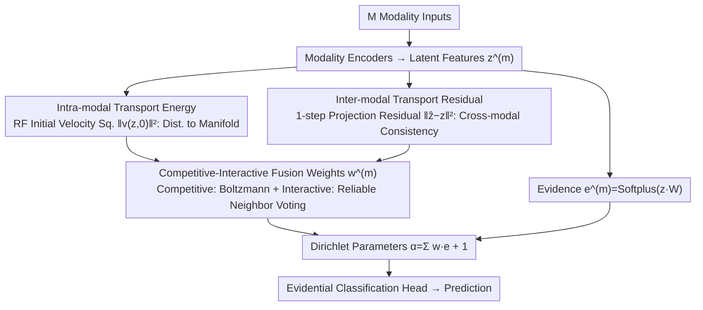

# Geometry-based Schrödinger Bridges for Trustworthy Multimodal Fusion

**Conference**: ICML 2026  
**arXiv**: [2605.31193](https://arxiv.org/abs/2605.31193)  
**Code**: None yet  
**Area**: Multimodal VLM / Trustworthy Fusion / Generative Geometry  
**Keywords**: Trustworthy Multimodal Fusion, Schrödinger Bridge, Rectified Flow, Transport Energy, Evidential Learning

## TL;DR
Ours proposes GMF: using Diffusion Schrödinger Bridge + Rectified Flow in latent space to estimate the "transport correction cost" for each modality (the squared initial velocity $\|v_\theta(z,0)\|^2$). This serves as a geometric reliability signal **decoupled from classifier confidence** to dynamically weight multimodal fusion, thereby breaking the circular dependency of "the model judging itself." It significantly outperforms confidence-based trustworthy fusion baselines under sensor noise and semantic conflict.

## Background & Motivation

**Background**: The mainstream approach for Trustworthy Multimodal Fusion is dynamic fusion—processing each modality independently and then aggregating predictions weighted by "modality quality." Representative methods like TMC, QMF, PDF, and DBF use classifier outputs (entropy, evidence, Dirichlet concentration) as quality scores.

**Limitations of Prior Work**: Deep networks suffer from severe overconfidence (Guo et al. 2017). In scenarios with heavy noise, OOD (Out-of-Distribution) data, or semantic conflict, the classifier may be "confidently wrong"—meaning the output probability is sharp but the answer is incorrect. Confidence-based methods equate "how confident I am" with "how clean the input is," thus failing to identify this confident-but-wrong failure mode.

**Key Challenge**: Reliability assessment and the assessed prediction originate from the same model, creating a **circular dependency**—using the prediction to judge the reliability of the prediction. When the classifier is deceived, all reliability metrics dependent on its output fail simultaneously.

**Goal**: To construct a reliability signal **independent of the classifier's decision boundary**, ensuring that the fusion mechanism can correctly identify bad modalities and reduce their weights even when the classifier is deceived by severe noise or conflicting inputs.

**Key Insight**: The authors redefine "modality quality" as **latent space geometric deviation**—clean samples cluster on the data manifold, while OOD/noisy samples are far from it. How to measure "remoteness"? Via Optimal Transport: the "correction work" required to transport a sample to a reference distribution.

**Core Idea**: A Diffusion Schrödinger Bridge is used to learn a transport path from latent features to a reference distribution, and Rectified Flow is used to straighten the path into a single-step linear prediction. The **squared initial velocity** $\|v_\theta(z,0)\|^2$ serves as an efficient "geometric unreliability score"—clean samples have low transport costs, while noisy/conflicting samples have high transport costs. This metric is completely decoupled from classifier logits.

## Method

### Overall Architecture

GMF aims to resolve the circular dependency of "the model judging itself" by moving the quality score of each modality away from classifier outputs to geometric measurements in latent space. $M$ modalities are first processed by encoders to obtain latent features $z^{(m)} = E^{(m)}(x^{(m)}) \in \mathbb{R}^d$. GMF then simultaneously calculates two types of "transport correction costs" in latent space: intra-modal (distance from the clean manifold) and inter-modal (consistency with other modalities). These are combined via a competitive-interactive gating mechanism into fusion weights $w^{(m)}$. Finally, these are assembled with evidence $\mathbf{e}^{(m)} = \text{Softplus}(z^{(m)} W_{\text{cls}}^{(m)})$ into Dirichlet parameters $\boldsymbol{\alpha} = \sum_m w^{(m)} \mathbf{e}^{(m)} + \mathbf{1}$ for the evidential classification head. The gradient paths of the geometric and decision branches are intentionally separated to prevent the classifier from pulling the geometric metrics back toward its own decision boundary.

### Key Designs

**1. Intra-modal Transport Energy: A Scalar Decoupled from the Classifier**

To break the circular dependency, the key is to provide each modality with a quality score that **ignores classifier output**. GMF redefines "quality" as latent space geometric deviation—clean samples cluster on the data manifold with low transport costs, while noisy/missing samples are far from the manifold with high transport costs. Formally, this is a Schrödinger Bridge problem $\min_v \int_0^1 \mathbb{E}\|v_t\|^2 dt$. Since direct iterative integration is slow, Rectified Flow is used to linearize the transport path: regressing a constant velocity on the interpolation $z_t = (1-t)z_0 + t z_1$. The objective is $\mathcal{L}_{\text{RF}} = \mathbb{E}_{t, z_0, z_1}\|v_\theta(z_t, t) - (z_1 - z_0)\|^2$, transporting $z^{(m)}$ to a **class-agnostic reference prior** $\mathcal{P}_{\text{prior}}$. During inference, the velocity field is evaluated only once at the source point, and $\mathcal{E}_{\text{intra}}^{(m)} = \|v_\theta^{(m)}(z^{(m)},0)\|_2^2$ is used as the modality's intrinsic quality score. This design offers three advantages: low single-step inference latency for online deployment; evaluation at the source point maintains inference distribution consistency with training; and crucially, this quantity is completely orthogonal to classifier logits—a classifier can be "confidently wrong," but it cannot hide "how far the sample is from the manifold." Thus, an external detector for confident-but-wrong failures is established.

**2. Inter-modal Transport Residual: Directly Capturing Semantic Conflict**

Evaluating single-modality cleanliness is insufficient; two modalities might be clean individually but contradictory (e.g., mismatched image-text pairs). GMF does not rely on decoders but learns an independent cross-modal velocity field $v_\Phi^{(a \to b)}$ for each directed pair $(a \to b)$. Using $\mathcal{L}_{\text{inter}}^{(a \to b)} = \mathbb{E}\|v_\Phi^{(a \to b)}(z_t, t) - (z^{(b)} - z^{(a)})\|^2$, it learns to map the manifold of $a$ to the manifold of $b$. During inference, a single-step projection $\hat{z}^{(a \to b)} = z^{(a)} + v_\Phi^{(a \to b)}(z^{(a)}, 0)$ is performed. A larger residual $\mathcal{E}_{\text{inter}}^{(a \to b)} = \|\hat{z}^{(a \to b)} - z^{(b)}\|_2^2$ indicates lower consistency between modalities. The paper further proves the **Geometric Barrier Principle (Thm 4.5)**: if two modalities fall on manifolds of different classes, the residual has a lower bound $(\delta - 2\epsilon)^2$. The significance lies in shifting "whether two modalities represent the same thing" from the classifier level—where both can be overconfident—to the latent geometric level, which the classifier cannot forge.

**3. Competitive-Interactive Fusion Weights: Double Weight Reduction for Confident but Conflicting Modalities**

With the intrinsic quality score $\mathcal{E}_{\text{intra}}$ and cross-modal consistency $\mathcal{E}_{\text{inter}}$, they must be synthesized into the final weight $w^{(m)}$, ensuring modalities that are "neither clean nor endorsed by neighbors" are suppressed. GMF uses a two-layer gating mechanism: the competitive layer assigns a base score via Boltzmann distribution $\beta_{\text{comp}}^{(m)} = \exp(-\mathcal{E}_{\text{intra}}^{(m)}/\tau) / \sum_k \exp(-\mathcal{E}_{\text{intra}}^{(k)}/\tau)$, favoring inherently clean modalities; the interactive layer $\gamma_{\text{int}}^{(m)} = \lambda \sum_{k \neq m} r^{(k)} \exp(-\mathcal{E}_{\text{inter}}^{(k \to m)}/\kappa)$ collects geometric votes from "reliable neighbors," where $r^{(k)} = \sigma(\theta_r - \mathcal{E}_{\text{intra}}^{(k)})$ is a soft gate for neighbor reliability. After adding $\epsilon_\gamma$ for stability and normalizing, we obtain $w^{(m)} = \beta_{\text{comp}}^{(m)} \tilde{\gamma}_{\text{int}}^{(m)} / \sum_j \beta_{\text{comp}}^{(j)} \tilde{\gamma}_{\text{int}}^{(j)}$. The effect of this overlapping structure is dual suppression: the competitive term ensures clean modalities receive weight, while the interactive term exponentially suppresses modalities rejected by reliable neighbors (matching the conflict modality inhibition in Corollary 4.6). Thus, confident but conflicting modalities are suppressed twice, and the circular dependency is broken. The paper also proves (Thm 4.4) that this weight is the Gibbs solution to an entropy-regularized minimization problem, providing a theoretical foundation for the gating form.

### Loss & Training

The total objective is $\mathcal{L}_{\text{total}} = \mathcal{L}_{\text{task}} + \lambda_{\text{geo}} \mathcal{L}_{\text{geo}} + \lambda_{\text{reg}} \mathcal{L}_{\text{reg}}$. Where:

- $\mathcal{L}_{\text{geo}} = \sum_m \mathcal{L}_{\text{intra}}^{(m)} + \sum_{a \neq b} \mathcal{L}_{\text{inter}}^{(a \to b)}$ trains all RF velocity fields;
- $\mathcal{L}_{\text{task}}$ is the evidential cross-entropy + KL regularization (pulling toward a uniform Dirichlet to penalize overconfidence with insufficient evidence);
- $\mathcal{L}_{\text{reg}} = (1 - \rho)^\zeta \cdot \text{KL}(\text{Dir}(\boldsymbol{\alpha}) \| \text{Dir}(\mathbf{1}))$ uses a global consistency coefficient $\rho = \frac{1}{M(M-1)} \sum_{a \neq b} \exp(-\mathcal{E}_{\text{inter}}^{(a \to b)}/\kappa)$ to force the prediction toward a uniform distribution when cross-modal disagreement is high.

Key training trick: Stop-gradient (`sg`) is applied to $\mathcal{E}_{\text{intra}}$ and $\mathcal{E}_{\text{inter}}$ when calculating fusion weights. This ensures $\mathcal{L}_{\text{task}}$ only updates encoders and classification heads, while $\mathcal{L}_{\text{geo}}$ only updates velocity fields, preventing task gradients from contaminating the geometric metrics.

## Key Experimental Results

### Main Results

Four benchmarks: NYU Depth V2 (RGB-D), UPMC FOOD-101 (Image-Text), MVSA-Single (Sentiment), and PneumoniaMNIST (X-ray + Report). Comparison with 10 baselines (including TMC, QMF, PDF, DBF, UAW-EEF, etc.).

**Sensor Noise Robustness** (NYU/Food-101 with Gaussian noise $\sigma \in \{1.0, 2.0\}$ or 50% modality loss):

| Dataset | Scenario | Concat | QMF | PDF | DBF | UAW-EEF | **GMF** |
|--------|------|--------|-----|-----|-----|---------|---------|
| NYU | Clean | 68.5 | 71.2 | 72.5 | 72.3 | 71.8 | 71.9 |
| NYU | $\sigma=2.0$ | 28.4 | 45.8 | 47.5 | 49.1 | 50.2 | **55.2** |
| NYU | Incomplete | 35.8 | 56.4 | 58.2 | 60.3 | 61.5 | **64.8** |
| Food-101 | $\sigma=2.0$ | 30.2 | 48.6 | 51.2 | 52.4 | 53.1 | **58.7** |
| Food-101 | Incomplete | 41.2 | 78.5 | 80.6 | 81.3 | 82.4 | **85.4** |

On clean data, GMF is competitive with the best; **as noise increases, its lead grows**—validating the hypothesis that geometric signals remain effective in overconfident scenarios.

**Semantic Conflict Safety** (MVSA-Single, shuffling pairs to create conflict):

| Method | Rejection Rate ↑ | Avg Entropy ↑ | CDR (AUROC) ↑ |
|------|------------------|---------------|---------------|
| QMF | 18.5% | 0.52 | 56.8 |
| PDF | 21.3% | 0.58 | 60.1 |
| DBF | 35.2% | 0.94 | 71.2 |
| **GMF** | **76.8%** | **1.85** | **89.4** |

The conflict rejection rate is **41.6 pp** higher than the runner-up DBF, with AUROC 18.2 pp higher. This indicates that prediction-space evidence methods (QMF/PDF/DBF) barely detect conflicts when both modalities are overconfident but contradictory, while GMF's cross-modal transport residual identifies the conflict directly.

**Medical Risk Stratification** (PneumoniaMNIST): GMF achieves 91.2% accuracy, with a Pearson correlation to correctness of $r=0.78$ (vs. 0.61 for DBF), and ECE reduced to 0.068 (vs. 0.095).

### Ablation Study

| Configuration | Key Metric | Description |
|------|---------|------|
| Full GMF | $\sigma=2.0$ Accuracy 55.2% | Complete model |
| Replace $\mathcal{E}_{\text{intra}}$ with predictive entropy | 36.8% | Drops 18.4 pp; MI(Reliability, Confidence) jumps from 0.10 to 0.67—confirms statistical metrics are highly coupled with confidence, while geometric ones are decoupled |
| Replace flow-based $\mathcal{E}_{\text{inter}}$ with cosine similarity | Conflict detection drops sharply | Indicates semantic conflicts manifest as **nonlinear geometric distortions** in latent space, which linear metrics fail to capture |
| 1-step RF vs. Multi-step ODE integration | Accuracy nearly identical | Validates the RF straightening hypothesis; single-step velocity estimation is sufficient |
| Prior $\mathcal{P}_{\text{prior}}$: $\mathcal{N}(0,I)$ vs $\mathcal{N}(0,\Sigma)$ vs Laplace | Stable performance | The geometric signal stems primarily from the learned transport structure, not prior selection |

### Key Findings

- **Independence of geometric signals is critical**: Replacing $\mathcal{E}_{\text{intra}}$ with entropy causes accuracy to drop to statistical baseline levels and MI to skyrocket, proving that "breaking circular dependency" requires a truly external signal.
- **Exponential gating for conflict detection is empirically supported**: Fig 2(b) shows $w^{(m)}$ decays exponentially relative to $\mathcal{E}_{\text{inter}}$ according to $e^{-\mathcal{E}_{\text{inter}}/\kappa}$. Clean pairs cluster at $\mathcal{E}_{\text{inter}} < 5$, while conflicting pairs cluster at $> 9$, validating the geometric barrier theorem.
- **Single-step RF maintains latency comparable to PDF/DBF** with negligible precision loss, making GMF suitable for safety-critical real-time scenarios.

## Highlights & Insights

- **The "circular dependency" framing is precise**: Previous trustworthy fusion works added various tricks but failed to pinpoint the fundamental structural weakness of "using predictions to evaluate predictions." Once identified, the need for a prediction-free external signal becomes a nearly self-evident design principle.
- **Generative models as geometric probes, not generators**: While Schrödinger Bridge / Rectified Flow are generative models, Ours only uses the **magnitude of the velocity vector** from a single forward pass as a scalar probe, performing no sampling. This "generative byproduct as discriminative signal" approach is transferable to OOD detection, adversarial detection, and anomaly detection.
- **The Geometric Barrier Theorem provides theoretical grounding**: Thm 4.5 gives a lower bound $(\delta - 2\epsilon)^2$ for identifying conflicting modalities, and Thm 4.4 proves the fusion weight is the unique solution for entropy-regularized minimization—providing a clear "geometry → weight → safety" path.
- **Separation of gradient paths during training** is a crucial engineering detail; otherwise, task loss would skew the velocity fields, re-coupling the transport energy with the classifier and re-introducing circular dependency.

## Limitations & Future Work

- Theoretical limitations: Thm 4.5 relies on strong assumptions of "latent class-manifold separability" and "local cross-modal $\xi$-semantic consistency," which fail if representation learning fails or modalities are fundamentally misaligned.
- **The number of cross-modal velocity fields scales quadratically with $M$** (one for each directed pair $v_\Phi^{(a \to b)}$), leading to parameter and training cost inflation for $M \geq 4$. Ours only tested $M=2$.
- **Class-agnostic reference prior** $\mathcal{P}_{\text{prior}}$ strips class info; whether it can distinguish "intra-class distribution shifts" (e.g., different domains for the same class) requires further verification.
- **Rejection Rate of 76.8% on MVSA-Single** is high but implies 23% of conflicts remain undetected, which is still insufficient for safety-critical medical or autonomous driving deployment.
- Future directions: (1) Using an amortized cross-modal field to reduce parameters from $O(M^2)$ to $O(M)$; (2) Integrating geometric transport energy as an external signal for LLM-based fusion; (3) Extending the "geometric barrier" to the temporal dimension for video/time-series trustworthy fusion.

## Related Work & Insights

- **vs. QMF / PDF / TMC** (Evidence/Entropy-based fusion): They derive quality scores from classifier outputs; Ours derives them from latent geometry. GMF's core advantage is breaking the shared circular dependency, though it requires training $M + M(M-1)$ velocity fields.
- **vs. DBF / UAW-EEF** (Recent SOTA modeling disagreement): They model conflict but still calculate disagreement in the belief mass or classifier logit space; Ours' inter-modal residual $\mathcal{E}_{\text{inter}}$ performs alignment in latent space, providing an external signal that cannot be forged. The 76.8% vs. 35.2% rejection rate on MVSA highlights the "battlefield advantage."
- **vs. Evidential Deep Learning (EDL)**: EDL uses Dirichlet to express "uncertainty," but it is still classifier introspection. GMF retains the EDL evidence head but replaces the weight generator with a geometric module, acting as "EDL + external geometric prior."
- **vs. OOD Detection using Diffusion/Flow** (Pinaya 2022, etc.): Previous work used reconstruction likelihood or sampling trajectory length, requiring decoders or multi-step sampling. Using the initial velocity of Rectified Flow as a scalar proxy is a significant efficiency improvement for multimodal fusion.

## Rating
- Novelty: ⭐⭐⭐⭐ "Diagnosing trustworthy fusion failure as circular dependency and using RF/SB geometric probes to break it" is a refreshing and systematized perspective.
- Experimental Thoroughness: ⭐⭐⭐⭐ Covered 4 benchmarks, 10 baselines, and 3 types of stress tests. The quantification of decoupling (MI 0.10 vs 0.67) is convincing, though scalability for $M \geq 3$ was not tested.
- Writing Quality: ⭐⭐⭐⭐ The "circular dependency" narrative clarifies the motivation perfectly. Theory matches experiments well, though math density is high and some notation overlaps.
- Value: ⭐⭐⭐⭐ Trustworthy fusion is a high-demand area for autonomous driving and medical AI. The paradigm of "using generative byproducts as external reliability signals" is highly generalizable.

<!-- RELATED:START -->

## Related Papers

- [\[NeurIPS 2025\] Grasp2Grasp: Vision-Based Dexterous Grasp Translation via Schrödinger Bridges](../../NeurIPS2025/image_generation/grasp2grasp_vision-based_dexterous_grasp_translation_via_schrödinger_bridges.md)
- [\[ICLR 2026\] Branched Schrödinger Bridge Matching](../../ICLR2026/image_generation/branched_schrödinger_bridge_matching.md)
- [\[CVPR 2026\] CaReFlow: Cyclic Adaptive Rectified Flow for Multimodal Fusion](../../CVPR2026/image_generation/careflow_cyclic_adaptive_rectified_flow_for_multimodal_fusion.md)
- [\[ICML 2026\] Geometry-Aware Tabular Diffusion](geometry-aware_tabular_diffusion.md)
- [\[ICML 2026\] Discrete Diffusion Samplers and Bridges: Off-Policy Algorithms and Applications in Latent Spaces](discrete_diffusion_samplers_and_bridges_off-policy_algorithms_and_applications_i.md)

<!-- RELATED:END -->
