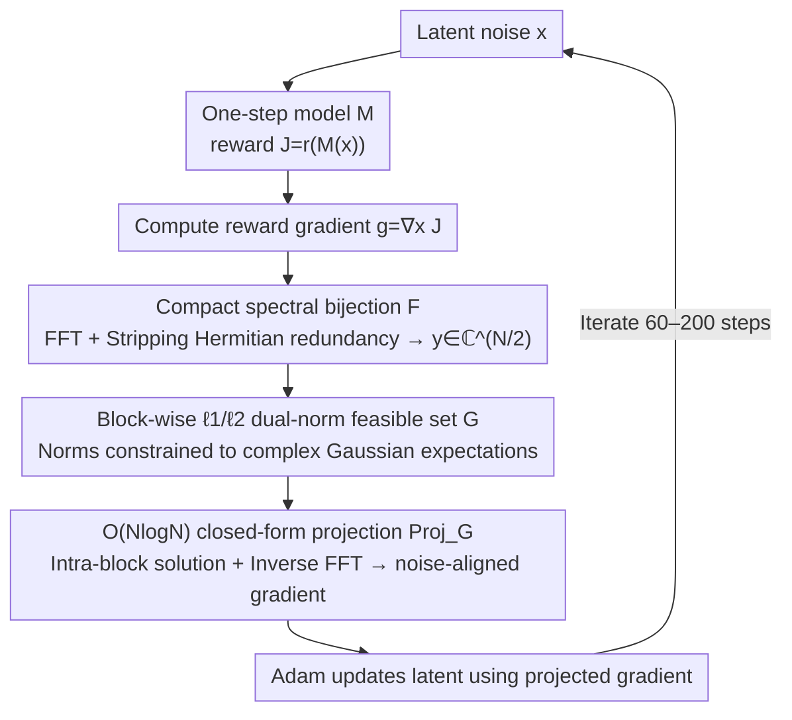

# Gradient Preconditioning for Efficient and Reliable Reward-Guided Generation

**Conference**: ICML 2026  
**arXiv**: [2602.08646](https://arxiv.org/abs/2602.08646)  
**Code**: TBD  
**Area**: Image Generation / Diffusion Models / Test-time Optimization  
**Keywords**: reward-guided generation, one-step generation models, white Gaussian noise constraint, gradient preconditioning, spectral domain projection

## TL;DR
By projecting the reward gradient onto a "white Gaussian noise feasible set" characterized by a DFT block-wise $\ell_1/\ell_2$ norm, the authors make test-time latent optimization for one-step generation models both fast and stable: on FLUX, it matches the Aesthetic Score of the SOTA regularization method MPGR in only 30% of the wall-clock time and completely avoids reward hacking.

## Background & Motivation

**Background**: As distillation techniques like shortcut/consistency enable "one-step generation" for diffusion and flow models, performing gradient ascent directly on the latent noise $\bm{x} \in \mathbb{R}^N$ during inference to maximize a reward $r(\mathcal{M}(\bm{x}))$ has become a popular direction (e.g., ReNO, MPGR, ORIGEN). This test-time reward-guided generation is lightweight as it requires no retraining and allows for plug-and-play rewards.

**Limitations of Prior Work**: This test-time latent optimization faces two critical bottlenecks in practice. The first is **reward hacking**—as the latent moves along the gradient, it deviates from the white Gaussian prior, leading to artifacts or collapsed images despite achieving high reward scores. The second is **speed**—even with one-step models, a single image often requires hundreds of gradient updates, taking tens of seconds to minutes.

**Key Challenge**: Existing methods (ReNO, PRNO, MPGR) follow a **soft regularization** approach, adding a term $-\lambda \mathcal{L}_{\text{reg}}(\bm{x})$ to the objective to encourage Gaussian properties (e.g., $\ell_2$ norm, spectral block $\ell_1$). However, soft regularization has three flaws: (i) it does not guarantee the latent stays within the noise-like region; (ii) it requires manual tuning of $\lambda$, where the weight is coupled with the learning rate; and (iii) it fails to stop the optimizer once a shortcut (e.g., exploding a specific frequency component) is found.

**Goal**: Upgrade "maintaining white Gaussian properties" from a soft constraint to a **hard constraint** without sacrificing speed (requiring a closed-form projection of at most $\mathcal{O}(N \log N)$ per step).

**Key Insight**: The authors observe that MPGR's spectral block $\ell_1$ penalty already characterizes white noise spectral flatness well. The goal is to upgrade this to a "hard set" projection. Direct projection on raw DFT coefficients $\hat{\bm{x}} = \bm{F}\bm{x}$ is problematic due to Hermitian symmetry in real-valued signals, which couples blocks and mixes real/complex coefficients. By first **stripping Hermitian redundancy** and reorganizing independent degrees of freedom into a compact complex vector $\bm{y} \in \mathbb{C}^{N/2}$, the problem decouples into $P$ independent projections onto the intersection of $\ell_1$ and $\ell_2$ balls, which has a known closed-form solution.

**Core Idea**: Use a **bijection $\mathcal{F}: \mathbb{R}^N \to \mathbb{C}^{N/2}$** to map the white Gaussian prior to a compact spectral domain. A feasible set $\mathcal{G}_{\mathbb{C}}$ is defined where the $\ell_1$ and $\ell_2$ norms of each size-$B$ block equal their theoretical expectations under $\mathcal{CN}(0,1)$. Each reward gradient is projected back to $\mathcal{G}_{\mathbb{R}} = \mathcal{F}^{-1}(\mathcal{G}_{\mathbb{C}})$ to obtain a noise-aligned update direction.

## Method

### Overall Architecture
The method addresses the trade-off between speed and reward hacking in test-time optimization. The original reward ascent loop is maintained—calculating reward $J = r(\mathcal{M}(\bm{x}))$, computing gradient $\bm{g} = \nabla_{\bm{x}} J$, and updating with Adam—but a projection operator is inserted before the Adam update. This operator projects $\bm{g}$ onto a feasible set $\mathcal{G}$ representing "white Gaussian noise" (Algorithm 1). The key paradigm shift is that instead of adding a noise penalty to the objective ($\max_{\bm{x}} r(\mathcal{M}(\bm{x})) - \lambda \mathcal{L}_{\text{reg}}(\bm{x})$), this method enforces noise properties in the **update direction**. This requires no hyperparameters and locks the search within a subspace compatible with white noise. The efficiency relies on the design of the projection operator $\text{Proj}_{\mathcal{G}}$, which is both precise and computable in $\mathcal{O}(N\log N)$.

### Key Designs

**1. Compact Spectral Bijection $\mathcal{F}$: Decoupling Projection by Stripping Hermitian Redundancy**

Defining hard constraints directly on DFT coefficients $\hat{\bm{x}} = \bm{F}\bm{x}$ is infeasible because Hermitian symmetry ($\hat{x}_k = \overline{\hat{x}_{N-k}}$) couples different frequency blocks. The authors solve this by stripping redundancy: for even $N$, only $\hat{x}_0$ and $\hat{x}_{N/2}$ are real, and there are only $N/2$ independent complex degrees of freedom. Defining $y_0 = \tfrac{\hat{x}_0}{\sqrt 2} + \tfrac{\hat{x}_{N/2}}{\sqrt 2} i$ and $y_k = \hat{x}_k\,(k = 1, \dots, N/2-1)$ yields a compact vector $\bm{y} \in \mathbb{C}^{N/2}$. Proposition 4.1 proves $\mathcal{F}$ is a bijection between $\mathbb{R}^N \leftrightarrow \mathbb{C}^{N/2}$ where $\bm{z} \sim \mathcal{CN}(\bm 0, \bm I_{N/2})$ iff $\mathcal{F}^{-1}(\bm{z}) \sim \mathcal{N}(\bm 0, \bm I_N)$. Proposition 4.2 provides the isometry $\|\mathcal{F}^{-1}(\bm z)\|_2^2 = 2\|\bm z\|_2^2$. This translates spatial white noise constraints into the compact spectral domain, allowing for efficient decoupled block-wise projection.

**2. Block-wise $\ell_1/\ell_2$ Dual-Norm Feasible Set $\mathcal{G}$: Precise White Noise Statistics**

In the compact spectral domain, $\bm{y}$ is divided into $P = N/(2B)$ blocks of size $B$ (typically $B=16$). For each block, both the $\ell_1$ and $\ell_2$ norms are strictly forced to their theoretical expectations under $\mathcal{CN}(0,1)$: $\|\bm{y}^{(p)}\|_1 = \tfrac{\sqrt\pi}{2}B$ and $\|\bm{y}^{(p)}\|_2^2 = B$. The $\ell_2$ constraint ensures the total energy aligns with the mode of the $\chi_N$ distribution ($\|\bm{x}\|_2^2 = N$), while the $\ell_1$ constraint suppresses any single dominant frequency, ensuring the spectral flatness characteristic of white noise. Compared to MPGR's soft $\ell_1$ penalty, this creates a strictly smaller feasible set that excludes shortcut solutions leading to artifacts. Validation using 1.1M Gaussian samples shows that the cosine similarity between $\bm{x} \sim \mathcal{N}(\bm 0, \bm I_N)$ and its projection onto $\mathcal{G}_{\mathbb{R}}$ is at least $0.988$, confirming the constraint does not distort the prior.

**3. $\mathcal{O}(N\log N)$ Closed-form Projection $\text{Proj}_{\mathcal{G}}$: Computationally Efficient Hardware Constraints**

The isometry from Proposition 4.2 ensures the spatial domain nearest-point problem has the same optimal solution in the compact spectral domain. The projection is decomposed into $P$ independent sub-problems on the intersection of $\ell_1$ and $\ell_2$ balls, solved in closed-form using the method by Liu et al. (2020) in $\mathcal{O}(B\log B)$. For each block, magnitudes $|y_j|$ are sorted to find a threshold $\lambda^{(k^*)}$ using prefix sums, followed by a ReLU soft-thresholding operation to yield the projected values. The entire process is $\mathcal{O}(N\log N)$ and accounts for only **0.04%** of the wall-clock time per iteration on FLUX.

### Loss & Training
There is no explicit loss term beyond the reward $r$ and the projection constraint. Optimization uses Adam (LR 0.02 for FLUX, 0.1 for SDXL-Turbo) with gradient clipping at 0.03. Typical iterations are 200 for FLUX and 50 for SDXL-Turbo. Projections are applied to both the gradient and the latent itself.

## Key Experimental Results

### Main Results
Evaluation follows the MPGR setup: one reward (Aesthetic Score, PickScore, HPSv2, or ImageReward) is optimized while the others are held-out to detect reward hacking.

| Method | Iters | Aesthetic Score (target) ↑ | PickScore (held-out) | Wall-clock (s) ↓ |
|------|-------|---------------------------:|---------------------:|-----------------:|
| No Opt. | 0 | 5.99 | 0.219 | — |
| ReNO | 200 | 7.06 | 0.219 | 232.0 |
| PRNO | 200 | 7.02 | 0.218 | 255.4 |
| MPGR (SOTA) | 200 | 7.13 | 0.220 | 235.5 |
| **Ours (60 iters)** | 60 | **7.12** | 0.220 | **69.7** |
| **Ours (200 iters)** | 200 | **8.91** | 0.220 | 232.2 |

Key findings: (1) **30% wall-clock time** to reach SOTA (60 iterations of Ours vs 200 iterations of MPGR); (2) Significantly higher target reward at equal iterations (8.91 vs 7.13) without dropping in held-out metrics.

### Ablation Study

| Configuration | Phenomenon | Description |
|------|------|------|
| No Reg. | High reward, broken image | Standard reward hacking |
| $\ell_2$ Reg. | Cosine similarity 0.222 | Only total energy constrained; correlations fail |
| MPGR (Soft $\ell_1$) | Cosine similarity 0.548 | Slow and susceptible to hacking |
| **Ours** (Hard Set) | **High similarity, no hacking** | Latent remains aligned with initial noise; high fidelity |

Diversity metrics (IS = 21.10, Vendi = 6.97) remain consistent with the unoptimized baseline, indicating **no mode collapse**.

### Key Findings
- **Negligible Overhead**: The projection accounts for only 0.04% of iteration time.
- **Directional Accuracy**: Updating in a noise-aligned subspace yields higher reward gains per step, reducing the needed iterations.
- **Hard > Soft**: Hard constraints are more robust and stable than soft penalties, preventing artifacts even in high-iteration regimes.

## Highlights & Insights
- **Elegant Redundancy Stripping**: Using $\mathcal{F}$ to decouple the spectral projection problem is a highly reusable technique for any work involving spectral constraints on real signals.
- **Gradient Preconditioning Perspective**: This shifts the focus from modifying the objective function (regularization) to modifying the **optimization geometry**. The search is restricted to a subspace compatible with the prior.
- **Zero Hyperparameters**: Unlike baseline methods requiring $\lambda$ tuning, this method is hyperparameter-free and more robust for engineering deployment.

## Limitations & Future Work
- Currently validated only on one-step models; application to multi-step diffusion intermediate states remains unexplored.
- Feasible sets are based on theoretical expectations; in low-dimensional latents where block counts $P$ are small, the variance might necessitate "softened" hard constraints.
- Assumes isotropic Gaussian priors; not directly applicable to categorical or discrete tokens.

## Related Work & Insights
- **vs ReNO/PRNO**: ReNO uses $\ell_2$ soft reg which is easily bypassed by rewards; PRNO works in the spatial domain. This work proves that spectral dual-norm hard constraints are superior.
- **vs MPGR**: This work builds on MPGR's spectral block idea but improves it by (i) adding $\ell_2$ constraints, (ii) solving Hermitian coupling, and (iii) using closed-form projection instead of inner-loop gradient descent.
- **Inference-time Scaling**: This approach provides a blueprint for efficient test-time alignment in other domains (video, 3D) by designing appropriate closed-form projections for their respective latent priors.

## Rating
- Novelty: ⭐⭐⭐⭐ (Elegant technical solution building on recent spectral insights)
- Experimental Thoroughness: ⭐⭐⭐⭐ (Comprehensive across multiple rewards and models)
- Writing Quality: ⭐⭐⭐⭐⭐ (Rigorous math and clear motivation)
- Value: ⭐⭐⭐⭐⭐ (Zero-overhead, hyperparameter-free SOTA upgrade)

<!-- RELATED:START -->

## Related Papers

- [\[ICML 2026\] Pareto-Guided Optimal Transport for Multi-Reward Alignment](pareto-guided_optimal_transport_for_multi-reward_alignment.md)
- [\[CVPR 2026\] EgoFlow: Gradient-Guided Flow Matching for Egocentric 6DoF Object Motion Generation](../../CVPR2026/image_generation/egoflow_gradient-guided_flow_matching_for_egocentric_6dof_object_motion_generati.md)
- [\[ICML 2026\] Divide and Conquer: Reliable Multi-View Evidential Learning for Deepfake Detection](divide_and_conquer_reliable_multi-view_evidential_learning_for_deepfake_detectio.md)
- [\[ICML 2026\] DGS-Net: Distillation-Guided Gradient Surgery for CLIP Fine-Tuning in AI-Generated Image Detection](dgs-net_distillation-guided_gradient_surgery_for_clip_fine-tuning_in_ai-generate.md)
- [\[ICML 2026\] Recovering Hidden Reward in Diffusion-Based Policies](recovering_hidden_reward_in_diffusion-based_policies.md)

<!-- RELATED:END -->
