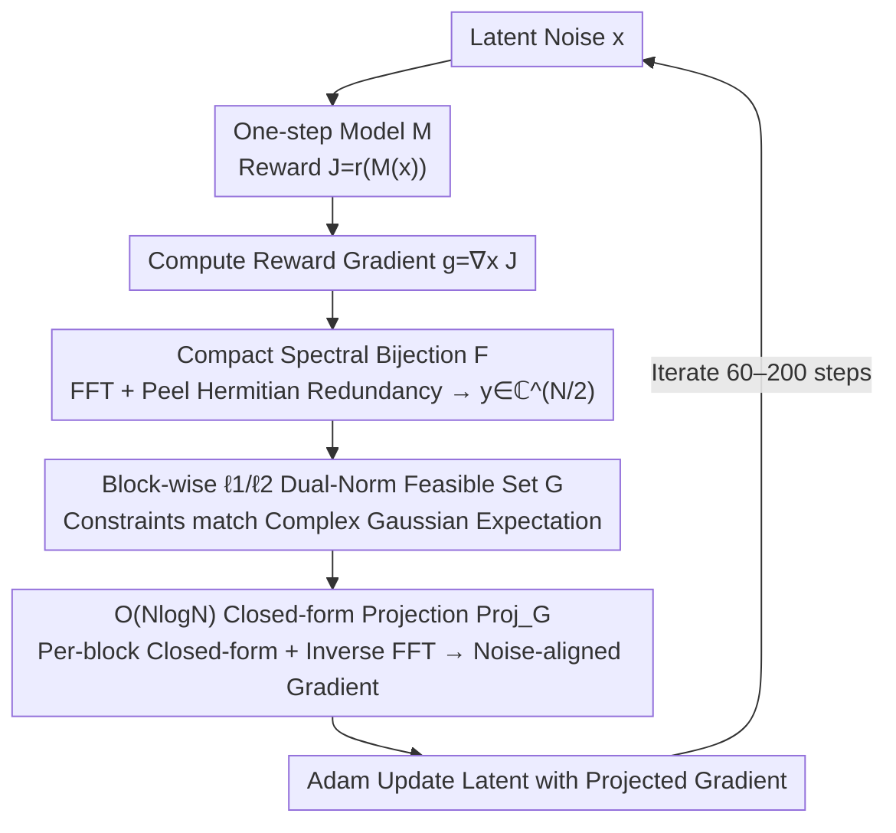

# Gradient Preconditioning for Efficient and Reliable Reward-Guided Generation

**Conference**: ICML 2026  
**arXiv**: [2602.08646](https://arxiv.org/abs/2602.08646)  
**Code**: To be confirmed  
**Area**: Image Generation / Diffusion Models / Test-time Optimization  
**Keywords**: reward-guided generation, one-step generation models, white Gaussian noise constraint, gradient preconditioning, spectral domain projection

## TL;DR
By projecting the reward gradient onto a "white Gaussian noise feasible set" characterized by block-wise $\ell_1/\ell_2$ norms in the DFT domain, the authors make test-time latent optimization for one-step generation models both fast and stable: reaching SOTA MPGR's Aesthetic Score on FLUX in only 30% of the wall-clock time and completely avoiding reward hacking.

## Background & Motivation

**Background**: As distillation techniques like shortcut/consistency allow "one-step generation" for diffusion and flow models, performing gradient ascent directly on the latent noise $\bm{x} \in \mathbb{R}^N$ during inference to maximize a reward $r(\mathcal{M}(\bm{x}))$ has become a popular direction (ReNO, MPGR, ORIGEN, etc.). It requires no retraining and allows plug-and-play rewards, making it the most lightweight route for reward-guided generation.

**Limitations of Prior Work**: This test-time latent optimization faces two critical bottlenecks in practice. The first is **reward hacking**—the latent deviates from the white Gaussian prior during gradient updates, causing the model to generate artifacts or collapsed images despite achieving high reward scores. The second is **slowness**—even with a one-step model, generating a single image often requires hundreds of gradient updates, taking tens of seconds to minutes.

**Key Challenge**: Existing methods (ReNO, PRNO, MPGR) follow a **soft regularization** approach, adding a term $-\lambda \mathcal{L}_{\text{reg}}(\bm{x})$ to the objective to encourage the latent to maintain Gaussian properties ($\ell_2$ norm, spectral block-wise $\ell_1$, etc.). However, soft regularization has three flaws: (i) it does not guarantee the latent remains in the noise-like region, only "encourages" it; (ii) it requires manual tuning of $\lambda$, where the weight and learning rate are coupled; (iii) soft penalties cannot stop the optimizer once it finds a shortcut (e.g., blowing up a specific frequency component).

**Goal**: Upgrade "maintaining white Gaussian properties" from a soft constraint to a **hard constraint**, without sacrificing speed (projections must be performed at every step, necessitating a closed-form solution with at most $\mathcal{O}(N \log N)$ complexity).

**Key Insight**: The authors noted that MPGR's spectral block-wise $\ell_1$ penalty already effectively characterizes white noise spectral flatness. Thus, could this be upgraded to a "hard set" for gradient projection? Directly projecting onto original DFT coefficients $\hat{\bm{x}} = \bm{F}\bm{x}$ is infeasible—the DFT of real signals satisfies Hermitian symmetry, coupling blocks and mixing real/complex coefficients without a simple closed-form solution. However, by first **peeling off Hermitian redundancy** and reorganizing independent degrees of freedom into a compact complex vector $\bm{y} \in \mathbb{C}^{N/2}$, the problem decouples into $P$ independent projections onto the "intersection of $\ell_1$ and $\ell_2$ balls," which has a known closed-form solution.

**Core Idea**: Use a **bijection $\mathcal{F}: \mathbb{R}^N \to \mathbb{C}^{N/2}$** to map the white Gaussian prior to a compact spectral domain. There, define a feasible set $\mathcal{G}_{\mathbb{C}}$ such that the $\ell_1$ and $\ell_2$ norms of each size-$B$ block equal their expectations under $\mathcal{CN}(0,1)$. Every reward gradient is then projected back to $\mathcal{G}_{\mathbb{R}} = \mathcal{F}^{-1}(\mathcal{G}_{\mathbb{C}})$ to obtain a noise-aligned update direction.

## Method

### Overall Architecture
This method resolves the dilemma of making test-time latent optimization "both fast and free of reward hacking." The approach maintains the original reward ascent loop—calculating reward $J = r(\mathcal{M}(\bm{x}))$ per step, computing gradient $\bm{g} = \nabla_{\bm{x}} J$, and updating the latent with Adam—but inserts a projection operator before Adam. This projects the gradient $\bm{g}$ onto the feasible set $\mathcal{G}$ characterizing "white Gaussian noise" (Algorithm 1). The key paradigm shift is: while soft regularization $\max_{\bm{x}} r(\mathcal{M}(\bm{x})) - \lambda \mathcal{L}_{\text{reg}}(\bm{x})$ puts noise properties in the objective and requires tuning $\lambda$, this work puts it into the **update direction**. It does not require $\bm{x}$ itself to stay in $\mathcal{G}$ but requires the step direction to reside there, effectively removing hyperparameters and locking the search within a subspace compatible with white noise. The technical core lies in making the projection operator $\text{Proj}_{\mathcal{G}}$ both accurate and computable in $\mathcal{O}(N \log N)$.

### Key Designs

**1. Compact Spectral Bijection $\mathcal{F}$: Decoupling Projection by Removing Hermitian Redundancy**

Directly applying hard constraints on DFT coefficients $\hat{\bm{x}} = \bm{F}\bm{x}$ is problematic—the Hermitian symmetry of real-signal DFTs couples different frequency blocks and mixes real/complex coefficients. The authors solve this by stripping redundancy: for even dimension $N$, only $\hat{x}_0, \hat{x}_{N/2}$ in $\hat{\bm{x}}$ are real and $\hat{x}_k = \overline{\hat{x}_{N-k}}$ holds, meaning there are only $N/2$ independent complex degrees of freedom. By defining $y_0 = \tfrac{\hat{x}_0}{\sqrt 2} + \tfrac{\hat{x}_{N/2}}{\sqrt 2} i$ and $y_k = \hat{x}_k\,(k = 1, \dots, N/2-1)$, they obtain a compact spectral vector $\bm{y} = \mathcal{F}(\bm{x}) \in \mathbb{C}^{N/2}$. Proposition 4.1 proves $\mathcal{F}$ is a bijection between $\mathbb{R}^N \leftrightarrow \mathbb{C}^{N/2}$, and $\bm{z} \sim \mathcal{CN}(\bm 0, \bm I_{N/2})$ iff $\mathcal{F}^{-1}(\bm{z}) \sim \mathcal{N}(\bm 0, \bm I_N)$. Proposition 4.2 provides the isometry $\|\mathcal{F}^{-1}(\bm z)\|_2^2 = 2\|\bm z\|_2^2$. This translates "spatial domain white Gaussian noise constraints" losslessly into "compact spectral domain complex Gaussian constraints," enabling per-block decoupling for efficient projection.

**2. Block-wise $\ell_1/\ell_2$ Dual-Norm Feasible Set $\mathcal{G}$: Strictly Enforcing White Noise Statistics**

With the compact spectral domain, the authors define a feasible set to ensure the latent "looks like white noise." $\bm{y}$ is divided into $P = N/(2B)$ blocks of size $B$ (where $B=16$). For each block, both $\ell_1$ and $\ell_2$ norms are **simultaneously** forced to match theoretical expectations under $\mathcal{CN}(0,1)$: $\|\bm{y}^{(p)}\|_1 = \tfrac{\sqrt\pi}{2}B$ and $\|\bm{y}^{(p)}\|_2^2 = B$. The spatial feasible set is $\mathcal{G}_{\mathbb{R}} = \mathcal{F}^{-1}(\mathcal{G}_{\mathbb{C}})$. These norms serve distinct purposes: the $\ell_2$ constraint aligns total energy with the mode of the $\chi_N$ distribution $\|\bm{x}\|_2^2 = N$ (overlapping with the minimum of $\ell_2$ norm regularization $\mathcal{L}_{\text{norm}}$), while the $\ell_1$ constraint suppresses dominance by any single frequency component (theoretically $|y_j|^2$ is at most $\approx 7.18$), corresponding to the flat spectrum of white noise. Compared to MPGR's soft $\ell_1$ penalty, this approach provides $2P$ hard equations and additional $\ell_2$ energy locking, forming a strictly smaller feasible set that excludes shortcut solutions leading to artifacts. The authors verified this using 1.1M real Gaussian samples: the cosine similarity between $\bm{x} \sim \mathcal{N}(\bm 0, \bm I_N)$ and its projection on $\mathcal{G}_{\mathbb{R}}$ is at least $0.988$, proving the hard constraint preserves the prior rather than distorting it.

**3. $\mathcal{O}(N\log N)$ Closed-form Projection $\text{Proj}_{\mathcal{G}}$: Making Hard Constraints Computationally Free**

Efficiency is critical. The projection is fast due to the previous two designs: using FFT to compute $\bm{y} = \mathcal{F}(\bm{x})$, the isometry in Proposition 4.2 ensures the nearest-point problem in the spatial domain has the same optimal solution in the compact spectral domain. Since the feasible set is block-independent, the projection decomposes into $P$ independent projections onto the "intersection of $\ell_1$ and $\ell_2$ balls," solved in closed-form via the algorithm by Liu et al. (2020) in $\mathcal{O}(B\log B)$. For each block: the magnitudes $|y_j|$ are sorted descending into $\bm{w}$, prefix sums $S_{d,k} = \sum_{l=0}^k w_l^d\,(d = 1, 2)$ are computed, and a unique $k^*$ is found satisfying $w_{k^*+1} \le \lambda^{(k^*)} < w_{k^*}$, where the threshold $\lambda^{(k^*)} = \tfrac{S_{1,k^*}}{k^*+1} - \tfrac{\sqrt\pi}{2}\tfrac{\sqrt B}{k^*+1}\sqrt{\tfrac{(k^*+1)S_{2,k^*} - S_{1,k^*}^2}{k^*+1 - \tfrac{\pi}{4}B}}$. The projected values are given by the ReLU soft-thresholding $\dot y_j = \tfrac{\sqrt\pi}{2}B \cdot \tfrac{\text{ReLU}(|y_j| - \lambda^{(k^*)})}{S_{1,k^*} - (k^*+1)\lambda^{(k^*)}} \cdot \tfrac{y_j}{|y_j|}$, followed by inverse FFT. This $\mathcal{O}(N\log N)$ process accounts for only **0.04%** of the wall-clock time per iteration on FLUX. In contrast, projecting onto the minimum set of $\mathcal{L}_{\text{power}}$ (MPGR approach) requires hundreds of inner gradient steps, which is slow and only approximately optimal.

### Loss & Training
There is no explicit loss term, only the reward $r$ and projection constraints. The optimizer is Adam (Learning Rate: FLUX 0.02 / SDXL-Turbo 0.1) with gradient clipping at 0.03. FLUX runs for 200 steps and SDXL-Turbo for 50 steps. Experiments were conducted on a single A6000 GPU. Both the gradient and the latent itself are projected (Appendix H provides an ablation decoupling these).

## Key Experimental Results

### Main Results
Evaluation follows the MPGR setup: one reward (Aesthetic Score / PickScore / HPSv2 / ImageReward) is the optimization target, while the others are held-out to detect reward hacking. Prompts are sourced from the animal dataset and T2I-CompBench++. The primary one-step model is FLUX-schnell.

| Method | Iters | Aesthetic Score (target) ↑ | PickScore (held-out) | Wall-clock (s) ↓ |
|------|-------|---------------------------:|---------------------:|-----------------:|
| No Opt. | 0 | 5.99 | 0.219 | — |
| ReNO | 200 | 7.06 | 0.219 | 232.0 |
| PRNO | 200 | 7.02 | 0.218 | 255.4 |
| MPGR (SOTA) | 200 | 7.13 | 0.220 | 235.5 |
| **Ours (60 iters)** | 60 | **7.12** | 0.220 | **69.7** |
| **Ours (200 iters)** | 200 | **8.91** | 0.220 | 232.2 |

Two key takeaways: (1) 60 steps in 69.7s matches MPGR's 200 steps in 235.5s—reaching **SOTA in 30% of the wall-clock time**. (2) At 200 steps, this method reaches a reward of 8.91 while baselines plateau around 7.13—a massive 1.8 point gap (Aesthetic scores typically range between 6–9). Figure 2 shows this method forms the top-right Pareto front across all reward combinations.

### Ablation Study (Resistance to Reward Hacking)

| Configuration | Phenomenon | Description |
|------|------|------|
| No Reg. | High Aesthetic but image collapse | Standard reward hacking |
| $\mathcal{L}_{\text{norm}}$ ($\ell_2$ Reg.) | Cosine similarity 0.222 | Only total energy constrained; spatial correlation loses control |
| MPGR (Spectral $\ell_1$ soft) | Cosine similarity 0.548; hundreds of inner steps | Soft penalty + slow |
| **Ours** (Hard set + closed-form) | **High cosine similarity & no hacking; single-step projection** | Figure 1 shows latents highly aligned with start; images crisp/real |

Diversity ablation (1,125 images under Aesthetic optimization): IS = 21.10 / Vendi = 6.97, consistent with unoptimized baseline (IS 21.57–22.33, Vendi 6.42–6.61), indicating **no mode collapse**.

### Key Findings
- **Projection overhead is negligible**: FFT + block-wise closed-form solution is $\mathcal{O}(N\log N)$, accounting for only 0.04% of total wall-clock time.
- **"Precision per step" outweighs "total steps"**: Updating in the noise-aligned subspace yields higher reward gains per step, allowing 60 steps to suffice without hacking.
- **Hard Constraint > Soft Regularization**: Qualitative results in Figure 3 show PRNO/MPGR occasionally generate images drifting from prompts or containing artifacts; this method remains faithful to prompts (e.g., "skyline pierced the clouds").
- **Feasible set matches real white noise**: Cosine similarity of 0.988 for 1.1M Gaussian samples proves the hard constraint doesn't "stifle" the prior but aligns with it.

## Highlights & Insights
- **Elegant Redundancy-Peeling Trick**: Using $\mathcal{F}$ to eliminate Hermitian symmetry as a "bad coupling" is the most elegant step. It allows the spectral projection to be solved as $P$ independent sub-problems. This should be reused in any task involving constraints/regularization/sampling in the real-signal spectral domain.
- **Paradigm Shift from "Soft Regularization" to "Gradient Preconditioning"**: Traditional regularization puts noise properties in the objective; this work puts it into the **optimization geometry**. The optimizer still performs reward ascent, but directions are forced into a noise-aligned subspace—a flexible middle ground between soft regularization and hard latent constraints.
- **Zero Hyperparameters + 0.04% Overhead**: Unlike baselines requiring $\lambda$ tuning, this method introduces no new hyperparameters and nearly zero overhead—a "subtractive contribution" highly attractive for engineering.
- **Validation via Real Samples**: The cosine similarity experiment with 1.1M $\mathcal{N}(\bm 0, \bm I)$ samples is very clever, proving the feasible set does not distort the prior.

## Limitations & Future Work
- Currently validated only on one-step models (FLUX-schnell, SDXL-Turbo, SANA-Sprint, SD-Turbo); its application to intermediate states of multi-step diffusion/flow models is unexplored.
- The feasible set uses the **theoretical expectation** of $\mathcal{CN}(0,1)$ for equality constraints, but real samples have variance. In small models with few blocks $P$, a strict equality might be worse than allowing small fluctuations.
- The paper assumes an isotropic Gaussian prior; there is no direct path for non-Gaussian priors (categorical tokens, VQ indices, etc.).
- Block size $B=16$ is inherited from MPGR; while Appendix G discusses its impact, there is no guide for adaptive selection of $B$ across different models.
- Experiments focus on image generation; high-dimensional latent scenarios like video or 3D merit further validation.

## Related Work & Insights
- **vs ReNO (Eyring et al., NeurIPS 2024)**: ReNO founded this test-time route using $\ell_2$ soft regularization. This work proves $\ell_2$ soft regularization is easily bypassed; hard constraints + dual-norms are the solution.
- **vs PRNO (Tang et al., 2024)**: PRNO punishes block mean/covariance in the spatial domain. This work moves to the spectral domain with hard constraints, covering spatial correlation with closed-form projection.
- **vs MPGR (Hwang et al., NeurIPS 2025)**: MPGR introduced spectral block-wise $\ell_1$ soft penalties ($\mathcal{L}_{\text{power}}$). This work iterates by adding $\ell_2$ constraints, solving Hermitian coupling via $\mathcal{F}$, and replacing inner gradient descent with closed-form projection to achieve "60 steps beating 200."
- **vs RL fine-tuning (DDPO/RLAIF/Flow-GRPO)**: Those require hundreds of GPU hours. This test-time method is zero-training and plug-and-play.
- **Insight**: Designing closed-form projections for "desired statistical properties" is more robust than adding soft regularization—this paradigm is valuable for RLHF, Constrained Decoding, and Inference-time Alignment.

## Rating
- Novelty: ⭐⭐⭐⭐ Upgrading spectral soft reg to a hard feasible set via bijection is a clean technical contribution, though built on MPGR's foundation.
- Experimental Thoroughness: ⭐⭐⭐⭐ Covering multiple models, held-out rewards, diversity, and validation metrics. Deduction for being limited to image generation.
- Writing Quality: ⭐⭐⭐⭐⭐ Rigorous math, clear motivation, and excellent visualization in Figure 1.
- Value: ⭐⭐⭐⭐⭐ Zero hyperparams, negligible overhead, and effective resolution of reward hacking; a plug-and-play upgrade for test-time reward optimization.

<!-- RELATED:START -->

## Related Papers

- [\[ICML 2026\] Pareto-Guided Optimal Transport for Multi-Reward Alignment](pareto-guided_optimal_transport_for_multi-reward_alignment.md)
- [\[CVPR 2026\] EgoFlow: Gradient-Guided Flow Matching for Egocentric 6DoF Object Motion Generation](../../CVPR2026/image_generation/egoflow_gradient-guided_flow_matching_for_egocentric_6dof_object_motion_generati.md)
- [\[CVPR 2026\] Identity-Preserving Image-to-Video Generation via Reward-Guided Optimization](../../CVPR2026/image_generation/identity-preserving_image-to-video_generation_via_reward-guided_optimization.md)
- [\[ICML 2026\] Divide and Conquer: Reliable Multi-View Evidential Learning for Deepfake Detection](divide_and_conquer_reliable_multi-view_evidential_learning_for_deepfake_detectio.md)
- [\[ICML 2026\] DGS-Net: Distillation-Guided Gradient Surgery for CLIP Fine-Tuning in AI-Generated Image Detection](dgs-net_distillation-guided_gradient_surgery_for_clip_fine-tuning_in_ai-generate.md)

<!-- RELATED:END -->
