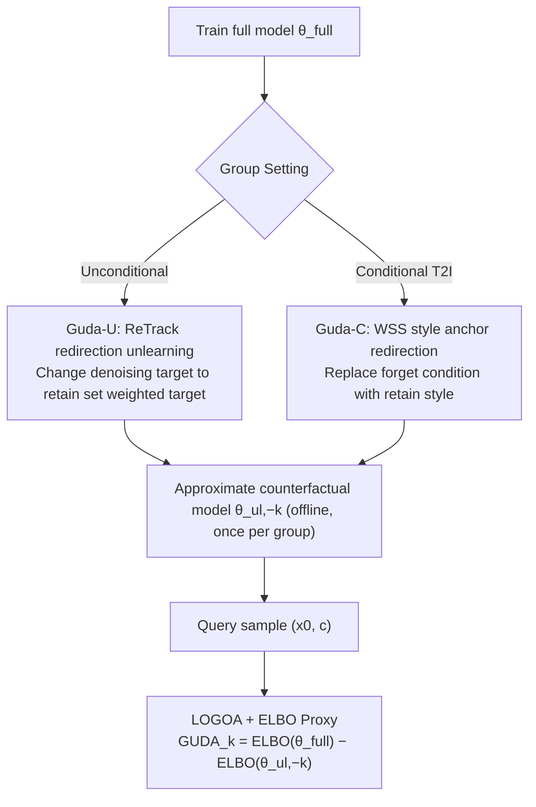

# GUDA: Counterfactual Group-wise Training Data Attribution for Diffusion Models via Unlearning

**Conference**: ICML 2026  
**arXiv**: [2601.22651](https://arxiv.org/abs/2601.22651)  
**Code**: https://github.com/sony/guda (Available)  
**Area**: Explainability / Training Data Attribution / Diffusion Models / Machine Unlearning  
**Keywords**: Training Data Attribution, Counterfactual, Group-wise Attribution, Machine Unlearning, Diffusion Models

## TL;DR
GUDA reformulates "group-wise training data attribution" as a counterfactual question: "How much would the model's log-likelihood for a given sample drop if a specific group were absent during training?" It uses machine unlearning to "erase a group" from the full model to approximate the counterfactual model obtained via Leave-One-Group-Out (LOGO) retraining. Using the difference in ELBO as the attribution score, GUDA proves more accurate than CLIP similarity and instance-level gradient attribution on CIFAR-10 and Stable Diffusion artistic style attribution, while being approximately 100x faster than LOGO retraining.

## Background & Motivation

**Background**: Currently, Training Data Attribution (TDA) for diffusion models mostly stays at the instance level—methods like Influence Function, TracIn, TRAK, D-TRAK, and DAS answer "which specific training sample contributed most to this generation." However, in real-world scenarios such as copyright assessment, fair compensation for data contributors, and style auditing, group-level answers are required: which artist or which object category contributed to this generated image.

**Limitations of Prior Work**: Simply summing instance-level scores does not equate to group-level attribution for two reasons: (1) Poor scalability, as the cost of per-sample evaluation explodes as datasets grow; (2) Non-linearity, where groups interact through shared representations, meaning the collective effect is not simply the sum of individual samples. Existing similarity methods (e.g., CLIP cosine distance) only measure visual similarity in the embedding space and do not reflect the causal effect of "what the model would become if this group were removed during training." Furthermore, using instance-level unlearning signals as attribution (e.g., Wang et al. 2024) has been experimentally shown by the authors to be nearly random at the group level.

**Key Challenge**: The gold standard for group-level attribution is LOGO retraining—retraining a counterfactual model $\theta^{\mathrm{logo}}_{-k}$ from scratch for each group $k$ by excluding $\mathcal{D}_k$, then comparing its explanatory power on a sample against the full model $\theta^{\mathrm{full}}$. While theoretically sound, training $N+1$ models is entirely infeasible as the number of groups grows (LOGO took 207 hours on CIFAR-10 in the paper).

**Goal**: While maintaining the "counterfactual model" as a clear estimation target, find a scalable solution to approximate $\theta^{\mathrm{logo}}_{-k}$ without retraining, and verify the quality of the approximation.

**Key Insight**: The group attribution question "what if group $k$ did not exist" is essentially a data deletion query, which is precisely the task of machine unlearning. Thus, one can start from the full model $\theta^{\mathrm{full}}$ and perform lightweight unlearning fine-tuning on the target group to obtain the counterfactual approximation $\theta^{\mathrm{ul}}_{-k}$.

**Core Idea**: Define the LOGOA counterfactual estimator as the difference in ELBO on a sample between the full model and the LOGO counterfactual model. Then, use "LOGO-targeted" unlearning operators (ReTrack redirection for unconditional models, style anchor redirection for conditional models) to approach the counterfactual model. This replaces "$N+1$ full retrains" with "one full training + one unlearning fine-tuning per group."

## Method

### Overall Architecture

The end-to-end pipeline of GUDA consists of two stages:

1.  **Counterfactual Model Pre-construction**: Train a shared full model $\theta^{\mathrm{full}}$. Then, for each group $k=1,\ldots,N$, apply an unlearning operator $\mathcal{U}$ starting from $\theta^{\mathrm{full}}$ to produce an approximate counterfactual model $\theta^{\mathrm{ul}}_{-k} = \mathcal{U}(\theta^{\mathrm{full}}; \mathcal{D}_k, \mathcal{D}_{-k})$. This stage is performed once and can be reused offline.
2.  **Query-time Scoring**: Given a generated sample $(x_0, c)$, compute the ELBO for each group under $\theta^{\mathrm{full}}$ and $\theta^{\mathrm{ul}}_{-k}$ respectively. The attribution score is $\mathrm{GUDA}_k(x_0, c) = \mathrm{ELBO}(x_0|c; \theta^{\mathrm{full}}) - \mathrm{ELBO}(x_0|c; \theta^{\mathrm{ul}}_{-k})$. A positive score indicates the full model explains the sample better, meaning group $k$ contributed to the generation.

The choice of ELBO is a critical engineering compromise: while log-likelihood can be computed via the probability-flow ODE, running $N$ counterfactual models across many queries is too expensive. As a lower bound, ELBO is highly correlated with log-likelihood (on CIFAR-10, $\Delta \log p$ estimated via ODE is empirically strongly correlated with $\Delta\mathrm{ELBO}$), particularly for identifying top-contributing groups.

The unified unlearning loss structure is $\mathcal{L}_{\text{unlearn}} = \mathcal{L}_{\text{forget}} + \lambda_{\text{pres}} \mathcal{L}_{\text{preserve}}$, where the preservation term $\mathcal{L}_{\text{preserve}} = \mathbb{E}_{(x,c) \sim \mathcal{D}_{-k}, t, \varepsilon}[\|\epsilon_\theta(x_t, t, c) - \epsilon_{\theta^{\mathrm{full}}}(x_t, t, c)\|_2^2]$ uses the frozen full model for score matching to prevent catastrophic forgetting. The forget term $\mathcal{L}_{\text{forget}}$ differs between the unconditional (Guda-U) and conditional (Guda-C) settings.

### Key Designs

**1. LOGOA Counterfactual Estimator + ELBO Proxy: Identifying the oracle first**

Many attribution works propose a scoring formula and immediately compare metrics. GUDA instead starts by defining the ideal answer: for a generated sample $(x_0, c)$ and group $k$, the counterfactual influence is the difference in explanatory power between the full model and the LOGO retrained model: $\mathrm{LOGOA}_k(x_0, c) = \mathrm{ELBO}(x_0|c; \theta^{\mathrm{full}}) - \mathrm{ELBO}(x_0|c; \theta^{\mathrm{logo}}_{-k})$. Ideally, $\log p_\theta$ should be used, but since log-likelihood estimation in diffusion models via ODE is expensive, it is replaced by the tractable ELBO. The benefit of defining the oracle clearly is that the quality of any subsequent unlearning method has a direct validation target—how close it is to $\theta^{\mathrm{logo}}_{-k}$. This also explains why the instance-level method of Wang et al. (2024) is nearly random for group attribution: their estimator does not point toward $\theta^{\mathrm{logo}}_{-k}$.

**2. Guda-U: ReTrack Redirection Unlearning for Unconditional Settings**

With the oracle defined, the remaining problem is approximating $\theta^{\mathrm{logo}}_{-k}$ without retraining. The pain point is that general unlearning losses (like ESD) only focus on "stopping the model from generating content from group $k$," which does not align with the LOGO counterfactual. ReTrack modifies the denoising target: when noise is added to $x_0^{(f)} \in \mathcal{D}_k$ to get $x_t$, the model is no longer trained to predict the original noise $\varepsilon$. Instead, it predicts an importance-weighted target on the retain set: $\bar{\varepsilon}_t(x_t) = \sum_{x_0^{(r)} \in \mathcal{D}_{-k}} w_t(x_t; x_0^{(r)}) (x_t - \sqrt{\bar{\alpha}_t} x_0^{(r)})/\sigma_t$, where weights $w_t \propto q_t(x_t|x_0^{(r)})$. In practice, only the top $K$ neighbors are used. The full ReTrack includes a density ratio correction term, making the unlearning objective equivalent in expectation to "training only on the retain set"—exactly what LOGO seeks. The choice of unlearning operator determines the counterfactual approximation quality; swapping ReTrack for ESD drops Top-1 from 72.7% to 61.9% on CIFAR-10.

**3. Guda-C: Weighted Style Selection (WSS) Anchors for Conditional T2I**

Directly applying ReTrack to text-to-image models like Stable Diffusion fails due to a new challenge: once style $k$ is "deleted," prompts containing style $k$ become out-of-support for retain-only training. The denoising problem restructured by LOGO would have a forget condition outside the training support, leaving the posterior target undefined. WSS solves this by constructing anchor conditions $c_a$ for a forget sample $(x_f, c_f) \sim \mathcal{D}_k$: it keeps the content description (objects/scenes) in $c_f$ but replaces the style description with a style $s$ sampled from retain styles $\mathcal{S}_{\text{retain}}$ weighted by CLIP similarity. The unlearning loss then aligns the unlearning model's prediction under the forget condition with the frozen full model's prediction under the retain anchor: $\mathcal{L}_{\text{forget}}^{(C)} = \mathbb{E}[\|\epsilon_\theta(x_t, t, c_f) - \epsilon_{\theta^{\mathrm{full}}}(x_t, t, c_a)\|_2^2]$. This redirects the forget condition back to the retain prompt distribution and ensures the supervision target remains consistent with the content of the current noisy latent $x_t$.

### Loss & Training

The total loss is $\mathcal{L}_{\text{unlearn}} = \mathcal{L}_{\text{forget}} + \lambda_{\text{pres}} \mathcal{L}_{\text{preserve}}$. $\mathcal{L}_{\text{forget}}^{(U)}$ for Guda-U is the ReTrack importance-weighted target; $\mathcal{L}_{\text{forget}}^{(C)}$ for Guda-C is the WSS anchor redirection. The preservation term consistently uses score-matching distillation to the retain set. Each counterfactual on CIFAR-10 runs for only 20 epochs (compared to 2,400 for LOGO training). On UnlearnCanvas, fine-tuning from an SD 1.5 checkpoint is used for both LOGO and unlearning, reflecting realistic engineering costs for large models.

## Key Experimental Results

### Main Results

CIFAR-10 (10 classes, 2,048 queries, group attribution comparison):

| Method | Top-1 ↑ | NDCG@3 ↑ | Spearman ↑ | Total Time |
|--------|---------|----------|------------|------------|
| GUDA (ReTrack) | **0.727** | **0.677** | 0.265 | 2:02 |
| GUDA w/ ESD | 0.619 | 0.634 | 0.241 | 1:33 |
| CLIPA (Similarity) | 0.662 | 0.646 | 0.246 | <1s |
| DAS (Instance-level Grad) | 0.716 | 0.675 | **0.267** | 35:24 |
| D-TRAK | 0.609 | 0.639 | 0.258 | 30:30 |
| TRAK | 0.118 | 0.317 | 0.030 | 30:58 |
| LOGOA (Oracle) | — | — | — | 207:47 |

UnlearnCanvas (Stable Diffusion 1.5, 60 styles training, 16 styles Eval, 320 queries):

| Method | Top-1 ↑ | NDCG@3 ↑ | RBO ↑ | Spearman ↑ | Total Time |
|--------|---------|----------|-------|------------|------------|
| GUDA (Ours) | **0.456** | **0.734** | **0.446** | **0.239** | 8:54 |
| CLIPA | 0.338 | 0.672 | 0.393 | 0.117 | <1s |
| Wang et al. (2024, Instance Unlearning) | 0.047 | 0.588 | 0.355 | 0.147 | 158:33 |
| LOGOA (Oracle) | — | — | — | — | 46:08 |

### Ablation Study

| Config | Top-1 | Description |
|--------|-------|-------------|
| GUDA + ReTrack forget | 0.727 | Complete method |
| GUDA + ESD forget | 0.619 | Swapping loss in the same framework; Top-1 drops 10.8 pts, proving LOGO-aligned loss is key |
| CLIPA | 0.662 | Pure similarity, ignores counterfactuals |
| Wang et al. (Instance Unlearning) | 0.047 | Instance-level signals (unlearning the image itself) $\rightarrow$ nearly random at group level |

### Key Findings

- **Unlearning operator selection determines attribution quality**: Within the GUDA framework, switching the forget loss from ReTrack to ESD drops Top-1 from 72.7% to 61.9%—implying that future LOGO-aligned unlearning methods can be directly integrated.
- **Semantic similarity $\neq$ Counterfactual influence**: CLIPA achieved 66.2% Top-1 on CIFAR-10, which is decent for 10 distinct classes, but still lags 6.5 pts behind GUDA. The gap is more pronounced on UnlearnCanvas (33.8% vs 45.6%), as similarity fails to capture what the model becomes if a style is removed.
- **Instance-level methods cannot simply be aggregated**: TRAK achieved 11.8% Top-1 on CIFAR-10 (where 10% is random), and Wang et al. achieved 4.7% on SD. Summarizing instance gradients or loss rankings fails to capture non-linear group interactions; direct counterfactual modeling is required.
- **Overwhelming efficiency**: On CIFAR-10, GUDA is ~100x faster than the LOGO oracle (2h vs 207h), primarily because unlearning requires only 20 epochs compared to 2,400 for retraining. Query time is also ~7x faster than the gradient-based DAS.
- **Head metrics are more reliable than Spearman**: Wang et al. had a Spearman (0.147) higher than CLIPA (0.117), yet their Top-1 was nearly random. Spearman scores improve if the tail of the ranking is consistent, so primary group attribution should focus on Top-k / NDCG@k / MRR.

## Highlights & Insights

- **Bridges "Group Attribution" and "Machine Unlearning"**: By using a counterfactual definition, the two seemingly unrelated fields are connected—the counterfactual model needed for attribution is exactly the object constructed by unlearning. This is the most elegant aspect of the paper.
- **Oracle-first design**: Unlike works that start with a scoring formula, GUDA defines the LOGOA oracle first. This allows LOGO retraining to serve as a ground truth to validate unlearning approximations, making the success of an attribution method reducible to how closely its unlearning operator matches LOGO.
- **WSS anchor method is transferable**: The technique for handling "condition-distribution mismatch" when a concept is deleted can be applied to any conditional generation counterfactual problem.
- **Offline pre-computation + Constant-time online query**: This engineering structure is well-suited for "Style Attribution as a Service"—counterfactual models are computed once per style, and new images only require ELBO evaluation.

## Limitations & Future Work

- **Non-overlapping group assumption**: Current theory and experiments assume $\{\mathcal{D}_k\}$ is a partition where each sample belongs to exactly one group. Scaling to overlapping groups (e.g., overlapping styles/themes) is left for future work.
- **ELBO vs Log-likelihood**: While empirically strongly correlated on CIFAR-10, the asymmetry of the KL gap could theoretically distort tail-end rankings, hence the emphasis on head identification.
- **Not Certified Deletion**: GUDA provides a computational approximation for counterfactuals, not an information-theoretic or cryptographic guarantee of deletion, and shouldn't be used for legal compliance regarding verifiable data removal.
- **Scale of Evaluation**: On UnlearnCanvas, though trained on 60 styles, only the top 16 were evaluated, and the LOGO oracle used fine-tuning instead of training from scratch. LOGO validation at the scale of LAION remains an open problem.
- **Stronger Unlearning Operators**: The authors primarily compared ReTrack and ESD. Future unlearning losses designed with explicit density ratio corrections or second-order calibrations could be plugged into this framework for higher precision.

## Related Work & Insights

- **vs Influence Function / TRAK / TracIn**: These are instance-level TDAs answering "which sample had the most influence." GUDA answers "which group," noting that instance aggregation fails to capture group non-linearity (consistent with observations in Koh et al. 2019, Basu et al. 2020).
- **vs Data Shapley / CS-Shapley**: These are cooperative game theory perspectives focusing on value functions. GUDA is more "model-centric," directly constructing the $\theta^{\mathrm{logo}}_{-k}$ oracle.
- **vs Wang et al. (2024)**: While both use the "unlearning for attribution" label, Wang et al. unlearn the synthesized target image for ranking, whereas GUDA unlearns the entire group to approximate the counterfactual model.
- **vs ESD / ReTrack**: These are unlearning methods for concept/data removal. GUDA utilizes them as LOGO approximation tools, proving ReTrack is currently the most suitable due to its alignment with retain-only training.

## Rating
- Novelty: ⭐⭐⭐⭐⭐ Bridging "Group Attribution = Counterfactual Model Construction = Machine Unlearning" is a clean and powerful reformulation.
- Experimental Thoroughness: ⭐⭐⭐⭐ Complete LOGO oracle validation on CIFAR-10 and realistic SD 1.5 scenarios on UnlearnCanvas, though larger LAION-scale validation is absent.
- Writing Quality: ⭐⭐⭐⭐⭐ Extremely clear narrative flow (Oracle $\rightarrow$ GUDA approximation), solid algorithmic and tabular documentation, and honest discussion of limitations.
- Value: ⭐⭐⭐⭐⭐ Highly useful for AI copyright, contributor compensation, and model auditing, with an extensible framework for future unlearning operators.

<!-- RELATED:START -->

## Related Papers

- [\[NeurIPS 2025\] Large-Scale Training Data Attribution for Music Generative Models via Unlearning](../../NeurIPS2025/image_generation/large-scale_training_data_attribution_for_music_generative_models_via_unlearning.md)
- [\[ICML 2026\] Barriers to Counterfactual Credit Attribution for Autoregressive Models](barriers_to_counterfactual_credit_attribution_for_autoregressive_models.md)
- [\[ICML 2026\] UnHype: CLIP-Guided Hypernetworks for Dynamic LoRA Unlearning](unhype_clip-guided_hypernetworks_for_dynamic_lora_unlearning.md)
- [\[ICML 2026\] A Unified Framework for Diffusion Model Unlearning with f-Divergence](a_unified_framework_for_diffusion_model_unlearning_with_f-divergence.md)
- [\[ICML 2026\] Forgetting in Diffusion Models: A Unified Framework via KL Divergence and Likelihood Constraints](unlearning_in_diffusion_models_a_unified_framework_with_kl_divergence_and_likeli.md)

<!-- RELATED:END -->
