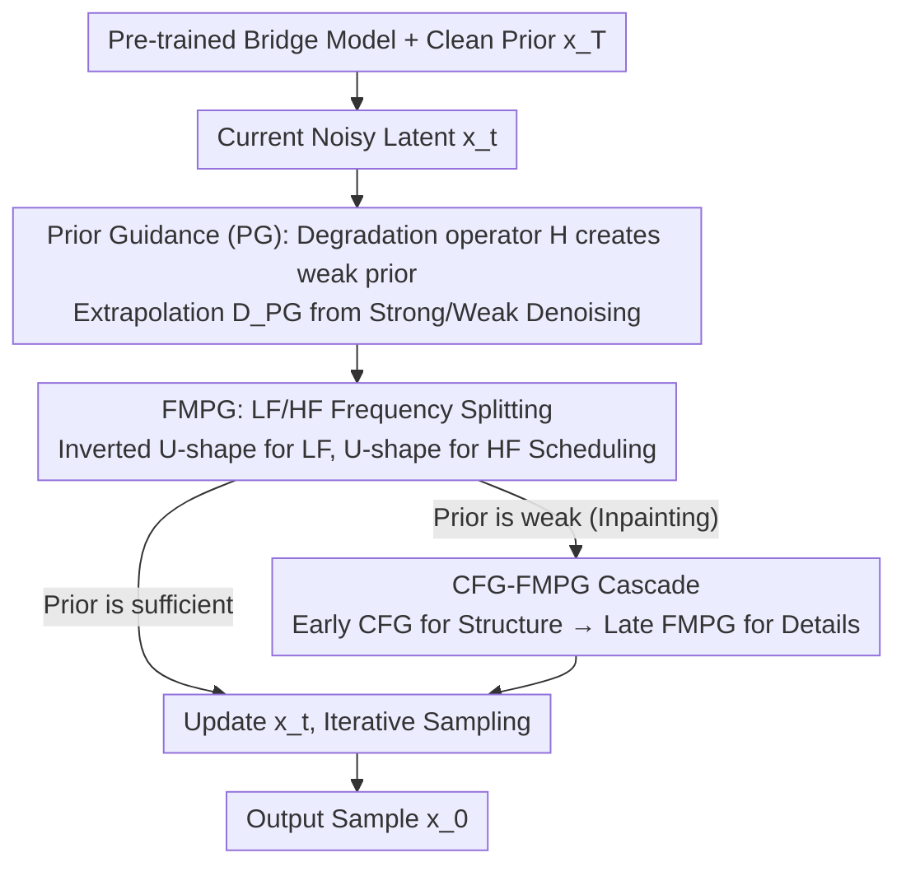

# GuidedBridge: Training-freely Improving Bridge Models with Prior Guidance

**Conference**: ICML 2026  
**arXiv**: [2606.03119](https://arxiv.org/abs/2606.03119)  
**Code**: To be confirmed  
**Area**: Image Generation / Diffusion Bridge / Guidance  
**Keywords**: bridge model, prior guidance, frequency modulation, image translation, training-free

## TL;DR
Addressing diffusion bridge models (data-to-data generation), the paper proposes training-free Prior Guidance (PG): by perturbing a clean prior to construct a "weak prior," the model extrapolates between the denoising results of strong and weak priors to amplify prior utilization. Further incorporating a U-shaped Frequency-modulated PG (FMPG) and a CFG-FMPG cascaded framework, the method consistently improves the FID of pre-trained bridge models such as DDBM / DBIM on tasks like Edges→Handbags, DIODE, and ImageNet inpainting without additional training or increased NFE.

## Background & Motivation

**Background**: Diffusion guidance already has two mature paradigms: CFG uses "conditional vs. unconditional" denoising results for extrapolation to strengthen conditional alignment, while AG uses "well-trained vs. under-trained" denoising results for extrapolation to enhance score accuracy. Both essentially "create a quality gap between two denoising steps and extrapolate towards the higher-quality direction." Meanwhile, bridge models (DDBM, DBIM, I2SB, etc.) transform the generation process into data-to-data by conditioning on a clean prior $\bm{x}_T$, which is more efficient for tasks with strong priors like image-to-image translation and restoration than diffusion starting from pure Gaussian noise.

**Limitations of Prior Work**: While CFG/AG can be directly ported to bridge models, they fail to utilize the actual key difference between bridge and diffusion: **prior exploitation** (leveraging the clean prior provided by $\bm{x}_T$). In other words, ported guidance only "strengthens conditions" or "corrects score errors" without specifically reinforcing whether the model truly utilizes the prior effectively. Additionally, AG requires training an extra under-trained network, which incurs significant costs.

**Key Challenge**: The greatest advantage of bridge models compared to diffusion lacks a corresponding guidance design. Furthermore, the SNR of bridge models follows a U-shaped trajectory (clean at both ends, noisiest in the middle), unlike the monotonically increasing SNR of diffusion. This makes using a constant guidance scale for all timesteps and frequency bands wasteful of the bridge's geometric structure.

**Goal**: (1) Design the first training-free guidance for bridge models where the guidance signal directly corresponds to "prior exploitation"; (2) Match the guidance intensity to the U-shaped SNR and frequency-domain behavior of the bridge; (3) Ensure the method remains applicable even when the prior itself is weak (e.g., masked regions in inpainting).

**Key Insight**: Since both CFG and AG follow the "create a worse denoising and extrapolate" logic, the most natural way to "create a gap" for a bridge model is to **destroy the prior available to the model**. Because the bridge has not seen a perturbed prior, it will yield a worse result. This "poor performance" exactly corresponds to "insufficient prior utilization," and the extrapolation direction naturally leads to "better prior utilization."

**Core Idea**: Training-freely apply a degradation operator $\mathcal{H}$ (e.g., adding Gaussian noise, blurring, or JPEG compression) to $\bm{x}_T$ and $\bm{x}_t$ at each step. Use the difference between $D_{\bm{\theta}}(\bm{x}_t,t,\bm{x}_T)$ and $D_{\bm{\theta}}(\mathcal{H}(\bm{x}_t),t,\bm{x}_T)$ for guidance extrapolation, and schedule the guidance scale separately for high/low-frequency bands according to the U-shaped SNR.

## Method

### Overall Architecture
The input consists of a **pre-trained bridge model** (DDBM / DBIM) and a clean prior $\bm{x}_T$ (e.g., an image to be translated or restored). During generation, instead of calling a single $D_{\bm{\theta}}(\bm{x}_t,t,\bm{x}_T)$ to predict $\bm{x}_0$, the following steps are performed at each sampling step:

1. Use a degradation operator $\mathcal{H}$ to perturb the current noisy latent $\bm{x}_t$ into a "weak prior" $\mathcal{H}(\bm{x}_t)$ (while $\bm{x}_T$ remains a clean conditional signal);
2. Simultaneously call $D_{\bm{\theta}}(\bm{x}_t,t,\bm{x}_T)$ and $D_{\bm{\theta}}(\mathcal{H}(\bm{x}_t),t,\bm{x}_T)$ to obtain strong and weak denoising results;
3. Replace the original denoising output with the extrapolation $D_{\text{PG}} = D_{\text{weak}} + w_{\text{PG}}(D_{\text{strong}} - D_{\text{weak}})$;
4. FMPG further splits this extrapolation into low-frequency (LF) and high-frequency (HF) bands with $w^{\text{LF}}_{\text{PG}}$ and $w^{\text{HF}}_{\text{PG}}$ respectively;
5. For weak-prior tasks like inpainting, CFG is used for $t\in[T,t_s)$ to generate coarse structures, then switched to FMPG for $t\in[t_s,0)$ for detail refinement (CFG-FMPG cascade).

The entire process **requires no training and no extra parameters**. It simply replaces the denoising calls during sampling, and the NFE is strictly aligned with the original baseline (compensating for the extra forward pass per step by using fewer sampling steps).

### Key Designs

**1. Prior Guidance (PG): Creating Worse Denoising via Degraded Priors**

PG fills the gap where bridge models lack guidance corresponding to their core advantage. It follows the "gap creation $\to$ extrapolation" logic of CFG/AG but changes the source of the "gap" to the destroyed prior. Specifically, a training-free degradation operator $\mathcal{H}$ (defaulting to adding Gaussian noise $\bm{\epsilon}\sim\mathcal{N}(\bm{0},\bm{I})$, though blur or JPEG also work) is applied to each intermediate latent $\bm{x}_t$ to obtain a weak version $\mathcal{H}(\bm{x}_t)$, while the conditional signal $\bm{x}_T$ stays clean. Since the bridge was **never exposed** to degraded priors during training, $D_{\bm{\theta}}(\mathcal{H}(\bm{x}_t),t,\bm{x}_T)$ is inevitably worse than $D_{\bm{\theta}}(\bm{x}_t,t,\bm{x}_T)$. The extrapolation:

$$D_{\text{PG}} = D_{\bm{\theta}}(\mathcal{H}(\bm{x}_t),t,\bm{x}_T) + w_{\text{PG}}\,\big(D_{\bm{\theta}}(\bm{x}_t,t,\bm{x}_T) - D_{\bm{\theta}}(\mathcal{H}(\bm{x}_t),t,\bm{x}_T)\big)$$

naturally points toward "more thorough prior utilization." Keeping $\bm{x}_T$ clean in the weak term ensures the difference between the two results **only stems from prior degradation** rather than condition changes. Unlike AG, which requires training an under-trained network as a reference, PG is entirely training-free. Unlike CFG, which only strengthens "conditional alignment," PG directly addresses prior exploitation.

**2. Frequency-modulated PG (FMPG): Scheduling Guidance by U-shaped SNR**

Applying a constant $w_{\text{PG}}$ uniformly across all timesteps and frequencies wastes the bridge's geometric structure. FMPG addresses this. By tracing the frequency-domain energy transfer of $\Delta\bm{x}_t \to \Delta\bm{x}_0$, the authors found that the bridge's SNR is U-shaped. Consequently, at intermediate steps, **high-frequency (HF) priors are heavily submerged in noise**, and hard guidance here only amplifies noise. Conversely, **low-frequency (LF) priors remain readable** throughout the trajectory, making intermediate steps the ideal time to strengthen LF. FMPG splits PG into two paths using filters: $I^{\text{LF}}$ for low frequencies with an **inverted U-shaped** $w^{\text{LF}}_{\text{PG}}$ (amplified in the middle), and $I^{\text{HF}}$ for high frequencies with a **U-shaped** $w^{\text{HF}}_{\text{PG}}$ (compressed in the middle, amplified at ends). The LF path is formulated as:

$$D^{\text{LF}}_{\text{FMPG}} = I^{\text{LF}}[D_{\text{weak}}] + w^{\text{LF}}_{\text{PG}}\,\big(I^{\text{LF}}[D_{\text{strong}}] - I^{\text{LF}}[D_{\text{weak}}]\big),$$

with a similar form for $D^{\text{HF}}_{\text{FMPG}}$. This encodes the U-shaped SNR of data-to-data geometry directly into the guidance schedule, aligning guidance intensity with generation dynamics—a concept that does not exist in diffusion's monotonic SNR.

**3. CFG-FMPG Cascade: Saving Tasks with Weak Priors**

When a prior is too weak for PG to create a meaningful difference—such as inpainting where a central 128×128 region is masked—other guidance is needed to establish the coarse structure first. CFG-FMPG splits the sampling trajectory into two segments: early $t\in[T,t_s)$ uses CFG on class labels $\bm{l}$ for conditional alignment to fill the masked area with semantic structure; subsequently $t\in[t_s,0)$ switches to FMPG to exploit this CFG-produced result as a "strong enough prior" to restore high-frequency textures. Both segments share the same bridge network and trajectory, so **NFE does not increase**. This arrangement compensates for PG's inability to create a gap in empty masks and CFG's inability to restore high-frequency details.

### Loss & Training
Completely training-free. All bridge checkpoints use official versions (DDBM uses the hybrid SDE-ODE sampler, DBIM uses pure ODE mode with $\eta=0.0$). Practice involves two steps: first searching for a degradation operator $\mathcal{H}$ among {Noise, Blur, JPEG, Pooling}, then tuning $w_{\text{PG}}$ (including FMPG components). The tuning cost is comparable to CFG/AG.

## Key Experimental Results

### Main Results

NFE is strictly aligned with the baseline (using fewer sampling steps to offset the extra forward pass).

| Dataset | Metric | DBIM (Baseline) | DBIM+FMPG (Ours) | NFE |
|--------|------|-------------|------------------|-----|
| Edges→Handbags 64×64 | FID ↓ | 1.74 | **1.07** | 20 |
| Edges→Handbags 64×64 | FID ↓ | 0.91 | **0.78** | 100 |
| DIODE-Outdoor 256×256 | FID ↓ | 4.99 | **3.20** | 20 |
| DIODE-Outdoor 256×256 | FID ↓ | 2.58 | **2.06** | 100 |
| DIODE | LPIPS ↓ | 0.201 | **0.199** | 20 |
| Edges→Handbags | MSE ↓ | 0.005 | 0.005 | 20 |

Effectiveness on DDBM: DDBM+PG reduces FID from 1.30 / 0.65 to 1.23 / 0.59 at NFE=150 / 300 on Edges→Handbags.

### Ablation Study

Comparison of PG variants and FMPG on DIODE (Baseline: DBIM):

| Configuration | NFE=10 FID | NFE=20 FID | NFE=40 FID | Note |
|------|-----------|-----------|-----------|------|
| DBIM (No guidance) | 7.99 | 4.99 | 3.35 | Original baseline |
| ECSI (Concurrent work) | 6.83 | 4.12 | - | Fast sampler only |
| DBIM+PG (Blur) | 7.33 | 3.89 | 2.64 | Degradation via Blur |
| DBIM+PG (Noise) | 6.25 | 3.77 | 2.96 | Degradation via Noise |
| **DBIM+FMPG (Noise)** | **5.28** | **3.20** | **2.62** | Best with freq modulation |

### Key Findings
- **FMPG > PG > Baseline**: Splitting constant $w_{\text{PG}}$ into U-shaped and inverted U-shaped frequency schedules further reduces FID across all NFE, proving that bridge models require specialized guidance scheduling.
- **Greater gains at lower NFE**: On DIODE at NFE=10, FID dropped from 7.99 to 5.28 (-34%), compared to a -20% drop at NFE=100. FMPG is particularly valuable for fast sampling as it extracts prior information that the bridge model fails to utilize in fewer steps.
- **CFG-FMPG is the key to inpainting**: In ImageNet 128×128 mask repair, CFG-FMPG outperforms both pure CFG and simple hybrids. Qualitative results show simultaneous recovery of semantic layout and high-frequency textures.

## Highlights & Insights
- **The "Third Solution" for the Gap Paradigm**: CFG addresses "conditional vs. unconditional," AG addresses "well-trained vs. under-trained," and PG addresses "clean vs. degraded prior." These are orthogonal, suggesting multiple guidances can be stacked.
- **Training-free yet Physically Interpretable**: The frequency scheduling is derived from the visualization of energy transfer in $\Delta\bm{x}_t \to \Delta\bm{x}_0$, whereas diffusion's SNR doesn't support such concepts.
- **Honest NFE Alignment**: By reducing sampling steps to match baseline NFE, the authors avoid the pitfall of swapping 2× compute for performance, making PG/FMPG a true "free lunch."

## Limitations & Future Work
- **Per-task Search for Degradation**: Whether noise, blur, or JPEG works best remains empirical.
- **Manual Heuristic for Schedule**: While based on SNR, the exact peaks and amplitudes of the U-shapes still require tuning.
- **Task Scope**: Evaluation was limited to image-to-image tasks. Its applicability to audio or video bridges remains unverified.
- **Switching Timestep $t_s$**: In CFG-FMPG, the transition point requires manual tuning.

## Related Work & Insights
- **vs. CFG**: CFG strengthens semantic alignment; PG strengthens prior utilization. They are complementary.
- **vs. AG**: AG requires an extra under-trained network; PG uses instant degradation during the forward pass, lowering deployment costs.
- **vs. DDBM / DBIM**: These provide backbones; Ours serves as a **universal enhancement plugin** without altering parameters.
- **vs. ECSI**: ECSI optimizes the sampler; PG/FMPG optimizes guidance. They are decoupled and potentially stackable.

## Rating
- Novelty: ⭐⭐⭐⭐ Porting the "gap-extrapolation" paradigm to bridge models and encoding U-shaped SNR into guidance scheduling.
- Experimental Thoroughness: ⭐⭐⭐⭐ Covers multiple backbones and tasks with complete NFE curves, though lacks audio/video verification.
- Writing Quality: ⭐⭐⭐⭐ Clear relationship mapping between CFG/AG/PG; good coordination between frequency analysis and SNR.
- Value: ⭐⭐⭐⭐ A truly training-free, NFE-neutral plugin for bridge models with high practical utility.

<!-- RELATED:START -->

## Related Papers

- [\[CVPR 2026\] Understanding, Accelerating, and Improving MeanFlow Training](../../CVPR2026/image_generation/understanding_accelerating_and_improving_meanflow_training.md)
- [\[ICLR 2026\] Improving Diffusion Models for Class-imbalanced Training Data via Capacity Manipulation](../../ICLR2026/image_generation/improving_diffusion_models_for_class-imbalanced_training_data_via_capacity_manip.md)
- [\[CVPR 2026\] Improving Diffusion Generalization with Weak-to-Strong Segmented Guidance](../../CVPR2026/image_generation/improving_diffusion_generalization_with_weak-to-strong_segmented_guidance.md)
- [\[ICLR 2026\] Stochastic Self-Guidance for Training-Free Enhancement of Diffusion Models](../../ICLR2026/image_generation/stochastic_self-guidance_for_training-free_enhancement_of_diffusion_models.md)
- [\[ICML 2026\] Spectral Guidance for Flexible and Efficient Control of Diffusion Models](spectral_guidance_for_flexible_and_efficient_control_of_diffusion_models.md)

<!-- RELATED:END -->
