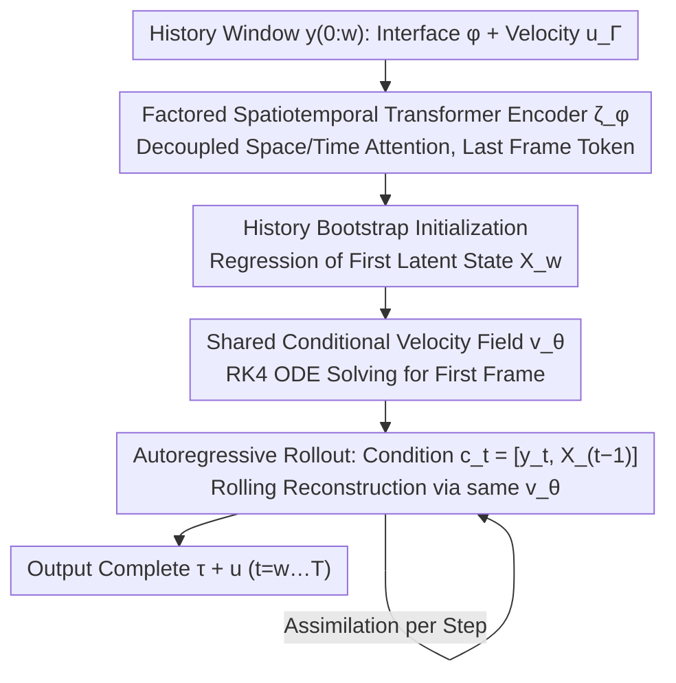

# (HB-ARFM) History-Bootstrapped Flow Matching for Inverse Boiling Reconstruction

**Conference**: ICML2026  
**arXiv**: [2606.00349](https://arxiv.org/abs/2606.00349)  
**Code**: To be confirmed  
**Area**: Scientific Machine Learning / Inverse Problem Reconstruction / Flow Matching / Multiphase Flow  
**Keywords**: Flow Matching, Autoregressive, Boiling Flow Field, Partial Observation, Spatiotemporal Inverse Problem

## TL;DR
HB-ARFM solves the inverse problem of reconstructing multiphase boiling flow fields using "history-observation-guided" conditional flow matching. It bootstraps an initial latent state from a historical observation window and then advances the reconstruction autoregressively using the same conditional velocity field. Observing only interface geometry and velocity, it achieves the first spatiotemporally consistent reconstruction of complete temperature and velocity fields.

## Background & Motivation
**Background**: Two-phase boiling is one of the most efficient forms of heat transfer, yet key variables like temperature fields, velocity fields, and interfacial mass transfer are nearly impossible to measure directly in experiments. Previous learning methods (Neural Operators, Bubbleformer, FFNO, etc.) mostly assume the availability of complete simulation data for "forward prediction" or surrogate modeling.

**Limitations of Prior Work**: Applying these forward models to real-world scenarios where only images (interface segmentation + optical flow) are available immediately encounters the **cold start** problem—there is no ground-truth initial state to feed the model. Generative inverse methods like DiffusionPDE or FunDPS only perform single-frame reconstruction and cannot guarantee temporal consistency; models like VE-SDE may even collapse to near-uniform fields.

**Key Challenge**: Although the two-phase Navier-Stokes equations are Markovian over the **complete state**, once only partial variables like interface geometry $\phi$ are observed, the effective dynamics of the observable variables develop a **non-local memory kernel** according to the Mori-Zwanzig (MZ) formalism. The influence of "missing latent variables" in a single-moment observation must be recovered through **history**. In other words, partial observation transforms a Markovian forward problem into a non-Markovian inverse problem.

**Goal**: Given only (i) interface geometry $\phi$ and (ii) interface normal velocity $\mathbf{u}_\Gamma$, simultaneously reconstruct the complete temperature $\tau$ and velocity $\mathbf{u}$ fields for both liquid and gas phases, ensuring: observation consistency + physical plausibility + temporal coherence + long-term rollout stability.

**Key Insight**: Since MZ tells us that the memory kernel arises from latent variables, a **finite-length observation history window** can be used to approximate this missing information—provided the history length covers characteristic time scales such as bubble rise and condensation times.

**Core Idea**: Use historical observations to bootstrap the first latent state, then treat the same conditional flow matching model as an "autoregressive propagator with built-in data assimilation," consuming both the current observation and the previous reconstruction step.

## Method

### Overall Architecture
HB-ARFM addresses a spatiotemporal inverse problem: the input is an observation sequence $y_{0:T}$ starting from $t=0$ with length $w$ (each frame is an SDF interface $\phi$ plus interface normal velocity $\mathbf{u}_\Gamma$), and the output is the complete temperature and velocity fields $\{\hat{X}_t\}$ for $t=w,\dots,T$. It decomposes "inverse reconstruction without ground-truth initial states" into two stages using a single conditional velocity network $v_\theta$: first bootstrapping the initial state via a history window, then rolling forward autoregressively with "current observation + previous reconstruction." Effectively, cold start and continuous data assimilation are unified within the same conditional transport framework.

### Key Designs

**1. History bootstrap initialization: Relaxing ill-posed instantaneous inversion into a history-constrained problem**

Traditional autoregressive methods assume access to a ground-truth initial state $X_0$, but imaging observations lack this complete field. Directly feeding instantaneous observations results in a highly ill-posed "instantaneous observation → complete state" mapping. HB-ARFM instead uses a history window $y_{0:w}$ of length $w$ to generate the first latent state estimate. During training, it jointly optimizes the history encoder regression loss $\mathcal{L}_{\text{boot}}=\|\zeta_\phi(y_{t_0-w:t_0-1})-X_{t_0}\|^2$ and the flow matching velocity loss $\|X_{t_0}-\mathbf{x}^0-v_\theta(\mathbf{x}^s,\mathbf{c}_{t_0},s)\|^2$ conditioned on $\mathbf{c}_{t_0}=[y_{t_0},\hat{X}_{t_0}]$, where $\mathbf{x}^s=(1-s)\mathbf{x}^0+sX_{t_0}$ is the linear interpolation on the OT path. A "fixed-length window" suffices because the MZ formalism guarantees that the memory kernel decays exponentially beyond characteristic time scales. By covering these scales, missing latent information is largely recovered, converting the ill-posed inversion into a better-constrained problem.

**2. Shared conditional velocity field + Autoregressive rollout: Unified reconstruction and data assimilation**

After bootstrapping the first frame, for each step $t>w$, the previous prediction $\hat{X}_{t-1}$ and current observation $y_t$ are concatenated as the condition $\mathbf{c}_t=[y_t,\hat{X}_{t-1}]$. The flow matching objective becomes $\|X_{t_0+k}-\mathbf{x}^0-v_\theta(\mathbf{x}^s,\mathbf{c}_{t_0+k},s)\|^2$. At inference, an RK4 solver handles the ODE $d\mathbf{x}_s/ds=v_\theta(\mathbf{x}_s,\mathbf{c}_t,s)$ to sample $\hat{X}_t$ from noise. Crucially, bootstrapping and AR reuse the same $v_\theta$, and one trajectory contributes to both $\mathcal{L}=\mathcal{L}_{\text{boot}}+\mathcal{L}_{\text{AR}}/(K-1)$, avoiding distribution shift from two-stage concatenation. Explicitly including the previous state in the condition acts as an implicit "physical reachability" constraint—a feature missing in models like HistoryFM that perform independent frame sampling, which fails to guarantee physical continuity of the wake.

**3. Factored Spatiotemporal Transformer Encoder: Compressing $w$ frames into the initial state**

The history encoder $\zeta_\phi$ must compress $w$ frames into a single initial state estimate. To manage the quadratic cost of joint space-time attention, it utilizes patch embedding with $p\times p$ convolutions to obtain $N=(H/p)(W/p)$ tokens per frame, combined with 2D sinusoidal spatial and learnable temporal positional encodings. It stacks $L$ layers alternating between "intra-frame spatial self-attention" and "cross-frame causal temporal self-attention" at identical patch locations. The final layer retains only the token of the last frame, restored to pixel space via linear unpatchify and a learnable scale/bias. This decoupling allows each pixel to integrate the history at a cost of $O(w+N^2)$. Causal masking ensures no look-ahead during bootstrapping.

### Key Experimental Results

#### Main Results
The dataset used is BubbleML, covering subcooled pool boiling and flow boiling. Tasks: (T1) Reconstruct temperature from $\phi$; (T2) Reconstruct temperature and velocity from $\phi+\mathbf{u}_\Gamma$.

| Dimension | HB-ARFM Performance | Comparison Baseline | Key Observation |
|:---:|:---|:---|:---|
| Near-interface | Sharp gradients + consistent wake | Most models perform well here | High geometric constraint near interface. |
| Bulk Region | Preserves fine scales + high energy | FFNO/UNet: oversmooth; VE-SDE: collapse | Bulk reconstruction is the true test. |
| HF Energy Ratio | Highest (comparable to HistoryFM) | DiffusionPDE/DDPM: fragmented | History prevents high-frequency loss. |
| Wall Heat Flux | Lowest overall error | — | Crucial engineering metric for boiling. |
| Long-term (300 steps)| Stable error, decreasing variance | Bubbleformer: collapse; HistoryFM: drift | Cold start + AR are both essential. |
| Flow Boiling | Velocity ratio $\approx 1$, Flux error $< 0.2\%$ | — | Generalizes to different dynamics. |

#### Ablation Study

| Configuration | Key Phenomenon | Explanation |
|:---|:---|:---|
| Full HB-ARFM | Consistent + long-term stable | Result of joint bootstrap + AR optimization. |
| Window $w$: 1 → 64 | Error decreases monotonically | Velocity is more history-sensitive (MZ memory kernel). |
| HistoryFM (No AR) | Good frames but flickering wake | Proves AR feedback is key for temporal coherence. |
| PDEDiff (Random mask) | Divergence | Joint spatiotemporal modeling is unstable for sharp interfaces. |
| Forward SOTA | Immediate collapse | Proves history bootstrap is indispensable. |

#### Key Findings
- As historical length $w$ increases, reconstruction error decreases, with **gains for velocity significantly higher than for temperature**—matching MZ formalism where hidden variables dominate the velocity dynamics.
- While HistoryFM uses history, only HB-ARFM avoids wake "flickering," showing that **AR feedback explicitly incorporates physical reachability into the condition**.
- In consistency tests, the cosine similarity between $H(\hat{u})$ and $y_{\text{obs}}$ remains $> 0.92$ after 300 steps, proving the model generates self-consistent fields.
- The model maintains $< 2\%$ wall heat flux error even at an OOD $T_{\text{wall}}=117$°C, suggesting it has **learned the functional mapping of boundary conditions to phase-change heat transfer**.

## Highlights & Insights
- **Mori-Zwanzig Formalism as a Design Principle**: History is not added intuitively but justified by MZ proving that partial observation necessitates non-Markovianity, and the "finite window" is justified by the exponential decay of memory kernels.
- **Unified $v_\theta$ for Cold Start and Data Assimilation**: The bootstrap phase converts an ill-posed inverse problem without an initial state into one with an initial state, while the AR phase converts continuous observation into implicit data assimilation.
- **Boiling Flow as a SciML Benchmark**: The coexistence of sharp interfaces, multi-physics coupling, and hidden transport makes it an ideal stress test for generative, AR, and PINN methods.

## Limitations & Future Work
- The model is entirely data-driven with **no explicit conservation constraints** during training; divergence errors suggest mass conservation is imperfect.
- The history encoder is a lossy bottleneck; stronger encoding architectures like state-space models (SSMs) could be explored.
- All evaluations are on simulation data; the **sim-to-real gap** remains an open problem due to noise and lack of ground truth in real boiling images.
- Observation: Sharing $v_\theta$ between bootstrap and AR is elegant, but the conditional structures differ significantly. Separate capacities might be beneficial for very long history windows.

## Related Work & Insights
- **vs DiffusionPDE / FunDPS**: These add observation guidance to the sampling process for single-frame reconstruction; HB-ARFM uses flow matching as a conditional transporter and adds AR feedback to fix temporal discontinuity.
- **vs S3GM**: S3GM models the entire spatiotemporal volume $p(X_{0:T})$, which is computationally expensive; HB-ARFM factorizes it along time, improving scalability.
- **vs HistoryFM**: HistoryFM samples each frame independently without feedback, losing the state constraint in the MZ sense; HB-ARFM recovers "trajectory continuity."

## Rating
- Novelty: ⭐⭐⭐⭐ (MZ-based design + unified bootstrap/AR $v_\theta$ is a strong combination).
- Experimental Thoroughness: ⭐⭐⭐⭐⭐ (Broad tasks, settings, 10 baselines, 300-step stability, and OOD extrapolation).
- Writing Quality: ⭐⭐⭐⭐ (Rigorous problem formulation; complex figures).
- Value: ⭐⭐⭐⭐⭐ (First full reconstruction of boiling fields from imaging; valuable SciML benchmark).

<!-- RELATED:START -->

## Related Papers

- [\[ICML 2026\] Saving Foundation Flow-Matching Priors for Inverse Problems](saving_foundation_flow-matching_priors_for_inverse_problems.md)
- [\[ICML 2026\] LithoGRPO: Fast Inverse Lithography via GRPO Reinforced Flow Matching](lithogrpo_fast_inverse_lithography_via_grpo_reinforced_flow_matching.md)
- [\[ICML 2026\] Bootstrap Your Generator: Unpaired Visual Editing with Flow Matching](bootstrap_your_generator_unpaired_visual_editing_with_flow_matching.md)
- [\[ICML 2026\] Shifting the Breaking Point of Flow Matching for Multi-Instance Editing](shifting_the_breaking_point_of_flow_matching_for_multi-instance_editing.md)
- [\[ICML 2026\] Principled RL for Flow Matching Emerges from the Chunk-level Policy Optimization](principled_rl_for_flow_matching_emerges_from_the_chunk-level_policy_optimization.md)

<!-- RELATED:END -->
## Related Papers

- [\[ICML 2026\] Saving Foundation Flow-Matching Priors for Inverse Problems](saving_foundation_flow-matching_priors_for_inverse_problems.md)
- [\[ICML 2026\] LithoGRPO: Fast Inverse Lithography via GRPO Reinforced Flow Matching](lithogrpo_fast_inverse_lithography_via_grpo_reinforced_flow_matching.md)
- [\[CVPR 2026\] RecTok: Reconstruction Distillation along Rectified Flow](../../CVPR2026/image_generation/rectok_reconstruction_distillation_along_rectified_flow.md)
- [\[CVPR 2026\] Flow Matching for Multimodal Distributions](../../CVPR2026/image_generation/flow_matching_for_multimodal_distributions.md)
- [\[ICML 2026\] Bootstrap Your Generator: Unpaired Visual Editing with Flow Matching](bootstrap_your_generator_unpaired_visual_editing_with_flow_matching.md)

<!-- RELATED:END -->
