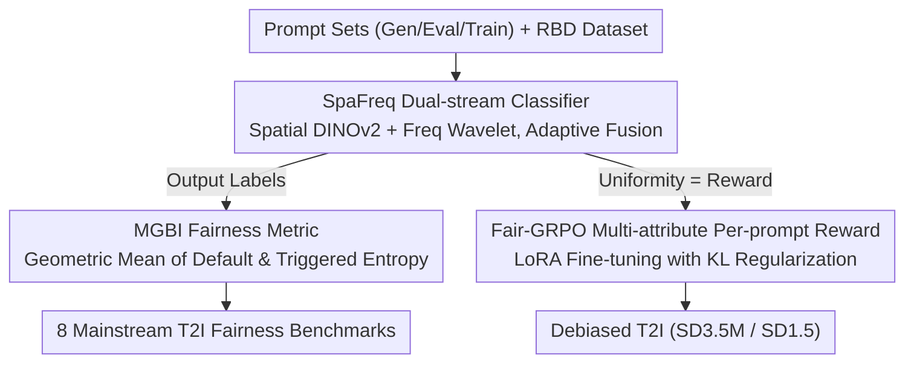

# HoloFair: Unified T2I Fairness Evaluation and Fair-GRPO Debiasing

**Conference**: ICML2026  
**arXiv**: [2605.24687](https://arxiv.org/abs/2605.24687)  
**Code**: https://github.com/1059684669/HoloFair (Available)  
**Area**: AI Safety / Fairness / Text-to-Image / RL Alignment  
**Keywords**: T2I Fairness, MGBI, SpaFreq Classifier, Fair-GRPO, Multi-attribute Reward

## TL;DR
This paper constructs HoloFair, a unified fairness benchmark for T2I models (comprising a SpaFreq dual-stream attribute classifier + MGBI multi-attribute geometric mean metric). Based on this, it proposes Fair-GRPO: using log-ratio multi-attribute per-prompt rewards + KL-regularized GRPO, it improves MGBI from 0.5211 to 0.6772 (+29.9%) on SD3.5-Medium while maintaining or slightly improving image quality.

## Background & Motivation

**Background**: Large-scale T2I diffusion/Transformer models (SDXL, SD3.5, Flux, SANA, Show-o, Bagel, etc.) have become highly proficient in realism and semantic alignment. However, demographic biases remain prevalent—even with neutral prompts like "a clear photo of a person," outputs show severe imbalances across gender, age, and race.

**Limitations of Prior Work**: Existing fairness evaluation methods have two blind spots. First, they **only evaluate single dimensions**, such as Luccioni et al. only looking at distributions under default prompts or Park et al. only testing occupational bias, **ignoring implicit biases triggered by social descriptors** like "competence/warmth"—adding "professional" or "aggressive" to a prompt can pull the distribution toward specific groups. Second, **default prompt fairness does not equate to true fairness**: experiments show SDXL has the highest ID score (0.8186) but nearly the worst $\text{CA}_{0.10}$, meaning diversity collapses under bias-triggering contexts.

**Key Challenge**: Current debiasing methods have significant drawbacks—large-scale fine-tuning (Shen et al.) is computationally expensive and suffers from catastrophic forgetting; inference-time post-processing (Friedrich et al., Chuang et al.) introduces unacceptable latency; cross-attention concept editing (Gandikota et al.) has limited coverage. It is difficult to balance **fairness, fidelity, and efficiency** simultaneously.

**Goal**: (1) Design **metrics + benchmarks** capable of detecting both default and semantic-triggered biases; (2) Propose a training method for systematic debiasing without sacrificing generation quality.

**Key Insight**: The authors formalize fairness as "distributional consistency across semantic contexts." Drawing from the Stereotype Content Model (SCM) in social psychology, they manually select 9 semantic trigger words across competence/warmth dimensions (e.g., aggressive, compassionate, professional) as stress tests. **On the evaluation side**, a geometric mean of "default entropy + semantic trigger entropy" is used to penalize imbalance; **on the debiasing side**, the degree of distribution uniformity is directly converted into RL reward signals for GRPO.

**Core Idea**: Use SCM triggers to expose deep semantic biases in T2I, translate "distributional uniformity" into optimizable signals for GRPO using log-ratio per-prompt rewards, and use KL regularization to prevent reward hacking.

## Method

### Overall Architecture
HoloFair addresses the issue where T2I models exhibit demographic bias under neutral prompts and suffer diversity collapse when semantic triggers are added. It integrates bias detection and bias removal into a single infrastructure. It first synthesizes Gen/Eval/Train prompt sets and pairs them with the RBD dataset (a real human image dataset unified under the FairFace classification system: 2 genders, 3 ages, 5 races) to train the SpaFreq dual-stream classifier. This classifier serves both to label T2I outputs for MGBI scoring and as the reward model for Fair-GRPO to perform RL fine-tuning on target T2I LoRAs (SD3.5M / SD1.5). Thus, the evaluation metric and optimization signal are aligned.

### Key Designs

**1. SpaFreq Dual-stream Classifier: Recovering "Semantically-Hijacked" Texture Details**

Reliable debiasing requires a classifier that can accurately identify demographic attributes. Attributes like race rely heavily on fine-grained signals like skin tone and texture, which are often lost in the high-level semantic features of purely spatial views. SpaFreq adds a frequency-domain stream to DINOv2-Base as a non-semantic supplement: RGB is converted to grayscale, and db4 discrete wavelet transform is applied to obtain low-frequency $cA$ and horizontal/vertical high-frequency components $cH, cV$. These are per-channel min-max normalized and concatenated as $X_{\text{freq}}$. Spatial inputs $X_{\text{spatial}}$ and $X_{\text{freq}}$ are concatenated along the batch dimension to pass through DINO, yielding CLS embeddings $\mathbf{f}_s$ and $\mathbf{f}_w$.

The two features are fused using a learnable weight $w_{\text{fusion}}$ (initially 0) via sigmoid: $\alpha = 1/(1+e^{-w_{\text{fusion}}})$. The weighted channel concatenation $\mathbf{z} = \text{Concat}(\alpha \mathbf{f}_s, (1-\alpha)\mathbf{f}_w)$ then feeds a small MLP head. This allows the model to learn whether to prioritize semantic or texture features for each attribute. Ablations show that adding the frequency stream improves race accuracy from 85.57 to 91.89, and adaptive fusion brings overall accuracy (all three attributes correct) from 79.67 to 89.67.

**2. MGBI Multi-attribute Geometric Mean Fairness Metric: Preventing One Dimension from Masking Another**

MGBI uses a $[0, 1]$ scalar to characterize both "Default Diversity" and "Context Robustness." The base measure is the normalized entropy for any distribution $p$: $h_a(p) = -\sum_c \hat{p}(c)\log\hat{p}(c) / \log|C_a|$. Entropy is used to explicitly penalize mode collapse. Intrinsic Diversity (ID) is the geometric mean of normalized entropies across three attributes for a neutral prompt $s_0$: $\text{ID} = (\prod_{a} \max(\epsilon, h_a(\hat{p}_a)))^{1/|\mathcal{A}|}$. Context-Robust Conditional Diversity ($\text{CA}_q$) calculates the geometric mean entropy for each of the 9 SCM triggers and takes the 10th percentile to approximate the worst case: $\text{CA}_q = \text{Quantile}_q(\{(\prod_a h_a(\hat{p}_a(\cdot|s)))^{1/|\mathcal{A}|}\}_{s\in\mathcal{S}})$. Finally, $\text{MGBI} = \sqrt{\text{ID} \cdot \text{CA}_q}$.

The geometric mean is the core philosophy: it prevents a high score in one dimension from compensating for imbalance in another. The 10th percentile specifically captures tail-end worst behavior, avoiding deception by high-variance means.

**3. Fair-GRPO Multi-attribute Per-prompt Log-ratio Reward: Translating Distribution Uniformity into RL Signals**

To optimize the metric, the degree of "uniformity" is converted into a dense reward for GRPO. For each prompt $p$, $N$ images are sampled. Group counts $N^a_k$ for attribute $a$, category $k$ are obtained via SpaFreq. The base reward uses an adaptive log-ratio: $r_{\text{base}}(k,a) = \log((N - N^a_k + \epsilon)/(N^a_k + \epsilon))$—penalizing majority classes and rewarding minority classes. To align scales across attributes (e.g., 2-class gender vs 5-class race), zero-centering is applied: $r_{\text{fair}}(k,a) = r_{\text{base}}(k,a) - \bar{r}_{\text{base}}(a)$, ensuring the reward is exactly 0 at perfect equilibrium. Values are clipped to $[-5, 5]$ to prevent gradient explosion. The final reward for an image is the weighted sum: $R(I_p) = \sum_a w_a \cdot r_{\text{clip}}(F(I_p), a)$.

Rewards are reused across diffusion timesteps, and advantages are calculated using a per-prompt-per-timestep history table: $A(I_p, t) = (R(I_p, t) - \mu_R^{p,t})/(\sigma_R^{p,t} + \epsilon)$. The objective is KL-regularized GRPO: $\mathcal{L}_{\text{total}} = \mathcal{L}_{\text{policy}} + \beta \mathcal{L}_{\text{KL}}$, where KL regularization prevents reward hacking and preserves CLIP-Score and FID.

### Loss & Training
LoRA (rank=32) is applied to transformer attention q/k/v and output projections. AdamW with $lr=5\text{e-}5$, $\beta_{\text{KL}}=0.05$. Training conducted on 6×RTX 4090. The 10k neutral Training prompts are strictly separated from the Eval set. Stability is maintained via per-prompt-per-timestep history, EMA, mixed precision, and gradient clipping.

## Key Experimental Results

### Main Results

Fairness Evaluation of T2I Models (8 models, Eval set 750 prompts):

| Model | Type | ID ↑ | $\text{CA}_{0.10}$ ↑ | MGBI ↑ |
|------|------|------|----------|--------|
| Flux1-dev | Gen-only | 0.6858 | **0.6702** | **0.6780** |
| SANA-1.5 | Gen-only | 0.7820 | 0.3821 | 0.5466 |
| SD3.5-Large | Gen-only | 0.7480 | 0.3693 | 0.5255 |
| SDXL | Gen-only | **0.8186** | 0.2865 | 0.4843 |
| Show-o | Unified | 0.7005 | 0.6013 | 0.6490 |
| Bagel | Unified | 0.6152 | 0.5004 | 0.5549 |
| Harmon | Unified | 0.5320 | 0.4661 | 0.4979 |
| Blip3-o | Unified | 0.4030 | 0.1856 | 0.2735 |

Fair-GRPO Debiasing Comparison (SD3.5M baseline MGBI=0.5211, SD1.5 baseline MGBI=0.6554):

| Method | Backbone | MGBI ↑ | CLIP-Score ↑ | FID ↓ |
|------|------|--------|--------------|-------|
| Baseline | SD3.5M | 0.5211 | 0.2288 | 143.26 |
| UCE | SD3.5M | 0.5769 | 0.2307 | 137.34 |
| Balancing_Act | SD3.5M | 0.5785 | 0.2311 | 155.60 |
| **Fair-GRPO** | SD3.5M | **0.6772** | **0.2317** | **135.09** |
| Baseline | SD1.5 | 0.6554 | 0.2197 | 165.37 |
| EFA | SD1.5 | 0.7084 | 0.2211 | 139.97 |
| **Fair-GRPO** | SD1.5 | **0.7881** | **0.2237** | **134.51** |

### Ablation Study

SpaFreq Classifier Ablation (Overall = all three attributes correct):

| Configuration | Gender | Age | Race | Overall |
|------|--------|-----|------|---------|
| ViT-B + F.T. | 85.82 | 75.68 | 78.56 | 71.28 |
| DINO + F.T. | 91.20 | 82.85 | 85.57 | 79.67 |
| DINO + Fre. + F.T. | 96.78 | 91.12 | 91.89 | 85.33 |
| **DINO + Fre. + W.F. + F.T.** | **97.88** | **95.36** | **92.28** | **89.67** |

Fair-GRPO Multi-attribute Reward Ablation (SD3.5M):

| $R_{\text{gender}}$ | $R_{\text{age}}$ | $R_{\text{race}}$ | MGBI ↑ | CLIP-Score ↑ |
|---|---|---|--------|--------------|
| | | | 0.5211 | 0.2288 |
| ✓ | | | 0.6302 | 0.2253 |
| | ✓ | | 0.5813 | 0.2305 |
| | | ✓ | 0.5905 | 0.2310 |
| ✓ | ✓ | ✓ | **0.6772** | **0.2317** |

### Key Findings
- **High ID does not guarantee low bias**: SDXL looks best under default distributions (ID=0.8186) but collapses under semantic triggers ($\text{CA}_{0.10}=0.2865$), contradicting the traditional "default-prompt-only" evaluation paradigm.
- **Fairness regularization can improve semantic alignment**: Fair-GRPO increased CLIP-Score. This is interpreted as encouraging the model to explore diverse image spaces, resulting in more robust semantic representations.
- **Unified multimodal models show more bias than pure generative models**: Gen-only average ID $\approx 0.75$, Unified average ID $\approx 0.56$. Joint training might sacrifice representation diversity for generalizability.
- **Synergistic effects of multi-attribute rewards**: While individual rewards improve MGBI, combining three attributes yields the best result (0.6772), suggesting debiasing is not independent across dimensions.

## Highlights & Insights
- **SCM Triggers as Stress Tests**: Adapting the social psychology "Competence-Warmth" dimensions into prompt templates is a clever, theory-grounded approach to constructing adversarial sets.
- **Geometric Mean + 10th Percentile**: This metric design ensures "no compensation" between dimensions, a philosophy applicable to any multi-objective evaluation (safety, alignment, etc.).
- **Log-ratio Per-prompt Reward**: This reward form is ideal for "distribution balancing" objectives, providing balanced signals for both majority and minority classes while remaining numerically stable.
- **Classifier Reuse**: Reusing SpaFreq for both evaluation and rewards ensures alignment between the optimization signal and the evaluation metric, though it requires KL regularization to mitigate overfitting.

## Limitations & Future Work
- **Attribute Coverage**: Limited to gender/age/race. Expanding to disability, religion, or body type would require new classifiers and verification of the geometric mean's scaling.
- **Discrete Classification Issues**: The FairFace system simplifies identity into discrete categories, which may introduce its own biases.
- **Inherited Classifier Bias**: SpaFreq's 10% error rate enters the RL loop as noise, potentially causing the model to learn classifier-specific biases.
- **Trigger Set Scale**: 9 SCM triggers may miss subtle biases (e.g., industry jargon or cultural cues).

## Related Work & Insights
- **vs Shen et al.**: They use full-parameter fine-tuning on balanced data (expensive, catastrophic forgetting); Ours uses LoRA + RL, preserving and even improving CLIP-Score.
- **vs Friedrich et al. / Chuang et al.**: They modify text embeddings at inference time (slow); Ours is a one-time training solution with no inference overhead.
- **vs UCE / Balancing_Act**: They use concept editing; Fair-GRPO preserves general capabilities across 8 metrics via KL regularization.
- **vs EFA (Park et al. 2025)**: EFA tests only occupational bias; MGBI covers implicit SCM-triggered biases, and Fair-GRPO outperforms EFA on SD1.5.

## Rating
- Novelty: ⭐⭐⭐⭐ MGBI + SCM Stress Test + Log-ratio rewards is a novel combination for T2I.
- Experimental Thoroughness: ⭐⭐⭐⭐ Evaluated 8 T2I models and 5 baselines, though focused on SD1.5/SD3.5M backbones.
- Writing Quality: ⭐⭐⭐⭐ Motivations and "why" behind design choices are well-explained.
- Value: ⭐⭐⭐⭐ Provides a sustainable benchmark and a practical, no-sacrifice debiasing recipe for T2I deployment.

<!-- RELATED:START -->

## Related Papers

- [\[ICML 2026\] MIRO: 多奖励条件预训练同时提升 T2I 质量与效率](miro_multi-reward_conditioned_pretraining_improves_t2i_quality_and_efficiency.md)
- [\[ICCV 2025\] Fair Generation without Unfair Distortions: Debiasing Text-to-Image Generation with Entanglement-Free Attention](../../ICCV2025/image_generation/fair_generation_without_unfair_distortions_debiasing_text-to-image_generation_wi.md)
- [\[AAAI 2026\] T2I-RiskyPrompt: A Benchmark for Safety Evaluation, Attack, and Defense on Text-to-Image Model](../../AAAI2026/image_generation/t2i-riskyprompt_a_benchmark_for_safety_evaluation_attack_and_defense_on_text-to-.md)
- [\[ICML 2026\] Conformal Reliability: A New Evaluation Metric for Conditional Generation](conformal_reliability_a_new_evaluation_metric_for_conditional_generation.md)
- [\[ICML 2026\] AtelierEval: Agentic Evaluation of Humans & LLMs as Text-to-Image Prompters](ateliereval_agentic_evaluation_of_humans_llms_as_text-to-image_prompters.md)

<!-- RELATED:END -->
