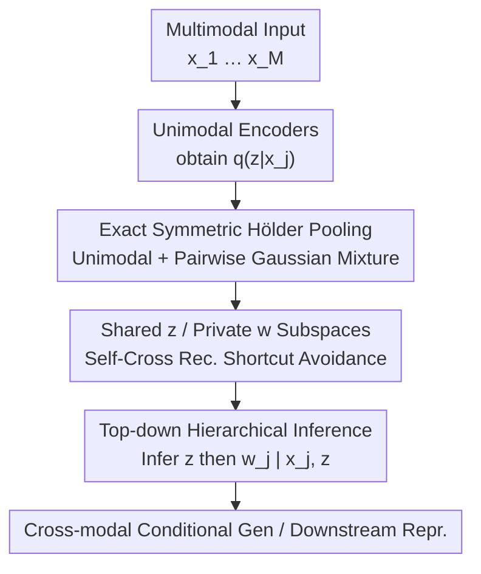

# Hölder++: Improving the Quality-Coherence Trade-off in Multimodal VAEs

**Conference**: ICML2026  
**arXiv**: [2606.13381](https://arxiv.org/abs/2606.13381)  
**Code**: To be confirmed  
**Area**: Multimodal Generation / Variational Autoencoders  
**Keywords**: Multimodal VAE, Hölder Pooling, Shared-Private Representation, Hierarchical Inference, Quality-Coherence Trade-off

## TL;DR
Addressing the long-standing "generation quality vs. cross-modal coherence" trade-off in multimodal VAEs, this paper proposes Hölder++. It introduces the first exact implementation of symmetric Hölder pooling ($\alpha=0.5$) as a modality aggregator, combined with shared-private subspace separation and top-down hierarchical inference. These architectural improvements push the quality-coherence Pareto frontier to SOTA across four benchmarks.

## Background & Motivation
**Background**: Multimodal VAEs aggregate outputs from multiple unimodal encoders into a cross-modally shared latent variable $\boldsymbol{z}$, which is then reconstructed by each modality decoder. The aggregation method is a critical design choice, typically using Product-of-Experts (PoE) or Mixture-of-Experts (MoE).

**Limitations of Prior Work**: PoE suffers from poor coherence, while MoE exhibits low diversity—representing weaknesses in "coherence" and "quality" dimensions, respectively. MMVAE+ was the first to achieve strong results in both dimensions by explicitly distinguishing shared/private latent representations and avoiding shortcuts, but it still utilizes MoE for aggregation. Recently, Vo and Valera pointed out that PoE and MoE are special cases of Hölder pooling (a family of probabilistic opinion pools targeting $\alpha$-divergence) and proposed HELVAE using a Laplace approximation for the symmetric case ($\alpha=0.5$). HELVAE achieves higher coherence than MMVAE+ with a single shared representation, though at the cost of a slight decrease in sample diversity.

**Key Challenge**: A structural trade-off exists between quality and coherence. Relying solely on "changing the aggregation method" or "splitting shared/private subspaces" only improves one side. HELVAE's approximation has two drawbacks: first, it is a Laplace approximation rather than exact pooling; second, it samples the shared representation $\boldsymbol{z}$ *after* aggregation, failing to distinguish between self-reconstruction and cross-reconstruction. Consequently, it introduces shortcuts when integrated into shared-private architectures.

**Goal**: (i) Provide an exact (non-approximate) implementation of symmetric Hölder pooling; (ii) Combine it with shared/private subspaces; (iii) Enhance the decoupling of shared and private representations without relying on additional auxiliary losses.

**Key Insight**: Exact symmetric Hölder pooling naturally formulates the joint posterior as a Gaussian mixture of "unimodal components + pairwise components." This structure explicitly characterizes pairwise interactions between modalities and seamlessly integrates with MMVAE+-style self/cross-reconstruction sampling strategies.

**Core Idea**: By stacking "exact Hölder pooling (pairwise mixture) + shared/private subspaces + top-down hierarchical inference," the quality-coherence trade-off is pushed to the Pareto frontier.

## Method

### Overall Architecture
The method follows an evolutionary chain: first, replacing the approximate aggregator with exact symmetric Hölder pooling to obtain Hölder VAE; then, splitting the single shared latent space into shared $\boldsymbol{z}$ and modality-private $\boldsymbol{w}_m$ using MMVAE+'s shortcut-avoiding sampling to obtain Hölder+; finally, changing the posterior from "independent shared and private" to a top-down hierarchical decomposition to obtain Hölder++. Given $M$ modalities $\boldsymbol{X}=\{\boldsymbol{x}_1,\dots,\boldsymbol{x}_M\}$, the model enables consistent and high-quality generation of remaining modalities conditioned on any subset of input modalities.

The key to exact symmetric Hölder pooling is expressing the aggregated posterior as a Gaussian mixture:

$$q(\boldsymbol{z}|\boldsymbol{X})=\sum_{j=1}^{M}\pi_j\, q_{\phi_{z_j}}(\boldsymbol{z}|\boldsymbol{x}_j)+\sum_{i=1}^{M}\sum_{j>i}^{M}\pi_{ij}\, q_{ij}^{(1/2)}(\boldsymbol{z}|\boldsymbol{x}_i,\boldsymbol{x}_j)$$

This includes $M$ unimodal components and $\binom{M}{2}$ pairwise components. This structure serves as the interface for subsequent improvements.

### Key Designs

**1. Exact Symmetric Hölder Pooling: Replacing Approximations with Closed-form Pairwise Mixtures**

To address the limitation that HELVAE is only a Laplace approximation of Hölder pooling, this paper provides an exact aggregation for the $\alpha=0.5$ case. Symmetric Hölder pooling aims to minimize the weighted $\alpha$-divergence. Under uniform weights, the aggregated density is $q(\boldsymbol{z})=c\big(\sum_j q_j(\boldsymbol{z})+2\sum_{i}\sum_{j>i}\sqrt{q_i(\boldsymbol{z})q_j(\boldsymbol{z})}\big)$. When unimodal posteriors are diagonal Gaussians, the normalized geometric mean of any pair remains Gaussian. The parameters for the pairwise component $q_{ij}^{(1/2)}=\mathcal{N}(\boldsymbol{\mu}_{ij},\boldsymbol{\sigma}_{ij}^2)$ have closed-form solutions:

$$\mu_{ij,d}=\frac{\mu_{i,d}\sigma_{j,d}^2+\mu_{j,d}\sigma_{i,d}^2}{\sigma_{i,d}^2+\sigma_{j,d}^2},\qquad \sigma_{ij,d}^2=\frac{2\sigma_{i,d}^2\sigma_{j,d}^2}{\sigma_{i,d}^2+\sigma_{j,d}^2}.$$

The mixture weights are $\pi_j=c$ and $\pi_{ij}=2cS_{ij}$, where $S_{ij}$ is the Bhattacharyya coefficient between two unimodal posteriors, and the normalization constant $c=(M+2\sum_{i<j}S_{ij})^{-1}$ is also analytically solvable. Compared to MoE which only has unimodal components, the additional pairwise terms explicitly encode pairwise consistency. Thus, even with a single shared representation, symmetric Hölder pooling outperforms MMVAE/MoPoE in both quality and coherence. The trade-off is that the number of mixture components grows as $O(M^2)$, increasing sampling overhead, and it remains limited by generation quality as a "mixture-subsampling" method—justifying the need for subspace separation.

**2. Shared/Private Subspaces + Shortcut-avoiding Sampling: Recovering Diversity (Hölder+)**

Models with a single shared latent space (HELVAE, Hölder VAE) empirically show limited sample diversity. Following MMVAE+, this work splits the latent space into cross-modal shared $\boldsymbol{z}$ and modality-private $\boldsymbol{w}_m$. It uses differentiated sampling for self- and cross-reconstruction to prevent the "private subspace stealing all information" shortcut: when $\boldsymbol{z}$ is sampled from unimodal component $j$, the private variables for reconstructing modality $n$ are sampled from the posterior if $n=j$, and from an uninformative prior $r_n$ if $n\neq j$. For $\boldsymbol{z}$ sampled from pairwise component $(i,j)$:

$$\boldsymbol{w}_n\sim\begin{cases}q_{\phi_{w_n}}(\boldsymbol{w}_n|\boldsymbol{x}_n), & n\in\{i,j\},\\ r_n(\boldsymbol{w}_n), & n\notin\{i,j\}.\end{cases}$$

When reconstructing unobserved modalities, the decoder must rely on the shared $\boldsymbol{z}$, forcing it to compress cross-modal semantics into $\boldsymbol{z}$ rather than taking shortcuts. The paper proves that Hölder+ optimizes a valid ELBO. Notably, because HELVAE samples $\boldsymbol{z}$ after aggregation and cannot distinguish self/cross reconstruction, it fails when moved to a shared-private architecture—highlighting the necessity of the "exact pairwise mixture" structure.

**3. Top-down Hierarchical Inference: Decoupling by Design (Hölder++)**

Existing methods often rely on auxiliary losses like Information Bottleneck or Mutual Information to promote decoupling, which require hyperparameter tuning and are often limited to bimodal cases. This paper adopts a top-down hierarchical posterior decomposition without extra losses:

$$q_{\Phi}(\boldsymbol{z},\boldsymbol{W}|\boldsymbol{X})=q_{\Phi_z}(\boldsymbol{z}|\boldsymbol{X})\prod_{j=1}^{M}q_{\phi_{w_j}}(\boldsymbol{w}_j|\boldsymbol{x}_j,\boldsymbol{z}).$$

The model first infers the shared $\boldsymbol{z}$ capturing cross-modal semantics at the top level, then conditions each private $\boldsymbol{w}_j$ on both its own input $\boldsymbol{x}_j$ and the inferred $\boldsymbol{z}$. By treating both shared and private spaces as information bottlenecks, this top-down decomposition provides an inductive bias: $\boldsymbol{w}_j$ only models the residual modality-private information in $\boldsymbol{x}_j$ not already explained by $\boldsymbol{z}$. It differs fundamentally from HMVAE, which uses top-down hierarchies in both inference and generation and only feeds private representations to decoders, potentially hurting coherence; this work only uses the hierarchy to enhance decoupling during inference, maintaining prior independence between shared and private variables.

### Loss & Training
The training objective for Hölder++ is a weighted sum of unimodal and pairwise terms (weighted by $\pi_j$ and $\pi_{ij}$), each being an ELBO-style reconstruction-KL term. The modification brought by hierarchical inference is reflected in writing the private posterior as $q_{\phi_{w_j}}(\boldsymbol{w}_j|\boldsymbol{x}_j,\boldsymbol{z})$. Training uses $\beta\in\{1,2.5,5,10\}$ to scan for the Pareto frontier. Most datasets are run with 3 seeds, while CUBICC uses 10. To align with CMVAE for downstream clustering comparisons, a mixture prior is added to $\boldsymbol{z}$, resulting in CHölder+/CHölder++.

## Key Experimental Results

### Main Results
Evaluation was conducted on four benchmarks: PolyMNIST (5 modalities), MNIST-SVHN, CUBICC, and CelebAMask-HQ. Quality is measured by FID, and coherence by classification accuracy of generated samples (F1 for CelebAMask-HQ). Results for CelebAMask-HQ conditional generation (excerpt):

| Condition → Target | Metric | MMVAE+ | CMVAE | Hölder+ | Hölder++ |
|------|------|------|------|------|------|
| Mask+Image → Attribute | F1 ↑ | 0.596 | 0.590 | 0.632 | **0.633** |
| Attr+Image → Mask | F1 ↑ | 0.879 | 0.874 | **0.896** | 0.885 |
| Mask+Attribute → Image | FID ↓ | 92.63 | 95.91 | **72.32** | 73.64 |
| Attribute → Image | FID ↓ | 110.15 | 125.21 | **87.19** | 90.99 |

The most significant gain is in image generation: Hölder+ reduces FID for Attribute→Image from MMVAE+'s 110.15 to 87.19, an improvement of over 20 points, while simultaneously increasing F1 for attributes/masks—showing that quality and coherence improve together. On PolyMNIST and MNIST-SVHN, Hölder+/++ consistently occupy the top-right optimal region of the Pareto frontier for both conditional and unconditional generation, whereas MMVAE+ and CMVAE show bias toward specific directions in MNIST↔SVHN.

### Ablation Study
The contribution of each component was analyzed step-by-step, using linear classification accuracy of latent representations on MNIST-SVHN to measure decoupling (higher is better for shared $\boldsymbol{z}$, lower is better for private $\boldsymbol{w}$):

| Configuration | Key Observation | Description |
|------|---------|------|
| Hölder (Exact pooling only, single shared) | Better than MMVAE/MoPoE, worse than HELVAE | Exact pairwise mixture improves trade-off, but mixture subsampling still limits quality |
| Hölder+ (+Shared/Private subspaces) | FID drops significantly, leads Pareto frontier | Splitting subspaces recovers diversity, the primary driver for quality |
| Hölder++ (+Hierarchical inference) | Closely follows Hölder+, lower private $\boldsymbol{w}$ accuracy | Hierarchical inference significantly enhances decoupling while maintaining the trade-off |

Regarding representation classification on MNIST-SVHN, Hölder+ achieves 0.966 accuracy for MNIST shared and 0.479 for private. Hölder++ further reduces the private accuracy to 0.387 while maintaining joint/shared accuracy at 0.977/0.970—effectively stripping category information from the private subspace.

### Key Findings
- The three stages are additive rather than redundant: exact Hölder pooling encodes pairwise consistency into the architecture, shared/private subspaces recover diversity and lower FID, and hierarchical inference enhances decoupling without performance loss.
- Although HELVAE is the SOTA for single shared representations, it samples $\boldsymbol{z}$ after aggregation and cannot distinguish self/cross reconstruction. Thus, it cannot benefit directly from shared-private architectures, necessitating the "exact pairwise mixture" structure proposed here.
- The additional computational cost from pairwise terms scales with $M^2$, but training times do not exhibit quadratic explosion in practice. On CelebAMask-HQ, pre-trained DiffuseVAE can be used as a post-processor to further enhance visual quality without changing sample features.

## Highlights & Insights
- By unifying PoE/MoE under the Hölder pooling framework and utilizing the closed-form property that the geometric mean of diagonal Gaussians remains Gaussian, the symmetric pooling is expressed as an analytical pairwise Gaussian mixture—a mathematical pivot that avoids any approximation.
- "Pairwise components" serve two purposes: they provide the source of quality-coherence gains and naturally provide the interface for MMVAE+-style self/cross-reconstruction sampling.
- Top-down hierarchical inference offers a generalizable inductive bias for "decoupling without auxiliary losses." It can replace mutual information regularization in any generative model with shared/private latents, saving the need for hyperparameter tuning.

## Limitations & Future Work
- The authors acknowledge that the number of pairwise components grows at $O(M^2)$, which increases sampling and computational overhead. While no quadratic explosion in training time was observed, it remains a concern for a very large number of modalities.
- Experiments focused on standard benchmarks with $\le 5$ modalities (PolyMNIST/MNIST-SVHN/CUBICC/CelebAMask-HQ) with limited image resolution and complexity. Absolute generation quality is still constrained by the VAE framework, requiring DiffuseVAE post-processing for high visual fidelity.
- Currently, the hierarchy is only used on the inference side; the prior still assumes independence between shared and private variables. Extending this to a top-down generative model where "shared content influences modality style" is a direct future direction.

## Related Work & Insights
- **vs HELVAE (Vo & Valera 2026)**: Also based on symmetric Hölder pooling, but HELVAE uses Laplace/moment-matching approximations and samples the shared representation after aggregation. This paper provides exact pairwise mixtures and enables self/cross reconstruction differentiation, allowing for clean integration into shared-private architectures.
- **vs MMVAE+ (Palumbo et al. 2023)**: Shared/private splitting and shortcut avoidance are inherited from MMVAE+, but the aggregator is changed from MoE to exact Hölder pooling. Hölder+ generally outperforms MMVAE+ in both FID and coherence.
- **vs DMVAE / DCMEM (MI/Contrastive Decoupling)**: These rely on auxiliary losses for decoupling, requiring hyperparameter tuning, and DCMEM is limited to bimodal cases. This paper decouples "by design" using hierarchical posterior decomposition, which scales to any number of modalities.
- **vs HMVAE (Wolff et al. 2022)**: HMVAE uses top-down hierarchies in both inference and generation and feeds only private representations to decoders, potentially harming coherence; this work only uses the hierarchy for inference while maintaining prior independence.

## Rating
- Novelty: ⭐⭐⭐⭐ First exact implementation of symmetric Hölder pooling + hierarchical decoupling, clear motivation with theoretical support.
- Experimental Thoroughness: ⭐⭐⭐⭐ Four benchmarks, Pareto frontier scanning across multiple $\beta$, including decoupling and downstream clustering; however, resolution and modality counts are relatively small.
- Writing Quality: ⭐⭐⭐⭐ Clear narrative of the Hölder→Hölder+→Hölder++ evolution, with formulas closely tied to motivation.
- Value: ⭐⭐⭐⭐ Pushes the quality-coherence trade-off to SOTA, and the hierarchical decoupling idea is transferable to other multimodal generative models.

<!-- RELATED:START -->

## Related Papers

- [\[CVPR 2025\] Conditional Balance: Improving Multi-Conditioning Trade-Offs in Image Generation](../../CVPR2025/image_generation/conditional_balance_improving_multi-conditioning_trade-offs_in_image_generation.md)
- [\[ICML 2026\] Discrete Diffusion Samplers and Bridges: Off-Policy Algorithms and Applications in Latent Spaces](discrete_diffusion_samplers_and_bridges_off-policy_algorithms_and_applications_i.md)
- [\[ICML 2026\] $f$-Trajectory Balance: A Loss Family for Tuning GFlowNets, Generative Models, and LLMs with Off- and On-Policy Data](f-trajectory_balance_a_loss_family_for_tuning_gflownets_generative_models_and_ll.md)
- [\[ICLR 2026\] Evolutionary Caching to Accelerate Your Off-the-Shelf Diffusion Model](../../ICLR2026/image_generation/evolutionary_caching_to_accelerate_your_off-the-shelf_diffusion_model.md)
- [\[ICML 2026\] GuidedBridge: Training-freely Improving Bridge Models with Prior Guidance](guidedbridge_training-freely_improving_bridge_models_with_prior_guidance.md)

<!-- RELATED:END -->
