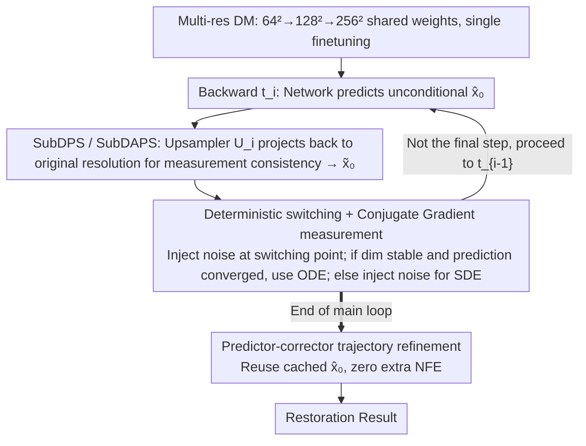

# Image Restoration via Diffusion Models with Dynamic Resolution

**Conference**: ICML 2026  
**arXiv**: [2605.14267](https://arxiv.org/abs/2605.14267)  
**Code**: https://github.com/StarNextDay/SubDAPS (Available)  
**Area**: Diffusion Models / Image Restoration / Accelerated Inference  
**Keywords**: Dynamic Resolution Diffusion, DAPS, Conjugate Gradient, predictor-corrector, ISR  

## TL;DR
SubDAPS / SubDAPS++ integrates pixel-space diffusion restoration methods (such as DPS and DAPS) into a "dynamic resolution diffusion" framework—sampling in $64^2 / 128^2$ subspaces during early stages and returning to the $256^2$ full resolution later. By replacing Langevin with Conjugate Gradient (CG), using threshold-based switching between stochastic/deterministic sampling, and adding a corrector step that requires no extra network evaluations, it outperforms most pixel and latent diffusion methods in 4 linear + 2 non-linear restoration tasks with faster inference.

## Background & Motivation

**Background**: Diffusion models are powerful for image restoration. Pixel-space methods (DPS, DDRM, DDNM, DiffPIR, DAPS, AdaPS) perform iterative sampling directly on $256^2 \times 3$, achieving high inversion quality but remaining slow. Latent-space methods (PSLD, ReSample, LatentDAPS, SILO) sample in the VAE latent space, which is theoretically cheaper, but the requirement for VAE encoding/decoding at each step often makes them slower than pixel methods in practice.

**Limitations of Prior Work**: (a) Pixel-space methods compute everything at high dimensions, where the early stages spend vast computation on "sketching global structure," leading to significant redundancy. (b) Latent-space methods save on latent dimensions but pay the price of repeated encoding/decoding, and the VAE itself limits reconstruction quality.

**Key Challenge**: There is a conflict between "saving costs early" and "rendering details late." Neither pixel nor latent extremes are optimal; a dimensionality-on-demand diffusion process is needed.

**Goal**: (a) Transfer dynamic resolution diffusion (Subspace Diffusion / UDPM / DVDP / DiMR / Fresco) from pure generation to general image restoration. (b) Enable pixel-space algorithms like DPS / DAPS to utilize measurement consistency within the dynamic resolution framework. (c) Further optimize noise injection, measurement updates, and trajectory correction to push quality and speed to the next level.

**Key Insight**: The authors leverage the insight from Jing et al. (2022) that early timesteps mainly focus on low-frequency information, which can be handled in low-resolution subspaces. This naturally fits the ISR (Inverse Super-Resolution) task structure of "restoring global structure before adding high-frequency details."

**Core Idea**: First, finetune a pretrained pixel DM into three shared-weight resolution levels ($64^2 / 128^2 / 256^2$). Modify DPS / DAPS into SubDPS / SubDAPS as baselines. Then, propose three improvements for SubDAPS (CG for measurements, deterministic switching, predictor-corrector) to synthesize SubDAPS++.

## Method

### Overall Architecture
Inference proceeds backward in time $0 = t_0 < t_1 < \dots < t_N = T$, with each timestamp associated with a dimension $d_i$, satisfying $d = d_0 \geq d_1 \geq \dots \geq d_N$ (using $256^2 \to 128^2 \to 64^2$). Each step involves three tasks: (1) Use $\bm{x}_\theta(\bm{x}_{t_i}, t_i)$ to get an unconditional prediction $\hat{\bm{x}}_0$; (2) Use the measurement to correct $\hat{\bm{x}}_0$ into a measurement-consistent $\tilde{\bm{x}}_0$; (3) If the step transits from $d_i$ up to $d_{i-1}$, project the state back to the higher layer and inject noise to match the diffusion prior; otherwise, decide whether to continue with stochastic noise or switch to deterministic updates based on a convergence criterion. SubDAPS++ adds a predictor-corrector pass after the main loop to refine the trajectory without additional network evaluations.

### Key Designs

**1. SubDPS / SubDAPS: Adding an upsampler to measurement correction for subspace compatibility**

The gradient trick in DPS and the decoupled trajectory in DAPS are designed for pixel-space. When sampling in $64^2/128^2$ subspaces, the observation $\bm{y}$ remains in the original image domain, causing a mismatch. The authors' solution is to insert an upsampling matrix $\bm{U}_i$ before the measurement operator, projecting the subspace prediction back to the original resolution to calculate consistency. For SubDPS, when the dimension remains the same $d_{i-1} = d_i$, the likelihood gradient is rewritten as $\nabla_{\bm{x}_{t_i}} \log p_{t_i}(\bm{y} | \bm{x}_{t_i}) \approx -\zeta_{t_i} \nabla_{\bm{x}_{t_i}} \|\bm{y} - \mathcal{A}(\bm{U}_i \bm{x}_\theta(\bm{x}_{t_i}, t_i))\|^2$. For SubDAPS, it solves the optimization $\hat{\bm{x}}_0^{t_i} = \arg\min_{\bar{\bm{x}}_0} \big( r_{t_i} \|\bar{\bm{x}}_0 - \tilde{\bm{x}}_0^{t_i}\|^2 + \|\bm{y} - \mathcal{A}(\bm{U}_i \bar{\bm{x}}_0)\|^2 \big)$, then performs stochastic sampling to the next step.

Resolution switching points $d_{i-1} \neq d_i$ are the difficult parts, as upsampling introduces errors. Borrowing from DAPS's observation that "early noise injection is sufficient to correct cumulative errors," the authors skip specialized correction at switching steps and simply use $\bm{x}_{t_{i-1}} = \alpha_{t_{i-1}} \dot{\bm{U}}_i \bm{x}_\theta(\bm{x}_{t_i}, t_i) + \sigma_{t_{i-1}} \bm{\epsilon}_i$, letting subsequent noise smooth out switching artifacts.

**2. SubDAPS++ Deterministic Switching + Conjugate Gradient: Reducing artifacts and iteration costs**

SubDAPS injects stochastic noise throughout, but at low timesteps where the resolution has returned to full, redundant noise can damage the diffusion prior and leave artifacts. The authors use two conditions to determine when to switch to deterministic updates: define the last dimension change index $h = \min\{i: d_{i-1} \neq d_i\}$; when $i < h$ (dimension stabilized at $256^2$) and the prediction has converged $\|\bm{x}_\theta(\bm{x}_{t_i}, t_i) - \hat{\bm{x}}_0^{t_i}\|^2 \leq \tau$, it switches to a deterministic update $\bm{x}_{t_{i-1}} = \alpha_{t_{i-1}} \hat{\bm{x}}_0^{t_i} + \frac{\sigma_{t_{i-1}}}{\sigma_{t_i}}(\bm{x}_{t_i} - \alpha_{t_i} \hat{\bm{x}}_0^{t_i})$, otherwise it continues with noise. 

Additionally, Langevin dynamics in measurement updates are replaced with Fletcher-Reeves Conjugate Gradient. CG linearizes $\mathcal{A}(\bm{U}_i(\bar{\bm{x}}_0^{(j)} + \alpha \bm{d}_j))$ via first-order Taylor expansion to obtain a closed-form step size $\alpha_j = (\bm{g}_j^\top \bm{d}_j) / (r_{t_i} \bm{d}_j^\top \bm{d}_j + \bm{\omega}_j^\top \bm{\omega}_j)$, with the search direction updated by $\bm{d}_{j+1} = \bm{g}_{j+1} + \frac{\bm{g}_{j+1}^\top \bm{g}_{j+1}}{\bm{g}_j^\top \bm{g}_j} \bm{d}_j$. This closed-form line search works for both linear and non-linear measurements, converging faster than Langevin with fewer hyperparameters.

**3. Predictor-Corrector Refinement: Free post-hoc correction of trajectory deviation**

To prevent divergence, the main loop injects stochastic noise, which widens the trajectory deviation. The authors pass over the trajectory once more after the main loop finishes, using a second-order corrector inspired by UniPC:

$$\bm{x}_{t_{i-1}}^c = \frac{\sigma_{t_{i-1}}}{\sigma_{t_i}} \dot{\bm{U}}_i \bm{x}_{t_i}^c - \left(\sigma_{t_{i-1}} \frac{\alpha_{t_i}}{\sigma_{t_i}} - \alpha_{t_{i-1}}\right) \hat{\bm{x}}_0^{t_{i-1}} - \sigma_{t_{i-1}} \mathcal{I}_i \frac{\hat{\bm{x}}_0^{t_{i-1}} - \dot{\bm{U}}_i \hat{\bm{x}}_0^{t_i}}{\lambda_{t_{i-1}} - \lambda_{t_i}}$$

where $\lambda_t = \log(\alpha_t/\sigma_t)$ is the half log-SNR. Crucially, this step reuses the cached $\hat{\bm{x}}_0^{t_i}$ from the main loop and does not call the neural network, allowing for quality gains at nearly zero cost.

### Loss & Training
- **Training**: Finetuned on the Dhariwal-Nichol pretrained pixel DM. The objective jointly denoises across three resolutions ($\bm{x}_0$, $\tilde{\bm{U}}^\top \bm{x}_0$, $\hat{\bm{U}}^\top \bm{x}_0$), enabling a single network to handle $256/128/64$ resolutions. Finetuning is done once and shared across all downstream tasks.
- **Inference**: Unlike SubDAPS, it replaces the multi-step ODE solver with a single network evaluation $\tilde{\bm{x}}_0 = \bm{x}_\theta(\bm{x}_{t_i}, t_i)$. Measurement consistency uses $J$ steps of CG. The threshold $\tau$, upsampling index $h$, noise level $\sigma$, and iteration count $N$ are hyperparameters.

## Key Experimental Results

### Main Results

| Task (256² FFHQ) | Type | DiffPIR | MGPS | DAPS | AdaPS | LatentDAPS | **SubDAPS++** |
|---|---|---|---|---|---|---|---|
| Inpainting 70% rand, PSNR ↑ | pixel/latent/dynamic | 32.16 | 31.41 | 30.68 | **32.34** | 31.17 | 32.21 |
| Inpainting 70% rand, LPIPS ↓ | | 0.052 | 0.050 | 0.073 | 0.057 | 0.090 | **0.056** |
| SR ×4, PSNR ↑ | | 27.64 | 27.58 | 28.88 | 27.34 | 28.56 | **29.34** |
| SR ×4, LPIPS ↓ | | 0.116 | 0.110 | 0.162 | **0.090** | 0.174 | 0.157 |
| Motion Deblur (FFHQ), PSNR ↑ | | 26.95 | 26.82 | 28.27 | 27.06 | 27.58 | **28.28** |

| Task (256² ImageNet) | Type | DPS | DAPS | LatentDAPS | **SubDAPS++** |
|---|---|---|---|---|---|
| Inpainting 70%, PSNR ↑ | | 25.33 | 27.63 | 27.33 | **28.61** |
| Inpainting 70%, FID ↓ | | 141.99 | 56.73 | 85.24 | **49.15** |
| SR ×4, PSNR ↑ | | 21.68 | 25.54 | 25.43 | **25.79** |
| SR ×4, LPIPS ↓ | | 0.432 | 0.354 | 0.377 | 0.358 |

### Ablation Study

| Configuration | Description |
|---|---|
| SubDPS | Naive port of DPS to dynamic resolution; performance matches DPS (weakest), validating framework feasibility. |
| SubDAPS | Yields results comparable to or better than DAPS, with speedup from subspaces. |
| SubDAPS + CG | Faster measurement updates and compatibility with non-linear operators. |
| SubDAPS + deterministic | Reduces artifacts at low timesteps; increases PSNR and decreases LPIPS. |
| SubDAPS + corrector | Second-order correction without network tuning; adds a free quality boost. |
| Full Stack = SubDAPS++ | Ranked first or second across most metrics in 6 task categories. |

### Key Findings
- Dynamic resolution is better suited for restoration than the latent route: it avoids VAE encoding/decoding overhead and VAE reconstruction bottlenecks, making SubDAPS++ faster and more accurate than LatentDAPS.
- The "low-res structure early, full-res detail late" strategy is natural for ISR/inpainting. Global degradation scenarios like motion deblur also see substantial benefits.
- Using convergence + stability conditions for switching is more robust than a fixed timestep; it lets the current trajectory decide the balance between SDE and ODE.
- CG + first-order Taylor line search allows measurement updates to run on any differentiable $\mathcal{A}$, offering better extensibility than DDRM/DDNM which are limited to linear operators.

## Highlights & Insights
- Borrowing dynamic resolution from generation to restoration is a highly insightful move; the same idea has different utilities in different tasks, and restoration perfectly matches the "coarse-to-fine" inductive bias.
- The assembly of CG, deterministic switching, and the corrector (from numerical optimization, ODE samplers, and UniPC respectively) is a model of effective engineering synthesis.
- Serving all tasks and resolutions with a single finetuned multi-resolution DM is industry-friendly, avoiding the need to train separate models for each resolution.
- The detail of using CG with a first-order Taylor closed-form step size for measurements is elegant—combining the convergence speed of CG with a universal implementation for differentiable operators.

## Limitations & Future Work
- Dynamic resolution is limited to three levels; the need for more levels or complex upsampling for resolutions above $1024^2$ was not explored.
- The switching threshold $\tau$ is a fixed hyperparameter; the authors admit some tasks require manual tuning, suggesting adaptive $\tau$ as a future direction.
- The corrector is applied post-hoc in batch; it does not correct errors during generation, meaning severe hallucinations may still be irreversible.
- Comparisons with the latest LDM-based restoration (e.g., SD-based methods) are limited, especially in natural image SR where SD-based models often hold an advantage in perceptual metrics.

## Related Work & Insights
- **vs DPS / DAPS**: This work is effectively a "rewrite of DPS/DAPS with dynamic resolution"—retaining their measurement correction logic while moving each step to the appropriate dimension for speed without quality loss.
- **vs PSLD / ReSample / LatentDAPS**: Latent routes rely on VAE for dimensionality reduction at the cost of repeated encoder/decoder calls; dynamic resolution avoids VAE, balancing speed and quality better.
- **vs Subspace DM / UDPM / DiMR / Fresco**: These are "generative versions" of dynamic resolution; this paper is the first systematic "restoration version," solving measurement consistency across dimension shifts.
- **vs UniPC**: UniPC's corrector is for deterministic ODEs; this paper migrates it to the end of a stochastic loop as a "free post-hoc correction," representing a smart paradigm crossover.

## Rating
- Novelty: ⭐⭐⭐⭐ First application of dynamic resolution DMs to general image restoration, with adaptations for DPS/DAPS.
- Experimental Thoroughness: ⭐⭐⭐⭐⭐ Comprehensive comparison across 4 linear + 2 non-linear tasks, FFHQ/ImageNet datasets, and three baseline categories.
- Writing Quality: ⭐⭐⭐⭐ Clear pseudocode, derivations, and conditions; could use more diagrams.
- Value: ⭐⭐⭐⭐ Simultaneously fast and accurate inference without relying on VAE, providing a practical acceleration solution for deployment.

<!-- RELATED:START -->

## Related Papers

- [\[CVPR 2026\] VibeToken: Scaling 1D Image Tokenizers and Autoregressive Models for Dynamic Resolution Generations](../../CVPR2026/image_generation/vibetoken_scaling_1d_image_tokenizers_and_autoregressive_models_for_dynamic_reso.md)
- [\[ICLR 2026\] Eliminating VAE for Fast and High-Resolution Generative Detail Restoration](../../ICLR2026/image_generation/eliminating_vae_for_fast_and_high-resolution_generative_detail_restoration.md)
- [\[CVPR 2026\] Residual Diffusion Bridge Model for Image Restoration](../../CVPR2026/image_generation/residual_diffusion_bridge_model_for_image_restoration.md)
- [\[ICML 2026\] Q-DiT4SR: Exploration of Detail-Preserving Diffusion Transformer Quantization for Real-World Image Super-Resolution](q-dit4sr_exploration_of_detail-preserving_diffusion_transformer_quantization_for.md)
- [\[ICML 2026\] UnHype: CLIP-Guided Hypernetworks for Dynamic LoRA Unlearning](unhype_clip-guided_hypernetworks_for_dynamic_lora_unlearning.md)

<!-- RELATED:END -->
