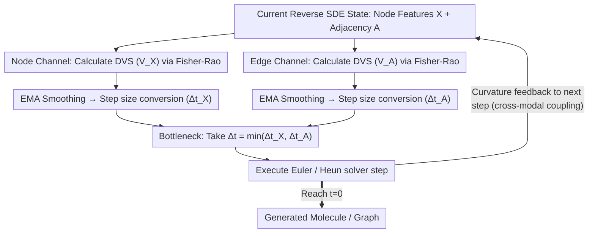

# Information-Geometric Adaptive Sampling for Graph Diffusion

**Conference**: ICML 2026  
**arXiv**: [2605.00250](https://arxiv.org/abs/2605.00250)  
**Code**: None  
**Area**: Diffusion Models / Graph Generation / Adaptive Sampling  
**Keywords**: Graph Diffusion, Fisher-Rao Metric, Adaptive Step Size, Information Geometry, Molecule Generation

## TL;DR
This paper treats the sampling trajectory of the reverse SDE in graph diffusion as a parametric curve on a Riemannian statistical manifold. Using the Fisher-Rao metric, a training-free Drift Variation Score (DVS) is derived to measure the local "information curvature" of the trajectory. The step size is adaptively scaled to ensure equal-length progression on the information manifold, achieving higher FCD/MMD fidelity with fewer steps in molecular (QM9/ZINC250k) and graph (Planar/SBM/Ego) generation.

## Background & Motivation

**Background**: Graph diffusion models (GDSS, GruM, etc.) perform joint denoising on node features $\mathbf{X}$ and adjacency $\mathbf{A}$ using reverse SDEs. Mainstream samplers typically follow fixed-step predictor-corrector frameworks such as Euler-Maruyama or Heun.

**Limitations of Prior Work**: (i) Fixed step sizes implicitly assume that "equal time intervals = equal distribution changes," but reverse SDE dynamics are highly non-uniform: drift is smooth in high-noise regions and changes sharply (stiff) in low-noise regions; (ii) Heuristic quadratic schedules are static presets that cannot adapt to specific data or models; (iii) Adaptive step sizes based on local truncation error estimate errors in the state space, ignoring the intrinsic geometry of the probability path; (iv) The unique "node vs. edge asynchronous denoising" in graph data causes inconsistent stiff moments for nodes and edges, making a single step size difficult to balance.

**Key Challenge**: To uniformly characterize the "distribution evolution rate," one must abandon time $t$ as the arc-length—time is an external parameter, whereas distributional distance is the intrinsic geometry.

**Goal**: (i) Provide an "information-geometric" adaptive step size metric for the reverse SDE of graph diffusion; (ii) Enable separate stiff detection signals for nodes and edges for joint decision-making; (iii) Ensure the method is plug-and-play without retraining.

**Key Insight**: The Gaussian transition kernel $p(x_{t+dt}|x_t; f_t)$ induced by the reverse SDE at each moment is viewed as a point on a statistical manifold with drift $f_t$ as the coordinates. The entire sampling process is a curve. The arc length of this curve is measured using the Fisher-Rao metric (the unique invariant metric determined by Chentsov's Theorem), where the arc length represents the "intrinsic distance of distribution change."

**Core Idea**: $\Delta s^2 \approx$ constant $\Rightarrow \Delta t \propto 1/V_t$, where $V_t = \|d f_t\|^2 / g_t^2$ is the DVS.

## Method

### Overall Architecture
Ours addresses the inefficiency of "fixed-step sampling" in graph diffusion: high-noise regions have smooth dynamics but waste steps, while low-noise regions have sharp drift changes (stiff) but lack granularity. The approach no longer uses time $t$ as the benchmark for sampling progress. Instead, it views each induced transition kernel as a point on a statistical manifold and uses the Fisher-Rao metric to measure the "rate of distribution change," allowing the sampler to progress with equal arc lengths on this information manifold. In implementation, a scalar DVS reflecting local information curvature is calculated for node $\mathbf{X}$ and adjacency $\mathbf{A}$ at each discrete step. After EMA smoothing, these are converted to step sizes via a power law, and the sampler proceeds with the more conservative step of the two. This logic adds only a few lines to the sampling loop without modifying the pretrained score network.

### Key Designs

**1. Fisher-Rao Line Element + Drift Variation Score: A Scalar for Distribution Evolution Rate**

Fixed step sizes fail because they assume "equal time = equal distribution change." Ours quantifies this: the transition kernel for a small interval $dt$ in the reverse SDE $dx_t = f_t dt + g_t d\bar{w}_t$ is Gaussian $p(x_{t+dt}\mid x_t; f_t) = \mathcal{N}(x_t + f_t dt,\, g_t^2 dt\, I)$. Treating drift $f_t$ as the manifold coordinate, the Fisher Information matrix is $\mathcal{I}(f_t) = \frac{dt}{g_t^2}I$, making the line element $ds^2 = \frac{dt}{g_t^2}\|df_t\|^2$. The dimensionless Drift Variation Score is $V_t = ds^2/dt = \|df_t\|^2 / g_t^2$. In discrete solvers, this is estimated as $V_k = \|f(x_k, t_k) - f(x_{k-1}, t_{k-1})\|^2 / g_{t_k}^2$. This scalar captures both "drift change" and "noise scale"—as $g_t$ decreases, $V_t$ increases, matching the intuition that the sampler should slow down when drift is sensitive in low-noise regions. Fisher-Rao is chosen because Chentsov's Theorem guarantees it as the unique invariant metric on statistical manifolds.

**2. Equal Arc-Length Adaptive Law: Distributing Quality Risk and Compute Budget**

With DVS as the arc-length rate, the scheduling goal is $\Delta s_k^2 = V_k\cdot\Delta t_k \approx \text{const}$. Solving this yields $\Delta t_k = \text{clip}\big(\Delta t_{\text{base}}(\kappa_{\text{ref}}/\bar{V})^\beta,\ \Delta t_{\min},\ \Delta t_{\max}\big)$, where $\kappa_{\text{ref}}$ is the target curvature and $\beta=0.5$ provides damping. This causes the step size to automatically contract in stiff regions (high $V$) and expand in smooth regions (low $V$). Fig 3 demonstrates that under fixed $\Delta t$, $\Delta s^2$ is near zero early on but explodes at the end, wasting compute initially and failing during critical structure formation. The equal $\Delta s^2$ strategy flattens the "information progress" curve, spending compute where information actually changes.

**3. Node-Edge Dual Channels + Bottleneck + EMA: Handling Asynchronous Denoising**

Graph diffusion faces the challenge that nodes (continuous) and edges (discrete) denoise at different rates, meaning their stiff moments do not overlap. Using a single metric would ignore one component. Ours calculates $V_{\mathbf{X},k}$ and $V_{\mathbf{A},k}$ separately to derive candidate steps $\Delta t_{\mathbf{X},k}$ and $\Delta t_{\mathbf{A},k}$, finally setting $\Delta t_k = \min(\cdot, \cdot)$ so the stiffest branch acts as the bottleneck. EMA $\bar{V}\leftarrow(1-\alpha)\bar{V} + \alpha V_k$ ($\alpha=0.2$) is applied to each channel to filter SDE noise while tracking structural changes. Cross-modal coupling is further enhanced by feeding back the combined curvature $\bar{V}\leftarrow\gamma(\bar{V}_{\mathbf{X}} + \bar{V}_{\mathbf{A}})$.

### Loss & Training
The method is entirely training-free with no learnable parameters. Four sampling hyperparameters are introduced: $\kappa_{\text{ref}}$ (reference curvature), $\gamma$ (feedback gain, optimal at 0.20 in QM9), $\beta=0.5$ (damping), and $\alpha=0.2$ (EMA). On specific datasets, DVS is enabled only for certain trajectory intervals (Appendix B.1), with fixed steps used elsewhere to maintain numerical stability.

## Key Experimental Results

### Main Results

| Dataset | Model | Method | Key Metrics |
|--------|------|------|----------|
| QM9 | GruM + Euler | Fixed-Step | FCD 0.107 |
| QM9 | GruM + Euler | Quadratic | FCD 0.107 |
| QM9 | GruM + Euler | DVS (Ours) | **FCD 0.095** |
| QM9 | GruM + Heun | DVS | **FCD 0.099 / Best overall SSIM** |
| ZINC250k | GruM + Euler | DVS | FCD 2.092 vs 2.207 baseline |
| QM9 | GDSS + Euler | DVS | FCD 2.482 vs 2.551 |
| Planar | GruM + Heun | DVS | Spec MMD 0.0049 vs 0.0059 |
| SBM | GruM + Euler | DVS | Spec MMD 0.0030 vs 0.0051 |

### Ablation Study

| $\gamma$ | NFE (Steps) | Valid ↑ | FCD ↓ | Scaf. ↑ |
|----------|-----------|---------|-------|---------|
| Euler Baseline | 1000 | 0.9943 | 0.1065 | 0.9341 |
| 0.10 | 706 | 0.9937 | 0.1050 | 0.9370 |
| 0.20 | 745 | 0.9947 | **0.0976** | 0.9415 |
| 0.25 | 770 | 0.9956 | 0.1028 | **0.9455** |
| 0.35 | 836 | 0.9951 | 0.1043 | 0.9428 |

### Key Findings
- **25% Fewer Steps, Higher Quality**: On QM9, DVS achieves FCD 0.0976 with 745 steps, whereas Euler requires 1000 steps to reach only 0.1065, proving that "allocation" is more important than "quantity."
- **DVS-Euler often matches or exceeds Fixed-Step Heun**: This suggests that for graph data, "progressing with equal arc length on the manifold" is more cost-effective than using higher-order solvers for local accuracy.
- **Equal Arc-Length Visualization (Fig 3)**: Fixed Euler $\Delta s^2$ is near zero for most of the trajectory before exploding exponentially at the end. DVS flattens this curve to a near-constant.
- **$\gamma$ determines conservativeness**: Higher $\gamma$ leads to stronger feedback, finer steps, and higher NFE. FCD peaks at 0.20 while Scaf peaks at 0.25, indicating that different metrics favor different levels of granularity.
- For general graphs (SBM, Planar, Ego-small), spectral and orbit MMD are consistently better than quadratic schedules, showing that information-geometric metrics capture both global topology and local motifs.

## Highlights & Insights
- **Geometric Framework for Scheduling**: Instead of empirical tuning like EDM-Karras, DVS is derived from the Fisher-Rao metric. This shift to viewing sampling as progress on an information manifold is highly generalizable to image or video diffusion.
- **Training-free and Plug-and-play**: DVS is implemented by adding just a few lines to the sampling loop with zero intrusion into existing models like GruM or GDSS.
- **Dual-channel + Bottleneck**: Treating nodes and edges as asynchronous components and letting the stiffest channel act as the bottleneck is a robust strategy for multi-component coupling.
- **Visualization of Efficiency**: Fig 3 effectively demonstrates the "empty compute" problem of fixed-step sampling in the early stages and its "explosive failure" in the late stages.

## Limitations & Future Work
- Validated only on two graph diffusion types (GruM's OU bridge and GDSS's score SDE); discrete diffusion (DiGress) remains untested.
- The active intervals for DVS are empirically determined on some datasets, lacking a unified rule.
- $\gamma$ and $\kappa_{\text{ref}}$ are dataset-dependent hyperparameters, requiring recalibration for new tasks.
- DVS relies on drift differencing between steps, which may suffer from high variance in extremely low NFE (e.g., 10 steps).
- The total wall-clock time was not reported; while NFE is reduced, the per-step overhead of EMA and differencing is not evaluated.

## Related Work & Insights
- **vs AYS (Sabour 2024)**: AYS estimates local truncation error in the state space; DVS measures Fisher-Rao arc length in the distribution space, which is more geometrically intrinsic.
- **vs Quadratic schedule (Song 2021a)**: Quadratic is a data-independent static law, whereas DVS is jointly adaptive to both data and model.
- **vs Karras EDM**: Karras EDM relies on empirical noise schedule design, while DVS uses the Fisher metric on the reverse SDE, though DVS's current form depends on Gaussian transition kernel assumptions.
- **vs Song & Lai**: While they use Fisher Information to reweight the score, ours uses the Fisher metric to reallocate step sizes.

## Rating
- Novelty: ⭐⭐⭐⭐
- Experimental Thoroughness: ⭐⭐⭐⭐
- Writing Quality: ⭐⭐⭐⭐
- Value: ⭐⭐⭐⭐

<!-- RELATED:START -->

## Related Papers

- [\[CVPR 2026\] Region-Adaptive Sampling for Diffusion Transformers](../../CVPR2026/image_generation/region-adaptive_sampling_for_diffusion_transformers.md)
- [\[CVPR 2026\] Adaptive Spectral Feature Forecasting for Diffusion Sampling Acceleration](../../CVPR2026/image_generation/adaptive_spectral_feature_forecasting_for_diffusion_sampling_acceleration.md)
- [\[ECCV 2024\] EchoScene: Indoor Scene Generation via Information Echo over Scene Graph Diffusion](../../ECCV2024/image_generation/echoscene_indoor_scene_generation_via_information_echo_over_scene_graph_diffusio.md)
- [\[ICML 2026\] Escaping Mode Collapse in LLM Generation via Geometric Regulation](escaping_mode_collapse_in_llm_generation_via_geometric_regulation.md)
- [\[ICLR 2026\] The Spacetime of Diffusion Models: An Information Geometry Perspective](../../ICLR2026/image_generation/the_spacetime_of_diffusion_models_an_information_geometry_perspective.md)

<!-- RELATED:END -->
