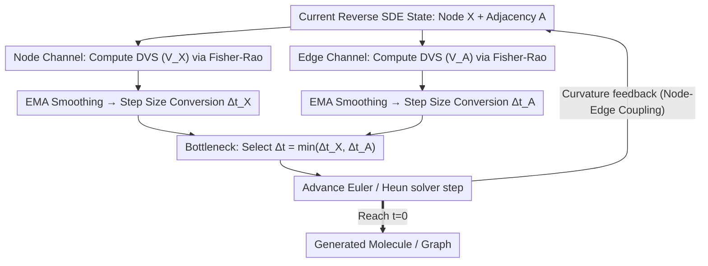

# Information-Geometric Adaptive Sampling for Graph Diffusion

**Conference**: ICML 2026  
**arXiv**: [2605.00250](https://arxiv.org/abs/2605.00250)  
**Code**: None  
**Area**: Diffusion Models / Graph Generation / Adaptive Sampling  
**Keywords**: Graph Diffusion, Fisher-Rao Metric, Adaptive Step Size, Information Geometry, Molecular Generation

## TL;DR
This paper interprets the sampling trajectory of the reverse SDE in graph diffusion as a parametric curve on a Riemannian statistical manifold. Using the Fisher-Rao metric, it derives a training-free Drift Variation Score (DVS) to measure the local "information curvature" of the trajectory. This score adaptively scales step sizes to ensure equal arc-length progression on the information manifold, achieving higher FCD/MMD fidelity with fewer steps in molecular (QM9/ZINC250k) and graph (Planar/SBM/Ego) generation.

## Background & Motivation

**Background**: Graph diffusion models (e.g., GDSS, GruM) utilize reverse SDEs to jointly denoise node features $\mathbf{X}$ and adjacency matrices $\mathbf{A}$. Mainstream samplers typically follow fixed 步长 predictor-corrector frameworks like Euler-Maruyama or Heun.

**Limitations of Prior Work**: (i) Fixed step sizes implicitly assume "equal time interval = equal distribution change," yet reverse SDE dynamics are highly non-uniform: drifts are smooth at high noise levels but become "stiff" (rapidly changing) at low noise levels; (ii) Heuristic quadratic schedules are static presets that cannot adapt to specific data or models; (iii) Adaptive step sizes based on local truncation error estimate errors in state space, ignoring the intrinsic geometry of the probability path; (iv) The unique "node vs. edge asynchronous denoising" in graph data causes inconsistent stiffness timings, making a single step size difficult to balance.

**Key Challenge**: To uniformly characterize the "evolution rate of distributions," one must abandon time $t$ as the measure of arc length—time is an external parameter, whereas distributional distance is the intrinsic geometry.

**Goal**: (i) Provide an adaptive step size metric under "information geometry" semantics for graph diffusion reverse SDEs; (ii) Enable separate stiffness detection signals for nodes and edges with joint decision-making; (iii) Ensure the method is plug-and-play without retraining.

**Key Insight**: Treat the Gaussian transition kernel $p(x_{t+dt}|x_t; f_t)$ induced at each moment as a point on a statistical manifold with drift $f_t$ as coordinates. The sampling process becomes a curve on this manifold. Use the Fisher-Rao metric (the unique invariant metric defined by Chentsov's Theorem) to measure curve arc length—this represents the "intrinsic distance of distribution change."

**Core Idea**: Constant arc length per step $\Delta s^2 \approx$ constant $\Rightarrow \Delta t \propto 1/V_t$, where $V_t = \|d f_t\|^2 / g_t^2$ is the defined DVS.

## Method

### Overall Architecture
The paper addresses the inefficiency of using "fixed step sizes" in graph diffusion reverse SDEs: high-noise segments waste computation on smooth dynamics, while low-noise segments fail to resolve sharp drift changes (stiffness). The proposed approach replaces time $t$ as the progress marker. By treating transition kernels as points on a statistical manifold and using the Fisher-Rao metric to quantify "distributional velocity," the sampler advances with equal arc length on the information manifold. In implementation, a scalar DVS reflecting local information curvature is calculated for node $\mathbf{X}$ and adjacency $\mathbf{A}$ at each discrete step. These are smoothed via EMA and converted to step sizes using a power law. The more conservative value is chosen to advance the Euler/Heun solver, and curvature is fed back to the next step. This logic adds only a few lines to the sampling loop and does not modify the pre-trained score network.

### Key Designs

**1. Fisher-Rao Line Element + Drift Variation Score: A Scalar for Distributional Velocity**

Fixed step sizes fail because they assume uniform change across time. The authors quantify this: the transition kernel of the reverse SDE $dx_t = f_t dt + g_t d\bar{w}_t$ over a small interval is Gaussian $p(x_{t+dt}\mid x_t; f_t) = \mathcal{N}(x_t + f_t dt,\, g_t^2 dt\, I)$. Treating drift $f_t$ as the coordinate, the Fisher Information Matrix is $\mathcal{I}(f_t) = \frac{dt}{g_t^2}I$. The line element on the manifold is $ds^2 = \frac{dt}{g_t^2}\|df_t\|^2$. Normalizing by time yields the dimensionless Drift Variation Score: $V_t = ds^2/dt = \|df_t\|^2 / g_t^2$. In a discrete solver, this is estimated as $V_k = \|f(x_k, t_k) - f(x_{k-1}, t_{k-1})\|^2 / g_{t_k}^2$. This scalar incorporates both drift change and noise scale ($g_t$). As $g_t$ decreases, $V_t$ increases, aligning with the physical intuition that "drifts matter more at low noise," signaling the sampler to slow down. The Fisher-Rao metric is chosen because Chentsov’s Theorem guarantees it is the unique invariant metric for sufficient statistics.

**2. Equal Arc-Length Adaptive Law: Distributing Quality Risk and Compute Budget**

With DVS as the arc-length rate, the scheduling goal is to maintain $\Delta s_k^2 = V_k \cdot \Delta t_k \approx \text{const}$. This leads to the step size formula $\Delta t_k = \text{clip}\big(\Delta t_{\text{base}}(\kappa_{\text{ref}}/\bar{V})^\beta,\ \Delta t_{\min},\ \Delta t_{\max}\big)$, where $\kappa_{\text{ref}}$ is the target curvature and $\beta=0.5$ acts as square-root damping to prevent jitter. This forces steps to contract in stiff regions (high $V$) and expand in smooth regions (low $V$). Fig 3 shows that under fixed $\Delta t$, $\Delta s^2$ is near-zero early on but explodes exponentially at the end. The DVS strategy flattens this "information progress" curve, spending compute where information actually changes.

**3. Node-Edge Channels + Bottleneck + EMA: Handling Asynchrony**

A specific challenge in graph diffusion is that nodes (continuous features) and edges (discrete adjacencies) denoise at different rates. Their stiff moments do not coincide. The authors compute $V_{\mathbf{X},k}$ and $V_{\mathbf{A},k}$ separately, yielding candidate steps $\Delta t_{\mathbf{X},k}$ and $\Delta t_{\mathbf{A},k}$. The final step $\Delta t_k = \min(\cdot, \cdot)$ ensures the more "stiff" channel acts as the bottleneck. To handle SDE stochasticity, an EMA $\bar{V}\leftarrow(1-\alpha)\bar{V} + \alpha V_k$ ($\alpha=0.2$) filters high-frequency noise while tracking structural shifts. After each step, curvature is fed back with a gain: $\bar{V}\leftarrow\gamma(\bar{V}_{\mathbf{X}} + \bar{V}_{\mathbf{A}})$, injecting cross-modal coupling.

### Loss & Training
Ours is entirely training-free with no learnable parameters. It introduces 4 hyperparameters during sampling: $\kappa_{\text{ref}}$ (data-adaptive), $\gamma$ (feedback gain, optimal at 0.20 for QM9), $\beta=0.5$ (fixed), and $\alpha=0.2$ (fixed). For certain datasets, DVS is enabled only for specific intervals of the trajectory to maintain numerical stability.

## Key Experimental Results

### Main Results

| Dataset | Model | Method | Key Metric |
|--------|------|------|----------|
| QM9 | GruM + Euler | Fixed-Step | FCD 0.107 |
| QM9 | GruM + Euler | Quadratic | FCD 0.107 |
| QM9 | GruM + Euler | DVS (Ours) | **FCD 0.095** |
| QM9 | GruM + Heun | DVS | **FCD 0.099 / Best Overall SSIM** |
| ZINC250k | GruM + Euler | DVS | FCD 2.092 vs 2.207 baseline |
| QM9 | GDSS + Euler | DVS | FCD 2.482 vs 2.551 |
| Planar | GruM + Heun | DVS | Spec MMD 0.0049 vs 0.0059 |
| SBM | GruM + Euler | DVS | Spec MMD 0.0030 vs 0.0051 |

### Ablation Study

| $\gamma$ | NFE (Steps) | Valid ↑ | FCD ↓ | Scaf. ↑ |
|----------|-----------|---------|-------|---------|
| Euler Baseline | 1000 | 0.9943 | 0.1065 | 0.9341 |
| 0.10 | 706 | 0.9937 | 0.1050 | 0.9370 |
| 0.20 | 745 | 0.9947 | **0.0976** | 0.9415 |
| 0.25 | 770 | 0.9956 | 0.1028 | **0.9455** |
| 0.35 | 836 | 0.9951 | 0.1043 | 0.9428 |

### Key Findings
- **25% Fewer Steps, Higher Quality**: On QM9, DVS achieves FCD 0.0976 in 745 steps, whereas Euler requires 1000 steps to reach only 0.1065, proving that "allocation" is more important than "quantity."
- **DVS-Euler Competes with Fixed-Step Heun**: For graph data, "equal arc-length progress" is often more cost-effective than the "local precision of higher-order solvers."
- **Arc-Length Visualization (Fig 3)**: Euler's $\Delta s^2$ is near 0 early on and explodes at the end. DVS flattens this curve to a near-constant, only slightly rising when hitting $\Delta t_{\min}$—the "rush through stiff" phenomenon described in InfoLaw.
- **$\gamma$ Determines Conservativeness**: Higher $\gamma$ increases feedback strength, leading to finer steps and higher NFE. FCD peaks at 0.20 while Scaffolding peaks at 0.25, showing different metrics favor different granularity.

## Highlights & Insights
- **Geometric Principle for Scheduling**: Instead of empirical noise schedules (e.g., EDM-Karras), DVS is derived from the Fisher-Rao metric. This "rethinking scheduling in coordinate systems" is transferable to image or video diffusion.
- **Training-Free & Plug-and-Play**: Adds only minimal overhead to the sampling loop with zero changes to pre-trained models, making it highly deployment-friendly.
- **Dual-Channel Bottleneck**: Treating nodes and edges as asynchronous components and letting the stiffest channel act as the bottleneck is an idea applicable to any multi-component coupling (e.g., text+image).

## Limitations & Future Work
- Only validated on two types of graph diffusion (GruM's OU bridge and GDSS's score SDE); discrete diffusion (DiGress) was not tested.
- DVS is enabled only on specific trajectory intervals for some datasets; interval selection remains empirical.
- $\gamma$ and $\kappa_{\text{ref}}$ are dataset-dependent; an automatic calibration method is lacking.
- DVS relies on drift differences to estimate gradients, which may be noisy at very low NFEs (e.g., 10 steps).
- Actual wall-clock time was not reported to confirm if NFE reduction translates to end-to-end speedup given the extra DVS calculations.

## Related Work & Insights
- **vs AYS (Sabour 2024)**: AYS estimates local truncation error in state space for time reparameterization; DVS estimates Fisher-Rao arc length in distribution space, which is more geometrically intrinsic.
- **vs Quadratic Schedule (Song 2021a)**: Quadratic is a static power law; DVS is data-model adaptive. Results show DVS outperforms quadratic in most settings.
- **vs Karras EDM**: EDM tunes $\sigma(t)$ empirically; DVS uses the Fisher metric directly in the reverse SDE for better theoretical grounding, though it assumes Gaussian transition kernels.

## Rating
- Novelty: ⭐⭐⭐⭐ Introducing Fisher-Rao arc length for diffusion scheduling is a unique and self-consistent perspective.
- Experimental Thoroughness: ⭐⭐⭐⭐ Covers various models, tasks, and solvers; missing only wall-clock time and ultra-low NFE evaluations.
- Writing Quality: ⭐⭐⭐⭐ Visualizations in Fig 1 and Fig 3 clearly convey the core ideas.
- Value: ⭐⭐⭐⭐ Training-free, plug-and-play, and interpretable; highly attractive for deployment.

<!-- RELATED:START -->

## Related Papers

- [\[CVPR 2026\] Region-Adaptive Sampling for Diffusion Transformers](../../CVPR2026/image_generation/region-adaptive_sampling_for_diffusion_transformers.md)
- [\[CVPR 2026\] Adaptive Spectral Feature Forecasting for Diffusion Sampling Acceleration](../../CVPR2026/image_generation/adaptive_spectral_feature_forecasting_for_diffusion_sampling_acceleration.md)
- [\[ICML 2026\] Escaping Mode Collapse in LLM Generation via Geometric Regulation](escaping_mode_collapse_in_llm_generation_via_geometric_regulation.md)
- [\[ECCV 2024\] EchoScene: Indoor Scene Generation via Information Echo over Scene Graph Diffusion](../../ECCV2024/image_generation/echoscene_indoor_scene_generation_via_information_echo_over_scene_graph_diffusio.md)
- [\[ICML 2026\] Watch Your Step: Information Injection in Diffusion Models via Shadow Timestep Embedding](watch_your_step_information_injection_in_diffusion_models_via_shadow_timestep_em.md)

<!-- RELATED:END -->
