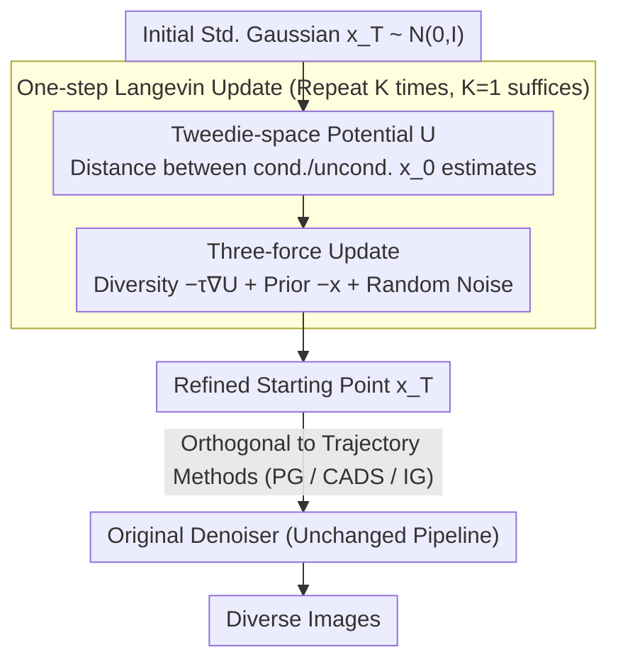

# Initialization is Half the Battle: Generating Diverse Images from a Guidance Potential Posterior

**Conference**: ICML 2026 Spotlight  
**arXiv**: [2606.02453](https://arxiv.org/abs/2606.02453)  
**Code**: https://github.com/South7X/divin (Available)  
**Area**: Diffusion Models / Image Generation  
**Keywords**: Diversity Enhancement, Initial Noise, Langevin Dynamics, Mode Collapse, Guidance Potential

## TL;DR
This paper views "initial noise" as a random variable to be sampled from a posterior defined by a conditional guidance potential. It proposes DivIn: a method using one-step Langevin dynamics to push standard Gaussian noise toward "low-potential, flat" regions. This significantly alleviates mode collapse in diffusion and flow matching models with almost no added inference overhead and is orthogonally compatible with existing trajectory-based diversity methods.

## Background & Motivation

**Background**: Modern diffusion and flow matching models achieve high fidelity in text-to-image and class-to-image generation, but suffer from significant mode collapse—different random seeds often produce highly similar images, or even reproduce training samples in extreme cases. Current methods for improving diversity primarily focus on modifying the "generation trajectory," such as adjusting CFG scales (CADS, Interval Guidance) or introducing mutual repulsion between trajectories (Particle Guidance).

**Limitations of Prior Work**: All existing methods assume the starting point—isotropic Gaussian noise $\mathcal{N}(0, \mathbf{I})$—is sufficient. However, the authors find that standard Gaussian noise is agnostic to the "terrain" of conditional guidance, often landing near "steep peaks" of guidance potential. Consequently, random trajectories from different seeds are attracted to the same strong mode, resulting in nearly identical outputs.

**Key Challenge**: Existing "seed optimization" methods (most notably SAIL) go to the other extreme by using deterministic Hessian/sharpness optimization to pick a "best seed." This collapses the initial distribution into a single point, destroying the original Gaussian prior, reducing overall image diversity, and causing high-frequency artifacts when the latent norm deviates from $\sqrt{d}$.

**Goal**: Reformulate "initial noise selection" as "sampling from a posterior that **preserves the prior while biasing toward diverse regions**." The goal is to leverage the guidance potential terrain without destroying the volume of the initial distribution.

**Key Insight**: Areas with higher conditional guidance potential correspond to higher probability volume contraction rates in the reverse process (Theorem A.3), making trajectories more likely to be sucked into a single mode. Empirical tests on 1,000 prompts show a Spearman correlation of $-0.4$ ($p < 0.001$) between potential and the Vendi score. Thus, **actively pushing initial noise toward low-potential basins** restores diversity, provided it is done as distribution sampling rather than point estimation.

**Core Idea**: Approximate sampling from a "diversity-weighted posterior" using a one-step Langevin update. The noise is simultaneously subjected to three forces: (1) a diversity force pushing it away from high-potential areas; (2) a prior constraint pulling it back to the Gaussian prior manifold; and (3) a random noise term to prevent trapping in local minima.

## Method

### Overall Architecture

DivIn addresses mode collapse by refining the starting point rather than modifying the subsequent denoising trajectory. It changes "initial noise sampling" from blind isotropic Gaussian sampling to sampling from a posterior defined by the guidance potential: $p_{\text{diverse}}(\mathbf{x}_T|c) \propto \exp(-\tau \cdot U(\mathbf{x}_T,c)) \cdot \mathcal{N}(\mathbf{x}_T;0,\mathbf{I})$, where temperature $\tau$ balances the "Gaussian prior" and the "low-potential bias." The pipeline adds only one step: start with standard Gaussian $\mathbf{x}_T^{(0)} \sim \mathcal{N}(0,\mathbf{I})$ → push it toward the posterior using $K$ Langevin steps (empirically $K=1$ is sufficient) → pass the updated $\mathbf{x}_T^{(K)}$ to the original denoiser.

### Key Designs

**1. Tweedie-space Guidance Potential $U$: Quantifying Conditional Pull with a Cheap Scalar**

To sample from the posterior, a potential function is needed that describes how strongly the condition pushes a specific noise point. DivIn defines this as the Euclidean distance between conditional and unconditional one-step Tweedie denoising estimates in the $\mathbf{x}_0$ space: $U(\mathbf{x}_T,c) = \|\hat{\mathbf{x}}_0(\mathbf{x}_T,c) - \hat{\mathbf{x}}_0(\mathbf{x}_T,\varnothing)\|_2$. A larger gap indicates the condition is pulling the trajectory more aggressively at $\mathbf{x}_T$. The authors prove (Prop. A.1) this is a robust proxy for local curvature. By calculating in $\mathbf{x}_0$ space, time-scaling factors $\lambda_t$ are naturally absorbed, making the optimal $\tau$ insensitive to the number of inference steps—avoiding the fragility of SAIL’s second-order Hessian expansion.

**2. One-step Langevin Update on the Posterior: Sampling vs. Optimizing**

To sample from the posterior, the log-gradient is $\nabla_\mathbf{x}\log p_{\text{diverse}} = -\tau \nabla_\mathbf{x} U(\mathbf{x},c) - \mathbf{x}$. The discretized update rule is:

$$\mathbf{x}_T^{(k+1)} = \mathbf{x}_T^{(k)} - \eta\big(\tau \nabla U + \mathbf{x}_T^{(k)}\big) + \sqrt{2\eta}\,\boldsymbol{\xi}^{(k)}$$

The three forces are: the diversity force $-\tau\nabla U$ pushes the latent away from potential peaks; the prior term $-\mathbf{x}$ pulls it back to the Gaussian manifold where $\|\mathbf{x}\|\approx\sqrt{d}$; and the noise term $\sqrt{2\eta}\boldsymbol{\xi}$ helps escape shallow local minima. Unlike SAIL, which treats seed selection as deterministic optimization (often collapsing the distribution volume to a single sharp local minimum), DivIn performs posterior sampling to preserve entropy and disperse latents across low-potential basins.

**3. Orthogonal Compatibility via Non-intrusive Design**

DivIn treats "initialization" and "trajectory" as independent sources of diversity. Since existing methods assume the starting point is sufficiently diverse, modifying Only the start provides orthogonal gains. Define $U$ in $\hat{\mathbf{x}}_0$ space allows DivIn to work with both diffusion ($\hat{\mathbf{x}}_0 = (\mathbf{x}_t - \sqrt{1-\bar\alpha_t}\epsilon_\theta)/\sqrt{\bar\alpha_t}$) and flow matching ($\hat{\mathbf{x}}_0 = \mathbf{x}_t - t\mathbf{v}_\theta$). At $K=1$, it requires only one additional conditional and unconditional forward/backward pass. It can be combined with PG/CADS/IG for "better seeds + trajectory intervention," leading to multiplicative diversity gains.

### Loss & Training

DivIn is a training-free inference-time method. The "objective function" is the Langevin update rule. Key hyperparameters include temperature $\tau$ (usually between $[0.5, 1.0]$), step size $\eta$ (e.g., $0.05$, corresponding to noise scale $\sqrt{2\eta}\approx 0.316$), and steps $K$ (default $1$).

## Key Experimental Results

### Main Results

**Class-conditional Generation (ImageNet-1K, SD v1.4, 10k images, avg. over 5 seeds)**:

| Method | Recall ↑ | Vendi Score ↑ | Coverage ↑ | FID ↓ |
|------|---------:|--------------:|-----------:|------:|
| Base Model | 0.503 | 4.265 | 0.596 | 16.696 |
| + SAIL | 0.543 | 4.549 | 0.591 | 16.395 |
| **+ DivIn (Ours)** | **0.569** | **4.688** | 0.597 | **16.158** |
| CADS | 0.528 | 4.384 | 0.598 | 16.360 |
| **CADS + DivIn** | **0.553** | **4.548** | 0.602 | 16.336 |
| IG | 0.564 | 4.585 | 0.597 | **15.531** |
| **IG + DivIn** | **0.576** | **4.729** | 0.599 | 15.877 |

**Text-to-Image (500 prompt mix, SD v3.5 Medium / Rectified Flow)**: DivIn alone reduces in-batch Similarity from 0.793 to 0.775 and increases Vendi from 1.803 to 1.864. When combined with CADS, Similarity drops to 0.761 and Vendi reaches 1.918, while CLIP and Aesthetic scores remain stable or slightly increase. **This confirms true orthogonality with trajectory methods.**

### Ablation Study

| Configuration | Recall ↑ | Vendi ↑ | Precision ↑ | FID ↓ |
|------|---------:|--------:|------------:|------:|
| Base Model | 0.503 | 4.265 | **0.833** | 16.696 |
| SAIL (Deterministic baseline) | 0.543 | 4.549 | 0.825 | 16.395 |
| DivIn w/o noise (remove $\sqrt{2\eta}\xi$) | 0.541 | 4.534 | 0.822 | 16.544 |
| DivIn w/o prior (remove $-\mathbf{x}$) | 0.557 | 4.584 | 0.824 | **16.121** |
| **DivIn (full)** | **0.569** | **4.688** | 0.825 | 16.158 |

Removing the random term degrades performance to SAIL levels, **indicating that diversity comes from Langevin posterior sampling rather than the potential $U$ itself**. While removing the prior term slightly helps FID at $K=1$, increasing $K$ to $3$ causes FID to spike (17.53 for noise-free, 17.36 for prior-free) compared to $15.98$ for full DivIn. Both terms are essential.

### Key Findings
- **Manifold preservation is a critical safety net**: SAIL reduces the latent norm significantly over 10 optimization steps, leaving the Gaussian manifold and causing high-frequency artifacts. DivIn maintains a stable norm near 128 under the balance of three forces.
- **Near-zero overhead**: At $K=1$, generation time increases by roughly $+3\%$ (from 0.754s to 0.779s per image), whereas SAIL is significantly more expensive due to rejection sampling and second-order approximations.
- **Pareto frontier improvements**: On the diversity-quality Pareto plot, DivIn curves consistently shift the frontier outward for all baselines **without quality trade-offs**.
- **Temperature $\tau$ as a smooth control**: Increasing $\tau$ from $0$ to $1.0$ raises recall from $0.500$ to $0.607$ with minimal precision loss, unlike SAIL's brittle early-stopping threshold.

## Highlights & Insights
- **Redefining "Seed Selection"**: Shifted the paradigm from "finding one optimal seed" (point estimation) to "sampling from a diversity-weighted posterior" (Langevin distribution sampling). The decomposition into "prior + energy + noise" is elegant.
- **Tweedie-space Potential as a Reusable Trick**: Using the distance between conditional and unconditional $\hat{\mathbf{x}}_0$ as a proxy for guidance intensity bypasses Hessian calculations and remains stable across different schedulers and paradigms (DDPM vs. Rectified Flow).
- **The Prior Term Protects Distribution Volume**: Ablations show the prior term's importance grows with $K$, preventing the latent from leaving the $\|\mathbf{x}\|\approx\sqrt{d}$ shell—a warning for all optimization-based seed methods: **leaving this shell inevitably leads to artifacts**.

## Limitations & Future Work
- **Dependence on Manual $\tau$ Calibration**: New architectures or specialized domains (e.g., medical imaging, video) require re-tuning $\tau$.
- **Multi-step Langevin Variance**: While $K=1$ captures most gains, higher $K$ values to better approximate the posterior increase run-to-run variance and computational cost.
- **Conditional Generation Only**: Potential $U$ relies on the difference between conditional and unconditional estimates, so it is not natively supported for purely unconditional models (though curvature could possibly replace it).
- **Semantic Fidelity Constraints**: ImageReward scores slightly decrease when combined with trajectory methods (e.g., IG+DivIn from 0.521 to 0.501), suggesting that pushing to extreme low-potential regions might slightly sacrifice prompt accuracy.

## Related Work & Insights
- **vs. SAIL (Jeon et al., 2025)**: Both look at initialization geometry, but SAIL is **deterministic sharpness optimization**. DivIn uses Tweedie-space potential and Langevin sampling, preserving both the manifold and diversity, outperforming SAIL in Vendi and FID (4.688 vs 4.549; 16.158 vs 16.395).
- **vs. Particle Guidance / CADS / Interval Guidance**: These methods modify the **generation trajectory**. Since they assume a diverse starting point, DivIn's start-point refinement provides **multiplicative gains** and pushes the Pareto frontier further.
- **vs. Noise-optimization routes**: Prior work optimized noise for text-image alignment or concept discovery. DivIn extends this to the **diversity** dimension and shifts the paradigm from "optimize to a point" to "sample from a posterior."

## Rating
- Novelty: ⭐⭐⭐⭐ Uses established tools (Langevin, Tweedie) but the reformulation of initialization as posterior sampling and its orthogonal positioning relative to trajectory methods is quite novel.
- Experimental Thoroughness: ⭐⭐⭐⭐ Covers DDPM and Rectified Flow, class-conditional and text-to-image, with proper averaging and Pareto scans against all major baselines. Lacks only video and very large resolution (>512) validation.
- Writing Quality: ⭐⭐⭐⭐⭐ Clear narrative flow: from observation (mode collapse) to geometric insight (curvature) to formulation (posterior) to algorithm (three forces).
- Value: ⭐⭐⭐⭐ Training-free, $+3\%$ overhead, plug-and-play, and stackable—very engineer-friendly for any diffusion/FM pipeline.

<!-- RELATED:START -->

## Related Papers

- [\[ICML 2025\] Shielded Diffusion: Generating Novel and Diverse Images using Sparse Repellency](../../ICML2025/image_generation/shielded_diffusion_generating_novel_and_diverse_images_using_sparse_repellency.md)
- [\[CVPR 2026\] Refracting Reality: Generating Images with Realistic Transparent Objects](../../CVPR2026/image_generation/refracting_reality_generating_images_with_realistic_transparent_objects.md)
- [\[ICML 2026\] Unified Masked Diffusion Models with Diverse Generation Orders](unifying_masked_diffusion_models_with_various_generation_orders_and_beyond.md)
- [\[CVPR 2026\] HiFi-Inpaint: Towards High-Fidelity Reference-Based Inpainting for Generating Detail-Preserving Human-Product Images](../../CVPR2026/image_generation/hifi-inpaint_towards_high-fidelity_reference-based_inpainting_for_generating_det.md)
- [\[CVPR 2026\] FINE: Factorizing Knowledge for Initialization of Variable-sized Diffusion Models](../../CVPR2026/image_generation/fine_factorizing_knowledge_for_initialization_of_variable-sized_diffusion_models.md)

<!-- RELATED:END -->
