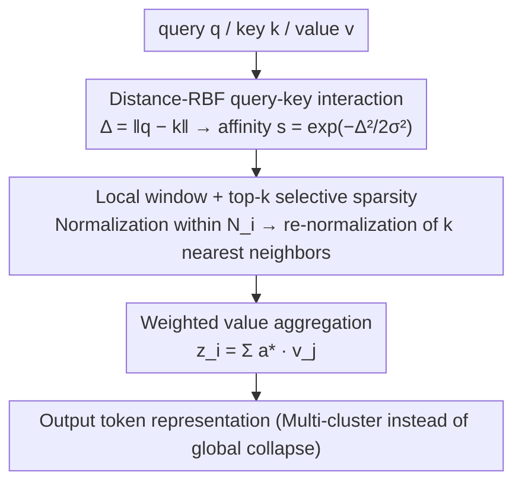

# Krause Synchronization Transformers

**Conference**: ICML 2026  
**arXiv**: [2602.11534](https://arxiv.org/abs/2602.11534)  
**Code**: https://jingkun-liu.github.io/krause-sync-transformers/  
**Area**: Transformer Architecture / Attention Mechanisms / Vision & Generative Models  
**Keywords**: Attention Mechanism, Bounded Confidence Dynamics, Local Sparse Attention, Attention Sink, Multi-cluster Synchronization

## TL;DR
The authors incorporate the Krause bounded confidence consensus model into Transformers, replacing global softmax similarity with "distance-RBF + local window + top-k sparsity." They theoretically prove that this encourages multi-cluster synchronization rather than global collapse, achieving superior performance and 30%+ computational savings across ViT, autoregressive image generation, and LLMs.

## Background & Motivation
**Background**: Self-attention has become the unified architecture for vision, language, and generation; however, its global softmax normalization forces every token to compete for "influence distribution," which, when stacked across layers, generates strong synchronization dynamics.

**Limitations of Prior Work**: (1) Attention sink — attention mass concentrates on a few tokens (usually the initial ones), decoupling from semantic relevance; (2) Representation collapse — in the mean-field limit, token representations converge exponentially to a single dominant mode, limiting the expressivity of deep models; (3) Computational complexity $O(N^2 d)$ restricts scaling to long sequences.

**Key Challenge**: Most existing improvements (sparse attention, kernel approximation, SSM) are post-hoc approximations designed for efficiency and do not rethink "why global softmax collapses" from the interaction rules themselves.

**Goal**: (1) Replace softmax with an interaction rule containing an explicit inductive bias that favors multi-cluster dynamics over a single consensus; (2) Reduce complexity to $O(NWd)$ without sacrificing expressivity; (3) Validate effectiveness across vision, generation, and language task families.

**Key Insight**: The authors draw from the Krause consensus model in social dynamics — where individuals only interact with neighbors with "similar opinions" (within a confidence radius $\epsilon$). Consequently, the system does not converge to a single opinion but forms multiple stable local consensus groups. In a Transformer context: tokens are agents, values are states, and the key is replacing "global similarity" with "local bounded distance."

**Core Idea**: Use an RBF kernel to map the query-key distance $\Delta_{i,j}=\|q_i-k_j\|$ into an affinity $s_{i,j}=\exp(-\Delta_{i,j}^2/(2\sigma^2))$, restricted to a local neighborhood with only the top-$k$ nearest neighbors retained for normalization. This replaces global softmax with "distance-aware + local sparse" bounded confidence attention.

## Method

### Overall Architecture
The authors aim to solve the problem of global consensus collapse, attention sinks, and representation collapse caused by global softmax attention stacked across layers. They introduce the Krause bounded confidence model from social dynamics: tokens are agents interacting only with "opinion-similar" neighbors. Thus, the "global dot-product similarity + softmax normalization" in standard self-attention is replaced by "Euclidean distance RBF affinity + top-$k$ selective sparsity within a local window." This module is a drop-in replacement, keeping LayerNorm, FFN, and RoPE unchanged.

### Key Designs

**1. Distance-RBF query-key interaction: Hard-coding "distance as low weight" into similarity**

Standard dot-product similarity considers direction but not absolute distance; combined with softmax, it often leads to a "winner-take-all" scenario where one token dominates, initiating global collapse. The authors switch to Euclidean distance $\Delta_{i,j}=\|q_i-k_j\|$, mapped via an RBF kernel to affinity $s_{i,j}=\exp(-\Delta_{i,j}^2/(2\sigma^2))$, where $\sigma$ is a learnable temperature. Since the RBF itself provides exponential non-linearity and temperature adjustment, **no additional softmax is used**. Proximity yields high weights while distance is naturally suppressed, corresponding to the "confidence radius" in the Krause model.

**2. Local window + top-$k$ selective sparsity: Implementing "finite neighbor interaction"**

Distance-RBF alone is insufficient as distant tokens still exert non-zero weights, potentially leading to long-range coupling and eventual global synchronization. The authors constrain each token's attention to a spatial/temporal local window $\mathcal{N}_i$ (spatial for vision, causal for autoregression). They first normalize within the neighborhood $\tilde a_{i,j}=s_{i,j}/\sum_{\ell\in\mathcal{N}_i}s_{i,\ell}$, then select the top-$k$ most similar neighbors $\xi_i^k\subseteq\mathcal{N}_i$ for re-normalization $\tilde a^*_{i,j}=s_{i,j}/\sum_{\ell\in\xi_i^k}s_{i,\ell}$, outputting $z_i=\sum_{j\in\xi_i^k}\tilde a^*_{i,j}v_j$. This ensures finite interactions, a core Krause mechanism, reducing complexity from $O(N^2 d)$ to $O(NWd)$ (where $W$ is window size).

**3. Theoretical guarantee of multi-cluster synchronization: Turning "anti-collapse" into a provable structural property**

The authors prove via dynamics and mean-field perspectives that this design stabilizes into multiple clusters rather than a global collapse. Treating token evolution as a particle flow $\dot z_i=\sum_j a_{i,j}V z_j$: when tokens naturally split into $m$ clusters beyond each other's interaction range, top-$k$ forcing ensures cross-cluster $a_{i,j}=0$. Consequently, the global attention matrix $A(t)$ becomes reducible and block-diagonal, with each block evolving independently. In the mean-field limit, the empirical distribution $\mu_t$ evolves into a multi-atomic distribution $\sum_k\pi_k\delta_{\mathcal{L}_k}$, contrasting with standard self-attention where Wasserstein gradient flows contract toward a single consensus.

### Loss & Training
Standard task losses are utilized (Classification Cross-entropy, Autoregressive NLL, Next-token prediction). Besides the learnable temperature $\sigma$, no additional hyperparameters or regularizations are added. For vision tasks, window sizes range from 4–25 and top-$k$ increases linearly across layers (e.g., 2→4 or 8→16). Autoregressive tasks use causal windows with top-$k$ (e.g., CIFAR-10: window 256, k=192). In LLM experiments, Krause Attention acts as an auxiliary shortcut in parallel with standard attention per layer, both adapted using LoRA.

## Key Experimental Results

### Main Results
Krause replacement of self-attention shows comprehensive improvements in vision and generation:

| Task | Dataset | Model | Standard | Krause | Gain / FLOPs |
|------|---------|-------|----------|---------|--------------|
| Classification | CIFAR-10 | ViT-B | 92.45 | **95.35** | +2.9, FLOPs 5.61G→3.77G |
| Classification | CIFAR-100 | ViT-B | 72.28 | **78.03** | +5.8, FLOPs ↓ 33% |
| Classification | ImageNet-1K | ViT-S/16 | 75.54 | **76.39** | +0.85, FLOPs 4.62G→3.22G |
| Classification | ImageNet-1K | ViT-B/32 | 69.90 | **71.49** | +1.6, FLOPs 4.42G→3.00G |
| Classification | CIFAR-10 | Swin-S | 90.21 | **91.13** | +0.92, FLOPs 0.38G→0.18G |
| Generation | MNIST | ARM (BPD↓) | 0.5685 | **0.5652** | Speed 83→106 img/s |
| Generation | CIFAR-10 | ARM | 3.0224 | **3.0032** | Speed 1.9→4.5 img/s |

### Ablation Study
Krause-Llama3-8B (Krause attention as LoRA shortcut) vs. Baseline:

| Evaluation | Llama3-8B | LoRA-FT | Krause-Llama3 | Interpretation |
|------------|-----------|---------|---------------|----------------|
| BoolQ | 76.13 | 80.41 | **80.59** | Comparable |
| CB (Acc/F1) | 41.07/19.41 | 60.71/47.81 | **64.29/48.04** | Significant gain |
| PIQA | 51.52 | 75.16 | **77.77** | +2.6 |
| MNLI | 35.45 | 59.53 | **63.27** | +3.7 |
| ANLI-R1/R2/R3 | ~33 | 38.7/39.9/44.9 | **40.3/40.5/45.7**| Overall gain |
| IFEval | 22.18 | 32.72 | **34.01** | +1.3 |

Training a 200M parameter LM from scratch across 6 zero-shot benchmarks: Krause outperformed 5 baselines (Standard, Window, Top-k, Longformer, Routing) on the majority of the datasets.

### Key Findings
- **Simultaneous Accuracy and Efficiency**: In ViT models across almost all scales, Krause variants increase accuracy while reducing FLOPs by ~30% with constant parameters, suggesting gains stem from interaction rules.
- **Evidence of Attention Sink Mitigation**: Visualization shows Llama has strong "first token attention peaks" with high oscillation across layers; adding the Krause shortcut smooths the curve and removes the sink.
- **Faster and Better Autoregressive Generation**: KARM is over 2× faster than standard ARM with lower BPD, suggesting "distance-aware + local sparse" is a Pareto-optimal point for speed vs. likelihood.
- **Diverse Attention Heads**: Multi-head attention in Krause ViT exhibits distinct multi-cluster distributions, whereas standard ViT heads converge to nearly identical patterns.
- **Complementary to LoRA**: As a shortcut in LLMs, it robustly improves zero-shot capabilities even without replacing self-attention, indicating the utility of distance-aware inductive bias in language modeling.

## Highlights & Insights
- Bridging the Krause consensus model—a social dynamics classic—to Transformers is a compelling cross-disciplinary analogy, supported by a provable multi-cluster formation theorem.
- "Absorbing" the softmax into the RBF kernel simplifies the computational path while naturally fitting the physical intuition of bounded-confidence.
- Implementing Krause Attention as a shortcut in LLMs is a pragmatic strategy—retaining long-range capabilities of full attention while layering on distance-aware multi-cluster bias.
- Quantitative evidence of diversity in multi-head attention highlights that standard ViT heads are nearly redundant, while Krause heads are specialized.

## Limitations & Future Work
- Theoretical analysis assumes tokens have already split into clusters beyond interaction range; the transient behavior from initialization to split is not rigorously characterized.
- Window size $W$ and top-$k$ require task-specific tuning, and no automatic selection strategy currently exists.
- Evaluation in LLMs primarily used shortcuts; full replacement of self-attention in large-scale language modeling remains to be fully validated.
- Scaling behavior beyond 200M parameter training remains unknown.
- Scalability to ImageNet-level autoregressive or diffusion models has not been tested.

## Related Work & Insights
- **vs. Sparse / Linear Attention (Linformer / Performer)**: These approximate softmax for efficiency. Krause Attention redesigns the interaction rule for inductive bias.
- **vs. Top-k Attention (Gupta 2021) / Routing Transformer**: These use sparse selection based on dot-product similarity, lacking the distance-based interpretability and theoretical synchronization guarantees of Krause.
- **vs. Energy Transformer / Hopfield Attention**: Krause models can be viewed as introducing an energy landscape with multiple stable points.
- **vs. Gated Attention (Qiu 2025)**: Another route to mitigate attention sinks using non-linear gating, aiming for similar goals via different mechanisms.

## Rating
- Novelty: ⭐⭐⭐⭐⭐ — Introducing bounded confidence models and proving multi-cluster formation is a genuine conceptual innovation in attention design.
- Experimental Thoroughness: ⭐⭐⭐⭐ — Covers classification, generation, and LLM fine-tuning, though missing LLM full replacement scaling.
- Writing Quality: ⭐⭐⭐⭐ — Clear narrative with clean algorithms and robust theoretical derivations in the appendix.
- Value: ⭐⭐⭐⭐ — Provides a theoretically sound and practically effective alternative to standard attention that directly addresses sinks and representation collapse.

<!-- RELATED:START -->

## Related Papers

- [\[NeurIPS 2025\] OmniSync: Towards Universal Lip Synchronization via Diffusion Transformers](../../NeurIPS2025/image_generation/omnisync_towards_universal_lip_synchronization_via_diffusion.md)
- [\[ICML 2026\] Diagnosing and Correcting Concept Omission in Multimodal Diffusion Transformers](diagnosing_and_correcting_concept_omission_in_multimodal_diffusion_transformers.md)
- [\[ICML 2026\] Scalable GANs with Transformers](scalable_gans_with_transformers.md)
- [\[CVPR 2025\] SyncSDE: A Probabilistic Framework for Diffusion Synchronization](../../CVPR2025/image_generation/syncsde_a_probabilistic_framework_for_diffusion_synchronization.md)
- [\[ICML 2026\] DiScoFormer: Plug-In Density and Score Estimation with Transformers](discoformer_plug-in_density_and_score_estimation_with_transformers.md)

<!-- RELATED:END -->
