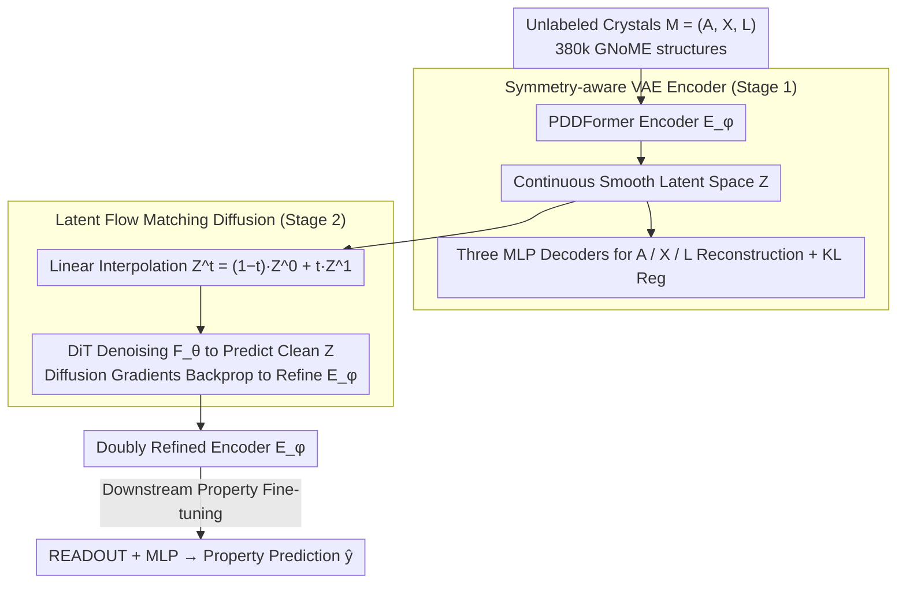

# Latent Diffusion Pretraining for Crystal Property Prediction

**Conference**: ICML2026  
**arXiv**: [2606.00776](https://arxiv.org/abs/2606.00776)  
**Code**: https://github.com/shrimonmuke0202/CrysLDNet.git  
**Area**: Scientific Computing / Materials Science / Crystal Property Prediction / Latent Diffusion Pretraining  
**Keywords**: Crystal property prediction, Latent diffusion, Variational Autoencoder, GNoME pretraining, Materials foundation model

## TL;DR
CrysLDNet migrates "diffusion pretraining" from the raw crystal feature space to a smooth latent space learned by a VAE. This allows the PDDFormer encoder to learn more compact and symmetry-aware structural semantics on 380,000 unlabeled GNoME crystals. Downstream property predictions on JARVIS / MP show an average MAE reduction of 4.26% / 4.90% compared to strong supervised SOTA models, with even more significant advantages in low-data and experimental data correction scenarios.

## Background & Motivation
**Background**: Using GNNs (CGCNN, ALIGNN) and equivariant Transformers (Matformer, PDDFormer) to predict properties such as formation energy and bandgap from 3D crystal structures has achieved accuracy near DFT levels on DFT-labeled data, making them primary surrogates for material screening.

**Limitations of Prior Work**: DFT-labeled data is extremely scarce and highly unevenly distributed (some properties only have a few thousand samples), causing supervised models to suffer from severe overfitting in low-data scenarios. While unlabeled crystal structures abound (GNoME collected 380,000 entries), current self-supervised schemes (CrysXPP, Crystal Twins, CrysGNN) still fall short in capturing structural semantics. Recent diffusion-based pretraining methods like CrysDiff and DPF perform diffusion directly in the raw feature space, requiring the simultaneous handling of three heterogeneous variables: **discrete atom types** (requiring D3PM discrete diffusion), **continuous lattice parameters** (via DDPM), and **periodic fractional coordinates** (requiring score matching based on wrapped normal distributions). This forces architectures to become complex, increases diffusion steps, and constrains the final representation within a non-smooth input space.

**Key Challenge**: Crystal properties are essentially determined by atomic arrangement and lattice geometry. However, the raw feature space is a "fragmented structure" composed of discrete, continuous, and periodic components. Performing diffusion directly on this space is neither elegant nor conducive to learning smooth, transferable representations.

**Goal**: To construct a diffusion-based pretraining framework that provides **unified treatment for the three types of heterogeneous variables** and is non-intrusive to the encoder architecture, ensuring that learned representations can fully reconstruct crystal A / X / L while transferring well to downstream small-sample scenarios.

**Key Insight**: Borrowing the "VAE compression to latent space followed by latent diffusion" paradigm from Stable Diffusion—a VAE encodes the three heterogeneous variables into a unified, continuous, smooth, and low-dimensional latent space $\mathbf{Z} \in \mathbb{R}^{N \times d}$. All diffusion occurs only within this continuous space, while equivariant constraints (rotation/periodic translation) are naturally handled by the PDDFormer encoder.

**Core Idea**: Joint pretraining using a "VAE encoder (PDDFormer) + Latent space Flow Matching (DiT denoising)" to offload the "heavy lifting" of diffusion to the latent space. Downstream, only this doubly refined encoder is fine-tuned.

## Method

### Overall Architecture
CrysLDNet addresses the contradiction between the abundance of unlabeled crystals and the scarcity of DFT labels by pretraining a highly transferable structural encoder on 380,000 unlabeled crystals. It adopts the paradigm of "VAE compression to latent space followed by latent diffusion" used in Stable Diffusion for crystals. First, a symmetry-aware VAE encodes heterogeneous crystal inputs $\mathcal{M}=(\mathbf{A}, \mathbf{X}, \mathbf{L})$ (atom type one-hot $\mathbf{A} \in \mathbb{R}^{N \times k}$, 3D coordinates $\mathbf{X} \in \mathbb{R}^{N \times 3}$, and lattice basis $\mathbf{L} \in \mathbb{R}^{3 \times 3}$) into a unified continuous latent space $\mathbf{Z} \in \mathbb{R}^{N \times d}$. Subsequently, flow matching diffusion is performed solely within this latent space to refine the encoder. The pretraining consists of two stages (VAE reconstruction + Latent diffusion). Downstream, the refined PDDFormer encoder is connected to a READOUT + MLP for property fine-tuning, outputting $\hat{y}=\text{MLP}_\lambda(\text{READOUT}(\mathcal{E}_\phi(\mathcal{M})))$. Since all diffusion and decoding only perceive latent representations, the encoder can be replaced by other equivariant Transformers.

### Key Designs

**1. Symmetry-aware VAE Encoder: Flattening Heterogeneous Crystals into a Unified Latent Space**

The raw input of crystals is a "fragmented structure" of discrete atom types, continuous lattice parameters, and periodic fractional coordinates. Unlike CrysDiff/DPF, which must run separate diffusion processes (D3PM + DDPM + wrapped normal) for these, CrysLDNet uses a VAE to compress these variables into a unified continuous latent space, leaving the subsequent diffusion to handle only a simplified distribution. The encoder chosen is PDDFormer, one of the strongest current equivariant Transformers for periodic crystals, which naturally satisfies $\mathcal{E}_\phi(\mathbf{A}, \mathbf{QX}, \mathbf{QL})=\mathcal{E}_\phi(\mathbf{A}, \mathbf{X}, \mathbf{L})$. Since equivariance is "encapsulated" within the encoder, symmetry does not need further explicit constraints in the latent space. Three independent MLP decoders reconstruct $\mathbf{Z}$ back to atom types (cross-entropy), coordinates ($\ell_2$), and lattices ($\ell_2$). The total loss $\mathcal{L}_{\text{VAE}}=\mathcal{L}^{\mathbf{A}}_{\text{recon}}+\mathcal{L}^{\mathbf{X}}_{\text{recon}}+\mathcal{L}^{\mathbf{L}}_{\text{recon}}+\alpha\mathcal{L}_{\text{reg}}$, where $\mathcal{L}_{\text{reg}}=d_{\text{KL}}(q_\phi(\mathbf{Z}|\mathcal{M})\,\|\,p(\mathbf{Z}))$ pulls the latent distribution toward a standard Gaussian to stabilize variance and prepare a clean target distribution for subsequent diffusion.

**2. Latent Flow Matching Diffusion: Double Refinement via Diffusion Objectives**

VAE reconstruction alone only teaches the encoder representations sufficient for "restoring structure." CrysLDNet adds a flow matching diffusion layer on the stage-1 latent space, forcing the learned $\mathbf{Z}$ to be both "reconstructible" and "denoisable." Specifically, the clean sample is defined as $\mathbf{Z}^1=\mathcal{E}_\phi(\mathcal{M})$ and noise as $\mathbf{Z}^0 \sim \mathcal{N}(0,1)^{N \times d}$. After sampling $t \sim \mathcal{U}(0,1)$, linear interpolation gives $\mathbf{Z}^t=(1-t)\mathbf{Z}^0+t\mathbf{Z}^1$. The corresponding conditional vector field is $u_t(\mathbf{Z}^t|\mathbf{Z}^1)=(\mathbf{Z}^1-\mathbf{Z}^t)/(1-t)$. A DiT denoising network then predicts the clean latent variable $\bar{\mathbf{Z}}^1=\mathcal{F}_\theta(\mathbf{Z}^t,t)$, with the loss simplified to $\mathcal{L}_{\text{LDM}}=\frac{1}{(1-t)^2}\frac{1}{N}\sum_i\|\mathbf{z}^1_i-\bar{\mathbf{z}}^1_i\|^2$. Crucially, $\mathcal{E}_\phi$ and $\mathcal{F}_\theta$ are **jointly** updated—diffusion gradients backpropagate to the encoder, effectively "reshaping" the latent space using the diffusion objective. This offers three benefits: the latent space is a single continuous Gaussian target, eliminating the need for heterogeneous diffusion types; the low dimensionality of $\mathbf{Z}$ reduces DiT denoising steps and parameters; and the refined encoder captures structural and chemical information more precisely. Figure 3 shows that the A/X/L reconstruction accuracy of CrysLDNet consistently outperforms CrysDiff and DPF, directly validating the expressive gain from latent diffusion.

**3. Backbone-Agnostic Design: Decoupling the Paradigm from the Backbone**

Crystal representation learning backbones evolve rapidly (CGCNN, ALIGNN, Matformer, PDDFormer, etc.). If a pretraining framework is deeply coupled with a specific encoder, every upgrade necessitates re-design and re-training. CrysLDNet decouples the "pretraining paradigm" from the "backbone network" by attaching the VAE decoders, DiT, losses, and optimization targets solely to the shape $(N, d)$ of the latent representation $\mathbf{Z}$, independent of how the encoder aggregates neighborhoods. Experiments show that upgrading $\mathcal{E}_\phi$ from Matformer to PDDFormer yields an additional average gain of 10.46% / 12.39% on JARVIS / MP (Table 2), which is proportional to the backbone's strength. Conversely, even with the weaker Matformer, CrysLDNet reduces MAE by 7.53% / 7.87% compared to the original Matformer—proving that gains stem primarily from the "latent diffusion" paradigm rather than just encoder upgrades.

### Loss & Training
- Stage 1: $\mathcal{L}_{\text{VAE}}=\mathcal{L}^{\mathbf{A}}_{\text{recon}}+\mathcal{L}^{\mathbf{X}}_{\text{recon}}+\mathcal{L}^{\mathbf{L}}_{\text{recon}}+\alpha\mathcal{L}_{\text{reg}}$, until convergence.
- Stage 2: $\mathcal{L}_{\text{LDM}}=\frac{1}{(1-t)^2}\frac{1}{N}\sum_i\|\mathbf{z}^1_i-\bar{\mathbf{z}}^1_i\|^2$, **jointly** updating $\mathcal{E}_\phi$ and $\mathcal{F}_\theta$.
- Pretrain Data: 380,740 unlabeled crystal structures filtered from GNoME (excluding entries overlapping with downstream test sets or lacking physical clarity).
- Finetune: $\mathcal{L}_{\text{MSE}}=\|\hat{y}-y\|^2$, with an independent encoder copy fine-tuned for each property.

## Key Experimental Results

### Main Results: MAE Comparison on JARVIS-DFT and MP

The table below presents MAE for several representative properties (lower is better), covering the strongest supervised baseline PDDFormer, diffusion pretraining models DPF / CrysDiff, and Ours (CrysLDNet):

| Dataset | Property | PDDFormer | DPF | CrysDiff | CrysLDNet (Ours) | Gain vs PDDFormer |
|--------|------|-----------|-----|----------|-----------|------|
| JARVIS | Formation Energy (eV/atom) | 0.027 | 0.029 | 0.029 | **0.026** | -3.7% |
| JARVIS | Bandgap OPT (eV) | 0.120 | 0.122 | 0.131 | **0.118** | -1.7% |
| JARVIS | Bandgap MBJ (eV) | 0.251 | 0.311 | 0.287 | **0.238** | -5.2% |
| JARVIS | Ehull (eV/atom) | 0.033 | 0.059 | 0.062 | **0.032** | -3.0% |
| JARVIS | Bulk Modulus (GPa) | 9.546 | 10.43 | 9.875 | **8.817** | -7.6% |
| JARVIS | Shear Modulus (GPa) | 8.808 | 9.596 | 9.191 | **8.428** | -4.3% |
| JARVIS | SLME (%) | 4.300 | 5.129 | 5.030 | **4.120** | -4.2% |
| MP | Formation Energy | 0.016 | 0.020 | – | **0.015** | -6.3% |
| MP | Bulk Modulus | 0.034 | 0.042 | – | **0.032** | -5.9% |
| MP | Shear Modulus | 0.062 | 0.073 | – | **0.059** | -4.8% |

Overall average: CrysLDNet vs PDDFormer = **-4.26% (JARVIS) / -4.90% (MP)**; CrysLDNet vs DPF = **-16.76% / -19.34%**.

### Ablation Study

| Configuration | Formation | Bandgap OPT | Ehull | Bulk | Spillage | Description |
|------|-----------|------|------|------|------|------|
| VAE only | 0.031 | 0.126 | 0.059 | 10.61 | 0.374 | No LDM, Stage-1 recon pretraining only |
| LDM only | 0.030 | 0.123 | 0.052 | 10.37 | 0.370 | No VAE, direct raw space diffusion |
| Only A | 0.032 | 0.125 | 0.058 | 10.49 | 0.355 | Reconstruct atom type only |
| Only X | 0.031 | 0.122 | 0.060 | 10.21 | 0.352 | Reconstruct coordinates only |
| Only L | 0.032 | 0.136 | 0.055 | 10.46 | 0.351 | Reconstruct lattice only |
| A + X | 0.034 | 0.125 | 0.052 | 10.25 | 0.358 | Reconstruct A and X |
| L + X | 0.033 | 0.124 | 0.046 | 10.51 | 0.354 | Reconstruct L and X |
| **CrysLDNet (Full)** | **0.026** | **0.118** | **0.032** | **8.817** | **0.340** | All three recons + LDM |

### Key Findings
- **VAE and LDM are both indispensable**: VAE-only or LDM-only reached 10.61 / 10.37 Bulk Modulus respectively, far worse than the full model's 8.817, indicating that VAE flattening and LDM semantic refinement are complementary.
- **Greater gains in low-data regimes**: Figure 2 shows that with 20% / 40% finetune data, CrysLDNet(Matformer) can outperform PDDFormer trained on full data. With 40% data, CrysLDNet reduces MAE by 12.83% / 22.49% compared to PDDFormer / Matformer, demonstrating a typical "leverage effect" of pretraining.
- **Backbone-agnostic design is validated**: Upgrading the encoder from Matformer to PDDFormer yields an additional 10.46% / 12.39% improvement on JARVIS / MP, which is proportional to the backbone upgrade itself.
- **Correction of DFT systematic biases**: On OQMD-EXP experimental data, zero-shot MAE dropped from CrysGNN's 0.253 to 0.205. With 20% experimental data fine-tuning, it dropped further to 0.097 (CrysGNN 0.135), proving that latent pretraining captures representations that bridge the DFT-to-experimental gap.
- **Reconstruction quality correlates with downstream performance**: Figure 3 illustrates that CrysLDNet's superior A/X/L reconstruction accuracy on GNoME directly translates to lower downstream MAE, establishing a clear causal chain of representation capability.

## Highlights & Insights
- **Transferring the "Latent Diffusion" paradigm from Stable Diffusion to crystals**: Crystal heterogeneity (discrete atoms + continuous lattice + periodic coordinates) is fundamentally similar to the high-dimensional challenges of RGB pixels—both "raw spaces are unsuitable for diffusion." This work uses the same solution—VAE compression—and reaps similar benefits (model simplification, enhanced expressiveness).
- **Joint training of $\mathcal{E}_\phi$ + $\mathcal{F}_\theta$ is the key**: Many might follow a "train VAE first, freeze it, then train LDM" sequence. However, Stage-2's backpropagation of diffusion gradients to the encoder effectively "reshapes" the latent space. This is essential for the results—the VAE-only version has 10.61 Bulk MAE, which drops to 8.817 after joint training.
- **Backbone-agnostic is a "honest" selling point**: Many self-supervised improvements are actually driven by backbone upgrades. Using the same backbone (Matformer), this method still yields a 7.87% improvement, proving the paradigm's robustness while allowing it to harvest dividends from future backbone upgrades.
- **Extensible to other "heterogeneous 3D structures"**: Molecules, proteins, and catalytic interfaces all combine discrete atoms, continuous coordinates, and possible periodic/topological constraints. This template of "Equivariant Encoder $\rightarrow$ Smooth Latent Space $\rightarrow$ Latent Flow Matching" can be adapted almost directly, serving as a lightweight but effective alternative to SE(3)/E(3) equivariant diffusion.

## Limitations & Future Work
- **Acknowledged Limitations**: Experiments focused primarily on JARVIS and MP benchmarks; evaluation on more complex crystal types like alloys or glasses is absent. The OQMD-EXP dataset contains only 1,500 samples, limiting the scope of DFT bias correction experiments.
- **Potential Methodological Issues**: (1) No sensitivity analysis is provided for the KL regularization strength $\alpha$. Excessive strength may sacrifice reconstruction accuracy, while insufficient strength may result in a non-smooth latent space—both impacting Stage-2 stability. (2) DiT's self-attention over $N$ atom tokens might lead to high computational costs for very large unit cells. (3) Experiments involved per-property independent fine-tuning, without exploring multi-task fine-tuning or zero-shot prompt settings.
- **Future Directions**: (a) Incorporating conditional LDM (conditional flow matching) to inject property labels during pretraining for semi-supervised joint training. (b) Using LoRA or adapters to enable a single pretrained encoder to serve multiple properties, reducing deployment costs. (c) Unifying latent diffusion with generation tasks—CrysLDNet already possesses an LDM and could theoretically generate new crystals satisfying specific constraints via sampling.

## Related Work & Insights
- **vs CrysDiff (Song et al. 2024)**: CrysDiff performs simultaneous diffusion (D3PM + DDPM + wrapped normal) in the raw feature space, leading to a complex architecture and many steps. Ours uses VAE to flatten the heterogeneous space, resulting in simplicity and higher efficiency, with a 10.7% lower MAE on JARVIS Bulk Modulus (8.817 vs 9.875).
- **vs DPF (Shen et al. 2025a)**: DPF is a diffusion-based pretraining by the same authors as PDDFormer but uses Matformer and feature-space diffusion. Ours uses PDDFormer + latent diffusion, achieving a 16.76% overall reduction on JARVIS. Table 2 proves that even when using Matformer (fair comparison), Ours outperforms DPF, confirming latent diffusion is superior to feature-space diffusion.
- **vs CrysGNN / Crystal Twins (2022-2023)**: These early contrastive/reconstructive self-supervised methods without diffusion have significantly higher MAEs (e.g., 13.41 vs 8.817 on JARVIS Bulk Modulus), replicating the trend in NLP/CV where "generative SSL > contrastive SSL."
- **vs Stable Diffusion / DALL-E 2**: The methodology is homologous—compressing heterogeneous data into smooth continuous latent spaces for diffusion—but the purpose differs: CV aims for high-resolution generation, whereas this work aims for representation pretraining. This cross-domain transfer is highly noteworthy.

## Rating
- Novelty: ⭐⭐⭐⭐ Cleanly transfers the mature latent diffusion paradigm to crystal pretraining; clear method but not a disruptive innovation.
- Experimental Thoroughness: ⭐⭐⭐⭐⭐ 13 properties across two major datasets + backbone-agnostic validation + low-data analysis + experimental correction + exhaustive ablation.
- Writing Quality: ⭐⭐⭐⭐ Clear storyline and well-defined algorithm steps; some hyperparameter sensitivity analysis could be expanded.
- Value: ⭐⭐⭐⭐⭐ Provides a long-term reusable pretraining paradigm in a field where labels are expensive and backbones evolve rapidly; high engineering value.

<!-- RELATED:START -->

## Related Papers

- [\[CVPR 2026\] Property-Informed Diffusion-Based Text-to-Microstructure Generation](../../CVPR2026/image_generation/property-informed_diffusion-based_text-to-microstructure_generation.md)
- [\[CVPR 2026\] Latent Diffusion Inversion Requires Understanding the Latent Space](../../CVPR2026/image_generation/latent_diffusion_inversion_requires_understanding_the_latent_space.md)
- [\[ICML 2026\] MIRO: Multi-Reward Conditioned Pretraining for Simultaneously Improving T2I Quality and Efficiency](miro_multi-reward_conditioned_pretraining_improves_t2i_quality_and_efficiency.md)
- [\[ECCV 2024\] Learning Semantic Latent Directions for Accurate and Controllable Human Motion Prediction](../../ECCV2024/image_generation/learning_semantic_latent_directions_for_accurate_and_controllable_human_motion_p.md)
- [\[NeurIPS 2025\] LLM Meets Diffusion: A Hybrid Framework for Crystal Material Generation](../../NeurIPS2025/image_generation/llm_meets_diffusion_a_hybrid_framework_for_crystal_material_generation.md)

<!-- RELATED:END -->
