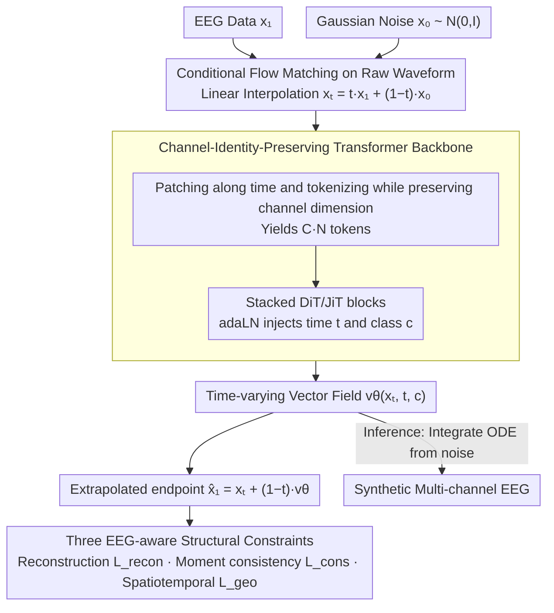

# Let EEG Models Learn EEG

**Conference**: ICML 2026  
**arXiv**: [2605.21280](https://arxiv.org/abs/2605.21280)  
**Code**: https://y-research-sbu.github.io/JET/ (Project Page)  
**Area**: Medical Imaging / Neural Signal Generation / Flow Matching  
**Keywords**: EEG Generation, Conditional Flow Matching, Transformer, Spectral Fidelity, Structural Constraints

## TL;DR
JET redefines multi-channel EEG generation as a "continuous trajectory on the neural manifold," utilizing Conditional Flow Matching with a standard Transformer to directly model raw waveforms. Coupled with three structural constraints characterizing EEG spectra, stationarity, and statistics, JET reduces TS-FID by over 40% against strong baselines across three clinical TUH benchmarks.

## Background & Motivation

**Background**: EEG foundation models have developed rapidly in recent years (BrainBERT/Brant/Neuro-GPT/EEGPT/CbraMod, etc.). However, high-quality clinical EEG is constrained by privacy and annotation costs, making it several orders of magnitude smaller than text or image data. Thus, reliable "native EEG generation" is required as a prerequisite for large-scale neural modeling.

**Limitations of Prior Work**: Existing EEG generators are either GANs (EEG-GAN), discrete denoising diffusion models, or involve tokenizing signals for autoregression (MEG-GPT, GPT2MEG). The training objectives of these methods perform local reconstruction under isotropic Gaussian noise assumptions, resulting in severe spectral bias, monotonic repetitions in long sequences, and an inability to cover pathological large-amplitude events.

**Key Challenge**: EEG signals are essentially continuous biological time series featuring $1/f^{\chi}$ power-law spectra, non-stationarity, and heavy tails. Conversely, mainstream generation paradigms (discrete denoising with Gaussian priors) only excel at minimizing local mean squared errors. This leads to a systematic mismatch across frequency, temporal, and statistical dimensions, where small errors accumulate along sampling steps to destroy the global structure.

**Goal**: (1) Formalize EEG generation as a continuous dynamical process rather than discrete denoising steps; (2) Design a backbone capable of capturing long-range dependencies and multi-channel dynamic interactions; (3) Incorporate "EEG-aware" structural constraints into the training objective to ensure the flow field maintains EEG invariants in geometric and statistical senses.

**Key Insight**: Brain activity evolves smoothly within a high-dimensional state space (neural manifold hypothesis); thus, generation should follow this continuous trajectory rather than repeated noise addition and removal. Conditional Flow Matching (CFM) provides a continuous alternative by learning a vector field that transports a prior to the data.

**Core Idea**: Directly perform conditional flow matching on raw multi-channel EEG using a DiT/JiT-style pure Transformer to learn the time-varying vector field $\mathbf{v}_\theta(\mathbf{x}_t,t,c)$, while explicitly embedding EEG physical characteristics (robust reconstruction, statistical consistency, and spatiotemporal structure) into the loss function.

## Method

### Overall Architecture
JET addresses how to generate high-fidelity multi-channel EEG ($\mathbf{X}\in\mathbb{R}^{C\times T}$) that preserves spectra without drift. The framework treats generation as a "continuous trajectory from noise to data on the neural manifold." During training, it learns a time-varying vector field, and during inference, it integrates an ODE starting from Gaussian noise to obtain synthetic EEG. The pipeline eliminates discrete diffusion steps and integrates physical constraints directly into the training objective.

### Key Designs

**1. Conditional Flow Matching on Raw Waveforms: Replacing Discrete Denoising with Continuous Trajectories**

EEG is an inherently smooth, continuous biological process. Discrete noise schedules can systematically mismatch neural dynamics, and small errors accumulate over sampling steps in long sequences. JET adopts Conditional Flow Matching (CFM): during training, $\mathbf{x}_1$ is sampled from data and $\mathbf{x}_0$ from $\mathcal{N}(\mathbf 0,\mathbf I)$. Along the linear interpolation path $\mathbf{x}_t = t\mathbf{x}_1 + (1-t)\mathbf{x}_0$, the model regresses the target vector field $\mathbf{u}_t = \mathbf{x}_1 - \mathbf{x}_0$. The loss simplifies to $\ell_{\text{CFM}} = \mathbb{E}_t \|\mathbf{v}_\theta(\mathbf{x}_t,t,c) - (\mathbf{x}_1 - \mathbf{x}_0)\|$. Inference requires solving the ODE $\mathrm{d}\mathbf{x}_t/\mathrm{d}t = \mathbf{v}_\theta(\mathbf{x}_t,t,c)$ until $t=1$. This modeling aligns better with the continuous nature of brain activity and is faster than token autoregression (4.78s vs. 7.01s for Diffusion under identical conditions). To handle the imbalance between normal background and rare epileptic events in TUH, adaptive balanced sampling is used, where $p_i \propto 1/N_c^\alpha$.

**2. Channel-Identity-Preserving Transformer Backbone (JET): Building Long-range Spatiotemporal Dependencies**

EEG is influenced by volume conduction and functional connectivity, exhibiting long-range synchronization and temporal drift. This violates CNN local assumptions and fixed-topology graph models. JET utilizes the global receptive field of self-attention. Specifically, $\mathbf{X}$ is segmented into non-overlapping patches of length $P$, resulting in $\mathbf{X}_p\in\mathbb{R}^{C\times N\times P}$. Crucially, when projecting patches to $D$-dimensional tokens, the channel dimension is preserved, resulting in a sequence of $C\cdot N$ tokens. DiT/JiT-style Transformer blocks are then stacked, with time $t$ and class $c$ embeddings injected via adaLN. This "channel-identity-preserving" tokenization allows the model to simultaneously capture temporal dependencies and cross-channel interactions. Ablations show $P=200$ is the optimal trade-off for efficiency and fidelity.

**3. Three "EEG-aware" Structural Constraints: Embedding Physical Invariants into the Flow Field**

Standard flow matching Euclidean regression corresponds to Gaussian likelihood, which can be skewed by EEG spike artifacts and fail to fit the $1/f^\chi$ power-law spectrum. JET adds three constraints based on the extrapolated endpoint $\hat{\mathbf{x}}_1 = \mathbf{x}_t + (1-t)\,\mathbf{v}_\theta$: (i) Laplace prior reconstruction $\mathcal{L}_{\text{recon}} = \mathbb{E}_t \|\mathbf{x}_1 - \hat{\mathbf{x}}_1\|_1$ to resist EMG/electrode artifacts; (ii) First and second-order moment consistency $\mathcal{L}_{\text{cons}} = \lambda_{\text{cons}} (\|\mu(\mathbf{x}_1) - \mu(\hat{\mathbf{x}}_1)\|_1 + \|\sigma(\mathbf{x}_1) - \sigma(\hat{\mathbf{x}}_1)\|_1)$ to prevent amplitude drift; (iii) Spatiotemporal structural term $\mathcal{L}_{\text{geo}} = \lambda_{\text{tv}}\frac{1}{T}\sum_t \|\nabla_t \hat{\mathbf{x}}_1\|_1 + \lambda_{\text{corr}} (1 - \rho(\mathbf{x}_1, \hat{\mathbf{x}}_1))$, where Total Variation (TV) suppresses high-frequency jitter and Pearson correlation $\rho$ preserves waveform morphology. These correspond to robustness, statistical manifolds, and time-frequency structure.

### Loss & Training
The total objective is the sum of three constraints: $\mathcal{L}_{\text{total}} = \mathcal{L}_{\text{recon}} + \mathcal{L}_{\text{cons}} + \mathcal{L}_{\text{geo}}$, using $\ell_1$ for reconstruction, $\ell_1$ moment matching for statistics, and TV + Pearson for geometry. The base distribution is fixed as $\mathcal{N}(\mathbf 0, \mathbf I)$. Ablations demonstrate that if the prior degrades to a single point $\delta(\mathbf 0)$, the flow field becomes an ill-posed one-to-many mapping, causing TS-FID to surge. Sample weights are re-weighted by $1/N_c^\alpha$ to ensure coverage of rare pathological events.

## Key Experimental Results

### Main Results
Evaluated on three TUH Corpus subsets (TUAB abnormal, TUEV events, TUSZ seizures, totaling 10k+ clinical sessions). Metrics include TS-FID (distribution fidelity), Silhouette (conditional consistency), and downstream augmentation gain ($\Delta$ Acc using a CbraMod classifier).

| Dataset | Metric | EEG-GAN | Vanilla Diffusion | JET (Ours) |
|---------|--------|---------|--------------------|-----------|
| TUAB | TS-FID $\downarrow$ | 324.18 | 342.91 | **188.27** |
| TUAB | Silhouette $\uparrow$ | 0.786 | 0.710 | **0.995** |
| TUAB | $\Delta$ Acc $\uparrow$ | +0.000 | -0.002 | **+0.029** |
| TUEV | TS-FID $\downarrow$ | 448.65 | 415.82 | **235.86** |
| TUEV | Silhouette $\uparrow$ | 0.667 | 0.703 | **0.983** |
| TUEV | $\Delta$ Acc $\uparrow$ | -0.004 | -0.000 | **+0.032** |
| TUSZ | TS-FID $\downarrow$ | 274.37 | 300.47 | **151.27** |
| TUSZ | Silhouette $\uparrow$ | 0.891 | 0.746 | **0.987** |
| TUSZ | $\Delta$ Acc $\uparrow$ | +0.001 | +0.000 | **+0.017** |

JET reduces TS-FID by at least 40% across all datasets. Silhouette scores near 1.0 indicate almost perfect intraclass consistency. Notably, only JET's synthetic samples provide a positive gain for the downstream CbraMod classifier.

### Ablation Study
**Constraint-wise Ablation (Table 4, TS-FID)**:

| Configuration | TUAB | TUEV | TUSZ | Description |
|---------------|------|------|------|-------------|
| $\mathcal{L}_{\text{recon}}$ only | 231.19 | 287.81 | 221.74 | Pure $\ell_1$, lowest performance |
| +$\mathcal{L}_{\text{cons}}$ | 228.87 | 281.70 | 209.99 | Moment matching prevents drift |
| +$\mathcal{L}_{\text{tv}}$ | 219.45 | 266.61 | 210.00 | Suppresses spurious high frequencies |
| +$\mathcal{L}_{\text{corr}}$ | 221.26 | 278.01 | 200.87 | Preserves waveform morphology |
| Full (All four) | **188.27** | **235.86** | **151.27** | Optimal: All terms are complementary |

**Base Distribution Ablation (Table 3)**: Replacing the Gaussian prior with $\delta(\mathbf 0)$ causes TS-FID to skyrocket from ~200 to 1600+, verifying the necessity of a non-degenerate base distribution for multi-modal EEG.

**Drift Analysis (Table 2, TUEV)**: Measuring spurious drift via the linear slope of the RMS envelope and moment differences $D_\mu, D_\sigma$. JET's Wasserstein distance (0.015 / 0.021 / 0.018) is within 2× of the real-vs-real floor (0.008 / 0.012 / 0.010), whereas EEG-GAN/Diffusion are 5–8× higher.

### Key Findings
- The three structural constraints are complementary: TV removes high-frequency noise, Pearson preserves morphology, and moment consistency prevents drift. Combining them reduces six physical diagnostic indicators (PSD slope, temporal envelope, Hjorth parameters) by nearly half (Table 5).
- Non-degenerate base distributions are essential: Starting from $\delta(\mathbf 0)$ causes the flow field to collapse into an ill-posed mapping, especially evident in heavy-tailed multimodal distributions like EEG.
- Spectral analysis indicates JET preserves the $\alpha$ peak (8–13Hz) while actively suppressing EMG noise above 15Hz, suggesting selective "EEG-aware" modeling rather than simple marginal spectrum approximation.

## Highlights & Insights
- **Paradigm Shift**: Transitioning EEG generation from "discrete denoising" to "flow matching ODE" introduces the physical fact of continuous trajectories into the training objective, resulting in a cleaner technical path and faster inference.
- **Decomposition of Structural Constraints**: Table 5 uses six physical diagnostic indicators not directly optimized to verify which failure modes $\mathcal{L}_{\text{cons}}/\mathcal{L}_{\text{tv}}/\mathcal{L}_{\text{corr}}$ address, providing a clear template for future constraint design.
- **Transferability**: The combination of CFM, channel-identity-preserving Transformers, and physical constraints is applicable to other biological time series such as ECG, MEG, and continuous motion signals by replacing constraints with domain-specific invariants (rhythm, HRV, etc.).

## Limitations & Future Work
- Evaluation is limited to the TUH corpus family (TUAB/TUEV/TUSZ); generalization across devices, sampling rates, and electrode standards remains unverified. Few-shot cross-dataset generation is a logical next step.
- TS-FID utilizes Fréchet distance of spectral features, which partially aligns with the model's frequency domain constraints, posing a slight risk of "metric-loss alignment" inflation. Future work should include subjective blind evaluations by clinical experts.
- Conditional input $c$ is currently limited to one-hot pathological categories, neglecting subject metadata (age, electrode placement, medication). Fine-grained control for personalized synthesis could be explored.
- The trade-off between ODE step count and sampling accuracy was not systematically analyzed; further acceleration (e.g., distillation) is worth exploring.

## Related Work & Insights
- **vs. EEG-GAN (Hartmann 2018)**: Early GAN route; suffers from unstable training and poor mode coverage, failing to preserve EEG spectra and heavy-tailed statistics. JET bypasses adversarial objectives, reducing TS-FID by ~40%.
- **vs. Vanilla Diffusion (Song 2021)**: Discrete denoising exhibits severe spectral bias and drift in long sequences. JET replaces discrete steps with CFM and physical constraints, turning downstream gains from zero to positive.
- **vs. MEG-GPT / GPT2MEG (2024–2025)**: Autoregression tokenizes signals into discrete symbols, fundamentally mismatching continuous neural dynamics. JET maintains raw waveforms and skips quantization loss.
- **vs. BrainOmni (Xiao 2025) tokenizer-style loss**: Also uses $\ell_1$ and Pearson constraints, but JET's backbone yields 60% better TS-FID (Table 7), suggesting the contribution lies in the structural alignment of constraints with EEG invariants rather than merely adding losses.
- **vs. DiT / JiT (Peebles 2023; Li & He 2025)**: Methodological lineage—verifying that plain Transformers with adaLN in vision successfully transfer to EEG with "minimal inductive bias + high scalability."

## Rating
- Novelty: ⭐⭐⭐⭐ Systematically introduces CFM to EEG generation with a suite of "physically invariant" constraints.
- Experimental Thoroughness: ⭐⭐⭐⭐ Solid conclusions across three clinical benchmarks and multiple physical metrics; minor point deduction for focusing solely on the TUH corpus.
- Writing Quality: ⭐⭐⭐⭐ Clear logical chain from motivation to method and ablation; well-structured mapping of failure modes to constraints.
- Value: ⭐⭐⭐⭐ Provides a high-fidelity synthesis baseline for the EEG foundation model era, effectively halving TS-FID with immediately usable downstream gains.

<!-- RELATED:START -->

## Related Papers

- [\[ICLR 2026\] Step-Aware Residual-Guided Diffusion for EEG Spatial Super-Resolution](../../ICLR2026/image_generation/step-aware_residual-guided_diffusion_for_eeg_spatial_super-resolution.md)
- [\[ECCV 2024\] DreamDiffusion: High-Quality EEG-to-Image Generation with Temporal Masked Signal Modeling and CLIP Alignment](../../ECCV2024/image_generation/dreamdiffusion_high-quality_eeg-to-image_generation_with_temporal_masked_signal_.md)
- [\[CVPR 2026\] Back to Basics: Let Denoising Generative Models Denoise](../../CVPR2026/image_generation/back_to_basics_let_denoising_generative_models_denoise.md)
- [\[ICLR 2026\] Learn to Guide Your Diffusion Model](../../ICLR2026/image_generation/learn_to_guide_your_diffusion_model.md)
- [\[ICLR 2026\] When Scores Learn Geometry: Rate Separations under the Manifold Hypothesis](../../ICLR2026/image_generation/when_scores_learn_geometry_rate_separations_under_the_manifold_hypothesis.md)

<!-- RELATED:END -->
