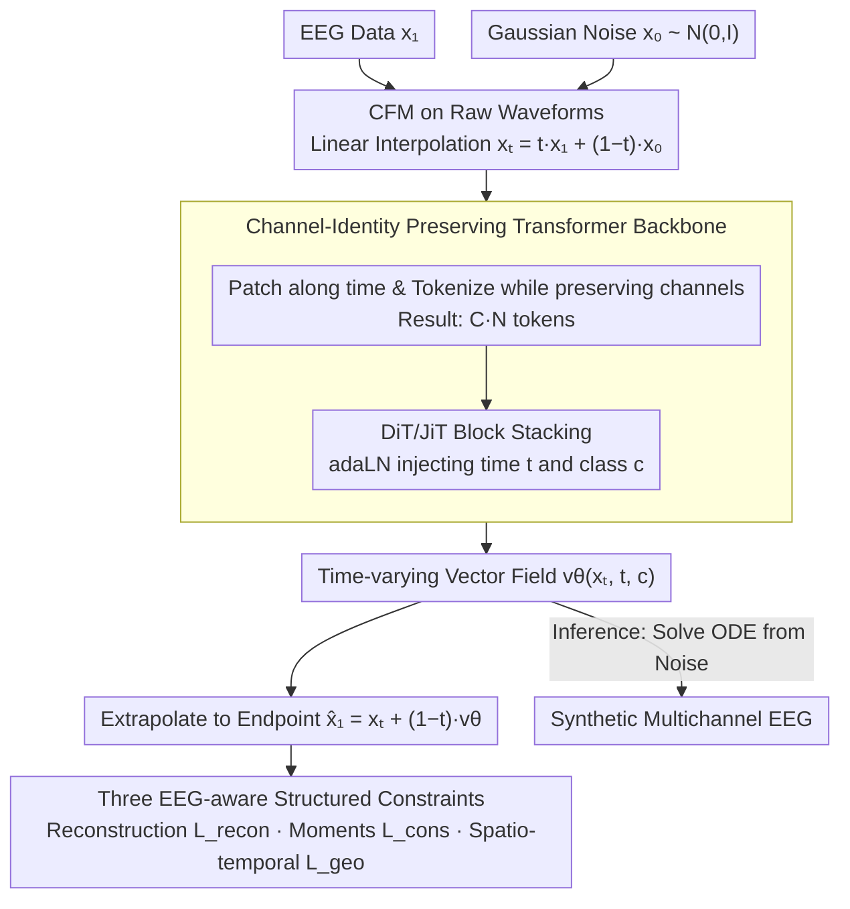

# Let EEG Models Learn EEG

**Conference**: ICML 2026  
**arXiv**: [2605.21280](https://arxiv.org/abs/2605.21280)  
**Code**: https://y-research-sbu.github.io/JET/ (Project Page)  
**Area**: Medical Imaging / Neural Signal Generation / Flow Matching  
**Keywords**: EEG Generation, Conditional Flow Matching, Transformer, Spectral Fidelity, Structured Constraints

## TL;DR
JET redefines multichannel EEG generation as "continuous trajectories on a neural manifold." By combining Conditional Flow Matching (CFM) with a standard Transformer to model raw waveforms directly, and incorporating three structured constraints for EEG spectrum, stationarity, and statistics, JET reduces the TS-FID of strong baselines by over 40% on three major TUH clinical benchmarks.

## Background & Motivation

**Background**: EEG foundation models (e.g., BrainBERT, Brant, Neuro-GPT, EEGPT, CbraMod) have developed rapidly. However, high-quality clinical EEG data is constrained by privacy and labeling costs, remaining several orders of magnitude smaller than text or image datasets. Thus, reliable "native EEG generation" is a prerequisite for large-scale neural modeling.

**Limitations of Prior Work**: Existing EEG generators typically use GANs (EEG-GAN), discrete denoising diffusion, or autoregressive modeling after tokenization (MEG-GPT, GPT2MEG). These methods optimize local reconstruction under isotropic Gaussian noise assumptions, leading to severe spectral bias, monotonic repetitions in long sequences, and an inability to cover large-amplitude pathological events.

**Key Challenge**: EEG signals are essentially $1/f^{\chi}$ power-law, non-stationary, and heavy-tailed continuous biological time series. Current generation paradigms (discrete denoising + Gaussian priors) excel only at minimizing local Mean Squared Error, resulting in a systemic mismatch across frequency, temporal, and statistical dimensions. Small errors accumulate along sampling steps, destroying global structure.

**Goal**: (1) Formalize EEG generation as a continuous dynamical process rather than discrete denoising steps; (2) Design a backbone capable of capturing long-range dependencies and cross-channel dynamic interactions; (3) Introduce "EEG-aware" structured constraints into the training objective to maintain geometric and statistical EEG invariants.

**Key Insight**: Brain activity evolves smoothly in a high-dimensional state space (the neural manifold hypothesis). Generation should follow this continuous trajectory rather than repeated noise addition and removal. Conditional Flow Matching (CFM) provides such a continuous alternative by learning a vector field that transports a prior to the data distribution.

**Core Idea**: Apply CFM directly to raw multichannel EEG using a pure DiT/JiT-style Transformer to learn the time-varying vector field $\mathbf{v}_\theta(\mathbf{x}_t,t,c)$, while explicitly incorporating physical EEG properties (robust reconstruction, statistical consistency, and spatio-temporal structure) into the loss function.

## Method

### Overall Architecture
JET conceptualizes generation as a "continuous trajectory from noise to data on the neural manifold." During training, it learns a time-varying vector field. During inference, it integrates an ODE starting from Gaussian noise to obtain synthetic EEG. This pipeline eliminates the multi-step discrete denoising of diffusion models and directly embeds "EEG-aware" physical constraints into the training objective.

### Key Designs

**1. CFM on Raw Waveforms: Replacing Discrete Denoising with Continuous Trajectories**

EEG is a smoothly evolving biological process. Discrete noise schedules systematically mismatch neural dynamics, and small errors accumulate over long sequences. JET employs Conditional Flow Matching: during training, it samples data $\mathbf{x}_1$ and noise $\mathbf{x}_0 \sim \mathcal{N}(\mathbf 0,\mathbf I)$, regressing the target vector field $\mathbf{u}_t = \mathbf{x}_1 - \mathbf{x}_0$ along the linear interpolation path $\mathbf{x}_t = t\mathbf{x}_1 + (1-t)\mathbf{x}_0$. The loss simplifies to $\ell_{\text{CFM}} = \mathbb{E}_t \|\mathbf{v}_\theta(\mathbf{x}_t,t,c) - (\mathbf{x}_1 - \mathbf{x}_0)\|$. Inference requires solving the ODE $\mathrm{d}\mathbf{x}_t/\mathrm{d}t = \mathbf{v}_\theta(\mathbf{x}_t,t,c)$ until $t=1$. This approach aligns better with the continuity of brain activity and is faster than token autoregression (4.78s vs. 7.01s for Diffusion under identical conditions). To handle the imbalance between normal background and rare seizure events in TUH, JET use adaptive balanced sampling proportional to the inverse class frequency $p_i \propto 1/N_c^\alpha$.

**2. Channel-Identity Preserving Transformer (JET): Capturing Long-range Spatio-temporal Dependencies**

EEG is influenced by volume conduction and functional connectivity, exhibiting both long-range synchronization and temporal drift. This violates the local assumptions of CNNs and the fixed topology of static graphs. JET utilizes the global receptive field of self-attention. Specifically, it patches $\mathbf{X}$ along the time axis into non-overlapping segments of length $P$, resulting in $\mathbf{X}_p\in\mathbb{R}^{C\times N\times P}$. Crucially, it preserves the channel dimension during projection to $D$-dimensional tokens, yielding a sequence of $C\cdot N$ tokens. Transformer blocks (DiT/JiT style) then process these tokens, with time $t$ and class $c$ embeddings injected via adaLN. This "channel-identity preserving" tokenization allows the model to capture temporal dependencies and cross-channel interactions simultaneously. Ablations show $P=200$ is the optimal trade-off for efficiency and fidelity.

**3. Three "EEG-aware" Structured Constraints: Embedding Physical Invariants**

Standard flow matching uses Euclidean regression (equivalent to Gaussian likelihood), which is easily biased by EEG's sharp artifacts, underfits $1/f^\chi$ power-law spectra, and lacks constraints on mean/variance drift in long sequences. JET introduces three constraints applied to the extrapolated endpoint $\hat{\mathbf{x}}_1 = \mathbf{x}_t + (1-t)\,\mathbf{v}_\theta$: (i) Laplacian reconstruction $\mathcal{L}_{\text{recon}} = \mathbb{E}_t \|\mathbf{x}_1 - \hat{\mathbf{x}}_1\|_1$ for robustness against EMG/electrode artifacts; (ii) First/Second moment consistency $\mathcal{L}_{\text{cons}} = \lambda_{\text{cons}} (\|\mu(\mathbf{x}_1) - \mu(\hat{\mathbf{x}}_1)\|_1 + \|\sigma(\mathbf{x}_1) - \sigma(\hat{\mathbf{x}}_1)\|_1)$ to prevent amplitude drift; (iii) Spatio-temporal structure $\mathcal{L}_{\text{geo}} = \lambda_{\text{tv}}\frac{1}{T}\sum_t \|\nabla_t \hat{\mathbf{x}}_1\|_1 + \lambda_{\text{corr}} (1 - \rho(\mathbf{x}_1, \hat{\mathbf{x}}_1))$, where Total Variation (TV) suppresses high-frequency jitter and Pearson correlation $\rho$ preserves waveform morphology. These align with "robustness—statistical manifold—spatio-temporal structure," respectively.

### Loss & Training
The total objective is $\mathcal{L}_{\text{total}} = \mathcal{L}_{\text{recon}} + \mathcal{L}_{\text{cons}} + \mathcal{L}_{\text{geo}}$ (using $\ell_1$ for reconstruction and statistics, and TV+Pearson for geometry). The base distribution is fixed as $\mathcal{N}(\mathbf 0, \mathbf I)$. Ablations demonstrate that if this regresses to a point mass $\delta(\mathbf 0)$, the flow field becomes an ill-posed one-to-many mapping, causing TS-FID to spike. Samples are reweighted by $1/N_c^\alpha$ to ensure coverage of rare pathological events.

## Key Experimental Results

### Main Results
Evaluated on three TUH Corpus subsets (TUAB Abnormal, TUEV Events, TUSZ Seizures, totaling 10k+ clinical sessions). Metrics include distribution fidelity (TS-FID), class consistency (Silhouette), and downstream augmentation gain ($\Delta$ Acc using a CbraMod classifier).

| Dataset | Metric | EEG-GAN | Vanilla Diffusion | JET (Ours) |
|---------|--------|---------|--------------------|-----------|
| TUAB | TS-FID $\downarrow$ | 324.18 | 342.91 | **188.27** |
| TUAB | Silhouette $\uparrow$ | 0.786 | 0.710 | **0.995** |
| TUAB | $\Delta$ Acc $\uparrow$ | +0.000 | -0.002 | **+0.029** |
| TUEV | TS-FID $\downarrow$ | 448.65 | 415.82 | **235.86** |
| TUEV | Silhouette $\uparrow$ | 0.667 | 0.703 | **0.983** |
| TUEV | $\Delta$ Acc $\uparrow$ | -0.004 | -0.000 | **+0.032** |
| TUSZ | TS-FID $\downarrow$ | 274.37 | 300.47 | **151.27** |
| TUSZ | Silhouette $\uparrow$ | 0.891 | 0.746 | **0.987** |
| TUSZ | $\Delta$ Acc $\uparrow$ | +0.001 | +0.000 | **+0.017** |

JET reduces TS-FID by at least 40% across all datasets. A Silhouette score near 1 indicates nearly perfect intra-class consistency. Crucially, only JET's synthetic samples provide positive gains for downstream classifiers; baselines often degrade accuracy.

### Ablation Study
**Incremental Ablation of Constraints (Table 4, TS-FID)**:

| Configuration | TUAB | TUEV | TUSZ | Description |
|---------------|------|------|------|-------------|
| $\mathcal{L}_{\text{recon}}$ only | 231.19 | 287.81 | 221.74 | Pure $\ell_1$, worst; proves Euclidean regression is insufficient |
| +$\mathcal{L}_{\text{cons}}$ | 228.87 | 281.70 | 209.99 | Moment matching prevents drift |
| +$\mathcal{L}_{\text{tv}}$ | 219.45 | 266.61 | 210.00 | Suppresses spurious high frequencies |
| +$\mathcal{L}_{\text{corr}}$ | 221.26 | 278.01 | 200.87 | Preserves waveform morphology |
| Full | **188.27** | **235.86** | **151.27** | Four terms are complementary; best performance |

**Noise Base Distribution Ablation (Table 3)**: Replacing the Gaussian prior with a degenerate $\delta(\mathbf 0)$ causes TS-FID to skyrocket from ~200 to 1600+, verifying the necessity of a non-degenerate base distribution for multimodal EEG.

**Drift Analysis (Table 2, TUEV)**: Measuring spurious drift using the linear slope of the RMS envelope and moment differences ($D_\mu, D_\sigma$). JET's Wasserstein distances are within 2× of the real-vs-real floor, whereas EEG-GAN/Diffusion are 5–8×.

### Key Findings
- Structured constraints are complementary: TV removes high-frequency noise, Pearson preserves morphology, and moment consistency prevents drift. Combining them halves six physical diagnostic metrics (PSD slope, temporal envelope, Hjorth parameters).
- The base distribution must be non-degenerate: Starting from a single point $\delta(\mathbf 0)$ causes the flow field to collapse into an ill-posed mapping, especially evident in heavy-tailed multimodal EEG distributions.
- Spectral analysis shows JET preserves the $\alpha$ peak (8–13Hz) while actively suppressing EMG noise above 15Hz, indicating "EEG-aware" selective modeling rather than simple marginal spectrum approximation.

## Highlights & Insights
- **Paradigm Shift**: Transitioning EEG generation from "discrete denoising" to "flow matching ODEs" incorporates the physical reality of continuous trajectories into the training objective, resulting in faster inference.
- **Educational Value of Structured Constraints**: Table 5 validates how $\mathcal{L}_{\text{cons}}$, $\mathcal{L}_{\text{tv}}$, and $\mathcal{L}_{\text{corr}}$ target specific failure modes using various physical diagnostic metrics, providing a clear template for constraint design.
- **Transferability**: The combination of CFM, channel-identity preserving Transformers, and physical constraints is applicable to other biological time series like ECG and MEG by replacing constraints with domain-specific invariants (e.g., heart rate variability, stationarity).

## Limitations & Future Work
- Evaluation is limited to the TUH corpus family; generalization across hardware, sampling rates, and electrode standards remains unverified. Few-shot cross-dataset generation is a natural next step.
- TS-FID uses spectral feature Fréchet distance, which partially aligns with the model's frequency domain constraints. Independent subjective blind evaluations by clinicians would be beneficial.
- Current conditions $c$ are one-hot pathological categories, ignoring subject metadata (age, medication, montage). Future work could introduce fine-grained controls for personalized synthesis.

## Related Work & Insights
- **vs. EEG-GAN (Hartmann 2018)**: Early GAN routes suffer from unstable training and poor mode coverage. JET sidesteps adversarial objectives using continuous flow fields, reducing TS-FID by ~40%.
- **vs. Vanilla Diffusion (Song 2021)**: Discrete denoising exhibits spectral bias and long-term drift in EEG. JET's combination of CFM and physical constraints yields positive downstream transfer gains.
- **vs. MEG-GPT / GPT2MEG (2024–2025)**: Autoregressive models discretize signals into tokens, fundamentally mismatching continuous neural dynamics. JET operates on raw waveforms, skipping quantization losses.
- **vs. BrainOmni (Xiao 2025) tokenizer-style loss**: While using similar $\ell_1$ and Pearson constraints, applying those losses to the JET backbone still results in significantly higher TS-FID, suggesting JET's success lies in the alignment between constraint design and EEG invariants.
- **vs. DiT / JiT (Peebles 2023; Li & He 2025)**: Inherits the design philosophy that plain Transformers with adaLN are highly effective for EEG, favoring "minimal inductive bias + high scalability."

## Rating
- Novelty: ⭐⭐⭐⭐ Systematically introduces CFM to EEG generation with "physically aligned" constraint designs.
- Experimental Thoroughness: ⭐⭐⭐⭐ Solid conclusions across clinical benchmarks and diagnostic metrics, though limited to the TUH corpus.
- Writing Quality: ⭐⭐⭐⭐ Clear logical chain from motivation to methodology and ablations.
- Value: ⭐⭐⭐⭐ Provides a high-fidelity synthetic baseline for the EEG foundation model era, doubling fidelity and providing downstream gains.

<!-- RELATED:START -->

## Related Papers

- [\[ICLR 2026\] Step-Aware Residual-Guided Diffusion for EEG Spatial Super-Resolution](../../ICLR2026/image_generation/step-aware_residual-guided_diffusion_for_eeg_spatial_super-resolution.md)
- [\[ECCV 2024\] DreamDiffusion: High-Quality EEG-to-Image Generation with Temporal Masked Signal Modeling and CLIP Alignment](../../ECCV2024/image_generation/dreamdiffusion_high-quality_eeg-to-image_generation_with_temporal_masked_signal_.md)
- [\[ICLR 2026\] Concept-TRAK: Understanding how diffusion models learn concepts through concept-level attribution](../../ICLR2026/image_generation/concept-trak_understanding_how_diffusion_models_learn_concepts_through_concept-l.md)
- [\[ICLR 2026\] When Scores Learn Geometry: Rate Separations under the Manifold Hypothesis](../../ICLR2026/image_generation/when_scores_learn_geometry_rate_separations_under_the_manifold_hypothesis.md)
- [\[ICML 2026\] Adversarial Flow Models](adversarial_flow_models.md)

<!-- RELATED:END -->
