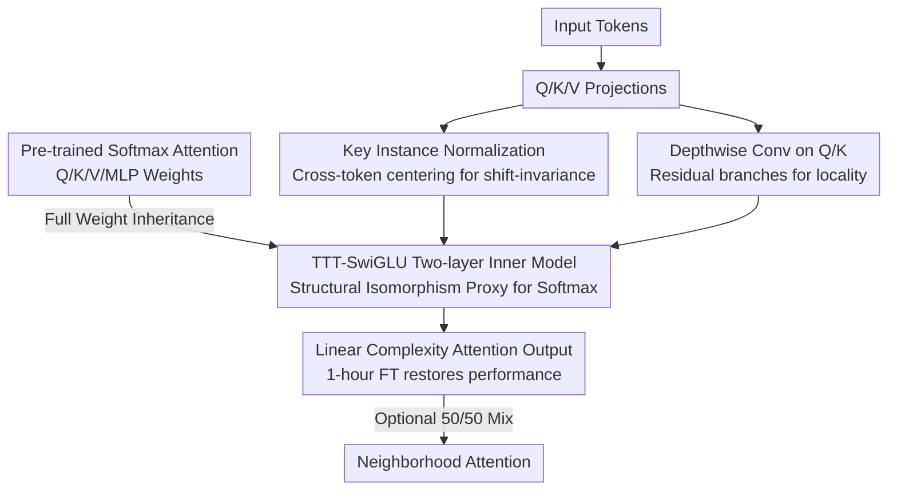

# Linearizing Vision Transformer with Test-Time Training

**Conference**: ICML 2026  
**arXiv**: [2605.02772](https://arxiv.org/abs/2605.02772)  
**Code**: Not yet released  
**Area**: Image Generation / Vision Transformer / Linear Attention / Stable Diffusion Acceleration  
**Keywords**: Test-Time Training, Linear Attention, Weight Inheritance, Instance Normalization, DiT Acceleration

## TL;DR
The authors discover that a two-layer TTT inner model is structurally equivalent to Softmax attention (where Softmax can be viewed as a two-layer dynamic MLP). This facilitates direct weight inheritance of Q/K/V/MLP. By incorporating key Instance Normalization for shift-invariance and depthwise convolutions on Q/K for locality, they linearized and accelerated Stable Diffusion 3.5 by 1.32×–1.47× with only 1 hour of fine-tuning.

## Background & Motivation

**Background**: Softmax attention in Vision Transformers is the de facto standard for current vision foundation models (DiT, SD3.5, ViT), but its $\mathcal{O}(N^2)$ complexity makes long-sequence inference expensive. Numerous linear-complexity alternatives have been proposed—kernel approximations (Performer/Linear Attention), State Space Models (Mamba), and TTT—but the cost of training a large model from scratch is prohibitive. The industry prefers "zero-cost replacement of attention in pre-trained Softmax models."

**Limitations of Prior Work**: (1) Hedgehog / LoLCATs can only inherit partial weights (MLP), requiring Q/K to relearn activations; (2) CLEAR restricts Softmax to local windows, losing global modeling; (3) LiT only inherits MLP; (4) Diffusion Grafting requires multi-stage fine-tuning. None achieve "full weight inheritance + short-term fine-tuning."

**Key Challenge**: Softmax attention is mathematically equivalent to a two-layer MLP $\sigma(qK^\top)V$ constructed dynamically by $K, V$; whereas standard linear attention can only represent a single-layer dynamic linear transformation $\phi(q)(\phi(K)^\top V)$—a magnitude lower in expressive power. Even with weight transfer, the destination space cannot accommodate the source space, leading to inheritance failure.

**Goal**: (i) Identify a linear-complexity structure that truly "fits" Softmax attention; (ii) Align the representation space with two Softmax properties (shift-invariance, locality); (iii) Validate full linearization on DiT and SD3.5.

**Key Insight**: The authors notice that if the inner model of Test-Time Training (TTT) is a two-layer MLP $f_W(x) = \sigma(xW_1)W_2$ with fast weights $W_1' = W_1 - \Delta_1, W_2' = W_2 - \Delta_2$ learned from the input sequence, the output $\mathrm{TTT}(q) = \sigma(qW_1')W_2'$ matches the "dynamic two-layer MLP" form of Softmax—representing a structural isomorphism rather than mere symbolic similarity.

**Core Idea**: Use two-layer TTT (specifically TTT-SwiGLU) as a linear-complexity proxy, directly reusing all Q/K/V/MLP weights from Softmax. Key Instance Normalization is used to simulate the constant shift absorption of Softmax, and depthwise convolutions inject locality; performance is restored with only 1 hour of post-training.

## Method

### Overall Architecture
The method addresses the problem of "replacing pre-trained Softmax attention with a linear-complexity proxy without full retraining." The approach modifies only the attention modules while keeping MLP/LayerNorm/embedding: Softmax attention is replaced by a two-layer TTT-SwiGLU inner model, where internal $W_1, W_2$ directly inherit weights from the original Q/K/V projections. Instance normalization is added to $K$, and depthwise convolution residual branches are added to $Q/K$ to recover the shift-invariance and locality implicit in Softmax. Performance is restored after approximately 1 hour of fine-tuning; an optional 50/50 blend with Neighborhood Attention can further improve results.

### Key Designs

**1. TTT as a "Structural Isomorphic" Proxy: Bridging the Expressivity Gap**

Previous linear attention methods failed to inherit Softmax weights because their expressive power is an order of magnitude lower—they compress "dynamic weights" into a single layer $\phi(K)^\top V$, losing the non-linearity of Softmax. The key observation is: from the query's perspective, Softmax attention is essentially a two-layer dynamic MLP, denoted as $\mathrm{Attn}(q,K,V) = \sigma(qW_1^{dyn})W_2^{dyn}$, where $W_1^{dyn}=K^\top$ is dynamically constructed, the non-linearity is row-wise softmax, and $W_2^{dyn}=V$. A two-layer TTT output $\mathrm{TTT}(q)=\sigma(qW_1')W_2'$ structurally corresponds to this. Since TTT preserves "non-linearity + two layers," it accommodates the Softmax representation space, allowing direct inheritance of Q/K/V/MLP weights. Controlled experiments show that vanilla linear attention with ProjQK achieves only 24.39% accuracy under a freeze protocol, while TTT-SwiGLU reaches 67.33%—with similar new parameters (0.3–0.5M), the gain from structural alignment far outweighs simple activation replacement.

**2. Key Instance Normalization: Recovering Shift-Invariance**

This is a critical but often overlooked aspect of representation alignment. Softmax is naturally insensitive to constant shifts $\delta$ in $K$—the result remains unchanged after subtracting $q^\top\delta$ from the numerator and denominator. Thus, the original model works even if pre-trained $K$ values are systematically off-center. However, TTT is explicitly optimized, and its inner loss $\mathcal{L}_t(k_t) = -v_t^\top f_W(k_t)$ is highly sensitive to $\delta$: the gradient of $W_1$ contains extra terms like $-[W_2^\top v_t \odot \sigma'(W_1 k_t)]\delta^\top$, leading to gradient explosion during online updates. To quantify this bias, the authors define a shift ratio $r = \|\bar{k}\|_2 / (\frac{1}{N}\sum_i \|k_i\|_2)$; pre-trained ViT shows $r\approx 0.5$ compared to 0.07 for random initialization, confirming systematic shift. This is fixed by applying instance norm $\hat{k}_i = (k_i-\bar{k})/\sqrt{\frac{1}{N}\sum_j(k_j-\bar{k})^2+\varepsilon}$ before TTT to manually restore invariance. Ablations confirm that training NaNs immediately without mean subtraction, while removing the division by standard deviation has little impact—the critical component is "cross-token centering."

**3. Depthwise Conv on Q/K: Injecting Locality**

Locality is an implicit inductive bias in vision Softmax, whereas global linear/TTT models are weaker at local textures. Since TTT lacks an explicit $QK^\top$ matrix, the authors use an implicit attention $A_{implicit}(i,j)=\partial o_i/\partial v_j$ defined via gradients as a visualization tool, finding TTT is more global than Softmax. To address this, depthwise convolution residual branches $\hat{q}=q+\mathrm{DWC}(q),\ \hat{k}=k+\mathrm{DWC}(k)$ are added. This is equivalent to letting the TTT learning objective $L(f_W(k),v)$ observe "joint v-prediction within a local window," naturally expanding the receptive field. This locality injector is inexpensive, adding only 0.5M parameters to regain ~2% accuracy. Ablations show DWCQK outperforms CPE on input or DWC on values; mixing with NAT3/NAT5 provides further gains, though DWCQK is sufficient on its own.

### Loss & Training
Two fine-tuning protocols: (1) Freeze Protocol—only train new TTT internal parameters and DWC weights with a high learning rate, used for structural validation; (2) Full Fine-Tuning—train all parameters. On SD3.5, fine-tuning takes only 3000 steps (~1 hour on 4×H20), using standard rectified flow loss with EMA teacher alignment. For DiT-XL/2, 8 epochs are used, representing only 0.57% of original training steps.

## Key Experimental Results

### Main Results (ImageNet Classification, Fine-tuning after weight inheritance, TTT with InstanceNorm)

| Model | New Params | Freeze acc | FT acc | FLOPs |
|------|--------|-----------|--------|-------|
| Softmax (Original) | — | 72.05 | — | 1.25G |
| Linear Attn | 0 | 3.71 | 63.30 | 1.13G |
| Linear + ProjQK | 0.3M | 24.39 | 66.23 | 1.19G |
| TTT-1Layer-Gate | 0.3M | 61.95 | 67.59 | 1.25G |
| TTT-2Layer | 0.3M | 65.98 | 68.14 | 1.25G |
| TTT-3Layer | 0.5M | 67.09 | 68.93 | 1.37G |
| **TTT-SwiGLU** | 0.5M | **67.33** | **69.25** | 1.34G |

| Large Model Experiments | Setup | Speedup | Performance |
|-----------|------|------|------|
| DiT-XL/2 | 8 epochs (0.57% of original) | — | Comparable to Softmax |
| SD3.5-T5 (1K) | 3000 steps FT | 1.32× | Close to FT Softmax |
| SD3.5-T5 (2K) | 3000 steps FT | 1.47× | Close to FT Softmax |

### Ablation Study

| Normalization Strategy | Stable | Acc | Notes |
|---------------------|------|------|------|
| None | ✗ | 0.37 | Diverges immediately |
| RMSNorm | ✗ | 57.38 | Token-level, fails to remove key shift |
| LayerNorm | ✗ | 57.25 | Token-level, fails to remove key shift |
| **InstanceNorm** (Ours) | ✓ | **71.19** | Cross-token centering, matches shift-invariance |
| InstanceNorm w/o ÷std | ✓ | 71.15 | Std scaling is negligible |
| InstanceNorm w/o mean sub. | ✗ | 51.43 | Mean subtraction is essential, otherwise NaN |

| Locality Enhancement | Acc | Params | FLOPs |
|--------------------|------|------|-------|
| TTT (no locality) | 69.25 | 6.2M | 1.34G |
| + CPE on input | 69.64 | 6.2M | 1.34G |
| + DWC on Value | 70.47 | 6.2M | 1.34G |
| **+ DWCQK** (Ours) | **71.19** | 6.2M | 1.34G |
| + DWCQK + NAT3 | 71.67 | 6.2M | 1.36G |
| + DWCQK + NAT5 | 72.06 | 6.2M | 1.39G |

### Key Findings
- **Structural matching is an order of magnitude more important than activation replacement**: Linear + ProjQK achieves only 24.39% under Freeze, while TTT-SwiGLU reaches 67.33% with similar parameters, demonstrating that structural alignment is the key to transferability.
- **Marginal benefits of TTT non-linear depth**: Freeze acc improves from 61.95→65.98→67.09 for 1→2→3 layers, but 3 layers is only 0.2 higher than SwiGLU (2 layers), suggesting two layers sufficiently approximate Softmax.
- **InstanceNorm requires mean subtraction, but std is optional**: This validates the theoretical analysis that "key shift is the mathematical root cause."
- **NAT is an enhancement, not a requirement**: Unlike methods heavily reliant on local windows (e.g., CLEAR), DWCQK independently reaches 71.19%, with NAT serving as an optional add-on.

## Highlights & Insights
- **The "Softmax = two-layer dynamic MLP" realization**: While similar analysis exists (e.g., Kristiadi et al.), mapping it to "TTT can fit Softmax using two layers" is an elegant engineering bridge.
- **Invariance diagnosis via shift ratio**: Defining $r = \|\bar{k}\|/\mathrm{avg}\|k_i\|$ to quantify "implicit invariance sensitivity" is a useful diagnostic for transfer learning (e.g., choosing RMSNorm vs LayerNorm).
- **Implicit attention via gradient**: $A_{implicit} = \partial o/\partial v$ is a universal tool for models without explicit attention maps (SSM, TTT, RNN), useful for interpreting sub-quadratic architectures.
- **Impressive cost-efficiency**: Achieving linearization for SD3.5 in one hour and DiT-XL in 0.57% of steps makes this highly valuable for industrial deployment.

## Limitations & Future Work
- Primarily validated on vision tasks (ViT, DiT, SD3.5); performance on language tasks (e.g., Llama) remains to be verified.
- TTT fast weight updates incur operator overhead; the 1.32×/1.47× speedup is observed at 1K-2K resolution and might be less effective at lower resolutions.
- Handling of KV cache state in TTT during autoregressive generation is not discussed in detail.
- DWCQK is optimized for 16×16 patches; other sizes (e.g., 3D patches in video) may require re-designing kernels.
- Scalability to larger models like SD3.5-Large or Flux was not explored.

## Related Work & Insights
- **vs Hedgehog / LoLCATs**: They approximate Softmax via learnable Q/K activations within a single-layer framework; ours uses TTT to replace the "kernel."
- **vs CLEAR**: CLEAR uses local windows to preserve Softmax—we use global TTT + local DWC for better flexibility.
- **vs LiT**: LiT only inherits MLP; we achieve "full weight inheritance," significantly improving transfer efficiency.
- **vs Diffusion Grafting**: Grafting emphasizes multi-stage tuning; we emphasize "architecture discovery + representation alignment"—the two are orthogonal and can be combined.
- **vs ViT3 (Han 2025)**: Both explore vision TTT, but we focus on "Softmax to TTT conversion," whereas ViT3 designs from scratch.

## Rating
- Novelty: ⭐⭐⭐⭐ The "TTT and Softmax structural isomorphism" insight and Instance Norm fix are novel, though linearization is a dense research field.
- Experimental Thoroughness: ⭐⭐⭐⭐ Coverage includes ImageNet, DiT-XL/2, and SD3.5; ablations cover normalization, locality, and structure thoroughly.
- Writing Quality: ⭐⭐⭐⭐⭐ Clear narrative chain: structural alignment → representation alignment → validation; mathematical derivations (especially shift gradients) are intuitive.
- Value: ⭐⭐⭐⭐ Provides a practical "1-hour SD3.5 linearization" scheme and reveals the correct application of TTT in vision.

<!-- RELATED:START -->

## Related Papers

- [\[ICLR 2026\] Test-Time Iterative Error Correction for Efficient Diffusion Models](../../ICLR2026/image_generation/test-time_iterative_error_correction_for_efficient_diffusion_models.md)
- [\[CVPR 2026\] Progress by Pieces: Test-Time Scaling for Autoregressive Image Generation](../../CVPR2026/image_generation/progress_by_pieces_test-time_scaling_for_autoregressive_image_generation.md)
- [\[CVPR 2026\] From Scale to Speed: Adaptive Test-Time Scaling for Image Editing](../../CVPR2026/image_generation/from_scale_to_speed_adaptive_test-time_scaling_for_image_editing.md)
- [\[CVPR 2025\] LaVin-DiT: Large Vision Diffusion Transformer](../../CVPR2025/image_generation/lavin-dit_large_vision_diffusion_transformer.md)
- [\[CVPR 2026\] Test-Time Instance-Specific Parameter Composition: A New Paradigm for Adaptive Generative Modeling](../../CVPR2026/image_generation/test-time_instance-specific_parameter_composition_a_new_paradigm_for_adaptive_ge.md)

<!-- RELATED:END -->
