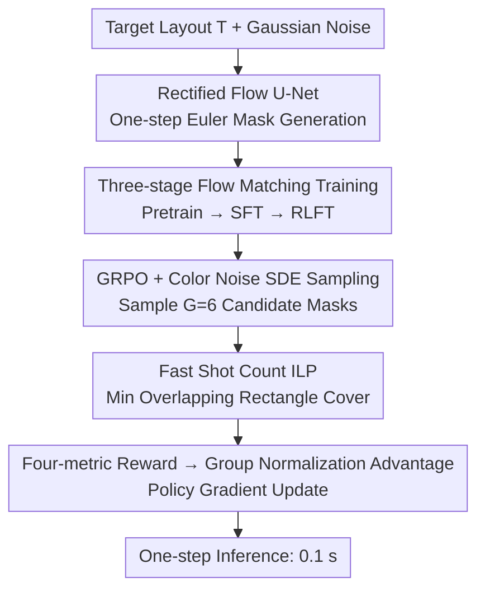

# LithoGRPO: Fast Inverse Lithography via GRPO Reinforced Flow Matching

**Conference**: ICML 2026  
**arXiv**: [2606.00228](https://arxiv.org/abs/2606.00228)  
**Code**: https://github.com/laiyao1/LithoGRPO  
**Area**: Scientific Computing / Semiconductor Manufacturing / Flow Matching / Reinforcement Learning  
**Keywords**: Inverse Lithography Technology (ILT), Rectified Flow, GRPO, Non-differentiable Metrics, Shot Count

## TL;DR
LithoGRPO models lithography mask generation as a rectified flow conditioned on target layouts and fine-tunes it using GRPO reinforcement learning. This allows a single forward pass to simultaneously optimize L2/PVB (differentiable) and EPE/Shot (non-differentiable) metrics. With a 130×–490× accelerated fast shot-count algorithm, it improves the comprehensive rank from 5.6 to 4.3 on LithoBench, with a per-sample inference time of only 0.1 s.

## Background & Motivation

**Background**: In semiconductor manufacturing, lithography projects circuit layouts onto wafers via masks. When feature sizes shrink below the exposure wavelength, diffraction causes the printed image to deviate significantly from the target. Traditional Optical Proximity Correction (OPC) performs local edge displacements, while Inverse Lithography Technology (ILT) treats the entire mask as a pixel-level inverse problem for optimization, representing the most powerful current paradigm. ILT methods generally fall into two categories: optimization-based (MOSAIC, LevelSet, etc., using iterative gradient descent) and learning-based (GAN-OPC, Neural-ILT, DAMO, ILILT, diffusion models, etc., using end-to-end image-to-image mapping).

**Limitations of Prior Work**: Optimization-based methods are slow and limited to differentiable objectives. Learning-based methods face two bottlenecks: first, supervision data originates from optimization results, capping performance at the quality of those solvers; second, training losses must remain differentiable. Consequently, **EPE (Edge Placement Error, discrete counting)** and **Shot Count (the number of rectangular shots after decomposition, directly related to manufacturing cost)**—two critical metrics for yield and cost—are entirely ignored during training and only calculated during final evaluation. Diffusion-based ILT (e.g., DiffOPC, AdaOPC) achieves high image quality but suffers from slow multi-step sampling.

**Key Challenge**: The ILT objective function is naturally a "differentiable + non-differentiable" hybrid. L2 and PVB are gradient-friendly, but EPE and Shot are not. Furthermore, these four metrics conflict (optimizing for L2 increases mask complexity, causing Shot count to spike). Pure generative models only learn the training data distribution without a channel for "metric feedback," while pure optimization is restricted to differentiable surfaces.

**Goal**: Optimize all four metrics simultaneously within a unified framework while maintaining single-step inference speed. Additionally, accelerate the Shot calculation itself to make it feasible for the training loop.

**Key Insight**: The authors analogize ILT to "image synthesis with physical rewards." Lithography metrics are explicit, deterministic scalar functions, making them naturally suitable as RL rewards. This aligns with the recent Flow-GRPO strategy that adapts Group Relative Policy Optimization to flow models.

**Core Idea**: Masks are modeled as a rectified flow— a linear ODE from noise to mask (one-step inference) conditioned on target layout $\mathbf{T}$. GRPO reinforcement learning is applied via randomized SDE sampling to generate multiple candidate masks for the same target. Group-based advantage calculations based on the four-metric reward enable gradient updates even for non-differentiable metrics. A **minimum overlapping rectangle cover ILP** replaces the NP-hard traditional shot-counting, making the RL training loop computationally viable.

## Method

### Overall Architecture
LithoGRPO converts the pixel-level inverse problem of generating the optimal mask given a target layout into a conditional rectified flow generation task. An 87M-parameter U-Net parameterizes a time-dependent velocity field $\mathbf{v}_\theta(\mathbf{x}_t, t; \mathbf{T})$, where noise $\mathbf{x}_t$ is concatenated with $\mathbf{T}$. During inference, Euler's method provides a one-step solution $\mathbf{x}_1 = \mathbf{x}_0 + \mathbf{v}_\theta(\mathbf{x}_0, 0; \mathbf{T})$, generating a $512 \times 512$ mask in 0.1 s. Since optimizing conflicting metrics is difficult, training is split into three stages: Pretrain (learning the conditional distribution), SFT (optimizing L2/PVB using differentiable metrics), and RLFT (using GRPO to allow non-differentiable EPE/Shot to influence parameters).

For physical modeling, mask $\mathbf{x}$ passes through a Hopkins diffraction model $\mathbf{I} = \sum_k \mu_k |h_k \otimes \mathbf{x}|^2$ to obtain the aerial image, followed by a sigmoid threshold $\mathbf{Z} = 1/(1+\exp[-\alpha(\mathbf{I}-I_\mathrm{th})])$ to get the photoresist image. The entire chain $g(\mathbf{x}) = f(h(\mathbf{x}))$ is differentiable with respect to $\mathbf{x}$, providing the gradient path for L2 and PVB.

### Key Designs

**1. Three-stage Pretrain → SFT → RLFT Training: Decoupling Generation and Conflicting Metrics**

Simultaneously optimizing conflicting metrics can stall gradients, especially with non-differentiable targets like Shot count. Training dynamics (Fig. 4) reveal a physical conflict: while L2/EPE decrease during Pretrain and SFT, Shot count increases—reflecting the trade-off where pursuing fidelity fragments the mask. Stage 1 (Pretrain) uses standard rectified flow loss $\mathcal{L}_\mathrm{flow} = \mathbb{E}[\|\mathbf{v}_\theta(\mathbf{x}_t, t) - (\mathbf{x}_1 - \mathbf{x}_0)\|^2]$. Stage 2 (SFT) projects the velocity to the endpoint $\mathbf{x}_1 = \mathbf{x}_t + (1-t)\mathbf{v}_\theta$ at any time $t$ to calculate differentiable metrics: $\mathcal{L}_\mathrm{sft} = \lambda_\mathrm{flow}\mathcal{L}_\mathrm{flow} + \lambda_{\mathrm{L2}}\mathrm{L2} + \lambda_\mathrm{PVB}\mathrm{PVB}$. Stage 3 (RLFT) specifically uses GRPO to refine Shot count, starting from the saturated differentiable metrics.

**2. GRPO + Color Noise SDE Sampling: Injecting "Manufacturable" Exploration**

Rectified flow is a deterministic ODE and cannot produce multiple trajectories for GRPO's group-based normalization. Furthermore, ILT requires "blocky" mask geometries rather than pixel-level jitter. The ODE is rewritten as an equivalent SDE and discretized via Euler–Maruyama: $\mathbf{x}_{t+\Delta t} = \mathbf{x}_t + [\mathbf{v}_\theta + \frac{\sigma_t^2}{2t}(\mathbf{x}_t + (1-t)\mathbf{v}_\theta)]\Delta t + \sigma_t\sqrt{\Delta t}\boldsymbol{\varepsilon}$ (where $\sigma_t = a\sqrt{(1-t)/t}$). To generate $G=6$ candidates while preserving marginal distributions, the noise $\boldsymbol{\varepsilon}$ uses **low-frequency color noise** (low-pass filtered white noise). Unlike white noise, which creates fragments, color noise preserves spatial correlation and mask topology.

**3. Fast Shot Count via Minimum Overlapping Rectangle Cover ILP**

Standard shot counting (minimum non-overlapping rectangle partition) is NP-hard and takes 30–150 s per mask. This is too slow for GRPO iterations. The authors approximate this as a "minimum set cover ILP": 1) histogram-based scanning to enumerate all maximal rectangles in $O(N^2)$; 2) pruning redundant candidates in $O(K^2)$; 3) solving a set cover ILP using row scanning in $O(NK^2)$. Although allowing overlaps differs from non-overlapping partitions, GRPO's group normalization (Eq. 12) cancels out constant offsets. **As long as the relative ranking within a group is preserved, the policy gradient remains effective.** This reduces the calculation from 60 s to 0.2 s per mask with an $R^2 = 0.994$ correlation.

### Loss & Training
Training consists of 50 epochs (Pretrain), 25 epochs (SFT), and 1000 RLFT steps. GRPO uses the standard clipped objective: $\mathcal{L}_\mathrm{grpo} = -\mathbb{E}_\mathbf{T}[\sum_i \min(r_i A_i, \mathrm{clip}(r_i, 1-\varepsilon, 1+\varepsilon) A_i)]$, where $r_i$ is the policy ratio. Log-probabilities at each step are approximated by $\mathcal{N}(\boldsymbol{\mu}_t, \sigma_t^2 \Delta t \mathbf{I})$. Training runs on 4 × RTX 3090 GPUs, taking < 8 hours per stage.

## Key Experimental Results

### Main Results
LithoGRPO is evaluated on 4 datasets (MetalSet, StdMetal, ViaSet, StdContact) across 4 metrics + inference time:

| Category | Method | MetalSet L2 | MetalSet Shot | ViaSet L2 | StdContact Shot | Time (s) | Avg. Rank |
| :--- | :--- | ---: | ---: | ---: | ---: | ---: | ---: |
| Opt. | MOSAIC | 35860 | 361 | – | – | 0.940 | 9.8 |
| Opt. | LevelSet | 34712 | 263 | 9632 | 275 | 2.290 | 6.9 |
| Opt. | MultiLevel | 27893 | 1250 | 4268 | 1473 | 1.030 | 5.6 |
| Learning | GAN-OPC | 43414 | 574 | 14767 | 276 | 0.010 | 7.4 |
| Learning | Neural-ILT | 36670 | 476 | 12723 | 265 | 0.025 | 6.5 |
| Learning | DAMO | 32579 | 523 | 5081 | 458 | 0.028 | 5.7 |
| Hybrid | ILILT | 30353 | 433 | 4666 | 510 | 0.441 | 5.9 |
| Ours | **LithoGRPO (RLFT)** | **28933** | 444 | **4276** | **889** | 0.104 | **4.3** |

LithoGRPO (RLFT) achieves a comprehensive rank of 4.3, significantly outperforming the best baseline MultiLevel (5.6).

### Ablation Study

| Configuration | MetalSet Shot ↓ | Key Observation |
| :--- | ---: | :--- |
| Pretrain only | 487 | Flow baseline |
| + SFT (Differentiable) | 803 | L2/PVB drops, but Shot count increases by 65% |
| + RLFT (4-metric GRPO) | **444** | Shot count reduced by 45% vs SFT without sacrificing L2 |
| RLFT + White Noise | ↑ | Mask fragmentation; Shot count worsens |
| RLFT + Color Noise ($a=0.1$) | **444** | Optimal exploration/manufacturability balance |

Fast Shot Count achieves 134×–491× acceleration compared to traditional implementations while maintaining high correlation.

### Key Findings
- **Three-stage splitting is essential**: SFT optimizes L2/EPE but worsens Shot count; RLFT then "repairs" the Shot count without regressing on other metrics.
- **Color noise is a critical engineering trick**: It reconciles the conflict between RL's need for noise and the physical requirement for continuous mask regions.
- **GRPO's group normalization tolerates constant reward offsets**: This mathematically justifies the use of fast shot approximations during RL training.
- **Improved OOD Generalization**: In the StdContact OOD test set, L2 error drops from 50,770 (LevelSet) to 19,102 (–62%), the largest improvement among all baselines.

## Highlights & Insights
- **"Metric-as-reward" paradigm shift**: ILT is more suitable for GRPO than text-to-image tasks because physical rewards are explicit and absolute, eliminating the need for a separate reward model.
- **First flow matching + RL workflow in the ILT domain**: Circumvents speed bottlenecks of multi-step diffusion while retaining the SDE exploration capability.
- **Algorithm-training co-design**: Fast shot count is not just an independent speedup; it is an approximator tailored for GRPO by preserving group rankings.

## Limitations & Future Work
- **Higher Training Cost**: The three-stage process takes ~24 GPU-hours, an order of magnitude higher than pure learning-based models.
- **Evaluation Scope**: High-volume industrial layouts and EUV processes remain untested.
- **Hyperparameter Sensitivity**: Parameters like $G$, $a$, and the ILP solver may require re-tuning for different process nodes.
- **Intrinsic Trade-offs**: The Pareto front between Shot count and L2/PVB is pushed further but still exists.

## Related Work & Insights
- **vs ILILT**: ILILT uses a differentiable pipeline to unroll optimization but remains limited by differentiable objectives; LithoGRPO is faster (0.1 s vs 0.44 s) and optimizes more metrics.
- **vs Diffusion-based ILT**: Diffusion's multi-step denoising makes GRPO training prohibitively expensive; rectified flow's linear path makes RL fine-tuning computationally feasible.
- **Insight**: Any scientific problem with physical simulations that are non-differentiable but produce explicit numerical metrics can adopt this recipe: three-stage training, color noise SDE-GRPO, and a rank-preserving fast reward approximator.

## Rating
- Novelty: ⭐⭐⭐⭐⭐ 
- Experimental Thoroughness: ⭐⭐⭐⭐ 
- Writing Quality: ⭐⭐⭐⭐ 
- Value: ⭐⭐⭐⭐⭐ 

<!-- RELATED:START -->

## Related Papers

- [\[ICML 2026\] Saving Foundation Flow-Matching Priors for Inverse Problems](saving_foundation_flow-matching_priors_for_inverse_problems.md)
- [\[CVPR 2026\] GRPO-Guard: Mitigating Implicit Over-Optimization in Flow Matching via Regulated Clipping](../../CVPR2026/image_generation/grpo-guard_mitigating_implicit_over-optimization_in_flow_matching_via_regulated_.md)
- [\[ICML 2026\] (HB-ARFM) History-Bootstrapped Flow Matching for Inverse Boiling Reconstruction](hb-arfm_history-bootstrapped_flow_matching_for_inverse_boiling_reconstruction.md)
- [\[CVPR 2026\] Stepwise-Flow-GRPO：给流匹配模型的去噪步逐步分配信用](../../CVPR2026/image_generation/stepwise_credit_assignment_for_grpo_on_flow-matching_models.md)
- [\[ICML 2026\] Exploring and Exploiting Stability in Latent Flow Matching](exploring_and_exploiting_stability_in_latent_flow_matching.md)

<!-- RELATED:END -->
