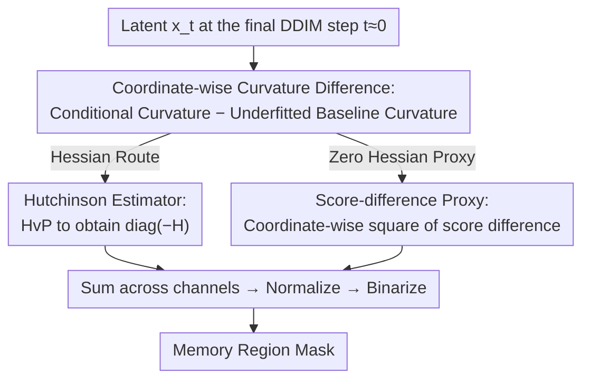

# Localizing Memorized Regions in Diffusion Models via Coordinate-Wise Curvature Differences

**Conference**: ICML 2026  
**arXiv**: [2605.26756](https://arxiv.org/abs/2605.26756)  
**Code**: https://github.com/Gwangho99/mem-curv-diff  
**Area**: AI Safety / Diffusion Model Memorization / Privacy & Copyright  
**Keywords**: Diffusion Model Memorization, Local Memory Localization, Curvature Difference, Score Difference, Fisher Information

## TL;DR
This paper characterizes "local memory in diffusion models" as **variance collapse (high curvature)** of log-density on specific coordinates. By computing the **coordinate-wise curvature difference** between a conditional model and an underfitted baseline (unconditional model or early checkpoint), the method subtracts "pseudo-memory" caused by the inherent low variance of the data manifold. This isolates **overfitting-driven memorized regions**, improving localization IoU on Stable Diffusion ground-truth masks from 0.75 (BE) to approximately 0.92.

## Background & Motivation

**Background**: Diffusion models (DDPM, Stable Diffusion, etc.) have been proven to "reproduce" training samples, leading to privacy and copyright concerns. Current detection and localization methods follow two main paths: (1) Global detection, such as the score-difference metric $\|s_\theta(x_t,c) - s_\theta(x_t)\|_2$ proposed by Wen et al., which assigns a scalar score based on the intuition that the conditional branch is abnormally dependent on text prompts; (2) Geometric perspectives, where Ross et al. use low LID (Local Intrinsic Dimensionality) to characterize memory, and Jeon et al. interpret score-difference as the sharpness gap between conditional and unconditional models.

**Limitations of Prior Work**: Existing methods either provide only global scalars or require specific internal model signals. Regarding spatial localization, Bright Ending (BE) by Chen et al. utilizes cross-attention in the final step to create spatial masks, but it is highly model-specific and frequently activates in non-memorized regions, leading to high false positives in complex foregrounds. Mechanistically, it remains unclear why the sharpness gap itself is the critical signal or why the unconditional model serves as an appropriate reference.

**Key Challenge**: Low LID or high sharpness only indicates that "some dimensions have collapsed" but not "which pixels have collapsed." Even if coordinate-wise curvature is obtained via the Hessian, high curvature may result from the inherent low-variance structure of the data itself (e.g., a pure black background specified by the prompt). Misidentifying such DD-Mem (data-driven) as memory constitutes a false positive.

**Goal**: (1) Provide a model-agnostic, geometrically interpretable **spatial localization** metric that accurately identifies which pixels are copied from the training set; (2) Explain the underlying mechanism of why the traditional score-difference trick is effective.

**Key Insight**: Local memory is redefined as **coordinate-wise variance collapse**. Based on Tweedie’s relation (Proposition 4.1), the conditional covariance of $x_0$ is proportional to $\sigma_t^4 \nabla^2_{x_t}\log p(x_t) + \sigma_t^2 I$. Therefore, "low variance at coordinate $i$" is equivalent to "large $-(\nabla^2_{x_t}\log p)_{ii}$," transforming the localization problem into measuring the **diagonal Hessian**.

**Core Idea**: Use the "conditional model coordinate curvature minus an underfitted baseline coordinate curvature" to subtract the inherent curvature of the data manifold, leaving only the overfitting-driven memory. It is further proven that the squared score-difference is a Fisher-information approximation of this curvature difference as $t \to 0$, providing a geometric explanation for the established metric.

## Method

### Overall Architecture

The goal is to solve the spatial localization problem of identifying copied pixels. This is achieved by translating "coordinate-wise variance collapse" into "high curvature of log-density" via Tweedie's relation (Proposition 4.1). Localization thus becomes the measurement of the diagonal Hessian. To distinguish between true memory (overfitting) and false memory (inherent low variance from prompts), the curvature of an "underfitted baseline" is subtracted from the conditional model's curvature. A score-difference proxy with zero Hessian requirements is also provided for efficiency. The process occurs on the latent of the final DDIM step ($t\approx 0$): after CFG sampling to obtain $x_t$, the curvature difference or its score proxy is calculated, summed across channels, normalized, and binarized to generate the memory mask.

### Key Designs

**1. Coordinate-Wise Curvature Difference: Subtracting Data Manifold Curvature via Underfitted Baseline**

Directly observing $\text{diag}(-H_\theta(x_t,c))$ leads to false positives. Figure 3 shows that solid areas like "a black background" or non-memorized samples also exhibit high curvature because these pixels are constrained by the prompt's semantics. The solution is to subtract a reference model curvature that is "fitted more loosely." Two baselines are proposed: the unconditional branch, $\Delta h_\emptyset^t := \text{diag}(-H_\theta(x_t,c)) - \text{diag}(-H_\theta(x_t))$ (Eq. 1); and an early checkpoint $\tilde\theta$, $\Delta h_{\tilde\theta}^t := \text{diag}(-H_\theta(x_t,c)) - \text{diag}(-H_{\tilde\theta}(x_t,c))$ (Eq. 2). The unconditional model is forced to fit the entire distribution loosely, preserving inherent data manifold curvature. The conditional model fits a single prompt, pushing the curvature of overfitted pixels higher. Subtracting the two cancels out inherent curvature, highlighting memorized regions.

**2. Hutchinson Estimator: Obtaining the Diagonal Without Full Hessian Construction**

The latent dimension of SD is $d\sim 10^5$, making explicit construction of the Hessian impossible. Since only the diagonal elements $\text{diag}(H)$ are needed, the Hutchinson estimator (Hutchinson 1989) is used: taking a random Rademacher vector $v$ and computing the Hessian–vector product $Hv=\nabla_x(s_\theta(x,c)^\top v)$ via automatic differentiation, we have $\mathbb{E}[v\odot(Hv)]=\text{diag}(H)$. This requires only a few backpropagations per estimate. By default, $K=16$ random samples are used, but the paper notes $K=1$ is already competitive.

**3. Score-Difference Proxy: Explaining the Wen Metric via Fisher Information Identity**

A zero-Hessian proxy is provided to explain why the global detection metric of Wen et al. (2024) is effective. The Fisher information identity $\mathcal{I}(x)=\mathbb{E}_{c\sim p(c|x)}[-\nabla_x^2\log p(c|x)]$ applied to the diagonal yields:

$$\mathbb{E}_c\big[\text{diag}(-\nabla_x^2\log p(x|c)+\nabla_x^2\log p(x))\big]=\mathbb{E}_c\big[(\nabla_x\log p(x|c)-\nabla_x\log p(x))^{\odot 2}\big],$$

meaning the "diagonal curvature difference" equals the "coordinate-wise square of the score difference" in expectation. Thus, $\Delta s_\emptyset^t := (s_\theta(x_t,c)-s_\theta(x_t))^{\odot 2}$ (Eq. 5) and $\Delta s_{\tilde\theta}^t := (s_\theta(x_t,c)-s_{\tilde\theta}(x_t,c))^{\odot 2}$ (Eq. 6) are defined as proxies for $\Delta h$. At $t \to 0$, $x_t$ almost uniquely determines $c$, making the single-sample approximation highly accurate. This explains that Wen's global metric is essentially the spatial sum of coordinate-wise curvature differences.

### Loss & Training

Ours does not involve new training; it performs inference and gradient calculation on existing SD checkpoints. Metrics are evaluated at $t\approx 0$, summed across channels, and binarized after dataset-level $[0,1]$ normalization.

## Key Experimental Results

### Main Results: Spatial Localization using Ground-Truth Template Masks

Models: Stable Diffusion v1.4 / v2.1; Baseline model $\tilde\theta$ uses SD v1.1 / v2.0; Ground-truth masks are from Webster (2023) template-verbatim data. Metrics: IoU / Pixel ACC.

| Method | SD v1.4 TV IoU | SD v1.4 All IoU | SD v2.1 TV IoU | SD v2.1 TV+Non IoU |
|------|----------------|------------------|----------------|---------------------|
| All-ones (baseline) | 0.560 | 0.522 | 0.649 | 0.325 |
| BE (Chen et al., 2025) | 0.751 | 0.564 | 0.933 | 0.956 |
| $\text{diag}(-H_\theta(x_t,c))$ (Raw Curv) | 0.586 | 0.522 | 0.649 | 0.500 |
| $\Delta h_\emptyset$ (Ours, Eq. 1) | **0.899** | **0.953** | 0.943 | 0.866 |
| $\Delta s_\emptyset$ (Proxy, Eq. 5) | 0.830 | 0.918 | 0.785 | 0.794 |
| $\Delta h_{\tilde\theta}$ (Ours, Eq. 2) | **0.921** | 0.867 | **0.947** | 0.828 |
| $\Delta s_{\tilde\theta}$ (Proxy, Eq. 6) | 0.863 | 0.654 | 0.920 | 0.844 |

The curvature-difference method improves IoU on SD v1.4 TV from 0.751 (BE) to approximately 0.92. On SD v1.4 "All" (global + non-memory), it reaches 0.953. In SD v2.1, BE performs similarly because ~85% of memory prompts are "Shaw Floors" (solid background), which aligns with BE's bias toward final-token cross-attention, though BE still fails on complex scenes.

**Global Detection Experiment (Aggregated Mean)**

All four differential metrics achieve AUC > 0.99 and TPR@1%FPR near 0.97–0.99, significantly outperforming BE-attention and raw curvature.

### Key Findings
- **Subtraction is the key, not sharpness itself**: Raw $-H_\theta(x_t,c)$ detection AUC is only 0.86/0.77. Subtracting the unconditional branch pushes it to 0.99+. This filters data inherent complexity.
- **Score-difference proxy is efficient for global detection**: Spatial averaging smooths out local noise in scores. For localization, the proxy is noisier; applying a $13\times13$ mean filter improves $\Delta s_{\tilde\theta}$ IoU on SD v1.4 "All" from 0.654 to 0.820.
- **Sharpening is continuous**: Using SD v2.0 (which already has memory) as a baseline for SD v2.1 still allows localization, showing that curvature continues to increase during fine-tuning.

## Highlights & Insights
- **Geometric grounding for score-difference**: The $\ell_2$ square difference is proved to be an unbiased proxy for the "diagonal curvature difference," explaining why the unconditional model is the necessary reference.
- **Refinement from global LID to coordinate-wise**: While LID distinguishes OD-Mem and DD-Mem globally, this method identifies memory at the pixel level, separating template verbatim from concept memory.
- **Dual-path Engineering**: Hessian-based calculation for precision localization and score-difference for zero-cost global detection.

## Limitations & Future Work
- Hessian computation is more expensive than BE, though $K=1$ Hutchinson is competitive.
- Currently designed for verbatim/local memory; sensitivity to concept-level memory (styles, etc.) is limited and marked for future work.
- Baseline selection dependency: requires earlier checkpoints or the unconditional branch.
- Evaluation is currently focused on the SD architecture and specific ground-truth benchmarks.

## Related Work & Insights
- **vs Bright Ending (Chen et al., 2025)**: BE is model-specific and biased; Ours is model-agnostic and more precise.
- **vs Wen et al., 2024 (score-difference)**: Wen treats it as conditional signal strength; Ours reinterprets it as a Fisher curvature proxy, enabling spatial localization.
- **vs Ross et al., 2025 (LID/MMH)**: MMH uses global LID; Ours extends this to coordinate-wise curvature to subtract DD-Mem.
- **vs Jeon et al., 2025 (sharpness)**: Jeon notes the sharpness gap; Ours explains why the gap specifically represents overfitted signals via underfitted baselines.

## Rating
- Novelty: ⭐⭐⭐⭐ Characterizes local memory as coordinate-wise variance collapse with clean theory.
- Experimental Thoroughness: ⭐⭐⭐⭐ Localization and detection across SD v1.4/v2.1 with four metrics.
- Writing Quality: ⭐⭐⭐⭐ Clear logical flow from propositions to toy examples.
- Value: ⭐⭐⭐⭐ Directly applicable for auditing diffusion model privacy with open-source code.

<!-- RELATED:START -->

## Related Papers

- [\[ICML 2026\] GUDA: Counterfactual Group-wise Training Data Attribution for Diffusion Models via Unlearning](guda_counterfactual_group-wise_training_data_attribution_for_diffusion_models_vi.md)
- [\[ICML 2026\] Stage-wise Distortion-Perception Traversal in Zero-shot Inverse Problems with Diffusion Models](stage-wise_distortion-perception_traversal_in_zero-shot_inverse_problems_with_di.md)
- [\[ICLR 2026\] Scale-wise Distillation of Diffusion Models](../../ICLR2026/image_generation/scale-wise_distillation_of_diffusion_models.md)
- [\[CVPR 2026\] Attention, May I Have Your Decision? Localizing Generative Choices in Diffusion Models](../../CVPR2026/image_generation/attention_may_i_have_your_decision_localizing_generative_choices_in_diffusion_mo.md)
- [\[ICML 2025\] Localizing and Mitigating Memorization in Image Autoregressive Models](../../ICML2025/image_generation/localizing_and_mitigating_memorization_in_image_autoregressive_models.md)

<!-- RELATED:END -->
