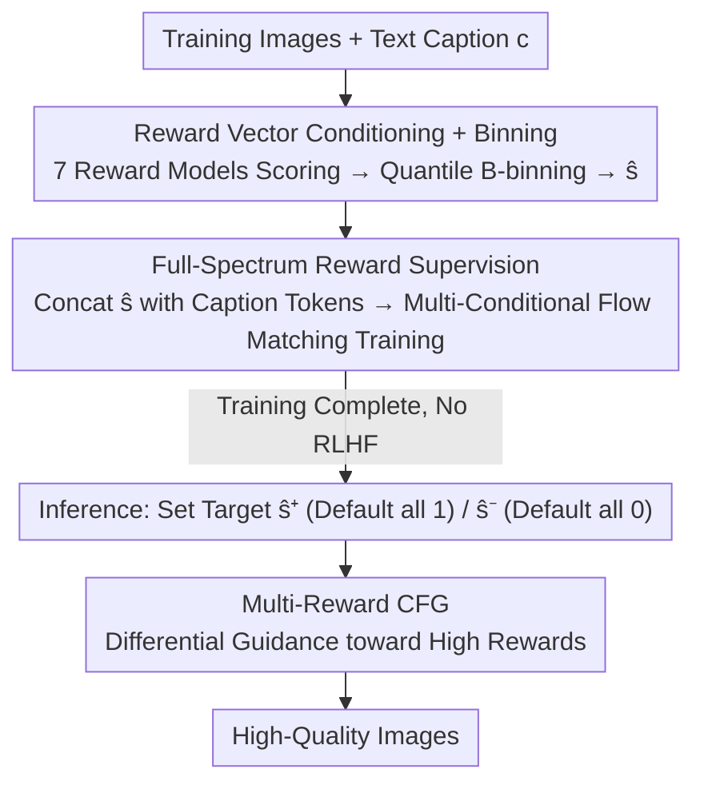

# MIRO: Multi-Reward Conditioned Pretraining for Simultaneously Improving T2I Quality and Efficiency

**Conference**: ICML 2026  
**arXiv**: [2510.25897](https://arxiv.org/abs/2510.25897)  
**Code**: Yes (Paper states "Code and weights available here")  
**Area**: Diffusion Models / Text-to-Image  
**Keywords**: Multi-reward conditioning, Flow Matching Pretraining, Classifier-Free Guidance, Reward-guided sampling, Inference-time scaling

## TL;DR
MIRO moves "alignment" from the RLHF post-training stage directly into pretraining: it assigns 7 reward scores (aesthetics, user preference, text-alignment, visual reasoning, scientific correctness, etc.) to each training image, enabling the Flow Matching model to learn $p(x|c, s)$. During inference, multi-reward CFG guides the generation toward high-reward regions. A 0.36B parameter model exceeds the 12B FLUX-dev on GenEval with 370× less training compute, and its single-sample inference quality surpasses the baseline performed 128 times.

## Background & Motivation

**Background**: Modern T2I systems follow a "Pretraining → SFT → RLHF" three-stage pipeline (e.g., Stable Diffusion 3 / FLUX). Pretraining learns the distribution of web images, SFT refines preferences on curated data, and RLHF pulls the distribution toward a single scalar reward (usually PickScore or HPSv2).

**Limitations of Prior Work**: Each stage incurs a cost—pretraining only optimizes likelihood without considering user preferences; SFT discards "low-quality" data, losing signals that help the model learn natural image structures; RLHF collapses the distribution onto a single scalar reward, causing mode collapse, damaging semantic fidelity, and fixing the trade-off between rewards during training, which users cannot adjust at inference time.

**Key Challenge**: These three stages represent a **sequential contraction**—the distribution generated by one stage is further narrowed by the next, ultimately locking the user into a single operating point chosen by the trainer. Furthermore, "single reward + data filtering" both wastes low-score data rich in structural signals and naturally induces reward hacking (e.g., aesthetics soar while text-alignment collapses).

**Goal**: Integrate multi-reward alignment **directly into pretraining** to achieve three things: (i) retain all training samples; (ii) allow users to freely navigate multiple reward dimensions at inference time; and (iii) use the reward signals as dense supervision to accelerate convergence.

**Key Insight**: Instead of pulling the distribution toward $\arg\max r$ in the post-training stage, it is better to treat the reward score $s$ as an **additional condition** for the generator—the model learns "what an image looks like given caption $c$ at reward level $s$." Thus, low-score images find a place as samples of $p(x|c, s_\text{low})$, while high-score images represent $p(x|c, s_\text{high})$, effectively modeling the entire reward spectrum.

**Core Idea**: Change the generative model from $p_\theta(x|c)$ to $p_\theta(x|c, s)$, where $s=[s_1,\dots,s_N]$ is a vector of binned discrete scores from N reward models. Use a simple multi-reward CFG to guide inference toward high scores, achieving "alignment during training" that RLHF cannot match.

## Method

### Overall Architecture
MIRO addresses the issues of late-stage alignment and fixed single-reward trade-offs. It modifies the generative model to $p_\theta(x|c, s)$: 7 existing reward models score each training image, which are then discretized into a reward vector $\hat{s}$. The Flow Matching model learns to generate images conditioned on these reward levels during pretraining. During inference, the reward vector is set to high values and used for guidance via an extended CFG. This replaces both SFT and RLHF, as the entire reward spectrum is modeled within a single conditional distribution. The backbone is a 0.36B parameter DiT variant of CAD (Coherence-Aware Diffusion), trained on 16M images (CC12M + LA6). The seven rewards cover five dimensions: AestheticScore (Aesthetics), PickScore / HPSv2 / ImageReward (User Preference), OpenAI CLIP / JINA CLIP / VQAScore (Text-Alignment), and SciScore (Scientific Correctness).

### Key Designs

**1. Reward Vector Conditioning + Binning: Converting diverse scales into digestible conditions**

The scales of the seven rewards vary significantly (Aesthetic: 0-10, CLIP: 0-1). Feeding raw scores directly as conditions would cause the model to be biased by high-density mid-range scores, failing to learn rare high-quality samples. MIRO uses **uniform binning** based on quantiles into B bins rather than equal-width binning. This effectively converts rewards into ranks, making them scale-invariant and ensuring the sparse high-score regions have sufficient samples for the model to learn the $s=B-1$ tail distribution. Conditions are injected by encoding $\hat{s}$ into tokens and concatenating them with caption tokens.

**2. Full-Spectrum Reward Supervision: Attributing convergence acceleration and anti-hacking to supervision density**

Baselines rely on sparse reconstruction loss to learn what makes a "good image." MIRO provides the model with dense labels across 7 dimensions at every training step. This increased supervision density is the root cause of its 19× faster convergence than the baseline: it is not about model size, but signal density. Theorem 2.2 uses entropy preservation to prove this doesn't lose distribution coverage: marginalizing $\sum_s p(s|c)\, p_\theta(x|c, s) = p_\text{data}(x|c)$, where $H(p_\text{marginal}) = H(p_\text{data})$. Retaining the full spectrum also prevents mode collapse; to fit low-score samples, the model must maintain the ability to generate "ugly" images, which prevents it from over-optimizing to a single high-score mode.

**3. Multi-Reward Classifier-Free Guidance: Moving fixed training weights to inference-time flexibility**

Unlike RLHF, which fixes trade-offs during training, MIRO extends single-reward CFG into vector space: it performs differential inference using positive and negative reward targets $\hat{s}^+$ (default all 1) and $\hat{s}^-$ (default all 0), where $\hat{v}_\theta(x_t, c) = (1+\omega)\, v_\theta(x_t, c, \hat{s}^+) - \omega\, v_\theta(x_t, c, \hat{s}^-)$. Theorem 2.1 proves this is equivalent to sampling from a reward-tilted distribution $p_\omega(x|c) \propto p(x|c, s^+)\big[\frac{p(s^+|x,c)}{p(s^-|x,c)}\big]^\omega$. Since each reward dimension can be set independently, users can adjust aesthetics to 0.625 while keeping others at 1, navigating the multi-reward Pareto front freely.

### Loss & Training
The objective is a multi-conditional Flow Matching loss $\mathcal{L} = \mathbb{E}\big[\|v_\theta(x_t, c, \hat{s}) - (\epsilon - x)\|_2^2\big]$, where $x_t = (1-t)x + t\epsilon$. CFG uses a standard approach of dropping conditions with a certain probability during training. This single-stage training achieves alignment without RL, bypassing instabilities like reward model gradient estimation or PPO ratio clipping.

## Key Experimental Results

### Main Results (GenEval + PartiPrompts, partial Table 1)

| Model | Params | Inference TFLOPs | GenEval | Aesthetic | ImageReward | HPSv2 | PickAScore |
|------|------|-------------|---------|-----------|-------------|-------|------------|
| SDXL | 2.6B | – | 55 | 5.94 | 0.46 | 0.25 | 0.220 |
| SD3-medium | 2.0B | – | 62 | 6.18 | 1.15 | 0.30 | 0.225 |
| Sana-1.6B | 1.6B | – | 66 | 6.36 | 1.23 | 0.30 | 0.228 |
| **FLUX-dev** | **12.0B** | **1540** | 67 | 6.56 | 1.19 | 0.30 | 0.229 |
| Baseline (real cap.) | 0.36B | 4.16 | 52 | 5.18 | 0.52 | 0.25 | 0.212 |
| MIRO (real cap.) | 0.36B | 4.16 | 57 | 6.28 | 1.06 | 0.29 | 0.220 |
| **MIRO (50% synth.)** | **0.36B** | **4.16** | **68** | 6.28 | 1.11 | 0.29 | 0.220 |
| MIRO† (synth. + $\hat{s}^+_\text{aes}=0.625$) | 0.36B | 4.16 | **75** | 5.24 | 1.18 | 0.29 | 0.220 |
| ImageReward-Scaled MIRO (128 samples) | 0.36B | 532 | 75 | 6.28 | **1.61** | 0.30 | 0.223 |

Key comparison: 0.36B MIRO with synthetic captions scores 68 on GenEval, surpassing the 12B FLUX-dev (67) with **370×** less training compute. Inference compute (532 vs 1540 TFLOPs for best-of-128) is still **3×** faster.

### Ablation Study (Figure 3 Training Curves)

| Configuration | Aesthetic | ImageReward | PickScore | HPSv2 |
|------|-----------|-------------|-----------|-------|
| Baseline Convergence Steps | ~500k | ~500k | ~500k | ~500k |
| MIRO Steps to Reach Baseline Final State | 26k | 135k | 143k | 79k |
| Acceleration | **19.1×** | **3.7×** | **3.5×** | **6.3×** |

Detailed Synthetic Captioning (Figure 5 + Table 1): The baseline improves GenEval from 52 to 57 with synthetic captions; MIRO improves it from 57 to 68. **Multi-reward conditioning and synthetic captions synergize** rather than being redundant. Maximum gains: Position 30→46 (+53%), Counting 44→61 (+39%).

### Key Findings
- **Reward supervision density translates directly to training speed**: Aesthetics accelerated by 19×, indicating that denser/easier signals yield higher speedups, though even PickScore improved by 3.5×.
- **Single-reward training = explicit reward hacking**: Training on Aesthetic alone drops GenEval to 33 (19 points below baseline), showing that multi-reward **mutual constraints** are necessary to prevent collapse.
- **Efficiency of best-of-N at test time is striking**: MIRO with 8 samples ≈ Baseline with 128 samples (16×) for ImageReward; 4 samples ≈ 128 samples (32×) for PickScore. On Aesthetic/HPSv2, MIRO **single-sample** results already exceed the baseline best-of-128 upper bound.
- **Flexible trade-offs via reward weights**: Reducing $\hat{s}^+_\text{aesthetic}$ to 0.625 boosted GenEval from 68 to 75, confirming MIRO models the trade-off surface rather than a single point.
- **Cross-metric generalization**: MIRO using HPSv2 for best-of-N selection outperformed models specifically trained for ImageReward, proving it learns a more universal concept of "quality."

## Highlights & Insights
- **Alignment as a condition, not a target**: Similar to how CFG functions relative to classifier guidance, MIRO bypasses reward gradients by encoding rewards into the distribution. This paradigm is transferable to video, 3D, or code generation.
- **Synergy of Theory and Engineering**: Theorems 2.1 and 2.2 provide the groundwork for multi-reward CFG and distribution preservation, explaining why the $\omega$ and $\hat{s}$ knobs are effective.
- **Supervision density over parameters**: 0.36B MIRO beating 12B FLUX suggests that finding more dense supervision is more cost-effective than simply scaling parameters.

## Limitations & Future Work
- **Dependency on Reward Models**: MIRO is capped by the coverage of its 7 models; it cannot learn dimensions (like copyright or niche culture) without an available reward model.
- **Reward Correlations**: Rewards like Aesthetic and PickScore are highly correlated; the effective degrees of freedom after binning may be lower than 7, and correlations are not explicitly modeled.
- **Data Scale**: 16M images is small compared to FLUX. Whether the 19× speedup holds at 100M+ scales without being overwhelmed by reward noise remains unverified.
- **Automation of Reward Weights**: Finding the optimal trade-off (like the "0.625" setting) currently requires manual search. A meta-learning layer for preference inference could be helpful.

## Related Work & Insights
- **vs RLHF / DPO**: These optimize $\mathbb{E}_x[r(x)]$ post-training; MIRO aligns during pretraining, avoiding PPO instabilities and mode collapse.
- **vs Coherence-Aware Diffusion (CAD)**: MIRO extends CAD from single-CLIP conditioning to multi-rewards and introduces multi-reward CFG, showing significant gains over the single-condition approach.
- **vs Parrot**: Parrot uses complex multi-objective PPO; MIRO achieves similar balancing using only conditioning and CFG, which is an order of magnitude simpler to implement.
- **vs Synthetic Captioning**: MIRO is orthogonal; while captions fix text noise, MIRO addresses supervision density on the reward side.

## Rating
- Novelty: ⭐⭐⭐⭐ (Reward as condition is a paradigm shift in the RLHF era, based on solid expansion of CAD).
- Experimental Thoroughness: ⭐⭐⭐⭐⭐ (Comprehensive baselines, synthetic caption ablation, best-of-N, and trade-off sweeps).
- Writing Quality: ⭐⭐⭐⭐ (Clear problem analysis and well-balanced theoretical/intuitive descriptions).
- Value: ⭐⭐⭐⭐⭐ (Potential to eliminate SFT/RLHF stages if 0.36B vs 12B results are replicable at scale).

<!-- RELATED:START -->

## Related Papers

- [\[ICML 2026\] HoloFair: Unified T2I Fairness Evaluation and Fair-GRPO Debiasing](holofair_unified_t2i_fairness_evaluation_and_fair-grpo_debiasing.md)
- [\[ICLR 2026\] Infinity and Beyond: Compositional Alignment in VAR and Diffusion T2I Models](../../ICLR2026/image_generation/infinity_and_beyond_compositional_alignment_in_var_and_diffusion_t2i_models.md)
- [\[CVPR 2026\] FailureAtlas: Mapping the Failure Landscape of T2I Models via Active Exploration](../../CVPR2026/image_generation/failureatlas_mapping_the_failure_landscape_of_t2i_models_via_active_exploration.md)
- [\[ICLR 2026\] The Intricate Dance of Prompt Complexity, Quality, Diversity, and Consistency in T2I Models](../../ICLR2026/image_generation/the_intricate_dance_of_prompt_complexity_quality_diversity_and_consistency_in_t2.md)
- [\[CVPR 2025\] Science-T2I: Addressing Scientific Illusions in Image Synthesis](../../CVPR2025/image_generation/science-t2i_addressing_scientific_illusions_in_image_synthesis.md)

<!-- RELATED:END -->
