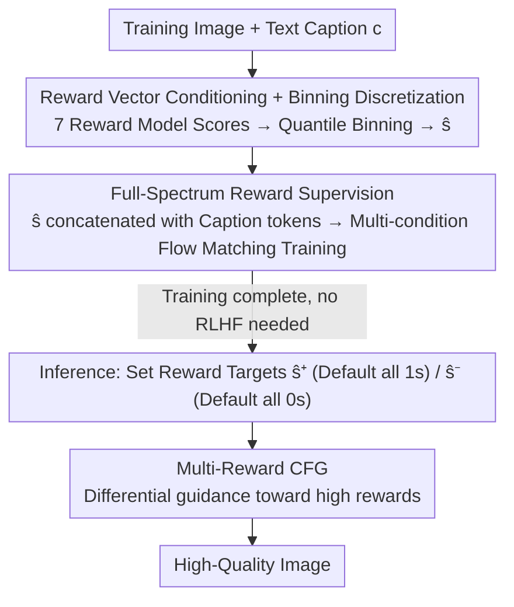

# MIRO: Multi-Reward Conditioned Pre-training Simultaneously Improves T2I Quality and Efficiency

**Conference**: ICML 2026  
**arXiv**: [2510.25897](https://arxiv.org/abs/2510.25897)  
**Code**: Yes (Paper states "Code and weights available here")  
**Area**: Diffusion Models / Text-to-Image  
**Keywords**: Multi-reward conditioning, Flow Matching Pre-training, Classifier-Free Guidance, Reward-guided sampling, Inference-time scaling

## TL;DR
MIRO incorporates "alignment" directly into the pre-training stage rather than as a post-training RLHF step. By assigning 7 reward scores (aesthetics, user preference, text-image alignment, visual reasoning, scientific correctness, etc.) to each training image, the Flow Matching model learns $p(x|c, s)$. During inference, multi-reward CFG is used to guide the generation toward high-reward regions. With only 0.36B parameters, MIRO outperforms the 12B FLUX-dev on GenEval using 370$\times$ less training compute, and its single-sample inference quality exceeds the baseline using 128-sample best-of-N.

## Background & Motivation

**Background**: Modern T2I systems follow a three-stage pipeline: "Pre-training $\rightarrow$ SFT $\rightarrow$ RLHF" (e.g., Stable Diffusion 3 / FLUX). Pre-training learns the distribution of web images, SFT refines the model on curated data, and RLHF pulls the distribution toward a specific scalar reward (typically PickScore or HPSv2).

**Limitations of Prior Work**: Each stage incurs costs—pre-training optimizes likelihood without considering user preference; SFT discards "low-quality" data, losing signals that help the model learn natural image structures; RLHF collapses the distribution toward a single scalar reward, leading to mode collapse, reduced semantic fidelity, and fixing reward trade-offs at training time, preventing user adjustment during inference.

**Key Challenge**: These three stages represent a **sequential contraction**—the distribution generated in one stage is further narrowed by the next, ultimately locking users into a single operating point chosen by the trainer. Furthermore, "single reward + data filtering" both wastes data rich in structural signals and naturally induces reward hacking (e.g., high aesthetic scores at the cost of poor text-image alignment).

**Goal**: Integrate multi-reward alignment **directly into pre-training** to achieve three objectives: (i) retain all training samples; (ii) allow users to freely adjust multiple reward dimensions during inference; (iii) use reward signals as dense supervision to accelerate convergence.

**Key Insight**: Instead of pulling the distribution toward $\arg\max r$ during post-training, reward scores $s$ are treated as **additional conditions** for the generator. The model learns "what an image looks like at reward level $s$ given caption $c$." Consequently, low-score images have a place (as samples of $p(x|c, s_\text{low})$), high-score images have a place, and the entire reward spectrum is modeled.

**Core Idea**: Transition the generative model from $p_\theta(x|c)$ to $p_\theta(x|c, s)$, where $s=[s_1,\dots,s_N]$ represents binned scores from N reward models. A simple multi-reward CFG guides inference toward high-reward regions, achieving "training as alignment" that even RLHF cannot match.

## Method

### Overall Architecture
MIRO addresses the issues of delayed alignment and fixed single-reward optimization. It transforms the generative model from $p_\theta(x|c)$ to $p_\theta(x|c, s)$. First, 7 off-the-shelf reward models score each training image, which are then discretized into reward vectors $\hat{s}$. The Flow Matching model learns to generate images conditioned on these reward levels during pre-training. During inference, the reward vector is set to high-score targets and guided via an extended version of CFG. This replaces both the SFT and RLHF stages, allowing the entire reward spectrum (low and high scores) to enter the same conditional distribution. The backbone is a 0.36B parameter DiT variant of CAD (Coherence-Aware Diffusion), trained on 16M images (CC12M + LA6). The seven rewards cover five dimensions: AestheticScore, PickScore / HPSv2 / ImageReward (User Preference), OpenAI CLIP / JINA CLIP / VQAScore (Text-Image Alignment), and SciScore (Scientific Correctness).

### Key Designs

**1. Reward Vector Conditioning + Binning: Converting diverse reward scales into digestible conditions**

The scales of the seven rewards vary significantly (Aesthetic is 0–10, CLIP is 0–1). Feeding raw scores directly as conditions would cause the model to be biased by the high density of average-quality scores, failing to learn truly high-quality tail samples. MIRO uses **uniform binning** based on quantiles rather than equal-width binning. This effectively converts reward scores into ranks, providing scale invariance and ensuring high-score sparse regions have sufficient samples for the model to learn the $s=B-1$ tail distribution. Conditions are injected by encoding $\hat{s}$ as tokens and concatenating them with caption tokens.

**2. Full-Spectrum Reward Supervision: Attributing convergence acceleration and anti-hacking to supervision density**

Baselines rely on diffusion reconstruction loss to discover "what makes a good image," which provides sparse signals. MIRO provides the model with dense labels across 7 dimensions at every training step. This increased supervision density is the root cause for its 19$\times$ faster convergence compared to the baseline; rather than model scaling, it is signal densification. Furthermore, Theorem 2.2 proves that this modification preserves the distribution through entropy preservation: marginalizing $\sum_s p(s|c)\, p_\theta(x|c, s) = p_\text{data}(x|c)$, where $H(p_\text{marginal}) = H(p_\text{data})$. Retaining the full spectrum acts as a fundamental mechanism against mode collapse and reward hacking; to fit low-bin samples, the model must retain "ugly image" generation capabilities, which prevents over-optimization toward a single high-score mode.

**3. Multi-Reward Classifier-Free Guidance: Moving fixed training weights to flexible inference-time sliders**

RLHF fixes the trade-offs between rewards during training. MIRO solves this by extending single-reward CFG into vector space. During inference, two reward targets, $\hat{s}^+$ (default all 1s) and $\hat{s}^-$ (default all 0s), are used for differential inference: $\hat{v}_\theta(x_t, c) = (1+\omega)\, v_\theta(x_t, c, \hat{s}^+) - \omega\, v_\theta(x_t, c, \hat{s}^-)$. Theorem 2.1 proves this is equivalent to sampling from a reward-tilted distribution $p_\omega(x|c) \propto p(x|c, s^+)\big[\frac{p(s^+|x,c)}{p(s^-|x,c)}\big]^\omega$, where the velocity difference approximates the log-odds gradient $\nabla_{x_t}\log\frac{p(s^+|x_t,c)}{p(s^-|x_t,c)}$. Since every dimension can be set independently, a user can adjust the aesthetic dimension to 0.625 while keeping others at 1, essentially picking any point on the multi-reward Pareto frontier.

### Loss & Training
The training objective is the multi-condition Flow Matching loss: $\mathcal{L} = \mathbb{E}\big[\|v_\theta(x_t, c, \hat{s}) - (\epsilon - x)\|_2^2\big]$, where $x_t = (1-t)x + t\epsilon$. CFG follows standard practice by dropping conditions with a certain probability during training. This single-stage training achieves alignment without RL post-training, bypassing instabilities like reward model gradient estimation or PPO ratio clipping.

## Key Experimental Results

### Main Results (GenEval + PartiPrompts, excerpt from Table 1)

| Model | Params | Inference TFLOPs | GenEval | Aesthetic | ImageReward | HPSv2 | PickAScore |
|------|------|-------------|---------|-----------|-------------|-------|------------|
| SDXL | 2.6B | – | 55 | 5.94 | 0.46 | 0.25 | 0.220 |
| SD3-medium | 2.0B | – | 62 | 6.18 | 1.15 | 0.30 | 0.225 |
| Sana-1.6B | 1.6B | – | 66 | 6.36 | 1.23 | 0.30 | 0.228 |
| **FLUX-dev** | **12.0B** | **1540** | 67 | 6.56 | 1.19 | 0.30 | 0.229 |
| Baseline (real cap.) | 0.36B | 4.16 | 52 | 5.18 | 0.52 | 0.25 | 0.212 |
| MIRO (real cap.) | 0.36B | 4.16 | 57 | 6.28 | 1.06 | 0.29 | 0.220 |
| **MIRO (50% synth.)** | **0.36B** | **4.16** | **68** | 6.28 | 1.11 | 0.29 | 0.220 |
| MIRO† (synth. + $\hat{s}^+_\text{aes}=0.625$) | 0.36B | 4.16 | **75** | 5.24 | 1.18 | 0.29 | 0.220 |
| ImageReward-Scaled MIRO (128 samples) | 0.36B | 532 | 75 | 6.28 | **1.61** | 0.30 | 0.223 |

Key comparison: 0.36B MIRO with synthetic captions achieves a GenEval of 68, surpassing 12B FLUX-dev's 67, with **370$\times$** less training compute. Inference compute (532 vs 1540 TFLOPs for best-of-N 128) is still **3$\times$** faster.

### Ablation Study (Figure 3 Training Curves)

| Configuration | Aesthetic | ImageReward | PickScore | HPSv2 |
|------|-----------|-------------|-----------|-------|
| Baseline convergence steps | ~500k | ~500k | ~500k | ~500k |
| MIRO steps to reach baseline final state | 26k | 135k | 143k | 79k |
| Acceleration | **19.1×** | **3.7×** | **3.5×** | **6.3×** |

Synthetic caption breakdown: Synthetic captions improved the Baseline GenEval from 52 to 57; for MIRO, they improved it from 57 to 68. **Multi-reward conditioning and synthetic captions work synergistically** rather than being redundant. Major gains: Position (+53%), Counting (+39%).

### Key Findings
- **Supervision density translates directly to training speed**: Aesthetic acceleration (19$\times$) is the highest, followed by HPSv2 (6.3$\times$). Dense labels consistently provide faster convergence.
- **Single-reward training = explicit reward hacking**: GenEval score for single-Aesthetic conditioning was only 33 (19 points lower than baseline). While aesthetics reached 6.65, semantic alignment collapsed. MIRO (aesthetic 6.28, GenEval 57) proves that multiple rewards **mutually constrain** each other to prevent collapse.
- **Best-of-N efficiency**: On ImageReward, MIRO with 8 samples $\approx$ baseline with 128 samples (16$\times$). On PickScore, MIRO with 4 samples $\approx$ baseline with 128 samples (**32$\times$**). On Aesthetic and HPSv2, MIRO **single-sample** results outperform the baseline's 128-sample upper bound.
- **Inference trade-offs**: Lowering $\hat{s}^+_\text{aesthetic}$ from 1 to 0.625 increased GenEval from 68 to 75. Setting it to 0 collapses aesthetics but maximizes semantics, proving MIRO models the trade-off surface.
- **Cross-metric generalization**: MIRO optimized via best-of-N using HPSv2 reached 1.35 on ImageReward, outperforming models specifically trained for ImageReward (1.04).

## Highlights & Insights
- **Alignment as a condition rather than a goal**: Similar to how CFG functions relative to classifier guidance, MIRO encodes rewards into the conditional distribution. This bypasses the instability of RLHF. This paradigm can be extended to video, 3D, or code generation where multiple reward models exist.
- **Theory-Engineering synergy**: Theorem 2.1 translates multi-reward CFG into reward-tilted sampling gradients, while Theorem 2.2 proves full-spectrum preservation. The theory directly predicts the effectiveness of using $\omega$ for alignment strength and $\hat{s}$ for direction.
- **Supervision density over parameter count**: MIRO 0.36B beats FLUX 12B not through architecture but by injecting reward signals into the training loop, eliminating the redundant phase where the model must "re-learn" what constitutes a good image from reconstruction alone.

## Limitations & Future Work
- **Dependency on existing reward models**: MIRO's performance is capped by the quality of the 7 reward models. If a dimension (e.g., copyright risk) lacks a reward model, MIRO cannot learn it.
- **Implicit reward correlations**: Rewards like Aesthetics and PickScore are highly correlated. The theory assumes conditional independence, which may not hold in practice, potentially reducing the effective degrees of freedom.
- **Data scale**: 16M images and 0.36B parameters are small relative to FLUX. Whether the acceleration gains persist at 100M+ scales is unverified.
- **Manual weight tuning**: The $\hat{s}^+_\text{aesthetic}=0.625$ setting was found manually. Finding optimal trade-offs among 7 sliders efficiently is an open problem.

## Related Work & Insights
- **vs RLHF / DPO**: These optimize $\mathbb{E}_x[r(x)]$ post-training via RL; MIRO performs alignment in a single stage during pre-training, avoiding mode collapse and PPO hyperparameter tuning.
- **vs Coherence-Aware Diffusion (CAD)**: CAD only conditions on a single CLIP score. MIRO extends this to 7 rewards and introduces multi-reward CFG, significantly outperforming CAD-like configurations on GenEval.
- **vs Parrot**: Parrot uses multi-objective RL (PPO); MIRO achieves similar multi-objective balance with a much simpler implementation.
- **vs Synthetic Captioning**: Synthetic captions address text-side noise, while MIRO addresses reward-side supervision density; they are orthogonal and additive.

## Rating
- Novelty: ⭐⭐⭐⭐ Treats rewards as conditions rather than targets, which is a significant paradigm shift, though CAD provided the foundation.
- Experimental Thoroughness: ⭐⭐⭐⭐⭐ Comprehensive baselines, curve analysis, best-of-N comparisons, and weight sweeps.
- Writing Quality: ⭐⭐⭐⭐ Clear analysis of current pain points; the theory and intuition are well-balanced.
- Value: ⭐⭐⭐⭐⭐ 0.36B hitting 12B performance with 370$\times$ less compute is highly impactful for industrial T2I pipelines.

<!-- RELATED:START -->

## Related Papers

- [\[ICML 2026\] HoloFair: Unified T2I Fairness Evaluation and Fair-GRPO Debiasing](holofair_unified_t2i_fairness_evaluation_and_fair-grpo_debiasing.md)
- [\[CVPR 2026\] Bias at the End of the Score: Demographic Biases in Reward Models for T2I](../../CVPR2026/image_generation/bias_reward_models_t2i.md)
- [\[ICLR 2026\] Infinity and Beyond: Compositional Alignment in VAR and Diffusion T2I Models](../../ICLR2026/image_generation/infinity_and_beyond_compositional_alignment_in_var_and_diffusion_t2i_models.md)
- [\[CVPR 2026\] FailureAtlas: Mapping the Failure Landscape of T2I Models via Active Exploration](../../CVPR2026/image_generation/failureatlas_mapping_the_failure_landscape_of_t2i_models_via_active_exploration.md)
- [\[ICLR 2026\] The Intricate Dance of Prompt Complexity, Quality, Diversity, and Consistency in T2I Models](../../ICLR2026/image_generation/the_intricate_dance_of_prompt_complexity_quality_diversity_and_consistency_in_t2.md)

<!-- RELATED:END -->
