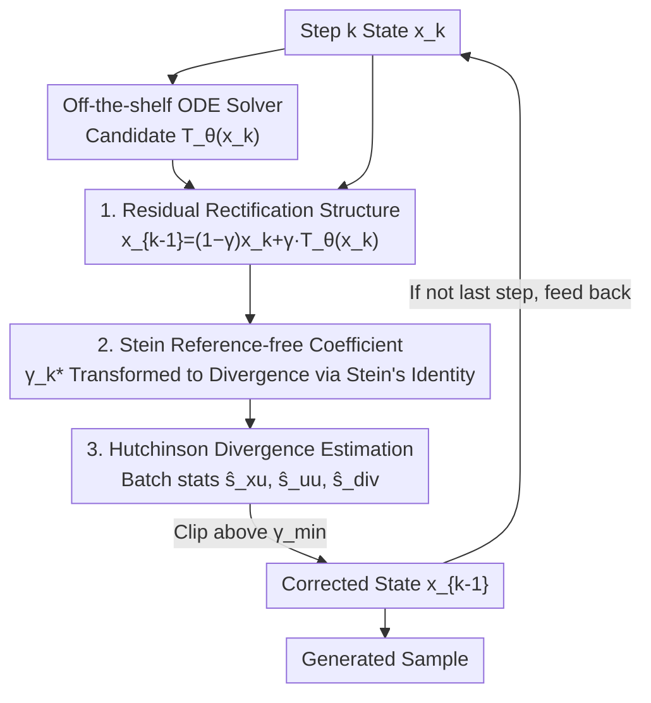

# Mitigating the Contractivity Trap in Diffusion ODEs via Stein Stabilization

**Conference**: ICML2026  
**arXiv**: [2606.07835](https://arxiv.org/abs/2606.07835)  
**Code**: To be confirmed  
**Area**: Image Generation  
**Keywords**: Diffusion Models, Probability Flow ODE, Few-step Sampling, Stein Correction, Contractivity Trap

## TL;DR
To address the issue in diffusion model Probability Flow ODE (PF-ODE) where "high-expressivity denoisers + aggressive step sizes destroy the contractivity stability certificate, leading to amplified errors and trajectory divergence" (named the **contractivity trap** by the authors), SteinDiff utilizes Stein's identity to transform the uncomputable "alignment with clean target" term into a computable divergence term. It derives a closed-form, reference-free, and training-free step-wise correction coefficient $\gamma_k$ for geometry-aware residual correction of solver candidates. SteinDiff significantly reduces the FID of large-step sampling on CIFAR-10 / ImageNet-64 / LSUN-Bedrooms (up to a 45.8% reduction).

## Background & Motivation
**Background**: Diffusion models generate high-quality samples through iterative denoising, but inference is expensive (often requiring hundreds of Function Evaluations, NFE). ODE-based samplers (DDIM, DPM-Solver++, UniPC, etc.) follow the deterministic PF-ODE to compress NFE to a few steps, which is the primary direction for acceleration.

**Limitations of Prior Work**: Aggressive few-step inference amplifies local prediction errors and discretization errors. From a stability perspective, the "contractivity" of the discrete update operator $\operatorname{T}_\theta$ is a sufficient certificate for gradual error suppression: perturbations are suppressed when $\|\operatorname{T}_\theta(\boldsymbol x)-\operatorname{T}_\theta(\boldsymbol y)\|\le L\|\boldsymbol x-\boldsymbol y\|$ and $L<1$. The problem is that in large-step intervals, high-expressivity denoisers (large Lipschitz constants) combined with large step sizes make this contractivity certificate impossible to satisfy.

**Key Challenge**: The authors name this failure of the certificate the **contractivity trap** and characterize it as a "stability triangle"—efficiency requires large step sizes $h_t$, model expressivity requires high sensitivity $L_{\boldsymbol{x}_\theta}$, and stable inference requires a balance between the two. These three goals pull in different directions. Once $\operatorname{T}_\theta$ is no longer strictly contractive, local errors may be amplified, causing trajectories to diverge and samples to collapse (producing severe structural artifacts).

**Goal**: To stabilize large-step updates during inference without retraining or restricting model architectures and step sizes, thereby suppressing error amplification.

**Key Insight**: Instead of forcibly constraining the Lipschitz constant of the denoiser (which limits model capacity), the authors propose a different perspective—directly apply a residual correction to the solver's candidate update to "align it with the clean target." This shifts the problem from "satisfying a contractivity certificate" to "step-wise minimization of the mean squared error (MSE) relative to the clean target." The challenge is that the clean target $\boldsymbol{x}^*$ is unknown during sampling; the authors use Stein's identity to convert terms involving $\boldsymbol{x}^*$ into estimators containing only computable quantities (batch statistics + divergence).

**Core Idea**: Create a convex combination of the solver candidate $\operatorname{T}_\theta(\boldsymbol{x}_k)$ and the current state $\boldsymbol{x}_k$ to obtain a corrected state. Use a closed-form, reference-free coefficient $\gamma_k$ derived from Stein's identity to determine the combination weights such that the expected MSE at each step does not increase.

## Method

### Overall Architecture
SteinDiff is a plug-and-play inference-time stabilization framework that wraps around any off-the-shelf ODE solver without increasing the NFE or requiring model retraining. Given the state $\boldsymbol{x}_k$ at step $k$ and the candidate update $\operatorname{T}_\theta(\boldsymbol{x}_k)$ provided by the solver, SteinDiff does not directly adopt the candidate. Instead, it formulates the update as a **rectified estimation with an adjustable coefficient**: $\boldsymbol{x}_{k-1}=(1-\gamma_k)\boldsymbol{x}_k+\gamma_k\operatorname{T}_\theta(\boldsymbol{x}_k)$. The coefficient $\gamma_k$ is not a heuristic threshold but an optimal solution that minimizes the "expected squared error of this step relative to the latent clean target $\boldsymbol{x}^*$." Since $\boldsymbol{x}^*$ is unavailable, the authors leverage forward Gaussian coupling and Stein's identity to transform the term containing $\boldsymbol{x}^*$ into a closed-form expression consisting of the inner product, energy, and divergence of the solver residual $\boldsymbol{u}_k=\boldsymbol{x}_k-\operatorname{T}_\theta(\boldsymbol{x}_k)$. Finally, they use Hutchinson trace estimation for the divergence, as detailed in Algorithm 1.

### Key Designs

**1. Residual Rectification Structure: Converting solver candidates into convex combinations "aligned with the clean target"**

The root of the contractivity trap lies in "expecting the operator itself to shrink." SteinDiff changes this mindset: it does not force $\operatorname{T}_\theta$ to be contractive but explicitly writes the update as:

$$\boldsymbol{x}_{k-1}=(1-\gamma_k)\boldsymbol{x}_k+\gamma_k\operatorname{T}_\theta(\boldsymbol{x}_k),$$

where $\gamma_k$ is an adaptive correction coefficient (a vanilla solver corresponds to $\gamma_k=1$, adopting the candidate as-is). Unlike heuristic truncation, the authors require $\gamma_k$ to minimize the step-wise expected squared error $J(\gamma_k)=\mathbb{E}[\|(1-\gamma_k)\boldsymbol{x}_k+\gamma_k\operatorname{T}_\theta(\boldsymbol{x}_k)-\boldsymbol{x}^*\|^2]$. Letting the residual be $\boldsymbol{u}_k=\boldsymbol{x}_k-\operatorname{T}_\theta(\boldsymbol{x}_k)$, the minimum of this quadratic objective is:

$$\gamma_k^*=\frac{\mathbb{E}\langle\boldsymbol{u}_k,\boldsymbol{x}_k-\boldsymbol{x}^*\rangle}{\mathbb{E}\|\boldsymbol{u}_k\|^2}.$$

Intuitively, the numerator measures the "component in the residual that matches the expected denoising direction," normalized by the residual energy in the denominator. This is a theoretically grounded step-wise correction rather than a hard truncation rule—and this analysis only requires the step-wise MSE not to increase, **without requiring** $\operatorname{T}_\theta$ to be pointwise contractive, thus bypassing the contractivity trap.

**2. Stein Reference-free Coefficient: Using Stein's identity to transform uncomputable clean target terms into computable divergence**

$\gamma_k^*$ contains the unknown $\boldsymbol{x}^*$, which is unavailable during sampling. Using the exact Gaussian coupling of the forward noise process $q(\boldsymbol{x}_k|\boldsymbol{x}^*)=\mathcal{N}(\boldsymbol{x}_k;\alpha_k\boldsymbol{x}^*,\sigma_k^2\mathbf{I})$ and **Stein's Identity** (for $\boldsymbol{x}\sim\mathcal{N}(\boldsymbol\mu,\sigma^2\mathbf{I})$, $\mathbb{E}[\langle\boldsymbol{v}(\boldsymbol{x}),\boldsymbol{x}-\boldsymbol\mu\rangle]=\sigma^2\mathbb{E}[\nabla\cdot\boldsymbol{v}(\boldsymbol{x})]$), the authors transform the inner product term $\mathbb{E}[\langle\boldsymbol{u}_k,\boldsymbol{x}^*\rangle]$ into a computable divergence term, obtaining a reference-free closed-form:

$$\gamma_k^*=\frac{\left(1-\frac{1}{\alpha_k}\right)\mathbb{E}\langle\boldsymbol{u}_k,\boldsymbol{x}_k\rangle+\frac{\sigma_k^2}{\alpha_k}\mathbb{E}[\nabla\cdot\boldsymbol{u}_k]}{\mathbb{E}\|\boldsymbol{u}_k\|^2}.$$

This formula requires no reference clean samples and no additional training; all correction information comes from the current solver residual. The divergence term $\nabla\cdot\boldsymbol{u}_k$ encodes the "local geometry of the residual vector field," which is the source of "geometry-aware" properties. Theoretically (Thm 4.8), exact SteinDiff updates satisfy $E_{k-1}^{\text{Stein}}=(1-\rho_k)E_k$ with $\rho_k\in[0,1]$, ensuring the entire trajectory error shrinks monotonically by $\prod_k(1-\rho_k)$.

**3. Hutchinson Divergence Estimation + EDM Perspective: Implementing the closed-form coefficient into a computable algorithm**

In practice, expectations are approximated using empirical means over a generation batch (size $B$): $\hat{s}_{xu}=\frac1B\sum\langle\boldsymbol{u}_k^{(i)},\boldsymbol{x}_k^{(i)}\rangle$, $\hat{s}_{uu}=\frac1B\sum\|\boldsymbol{u}_k^{(i)}\|^2$. The divergence term $\nabla\cdot\boldsymbol{u}_k$ is estimated via **Hutchinson trace estimation** $\hat{s}_{div}=\frac1B\sum\boldsymbol{v}^{(i)\top}\nabla_{\boldsymbol{x}}\boldsymbol{u}_k^{(i)}\boldsymbol{v}^{(i)}$ (where $\boldsymbol{v}\sim\mathcal{N}(0,\mathbf{I})$, requiring only one VJP). This is then clipped above $\gamma_{\min}$ to get $\hat\gamma_k$. The entire correction does not consume additional solver NFE; the only overhead is the parallelizable VJP divergence estimation. The authors also provide **robustness guarantees**: when the score deviation $\mathcal{S}(\tilde p_k,p_k)$ of the discrete sampler distribution relative to the ideal coupling is small, $|\tilde\gamma_k-\gamma_k^*|\le C_k\mathcal{S}(\tilde p_k,p_k)$, preserving the step-wise improvement of the correction. An interesting byproduct (4.5) is that for **EDM-style parameterization** ($\alpha_k\equiv1$), the drift term $(1-\frac1{\alpha_k})\mathbb{E}\langle\boldsymbol{u}_k,\boldsymbol{x}_k\rangle$ in the numerator disappears automatically, and the coefficient reduces to a purely geometric form $\frac{\sigma_k^2\mathbb{E}[\nabla\cdot\boldsymbol{u}_k]}{\mathbb{E}\|\boldsymbol{u}_k\|^2}$. This theoretically explains why EDM parameterization is empirically more stable in large-step sampling: it decouples global signal scaling from step-wise correction, making the correction dependent only on local residual geometry.

### Loss & Training
SteinDiff is a purely inference-time method and **does not involve any training or fine-tuning**. Correction coefficients are computed in closed-form based on the current solver residuals. The workflow for one step in Algorithm 1: ① Compute residual $\boldsymbol{u}_k=\boldsymbol{x}_{t_k}-\operatorname{T}_\theta(\boldsymbol{x}_{t_k})$; ② Calculate batch means $\hat{s}_{xu},\hat{s}_{uu}$; ③ Estimate divergence $\hat{s}_{div}$ using Hutchinson; ④ Compute $\hat\gamma_k=\max(\cdot,\gamma_{\min})$; ⑤ Output $\boldsymbol{x}_{t_{k-1}}=(1-\hat\gamma_k)\boldsymbol{x}_{t_k}+\hat\gamma_k\operatorname{T}_\theta(\boldsymbol{x}_{t_k})$. An optional self-consistency (SC) variant uses look-ahead trajectory information to further reduce discretization errors.

## Key Experimental Results

### Main Results
Evaluation metrics include FID↓ and IS↑, along with FD-DINOv2 (replacing the InceptionV3 encoder in FID with DINOv2 for better alignment with human perception). Efficiency is measured by Steps / NFE. Tests were conducted on CIFAR-10, ImageNet-64×64, and LSUN-Bedrooms-256 across multiple solvers (DPM-Solver++, UniPC, Heun) and two noise schedules (EDM and logSNR).

LSUN-Bedrooms-256 (Latent Diffusion, FID↓, various NFE):

| Method | 5 NFE | 6 NFE | 8 NFE | 10 NFE | 20 NFE |
|------|-------|-------|-------|--------|--------|
| DPM-Solver++ (2m) | 21.29 | 10.97 | 5.13 | 3.88 | 3.25 |
| DPM-Solver++ (3m) | 18.61 | 8.52 | 4.15 | 3.61 | 3.17 |
| **Ours (SteinDiff SC)** | **7.64** | **4.71** | **3.72** | **3.38** | **2.77** |

At the most aggressive 5 NFE, FID drops significantly from a baseline of 18.61 to 7.64. As NFE increases, the gap narrows, but SteinDiff maintains a lead throughout, confirming Corollary 4.9: "as the vanilla candidate becomes more accurate, SteinDiff asymptotically converges to it."

### Ablation Study
| Setting | Phenomenon | Explanation |
|------|------|------|
| ImageNet-64, across solvers/schedules | Max FID reduction of **45.8%** | Improvement is consistent across DPM-Solver++/UniPC/Heun + EDM/logSNR; not tied to a specific solver/schedule. |
| CIFAR-10, 5 NFE | Elimination of severe artifacts (Fig 5/7) | Both FID and IS outperformed baseline in large steps; more robust to step size changes. |
| EDM Parameterization ($\alpha_k\equiv1$) | Drift term disappears; coefficient becomes purely geometric | Theoretical explanation for EDM's empirical stability in large-step sampling. |

### Key Findings
- **Greater gains with more aggressive step sizes**: The FID improvement is most significant under extreme few-step budgets like 5 NFE (18.61→7.64 on LSUN), which is exactly the range where the contractivity trap is most severe and errors are most amplified.
- **Discretization refinement cannot cure the root cause**: Fig 4 shows that even with NFE=100, local Lipschitz estimates significantly exceed the strict contractivity threshold (peaking at ~24 for NFE=6), proving that merely reducing step size does not eliminate local expansion. Explicit geometric correction is needed.
- **Stabilization without increasing NFE**: Correction does not run extra solver steps. The only overhead is parallelizable VJP divergence estimation, which is almost zero cost in engineering terms when added to existing samplers.

## Highlights & Insights
- **Diagnosing "sampling instability" as a failure of the contractivity certificate**: By deriving $L_{\operatorname{T}}\le\frac{\sigma_t}{\sigma_s}+\sigma_t h_t L_{\boldsymbol{x}_\theta}$, the authors show that "large step size × high expressivity × strict contractivity" is an impossible trinity. This provides a diagnostic criterion for the phenomenon of "sample collapse in few-step sampling."
- **Ingenious use of Stein's Identity**: It losslessly transforms the "alignment term" with the unknown clean target into a computable quantity involving only divergence. This provides a closed-form, reference-free, zero-training optimal coefficient—an elegant technique transferable to other "unknown target but forward Gaussian coupling" correction problems.
- **Theory guiding empirical findings**: The discovery that the drift term disappears under EDM parameterization provides a clean theoretical explanation for why EDM is more stable, offering guidance for the co-design of future diffusion architectures and efficient sampling.
- **Plug-and-Play**: It can be wrapped around any ODE solver without changing the model, the step size, or the NFE, resulting in a very low barrier to adoption.

## Limitations & Future Work
- Performance upper bounds are still limited by the pretrained model's capacity; SteinDiff only stabilizes sampling and cannot exceed the model's inherent generation capabilities.
- Hutchinson divergence estimation introduces Monte Carlo variance, which might slightly perturb the correction coefficient $\gamma_k$ in small-batch or high-dimensional settings (acknowledged by authors).
- The contractivity trap might be more severe in higher-dimensional continuous spaces where local geometric deviations accumulate faster; validation was primarily on images.
- Future Work: Extending this training-free stabilization to large-scale video generation to see if Stein-guided correction can suppress high-frequency geometric drift in few-step inference.

## Related Work & Insights
- **vs. Training-based Acceleration (Distillation / Consistency Models / EDM)**: Those methods perform well but require expensive post-training and may sacrifice the refinement flexibility of diffusion models. SteinDiff works at inference time, requires zero training, and retains flexibility.
- **vs. ODE Solvers (DPM-Solver++, UniPC, DEIS)**: Those focus on numerical integration formats (exponential integrators, predictor-corrector, stiffness handling). SteinDiff is a stabilization layer *on top of* these solvers; they are complementary, as shown in the experiments.
- **vs. Reference-dependent methods (e.g., DPM-Solver-v3, restart sampling)**: SteinDiff's core selling point is being **reference-free**—it requires no reference solutions, auxiliary optimization, or extra training. Correction is computed entirely from current residuals.

## Rating
- Novelty: ⭐⭐⭐⭐⭐ Diagnosis of the contractivity trap + use of Stein's Identity for reference-free coefficients is novel in both theory and method.
- Experimental Thoroughness: ⭐⭐⭐⭐ Consistent improvements across datasets/solvers/schedules; significant gains in few-step settings. Comparison with some recent training-based few-step methods is missing.
- Writing Quality: ⭐⭐⭐⭐⭐ Clear theoretical chain from the stability triangle to Stein derivation and EDM explanation.
- Value: ⭐⭐⭐⭐⭐ Zero training, no NFE increase, and plug-and-play capability make it highly valuable for engineering applications in large-step sampling.

<!-- RELATED:START -->

## Related Papers

- [\[NeurIPS 2025\] Learning to Integrate Diffusion ODEs by Averaging the Derivatives](../../NeurIPS2025/image_generation/learning_to_integrate_diffusion_odes_by_averaging_the_derivatives.md)
- [\[CVPR 2026\] Designing Instance-Level Sampling Schedules via REINFORCE with James-Stein Shrinkage](../../CVPR2026/image_generation/designing_instance-level_sampling_schedules_via_reinforce_with_james-stein_shrin.md)
- [\[ICLR 2026\] Detecting and Mitigating Memorization in Diffusion Models through Anisotropy of the Log-Probability](../../ICLR2026/image_generation/detecting_and_mitigating_memorization_in_diffusion_models_through_anisotropy_of_.md)
- [\[CVPR 2025\] Dissecting and Mitigating Diffusion Bias via Mechanistic Interpretability](../../CVPR2025/image_generation/dissecting_and_mitigating_diffusion_bias_via_mechanistic_interpretability.md)
- [\[CVPR 2026\] GRPO-Guard: Mitigating Implicit Over-Optimization in Flow Matching via Regulated Clipping](../../CVPR2026/image_generation/grpo-guard_mitigating_implicit_over-optimization_in_flow_matching_via_regulated_.md)

<!-- RELATED:END -->
