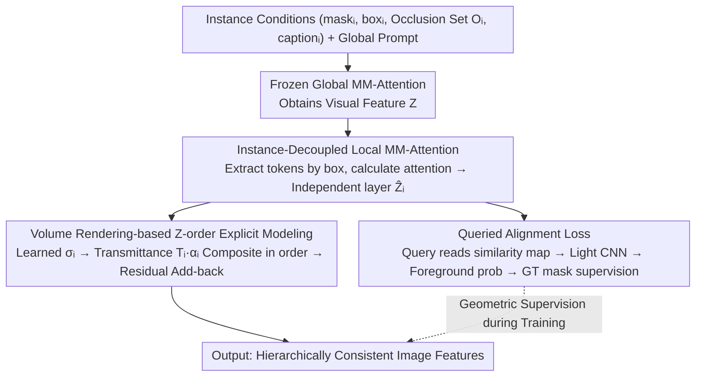

# OcclusionFormer: Arranging Z-Order for Layout-Grounded Image Generation

**Conference**: ICML2026  
**arXiv**: [2605.21343](https://arxiv.org/abs/2605.21343)  
**Code**: https://henghuiding.com/OcclusionFormer/ (Project Page)  
**Area**: Image Generation / Layout-to-Image / Diffusion Models  
**Keywords**: Layout-to-image, Z-order occlusion, Volume rendering, Instance decoupling, DiT

## TL;DR
To address the issues of texture entanglement and hierarchical confusion in overlapping regions during layout-to-image generation, the authors constructed a large-scale dataset SA-Z with explicit Z-order and amodal annotations. They proposed OcclusionFormer, which explicitly models occlusion priority through instance decoupling and volume rendering, and reinforces spatial consistency using a queried alignment loss. OcclusionFormer comprehensively outperforms strong baselines such as Eligen, Creatilayout, and InstanceAssemble on occlusion-aware metrics in the OverLayBench complex subset and the self-built SA-Z Eval.

## Background & Motivation

**Background**: Layout-to-image generation injects 2D/3D bounding boxes as spatial conditions into diffusion models. Driven by works like GLIGEN, Eligen, and Creatilayout, spatial controllability for single instances has performed well, serving as infrastructure for tasks like complex scene synthesis and visual storytelling.

**Limitations of Prior Work**: Once multiple bounding boxes overlap, mainstream methods often fail—objects in the overlapping areas exhibit texture entanglement, reversed hierarchy, or are forcibly shrunk to cover only visible parts. This occurs because these methods treat layouts as 2D planar conditions and lack any concept of "which object occludes which." While users draw amodal (full range) boxes assuming a depth order, the models cannot interpret this.

**Key Challenge**: While computer graphics has long used Z-buffers to solve occlusion, the attention mechanism of diffusion models naturally "mixes" features indiscriminately on a 2D plane, lacking an explicit Z-axis dimension. LaRender attempted a training-free volume rendering approach, but it diverted cross-attention space for occlusion control, losing the global prompt and becoming sensitive to hyperparameters and prone to errors in complex scenes.

**Goal**: (1) Provide an open-vocabulary, large-scale training set with Z-order and amodal annotations; (2) Design a trainable scheme that explicitly models Z-order within the DiT framework, maintaining pre-trained capabilities while providing physically consistent hierarchies in overlapping regions.

**Key Insight**: The authors argue that training-free heuristics are insufficient and require "data-driven + explicit supervision." Specifically, each instance is first "decoupled" into an independent layer, then "composed" according to the user-specified occlusion order using volume rendering, with spatial geometry constraints provided by mask supervision.

**Core Idea**: Image generation is viewed as a volume rendering process along orthogonal camera rays—each instance independently performs MM-Attention within its box to obtain a "layer." The learned density $\sigma_i$ is used to calculate transmittance $T_i$ and opacity $\alpha_i$ for Z-order weighted composition. Simultaneously, a queried alignment loss is introduced to "weld" the feature geometry of each instance to the GT mask.

## Method

OcclusionFormer addresses the indiscriminate 2D mixing of features in diffusion attention by reimagining image generation as volume rendering along orthogonal camera rays. It decouples each instance into independent feature layers and recomposes them based on user-provided occlusion orders using NeRF-style transmittance formulas. This module is connected after each MM-Attention block of Flux.1-dev (DiT + Rectified Flow) and fine-tuned using only LoRA (rank=4) to preserve the pre-trained backbone.

### Overall Architecture
The input is a set of instance conditions $(M_i, B_i, \mathcal{O}_i, C_i, P)$ (mask, bounding box, occlusion set, instance caption, global prompt). Each DiT block first runs a frozen global MM-Attention to obtain visual features $\mathbf{Z}\in\mathbb{R}^{L\times D}$, followed by three steps: extracting local tokens per instance box to calculate independent layer attention $\hat{\mathbf{Z}}_i$; performing Z-order explicit modeling via volume rendering based on $\mathcal{O}_i$ to composite $\mathbf{Z}_{out}$, which is added back residually; and using a learnable query to predict foreground probability from each layer via a lightweight CNN, supervised by the GT mask. The training objective is $\mathcal{L}_{total} = \mathcal{L}_{flow} + \lambda \mathcal{L}_{align}$, where $\lambda=0.5$.

### Key Designs

**1. Instance-Decoupling Local MM-Attention: Splitting Global Attention into Separable Layers**

To model Z-order explicitly, one first needs clean, non-interfering "layers." Eligen/Creatilayout treat layout as a global condition where all instance and background tokens interact indiscriminately. Thus, for each instance $i$, token indices $\Omega_i = \{u \mid \text{Coord}(u) \in B_i\}$ within its bounding box are selected. The original MM-Attention module is reused to update $\hat{\mathbf{Z}}_{\Omega_i}, \hat{\mathbf{C}_i} = \text{MM-Attention}(\mathbf{Z}_{\Omega_i}, \mathbf{C}_i')$ only within this local subset and the instance caption embedding $\mathbf{C}_i'$. Parameters are frozen except for LoRA on projection matrices, ensuring clean features for composition while maintaining Flux's generative power.

**2. Volume Rendering-based Z-order Explicit Modeling: Compositing Layers via Transmittance**

Borrowing from NeRF, the image plane is treated as an orthogonal camera imaging plane, where each instance corresponds to a segment of "medium" along the ray. Crucially, the density $\sigma_i \in \mathbb{R}^D$ is not fixed but predicted by a time-text embedding module from the diffusion timestep $t$ and instance text pooling vector $y_i$: $\mathbf{e}_{temb}^i = \text{TimeTextEmbed}(t, y_i) \to \sigma_i$. This allows "solidity" to vary between early low-frequency and late detail stages. At pixel $\mathbf{p}$, opacity is $\alpha_i(\mathbf{p}) = (1 - \exp(-\sigma_i)) \cdot \mathbb{I}(\mathbf{p} \in B_i)$, transmittance is $T_i(\mathbf{p}) = \exp(-\sum_{j \in \mathcal{O}_i} \sigma_j \cdot \mathbb{I}(\mathbf{p} \in B_j))$, and the composition weight is $w_i = T_i \cdot \alpha_i$. For pixels with "occlusion declarations," $\mathbf{Z}_{out}(\mathbf{p}) = \sum_i w_i \hat{\mathbf{Z}}_i / (\sum_i w_i + \epsilon)$. A hybrid strategy reverts to simple averaging for boundary pixels where boxes intersect without actual occlusion.

**3. Queried Alignment Loss: Welding Features to GT Mask Geometry**

While volume rendering handles composition order, it doesn't guarantee coherent shapes within each layer. To prevent features from drifting within boxes and causing contour breakage, a learnable query $\mathbf{q}_i \in \mathbb{R}^D$ is derived from $\mathbf{e}_{temb}^i$. Pixel-wise cosine similarity $\mathbf{S}_i(\mathbf{p}) = \hat{\mathbf{Z}}_i(\mathbf{p}) \cdot \mathbf{q}_i / ((\|\hat{\mathbf{Z}}_i(\mathbf{p})\| + \epsilon)\|\mathbf{q}_i\|)$ is fed into a lightweight CNN $\mathcal{F}_\theta$ to output foreground probability map $\hat{\mathbf{M}}_i$, supervised by the GT mask $M_i$ via cross-entropy $\mathcal{L}_{align}$. This "query + independent head" approach is more decoupled than direct mask loss on attention maps, which conflicts with global semantics.

### Loss & Training
The total objective is $\mathcal{L}_{total} = \mathcal{L}_{flow} + \lambda \mathcal{L}_{align}$, with $\lambda=0.5$. $\mathcal{L}_{flow}$ is Flux's rectified flow matching: $\mathcal{L}_{flow} = \mathbb{E}_{t,\mathbf{z}_t,\mathbf{c}}[\|v_\theta(\mathbf{z}_t,t,\mathbf{c}) - \mathbf{v}_{target}\|_2^2]$, where $\mathbf{v}_{target} = \mathbf{x}_1 - \mathbf{x}_0$. Backbone: Flux.1-dev, LoRA rank=4, 200K steps, batch 16, lr=1e-4. The SA-Z dataset is derived from SACap-1M using DescribeAnything for captions, InstaOrder for occlusion priority, and SAM-3D for reconstructed amodal masks and boxes, totaling 1M high-res images and 5.69M instances.

## Key Experimental Results

### Main Results
Evaluated on OverLayBench (Simple/Regular/Complex) + self-built SA-Z Eval (1K real images). Metrics include spatial accuracy (mIoU / O-mIoU), semantic consistency (SR$_E$ / SR$_R$ / CLIP-G/L), image quality (FID), and occlusion metrics Occ. (F1) and Dep. (WHDR).

| Subset | Metric | OcclusionFormer | Prev. SOTA (InstanceAssemble) | Creatilayout | Eligen | LaRender |
|------|------|------|------|------|------|------|
| OverLay-Simple | mIoU ↑ | **0.7405** | 0.7279 | 0.6998 | 0.6673 | 0.6604 |
| OverLay-Simple | O-mIoU ↑ | **0.5456** | 0.5152 | 0.4725 | 0.4151 | 0.4136 |
| OverLay-Simple | Occ. ↑ | **0.8051** | 0.7852 | 0.7559 | 0.6823 | 0.6294 |
| OverLay-Regular | mIoU ↑ | **0.6487** | 0.6299 | 0.5997 | 0.5680 | 0.5721 |
| OverLay-Regular | O-mIoU ↑ | **0.4161** | 0.3861 | 0.3517 | 0.3075 | 0.3006 |
| OverLay-Complex | mIoU ↑ | **0.6037** | 0.5706 | 0.5584 | 0.5195 | 0.5227 |
| OverLay-Complex | O-mIoU ↑ | **0.3468** | 0.3189 | 0.3006 | 0.2569 | 0.2507 |
| OverLay-Complex | Occ. ↑ | **0.7797** | 0.6987 | 0.7142 | 0.5994 | 0.6026 |
| OverLay-Complex | Dep. ↓ | **0.1602** | 0.1791 | 0.1907 | 0.2378 | 0.2374 |
| SA-Z Eval | mIoU ↑ | **0.4509** | 0.4292 | 0.4216 | 0.3007 | 0.4053 |
| SA-Z Eval | O-mIoU ↑ | **0.2231** | 0.2021 | 0.1904 | 0.1016 | 0.1709 |
| SA-Z Eval | Occ. ↑ | **0.7568** | 0.6947 | 0.6921 | 0.6095 | 0.6833 |
| SA-Z Eval | FID ↓ | **62.79** | 63.65 | 64.66 | 69.91 | 77.98 |

**Highlights**: The performance gap increases with scene complexity; O-mIoU and Occ. (measuring overlapping areas) show the most significant gains (Complex Occ. +0.08, Dep. -0.019).

### Ablation Study (OverLay-Complex)

| Configuration | mIoU ↑ | O-mIoU ↑ | Occ. ↑ | Dep. ↓ | Description |
|------|------|------|------|------|------|
| OcclusionFormer (full) | **0.6037** | **0.3468** | **0.7797** | **0.1602** | Full Model |
| w/o Learned Sigma | 0.5911 | 0.3276 | 0.7530 | 0.1694 | Static density; Occ F1 drops ~2.7 pts |
| w/o Queried Loss | 0.5922 | 0.3319 | 0.7659 | 0.1666 | No alignment loss; O-mIoU drops ~1.5 pts |
| w Attn. Map Loss | 0.5753 | 0.3207 | 0.7510 | 0.1695 | Direct attention map mask loss is worse than w/o |
| w/o Amodal Data | 0.6004 | 0.3411 | 0.7703 | 0.1644 | Using visible mask only; slight decrease |

### Key Findings
- **Dynamic density is the most impactful design**: Removing learned $\sigma$ leads to a drop of 0.027 in Occ., proving that "adaptive density" is more stable than fixed heuristics used in LaRender.
- **Queried alignment loss outperforms attention-map loss**: Direct mask supervision on attention maps conflicts with global semantics. The "query + CNN head" provides a better-decoupled supervision path.
- **Amodal annotations are consistently beneficial**: Compared to visible-only masks, amodal data provides supervision for occluded parts, aiding geometric integrity in complex scenarios.
- **Real-domain gap exists**: mIoU/O-mIoU are significantly lower on SA-Z Eval than OverLayBench, but OcclusionFormer's relative advantage remains, showing the improvement is not dependent on synthetic distributions.

## Highlights & Insights
- **Adapting Z-buffer concepts into differentiable DiT**: Using NeRF volume rendering for layer composition allows explicit Z-order to be integrated into diffusion models in a trainable, end-to-end manner.
- **Reusable three-stage pipeline**: The "Instance Decoupling → Explicit Z-order Composition → Geometric Alignment" flow is not limited to layout generation and can be applied to any task requiring ordered synthesis of multi-source tokens.
- **Amodal labeling via 3D reconstruction**: Reconstructing 3D geometry from SAM-3D to project amodal masks avoids the scale limitations of manual labeling, providing a transferable strategy for large-scale datasets.

## Limitations & Future Work
- **Dependency on correct Z-order inputs**: The method assumes $\mathcal{O}_i$ is known. Robustness against ambiguous or incorrect user-provided Z-orders is not discussed.
- **High FID in complex scenes**: While SOTA on SA-Z Eval, the FID absolute value remains high, indicating substantial room for fidelity improvements in complex real-world multi-instance scenes.
- **Orthogonal camera assumption**: Assumptions of orthogonal cameras and axis-aligned boxes may not adapt well to scenes with high perspective distortion or tilted amodal boxes.
- **Training cost**: Large-scale training on 1M high-res images with Flux.1-dev entails high computational costs; inference latency for scenes with many instances remains to be evaluated.

## Related Work & Insights
- **vs LaRender**: Both use volume rendering, but OcclusionFormer's trainable approach with learned density is more robust, achieving a 0.18 higher Occ. in complex scenes.
- **vs Eligen / Creatilayout**: These treat layouts as global 2D conditions. OcclusionFormer's strategy of restricting attention to box subspaces is a directly effective means of spatial control.
- **vs InstanceAssemble**: As the strongest baseline, the performance gap is much wider in complex subsets, showing explicit Z-order modeling is more effective than generic instance assembly.
- **vs InstaOrder / COCOA**: SA-Z scales occlusion/amodal concepts from COCO-sized, closed-set vocabularies to open-vocabulary generation at scale.

## Rating
- Novelty: ⭐⭐⭐⭐ Combines differentiable volume rendering with instance decoupling for Z-order control in a clear new setting.
- Experimental Thoroughness: ⭐⭐⭐⭐ Covers various complexities, multiple baselines, and comprehensive metrics, though lacks deep latency analysis.
- Writing Quality: ⭐⭐⭐⭐ Clear motivation and module descriptions with well-supported figures and consistent notation.
- Value: ⭐⭐⭐⭐ The SA-Z dataset and explicit Z-order framework provide valuable infrastructure for future controllable diffusion tasks.

<!-- RELATED:START -->

## Related Papers

- [\[NeurIPS 2025\] InstanceAssemble: Layout-Aware Image Generation via Instance Assembling Attention](../../NeurIPS2025/image_generation/instanceassemble_layoutaware_image_generation_via_instance_a.md)
- [\[CVPR 2026\] PhysGen: Physically Grounded 3D Shape Generation for Industrial Design](../../CVPR2026/image_generation/physgen_physically_grounded_3d_shape_generation_for_industrial_design.md)
- [\[ICML 2026\] Position: AI Evaluations Should be Grounded on a Theory of Capability](position_ai_evaluations_should_be_grounded_on_a_theory_of_capability.md)
- [\[ICML 2026\] Envisioning Beyond the Few: Disentangled Semantics and Primitives for Few-Shot Atypical Layout-to-Image Generation](envisioning_beyond_the_few_disentangled_semantics_and_primitives_for_few-shot_at.md)
- [\[AAAI 2026\] EchoGen: Cycle-Consistent Learning for Unified Layout-Image Generation and Understanding](../../AAAI2026/image_generation/echogen_cycle-consistent_learning_for_unified_layout-image_generation_and_unders.md)

<!-- RELATED:END -->
