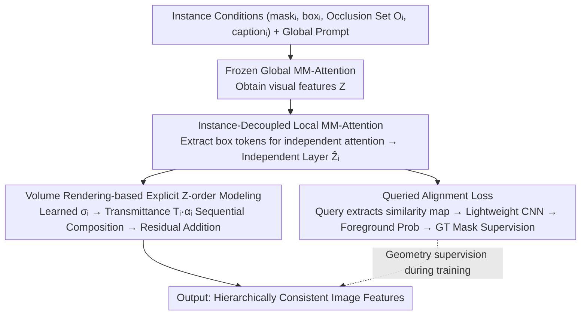

# OcclusionFormer: Arranging Z-Order for Layout-Grounded Image Generation

**Conference**: ICML2026  
**arXiv**: [2605.21343](https://arxiv.org/abs/2605.21343)  
**Code**: https://henghuiding.com/OcclusionFormer/ (Project Page)  
**Area**: Image Generation / Layout-to-Image / Diffusion Models  
**Keywords**: Layout-to-Image, Z-order Occlusion, Volume Rendering, Instance Decoupling, DiT

## TL;DR
Addressing texture entanglement and hierarchical confusion in overlapping regions of layout-to-image generation, the authors construct a large-scale dataset SA-Z with explicit Z-order and amodal annotations. They propose OcclusionFormer, which explicitly models occlusion priority via instance decoupling and volume rendering, and strengthens spatial consistency with a queried alignment loss. Occlusion-aware metrics on the OverLayBench Complex subset and the self-constructed SA-Z Eval significantly outperform strong baselines such as Eligen, Creatilayout, and InstanceAssemble.

## Background & Motivation

**Background**: Layout-to-image generation injects 2D/3D bounding boxes as spatial conditions into diffusion models. Driven by works like GLIGEN, Eligen, and Creatilayout, it has achieved considerable success in the spatial controllability of single instances, serving as infrastructure for tasks like complex scene synthesis and visual storytelling.

**Limitations of Prior Work**: Once multiple bounding boxes overlap, mainstream methods fail: objects in overlapping areas exhibit texture entanglement, inverted hierarchies, or are forced to retract to cover only visible parts. The reason is that these methods treat layout as a 2D planar condition with zero concept of "who obscures whom." Users typically draw amodal boxes (full extent) and assume a depth order that the model cannot infer.

**Key Challenge**: While Z-buffers have long solved occlusion in computer graphics, the attention mechanism of diffusion models naturally mixes features "indiscriminately" on a 2D plane, lacking an explicit Z-axis dimension. LaRender attempted to use training-free volume rendering, but it diverted cross-attention space for occlusion control, losing global prompts, remaining sensitive to hyperparameters, and easily deviating in complex scenes.

**Goal**: (1) Provide an open-vocabulary, large-scale training set with Z-order and amodal annotations; (2) Design a training-based scheme that explicitly models Z-order within the DiT framework without damaging pre-training capabilities, providing physically consistent hierarchies in overlapping regions.

**Key Insight**: The authors argue that training-free heuristics are insufficient; "data-driven + explicit supervision" is necessary. Specifically, each instance is "decoupled" into an independent layer and then "composed" back according to the user-specified occlusion order using volume rendering. Finally, mask supervision is used to anchor spatial geometry.

**Core Idea**: Treat image generation as a volume rendering process along orthogonal camera rays—each instance independently performs MM-Attention within its box to obtain a "layer." The learned density $\sigma_i$ is then used to compute transmittance $T_i$ and opacity $\alpha_i$ for weighted composition according to Z-order. Simultaneously, a queried alignment loss is introduced to "weld" the feature geometry of each instance to the GT mask.

## Method

OcclusionFormer addresses the issue where diffusion model attention naturally mixes features on a 2D plane without Z-axis awareness, leading to texture entanglement in overlapping regions. Its core concept is to reinterpret image generation as volume rendering along orthogonal camera rays: first decoupling each instance into independent feature layers, then composing these layers orderly using NeRF-style transmittance formulas based on the user-provided occlusion order. This module is integrated after each MM-Attention block in Flux.1-dev (DiT + Rectified Flow), fine-tuned using only LoRA (rank=4) to preserve the pre-trained backbone.

### Overall Architecture
The input is a set of instance conditions $(M_i, B_i, \mathcal{O}_i, C_i, P)$ (mask, bounding box, occlusion set, instance caption, global prompt). Each DiT block first runs a frozen global MM-Attention to obtain visual features $\mathbf{Z}\in\mathbb{R}^{L\times D}$, followed by three steps: extracting local tokens based on instance boxes to compute "independent layers" $\hat{\mathbf{Z}}_i$ via separate attention; composing all layers into $\mathbf{Z}_{out}$ using volume rendering based on Z-order $\mathcal{O}_i$ and adding it back residually; and using a learnable query to extract spatial similarity maps from each layer via a lightweight CNN to predict foreground probability, supervised by GT masks. The training objective is $\mathcal{L}_{total} = \mathcal{L}_{flow} + \lambda \mathcal{L}_{align}$ with $\lambda=0.5$.

### Key Designs

**1. Instance-Decoupled Local MM-Attention: Slicing Global Planar Attention into Layerable "Layers"**

The prerequisite for explicit Z-order modeling is having clean, non-contaminated "layers" available for sorting. Eligen/Creatilayout treat layout as a global condition where all instance and background tokens interact indiscriminately in a single large attention block, lacking any concept of "layers." To address this, for each instance $i$, token indices $\Omega_i = \{u \mid \text{Coord}(u) \in B_i\}$ falling within its bounding box are selected. The original MM-Attention module is reused to update $\hat{\mathbf{Z}}_{\Omega_i}, \hat{\mathbf{C}_i} = \text{MM-Attention}(\mathbf{Z}_{\Omega_i}, \mathbf{C}_i')$ only within this local subset and the instance caption embedding $\mathbf{C}_i'$, with zero-padding outside the box. Original attention parameters remain frozen, with LoRA added only to the projection matrices. This keeps instance features clean for subsequent composition while maintaining the generative power of Flux.

**2. Volume Rendering-based Explicit Z-order Modeling: Composing Layers Orderly via Transmittance Formulas**

With individual layers established, they must be composed according to "who obscures whom." Borrowing from NeRF, the image plane is treated as the imaging plane of an orthogonal camera, where each instance corresponds to a segment of "medium" along the ray. Crucially, the density $\sigma_i \in \mathbb{R}^D$ is not fixed but predicted from the diffusion timestep $t$ and instance text pooling vector $y_i$ via a time-text embedding module: $\mathbf{e}_{temb}^i = \text{TimeTextEmbed}(t, y_i) \to \sigma_i$. This allows "solidity" to vary between early low-frequency and late detailed diffusion stages, offering more stability than LaRender's manually heuristic and hyperparameter-sensitive density. At pixel $\mathbf{p}$, opacity is defined as $\alpha_i(\mathbf{p}) = (1 - \exp(-\sigma_i)) \cdot \mathbb{I}(\mathbf{p} \in B_i)$, and transmittance as $T_i(\mathbf{p}) = \exp(-\sum_{j \in \mathcal{O}_i} \sigma_j \cdot \mathbb{I}(\mathbf{p} \in B_j))$. The composition weight is $w_i = T_i \cdot \alpha_i$. For pixels with "occlusion declarations," a normalized weighted average is performed: $\mathbf{Z}_{out}(\mathbf{p}) = \sum_i w_i \hat{\mathbf{Z}}_i / (\sum_i w_i + \epsilon)$, followed by a residual addition to $\mathbf{Z}$. For boundary pixels where boxes intersect but do not truly obscure each other, a simple average (hybrid strategy) is used to prevent texture collapse.

**3. Queried Alignment Loss: Welding Layer Features to GT Mask Geometry**

While volume rendering handles the composition order (front vs. back), it does not guarantee that each feature layer possesses a coherent shape. Without constraints, features may drift within the box, causing broken contours in overlapping areas. Thus, a learnable query $\mathbf{q}_i \in \mathbb{R}^D$ is derived from $\mathbf{e}_{temb}^i$ for each instance. Pixel-wise cosine similarity is performed on $\hat{\mathbf{Z}}_i$ to obtain a spatial similarity map $\mathbf{S}_i(\mathbf{p}) = \hat{\mathbf{Z}}_i(\mathbf{p}) \cdot \mathbf{q}_i / ((\|\hat{\mathbf{Z}}_i(\mathbf{p})\| + \epsilon)\|\mathbf{q}_i\|)$, which is fed into a lightweight CNN $\mathcal{F}_\theta$ to output a foreground/background probability map $\hat{\mathbf{M}}_i$. This is supervised by the GT mask $M_i$ from SA-Z using cross-entropy $\mathcal{L}_{align}$. Using a "query + independent CNN head" instead of applying mask loss directly to the attention map avoids conflict with global MM-Attention semantics and provides a more decoupled supervision path (see Ablation).

### Loss & Training
The total objective is $\mathcal{L}_{total} = \mathcal{L}_{flow} + \lambda \mathcal{L}_{align}$ with $\lambda=0.5$. $\mathcal{L}_{flow}$ follows Flux's rectified flow matching: $\mathcal{L}_{flow} = \mathbb{E}_{t,\mathbf{z}_t,\mathbf{c}}[\|v_\theta(\mathbf{z}_t,t,\mathbf{c}) - \mathbf{v}_{target}\|_2^2]$, where $\mathbf{v}_{target} = \mathbf{x}_1 - \mathbf{x}_0$. Backbone: Flux.1-dev, LoRA rank=4, 200K steps, batch 16, lr=1e-4. The accompanying dataset SA-Z is derived from SACap-1M: DescribeAnything generates pixel-level captions, InstaOrder predicts pairwise occlusion, and SAM-3D reconstructs 3D geometry projected back to the image plane for amodal masks and boxes. Total: 1M high-res images, 5.69M instances, making it the first large-scale layout generation dataset with open-vocabulary amodal and Z-order labels.

## Key Experimental Results

### Main Results
Evaluation is conducted on OverLayBench (Simple/Regular/Complex) and the self-constructed SA-Z Eval (1K real images). Metrics include spatial accuracy (mIoU / O-mIoU), semantic consistency (SR$_E$ / SR$_R$ / CLIP-G/L), image quality (FID), and InstaOrder-style occlusion metrics Occ. (F1) and Dep. (WHDR).

| Subset | Metric | OcclusionFormer | Prev. SOTA (InstanceAssemble) | Creatilayout | Eligen | LaRender |
|------|------|------|------|------|------|------|
| OverLay-Simple | mIoU ↑ | **0.7405** | 0.7279 | 0.6998 | 0.6673 | 0.6604 |
| OverLay-Simple | O-mIoU ↑ | **0.5456** | 0.5152 | 0.4725 | 0.4151 | 0.4136 |
| OverLay-Simple | Occ. ↑ | **0.8051** | 0.7852 | 0.7559 | 0.6823 | 0.6294 |
| OverLay-Regular | mIoU ↑ | **0.6487** | 0.6299 | 0.5997 | 0.5680 | 0.5721 |
| OverLay-Regular | O-mIoU ↑ | **0.4161** | 0.3861 | 0.3517 | 0.3075 | 0.3006 |
| OverLay-Complex | mIoU ↑ | **0.6037** | 0.5706 | 0.5584 | 0.5195 | 0.5227 |
| OverLay-Complex | O-mIoU ↑ | **0.3468** | 0.3189 | 0.3006 | 0.2569 | 0.2507 |
| OverLay-Complex | Occ. ↑ | **0.7797** | 0.6987 | 0.7142 | 0.5994 | 0.6026 |
| OverLay-Complex | Dep. ↓ | **0.1602** | 0.1791 | 0.1907 | 0.2378 | 0.2374 |
| SA-Z Eval | mIoU ↑ | **0.4509** | 0.4292 | 0.4216 | 0.3007 | 0.4053 |
| SA-Z Eval | O-mIoU ↑ | **0.2231** | 0.2021 | 0.1904 | 0.1016 | 0.1709 |
| SA-Z Eval | Occ. ↑ | **0.7568** | 0.6947 | 0.6921 | 0.6095 | 0.6833 |
| SA-Z Eval | FID ↓ | **62.79** | 63.65 | 64.66 | 69.91 | 77.98 |

Highlights: The relative advantage increases with scene complexity (Simple→Complex). O-mIoU and Occ., which directly measure overlapping regions, show the most significant Gains (Occ. +0.08, Dep. -0.019 on the Complex subset).

### Ablation Study (OverLay-Complex)

| Configuration | mIoU ↑ | O-mIoU ↑ | Occ. ↑ | Dep. ↓ | Description |
|------|------|------|------|------|------|
| OcclusionFormer (full) | **0.6037** | **0.3468** | **0.7797** | **0.1602** | Full Model |
| w/o Learned Sigma | 0.5911 | 0.3276 | 0.7530 | 0.1694 | Replacing dynamic density with static values; Occ. F1 drops ~2.7 pts |
| w/o Queried Loss | 0.5922 | 0.3319 | 0.7659 | 0.1666 | Removing alignment loss; O-mIoU drops ~1.5 pts |
| w Attn. Map Loss | 0.5753 | 0.3207 | 0.7510 | 0.1695 | Using mask loss on attention maps performs worse than w/o loss |
| w/o Amodal Data | 0.6004 | 0.3411 | 0.7703 | 0.1644 | Using only visible masks from SA-Z; slight performance drop |

### Key Findings
- **Dynamic density is the most impactful design**: Removing learned $\sigma$ leads to a decrease in Occ. of 0.027 and an increase in Dep. of 0.009, proving that density adaptation to diffusion timestep and text is more stable for characterizing hierarchical weights across diffusion stages than fixed heuristics.
- **Queried alignment loss outperforms attention-map mask loss**: Direct mask supervision on attention maps conflicts with global MM-Attention semantics, performing worse than "w/o Queried Loss." This indicates that "query-guided + independent CNN head" is a more decoupled and effective supervision path.
- **Amodal annotations are consistently beneficial**: Compared to visible-only masks, amodal data provides supervision signals for obscured parts, aiding geometric integrity in complex occlusions. This is a unique value point of SA-Z compared to LayoutSAM/SACap-1M.
- **Real image domain gaps are apparent**: All methods show significantly lower mIoU/O-mIoU on SA-Z Eval compared to OverLayBench (the latter synthesized by Flux). However, OcclusionFormer's relative advantage persist in the real domain, showing improvements are independent of synthetic distribution.

## Highlights & Insights
- **Adopting graphics Z-buffer concepts into a differentiable DiT**: Using NeRF volume rendering for layer composition brings "explicit Z-order" back into diffusion models in a differentiable, end-to-end trainable form. It is more stable than LaRender's training-free heuristics and more physically consistent than GLIGEN/Eligen's global conditioning.
- **Reusable "Decoupling → Composition → Alignment" 3-stage process**: This workflow is not limited to layout generation. Any task requiring multi-source token composition in a user-defined order (video layering, 3D scene editing, controllable diffusion) can adopt this framework: box-mask local subsets, perform independent attention, compose orderly via learned density/transmittance, and apply geometry supervision via query heads.
- **Data strategy for "Open-Vocabulary + Amodal" labeling**: Using SAM-3D for 3D reconstruction then projecting back to obtain "free" amodal annotations sidesteps the small-scale bottleneck of manual labeling (e.g., COCOA). This strategy is transferable to any dataset with visible masks.

## Limitations & Future Work
- **Dependency on correct input Z-order**: The method treats the occlusion set $\mathcal{O}_i$ as a given condition. However, user-provided Z-orders may be ambiguous or incorrect (especially with cyclic occlusions), and the paper does not discuss robustness to incorrect Z-orders.
- **High Absolute FID in complex scenes**: While FID=62.79 on SA-Z Eval is SOTA, it remains much higher than the 24.6 on OverLay-Simple, indicating substantial room for improvement in overall fidelity in complex, multi-instance real-world scenes.
- **Strong Orthogonal Camera Assumption**: The volume rendering is built on a virtual orthogonal camera and axis-aligned box assumption. Suitability for scenes with heavy perspective distortion or tilted amodal boxes is unclear.
- **Training Cost**: Based on Flux.1-dev with 200K steps on 1M high-res data, the reproduction threshold is high. The paper lacks inference latency comparisons; sequential per-instance attention might become a bottleneck with high instance counts.

## Related Work & Insights
- **vs LaRender**: Also utilizes NeRF volume rendering, but LaRender is training-free/heuristic and reuses cross-attention space (losing global prompts). Ours is training-based with learned density and a separate composition module, achieving +0.18 Occ. and +0.10 O-mIoU in complex scenes, showing "learning is more stable than manual tuning."
- **vs Eligen / Creatilayout**: Also based on Flux/DiT, but they treat layout as a global 2D condition. Ours adds a Z-axis dimension and limits attention range via boxes. O-mIoU consistently leads by 0.04~0.05, suggesting that "upgrading spatial constraints from 'conditioning' to 'attention sub-spacing'" is a more direct means of controllability.
- **vs InstanceAssemble**: Currently the strongest baseline. The gap widens significantly in complex subsets (mIoU +0.033, O-mIoU +0.028, Occ. +0.081 on Complex), proving explicit Z-order modeling is more effective at boosting overlapping performance than improved assembly.
- **vs InstaOrder / COCOA**: These datasets first provided Z-order/amodal labels but were restricted to low-res COCO and closed-set vocabularies. SA-Z extends this to SA-1B scales and open vocabularies, bringing "explicit occlusion" to the forefront of open-vocabulary generation.

## Rating
- Novelty: ⭐⭐⭐⭐ Combining differentiable volume rendering with instance decoupling for explicit Z-order control is a clear new setting for layout-to-image, though individual components are recombinations of existing techniques.
- Experimental Thoroughness: ⭐⭐⭐⭐ Covers three complexity levels + real-world eval, 6 baselines, 9 metrics, and 4 ablation dimensions; missing latency and incorrect Z-order robustness analysis.
- Writing Quality: ⭐⭐⭐⭐ Clear motivation and module logic; consistent notation and helpful figures (Fig 1/3/4/5/6).
- Value: ⭐⭐⭐⭐ The SA-Z dataset and explicit Z-order framework are reusable infrastructures for controllable diffusion; provides the first systematic solution for the "amodal box + occlusion accuracy" pain point.

<!-- RELATED:START -->

## Related Papers

- [\[NeurIPS 2025\] InstanceAssemble: Layout-Aware Image Generation via Instance Assembling Attention](../../NeurIPS2025/image_generation/instanceassemble_layoutaware_image_generation_via_instance_a.md)
- [\[ICML 2026\] Position: AI Evaluations Should be Grounded on a Theory of Capability](position_ai_evaluations_should_be_grounded_on_a_theory_of_capability.md)
- [\[CVPR 2026\] PhysGen: Physically Grounded 3D Shape Generation for Industrial Design](../../CVPR2026/image_generation/physgen_physically_grounded_3d_shape_generation_for_industrial_design.md)
- [\[ICML 2026\] Envisioning Beyond the Few: Disentangled Semantics and Primitives for Few-Shot Atypical Layout-to-Image Generation](envisioning_beyond_the_few_disentangled_semantics_and_primitives_for_few-shot_at.md)
- [\[AAAI 2026\] EchoGen: Cycle-Consistent Learning for Unified Layout-Image Generation and Understanding](../../AAAI2026/image_generation/echogen_cycle-consistent_learning_for_unified_layout-image_generation_and_unders.md)

<!-- RELATED:END -->
