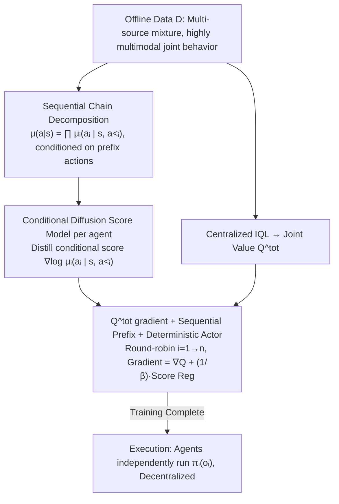

# Offline Multi-agent Reinforcement Learning via Sequential Score Decomposition

**Conference**: ICML 2026  
**arXiv**: [2505.05968](https://arxiv.org/abs/2505.05968)  
**Code**: https://github.com/qiaodan-cuhk/OMSD  
**Area**: Multi-Agent Reinforcement Learning / Offline RL / Diffusion Models  
**Keywords**: Offline MARL, Multi-modal Behavior Policy, Sequential Decomposition, Diffusion Score, CTDE

## TL;DR
OMSD replaces the traditional "independent marginal regression" behavioral constraint in offline MARL with a "chain conditional decomposition + one conditional diffusion model per agent" approach. By regularizing each agent's policy conditioned on the actions already selected by prefix agents, it avoids Out-of-Distribution (OOD) mismatches caused by "aligned marginals but misaligned joints" under multimodal joint behavior distributions. It improves average returns by +33% to +74% over existing SOTA on multiple MPE and MaMuJoCo datasets.

## Background & Motivation
**Background**: Online MARL typically involves repeated interactions and coupled updates, leading agents to converge to a **single** Nash equilibrium where the joint behavior policy is low-entropy and unimodal. Mainstream offline MARL methods either utilize IGM with conservative value estimation (CQL/OMAR/CFCQL/OMIGA) or employ "independent behavior regularization" or "centralized planners/world models" (AlberDICE, MOMA-PPO, MADiff).

**Limitations of Prior Work**: Offline datasets are often collected from a mixture of **multiple** expert or sub-optimal policies, making the joint behavior distribution $\mu(\bm{a}|s)$ inherently **highly multimodal** (the dual-apple cooperative picking task in Figure 1 is a textbook example). However, existing methods almost default to $\mu(\bm{a}|s)=\prod_i \mu_i(a_i|s)$, regularizing each agent towards its own marginal distribution.

**Key Challenge**: In Proposition 3.1 (Combinatorial Mode Shift, CMS), the authors present a minimalist counterexample: a multi-agent task with two modes $\bm{a}_1=(1,\dots,1)$ and $\bm{a}_2=(0,\dots,0)$. If marginals $\hat\mu_i$ are learned independently, the marginals converge to Uniform({0,1}). The reconstructed joint distribution spreads across $2^n$ modes, leading to a TV distance $\delta_{TV}=1-2^{1-n}\to 1$ from the true distribution. In other words, "marginal alignment" under multimodality equals a joint policy that is **almost entirely misaligned** with OOD joint actions never seen in the data.

**Goal**: To provide each agent with a behavioral regularization direction that is **compatible with the joint multimodal structure**, without explicitly modeling the entire joint policy or relying on centralized planners.

**Key Insight**: Utilize the probability chain rule for an **exact** decomposition $\mu(\bm{a}|s)=\prod_{i=1}^n \mu_i(a_i|s, a_{<i})$. This forces each agent's constraint to be conditioned on the **actions already selected by prefix agents**—representing an unbiased decomposition rather than an approximation of independent factors.

**Core Idea**: Distill the conditional score $\nabla_{a_i}\log\mu_i(a_i|s,a_{<i})$ using **one conditional diffusion model per agent** as a policy gradient regularization term. This is combined with the action gradient of a centralized $Q^{tot}$ to achieve "sequential condition + mode-aware" coordinated regularization.

## Method

### Overall Architecture
OMSD is an actor-critic framework under CTDE, where the behavioral constraint on the actor is changed from "marginal KL" to "sequential conditional score regularization," trained offline in two stages:

1.  **Pre-training Phase**: A centralized IQL is used to learn a joint state-action value $Q^{tot}(s,\bm{a})$ from the offline data $\mathcal{D}$. Simultaneously, a conditional diffusion model $\epsilon_i^*(a_i|s, a_{<i}, t)$ is trained **in parallel** for each agent $i$. Its low-noise limit approximates the conditional score $-\epsilon_i^*/\sigma_t \approx \nabla_{a_i}\log\mu_i(a_i|s,a_{<i})$.
2.  **Policy Optimization Phase**: Deterministic actors $\pi_{\theta_i}(s)$ are updated via round-robin. When updating agent $i$, prefix actions $a_{<i}^{\mathrm{new}}$ are sampled using the currently updated $\{\pi_{j}^{\mathrm{new}}\}_{j<i}$ as conditions for the diffusion model. Suffix actions are used only for $Q^{tot}$ gradient estimation and are not backpropagated.
3.  **Execution Phase**: All agents execute $\pi_{\theta_i}(o_i)$ **concurrently and independently**. Sequential conditioning is used only for training-time regularization and **does not break** decentralized execution assumptions.

The key to the entire process: replace "independent diffusion + independent regularization" (as in DOM2) with "conditional diffusion along the chain decomposition + conditional regularization," with the only cost being an additional prefix sampling step during training.

### Key Designs

**1. Sequential Score Decomposition: Resolving CMS by replacing "marginal alignment" with "prefix-conditional alignment"**

Existing offline MARL almost always assumes the joint behavior can be decomposed into agent marginals via $\mu(\bm{a}|s)=\prod_i\mu_i(a_i|s)$, regularizing each agent to its marginal. When data is a mix of experts and the joint distribution is multimodal, this marginal decomposition fails: The Combinatorial Mode Shift (CMS) counterexample in Proposition 3.1 show that independent marginal learning causes the reconstructed joint distribution to spread over $K^n$ spurious modes, with the TV distance to the true distribution approaching 1 (Corollary 3.2 extends this to $K$ modes). "Marginal alignment" in multimodal settings results in "joint misalignment" to OOD actions. OMSD uses the probability chain rule for **exact** decomposition $\mu(\bm{a}|s)=\prod_{i=1}^n \mu_i(a_i|s, a_{<i})$, making agent $i$’s decision conditioned on actions of prefix agents $1\ldots i-1$. Thus, the reference distribution for the KL term $D_{\mathrm{KL}}[\pi_{\theta_i}(\cdot|s)\|\mu_i(\cdot|s,a_{<i})]$ is naturally the "conditional distribution under the prefix mode," effectively resolving CMS. This is the **most cost-effective unbiased fix**: it introduces a "training-time sequence" structure without explicit joint modeling or a centralized planner.

**2. One Conditional Diffusion Score Model per Agent: Score estimator, not sampler (following SRPO style)**

The conditional distribution $\mu_i(a_i|s,a_{<i})$ in the chain decomposition is itself highly multimodal. Lightweight density estimators like GMMs or normalizing flows either suffer from mode collapse or poor mode coverage (see Appendix D.7.5). OMSD trains a DDPM-style conditional diffusion model $\epsilon_i(a_i^k, k| s, a_{<i})$ for each agent with the standard denoising loss $\mathcal{L}_{\text{denoise}}=\mathbb{E}\|\epsilon-\epsilon_i(a_i^k,k|s,a_{<i})\|^2$. Crucially, it does **not** use the diffusion model for generative sampling—which would require dozens of denoising steps during execution, incurring high inference costs and accumulating errors on low-quality data (a bottleneck for Diff-QL/MADiff). OMSD adopts the SRPO approach, taking the low-noise limit $t\to 0$ where $-\epsilon_i^*/\sigma_t$ approximates the conditional score $\nabla_{a_i}\log\mu_i(a_i|s,a_{<i})$. This provides a gradient direction via a single forward pass added directly to the actor gradient (Eq. 6). This leverages the expressive power of diffusion to capture multimodality while keeping inference costs identical to standard policies. Score models are **fully parallelizable** during pre-training and decoupled from the number of agents $n$, tested up to 6-HalfCheetah.

**3. $Q^{tot}$ Gradient + Sequential Prefix + Deterministic Actor: Formulating a policy gradient**

Combining "where to go for reward" and "staying within data modes" requires a unified update direction. OMSD uses centralized IQL to learn a joint value $Q^{tot}(s,\bm{a})$. The policy update follows Eq. (6): $\nabla_{\theta_i}\mathcal{L}^i = \mathbb{E}[\nabla_{a_i}Q_\phi(s,\bm{a}) + \frac{1}{\beta}\cdot(-\epsilon_i^*/\sigma_t)]\nabla_{\theta_i}\pi_{\theta_i}(s)$. The first term is the "gain direction" from the critic, and the second is the conditional score constraint to "stay in-mode." Together, they form an **in-mode hill-climbing direction**. Updates are rolled through agents $i=1\to n$; prefix $a_{<i}^{\mathrm{new}}$ for agent $i$ is sampled from **already updated** $\{\pi_j^{\mathrm{new}}\}_{j<i}$, while suffix actions are used for $Q^{tot}$ gradients without backpropagation. This embeds "coordination" into training. **Deterministic** actors (DiLac) are preferred over stochastic ones because prefix sampling variance accumulates along the chain; stochastic actors introduce exploding noise in $a_{<i}$, making score estimation unstable. Deterministic policies maintain expressivity while stabilizing prefix signals (Appendix D.7.1/D.7.4 show insensitivity to update order, confirming the sequential structure is a training coordination mechanism rather than a strong inductive bias). During execution, agents independently call $\pi_{\theta_i}(o_i)$.

### Loss & Training
- **Pre-training**: `centralized IQL` learns $Q^{tot}$; each agent independently trains $\epsilon_i$ with conditional denoising loss (Eq. 1). Diffusion models are **fully parallelizable** and scalable.
- **Policy Update**: Roll-through update of $\pi_{\theta_i}$ for $i=1\to n$ using the gradient in Eq. (6). The regularization coefficient $\beta$ is a key hyperparameter—strong constraints (0.001) for expert data, weak (0.3) for random data. Sensitivity analysis shows stability over a range of $\beta$ (Fig. 4(b)).
- **Execution**: Each agent independently calls $\pi_{\theta_i}(o_i)$ **without** calling the diffusion model or relying on centralized communication.

## Key Experimental Results

### Main Results

| Dataset (MPE) | Metric (Normalized Score) | Prev. SOTA | OMSD | Gain |
|---|---|---|---|---|
| Cooperative Navigation - Random | normalized | 62.2 (CFCQL) | **69.8** | +12.1% |
| Predator Prey - Medium | normalized | 83.9 (DoF-P) | **137.1** | +63.0% |
| Predator Prey - Random | normalized | 78.5 (CFCQL) | **133.9** | +70.6% |
| World - Random | normalized | 68 (CFCQL) | **141.1** | +107.5% |
| MPE Average | normalized | 87.3 (CFCQL) | **126.7** | +33.2% |

| Dataset (MaMuJoCo / OMIGA) | Prev. SOTA | OMSD | Gain |
|---|---|---|---|
| 3-Hopper - Expert | 859.6 (OMIGA) | **3595** | +329% |
| 3-Hopper - Medium-Expert | 709.0 (OMIGA) | **3568** | +403% |
| 3-Hopper - Medium | 1189.3 (OMIGA) | **3360** | +183% |
| 6-HalfCheetah - Medium-Replay | 2504.7 (OMIGA) | **4582** | +83% |
| OMIGA Average | 1954.7 | **3400** | +73.9% |

Key Observation: **The more multimodal the dataset (Medium / Medium-Replay / Random), the larger the gain for OMSD**. Gains are smaller on Expert data (which is nearly unimodal), supporting the claim that CMS is the core problem.

### Ablation Study

| Configuration | MPE Average / Observation | Explanation |
|---|---|---|
| BRPO-IND (Indep. Learning + Indep. KL) | Often trapped in $[1,-1]$ or $[-1,1]$ OOD actions, score $0\pm 1$ | CMS causes failure even in toy cases |
| BRPO-CTDE (Cent. Critic + Indep. KL) | Also $0\pm 1$ | Centralized critic cannot fix marginal regularization errors |
| BRPO-JAL (Joint Action Learning, Oracle) | $1\pm 0$ | Upper bound |
| **OMSD** | **$1\pm 0$** (SOTA on high-dim tasks) | Chain conditions match JAL upper bound |
| OMSD w/ different update orders | No significant difference | Sequence is a training mechanism, not a bias |
| Score estimator: GMM / NF vs. Diffusion | Diffusion significantly outperforms (Appx D.7.5) | Diffusion mode coverage is necessary for multimodality |
| $\beta$ sweep (Fig. 4(b)) | Expert prefers $\beta=0.001$, Random prefers $\beta=0.3$ | Constraint strength correlates with data quality |

### Key Findings
- **CMS severity scales exponentially with the number of agents**: This is empirically visible; BRPO-IND fails on bandits, and independent diffusion actors (like DOM2) lag significantly behind OMSD on medium/random datasets due to $K^n$ spurious modes.
- **OMSD shows the strongest gains on low-quality data**: (World Random +107.5%, OMIGA Hopper +183~403%), because multimodality is more pronounced there, leading to higher CMS losses and higher repair value.
- **Honest Failure Diagnosis**: The authors note that OMSD slightly underperforms MADiff on tasks like 2-Ant Good / 4-Ant Good. The cause is cited as **insufficient pre-trained critic quality** rather than decomposition failure—diffusion aligns modes, but the critic fails to provide a strong enough improvement direction.
- **t-SNE Visualization (Fig. 4(c))**: Shows that (s,a) learned by OMSD stays within the high-reward regions supported by the dataset, whereas independent regularization methods drift into sparse regions.
- **Scalability**: Diffusion pre-training is agent-parallel. Sequential dependence only appears during policy updates via prefix actions, while **execution remains concurrent**. Experiments on 6-agent HalfCheetah demonstrate this.

## Highlights & Insights
- **Challenging the implicit "independent decomposition" assumption**: The major contribution is identifying "online symmetry breaking to unimodal" vs "offline multi-source multimodal mixture" as the root cause for offline MARL difficulty—a perspective previously lacking in the field.
- **Diffusion models as score estimators rather than generators**: Inference cost equals 1 forward pass, avoiding slow inference and error accumulation. This is a reusable engineering paradigm for modeling complex distributions without generative costs.
- **Chain decomposition + Train-time sequential, Execution-time concurrent**: Coordination is entirely offloaded to the training phase, preserving the purity of CTDE.
- **$\beta$ relationship with data quality**: (Expert = strong constraint, Random = weak constraint) provides an intuitive tuning heuristic applicable to all BRPO-style methods.

## Limitations & Future Work
- **Robustness of update order at scale**: Verified only up to 6 agents; whether "order doesn't matter" holds for much larger teams remains to be seen, as prefix sampling variance might amplify.
- **Reliance on Deterministic Actors (DiLac)**: Prefix noise accumulation makes stochastic policies difficult. This might limit performance in tasks requiring stochastic exploration (e.g., POMDPs).
- **Critic Quality Bottleneck**: As noted in Sec 4.2, OMSD reaches a ceiling for "mode alignment," but "improvement magnitude" depends on the critic. Sync-upgrading both components is needed.
- **Implicit Role Asymmetry**: While order-insensitive in experiments, prefix agents act as "prior setters" for heterogeneous agents, a property requiring deeper theoretical analysis.

## Related Work & Insights
- **vs AlberDICE / OMIGA / CFCQL** (Indep. Reg + Conservative Value): These methods suffer from CMS—no amount of critic conservatism can fix the "marginal alignment → joint misalignment" directional error. OMSD achieves gains by simply fixing the reference distribution.
- **vs MOMA-PPO / MADiff-C** (Cent. Planner / World Model): Those paths build joint policies or models requiring planning at inference, which accumulate errors. OMSD avoids joint models and planning entirely.
- **vs DOM2 / MADiff-D** (Indep. Diffusion Actor): They assume independent decomposition and are thus CMS victims. OMSD fixes the decomposition via the chain rule using the same diffusion backbone.
- **vs SRPO (single-agent)**: OMSD can be viewed as the multi-agent extension of SRPO—inheriting the score estimator and policy gradient approach while generalizing the single-agent $\nabla\log\mu(a|s)$ to multi-agent chain $\nabla\log\mu_i(a_i|s,a_{<i})$.

## Rating
- Novelty: ⭐⭐⭐⭐ Correcting CMS through chain decomposition is a clean and fresh entry into a field dominated by independent decomposition.
- Experimental Thoroughness: ⭐⭐⭐⭐ MPE + MaMuJoCo benchmarks + bandit + robustness/sensitivity studies. Reporting negative results adds credibility.
- Writing Quality: ⭐⭐⭐⭐ Prop 3.1 is highly educational. Figures 1 and 2 clarify the "why" of multimodality and marginal errors.
- Value: ⭐⭐⭐⭐ Provides a "theoretical diagnosis + plug-and-play fix" paradigm for offline MARL. Open-source availability makes it a strong baseline for future work.

<!-- RELATED:START -->

## Related Papers

- [\[AAAI 2026\] Conditional Diffusion Model for Multi-Agent Dynamic Task Decomposition](../../AAAI2026/image_generation/conditional_diffusion_model_for_multi-agent_dynamic_task_dec.md)
- [\[CVPR 2026\] Towards Robust Sequential Decomposition for Complex Image Editing](../../CVPR2026/image_generation/towards_robust_sequential_decomposition_for_complex_image_editing.md)
- [\[ICLR 2026\] Flow Matching with Injected Noise for Offline-to-Online Reinforcement Learning](../../ICLR2026/image_generation/flow_matching_with_injected_noise_for_offline-to-online_reinforcement_learning.md)
- [\[ICML 2026\] Path-Coupled Bellman Flows for Distributional Reinforcement Learning](path-coupled_bellman_flows_for_distributional_reinforcement_learning.md)
- [\[ICML 2026\] CoCoEdit: Content-Consistent Image Editing via Region Regularized Reinforcement Learning](cocoedit_content-consistent_image_editing_via_region_regularized_reinforcement_l.md)

<!-- RELATED:END -->
