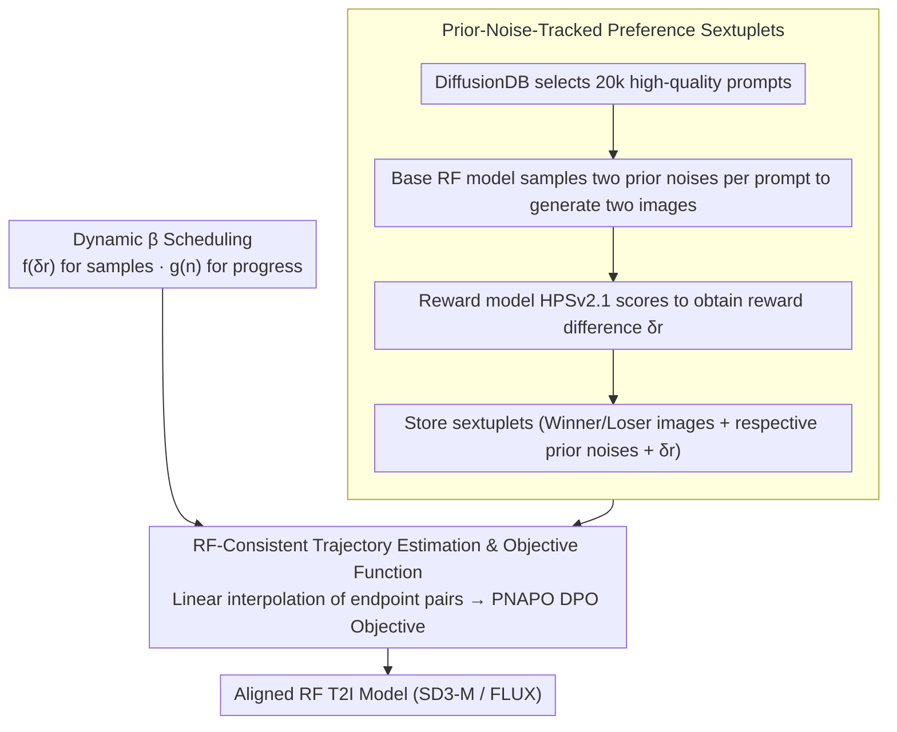

# Offline Preference Optimization for Rectified Flow with Noise-Tracked Pairs

**Conference**: ICML 2026  
**arXiv**: [2605.09433](https://arxiv.org/abs/2605.09433)  
**Code**: None (Repository link not disclosed in the paper)  
**Area**: Alignment RLHF / Diffusion Models / Text-to-Image  
**Keywords**: Rectified Flow, Diffusion-DPO, Preference Optimization, Prior Noise, Dynamic Regularization

## TL;DR
This paper proposes PNAPO for Rectified Flow (RF) text-to-image models—an offline preference optimization framework that saves the "prior noise used during generation" alongside "winner/loser images" as sextuplets. By leveraging the RF linear trajectory hypothesis for trajectory estimation and dynamic regularization coefficient scheduling, it achieves higher performance on SD3-M/FLUX while reducing training compute to $1/12$ compared to Diffusion-DPO.

## Background & Motivation

**Background**: The mainstream approach for post-training alignment in text-to-image (T2I) involves collecting (prompt, winner, loser) triplet preference data, then using RL (DDPO, DPOK) or RL-free DPO-style objectives (Diffusion-DPO, D3PO, etc.) to bias the generator toward winners. RL-free methods are preferred for their stability and simplicity.

**Limitations of Prior Work**: Existing preference datasets (Pick-a-Pic, HPDv2, ImageReward, etc.) only save the final images, discarding the "prior noise used to generate the image." However, diffusion/flow model generation is essentially a trajectory process starting from a specific noise. Methods like Diffusion-DPO can only approximate the reverse trajectory using independently sampled forward noise, which is mismatched with the true reverse dynamics, leading to unstable training and inefficient credit assignment.

**Key Challenge**: In standard diffusion models, reverse trajectories are stochastic and curved, making it intractable to sample an exact reverse path given endpoints. RF is different—its training objective is to "straighten" the data-noise coupling into near-linear trajectories, where the prior noise directly determines a trajectory. Thus, "discarding prior noise" is a more significant loss in RF than in ordinary diffusion models.

**Goal**: (1) Enable preference data to retain prior noise; (2) Design a DPO-style objective consistent with RF geometry; (3) Address two long-standing issues: weak updates due to fixed $\beta$ in late-stage DPO training and the uniform treatment of all samples.

**Key Insight**: The authors observe a key property of RF: $\boldsymbol{x}_t = (1-t)\boldsymbol{x}_0 + t\boldsymbol{x}_T$ is a linear interpolation between endpoints. If both $\boldsymbol{x}_0$ and $\boldsymbol{x}_T$ are stored in the dataset, intermediate states can be directly estimated via interpolation without additional noise injection. This degrades intractable reverse sampling into a simple linear interpolation, drastically reducing variance.

**Core Idea**: Extend preference triplets to sextuplets $(\boldsymbol{c}, \boldsymbol{x}_0^w, \boldsymbol{x}_0^l, \boldsymbol{x}_T^w, \boldsymbol{x}_T^l)$ with an added continuous reward difference $\delta r$. Use RF linear interpolation to estimate intermediate states and apply a dynamic $\beta$ scheduled by both reward difference and training steps.

## Method

### Overall Architecture
PNAPO addresses the variance source in Diffusion-DPO applied to RF caused by "discarding prior noise and approximating reverse trajectories with independently sampled noise." It decomposes the process into an offline, off-policy RL-free pipeline: first, use a base RF model to sample two prior noises per prompt, generate two images, score them with a reward model, and save them as noise-retaining sextuplets. During training, instead of resampling, intermediate states are interpolated from stored endpoint pairs using RF linear trajectory properties. These are fed into an RF-consistent DPO-style objective with a dynamic $\beta$ automatically adjusted by reward difference and training progress.

### Key Designs

**1. Prior-Noise-Tracked Preference Sextuplet: Storing Noise Together**

Existing preference datasets only keep final images, forcing DPO to resample from independent $\boldsymbol{x}_T^* \sim \mathcal{N}(0, I)$ to estimate the reverse process, introducing variance mismatched with actual training. PNAPO extends traditional triplets $(\boldsymbol{c}, \boldsymbol{x}_0^w, \boldsymbol{x}_0^l)$ to sextuplets $(\boldsymbol{c}, \boldsymbol{x}_0^w, \boldsymbol{x}_0^l, \boldsymbol{x}_T^w, \boldsymbol{x}_T^l)$, plus a continuous reward difference $\delta r$. For data construction, 20k high-quality prompts are selected from DiffusionDB (NSFW filtering → Jaccard/CLIP deduplication → 100 KNN cluster resampling). Each prompt uses the base RF model to sample two noises and generate two images ($off-policy$ but same model family, ensuring noise and policy consistency), scored by HPSv2.1 to get $\delta r = r_\theta(\boldsymbol{x}_0^w) - r_\theta(\boldsymbol{x}_0^l)$. Storing noise is equivalent to explicitly preserving $p_\theta(\boldsymbol{x}_T^* | \boldsymbol{x}_0^*)$, narrowing the decision space from "all possible trajectories" to "the specific trajectory that produced this image," significantly reducing variance—this is the source of theoretical guarantees and $12\times$ speedup.

**2. RF-Consistent Trajectory Estimation & Objective: Replacing Reverse Sampling with Interpolation**

Directly modeling the reverse trajectory $p_\theta(\boldsymbol{x}_{1:T-1} | \boldsymbol{x}_0)$ is intractable. PNAPO uses $p_\theta(\boldsymbol{x}_T | \boldsymbol{x}_0) q(\boldsymbol{x}_{1:T-1} | \boldsymbol{x}_0, \boldsymbol{x}_T)$ as an approximation and formally proves $D_{KL}(p_\theta(\boldsymbol{x}_T|\boldsymbol{x}_0) q(\boldsymbol{x}_{1:T-1}|\boldsymbol{x}_0, \boldsymbol{x}_T) \| p_\theta(\boldsymbol{x}_{1:T}|\boldsymbol{x}_0)) \leq D_{KL}(q(\boldsymbol{x}_{1:T}|\boldsymbol{x}_0) \| p_\theta(\boldsymbol{x}_{1:T}|\boldsymbol{x}_0))$, meaning this approximation is strictly tighter on RF than the forward noise approximation of Diffusion-DPO. The key lies in the fact that RF intermediate states are linear interpolations of endpoints $\boldsymbol{x}_t^* = (1-t)\boldsymbol{x}_0^* + t\boldsymbol{x}_T^*$; once endpoints are stored, intermediate states are obtained via a single interpolation without resampling. Through Jensen's inequality and KL decomposition, the loss becomes $\mathcal{L}_{\text{PNAPO}}(\theta) = -\mathbb{E}_{(\boldsymbol{c}, \boldsymbol{x}_0^w, \boldsymbol{x}_0^l, \boldsymbol{x}_T^w, \boldsymbol{x}_T^l), t} \log \sigma(-\beta(\boldsymbol{s}_\theta^t(\boldsymbol{x}_0^w, \boldsymbol{x}_T^w, \boldsymbol{c}) - \boldsymbol{s}_\theta^t(\boldsymbol{x}_0^l, \boldsymbol{x}_T^l, \boldsymbol{c})))$, where $\boldsymbol{s}_\theta^t(\boldsymbol{x}_0^*, \boldsymbol{x}_T^*, \boldsymbol{c}) = \|(\boldsymbol{x}_T^* - \boldsymbol{x}_0^*) - v_\theta(\boldsymbol{x}_t^*, t, \boldsymbol{c})\|^2_2 - \|(\boldsymbol{x}_T^* - \boldsymbol{x}_0^*) - v_{\text{ref}}(\boldsymbol{x}_t^*, t, \boldsymbol{c})\|^2_2$. Intuitively, it makes the velocity field $v_\theta$ more accurate than the frozen reference model $v_{\text{ref}}$ on winner trajectories and worse on loser trajectories; analogous to sparse rewards in RL, narrowing the decision space reduces gradient variance and accelerates training.

**3. Reward-Difference and Progress-Based Dynamic $\beta$ Scheduling: Adaptive Regularization Strength**

Gradient decomposition of $\nabla_\theta \mathcal{L}_{\text{PNAPO}}$ reveals two issues with fixed $\beta$: uniform weighting of all image pairs (ignoring difficulty) and late-stage training where strong regularization pulls the model back to the ref. PNAPO modifies $\beta$ to $\beta(\delta r, n) = \beta \cdot f(\delta r) \cdot g(n)$ using two decoupled factors. The sample controller $f(\delta r) = 2\sigma(\delta r) - 1$ increases monotonically to 1, giving higher weight to pairs with large reward differences ("obviously better"). The annealing factor $g(n)$ manages training progress—staying at 1 for the first $n_1$ steps, then cosine-decaying to $1/2$ between $n_1$ and $n_2$, allowing more deviation from the ref in later stages. Together, they raise $\beta$ to accelerate alignment when the margin is negative and provide softer updates after the margin turns positive.

### Loss & Training
The core loss is the PNAPO objective defined above. Optimizer: AdamW, Learning Rate: $1\mathrm{e}{-6}$; $\beta=2000$ for FLUX, $\beta=5000$ for SD3-M. Data: 20k prompts × 2 images per prompt. Sampling uses Euler discrete scheduler, 50 steps, guidance scale=1. Training performed on 8× NVIDIA H800 GPUs.

## Key Experimental Results

### Main Results
Baselines include the original model, SFT, Diffusion-DPO, IPO, and CaPO, all reproduced with identical hyperparameters and model configurations for fairness. Evaluated on HPDv2 (3200 prompts) and OPDv1 (7459 prompts) using PickScore, HPSv2.1, ImageReward, LAION Aesthetic, and CLIP; GenEval is used for object generation alignment.

| Test Set / Model | Metric | Base | DPO | PNAPO | Gain |
|--------------|------|--------|-----|-------|------|
| OPDv1 SD3-M | HPSv2.1 | 31.96 | 32.39 | 33.09 | +1.13 (vs base) |
| OPDv1 FLUX | HPSv2.1 | 30.74 | 30.79 | 32.10 | +1.36 (vs base) |
| OPDv1 FLUX | ImageReward | 1.202 | 1.209 | 1.238 | +0.036 |
| OPDv1 FLUX | Aesthetic | 6.550 | 6.548 | 6.692 | +0.142 |
| GenEval SD3-M | Overall | 0.68 | — | 0.73 | +7.4% Relative |
| GenEval FLUX | Overall | 0.65 | 0.66 | 0.69 | +6.2% Relative |
| HPSv2.1 Win Rate FLUX | PNAPO vs DPO | — | — | 84.6% | — |

### Ablation Study
Training Compute Comparison (NVIDIA H800 GPU-Hours):

| Model | Diffusion-DPO | PNAPO | Gain |
|------|--------------|-------|------|
| SD3-M | ~249.6 | ~20.8 | 12× |
| FLUX | ~422.4 | ~35.2 | 12× |

User Study (10 participants, 20 image pairs, PNAPO-FLUX vs baselines):

| Evaluation Dimension | PNAPO Preference Rate |
|---------|------------|
| Overall Preference | 56% |
| Visual Appeal | 72% |
| Text-Image Alignment | 52% |

### Key Findings
- **Quality and Compute Win-Win**: Surpasses Diffusion-DPO on all metrics while cutting GPU time to $1/12$, validating that "tighter trajectory estimation" directly improves training efficiency.
- **Mitigation of Background Blur**: The characteristic background blur artifact in FLUX is significantly reduced under PNAPO; qualitative results show improved text rendering and composition.
- **Architecture Generalization**: Consistent improvements across two different RF architectures (SD3-M / FLUX) indicate the method relies on RF geometric properties rather than specific model designs.
- **CLIP Text-Image Alignment**: Improved from 35.97 to 36.89 on FLUX, proving dynamic $\beta$ does not sacrifice text alignment for aesthetics.

## Highlights & Insights
- **Paradigm Shift from "Discarding Noise" to "Tracking Noise"**: While previous preference datasets only stored images, this paper argues that for RF, noise is part of the trajectory identity—a long-overlooked "free lunch." Storing a noise tensor during data construction yields a $12\times$ compute saving.
- **Geometric-Consistent Approximation with Theoretical Bounds**: The authors use KL chain inequality to strictly prove PNAPO's trajectory approximation is tighter than Diffusion-DPO's, grounding "better" performance in solid theory.
- **Design of Decoupled Dynamic $\beta$ Factors**: $f(\delta r)$ handles sample difficulty while $g(n)$ handles progress. This clean decoupling allows independent application to other DPO variants (D3PO, IPO, Diffusion-KTO).
- **Engineering Friendliness of Offline RL-free**: Compared to online RL methods like GRPO, PNAPO requires only a single data collection phase followed by stable offline training, making it more practical for production environments with compute/scheduling constraints.

## Limitations & Future Work
- **Dependency on Reward Models**: Using HPSv2.1 as a pseudo-human labeler can amplify the model's biases and blind spots; the paper does not discuss reward hacking risks.
- **Restricted to RF-class Models**: The core mechanism (linear interpolation) strictly depends on the linearity of RF trajectories and cannot be directly migrated to pure DDPM/DDIM.
- **Small Data Scale**: 20k prompts is relatively small for T2I preference datasets. Whether dynamic $\beta$ scheduling remains stable when scaling to 100k+ needs verification.
- **Lack of Comparison with Online RL**: Positioned as a supplement to RL-free schemes, but lacks a fair compute-controlled comparison with GRPO-style methods; the true gap between offline and online gains remains unquantified.
- **Manual Hyperparameters for $n_1, n_2$**: The thresholds for cosine annealing are set empirically and may require retuning for different models/datasets.

## Related Work & Insights
- **vs Diffusion-DPO (Wallace 2024)**: Similar concept but uses forward noise to approximate reverse trajectories. PNAPO provides tighter approximation and $12\times$ faster training by leveraging RF geometry.
- **vs D3PO (Yang 2024)**: D3PO uses iterative reverse processes to estimate step-wise preferences, which is computationally expensive. PNAPO skips this via interpolation.
- **vs SPO / InPO / SmPO**: These methods align preferences throughout the denoising process, requiring DDIM Inversion. PNAPO is simpler by directly using stored noise.
- **vs Diffusion-NPO / Self-NPO**: Trains a "negative model" for guidance via CFG. PNAPO focuses on positive updates; the two are complementary.
- **vs GRPO series (Online RL)**: High alignment but requires massive online sampling. PNAPO is more practical under compute/engineering constraints via "sample once, train offline."

## Rating
- Novelty: ⭐⭐⭐⭐⭐ The data structure change to "store noise" is simple but strikes the variance source of Diffusion-DPO by leveraging RF geometry.
- Experimental Thoroughness: ⭐⭐⭐⭐ Dual models, two datasets, multiple metrics, user studies, and GPU-hour comparisons. Lacks only online RL comparison and massive scale validation.
- Writing Quality: ⭐⭐⭐⭐ Clear derivations. The flow from motivation to objective and dynamic $\beta$ is seamless, though math notation is dense.
- Value: ⭐⭐⭐⭐⭐ Highly valuable for RF-based T2I post-training as a plug-and-play method that saves an order of magnitude in compute.

<!-- RELATED:START -->

## Related Papers

- [\[ICCV 2025\] Straighten Viscous Rectified Flow via Noise Optimization](../../ICCV2025/image_generation/straighten_viscous_rectified_flow_via_noise_optimization.md)
- [\[ICML 2026\] E²PO: Embedding-perturbed Exploration Preference Optimization for Flow Models](embedding-perturbed_exploration_preference_optimization_for_flow_models.md)
- [\[ICML 2026\] Support-Proximity Augmented Diffusion Estimation for Offline Black-Box Optimization](support-proximity_augmented_diffusion_estimation_for_offline_black-box_optimizat.md)
- [\[ICLR 2026\] Flow Matching with Injected Noise for Offline-to-Online Reinforcement Learning](../../ICLR2026/image_generation/flow_matching_with_injected_noise_for_offline-to-online_reinforcement_learning.md)
- [\[NeurIPS 2025\] Diffusion Model as a Noise-Aware Latent Reward Model for Step-Level Preference Optimization](../../NeurIPS2025/image_generation/diffusion_model_as_a_noiseaware_latent_reward_model_for_step.md)

<!-- RELATED:END -->
