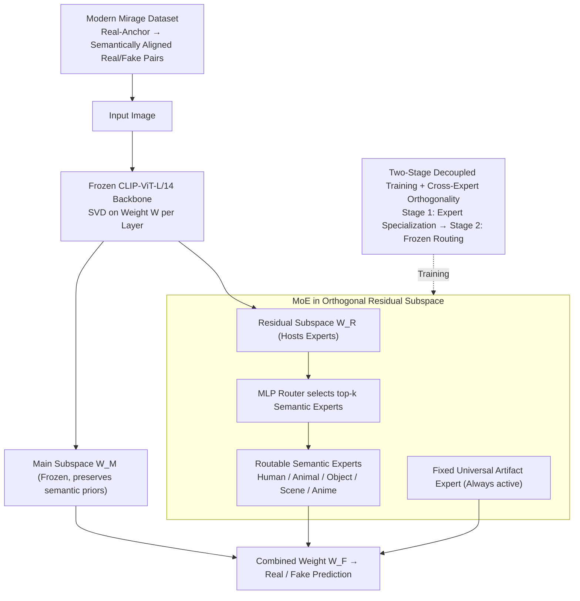

# OmniAID: Decoupling Semantic and Artifacts for Universal AI-Generated Image Detection in the Wild

**Conference**: ICML 2026  
**arXiv**: [2511.08423](https://arxiv.org/abs/2511.08423)  
**Code**: https://github.com/yunncheng/OmniAID  
**Area**: AI Security / AIGC Detection / Multi-Expert Models  
**Keywords**: AIGI Detection, MoE, Semantic-Artifact Decoupling, SVD Residual Subspace, Mirage Dataset

## TL;DR
OmniAID employs a decoupled MoE architecture consisting of "Semantic Experts + a Universal Artifact Expert" to learn two types of forgery cues—"content-related flaws" and "universal generation artifacts"—within a low-rank residual subspace derived from CLIP-ViT attention weight SVD. Coupled with the modern Mirage dataset, it achieves state-of-the-art average accuracies of 95.9%, 91.4%, and 88.4% on GenImage, Chameleon, and Mirage-Test benchmarks, respectively.

## Background & Motivation
**Background**: Current AI-generated image (AIGI) detection primarily follows two paths. One is the artifact-specific route, using handcrafted features like frequency domain filtering and upsampling fingerprints to capture low-level traces of specific generators. The other is the now-dominant VFM-based route, leveraging strong semantic priors of Vision Foundation Models (VFMs) like CLIP or DINOv2 through LoRA, SVD residual fine-tuning (Effort), or category prototype injection (C2P-CLIP) to achieve cross-generator generalization.

**Limitations of Prior Work**: The authors identify two bottlenecks in both routes. First, **single entangled representation**—SOTA methods compress "semantic-level content-related flaws (e.g., malformed faces, unphysical architecture)" and "content-agnostic universal artifacts (e.g., frequency fingerprints, VAE reconstruction traces)" into the same feature space. Consequently, detectors trained on "Animal" show significant performance drops when tested on "Scene" (validated in Paper Fig 2a/b). Second, **outdated benchmarks**—datasets like GenImage predominantly originate from GANs and early Stable Diffusion, causing models to collapse on in-the-wild sets like Chameleon (Fake accuracy near 0).

**Key Challenge**: The pre-training objective of VFMs is general semantic understanding, which is not naturally inclined toward "forgery evidence." Simultaneously, mixed-data training couples semantic flaws and low-level artifacts, forcing the model to compromise—either overfishing for semantic patterns within the training domain or overfitting to artifacts of a single generator.

**Goal**: To **explicitly decouple** two types of evidence: (i) flaws across different semantic domains should be independent; (ii) content-related semantic flaws should be independent of content-agnostic universal artifacts. Additionally, the work proposes a new benchmark aligned with the 2025 generator distribution.

**Key Insight**: The authors start from two observations. First, content-agnostic artifacts exist in all images and should be handled by a **consistently activated** expert. Conversely, content-related flaws are highly domain-dependent and should be learned by **routable domain experts**. Second, training experts in a low-rank residual subspace obtained via SVD preserves CLIP's principal component priors while allowing different experts to be assigned to different directions via orthogonality constraints, naturally supporting decoupling.

**Core Idea**: Use a mixture of MoE with "Routable Semantic Experts + Fixed Universal Artifact Expert" to separate "what is generated" and "how it is generated" into different subspaces.

## Method

### Overall Architecture
OmniAID addresses the issue where forgery evidence is compressed into a single feature space, leading to cross-domain failure. It separates "content-related flaws" and "universal artifacts" into different low-rank subspaces. The backbone uses a frozen CLIP-ViT-L/14@336px. For each attention layer weight $\mathbf{W}\in\mathbb{R}^{d_{out}\times d_{in}}$, SVD is applied: $\mathbf{W}_M=\mathbf{U}_{:d-r}\mathbf{\Sigma}_{:d-r}\mathbf{V}_{:d-r}^{T}$ serves as the frozen "main subspace" to preserve CLIP's pre-trained semantic priors; $\mathbf{W}_R=\mathbf{U}_{d-r:}\mathbf{\Sigma}_{d-r:}\mathbf{V}_{d-r:}^{T}$ is the "residual subspace" used to host experts. Within the residual, two types of experts are attached: $N_S$ routable semantic experts $\mathcal{E}_S=\{e_1,\dots,e_{N_S}\}$ (Human / Animal / Object / Scene / Anime) and one fixed universal artifact expert $\mathcal{E}_U$. During the forward pass, an independent frozen CLIP encoder feeds image features into a lightweight MLP router $\mathcal{R}$ to select the top-$k_S$ semantic experts. The final layer weight is combined as $\mathbf{W}_F=\mathbf{W}_M+\mathbf{W}_{R,U}+\sum_{i\in S}g_i\cdot\mathbf{W}_{R,i}$, with gating weights $g_i=\mathrm{Softmax}(\mathbf{z}_\mathbf{x})_i$. The artifact expert $\mathbf{W}_{R,U}$ does not compete for routing and is activated for every forward pass. Training proceeds in two stages: expert specialization followed by frozen-expert routing training.

### Key Designs

**1. MoE in Orthogonal Residual Subspace: Handling Artifacts with a Fixed Expert and Semantics with Routable Experts**

This design directly targets the entanglement issue. OmniAID confines all experts to $\mathbf{W}_R$, the residual subspace spanned by the smallest singular components. This avoids disrupting the CLIP priors in $\mathbf{W}_M$. Semantic experts are trained on domain-specific data to learn "what a distorted version of this content looks like," while the universal artifact expert is trained on semantically aligned real/reconstructed image pairs (e.g., COCO real vs. reconstructions from VAEs like SDv1.x–SD3.5, TAESD, etc.) to learn the low-level traces left by any VAE. By fixing the artifact expert and routing semantic experts, the architecture recognizes the inherent difference between the two types of evidence.

**2. Two-Stage Decoupled Training + Cross-Expert Orthogonal Constraints: Ensuring Complementary Evidence**

To ensure experts do not learn redundant features, individual training stages utilize orthogonal constraints. In Stage 1, only one expert $e_a$ is activated at a time. The objective is $\mathcal{L}_{\text{Stage1}}=\mathcal{L}_{\text{cls}}+\lambda_1\mathcal{L}_{\text{orth}}$, where $\mathcal{L}_{\text{orth}}=\sum_{j\in\mathcal{I}_{\text{prev}}}(\|\mathbf{U}_i^T\mathbf{U}_j\|_F^2+\|\mathbf{V}_i^T\mathbf{V}_j\|_F^2)$ and $\mathcal{I}_{\text{prev}}=\{M\}\cup\{0,\dots,i-1\}$. This constrains the new expert to be orthogonal to both the main subspace **and all previously trained experts**. The classification head is reset after each expert is trained to prevent memory contamination. Stage 2 freezes all experts and trains the router and a new head using $\mathcal{L}_{\text{Stage2}}=\mathcal{L}_{\text{cls}}+\lambda_2\mathcal{L}_{\text{gating}}+\lambda_3\mathcal{L}_{\text{balance}}$, where $\mathcal{L}_{\text{gating}}$ supervises sharp distributions using ground-truth domain labels and $\mathcal{L}_{\text{balance}}$ ensures load balancing.

**3. Modern Mirage Dataset + Anchored Synthesis Pipeline: Compensating for Semantic Variance via Data Construction**

Since older benchmarks like GenImage (2022) no longer represent 2025-era generators, the authors developed Mirage. Mirage-Train contains 933K real / 1674K fake images across five categories, generated by SD3.5, Flux.1, and commercial APIs. Mirage-Test includes 22K real / 28K fake images from held-out, photorealism-tuned generators. Crucially, the pipeline uses "real-image-anchored prompting": LMMs label real images with descriptions used to feed T2I generators, forcing real and fake images to align semantically. This prevents the model from taking shortcuts based on content differences and forces it to learn low-level artifacts.

### Loss & Training
- Stage 1: $\mathcal{L}_{\text{cls}}+\lambda_1\mathcal{L}_{\text{orth}}$. Expert-wise training, unfreezing only current expert $\mathbf{U}_{d-r:},\mathbf{\Sigma}_{d-r:},\mathbf{V}_{d-r:}$ and head.
- Stage 2: $\mathcal{L}_{\text{cls}}+\lambda_2\mathcal{L}_{\text{gating}}+\lambda_3\mathcal{L}_{\text{balance}}$. All experts frozen; only router and head trained.
- Configuration: AdamW, $lr=2\times 10^{-4}$, batch size 32, 1 epoch per stage, 4× H200. Training takes ~3 hours on GenImage and ~18 hours on Mirage.

## Key Experimental Results

### Main Results

| Dataset | Metric | OmniAID | OmniAID-Mirage | Prev. SOTA | Gain |
| :--- | :--- | :--- | :--- | :--- | :--- |
| GenImage (Avg. 8 subsets) | Acc % | 95.9 | 97.2 | Effort 91.1 | +4.8 / +6.1 |
| Chameleon (in-the-wild) | Acc % | ~77 | **91.4** | GenImage baselines ~50% (collapse) | >2x |
| Mirage-Test (Avg. 5 cat.) | Acc % | 51.1 | **88.4** | Effort 43.0, DRCT 42.0 | +45.4 |
| Mirage-Test (Avg. 5 cat.) | AP % | 53.4 | **96.8** | Effort 46.8 | +50.0 |

Note: Standard OmniAID and baselines were trained only on GenImage-SDv1.4 for fair comparison; OmniAID-Mirage used the new Mirage-Train.

### Ablation Study

| Config ($e_0$=H/A, $e_1$=O/S, $e_U$=Artifact) | GenImage | Chameleon | Mirage-Test | Description |
| :--- | :--- | :--- | :--- | :--- |
| $e_0$ only | 84.4 | 58.9 | 39.6 | Single semantic expert |
| $e_1$ only | 85.2 | 59.0 | 36.3 | Single semantic expert |
| $e_U$ only | 83.3 | 60.9 | 45.1 | Single artifact expert (beats semantic experts on OOD) |
| $e_0+e_1$ (No artifact expert) | 92.2 | 66.1 | 44.5 | Without $e_U$, Chameleon drops 11.3% |
| $e_0+e_U$ | 91.9 | 68.1 | 47.4 | Without $e_1$ |
| $e_1+e_U$ | 93.5 | 70.8 | 49.0 | Without $e_0$ |
| **Full ($e_0+e_1+e_U$)** | **95.9** | **77.4** | **51.1** | Full synergy |

### Key Findings
- **Universal artifact expert is the key to generalization**: Removing $e_U$ leads to an 11.3% drop on Chameleon, outweighing the loss of any single semantic expert.
- **Strong subject semantics can be detrimental**: Removing the Object/Scene expert caused more degradation than removing Human/Animal. Salient subjects (Human/Animal) might make the model more prone to semantic overfitting.
- **Router Interpretability**: For a Human image, the Human expert receives 0.94 weight. A mixed "Animal with Human" image automatically distributes weights (Animal 0.69 + Human 0.31). Unseen categories (medical images) are routed reasonably (Object 0.57, Human 0.37) while keeping the artifact expert active.
- **Data + Architecture must upgrade together**: Mirage-Train improves all methods, but only OmniAID avoids performance regression on older benchmarks, demonstrating architectural robustness.

## Highlights & Insights
- **"Content-agnostic artifact = fixed expert"** is a clever design. Since artifacts appear in all images, making them compete in a top-k routing might cause them to be suppressed by semantic features. Fixing them ensures a dedicated channel for low-level signals.
- **Cross-expert orthogonality** extends the "expert vs. main subspace" constraint to a multi-expert setting, providing a strong engineering trick to prevent semantic overlap in MoEs.
- **Anchored prompting** uses data construction to enforce semantic invariance that models cannot achieve on their own. This is applicable to any discriminative training where content shortcuts must be avoided.
- The approach handles unseen classes elegantly through soft routing and the universal artifact channel without requiring an explicit "unknown" class scheme.

## Limitations & Future Work
- The authors primarily discuss ethical limitations; failure cases were not deeply analyzed in the main text.
- Potential limitations: (i) Dependence on a fixed semantic taxonomy for experts; (ii) No analysis on whether switching to larger or smaller VFMs affects the decoupling efficiency; (iii) The router requires an additional CLIP forward pass (FLOPs/latency details are in the Appendix).
- Future Work: Implementing a continuously differentiable sparse gate for online expert addition; using contrastive learning to further separate expert features; and adding frequency domain/DCT branches.

## Related Work & Insights
- **vs. Effort (Yan et al., 2025b)**: Both use SVD subspaces, but Effort uses a single adapter. OmniAID extends this to a MoE with $N_S+1$ orthogonal experts.
- **vs. DRCT / AlignedForensics**: These rely on semantic alignment to learn artifacts. OmniAID adopts similar data construction but isolates it to the artifact expert while maintaining separate semantic pathways.
- **vs. C2P-CLIP (Tan et al., 2025)**: C2P uses category prototypes for semantic generalization. OmniAID instead splits semantic evidence by domain and uses a dedicated artifact channel as a safeguard.

## Rating
- Novelty: ⭐⭐⭐⭐ Simultaneously modeling semantic-artifact and inter-semantic decoupling in MoE with a fixed artifact expert is a distinct structural claim.
- Experimental Thoroughness: ⭐⭐⭐⭐⭐ Comprehensive coverage across three benchmarks, two training sets, detailed ablations, and router visualizations.
- Writing Quality: ⭐⭐⭐⭐ Clear diagrams and consistent notation, though some theoretical analysis on orthogonality is relegated to the Appendix.
- Value: ⭐⭐⭐⭐⭐ Provides both a SOTA detector and a modern benchmark aligned with current generators.

<!-- RELATED:START -->

## Related Papers

- [\[ICML 2026\] DGS-Net: Distillation-Guided Gradient Surgery for CLIP Fine-Tuning in AI-Generated Image Detection](dgs-net_distillation-guided_gradient_surgery_for_clip_fine-tuning_in_ai-generate.md)
- [\[AAAI 2026\] Beyond Semantic Features: Pixel-Level Mapping for Generalized AI-Generated Image Detection](../../AAAI2026/image_generation/beyond_semantic_features_pixel-level_mapping_for_generalized_ai-generated_image_.md)
- [\[AAAI 2026\] Aggregating Diverse Cue Experts for AI-Generated Image Detection](../../AAAI2026/image_generation/aggregating_diverse_cue_experts_for_ai-generated_image_detec.md)
- [\[ECCV 2024\] Zero-Shot Detection of AI-Generated Images](../../ECCV2024/image_generation/zero-shot_detection_of_ai-generated_images.md)
- [\[CVPR 2025\] SPAI: Any-Resolution AI-Generated Image Detection by Spectral Learning](../../CVPR2025/image_generation/any-resolution_ai-generated_image_detection_by_spectral_learning.md)

<!-- RELATED:END -->
