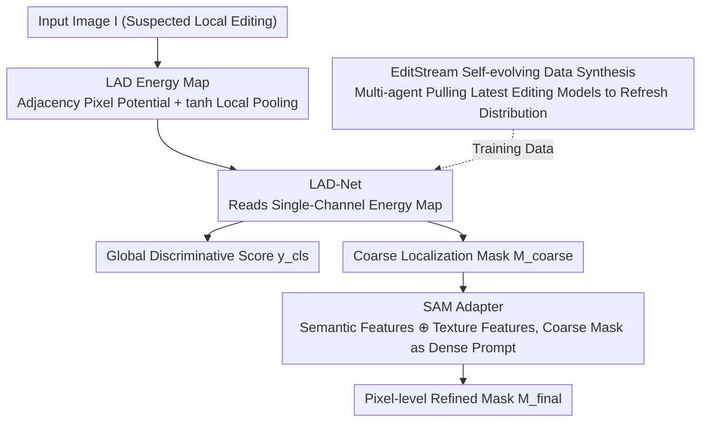

# Order within Chaos: Capturing Intrinsic Energy Anomalies for AI-Manipulated Image Forgery Localization

**Conference**: ICML 2026  
**arXiv**: [2606.02178](https://arxiv.org/abs/2606.02178)  
**Code**: https://github.com/phoenixnir/FLAME  
**Area**: AI Security / Image Forensics / Diffusion Model Forgery Localization  
**Keywords**: AI-IFL, Diffusion Models, Gibbs Energy, SAM Adapter, Self-evolving Data Synthesis

## TL;DR
Starting from the spectral bias of diffusion models, this paper theoretically proves that the local Gibbs energy of diffusion-generated regions is inevitably lower than that of real imaging regions. Accordingly, a LAD (Local Adjacency Discrepancy) energy map is constructed as an intrinsic forensic fingerprint. A lightweight adapter then injects LAD cues into SAM to achieve pixel-level forgery localization. Coupled with the EditStream multi-agent engine that automatically pulls the latest editing models from HuggingFace to continuously refresh training data, the method improves the average IoU from the previous SOTA of ~0.25 to 0.46 across 7 AI editing datasets.

## Background & Motivation
**Background**: In the pre-AIGC era, Image Forgery Localization (IFL) tasks primarily relied on "physical signal consistency"—splicing or copy-pasting would disrupt the ISP pipeline, leaving physical fingerprints like sensor noise residues or JPEG compression artifacts. Methods like Noiseprint relied on these cues to locate tampered areas. However, with the emergence of instructions-based editing models like Stable Diffusion / FLUX / DALL·E 3, the tampered pixels themselves are products of neural rendering. Camera noise is replaced directly by synthesized signals, rendering traditional physical cues almost entirely ineffective.

**Limitations of Prior Work**: Current approaches to diffusion-based forgeries are largely inadequate: (1) Distribution shift detection in vision encoder embeddings (e.g., DINOv2) depends on the generalization capability of the pre-trained model and lacks explicit modeling of intrinsic traces from the diffusion process; (2) MLLMs (FakeShield, SIDA) perform "semantic inconsistency reasoning," but the physical priors of top-tier diffusion models are strong enough to leave almost no semantic contradictions. Moreover, the visual tokenization of MLLMs is naturally coarse-grained, failing to detect subtle pixel-level inconsistencies.

**Key Challenge**: Reliable forensic evidence is neither in the missing sensor noise (replaced by synthetic noise) nor in semantic errors (smoothed by strong physical priors). Where exactly is it hidden?

**Goal**: To find an **architecture-agnostic** statistical fingerprint determined by the diffusion mechanism itself for pixel-level AI-IFL, while simultaneously solving the "time lag" problem where static evaluation benchmarks cannot keep pace with the iteration speed of editing models.

**Key Insight**: From a statistical mechanics perspective, the authors observe that diffusion models essentially optimize a variational lower bound of energy (Ho et al. 2020). Combined with the known **spectral bias** of deep networks (Rahaman et al. 2019) and the Lipschitz smoothness of VAE decoders, diffusion-generated content systematically **suppresses high-frequency local variance**, entering an "artificial low-entropy ordered state." In contrast, real optical imaging is driven by photon shot noise and thermal noise, resulting in an inevitable "high-entropy chaotic state." A measurable statistical energy gap forms between the two.

**Core Idea**: Images are modeled as Gibbs random fields. A local potential function of intensity differences between adjacent pixels is used as a spatial proxy for high-frequency energy to construct LAD energy maps. This converts the energy gap between real and generated regions, as well as energy spikes at tampered boundaries, into spatially localizable features. A SAM adapter then fuses these low-level forensic cues with high-level semantic priors to provide pixel-level masks.

## Method

### Overall Architecture
FLAME (Fine-grained Localization via Adjacency Map Energy) addresses the failure of traditional physical fingerprints after diffusion editing. It first explicitly extracts intrinsic energy anomalies into a map, and then employs a general segmentation model to refine it into a pixel mask. Specifically, given a suspected locally edited RGB image $I$, the LAD operator compresses it into a single-channel energy map $\mathcal{L}$. A lightweight LAD-Net reads this map to provide both a global forgery scalar score $y_{cls}$ and a coarse localization mask $M_{coarse}$. This coarse mask is then fed as a dense prompt into a frozen SAM. An adapter fuses SAM's semantic features with LAD-Net's texture features, after which the SAM decoder outputs the final pixel-level refined mask $M_{final}$. The entire system is supported by the EditStream data engine, which automatically fetches the latest inpainting models from open-source repositories to refresh the training distribution.

### Key Designs

**1. LAD Energy Map: Converting Low-Entropy Diffusion Traces into Content-Agnostic Spatial Fingerprints**

This design targets the following pain point: while the theory that "generated regions have low energy, real regions have high energy, and tampered boundaries exhibit energy spikes" (Theorem 3.3 Energy Gap & Boundary Spike) holds, energy is defined over statistical expectations. A pixel-level computable operator that is robust to image content is required for implementation. The authors model the image as a Gibbs random field $p(x) \propto \exp(-E(x))$ and use the potential function of adjacent pixel intensity differences $V(p,q) = \rho(\|I(p)-I(q)\|_2)$ as a spatial proxy for high-frequency energy. Local aggregation is performed for each pixel $p$ over a $3\times 3$ neighborhood $\mathcal{N}_p$:

$$\mathcal{L}(p) = \frac{1}{|\mathcal{N}_p|} \sum_{q \in \mathcal{N}_p} \tanh\!\left(\|I(p)-I(q)\|_2^2 / \tau^2\right)$$

The $\tanh$ function acts as saturation to flatten large semantic gradients (object edges) while relatively amplifying the "small-scale noise residue" segment controlled by $\tau$. Consequently, optical shot noise in real regions, smoothed artifacts in generated regions (from VAE), and covariance misalignment at boundaries caused by hard latent space splicing $z_{t-1}=m \odot \hat z^{gen}_{t-1}+(1-m)\odot z^{ref}_{t-1}$ are encoded into the same energy map. The backend CNN can learn these heterogeneous signals directly without separate processing.

**2. SAM Adapter: Using Semantic Priors to Snap Coarse Energy Responses to Precise Boundaries**

LAD-Net is a low-level statistical operator with a fundamental flaw: naturally smooth real regions, such as plain backgrounds or white walls, inherently possess low energy and might be misjudged as forged. Distinguishing "naturally low-energy real regions" from "diffusion-processed objects" requires semantic priors. The authors freeze the SAM image encoder to output semantic features $F_{sem}$ and use a lightweight Feature Adapter composed of residual blocks to learn $F_{adapted} = \text{Adapter}(F_{sem} \oplus F_{tex})$ (where $\oplus$ denotes channel concatenation followed by $1\times 1$ convolution, and $F_{tex}$ represents texture features from LAD-Net). This "modulates" general segmentation priors into the forensic domain. Simultaneously, the coarse mask $M_{coarse}$ is fed into the SAM prompt encoder to generate dense positional embeddings $E_{prompt}$. Finally, the SAM mask decoder combines $F_{adapted}$ and $E_{prompt}$ to produce $M_{final}$. SAM is not fine-tuned directly because its features are trained for general segmentation; using an adapter to inject low-level forensic residues is parameter-efficient and avoids catastrophic forgetting of original priors.

**3. EditStream Self-evolving Data Synthesis: Turning "Lagging Benchmarks" into a Moving Target**

This design targets the generation gap between training sets and real-world threats—static benchmarks can never keep up with generators like SD/FLUX/Qwen-Image. EditStream uses Qwen-VL as a semantic planner to analyze scene semantics and generate editing instructions. These instructions are translated into pixel masks and converted into precise editing regions via SAM. Then, a Llama 3-driven Autonomous Model Scouting Agent continuously monitors repositories like HuggingFace. Upon discovering a new inpainting model, it automatically parses its model card, synthesizes calling code, and integrates it into the generation pipeline, continuously injecting new artifact distributions into FLAME. The authors emphasize that generalization does not depend on a one-time dataset expansion, but on constructing a "moving target": ensuring the detector always encounters harder artifacts than the previous version, forcing it to learn architecture-agnostic diffusion commonalities rather than over-fitting fingerprints of a specific generation.

### Loss & Training
The training jointly optimizes pixel-level localization and image-level discrimination: $L = L_{Dice} + \lambda_{focal} L_{focal}^{\alpha,\gamma} + \lambda_{IoU} L_{IoU} + \lambda_{det} L_{det}$. Here, $L_{Dice}+L_{focal}$ ensures accurate boundaries even with severe foreground-background imbalance in small tampered areas. $L_{IoU}$ uses $\ell_1$ regression to supervise mask quality prediction, and $L_{det}$ uses BCE to maintain global discriminative ability. Weights follow SAM conventions: $\lambda_{focal}=20$, $\lambda_{IoU}=\lambda_{det}=1$.

## Key Experimental Results

### Main Results
Coverage includes 7 AI editing datasets (MagicBrush, SID, CoCoGLIDE, AutoSplice, NanoBanana, Qwen-Image, Flux Kontext), compared against 7 SOTA models such as SAFIRE, Mesorch, TruFor, AdaIFL, SIDA, FakeShield, and SparseViT. The Average column represents the mean of the latter 5 datasets to measure OOD generalization.

| Model | IoU(MagicBrush) | IoU(SID) | IoU(Qwen-Image) | IoU(Flux Kontext) | IoU(Avg/OOD) | F1(Avg/OOD) |
|---|---|---|---|---|---|---|
| TruFor | 0.281 | 0.188 | 0.228 | 0.203 | 0.247 | 0.324 |
| SIDA | 0.106 | 0.488 | 0.089 | 0.092 | 0.191 | 0.250 |
| FakeShield | 0.091 | 0.117 | 0.098 | 0.096 | 0.131 | 0.152 |
| **FLAME** | **0.538** | **0.580** | 0.321 | 0.285 | 0.358 | 0.459 |
| **FLAME-F** (EditStream FT) | 0.507 | 0.569 | **0.482** ↑ | **0.446** ↑ | **0.460** ↑ | **0.565** ↑ |

Regarding image-level discrimination: FLAME achieves an ACC of 0.901/0.916 on MagicBrush/SID (vs SIDA's 0.812/0.725) and an average ACC of 0.639 (vs the strongest baseline's 0.580). FLAME-F increases ACC on Qwen-Image from 0.715 to 0.812 and shows positive transfer to unseen Flux/NanoBanana, validating EditStream's cross-architecture generalization and mitigation of forgetting.

### Ablation Study

| Configuration | IoU↑ | F1↑ | Description |
|---|---|---|---|
| **FLAME (Full)** | **0.567** | **0.662** | Trained/Validated on SID+MagicBrush |
| w/o LAD Map (Replace with RGB) | 0.294 | 0.380 | -0.273 IoU, **Most Critical** |
| w/o Adapter | 0.313 | 0.392 | -0.254 IoU |
| w/o SAM (Direct Coarse Mask) | 0.379 | 0.458 | -0.188 IoU, boundaries become blocky |

### Key Findings
- **LAD Map is the lifeline**: Removing it causes IoU to drop significantly (0.567 → 0.294), proving that "explicitly modeling intrinsic diffusion traces" is much more important than "letting the large model learn on its own"—this also indirectly explains why DINOv2/MLLM approaches hit a bottleneck.
- **SAM refinement is indispensable**: Removing the SAM pathway also leads to a large drop, specifically resulting in "blocky predictions." This suggests LAD-Net provides coarse energy responses that must rely on semantic priors for boundary snapping.
- **EditStream's "Moving Target" effect**: FLAME-F, fine-tuned only on Qwen-Image, also improved on unseen Flux Kontext and NanoBanana (IoU +0.16 / +0.18). This indicates it learned diffusion commonalities rather than generator fingerprints, with almost no forgetting on old benchmarks.
- **Robustness**: JPEG compression (Q=75) and Gaussian noise significantly harm LAD (the former quantizes high-frequency coefficients, the latter injects global variance, both disrupting energy gaps). Gaussian blur is less harmful, as regional energy differences and boundary misalignments persist even after texture residues are attenuated.

## Highlights & Insights
- **Deriving forensic cues from diffusion training objectives**: The authors treat "spectral bias + VAE low-pass," properties often criticized for limiting generation quality, as unavoidable forensic fingerprints. This shifts the mindset to turning the opponent's "flaws" into one's own "feature channels," which is more robust than MLLM's "semantic spot-the-difference."
- **Unified encoder for three anomalies**: A single $\tanh$ pooling operator simultaneously encodes "high-entropy real regions," "low-entropy generated regions," and "boundary covariance misalignment," sparing the backend CNN from separate processing.
- **Transferable "Low-level Residue + SAM Adapter" paradigm**: This two-stage structure—extracting a low-level forensic map, feeding it as a prompt to a frozen SAM, and injecting domain features with a lightweight adapter—is directly applicable to any forensic, industrial inspection, or medical edge scenario requiring pixel-level localization where semantic priors of general segmentation models are otherwise too dominant.
- **Continuous Adversarial Data Side**: Engineering the systemic problem of "benchmarks lagging behind models" into a closed loop with an LLM agent that automatically scrapes HuggingFace and synthesizes calling code effectively offloads manual labor to agents. This is a benchmark construction paradigm worth emulating in AI security.

## Limitations & Future Work
- **Assumptive Dependencies**: The Spectral-Energy Inequality relies on the spectral bias of diffusion models and the Lipschitz property of VAEs. If future generators explicitly optimize high-frequency losses or switch to non-smooth decoders (e.g., GAN-based replacements + Pixel-Shuffle post-processing), energy gaps may be neutralized.
- **Moderate Post-processing Robustness**: Significant performance drops under JPEG (Q=75) and Gaussian noise suggest susceptibility if an adversary applies lightweight post-processing. Performance under targeted attacks like adversarial purification was not evaluated.
- **LLM Agent Reliability**: EditStream depends entirely on Llama 3 for model card parsing and code synthesis, involving engineering risks like call failures, abnormal model quality, or licensing issues. Only a conceptual description is provided.
- **Inpainting Bias**: Evaluation focused on local mask-guided editing. Generalization to full-image regeneration (e.g., SDXL full generation) and video forgery has not been explored. Theoretically, in full-image regeneration, the "boundary spike" signal disappears, leaving only the energy gap, which might degrade performance.

## Related Work & Insights
- **vs FakeShield / SIDA (MLLM Faction)**: These rely on semantic/text alignment to find tampering, whereas this work follows a pure statistical energy route. The advantage is avoiding suppression by the "semantic perfection" of top models, allowing sub-pixel localization; the disadvantage is the lack of natural language explanations provided by MLLMs.
- **vs Noiseprint / TruFor (Traditional Noise Residue Faction)**: These rely on physical ISP noise fingerprints. This paper switches to "statistical anomalies of the generation mechanism." The advantage is coverage of major AIGC threats; the disadvantage is that it may not outperform on traditional splicing tasks (no pure splicing benchmark comparison).
- **vs DINOv2 Embedding Faction**: These rely on general encoders to learn distribution shifts. This paper explicitly constructs forensic maps, offering higher interpretability and stability against generator architecture changes. Insight: In any scenario requiring **generalization to unseen generators/tampering, explicit modeling of the physical/statistical biases of the generation mechanism** is more robust than simply "feeding a large model to let it learn."
- **vs SAM Adapter Paradigms in Medical/General Segmentation**: This work transfers the SAM adaptation paradigm to forensic localization, proving SAM's semantic priors are extremely useful for boundary snapping, though low-level residues must be explicitly injected by an external operator (LAD in this case).

## Rating
- Novelty: ⭐⭐⭐⭐⭐ The theoretical framework deriving forensic cues from diffusion spectral bias (Gibbs energy + Energy Gap & Boundary Spike theorems) offers a rare and clear mechanism-driven perspective in AI-IFL.
- Experimental Thoroughness: ⭐⭐⭐⭐ Coverage of 7 datasets, 7 SOTA baselines, three robustness perturbations, and multiple ablation groups for components/operators/kernel sizes. OOD settings are reasonable. One star deducted for lack of evaluation on traditional splicing tasks and adversarial purification.
- Writing Quality: ⭐⭐⭐⭐⭐ Logical progression from motivation to theory, operator, architecture, and data engine. Theory is formalized with Assumptions/Theorems, and engineering parts have a clear pipeline.
- Value: ⭐⭐⭐⭐⭐ AI-IFL is a pressing security issue. This paper not only provides a SOTA solution but also engineers the systemic "benchmark refresh" problem using LLM agents. The theoretical framework and adapter paradigm are highly reusable across tasks.

<!-- RELATED:START -->

## Related Papers

- [\[ICML 2026\] The Latent Color Subspace: Emergent Order in High-Dimensional Chaos](the_latent_color_subspace_emergent_order_in_high-dimensional_chaos.md)
- [\[AAAI 2026\] Creating Blank Canvas Against AI-Enabled Image Forgery](../../AAAI2026/image_generation/creating_blank_canvas_against_ai-enabled_image_forgery.md)
- [\[ICML 2026\] Local Hessian Spectral Filtering for Robust Intrinsic Dimension Estimation](local_hessian_spectral_filtering_for_robust_intrinsic_dimension_estimation.md)
- [\[ICML 2026\] The Coupling Within: Flow Matching via Distilled Normalizing Flows](the_coupling_within_flow_matching_via_distilled_normalizing_flows.md)
- [\[ICML 2026\] Esoteric Language Models: A Family of Any-Order Diffusion LLMs](esoteric_language_models_a_family_of_any-order_diffusion_llms.md)

<!-- RELATED:END -->
