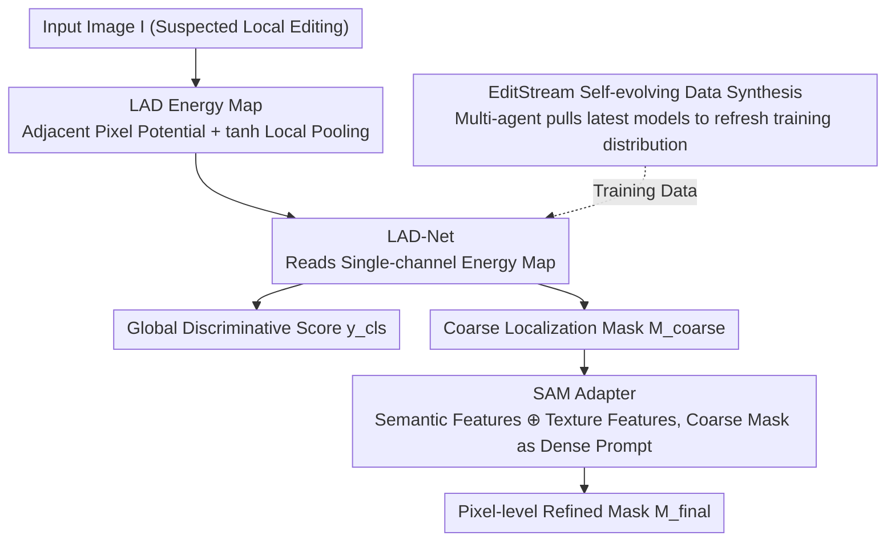

# Order within Chaos: Capturing Intrinsic Energy Anomalies for AI-Manipulated Image Forgery Localization

**Conference**: ICML 2026  
**arXiv**: [2606.02178](https://arxiv.org/abs/2606.02178)  
**Code**: https://github.com/phoenixnir/FLAME  
**Area**: AI Safety / Image Forensics / Diffusion Model Forgery Localization  
**Keywords**: AI-IFL, Diffusion Models, Gibbs Energy, SAM Adapter, Self-evolving Data Synthesis

## TL;DR
Starting from the spectral bias of diffusion models, this paper theoretically proves that the local Gibbs energy of diffusion-generated regions is inevitably lower than that of real imaging regions. Accordingly, a Local Adjacency Discrepancy (LAD) energy map is constructed as an intrinsic forensic fingerprint. A lightweight adapter then injects LAD cues into SAM to achieve pixel-level forgery localization. Accompanied by EditStream, a multi-agent system that automatically pulls the latest editing models from HuggingFace to continuously refresh training data, the average IoU is improved from ~0.25 (Prev. SOTA) to 0.46 across 7 AI editing datasets.

## Background & Motivation
**Background**: In the pre-AIGC era, Image Forgery Localization (IFL) tasks primarily relied on "physical signal consistency"—splicing and copy-pasting disrupt the ISP pipeline, leaving physical fingerprints like sensor noise residuals and JPEG compression traces. Methods such as Noiseprint utilize these cues to locate tampered areas. However, with the emergence of instructive editing models like Stable Diffusion / FLUX / DALL·E 3, the tampered pixels themselves are products of neural rendering, where camera noise is replaced by synthetic signals, rendering traditional physical cues almost entirely ineffective.

**Limitations of Prior Work**: Current approaches to diffusion forgery are largely inadequate: (1) Using visual encoder embedding spaces (e.g., DINOv2) for distribution shift detection relies on the generalization capability of the pre-trained model and lacks explicit modeling of the intrinsic traces of the diffusion process; (2) Using MLLMs (FakeShield, SIDA) for "semantic inconsistency reasoning" fails because top-tier diffusion models possess strong physical priors that leave almost no semantic contradictions, and the visual tokenization of MLLMs is naturally coarse-grained, failing to perceive pixel-level subtle inconsistencies.

**Key Challenge**: Reliable forensic evidence is neither in the missing sensor noise (replaced by synthetic noise) nor in semantic errors (smoothed by strong physical priors). Where exactly is it hidden?

**Goal**: To find a **generator-architecture-independent** statistical fingerprint determined by the diffusion mechanism itself for pixel-level AI-IFL, while simultaneously addressing the "time lag" problem where static benchmarks cannot keep up with the iteration speed of editing models.

**Key Insight**: From a statistical mechanics perspective, the authors observe that diffusion models essentially optimize a variational lower bound of energy (Ho et al. 2020). Combined with the known **spectral bias** of deep networks (Rahaman et al. 2019) and the Lipschitz smoothness of VAE decoders, diffusion-generated content systematically **suppresses high-frequency local variance**, entering an "artificial low-entropy ordered state." In contrast, real optical imaging is driven by photon shot noise and thermal noise, which is inevitably a "high-entropy chaotic state." A measurable statistical energy gap forms between the two.

**Core Idea**: Images are modeled as Gibbs Random Fields. A local potential function of intensity differences between adjacent pixels is used as a spatial proxy for high-frequency energy to construct LAD energy maps. This transforms energy differences between real and generated regions, as well as energy spikes at tampered boundaries, into spatially localizable features. A SAM adapter then fuses these low-level forensic cues with high-level semantic priors to output pixel-level masks.

## Method

### Overall Architecture
FLAME (Fine-grained Localization via Adjacency Map Energy) addresses the failure of traditional physical fingerprints and the difficulty of pixel-level localization after diffusion editing. The approach first explicitly extracts intrinsic energy anomalies into a map and then refines it into a pixel mask using a general segmentation model. Specifically, given a suspect RGB image $I$, the LAD operator compresses it into a single-channel energy map $\mathcal{L}$. A lightweight LAD-Net reads this energy map to produce a global forgery score $y_{cls}$ and a coarse localization mask $M_{coarse}$. Subsequently, this coarse mask is fed as a dense prompt into a frozen SAM. An adapter merges SAM's semantic features with LAD-Net's texture features, after which the SAM decoder outputs the final pixel-level refined mask $M_{final}$. The entire system is enveloped by the EditStream data engine, which automatically pulls the latest inpainting models from open-source repositories to refresh the training distribution.

### Key Designs

**1. LAD Energy Map: Transforming Diffusion's Low-entropy Traces into Content-independent Spatial Fingerprints**

This design targets the pain point that while the theory "generated regions are low-energy, real regions are high-energy, and tampered boundaries exhibit energy spikes" (Theorem 3.3 Energy Gap & Boundary Spike) holds, energy is defined on statistical expectations. A pixel-level computable operator robust to image content is required for implementation. The authors model the image as a Gibbs Random Field $p(x) \propto \exp(-E(x))$ and use the potential function of adjacent pixel intensity differences $V(p,q) = \rho(\|I(p)-I(q)\|_2)$ as the spatial proxy for high-frequency energy, performing local aggregation for each pixel $p$ over a $3\times 3$ neighborhood $\mathcal{N}_p$:

$$\mathcal{L}(p) = \frac{1}{|\mathcal{N}_p|} \sum_{q \in \mathcal{N}_p} \tanh\!\left(\|I(p)-I(q)\|_2^2 / \tau^2\right)$$

Here, $\tanh$ serves a saturation role to flatten large semantic gradients (object edges) while relatively amplifying the "small-scale noise residual" segment controlled by $\tau$. Consequently, optical shot noise in real regions, smooth artifacts in generated regions flattened by VAE, and covariance misalignment at boundaries caused by hard latent space splicing $z_{t-1}=m\odot \hat z^{gen}_{t-1}+(1-m)\odot z^{ref}_{t-1}$ are encoded into the same energy map as three heterogeneous signals, allowing the backend CNN to learn them directly without separate processing.

**2. SAM Adapter: Snapping Coarse Energy Responses to Precise Boundaries using Semantic Priors**

LAD-Net is a low-level statistical operator with a fundamental flaw: real regions that are naturally highly smooth, such as solid color backgrounds or white walls outside a window, inherently have low energy and might be misjudged as forged. To distinguish "inherently low-energy real regions" from "diffused objects," semantic priors must be introduced. The authors freeze the SAM image encoder to output semantic features $F_{sem}$ and use a lightweight Feature Adapter composed of residual blocks to learn $F_{adapted} = \text{Adapter}(F_{sem} \oplus F_{tex})$ (where $\oplus$ denotes channel concatenation followed by a $1\times 1$ convolution, and $F_{tex}$ represents texture features from LAD-Net), "modulating" general segmentation priors into the forensic domain. Simultaneously, the coarse mask $M_{coarse}$ is fed into SAM's prompt encoder to generate dense positional embeddings $E_{prompt}$. Finally, the SAM mask decoder produces $M_{final}$ by combining $F_{adapted}$ and $E_{prompt}$. SAM is not fine-tuned directly because its features are trained for general segmentation; using an adapter to inject low-level forensic residuals is parameter-efficient and avoids catastrophic forgetting of original priors.

**3. EditStream Self-evolving Data Synthesis: Turning "Benchmark Lag" into a Moving Target**

This design focuses on the generation gap between training sets and real-world threats—static benchmarks can never catch up with the iteration speed of generators like SD/FLUX/Qwen-Image. EditStream uses Qwen-VL as a semantic planner to analyze scene semantics and generate editing instructions. These instructions are translated into pixel masks and converted into precise editing regions via SAM. Then, a Llama 3-driven Autonomous Model Scouting Agent continuously monitors repositories like HuggingFace. Once a new inpainting model is discovered, the agent automatically parses its model card, synthesizes invocation code, and integrates it into the generation pipeline, continuously injecting new-generation artifact distributions into FLAME. The authors emphasize that the key to generalization is not a one-time data expansion but the construction of a "moving target": ensuring the detector always encounters artifacts more difficult than the previous version, forcing it to learn architecture-independent diffusion commonalities rather than over-fitting fingerprints of a specific generation.

### Loss & Training
The training jointly optimizes pixel-level localization and image-level discrimination: $L = L_{Dice} + \lambda_{focal} L_{focal}^{\alpha,\gamma} + \lambda_{IoU} L_{IoU} + \lambda_{det} L_{det}$. Here, $L_{Dice}+L_{focal}$ ensures accurate boundaries even when small tampered regions cause severe foreground-background imbalance. $L_{IoU}$ supervises mask quality prediction with $\ell_1$ regression, and $L_{det}$ uses BCE to maintain global discriminative capability. Weights follow SAM conventions: $\lambda_{focal}=20, \lambda_{IoU}=\lambda_{det}=1$.

## Key Experimental Results

### Main Results
Covering 7 AI editing datasets (MagicBrush, SID, CoCoGLIDE, AutoSplice, NanoBanana, Qwen-Image, Flux Kontext), compared with 7 SOTA models including SAFIRE, Mesorch, TruFor, AdaIFL, SIDA, FakeShield, and SparseViT. The Average column represents the mean of the last 5 datasets to measure OOD generalization.

| Model | IoU(MagicBrush) | IoU(SID) | IoU(Qwen-Image) | IoU(Flux Kontext) | IoU(Avg/OOD) | F1(Avg/OOD) |
|---|---|---|---|---|---|---|
| TruFor | 0.281 | 0.188 | 0.228 | 0.203 | 0.247 | 0.324 |
| SIDA | 0.106 | 0.488 | 0.089 | 0.092 | 0.191 | 0.250 |
| FakeShield | 0.091 | 0.117 | 0.098 | 0.096 | 0.131 | 0.152 |
| **FLAME** | **0.538** | **0.580** | 0.321 | 0.285 | 0.358 | 0.459 |
| **FLAME-F** (EditStream FT) | 0.507 | 0.569 | **0.482** ↑ | **0.446** ↑ | **0.460** ↑ | **0.565** ↑ |

Image-level discrimination: FLAME reaches an ACC of 0.901/0.916 on MagicBrush/SID (vs. 0.812/0.725 for SIDA, the previous SOTA), with an average ACC of 0.639 (vs. 0.580 for the strongest baseline). FLAME-F raises the ACC on Qwen-Image from 0.715 to 0.812 and shows positive transfer to unseen Flux/NanoBanana, validating the cross-architecture generalization and forgetting mitigation of EditStream.

### Ablation Study

| Configuration | IoU↑ | F1↑ | Description |
|---|---|---|---|
| **FLAME (Full)** | **0.567** | **0.662** | Trained on SID+MagicBrush / Val set |
| w/o LAD Map (RGB instead) | 0.294 | 0.380 | Drops 0.273 IoU, **Most Critical** |
| w/o Adapter | 0.313 | 0.392 | Drops 0.254 IoU |
| w/o SAM (Direct Coarse Mask) | 0.379 | 0.458 | Drops 0.188 IoU, boundaries become blocky |

### Key Findings
- LAD Map is the lifeline: Removing it cuts IoU in half (0.567 → 0.294), proving that "explicitly modeling intrinsic diffusion traces" is much more important than "letting the large model learn on its own"—this also indirectly explains why DINOv2/MLLM approaches hit a bottleneck.
- SAM refinement is indispensable: Removing the SAM path causes a significant drop, and the result takes a "blocky prediction" form, indicating that LAD-Net provide coarse energy responses that must rely on semantic priors for boundary snapping.
- EditStream's "Moving Target" effect: FLAME-F, fine-tuned only on Qwen-Image, also improved on unseen Flux Kontext and NanoBanana (IoU +0.16 / +0.18), indicating that it learns diffusion commonalities rather than generator fingerprints, with almost no forgetting on old benchmarks.
- Robustness: JPEG compression (Q=75) and Gaussian noise significantly harm LAD (the former quantizes high-frequency coefficients, the latter injects global variance, both directly destroying energy differences), while Gaussian blur is less damaging—as regional energy gaps and boundary misalignments remain even after texture residuals are attenuated.

## Highlights & Insights
- **Inverting forensics from diffusion training objectives**: Properties like "spectral bias + VAE low-pass," which have long been used to criticize generation quality, are treated as unavoidable forensic fingerprints. This approach turns the opponent's "flaws" into one's own "feature channels," which is more solid than the "semantic fault-finding" of MLLMs.
- **Unified encoder for three anomalies**: A single $\tanh$ pooling operator simultaneously encodes "high entropy in real regions," "low entropy in generated regions," and "boundary covariance misalignment," sparing the backend CNN from separate processing.
- **Transferable "Low-level Residual + SAM Adapter" paradigm**: This two-stage structure—extracting a low-level forensic map, feeding it to a frozen SAM via prompts, and injecting domain features with a lightweight adapter—is directly applicable to any scenario requiring pixel-level localization where general segmentation models are overly semantic (e.g., forensics, industrial inspection, medical edge detection).
- **"Continuous Adversarial" perspective on data**: Turning the systemic problem of "benchmarks lagging behind models" into an engineered closed loop with LLM agents (automatic scraping + code synthesis) effectively offloads labor to agents, a paradigm worth emulating for AI safety dataset construction.

## Limitations & Future Work
- Assumption reliance: The Spectral-Energy Inequality depends on the spectral bias of diffusion models and the Lipschitz property of VAE. If future generators explicitly optimize high-frequency loss or switch to non-smooth decoders (e.g., GAN replications + Pixel-Shuffle post-processing), energy gaps might be flattened.
- Moderate post-processing resistance: JPEG (Q=75) and Gaussian noise cause significant performance drops, suggesting susceptibility if opponents actively apply lightweight post-processing in live scenarios. Performance under targeted attacks like adversarial purification was not examined.
- Reliability of EditStream's LLM agents: Complete reliance on Llama 3 for model card parsing and code synthesis entails engineering risks like invocation failures, poor quality of generated models, or license issues, which the authors describe only conceptually.
- Dataset bias toward inpainting: Evaluations primarily focus on local mask-guided editing scenarios and have not yet been extended to full-image regeneration (e.g., SDXL full image generation) or video forgery. Theoretically, the "boundary spike" signal disappears in full-image generation, leaving only energy gaps, which might degrade performance.

## Related Work & Insights
- **vs FakeShield / SIDA (MLLM Faction)**: They rely on semantic/textual alignment to find tampering, while this paper follows a pure statistical energy route. The advantage is not being suppressed by the "semantic perfection" of top diffusion models, allowing sub-pixel localization; the disadvantage is lacking the natural language explanations MLLMs can provide.
- **vs Noiseprint / TruFor (Traditional Noise Residual Faction)**: They rely on physical ISP noise fingerprints, whereas this paper switches to "statistical anomalies of the generation mechanism." The advantage is covering major threat sources in the AIGC era; the disadvantage is that it may not outperform on pure traditional splicing tasks (authors did not compare pure splicing benchmarks).
- **vs DINOv2 Embedding Faction**: They rely on general encoders to learn distribution shifts, while this paper explicitly constructs forensic maps for stronger interpretability and stability against generator architecture changes. Insight: In any scenario requiring generalization to unseen generators/tampering, **explicitly modeling the physical/statistical preferences of the generation mechanism** is more robust than "feeding a large model and letting it learn."
- **vs SAM Adapter Paradigms in Medical/General Segmentation**: This paper migrates the SAM adaptation paradigm from "semantic segmentation" to "forensic localization," proving SAM's semantic priors are extremely useful for boundary snapping, though low-level residuals must be explicitly injected by an additional operator (LAD in this case).

## Rating
- Novelty: ⭐⭐⭐⭐⭐ The theoretical framework inverting forensic cues from diffusion spectral bias (Gibbs energy + Energy Gap & Boundary Spike theorems) is a rare and clear "mechanism-driven" perspective in AI-IFL.
- Experimental Thoroughness: ⭐⭐⭐⭐ Covers 7 datasets, 7 SOTA baselines, three types of robustness perturbations, and multiple ablation groups on components/operators/kernel sizes. OOD settings are reasonable. One star deducted for limited evaluation on traditional splicing tasks and adversarial purification attacks.
- Writing Quality: ⭐⭐⭐⭐⭐ Progresses logically from motivation to theory, operator, architecture, and data engine. Theory is formalized through Assumptions/Theorems, and engineering parts feature a clear pipeline. High readability.
- Value: ⭐⭐⭐⭐⭐ AI-IFL is a pressing safety issue. This paper provides not only a SOTA solution but also an engineered solution for the systemic "benchmark refresh" problem using LLM agents. Both the theoretical framework and the adapter paradigm have cross-task reusability.

<!-- RELATED:START -->

## Related Papers

- [\[AAAI 2026\] Creating Blank Canvas Against AI-Enabled Image Forgery](../../AAAI2026/image_generation/creating_blank_canvas_against_ai-enabled_image_forgery.md)
- [\[ICML 2026\] Esoteric Language Models: A Family of Any-Order Diffusion LLMs](esoteric_language_models_a_family_of_any-order_diffusion_llms.md)
- [\[ICML 2026\] Local Hessian Spectral Filtering for Robust Intrinsic Dimension Estimation](local_hessian_spectral_filtering_for_robust_intrinsic_dimension_estimation.md)
- [\[ICML 2026\] The Coupling Within: Flow Matching via Distilled Normalizing Flows](the_coupling_within_flow_matching_via_distilled_normalizing_flows.md)
- [\[ICML 2026\] OcclusionFormer: Arranging Z-Order for Layout-Grounded Image Generation](occlusionformer_arranging_z-order_for_layout-grounded_image_generation.md)

<!-- RELATED:END -->
