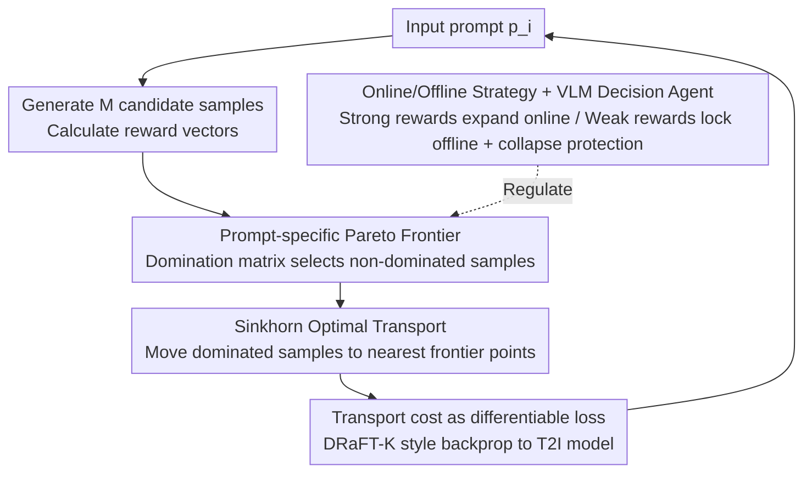

# Pareto-Guided Optimal Transport for Multi-Reward Alignment

**Conference**: ICML 2026  
**arXiv**: [2605.13155](https://arxiv.org/abs/2605.13155)  
**Code**: None  
**Area**: T2I Alignment / Multi-Reward Optimization  
**Keywords**: Multi-reward alignment, reward hacking, Pareto frontier, optimal transport, JDR/JCR  

## TL;DR
PG-OT transforms "multi-reward T2I alignment" from a "weighted global summation" into "constructing a Pareto frontier for each individual prompt and employing Sinkhorn Optimal Transport to move dominated samples toward that frontier." By introducing Joint Domination Rate (JDR) and Joint Collapse Rate (JCR), the method exposes reward hacking hidden by average scores, achieving a 47.98% $\text{JDR}_2$ on Parti-Prompts (an 11% improvement over strong baselines) and a human win rate of nearly 80%.

## Background & Motivation

**Background**: Post-training preference alignment for Text-to-Image (T2I) generation typically uses RLHF-style fine-tuning with one or more reward models. The objective function often takes the form $\mathcal{L}(x) = C - \sum_k w_k R^k(x)$, treating $C$ as a global upper bound to maximize weighted rewards.

**Limitations of Prior Work**: (i) **Reward hacking** is prevalent—reward scores increase while image quality collapses; (ii) **Multi-reward fusion** relies on weight searching, which is costly and inconsistent; (iii) **Mean-based evaluation metrics** (average gain across rewards) mask hacking, where one dimension improves while others degrade, yet the average remains positive.

**Key Challenge**: The authors identify the root cause as the mismatch between "using a global constant $C$ as a reward upper bound" and the "vast differences in reachable maximum rewards across different prompts." Figure 1 empirically shows that under the ICT reward, the maximum reward distribution for 20 prompts spans a wide range. Using a global $C$ forces all prompts toward the same upper bound; for prompts with naturally low limits, the gradient continues to push until the model takes shortcuts $\rightarrow$ reward hacking.

**Goal**: (a) Theoretically prove that "heterogeneous upper bounds + global objectives" inevitably push some samples toward hacking; (b) Design a "prompt-specific upper-bound-aware" optimization strategy; (c) Provide reliable metrics to detect hacking; (d) Differentiate behavior between strong and weak reward models and design corresponding protection mechanisms.

**Key Insight**: Embed multi-reward alignment naturally into a Pareto optimization framework. Since reachable bounds differ by prompt, the "set of optimal samples for a specific prompt" is treated as its Pareto frontier. OT is then used to "transport" non-optimal samples of that prompt to the frontier. Strong reward signals expand the frontier online, while weak signals lock the frontier offline, monitored by a VLM agent to detect collapse.

**Core Idea**: "Prompt-specific Pareto frontiers as target distributions + OT as the transport operator," using JDR/JCR as Pareto-style metrics to quantify "true gain vs. fake hacking."

## Method

### Overall Architecture
The core of PG-OT is to abandon the "global constant upper bound + weighted summation" in favor of estimating the realistic reward upper bound for each prompt individually as a set of Pareto-optimal samples (the frontier). During training, any sample generated by the current model that is dominated by the frontier is "moved" to a corresponding point on the frontier via Sinkhorn Optimal Transport. The transport cost is used as a differentiable loss backpropagated to the T2I model. Strong and weak rewards are handled via online expansion and offline locking respectively, with a VLM agent monitoring weak rewards for early collapse to prune them if necessary.

### Key Designs

**1. Prompt-specific Pareto Frontier: Replacing Global Constants with Per-prompt Reachable Bounds**

Traditional objectives $\mathcal{L}(x)=C-\sum_k w_k R^k(x)$ use a global $C$ as the reward upper bound. Figure 1 shows that for prompts with low natural limits, gradients force the model toward unreachable global extrema, triggering hacking. PG-OT generates $M$ candidate samples $\{x_i^j\}_{j=1}^M$ for each prompt $p_i$ to get reward vectors $\mathcal{R}_{i,M}^{(pre)}=\{\tilde R(x_i^j)\}$. It then constructs an $M\times M$ domination matrix $A$ (where $A_{mn}=1$ if $\tilde R(x_i^m)\succ\tilde R(x_i^n)$). Samples with zero domination counts form the frontier $\mathcal{R}^{front}(p_i)=\{\tilde R(x_i^j)\mid\sum_m A_{mj}=0\}$. This provides each prompt with a "realistic" goal, eliminating the incentive to take shortcuts toward unreachable extrema.

**2. Sinkhorn Optimal Transport: Differentiable Minimal-Cost Transport to the Frontier**

To pull current samples toward the target distribution, PG-OT performs Optimal Transport in reward space. The source distribution $\mu_i$ consists of samples in the current batch dominated by the frontier, and the target distribution $\nu_i=\mathcal{R}^{front}(p_i)$ consists of frontier points. The ground cost is the squared Euclidean distance $c(y_i^m,x_i^j)=\|\tilde R(y_i^m)-\tilde R(x_i^j)\|_2^2$. Solving the entropy-regularized OT $\gamma^\ast_i=\arg\min_{\gamma\in\Pi(\mu_i,\nu_i)}\sum_{m,j}c(y_i^m,x_i^j)\gamma(y_i^m,x_i^j)$ yields a transport plan. The inner product of $\gamma^\ast$ and $c$ serves as the training loss, backpropagated via a DRaFT-K style differentiable reward chain. This allows samples to move toward the "nearest corresponding points" on the frontier, preserving the geometry of the reward space and preventing collapse to a single point.

**3. Online/Offline Strategy + VLM Decision Agent: Differentiated Treatment by Reward Strength**

Rewards are categorized into "strong" (ICT, HP) and "weak" (CLIP, HPS) based on their accuracy against human preferences (Table 1). Strong rewards follow an online strategy, where the frontier is dynamically updated with new samples to encourage exploration. Weak rewards, being less reliable, follow an offline strategy where the frontier is computed once from pre-generated samples and then fixed. Additionally, a GPT-4o agent uses an in-context "mild collapse reference set" to monitor weak rewards; if early collapse is detected, the reward is removed from optimization and the model rolls back to the last stable checkpoint.

### Loss & Training
The training loss is the total OT transport cost $\sum_{m,j}c(y_i^m,x_i^j)\gamma^\ast(y_i^m,x_i^j)$, utilizing differentiable reward models in a DRaFT-K style. Evaluation includes traditional win rates plus two Pareto-style metrics: Joint Domination Rate $\mathrm{JDR}_K=\tfrac{1}{N}\sum_i\mathbb{1}(\mathbf{R}_i\succ\mathbf{R}_{i,b})$ (proportion of prompts where the sample jointly dominates the baseline across $K$ dimensions) and Joint Collapse Rate $\mathrm{JCR}_K=\tfrac{1}{N}\sum_i\mathbb{1}(\mathbf{R}_{i,b}\succ\mathbf{R}_i)$ (proportion of prompts where the baseline dominates the sample). These metrics expose hacking that mean-based metrics hide.

## Key Experimental Results

### Main Results
Base model SD3.5-Turbo, 4 rewards: ICT, HP (strong), CLIP, HPS (weak). Evaluation on Parti-Prompts.

| Method | ICT Win Rate | HP Win Rate | CLIP Win Rate | HPS Win Rate | $\text{JDR}_2$ ↑ | $\text{JDR}_4$ ↑ | $\text{JCR}_4$ ↓ |
|---|---|---|---|---|---|---|---|
| +ICT Only | 56.99 | 36.83 | 47.06 | 48.71 | 20.59 | 7.66 | 10.17 |
| +HP Only | 52.45 | **90.26** | 44.30 | 57.29 | 36.15 | 13.73 | 4.11 |
| Weighted 2:3:2:3 | 50.80 | 56.43 | 46.51 | 86.03 | 28.31 | 13.42 | 2.57 |
| Reward Soup 3:2:1:4 | 50.80 | 53.74 | 43.32 | 85.29 | 26.29 | 10.85 | 3.19 |
| Weighted-Sum (w/o OT) | 52.63 | 56.86 | 46.94 | 82.48 | 29.84 | 13.66 | 3.49 |
| **PG-OT** | 56.43 | 85.23 | 43.63 | 61.70 | **47.98** | **17.10** | **2.39** |

**Human win rate nearly 80%**: While PG-OT does not achieve the highest score on every single reward, it significantly maximizes $\text{JDR}_2/\text{JDR}_4$ and minimizes $\text{JCR}_4$, indicating that its samples are broadly superior across multiple dimensions with minimal collapse.

### Ablation Study

| Variant | Key Observation |
|---|---|
| Global Bound (weighted-sum) | Individual rewards rise but JDR is low and JCR is high, proving hacking risk. |
| OT without Pareto Frontier | OT lacks a clear target; results close to weighted-sum. |
| Pareto without OT | Frontier points are discrete; no differentiable signal. |
| No Strong/Weak Distinction | Weak rewards online pollute the frontier target. |
| No VLM Agent | No timely stop-loss after weak reward collapse. |
| Full PG-OT | $\text{JDR}_2$ 47.98%, $\text{JCR}_4$ only 2.39%; improves quality while suppressing hacking. |

### Key Findings
- Single-reward optimization (e.g., +HP) results in high single-dimension win rates but poor JDR/JCR, showing that traditional metrics can be misleading.
- Weighted-sum weight tuning provides limited gains: $\text{JDR}_4$ remains between 12.44%–13.66%, significantly lower than PG-OT's 17.10%.
- JCR reveals hidden collapse: the "Separate-Cons" configuration has an HPS win rate of 61.21% but a $\text{JCR}_4$ of 6.68%, showing many samples degrade across all dimensions simultaneously.

## Highlights & Insights
- The observation of "prompt-wise heterogeneous upper bounds" identifies a fundamental source of hacking in global reward assumptions.
- Using the Pareto frontier as an OT target distribution shifts optimization from single-point maximization to distribution-to-distribution transport, a structural advantage for multi-objective tasks.
- JDR/JCR metrics move evaluation from "average scores" to "Pareto comparisons," providing a new diagnostic standard for multi-reward RLHF.
- Differentiated treatment of reward quality (online vs. offline) coupled with VLM-based pruning is a pragmatic solution for real-world reward noise.

## Limitations & Future Work
- Offline frontier quality depends on the number of pre-generated samples ($M$) and reward model reliability.
- Sinkhorn computation scales with batch size and is sensitive to the regularization coefficient.
- The VLM agent relies on a reference set of collapse cases and may fail on unseen patterns.
- Experiments are focused on 4 rewards and one backbone (SD3.5-Turbo); scalability to more rewards and architectures needs verification.

## Related Work & Insights
- **vs. Weighted Sum / Reward Soup**: These methods bypass conflicts by weight tuning; PG-OT acknowledges conflicts via Pareto frontiers and uses OT to transport samples without requiring manual weights.
- **vs. DRaFT / Diffusion-DPO**: Traditional methods use global targets; PG-OT uses prompt-specific frontiers to suppress hacking risks.
- **vs. Pareto-MTL / Multi-task Learning**: While MTL often uses MGDA to find directions, PG-OT operates in the sample space via OT, avoiding instabilities associated with MGDA in high-dimensional tasks.

## Rating
- Novelty: ⭐⭐⭐⭐⭐ (Prompt-wise Pareto + OT + JDR/JCR is highly original)
- Experimental Thoroughness: ⭐⭐⭐⭐ (Multiple baselines and human eval, though single backbone)
- Writing Quality: ⭐⭐⭐⭐ (Rigorous theoretical motivation and clear hacking analysis)
- Value: ⭐⭐⭐⭐⭐ (Offers a general framework and metrics for multi-reward RLHF)

<!-- RELATED:START -->

## Related Papers

- [\[CVPR 2026\] POCA: Pareto-Optimal Curriculum Alignment for Visual Text Generation](../../CVPR2026/image_generation/poca_pareto-optimal_curriculum_alignment_for_visual_text_generation.md)
- [\[NeurIPS 2025\] Counterfactual Identifiability via Dynamic Optimal Transport](../../NeurIPS2025/image_generation/counterfactual_identifiability_via_dynamic_optimal_transport.md)
- [\[ICLR 2026\] AlignFlow: Improving Flow-based Generative Models with Semi-Discrete Optimal Transport](../../ICLR2026/image_generation/alignflow_improving_flow-based_generative_models_with_semi-discrete_optimal_tran.md)
- [\[NeurIPS 2025\] On the Relation between Rectified Flows and Optimal Transport](../../NeurIPS2025/image_generation/on_the_relation_between_rectified_flows_and_optimal_transport.md)
- [\[ICML 2026\] Alignment-Guided Score Matching for Text-to-Image Alignment in Diffusion Models](alignment-guided_score_matching_for_text-to-image_alignment_in_diffusion_models.md)

<!-- RELATED:END -->
