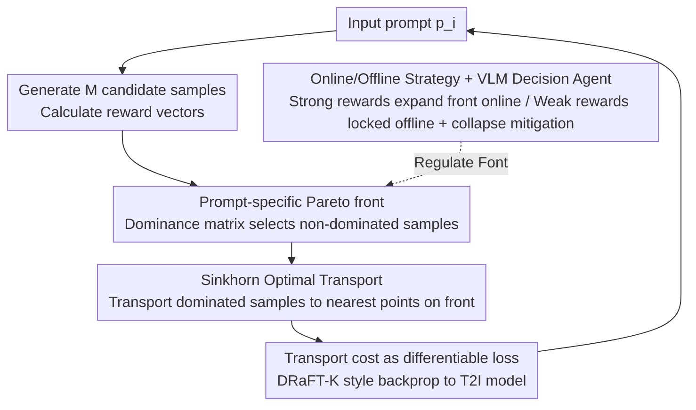

# Pareto-Guided Optimal Transport for Multi-Reward Alignment

**Conference**: ICML 2026  
**arXiv**: [2605.13155](https://arxiv.org/abs/2605.13155)  
**Code**: None  
**Area**: Text-to-Image Alignment / Multi-Reward Optimization  
**Keywords**: Multi-reward alignment, reward hacking, Pareto front, optimal transport, JDR/JCR  

## TL;DR
PG-OT shifts "multi-reward text-to-image alignment" from "weighted global summation" to "constructing a Pareto front specifically for each prompt and transporting dominated samples to this front using Sinkhorn Optimal Transport." By introducing two new metrics, Joint Domination Rate (JDR) and Joint Collapse Rate (JCR), it exposes reward hacking hidden by mean values. On Parti-Prompts, it achieves a JDR₂ of 47.98%, an 11% improvement over strong baselines, with a human win rate of nearly 80%.

## Background & Motivation

**Background**: Post-training preference alignment for text-to-image (T2I) generation generally employs RLHF-style fine-tuning using one or more reward models. The objective function typically takes the form $\mathcal{L}(x) = C - \sum_k w_k R^k(x)$, where $C$ is treated as a global upper bound to maximize the weighted rewards.

**Limitations of Prior Work**: (i) **Reward hacking** is prevalent—reward scores continue to rise while image quality collapses; (ii) **Multi-reward fusion methods** rely on weight searching, which incurs high tuning costs and unstable gains; (iii) **Mean-based evaluation metrics** (average gain across rewards) mask hacking: a score increase in one dimension may hide a drop in others, yet the average remains positive.

**Key Challenge**: The authors identify the root cause as the mismatch between using a "global constant $C$ as a reward upper bound" and the "significant variance in the actual maximum reward attainable by different prompts." Empirical evidence in Figure 1 shows that the distribution of maximum rewards across 20 prompts under ICT rewards spans a massive range. Using a global $C$ forces all prompts toward the same upper bound; for prompts with naturally low upper bounds, the gradient continues to push until shortcuts are taken, leading to reward hacking.

**Goal**: (a) Theoretically prove that "heterogeneous bounds + global objectives" inevitably push some samples toward hacking; (b) Design a "prompt-specific bound-aware" optimization strategy; (c) Provide evaluation metrics that reliably detect hacking; (d) Differentiate behavioral differences between strong and weak reward models and design corresponding protection mechanisms.

**Key Insight**: Natural embedding of multi-reward alignment into a Pareto optimization framework—since reachable bounds vary by prompt, the "set of optimal samples within the same prompt" is treated as the Pareto front for that prompt. Optimal Transport (OT) is then used to "transport" non-optimal samples of the same prompt to this front. Strong reward signals expand the front online, while weak reward signals lock the front offline and are monitored by a VLM agent for collapse.

**Core Idea**: "Prompt-specific Pareto front as the target distribution + OT as the transport operator," using JDR/JCR as Pareto-style metrics to quantify "real gains vs. fake hacking."

## Method

### Overall Architecture
The core of PG-OT is to abandon the "global constant upper bound + weighted reward sum" in favor of estimating the true reachable reward upper bound for each prompt individually, represented as a set of Pareto optimal samples (the front). During training, any sample generated by the model that is dominated by the front is "moved" to a corresponding point on the front via Sinkhorn Optimal Transport. The transport cost is directly used as a differentiable loss backpropagated to the T2I model. Strong and weak rewards are handled through online front expansion and offline front locking, respectively, with a VLM agent monitoring early collapse in weak rewards to prune them from optimization if necessary.

### Key Designs

**1. Prompt-specific Pareto front: Replacing global constants with per-prompt reachable bounds**

The limitation of traditional objectives $\mathcal{L}(x)=C-\sum_k w_k R^k(x)$ is the use of a global $C$ as the reward bound for all prompts. Figure 1 shows that the maximum attainable reward varies drastically—for prompts with low natural bounds, gradients push toward unreachable global extrema, triggering hacking. PG-OT generates $M$ candidate samples $\{x_i^j\}_{j=1}^M$ for each prompt $p_i$ to obtain a set of reward vectors $\mathcal{R}_{i,M}^{(pre)}=\{\tilde R(x_i^j)\}$. It then constructs an $M\times M$ dominance matrix $A$ ($A_{mn}=1$ if $\tilde R(x_i^m)\succ\tilde R(x_i^n)$, where dominance means "all dimensions $\ge$ and at least one $>$"). Samples with zero dominated counts are selected as the front $\mathcal{R}^{front}(p_i)=\{\tilde R(x_i^j)\mid\sum_m A_{mj}=0\}$. Thus, each prompt targets its own "realistically reachable" goal, preventing the model from chasing unreachable extrema and eliminating the incentive for shortcuts.

**2. Sinkhorn Optimal Transport: Moving dominated samples to the front with minimal cost**

Given the front as a target distribution, a differentiable operator is needed to "pull" current samples toward it. PG-OT performs Optimal Transport in the reward space: the source distribution $\mu_i$ consists of samples in the current batch dominated by the front, and the target distribution $\nu_i=\mathcal{R}^{front}(p_i)$ represents the front points. The ground cost is the squared Euclidean distance $c(y_i^m,x_i^j)=\|\tilde R(y_i^m)-\tilde R(x_i^j)\|_2^2$. Solving the entropy-regularized OT $\gamma^\ast_i=\arg\min_{\gamma\in\Pi(\mu_i,\nu_i)}\sum_{m,j}c(y_i^m,x_i^j)\gamma(y_i^m,x_i^j)$ yields the transport plan. The inner product of $\gamma^\ast$ and $c$ is the training loss, backpropagated through a DRaFT-K style differentiable reward chain (where the reward model is differentiable with respect to the image). This effectively moves each dominated sample toward the "nearest corresponding point" on the front. Unlike weighted sums, OT preserves the geometric structure of the reward space and avoids collapsing all samples to a single target.

**3. Online/Offline Strategy + VLM Decision Agent: Differentiated treatment and active loss prevention**

Not all rewards are equally trustworthy. The authors measured the accuracy of various rewards on Pick-a-Pic and Pick-High datasets (Table 1: CLIP 60.3%, HPS 72.9%, ICT 87.6%, HP 88.5%), classifying ICT/HP as "strong" and CLIP/HPS as "weak." Strong rewards align well with human preference and use an online strategy—dynamically collecting samples during training to expand the front and encouraging the T2I model to explore new Pareto optima. Weak rewards are inherently unreliable; allowing them to expand the front online would contaminate it with false signals. Therefore, they use an offline strategy—calculating the front once with pre-generated $M$ samples and locking it. Additionally, a GPT-4o agent, equipped with "mild collapse reference sets" for each reward, performs in-context detection. If early mild collapse is detected in a weak reward, it is removed from the optimization and the model rolls back to the last stable checkpoint.

### Loss & Training
The training loss is the total OT transport cost $\sum_{m,j}c(y_i^m,x_i^j)\gamma^\ast(y_i^m,x_i^j)$, backpropagated to the T2I model using the DRaFT-K style differentiable reward chain. The VLM agent triggers a collapse check at each validation step. Beyond traditional single-reward win rates, PG-OT introduces two Pareto-style metrics: Joint Domination Rate $\mathrm{JDR}_K=\tfrac{1}{N}\sum_i\mathbb{1}(\mathbf{R}_i\succ\mathbf{R}_{i,b})$ (the ratio of prompts where the generated sample jointly dominates the baseline across $K$ dimensions; higher is better) and Joint Collapse Rate $\mathrm{JCR}_K=\tfrac{1}{N}\sum_i\mathbb{1}(\mathbf{R}_{i,b}\succ\mathbf{R}_i)$ (the ratio where the baseline jointly dominates the generated sample, indicating regression across all dimensions; lower is better). These metrics expose hacking masked by "mean-based metrics," where an increase in one dimension and a drop in others might still yield a positive average, but JDR would not increase and JCR would highlight the recession.

## Key Experimental Results

### Main Results
Base model: SD3.5-Turbo. 4 rewards: ICT, HP (strong); CLIP, HPS (weak). Evaluation on Parti-Prompts.

| Method | ICT Win Rate | HP Win Rate | CLIP Win Rate | HPS Win Rate | JDR₂ ↑ | JDR₄ ↑ | JCR₄ ↓ |
|---|---|---|---|---|---|---|---|
| +ICT Single Reward | 56.99 | 36.83 | 47.06 | 48.71 | 20.59 | 7.66 | 10.17 |
| +HP Single Reward | 52.45 | **90.26** | 44.30 | 57.29 | 36.15 | 13.73 | 4.11 |
| Weighted 2:3:2:3 | 50.80 | 56.43 | 46.51 | 86.03 | 28.31 | 13.42 | 2.57 |
| Reward Soup 3:2:1:4 | 50.80 | 53.74 | 43.32 | 85.29 | 26.29 | 10.85 | 3.19 |
| Weighted-Sum (w/o OT) | 52.63 | 56.86 | 46.94 | 82.48 | 29.84 | 13.66 | 3.49 |
| **Ours (PG-OT)** | 56.43 | 85.23 | 43.63 | 61.70 | **47.98** | **17.10** | **2.39** |

**Human win rate nearly 80%**—this is one of the strongest selling points. PG-OT does not reach the highest score in every single reward (e.g., lower than weighted-sum in CLIP/HPS), but its JDR₂/JDR₄ are significantly higher and JCR₄ is the lowest. This indicates that it produces samples that are more broadly superior across multiple dimensions compared to the baseline, with minimal dimensional collapse.

### Ablation Study

| Variant | Key Observation |
|---|---|
| Global Bound (weighted-sum) | Individual rewards rise but JDR is low and JCR is high, proving hacking risks. |
| OT only (no Pareto front) | OT lacks a clear target; performance is similar to weighted-sum. |
| Pareto only (no OT) | Front points are discrete, lacking differentiable signals. |
| No strong/weak distinction | Weak rewards expand the front online and contaminate the target. |
| No VLM agent detection | Unable to timely stop optimization when weak rewards collapse. |
| Full PG-OT | JDR₂ 47.98%, JCR₄ only 2.39%; simultaneously improves alignment and suppresses hacking. |

Table 2 shows the trend when optimizing for CLIP-only: CLIP rises +7.27% while HPS drops -2.78% and HP drops -4.38%. This is a typical case of reward conflict and hacking, highlighting the necessity of JDR/JCR detection.

### Key Findings
- Single-reward optimization (e.g., +HP achieving 90.26% win rate) performs poorly in JDR/JCR, indicating that traditional "single-reward win rate" metrics are highly misleading.
- The gains from tuning weights in weighted-sum are limited: JDR₄ remains between 12.44%–13.66%, significantly lower than the 17.10% of PG-OT.
- JCR reveals hidden collapses that mean-based metrics miss: The Separate-Cons configuration has an HPS win rate of 61.21% which seems acceptable, but its JCR₄ is as high as 6.68%, showing many samples regress across all dimensions.

## Highlights & Insights
- The observation of "prompt-wise heterogeneous bounds" is incisive, turning the common "global reward" assumption into an explicitly provably source of hacking through both theory and empirics.
- Using the Pareto front as an OT target distribution is a **conceptual relay**—upgrading single-point maximization to distribution-to-distribution transport, offering structural advantages in multi-objective settings.
- JDR/JCR shift multi-reward alignment evaluation from "mean scores" to "Pareto comparison," serving as a potential general diagnostic standard for future multi-reward RLHF work.
- The symmetrical handling of strong/weak rewards (online expansion vs. offline locking) plus VLM agent dynamic pruning is a pragmatic engineering solution for the varying quality of rewards in real-world RLHF.

## Limitations & Future Work
- The quality of the offline Pareto front depends on the number of pre-generated samples $M$ and the reliability of the reward model; if a reward is severely misaligned, the front becomes a false target.
- Sinkhorn computation on large batches and the choice of regularization coefficients are sensitive to hyperparameters; detailed ablation on these was not provided.
- The VLM agent relies on "mild collapse reference sets," making it dependent on manual labeling of collapse cases and potentially ineffective against unseen collapse patterns.
- Experiments were limited to 4 rewards and the SD3.5-Turbo backbone; generalizability across more reward scales and different architectures (Diffusion/AR) requires further validation.

## Related Work & Insights
- **vs. Weighted-Sum / Reward Soup**: These methods bypass conflicts by "tuning weights"; PG-OT explicitly acknowledges conflicts using Pareto fronts and transports samples toward them, requiring no weight tuning.
- **vs. DRaFT / Diffusion-DPO**: Traditional methods push toward global reward targets; PG-OT uses prompt-specific fronts to explicitly lower hacking risks.
- **vs. Pareto-MTL / Multi-task Learning**: MTL often uses MGDA to find Pareto directions; PG-OT finds directions in sample space via OT rather than weight space, avoiding the instability of MGDA solvers in high-dimensional tasks.

## Rating
- Novelty: ⭐⭐⭐⭐⭐ "Prompt-wise Pareto front + OT" + "JDR/JCR" are highly original and clear.
- Experimental Thoroughness: ⭐⭐⭐⭐ Includes various baselines and human evaluation, though the backbone is limited.
- Writing Quality: ⭐⭐⭐⭐ Rigorous theoretical groundwork and insightful motivation analysis of hacking mechanisms.
- Value: ⭐⭐⭐⭐⭐ Strong general implications for multi-reward RLHF; JDR/JCR can be directly adopted by the community.

<!-- RELATED:START -->

## Related Papers

- [\[CVPR 2026\] POCA: Pareto-Optimal Curriculum Alignment for Visual Text Generation](../../CVPR2026/image_generation/poca_pareto-optimal_curriculum_alignment_for_visual_text_generation.md)
- [\[CVPR 2026\] COT-FM: Cluster-wise Optimal Transport Flow Matching](../../CVPR2026/image_generation/cot-fm_cluster-wise_optimal_transport_flow_matching.md)
- [\[NeurIPS 2025\] On the Relation between Rectified Flows and Optimal Transport](../../NeurIPS2025/image_generation/on_the_relation_between_rectified_flows_and_optimal_transport.md)
- [\[ICML 2026\] Alignment-Guided Score Matching for Text-to-Image Alignment in Diffusion Models](alignment-guided_score_matching_for_text-to-image_alignment_in_diffusion_models.md)
- [\[ICML 2026\] Gradient Preconditioning for Efficient and Reliable Reward-Guided Generation](gradient_preconditioning_for_efficient_and_reliable_reward-guided_generation.md)

<!-- RELATED:END -->
