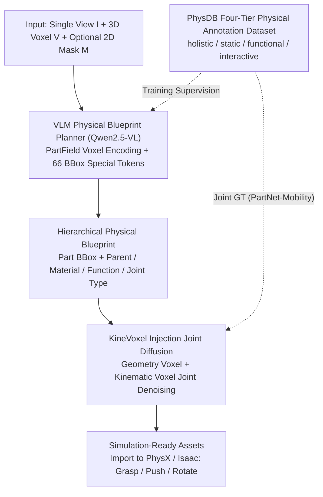

# PhysForge: Generating Physics-Grounded 3D Assets for Interactive Virtual World

**Conference**: ICML 2026  
**arXiv**: [2605.05163](https://arxiv.org/abs/2605.05163)  
**Code**: [hku-mmlab.github.io/PhysForge](https://hku-mmlab.github.io/PhysForge/)  
**Area**: 3D Vision / Generative Models / Embodied AI  
**Keywords**: Physics-aware 3D Generation, VLM Planning, KineVoxel Injection, Hierarchical Physical Blueprint, Interactive Assets

## TL;DR
Interactive 3D object creation is reframed as a two-stage "physical planning followed by physical generation" problem. A VLM acts as a physical architect to generate a "Hierarchical Physical Blueprint" containing hierarchy, materials, and kinematic constraints. Subsequently, a diffusion model utilizes KineVoxel Injection to jointly denoise articulation parameters and geometric voxels. Combined with the PhysDB dataset—comprising 150k assets with four-tier annotations—this approach achieves the first generation of 3D assets from a single view that are directly graspable, pushable, and articulatable within physics engines.

## Background & Motivation

**Background**: 3D generation has achieved high-fidelity static geometry (TRELLIS, CLAY, 3DShape2VecSet) and evolved toward part-aware generation (OmniPart, PartPacker) for decomposable objects. Initial explorations in the physical domain include EmbodiedGen, which composes scenes with off-the-shelf modules, and PhysX-3D, which trains a Physical VAE on PartNet. Articulated object generation has followed distinct paths: "digital twin reconstruction" and "procedural generation" (e.g., CAGE, SINGAPO).

**Limitations of Prior Work**: Current 3D generation systems focus almost exclusively on "static geometry + texture," resulting in "empty shell" assets. These assets lack graspable parts or functional hinges, making them unsuitable for deployment in embodied AI simulators or game engines. Even existing part-aware methods (OmniPart, PartPacker) decompose objects based on visual or geometric boundaries, neglecting "function" and "physics" as signals. Meanwhile, procedural generation for articulated objects relies on predefined connection graphs or code templates, leading to poor generalization and low precision.

**Key Challenge**: (1) The "interactivity" of an object stems from functional logic and hierarchical physics (e.g., the "press" function of a button, the hinge hierarchy of a cabinet door), whereas current part definitions are purely visual. (2) True simulation-ready assets require complete geometry, material, and kinematic information; however, while diffusion models excel at geometry and VLMs excel at world knowledge, no method effectively unifies them. (3) A critical bottleneck is the lack of large-scale datasets with fine-grained physical annotations.

**Goal**: To construct an end-to-end pipeline from single-view input to simulation-ready 3D assets, ensuring generated objects can be directly manipulated in simulators like PhysX or Isaac, while establishing a supporting physical annotation dataset.

**Key Insight**: This work adopts the successful "plan-then-generate" paradigm from 2D generation for 3D tasks. Recognizing that VLMs possess world knowledge for planning while diffusion models are proficient in precise synthesis, the authors task a VLM with outputting a "physical blueprint" first, which the diffusion model then follows. Furthermore, articulation parameters (origin, axis, limit) are encoded into a voxel format and jointly denoised with geometric voxels.

**Core Idea**: Decouple "physical planning (VLM)" from "physical realization (Diffusion + KVI)" and provide supervision via the four-tier annotations (holistic/static/functional/interactive) of the PhysDB dataset.

## Method

### Overall Architecture
PhysForge operates in two stages. **Stage 1: VLM-based Planning**—Inputting a single view $I$, its 3D voxel representation $V$ (produced by the first stage of TRELLIS), and an optional 2D mask $M$. A fine-tuned Qwen2.5-VL autoregressively generates a Hierarchical Physical Blueprint, including attributes such as bounding boxes (bboxes), parent nodes, joint types, materials, functions, and state machines for each part. **Stage 2: Diffusion-based Generation**—Geometry voxels and textures are generated based on the blueprint. KineVoxel Injection (KVI) encodes articulation parameters into a specialized kinematic voxel, which is jointly denoised with geometric voxels in a single diffusion process to ensure synchronization. Final simulation-ready assets can be imported into physics engines for tasks like grasping or rotating knobs. The PhysDB dataset (150k assets, human-verified) provides training data, with articulation ground truth supplemented by PartNet-Mobility and Infinite-Mobility.

### Key Designs

**1. PhysDB Four-Tier Physical Annotation Dataset: Full-Stack Supervision for Plan-then-Generate**

To teach a VLM to "plan physics," data must define what constitutes physical attributes. The authors curated 150k assets with meaningful part structures from Objaverse, covering seven categories (household, industrial, etc.). Using MLLM initial generation followed by manual verification, they applied a four-tier annotation system: **Holistic Tier** (object-level) records real-world scale, category, and usage context; **Static Properties Tier** (part-level) records semantic labels, physical materials (metal/wood/glass), and mass; **Functional Tier** records internal functions (e.g., to control) and state machines (e.g., [pressed, released]); **Interactive Tier** records atomic affordances (pushable/rotatable), joint types, and parameters (axis origin, direction, limits). While discrete labels come from PhysDB, precise numerical articulation values are sourced from PartNet-Mobility to maintain accuracy.

**2. VLM as Physical Blueprint Planner: Translating World Knowledge into Hierarchical Blueprints**

Stage 1 converts LVLM world knowledge into structured part hierarchies and physical properties. Using Qwen2.5-VL, the model processes image $I$, voxel $V$, and mask $M$. Voxels are encoded via PartField to capture part-level features, then downsampled into a 512-dimensional embedding using position-aware 3D convolutions. To enable the autoregressive model to output 3D bboxes, 66 special tokens are introduced: `<boxs>`/`<boxe>` for wrapping and 64 `<box0>...<box63>` for coordinate quantization. Predicting physical properties alongside bboxes reduces part segmentation ambiguity, as physical/functional constraints act as strong semantic signals.

**3. KineVoxel Injection (KVI): Aligning Geometry and Kinematics in a Shared Diffusion Process**

Running geometry generation and articulation prediction sequentially often leads to misalignment. KVI encodes articulation parameters into a "kinematic voxel" that undergoes denoising alongside the geometric voxel in the same diffusion process. Consequently, the latent space carries both shape and kinematic information. During generation, the VLM blueprint provides condition signals, and the diffusion model performs high-fidelity synthesis on TRELLIS-style structured latents, embedding kinematic consistency directly into the generative process.

### Loss & Training
Stage 1 employs standard next-token cross-entropy SFT to fine-tune Qwen2.5-VL. Stage 2 uses diffusion loss (following TRELLIS) with additional parameter supervision for kinematic voxels. Human-in-the-loop cleaning ensures annotation quality. Evaluation is conducted on PhysXNet, comparing geometric metrics (Chamfer Distance, F1) and physical property prediction accuracy.

## Key Experimental Results

### Main Results
Comparison with existing part-aware and physics-aware methods on PhysXNet. Key metrics: Chamfer Distance (CD), F1-0.1, F1-0.05, and Absolute Scale Error (cm).

| Metric | Prev. SOTA (PhysX-3D series) | PhysForge | Trend |
|---|---|---|---|
| CD ↓ | Baseline | Significantly Lower | Improved Geometry |
| F1-0.1 ↑ | Baseline | Significantly Higher | Improved Reconstruction |
| F1-0.05 ↑ | Baseline | Noticeably Higher | Better at Strict Thresholds |
| Absolute Scale (cm) ↓ | High Error | Greatly Reduced | Precise Physical Scale |

### Ablation Study

| Configuration | Key Observation | Description |
|---|---|---|
| Full PhysForge | SOTA in Geometry & Articulation | Full two-stage + KVI |
| w/o Physical Property Prediction | Part ambiguity reappears | Physics-guided planning resolves ambiguity |
| w/o 2D mask input | Still produces valid bboxes | Blueprint constraints are sufficient |
| w/o KineVoxel Injection | Geometry-Articulation misalignment | Sequential prediction is error-prone |
| w/o PhysDB training | Large drop in property accuracy | Dataset is critical for the paradigm |
| Swap PartField for 3DShape2VecSet | Weakened local part representation | PartField is better for part features |

### Key Findings
- **Physics Constraints Benefit Structural Planning**: Training the VLM to predict physical properties alongside bboxes improves its semantic understanding of part decomposition, often eliminating the need for 2D masks.
- **Scalable Plan-Realize Paradigm**: The division of labor between the VLM (high-level planning) and Diffusion (low-level synthesis) allows the system to benefit from future improvements in either base model.
- **KVI for Consistency**: Treating articulation as a voxel for joint diffusion integrates kinematic constraints into the generative process more naturally than post-processing.
- **Zero-shot Deployment**: Generated assets can be imported into simulators for immediate use in downstream applications like robotic grasping.

## Highlights & Insights
- "VLM as architect, Diffusion as builder"—this division of labor mirrors human engineering and effectively translates the 2D plan-then-generate paradigm to 3D.
- Encoding articulation parameters as KineVoxels is an elegant solution that avoids extra prediction branches while maintaining latent diffusion capability.
- The discovery that physical labels aid part decomposition challenges the intuition that decomposition is a purely geometric task.
- The 6-token bbox encoding is a refined example of fitting 3D structural generation into a next-token LLM framework.
- The four-tier annotation hierarchy provides a standardized framework for decomposing the concept of "physical interactivity."

## Limitations & Future Work
- Articulation precision remains dependent on external datasets (PartNet-Mobility); scaling precise articulation labeling for the full PhysDB remains an open problem.
- Evaluation focuses on geometric and attribute accuracy, lacking systematic assessment of downstream manipulation success rates in simulators.
- The VLM might still plan blueprints that violate physical common sense (e.g., illogical door orientations) due to the lack of an explicit consistency checker.
- Future work is needed to extend the framework to soft bodies, fluids, and cloth via new "X-Voxel Injections."
- Potential category bias exists due to the household-centric nature of Objaverse samples.

## Related Work & Insights
- **vs OmniPart**: OmniPart focuses on geometric part decomposition; PhysForge anchors parts in "function + physics" and generates articulation parameters.
- **vs PartPacker**: PartPacker emphasizes efficiency via dual volumes; PhysForge prioritizes "interactivity" by increasing physical dimensionality.
- **vs PhysX-3D**: PhysX-3D uses a Physical VAE; PhysForge uses VLM planning and KVI for stronger consistency and articulated generation.
- **vs EmbodiedGen**: EmbodiedGen is a multi-module system integration; PhysForge is a unified end-to-end framework.

## Rating
- Novelty: ⭐⭐⭐⭐⭐ 
- Experimental Thoroughness: ⭐⭐⭐⭐ 
- Writing Quality: ⭐⭐⭐⭐ 
- Value: ⭐⭐⭐⭐⭐ 

<!-- RELATED:START -->

## Related Papers

- [\[CVPR 2026\] PhysGen: Physically Grounded 3D Shape Generation for Industrial Design](../../CVPR2026/image_generation/physgen_physically_grounded_3d_shape_generation_for_industrial_design.md)
- [\[ICML 2026\] Position: AI Evaluations Should be Grounded on a Theory of Capability](position_ai_evaluations_should_be_grounded_on_a_theory_of_capability.md)
- [\[ECCV 2024\] Generating 3D House Wireframes with Semantics](../../ECCV2024/image_generation/generating_3d_house_wireframes_with_semantics.md)
- [\[ICCV 2025\] Diffusion-based 3D Hand Motion Recovery with Intuitive Physics](../../ICCV2025/image_generation/diffusion-based_3d_hand_motion_recovery_with_intuitive_physics.md)
- [\[CVPR 2025\] Lifting Motion to the 3D World via 2D Diffusion](../../CVPR2025/image_generation/lifting_motion_to_the_3d_world_via_2d_diffusion.md)

<!-- RELATED:END -->
