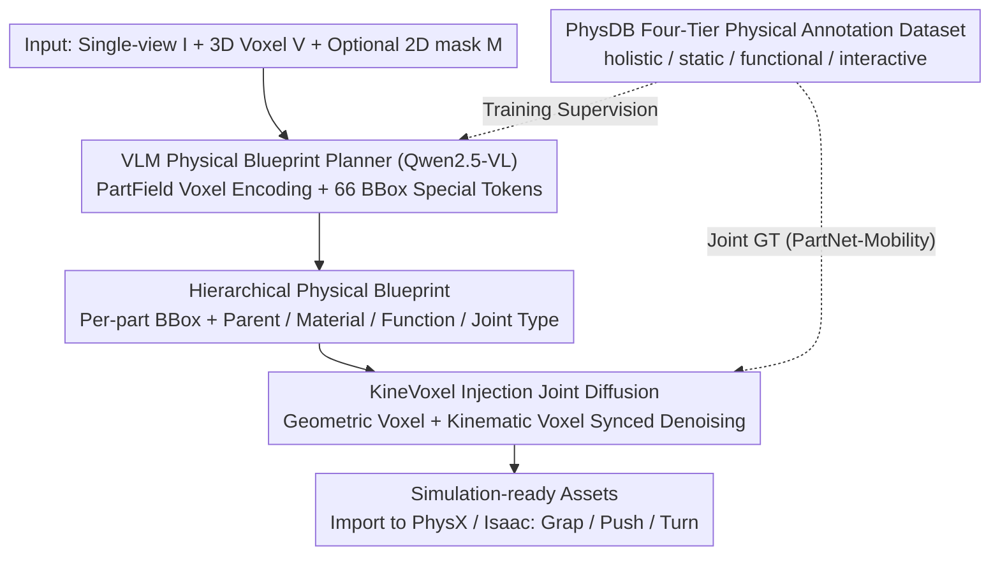

# PhysForge: Generating Physics-Grounded 3D Assets for Interactive Virtual World

**Conference**: ICML 2026  
**arXiv**: [2605.05163](https://arxiv.org/abs/2605.05163)  
**Code**: [hku-mmlab.github.io/PhysForge](https://hku-mmlab.github.io/PhysForge/)  
**Area**: 3D Vision / Generative Models / Embodied AI  
**Keywords**: Physics-aware 3D Generation, VLM Planning, KineVoxel Injection, Hierarchical Physical Blueprint, Interactive Assets

## TL;DR
The process of "creating interactive 3D objects" is reformulated as a two-stage "plan-then-generate" problem. A VLM acts as a physical architect to generate a "Hierarchical Physical Blueprint" containing hierarchical relationships, materials, and kinematic constraints. Subsequently, a diffusion model utilizes KineVoxel Injection to co-denoise articulation parameters and geometric voxels. Leveraging the PhysDB dataset with 150k assets and four-tier annotations, this work achieves the first generation of 3D assets from single views that are "graspable, pushable, and articulable" within physics engines.

## Background & Motivation

**Background**: 3D generation has achieved high-fidelity static geometry (TRELLIS, CLAY, 3DShape2VecSet), leading to part-aware generation (OmniPart, PartPacker) for decomposable objects. Initial physical explorations include EmbodiedGen, which assembles interactive scenes from existing modules, and PhysX-3D, which trains a Physical VAE with physical annotations on PartNet. Articulated object research has branched into "digital twin reconstruction" and "procedural generation" (e.g., CAGE, SINGAPO).

**Limitations of Prior Work**: Current 3D generation focuses almost exclusively on "static geometry + texture," producing "empty shell" assets that lack graspable handles or pushable hinges, making them undeployable in embodied AI simulators or game engines. Existing part-aware methods (OmniPart, PartPacker) decompose parts based on visual or geometric boundaries rather than functional or physical signals. Procedural generation for articulated objects relies on preset connection graphs or code templates, suffering from poor generalization and low precision.

**Key Challenge**: (1) Object "interactivity" stems from functional logic and hierarchical physics (e.g., the "press" function of a button, the hinge hierarchy of a cabinet door and handle), whereas existing part definitions rely only on visual boundaries; (2) Truly simulatable assets require three layers of information—geometry, material, and kinematics—but diffusion models excel at geometry/texture while VLMs excel at structure/world knowledge, and no method integrates them; (3) The primary bottleneck is the lack of large-scale datasets with fine-grained physical annotations.

**Goal**: Construct an end-to-end pipeline from single-view images to simulation-ready 3D assets, ensuring that generated objects can be directly manipulated in simulators like PhysX/Isaac. Simultaneously, establish a supporting physical annotation dataset.

**Key Insight**: The "plan-then-generate" paradigm from 2D generation is adapted for 3D. VLMs use world knowledge for planning, while diffusion models perform precise synthesis of geometry and articulation parameters. Instead of end-to-end training, the VLM outputs a comprehensive "physical blueprint," followed by the diffusion model's execution. Articulation parameters (origin, axis, limit) are elegantly encoded into voxel form and co-denoised with geometric voxels.

**Core Idea**: Decouple "physical planning (VLM)" from "physical realization (Diffusion + KVI)," providing supervision through the four-tier annotations of PhysDB (holistic / static / functional / interactive).

## Method

### Overall Architecture
PhysForge consists of two stages. **Stage 1: VLM-based Planning**—Inputs include a single-view image $I$, a corresponding 3D voxel representation $V$ (produced by the first stage of TRELLIS), and an optional 2D mask $M$. A fine-tuned Qwen2.5-VL autoregressively generates a Hierarchical Physical Blueprint, including attributes such as bboxes, parent nodes, joint types, materials, functions, and state machines for each part. **Stage 2: Diffusion-based Generation**—Generates geometric voxels and textures based on the blueprint. KineVoxel Injection (KVI) encodes kinematic parameters (origin, axis, limit) into a specialized kinematic voxel, which is co-denoised with geometric voxels in the same diffusion process to ensure synchronization and consistency between geometry and kinematics. The final output is a simulation-ready asset directly importable into physics engines for interactions like grasping, pushing doors, or turning knobs. The PhysDB dataset (150k assets, four-tier annotations, human-verified) provides training data, with articulation precision supplemented by PartNet-Mobility and Infinite-Mobility.

### Key Designs

**1. PhysDB Four-Tier Physical Annotation Dataset: Full-stack supervision for plan-then-generate**
To enable the VLM to "plan physics," data must define physical attributes. The authors filtered 150k assets with meaningful part structures from Objaverse (covering household, industrial, weapons, personal, vehicles, tech & electronics, cultural). Using MLLM initial generation followed by manual verification, a four-tier annotation system was established: **Holistic Tier** (object-level) records real-world scale, category, and usage context; **Static Properties Tier** (part-level) records semantic labels, physical materials, and mass; **Functional Tier** records intrinsic functions (e.g., to contain, to control) and state machines; **Interactive Tier** records atomic affordances, joint types, and joint parameters. This hierarchy supports high-level semantics while providing low-level numerical values. Since 150k-scale manual articulation axis annotation is noisy, the authors utilized PartNet-Mobility and Infinite-Mobility for numerical ground truth.

**2. VLM as Physical Blueprint Planner: Translating world knowledge into hierarchical blueprints**
The first stage converts LVLM world knowledge into structured part hierarchies and physical attributes. Based on Qwen2.5-VL, it takes image $I$, 3D voxel $V$, and mask $M$ as input. While images use native encoders, $V$ is encoded via PartField to capture part-specific features and downsampled through position-aware 3D convolutions into 512-dimensional voxel embeddings. To enable 3D bbox output, 66 special tokens were added: `<boxs>`/`<boxe>` wrap a bbox, and 64 tokens `<box0>...<box63>` quantize coordinates. This allows the VLM to autoregressively output bboxes and physical attributes. Predicting physical attributes surprisingly resolves part granularity ambiguity; functional/physical constraints provide strong semantic signals for part decomposition even without 2D masks.

**3. KineVoxel Injection (KVI): Aligning geometry and kinematics in a single diffusion process**
Serialized "geometry generation then articulation prediction" often leads to mismatches (e.g., a door with a misaligned hinge). KVI encodes kinematic parameters (origin/axis/limit) into a "kinematic voxel" that undergoes the same diffusion process as geometric voxels. The latent space carries both shape and kinematic information, sharing denoising steps to ensure natural alignment. During generation, the VLM blueprint provides condition signals, and the diffusion model performs high-fidelity synthesis on TRELLIS-style structured latents.

### Loss & Training
Stage 1: Standard next-token cross-entropy SFT to fine-tune Qwen2.5-VL for bbox and physical attribute sequences. Stage 2: Diffusion loss (following TRELLIS) plus additional parameter supervision for kinematic voxels. Articulation GT is sourced from PartNet-Mobility / Infinite-Mobility. Human-in-the-loop cleaning ensures annotation quality. Evaluation is performed on PhysXNet by comparing geometric (Chamfer Distance / F1) and physical attribute prediction accuracy.

## Key Experimental Results

### Main Results
Comparison with existing part-aware and physics-aware methods on PhysXNet. Key metrics: Chamfer Distance (CD), F1-0.1, F1-0.05, and Absolute Scale Error (cm).

| Metric | Prev. SOTA (PhysX-3D series) | PhysForge | Trend |
|---|---|---|---|
| CD ↓ | Baseline | Significantly Lower | Improved geometric accuracy |
| F1-0.1 ↑ | Baseline | Significantly Higher | Improved reconstruction accuracy |
| F1-0.05 ↑ | Baseline | Noticeably Higher | Better performance under strict thresholds |
| Absolute Scale (cm) ↓ | High Error | Significantly Reduced | More accurate physical scale |

### Ablation Study

| Configuration | Key Observation | Mechanism |
|---|---|---|
| Full PhysForge | Geometric + Articulation SOTA | Complete two-stage + KVI |
| w/o Physics Prediction | Part granularity ambiguity reappears | Physics-guided planning resolves ambiguity |
| w/o 2D mask input | Still produces reasonable bboxes | Blueprint constraints are sufficient |
| w/o KineVoxel Injection | Mismatch between geometry and articulation | Serial prediction is error-prone |
| w/o PhysDB training | Dropped accuracy in physical properties | Dataset is foundational to the paradigm |
| Replace PartField | Weakened local part representation | PartField is better for part features |

### Key Findings
- **Physics constraints benefit structural planning**: Training the VLM to predict physical attributes alongside bboxes improves semantic understanding of part decomposition, often removing the need for 2D masks.
- **Decoupled plan-realize paradigm is scalable**: Clear division between the VLM (architect) and diffusion model (builder) allows for independent upgrades to either component.
- **KVI is critical for consistency**: Treating articulation parameters as voxels during diffusion embeds kinematic constraints directly into the generation process.
- **Zero-shot deployment**: Results can be directly imported into simulators for downstream tasks like robotic grasping and door opening.

## Highlights & Insights
- "VLM as the architect, diffusion as the builder"—this division of labor mirrors human engineering and effectively translates the 2D plan-then-generate paradigm to 3D.
- Packaging articulation parameters into KineVoxels for a single diffusion process is an elegant solution that avoids redundant prediction branches while maintaining generative power.
- The discovery that physical labels re-inform part decomposition challenges the intuition that decomposition is purely geometric; semantic constraints make the model truly "understand" what constitutes a part.
- The 6-token bbox encoding is a refined example of fitting 3D structural generation into an LLM's next-token framework, offering high transferability.
- The four-tier annotation hierarchy (holistic → static → functional → interactive) serves as a refined decomposition of "physical interactivity."

## Limitations & Future Work
- Articulation precision remains dependent on datasets like PartNet-Mobility; large-scale precise articulation remains an open problem.
- Evaluation focuses on geometric and attribute accuracy, lacking systematic assessment of downstream "manipulation success rates."
- The VLM planning stage may still produce blueprints that violate physical common sense without an explicit consistency check.
- Currently targets rigid body articulation; modes like soft bodies, fluids, and cloth are not yet covered, requiring future "X-Voxel Injection" extensions.

## Related Work & Insights
- **vs OmniPart**: OmniPart performs semantically decoupled part generation but defines parts purely by geometry; PhysForge anchors parts in function/physics and generates articulation.
- **vs PartPacker**: PartPacker compresses parts into dual volumes for efficiency; PhysForge adds physical dimensions for interactivity.
- **vs PhysX-3D**: PhysX-3D uses a Physical VAE; PhysForge uses explicit VLM planning and KVI for stronger consistency.
- **vs EmbodiedGen**: EmbodiedGen is a system-level integration of modular tools; PhysForge is a unified framework from image to simulation-ready asset.

## Rating
- Novelty: ⭐⭐⭐⭐⭐ 
- Experimental Thoroughness: ⭐⭐⭐⭐ 
- Writing Quality: ⭐⭐⭐⭐ 
- Value: ⭐⭐⭐⭐⭐ 

<!-- RELATED:START -->

## Related Papers

- [\[CVPR 2026\] PhysGen: Physically Grounded 3D Shape Generation for Industrial Design](../../CVPR2026/image_generation/physgen_physically_grounded_3d_shape_generation_for_industrial_design.md)
- [\[ICML 2026\] Position: AI Evaluations Should be Grounded on a Theory of Capability](position_ai_evaluations_should_be_grounded_on_a_theory_of_capability.md)
- [\[ECCV 2024\] Generating 3D House Wireframes with Semantics](../../ECCV2024/image_generation/generating_3d_house_wireframes_with_semantics.md)
- [\[ICCV 2025\] Diffusion-based 3D Hand Motion Recovery with Intuitive Physics](../../ICCV2025/image_generation/diffusion-based_3d_hand_motion_recovery_with_intuitive_physics.md)
- [\[ICLR 2026\] Unified Multi-Modal Interactive & Reactive 3D Motion Generation via Rectified Flow](../../ICLR2026/image_generation/unified_multi-modal_interactive_reactive_3d_motion_generation_via_rectified_flow.md)

<!-- RELATED:END -->
