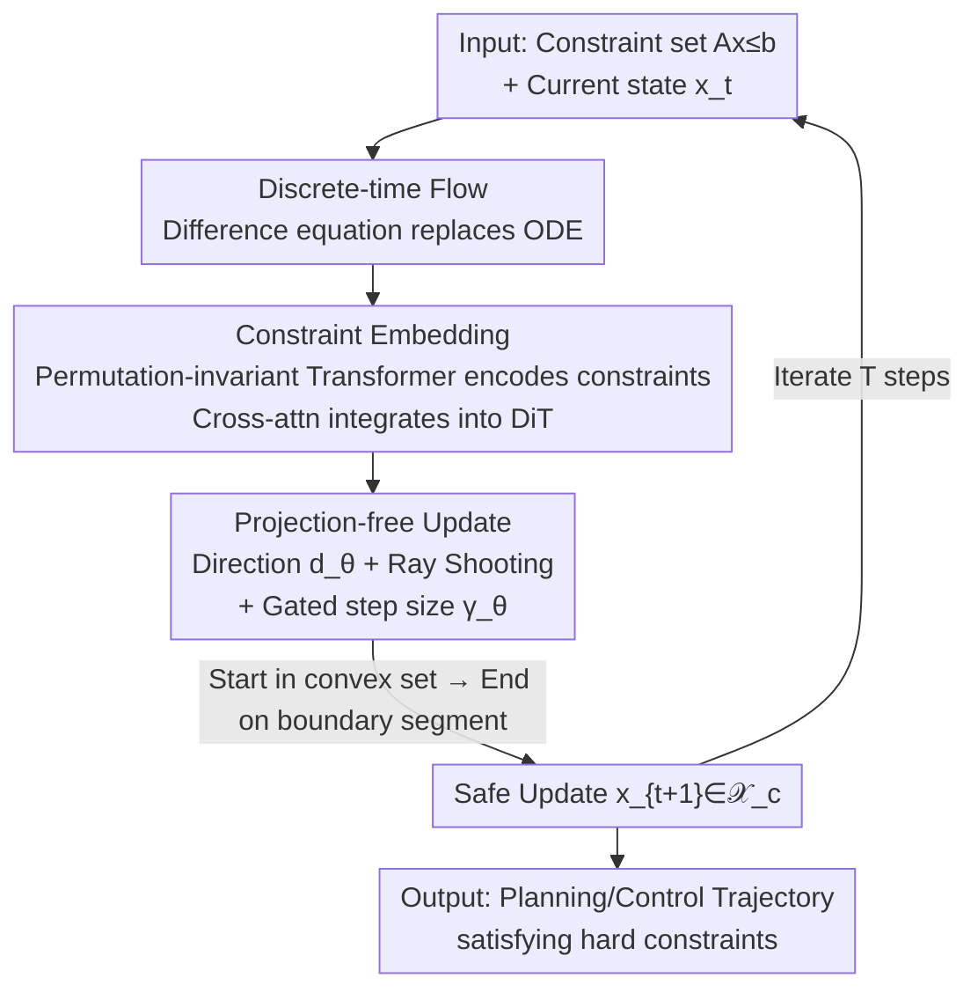

# PolyFlow: Safe and Efficient Polytope-Constrained Flow Matching with Constraint Embedding and Projection-free Update

**Conference**: ICML2026  
**arXiv**: [2606.13400](https://arxiv.org/abs/2606.13400)  
**Code**: To be confirmed  
**Area**: Diffusion/Flow Models · Safe Constrained Generation · Robot Planning and Control  
**Keywords**: Constrained Flow Matching, Safety Constraints, Projection-free, Ray Shooting, Discrete-time Flow  

## TL;DR
PolyFlow "welds" hard polytope constraint satisfaction directly into the network architecture and flow definition of Flow Matching models—using discrete-time flows to eliminate numerical integration errors and a Frank-Wolfe-style "ray shooting to boundary + learnable step size" to replace expensive projection solvers. This achieves **zero constraint violation** in planning and control tasks while reducing inference latency by one to two orders of magnitude.

## Background & Motivation

**Background**: Flow Matching has become a primary paradigm for high-fidelity generation and is rapidly penetrating "grounded" decision-making tasks such as robot trajectory planning and quadruped locomotion. A fundamental difference from image generation is that outputs must strictly reside within a feasible region (joint limits, obstacle avoidance, friction cones, actuator boundaries).

**Limitations of Prior Work**: Standard Flow Matching does not inherently guarantee safety. Even if the source and target distributions are within the feasible region, sampled trajectories may cross boundaries due to: (1) **Approximation Error**: Parametric networks approximating the true vector field always have biases that push the flow into unsafe regions; (2) **Numerical Integration Error**: Continuous-time ODE sampling must be discretized, and large step sizes (for speed) can cause states to leap across safety boundaries. Additionally, training data in real-world scenarios might be unconstrained, yet constraints must be enforced during generation.

**Key Challenge**: Existing constrained generation methods are almost entirely **post-hoc**. Projection methods treat each sampling step as a constrained optimization problem, using projection operators to pull out-of-bounds states back; CBF methods introduce Control Barrier Functions to guarantee forward invariance. Both suffer from two drawbacks: first, the need to **repeatedly solve Quadratic Programs (QP)** cripples real-time inference; second, this external intervention "forces" the learned flow dynamics, potentially distorting distribution matching and trapping sampling in local optima.

**Goal**: A **general, computationally efficient framework that does not sacrifice distribution quality**, embedding hard constraints into the flow architecture itself.

**Key Insight**: The philosophy is to "incorporate constraints into the flow definition and model structure rather than patching them post-hoc." This is inspired by the Frank-Wolfe algorithm—which moves towards the vertices of a feasible set during constrained optimization, naturally avoiding boundary violations without requiring projections.

**Core Idea**: Parameterize the update vector as "shooting from the current point towards a polytope boundary in a specific direction, then scaling by a learned step size." As long as the starting point is within the convex set and the endpoint is on the boundary, any point on the segment is within the set (convexity). Thus, **every update step is safe by construction**, completely eliminating the need for projection solvers.

## Method

### Overall Architecture

PolyFlow aims to perform generation within a **compact convex polytope safety set** $\mathcal{X}_c=\{x \mid Ax\le b\}$ while ensuring the entire sampling trajectory never violates constraints. It follows two paths: first, it reformulates the "flow" from a continuous-time ODE to a **discrete-time difference equation**, theoretically eliminating numerical integration error as a source of violation; second, it designs a **projection-free network architecture**, ensuring that every step output by the network naturally falls within the feasible region, thereby blocking violations caused by approximation errors.

The input consists of the constraint set $\mathcal{C}=\{(A_i,b_i)\}_{i=1}^m$, the current state $x_t$, and the time step $t$; the output is a safe update step $u_\theta(x_t,t)$, iterating for $T$ steps to transport prior samples to the target distribution. The pipeline is as follows: initial points are sampled within the Chebyshev ball of the polytope to ensure a legal starting point → a DiT backbone + constraint embedding block encodes the geometry into representations → a Ray Shooting block predicts "direction + step size" → a safe update is constructed on the boundary segment → recursive updates proceed.

### Key Designs

**1. Discrete-time Flow: Eliminating Numerical Integration Error at the Root**

Post-hoc methods are difficult partly because the continuous ODE $\frac{d}{dt}\psi_t(x)=u_t(\psi_t(x))$ must be discretized during sampling, and discretization error can push states across safety boundaries. PolyFlow defines the flow **directly in discrete time**: $\psi_{t+1}(x)=\psi_t(x)+u_t(\psi_t(x))$, with time steps $\mathcal{T}=\{0,\dots,T-1\}$. Thus, "sampling" and "flow definition" are identical, eliminating discretization approximation and the second source of violation.

The cost is a distribution bias since the marginal expectation field $\tilde u_t$ trained via CFM in discrete time no longer exactly generates the true marginal path $p_t$. The authors bound this via the 2-Wasserstein distance (Theorem 4.4): $W_2(p_{t+1},\tilde p_{t+1})\le (1+L)\,W_2(p_t,\tilde p_t)+\mathcal{E}_{match}(t)$, where the matching error $\mathcal{E}_{match}(t)=\sqrt{\mathbb{E}_z\mathbb{E}_{x_t}[\|\tilde u_t(x_t)-u_t(x_t|z)\|^2]}$. If the CFM objective is well-trained, $\mathcal{E}_{match}$ remains small and the error is bounded over $T$ steps—essentially **sacrificing a small amount of marginal distribution precision for absolute safety**.

**2. Safety Preservation Theorem: Scaling Conditional Safety to Marginal Safety**

The discrete framework alone is insufficient; it must be proven that "safety of every conditional flow" aggregates into "safety of the marginal flow." Theorem 4.5 states: when $\mathcal{X}_c$ is convex, if the conditional flow is interior safe (Def 4.2, i.e., the trajectory stays within $\mathcal{X}_c$ if the start is within $\mathcal{X}_c$), then the marginal expectation field $\tilde u_t$ is also interior safe.

The construction is simple: use linear interpolation between endpoints $x_0,x_1\in\mathcal{X}_c$ for the conditional flow, with the conditional field $u_t(x|z)=(x_1-x_0)/T$. Convexity ensures the segment connecting $x_0,x_1$ lies entirely within $\mathcal{X}_c$, making the conditional flow interior safe, and by Theorem 4.5, the marginal field is also safe. This step theoretically elevates "individual sample safety" to "safety of the entire aggregated generation process."

**3. Projection-free Architecture: Ray Shooting + Learned Gated Step Size over Projection/QP**

The theorem only guarantees safety for the ideal marginal field $\tilde u_t$, but the parametric network $u_\theta$ is an approximation and may still violate constraints. CFM training is thus formulated as a constrained optimization: $\min_\theta \mathcal{L}_{CFM}$ s.t. $x_t+u_\theta(x_t,t)\in\mathcal{X}_c$. Most methods use projection $x_{t+1}=\text{Proj}_{\mathcal{X}_c}(x_t+u_\theta)$, which is slow and interferes with flow dynamics.

PolyFlow adopts the spirit of Frank-Wolfe: moving towards the feasible set boundary rather than projecting the gradient. A naive version moves towards vertices $u_\theta=\gamma_\theta\cdot(\text{Selector}_\theta(\mathcal{V}(\mathcal{X}_c))-x_t)$, but vertex selection is non-differentiable and results in "zigzag" oscillations. The authors **decouple the update into an "unconstrained direction + bounded step size"**:

$$u_\theta(x_t,t)=\gamma_\theta(x_t,t)\cdot\big(\text{RS}(x_t,d_\theta(x_t,t))-x_t\big)$$

Where $d_\theta$ is the **unconstrained continuous direction** predicted by the network; $\text{RS}(x_t,d)$ is the **Ray Shooting** operator, which finds the intersection of a ray from $x_t$ in direction $d$ with the boundary $\partial\mathcal{X}_c$; and $\gamma_\theta\in[0,1]$ is a **gated step size** from a sigmoid output, controlling how far to move along the segment. Since the endpoint is on the segment $[x_t,\text{RS}]\subseteq\mathcal{X}_c$, $x_{t+1}$ is legitimate by construction.

This decoupling offers two advantages: the ray-boundary intersection is **differentiable** with respect to $x_t$ and $d_\theta$, allowing end-to-end training; and the continuous direction can target any point on the boundary (faces or edges), significantly increasing degrees of freedom and resulting in smooth, non-oscillating trajectories. This transforms "safety" from a repeated optimization problem into an identity property of the network architecture—zero extra solver overhead.

**4. Constraint Embedding + Practical Construction: Enabling the Model to "See" Arbitrary Polytopes**

To generalize to arbitrary time-varying polytope constraints, the model must ingest the constraint set. PolyFlow adds two modules to the DiT backbone: a **Constraint Embedding Block** that takes the linear inequality set $\{(A_i,b_i)\}$ (i.e., $Ax\le b$) as input, using a **permutation-invariant Transformer** (without positional encoding) to integrate constraint embeddings via cross-attention into the DiT latent representation; and a **Ray Shooting Block** that receives the fused representation to predict $\gamma_\theta$ and $d_\theta$. Since constraints may only affect specific dimensions, $x$ is split into unconstrained components $x^{unc}$ and constrained components $x^{con}$, handled by independent output heads.

For initialization, the theorem requires the support of the initial distribution to lie entirely within $\mathcal{X}_c$. The authors sample uniformly within the **Chebyshev ball** of the polytope. Finding the Chebyshev ball is a **Linear Program (LP)**, which is much cheaper than the QP used in projection methods and only needs to be precomputed once for static constraints.

## Key Experimental Results

### Main Results: 2D Maze (Strict Computation Comparison)

Comparison with a fixed $N=10$ sampling steps for all methods:

| Metric | PolyFlow-attn | PolyFlow-mlp | Flow | SafeFlow | RoSD | ReSD |
|------|------|------|------|------|------|------|
| Safety ↑ | **1.0** | **1.0** | 0.845 | 0.530 | 0.990 | 0.145 |
| MMD ↓ | 6.2e-6 | **2.62e-6** | 3.5e-5 | 6.55e-3 | 1.76e-4 | 5.46e-2 |
| W ↓ | 0.041 | **0.033** | 0.054 | 0.348 | 0.124 | 1.800 |
| KL ↓ | 0.134 | **0.050** | 0.266 | 3.140 | 50.2 | 2.720 |
| TotalTime ↓ | 2.11 | 0.58 | **0.324** | 7.558 | 1.120 | 8.926 |

PolyFlow is the only method to achieve **Safety Rate = 1.0 and optimal distribution matching (MMD/W/KL)** under equal computation. CBF-based baselines either fail on safety (SafeFlow 0.53) or require hundreds of steps to barely reach safety, causing time to explode.

### Key Findings
- **Safety is a Hard Guarantee**: Across all tasks, PolyFlow safety remains 1.0, while unconstrained Flow drops to 0.5% in Hopper-Complex, proving that as constraints become complex, post-hoc fixes fail while by-construction safety holds.
- **Efficiency via "No QP"**: PolyFlow performs one differentiable Ray Shooting per step, making it 1-2 orders of magnitude faster than CBF methods like SafeFlow.
- **Safety Enhances Returns**: Rollout returns for PolyFlow are generally higher than unconstrained Flow, suggesting that constraining generation to the feasible region prevents the flow from drifting into "bad" states.
- **Attn vs MLP**: PolyFlow-mlp is superior in distribution matching and speed, while the attn variant is better suited for generalizing to complex/time-varying constraints.

## Highlights & Insights
- **Philosophy of Structural Constraints**: Ray Shooting downgrades "safety" from a constrained optimization to a network property, ensuring differentiability and zero solver overhead.
- **Discrete-time Flows are Undervalued**: By defining flow in discrete time, the authors eliminate an entire class of violations (numerical integration error) and provide a theoretical Wasserstein bound.
- **Direction/Step Decoupling**: This trick solves the oscillation and non-differentiability issues of the original Frank-Wolfe algorithm and can be transferred to any differentiable generation scenario requiring movement toward convex boundaries.

## Limitations & Future Work
- **Convexity Requirement**: All safety guarantees rely on $\mathcal{X}_c$ being a compact convex polytope. Non-convex feasible regions require convex decomposition, the cost of which is not fully discussed.
- **Discrete-time Distribution Bias**: Theorem 4.4 only guarantees bounded error; the precision gap compared to continuous flows at low step counts $T$ is not fully quantified.
- **Dismatching Score in High-intensity Tasks**: In tasks like HalfCheetah where dynamics are aggressive, the injury to distribution matching by strong constraints still exists.

## Related Work & Insights
- **vs. Projection Methods**: These solve QPs/projections per step; PolyFlow uses Ray Shooting to embed safety into the structure. The core difference is "post-hoc pullback vs. inherent safety."
- **vs. CBF Methods**: These require manually designed barrier functions and QP solvers; PolyFlow is 1-2 orders of magnitude more efficient and doesn't require manual CBF design.
- **vs. Riemannian Flow**: These define flows on constrained manifolds but are limited to simple geometries; PolyFlow's polytope setting covers broader linear inequality constraints.

## Rating
- Novelty: ⭐⭐⭐⭐⭐ 
- Experimental Thoroughness: ⭐⭐⭐⭐ 
- Writing Quality: ⭐⭐⭐⭐⭐ 
- Value: ⭐⭐⭐⭐⭐ 

<!-- RELATED:START -->

## Related Papers

- [\[ICLR 2026\] Gauge Flow Matching: Efficient Constrained Generative Modeling over General Convex Set and Beyond](../../ICLR2026/image_generation/gauge_flow_matching_efficient_constrained_generative_modeling_over_general_conve.md)
- [\[ICLR 2026\] SafeFlowMatcher: Safe and Fast Planning using Flow Matching with Control Barrier Functions](../../ICLR2026/image_generation/safeflowmatcher_safe_and_fast_planning_using_flow_matching_with_control_barrier_.md)
- [\[NeurIPS 2025\] Training-Free Safe Text Embedding Guidance for Text-to-Image Diffusion Models](../../NeurIPS2025/image_generation/training-free_safe_text_embedding_guidance_for_text-to-image_diffusion_models.md)
- [\[CVPR 2026\] ProjFlow: Projection Sampling with Flow Matching for Zero-Shot Exact Spatial Motion Control](../../CVPR2026/image_generation/projflow_projection_sampling_with_flow_matching_for_zero-shot_exact_spatial_moti.md)
- [\[ICML 2026\] E²PO: Embedding-perturbed Exploration Preference Optimization for Flow Models](embedding-perturbed_exploration_preference_optimization_for_flow_models.md)

<!-- RELATED:END -->
