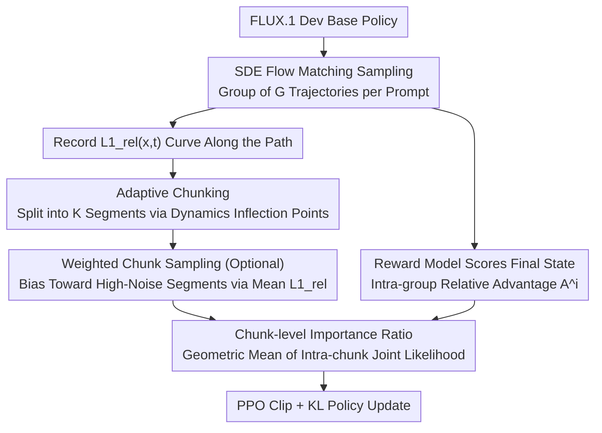

# Principled RL for Flow Matching Emerges from the Chunk-level Policy Optimization

**Conference**: ICML2026  
**arXiv**: [2510.21583](https://arxiv.org/abs/2510.21583)  
**Code**: https://github.com/xingzhejun/GCPO  
**Area**: Image Generation  
**Keywords**: flow matching, GRPO, chunk-level policy optimization, T2I, preference alignment

## TL;DR
GCPO transitions the step-level optimization in flow matching post-training—where GRPO assigns the "same final reward as advantage to every step"—into "chunk-level" optimization. By adaptively grouping consecutive steps into chunks based on flow matching's own temporal dynamics $L1_{rel}(x,t)$ and utilizing normalized chunk-level importance ratios $r^i_j$ for policy updates, it smooths out erroneous gradients caused by the "final success $\neq$ step-wise optimal" mismatch. This achieves a relative gain of up to 43% over GRPO on HPSv3, ImageReward, GenEval, and DPG.

## Background & Motivation
**Background**: Methods like Dance-GRPO and Flow-GRPO adapt the successful GRPO from LLMs to T2I flow matching post-training: they sample a group of $G$ images for the same prompt, calculate the relative advantage $A^i=(r^i-\bar r)/\sigma_r$ based on intra-group rewards, and **uniformly assign this scalar advantage to every step** $t=1\ldots T$ of the generation trajectory for PPO-style updates.

**Limitations of Prior Work**: The authors identify this as **inaccurate advantage attribution**—this uniform distribution implicitly assumes a strong hypothesis: "better final outcome $\implies$ better policy at every step." However, Figure 2 provides a counterexample: while Trajectory 1 has a higher final reward, Trajectory 2's intermediate policy at $t=1$ is actually superior. GRPO gives Trajectory 2's $t=1$ step a negative advantage, which is a false signal. Statistics on 400 HPDv2.1 prompts using a step-aware preference model show that "step-level preference" and "final reward" are inconsistent for **nearly half** of the steps (37% + 44%), indicating a systematic issue rather than isolated noise.

**Key Challenge**: A true solution would require a process reward model (PRM) capable of scoring noisy latents $x_t$. However, training such a PRM requires massive "preference labels for noisy images," which are currently unavailable. Existing schemes using 1-step diffusion approximations (Liang 2025, Liao 2025) suffer from estimation bias. Thus, the PRM path is currently impractical.

**Goal**: Suppress the gradient jitter caused by misattribution by changing the "granularity of policy optimization" **without introducing a process reward**.

**Key Insight**: Drawing an analogy from robot action chunking (Zhao 2023)—since single-step predictions can be disrupted by non-Markovian noise in human demonstrations, multiple steps are treated as an "action chunk" for joint prediction. Similarly, adjacent steps in flow matching are highly correlated; evaluating them as an atomic action to calculate advantage should "average out" local jitters caused by misattribution.

**Core Idea**: Elevate policy optimization from the **step level** to the **chunk level**. Retain GRPO's uniform distribution of the final outcome reward, but use normalized chunk-level importance ratios $r^i_j$ as the basic gradient unit. Additionally, leverage flow matching's prompt-invariant temporal dynamics curve $L1_{rel}(x,t)$ to adaptively partition chunks (grouping steps with similar dynamic changes).

## Method

### Overall Architecture
GCPO addresses the misattribution in GRPO caused by "uniformly attaching the same final reward to every step" by lifting the minimum unit of policy optimization to a "chunk." The pipeline does not modify the reward, sampler, or KL constraints; it only changes which granularity is used for the "importance ratio + clip" in the GRPO objective. Using FLUX.1 Dev as the base policy, trajectories are sampled via the SDE flow matching formulation $dx_t=(v_\theta+\frac{\sigma_t^2}{2t}(x_t+(1-t)v_\theta))dt+\sigma_t dw_t$. Along the path, $L1_{rel}(x,t)$ is recorded for chunking, the reward model scores only the final state $x_0$ to get the intra-group advantage $A^i$, and finally, PPO-style updates are performed using chunk-level importance ratios.

### Key Designs

**1. Chunk-level importance ratio: Diluting erroneous step-level gradients within chunks**

GRPO spreads the outcome reward evenly across every step, implying "better final result $\implies$ better every step." The authors' statistics show this is incorrect for nearly half of the steps. GCPO's countermeasure is to partition the trajectory into $K$ chunks and stop calculating ratios for single steps. Instead, it takes the geometric mean of the joint likelihood for the $j$-th chunk of the $i$-th trajectory: $r^i_j(\theta)=\left(\prod_{t\in ch_j}\frac{p_\theta(x^i_{t-1}|x^i_t,c)}{p_{\text{old}}(x^i_{t-1}|x^i_t,c)}\right)^{1/cs_j}$, substituting it back into the PPO-clip objective: $\frac{1}{G}\frac{1}{K}\sum_{i,j}\min(r^i_jA^i,\text{clip}(r^i_j,1\pm\epsilon)A^i)-\beta D_{KL}$.

With this modification, if a step within a chunk is "misjudged by the final reward," its ratio is averaged with other steps in the same chunk. This is equivalent to low-pass filtering, suppressing high-frequency gradient jitter caused by misattribution. This objective serves as a unified form for step-level GRPO ($K=T$) and sequence-level optimization ($K=1$). The $1/cs_j$ geometric mean normalization ensures ratios from chunks of different lengths are comparable, preventing the clip threshold $\epsilon$ from requiring readjustment and avoiding the "vanishing ratio" problem in long chunks.

**2. Temporal-dynamics-guided adaptive chunking: Aligning chunk boundaries with dynamic inflection points**

The chunking method dictates whether the geometric mean "averages the same category of steps." The authors observe that the relative $L_1$ distance in flow matching, $L1_{rel}(x,t)=\|x_t-x_{t-1}\|_1/\|x_t\|_1$, forms a prompt-invariant but step-dependent curve along $t$ (Figure 5: high-noise segments change drastically, low-noise segments change slowly). This curve naturally segments the trajectory into "dynamically similar" parts. GCPO uses the first derivative of $L1_{rel}$ for chunking: consecutive steps with the same derivative sign are grouped; if a segment's sign is consistent, it is split at the midpoint, and higher-order derivatives are used recursively until chunks are sufficiently small.

Adaptive chunking is used because only "dynamically similar adjacent steps" truly constitute a meaningful atomic action. Forcing high-noise drastic change areas and low-noise stable areas into the same chunk makes the geometric mean of the ratio lose physical meaning. Figure 4 shows that adaptive chunking outperforms fixed-length chunking ($cs=2/4/8/16$). Using $L1_{rel}$ as an indicator requires no extra training, is zero-cost, and is directly reusable for any flow matching backbone.

**3. Dynamics-based weighted chunk sampling (Optional): High-noise acceleration, low-noise stability**

To save computation, only a subset of chunks from each trajectory is sampled for gradient calculation (following Dance-GRPO's sub-sampling, ratio 0.5). GCPO replaces uniform sampling with dynamics-weighted sampling: the sampling weight of each chunk is proportional to its average relative $L_1$ distance: $w(ch_j)=\frac{\overline{L1_{rel}}(ch_j)}{\sum_k\overline{L1_{rel}}(ch_k)}$, where $\overline{L1_{rel}}(ch_j)=\frac{1}{cs_j}\sum_{t\in ch_j}L1_{rel}(x,t)$.

This bias toward high-noise segments is based on ablation studies (Figure 7, training on single chunks): high-noise chunks provide greater reward gains but are less stable and diverge after 60 steps; low-noise chunks are stable but provide smaller gains. Weighted sampling aims for the best of both worlds—more high-noise samples to accelerate alignment and low-noise samples to maintain stability. The drawback is that while it improves preference alignment, it may degrade structural benchmarks like GenEval (Figure 6 shows failure cases like missing "black loafers" or half-rendered "capris"), making it an optional feature.

### Loss & Training
The final objective is Eq.14:
$$J(\theta)=\mathbb{E}\Big[\frac{1}{G}\frac{1}{K}\sum_{i,j}\big(\min(r^i_j A^i,\text{clip}(r^i_j,1-\epsilon,1+\epsilon)A^i)-\beta D_{KL}(\pi_\theta\|\pi_{ref})\big)\Big]$$
where $A^i$ remains the intra-group relative reward. The base model is FLUX.1 Dev, the dataset is HPDv2.1, and the primary rewards are HPSv3 (preference alignment) and CLIP (standard T2I). During evaluation, hybrid inference (Li 2025a) is used to suppress reward hacking.

## Key Experimental Results

### Main Results

| Dataset / Metric | Flux base | Dance-GRPO | Flow-GRPO | GCPO w/o ws | GCPO w/ ws |
|---|---|---|---|---|---|
| HPSv3 ↑ | 13.804 | 15.080 | 14.900 | 15.236 | **15.373** |
| ImageReward ↑ | 1.086 | 1.141 | 1.135 | 1.147 | **1.149** |
| GenEval Overall ↑ | 0.66 | 0.67 | 0.67 | **0.69** | 0.67 |
| DPG Overall ↑ | 84.00 | 85.17 | 85.05 | **86.60** | 85.14 |
| User study win rate | – | 0.275 | – | 0.350 | **0.375** |

GCPO achieves approximately 3× the relative improvement over GRPO baselines on GenEval/DPG. The maximum relative gain in preference alignment is 43% (normalized HPSv3 improvement of GCPO over Dance-GRPO). In the user study, the two GCPO variants were collectively rated as best by humans with a 72.5% probability.

### Ablation Study

| Configuration | HPSv3 | Description |
|---|---|---|
| Flux (no RL) | 13.804 | Base, lower bound |
| Dance-GRPO (step-level) | 15.080 | Reproduced GRPO baseline |
| GCPO fixed $cs=2$ | 15.115 | Chunked, fixed 2 steps |
| GCPO fixed $cs=4$ | 15.078 | Fixed 4 steps |
| GCPO fixed $cs=8$ | 15.173 | Fixed 8 steps, already beats GRPO |
| GCPO fixed $cs=16$ ($K=1$ sequence) | 15.142 | Single chunk for whole trajectory also wins |
| **GCPO adaptive (Default)** | **15.236** | Adaptive split using $L1_{rel}$, best |
| + weighted sampling | 15.373 | Further preference gains, but GenEval drops |

Switching reward models (Table 6, PickScore training): GCPO consistently outperforms Dance-GRPO and Flow-GRPO across PickScore, HPSv3, and ImageReward metrics, proving improvements stem from optimization granularity rather than overfitting a specific reward.

### Key Findings
- **Any chunking outperforms step-level GRPO**: Even a crude fixed $cs=2$ beats GRPO by 0.035 HPSv3, confirming that "step-level advantage attribution" has structural errors and intra-chunk geometric averaging is an effective smoother.
- **Chunking strategy matters**: Adaptive > Fixed 8 > Fixed 2 > Fixed 4. It is not simply "the larger/smaller the chunk, the better"—it must align with flow matching's temporal dynamics.
- **High-noise chunks provide high gains but low stability**: Figure 7 shows low-index (high-noise) chunks increase rewards faster but diverge after 60 steps, motivating the "high-noise acceleration + low-noise anchor" weighted sampling approach.
- **Weighted sampling is a double-edged sword**: Preference alignment increases (HPSv3 15.236 $\rightarrow$ 15.373), but GenEval drops from 0.69 to 0.67, and DPG from 86.60 to 85.14. It disrupts structural generation in high-noise segments, hence it is optional.

## Highlights & Insights
- **Transposing the "per-token vs per-sequence" debate from LLM RL to Diffusion**: While GSPO already discussed "sequence-level importance ratios" for stability in LLMs, this work maps that experience to flow matching. It highlights a unique feature: flow matching has a **deterministic temporal dynamics curve**, allowing for "non-uniform intra-sequence chunking," which is more refined than the simple token vs sequence binary in LLMs.
- **$L1_{rel}(x,t)$ is a "free lunch"**: Being prompt-invariant and requiring no training, it serves as an ideal basis for chunk boundaries and can be reused for any flow matching backbone with zero overhead.
- **Mitigating process attribution without process rewards**: This is a transferable insight—when fine-grained supervision is hard to obtain but fine-grained parameterization is easy, one can replace "supervision granularity" with "gradient aggregation granularity." Similar tricks could apply to video diffusion or step-level reward issues in long CoT LLMs.
- **Geometric mean + $1/cs_j$ normalization**: Allows fair comparison across different chunk lengths and prevents long chunks from being erroneously truncated by clipping due to small joint likelihoods.

## Limitations & Future Work
- **Still relies on outcome rewards**: Chunking only "averages out" the error signal; it doesn't explicitly tell the steps within a chunk which was better or worse. If true PRMs become viable, chunking might become sub-optimal.
- **Weighted sampling side effects**: Increased sampling at high noise can damage structure. It currently requires a trade-off rather than a win-win; there is a lack of adaptive weight scheduling (e.g., annealing weight over training).
- **Limited scope of base models/datasets**: Full comparisons were primarily on FLUX + HPDv2.1; transferability to SD3 or PixArt-$\alpha$ is not yet fully validated.
- **Chunking hyperparameters**: The recursive termination threshold for adaptive chunking was not systematically ablated, though fixed settings were reported in Table 5.
- **Theoretical analysis is in Appendix A**: The main text relies on intuition. Properties such as "chunk-level ratio convergence to optimal policy" require verification from the appendix.

## Related Work & Insights
- **vs Dance-GRPO / Flow-GRPO**: Both use step-level GRPO + SDE flow matching. GCPO maintains their sampling and KL constraints but modifies the ratio granularity as a drop-in replacement with near-zero extra cost.
- **vs MixGRPO (Hybrid ODE-SDE)**: MixGRPO reduces compute via sampling paths; GCPO improves stability via optimization granularity. They are orthogonal and potentially stackable.
- **vs TempFlow-GRPO**: TempFlow uses timing-aware weights for step-level advantages; GCPO merges steps into atomic units and applies weights to chunks, offering a more fundamental restructuring.
- **vs DenseGRPO (Deng 2026, PRM route)**: DenseGRPO takes the hard path of training noisy PRMs; GCPO is easier to implement but likely has a lower theoretical ceiling than a true PRM-based solution.
- **vs Action Chunking (Zhao 2023, ACT)**: ACT jointly predicts future actions in robotics to combat non-Markovian noise. GCPO applies this inspiration to generative RL, utilizing the unique "temporal dynamics" of flow matching to guide chunk placement.

## Rating
- Novelty: ⭐⭐⭐⭐ Successfully bridges sequence-level ratios from LLMs and action chunking from robotics to flow matching RL, guided by $L1_{rel}$ dynamics. Step-sequence granularity shifts have precedents (e.g., GSPO), hence not a full score.
- Experimental Thoroughness: ⭐⭐⭐⭐ Covers GenEval/DPG/HPSv3/ImageReward + user studies + multi-reward model robustness + chunk size ablations. Lacks cross-model transfer and extensive theoretical empiricals.
- Writing Quality: ⭐⭐⭐⭐ Logical flow from problem to quantification to method. Figures 2/5/7 provide excellent visual intuition for misattribution and dynamic chunking.
- Value: ⭐⭐⭐⭐ A drop-in replacement for GRPO in T2I flow matching pipelines with zero compute overhead. Code is open-sourced, and the barrier to entry is low.

<!-- RELATED:START -->

## Related Papers

- [\[CVPR 2026\] Neighbor GRPO: Contrastive ODE Policy Optimization Aligns Flow Models](../../CVPR2026/image_generation/neighbor_grpo_contrastive_ode_policy_optimization_aligns_flow_models.md)
- [\[CVPR 2026\] GRPO-Guard: Mitigating Implicit Over-Optimization in Flow Matching via Regulated Clipping](../../CVPR2026/image_generation/grpo-guard_mitigating_implicit_over-optimization_in_flow_matching_via_regulated_.md)
- [\[ICML 2026\] E²PO: Embedding-perturbed Exploration Preference Optimization for Flow Models](embedding-perturbed_exploration_preference_optimization_for_flow_models.md)
- [\[ICML 2026\] Bootstrap Your Generator: Unpaired Visual Editing with Flow Matching](bootstrap_your_generator_unpaired_visual_editing_with_flow_matching.md)
- [\[ICML 2026\] Shifting the Breaking Point of Flow Matching for Multi-Instance Editing](shifting_the_breaking_point_of_flow_matching_for_multi-instance_editing.md)

<!-- RELATED:END -->
## Related Papers

- [\[CVPR 2026\] Neighbor GRPO: Contrastive ODE Policy Optimization Aligns Flow Models](../../CVPR2026/image_generation/neighbor_grpo_contrastive_ode_policy_optimization_aligns_flow_models.md)
- [\[ICML 2026\] E²PO: Embedding-perturbed Exploration Preference Optimization for Flow Models](embedding-perturbed_exploration_preference_optimization_for_flow_models.md)
- [\[ICML 2026\] Bootstrap Your Generator: Unpaired Visual Editing with Flow Matching](bootstrap_your_generator_unpaired_visual_editing_with_flow_matching.md)
- [\[ICML 2026\] Shifting the Breaking Point of Flow Matching for Multi-Instance Editing](shifting_the_breaking_point_of_flow_matching_for_multi-instance_editing.md)
- [\[CVPR 2026\] GRPO-Guard: Mitigating Implicit Over-Optimization in Flow Matching via Regulated Clipping](../../CVPR2026/image_generation/grpo-guard_mitigating_implicit_over-optimization_in_flow_matching_via_regulated_.md)

<!-- RELATED:END -->
