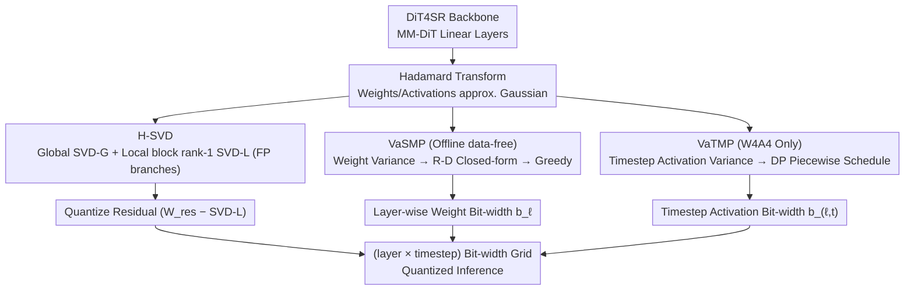

# Q-DiT4SR: Exploration of Detail-Preserving Diffusion Transformer Quantization for Real-World Image Super-Resolution

**Conference**: ICML 2026  
**arXiv**: [2602.01273](https://arxiv.org/abs/2602.01273)  
**Code**: https://github.com/xunzhang1128/Q-DiT4SR (To be open-sourced)  
**Area**: Model Compression / Diffusion Model Quantization / Real-World Image Super-Resolution  
**Keywords**: PTQ, Diffusion Transformer, Hierarchical SVD, Mixed Precision, Real-ISR

## TL;DR
This paper introduces Q-DiT4SR, the first PTQ framework specifically designed for DiT-based Real-World Image Super-Resolution (Real-ISR). It preserves high-frequency details through a hierarchical SVD decomposition of "global low-rank + local block rank-1." Based on rate-distortion theory, it proposes a data-free inter-layer weight bit-width assignment (VaSMP) and a dynamic programming-based timestep activation bit-width scheduling (VaTMP). The method achieves SOTA performance under extreme W4A6 / W4A4 settings, compressing the model by $5.8\times$ and reducing computation by $6.14\times$.

## Background & Motivation

**Background**: Real-World Image Super-Resolution (Real-ISR) has evolved from CNNs and Transformers to diffusion models. Recent methods based on Diffusion Transformers (DiTs), such as DiT4SR and DreamClear, have achieved superior texture restoration using pure DiT architectures with all-linear layers and self-attention. However, DiT models possess massive parameter counts and computational demands, and the iterative denoising process further escalates inference costs, hindering practical deployment.

**Limitations of Prior Work**: PTQ is a widely recognized low-cost acceleration solution, but current methods are divided into two categories neither of which directly applies to DiT-based Real-ISR: (1) General diffusion model PTQ (e.g., Q-Diffusion, PTQD, TDQ) is designed for U-Net and text-to-image tasks, leading to severe degradation of high-frequency textures when migrated to DiT-based SR. (2) DiT-specific PTQ (e.g., PTQ4DiT, Q-DiT, SVDQuant) targets text-to-image generation and fails to handle the local details required for "pixel-level fidelity" in SR tasks, typically collapsing under W4A4 settings.

**Key Challenge**: The authors identify three specific deficiencies: ① Existing SVD low-rank decomposition is too "global," discarding high-frequency residuals as noise, even though SR relies on these residuals. ② Weight variances across different DiT layers vary by several orders of magnitude, yet they are assigned uniform bit-widths. ③ Activation variances differ significantly across different timesteps in the diffusion sampling trajectory, but existing methods use "time-invariant" static precision allocation.

**Goal**: To address "weight reconstruction precision," "inter-layer weight bit-width assignment," and "timestep-based activation bit-width scheduling" simultaneously for DiT-based Real-ISR under W4A6 / W4A4 settings while avoiding expensive calibration processes.

**Key Insight**: The authors make two key observations: (a) PCA analysis reveals that removing the first 128 principal components of DiT layer outputs significantly destroys SR quality, indicating that dominant components must be preserved in FP. (b) After Hadamard transformation, weights and activations become approximately Gaussian, where variance directly determines the distortion of uniform quantization; thus, "variance" serves as a natural proxy for sensitivity.

**Core Idea**: Use hierarchical SVD ("global low-rank + local block rank-1") to more thoroughly preserve FP information flow. Then, utilize "variance-driven + rate-distortion theory" closed-form solutions with greedy discretization for data-free inter-layer bit-width assignment, and "variance-driven + dynamic programming" for intra-layer timestep activation bit-width scheduling.

## Method

### Overall Architecture
Q-DiT4SR uses DiT4SR as the backbone, where all MM-DiT blocks are quantized (Softmax is kept at 8-bit for numerical stability). Every linear layer first undergoes a Hadamard transform (to make weights/activations approximately Gaussian, serving as a unified premise for quantization and variance analysis). This is followed by three independent but cascaded processes: ① H-SVD splits weights into "Global SVD-G + Local block rank-1 SVD-L" as two FP branches, with quantization applied only to the "weight residual - SVD-L." ② VaSMP calculates a rate-distortion problem in an offline data-free stage using weight variance $\bar{\sigma}_\ell^2$ to determine the layer bit-width $b_\ell$. ③ VaTMP (enabled only for W4A4) collects activation variances $v_{\ell,t}$ per layer per timestep on a small calibration set (32 LR images) and uses dynamic programming to solve for a "piecewise constant" timestep bit-width schedule. These orthogonal steps result in a (layer × timestep) bit-width grid for inference.

### Key Designs

**1. H-SVD: Preserving High Frequencies through "Global Low-Rank + Local Block Rank-1" FP Branches**

Super-resolution tasks suffer when methods like SVDQuant preserve only a single global SVD branch, as this forces all "non-low-rank components"—often critical local high-frequency residuals in SR—into the quantizer. H-SVD decomposes every Hadamard-transformed weight $\mathbf{W}_H = \mathbf{W}\mathbf{H}_n$ into two FP branches before quantizing the remainder: it first extracts a global rank-$r$ branch $\mathbf{W}_{\text{SVD-G}}$ via truncated SVD. The residual $\mathbf{W}_{\text{res}} = \mathbf{W}_H - \mathbf{W}_{\text{SVD-G}}$ is then partitioned into $s_o \times s_i$ small blocks, each undergoing a local rank-1 SVD $\mathbf{W}^{(p,q)} \approx \sigma_{p,q}\mathbf{u}_{p,q}\mathbf{v}_{p,q}^\top$ to form the local branch $\mathbf{W}_{\text{SVD-L}}$. The block size $(s_o, s_i)$ is determined via grid search under the budget constraint $P_{\text{SVD-L}} \lesssim P_{\text{SVD-G}}(r)$, allowing the local branch to capture as much texture as possible while matching the global branch's parameter count. The final reconstruction is expressed as $\hat{\mathbf{W}} = (\mathbf{W}_{\text{SVD-G}} + \mathbf{W}_{\text{SVD-L}} + Q_w(\mathbf{W}_{\text{res}} - \mathbf{W}_{\text{SVD-L}}))\mathbf{H}_n^\top$—the quantizer only processes the fine-grained details after subtracting both FP branches. Explicitly modeling local textures as FP branches ensures the projection of H-SVD outputs in the FP principal component space remains closer to the original FP model.

**2. VaSMP: Variance-Driven Rate-Distortion Solutions for Data-Free Inter-Layer Weight Bit Assignment**

Weight variances in DiT vary across layers, making uniform bit-widths inefficient. Unlike methods that require Hessian calculations or iterative forward passes, VaSMP leverages the fact that intra-layer output channels are relatively stable, making inter-layer mixed precision more reasonable. Based on high-rate approximation $\mathbb{E}[e^2] \propto \sigma^2 \cdot 2^{-2b}$, layer-wise distortion is modeled as $D_\ell(b_\ell) \propto N_\ell \bar{\sigma}_\ell^2 2^{-2b_\ell}$ (where $\bar{\sigma}_\ell^2$ is the mean output channel variance and $N_\ell$ is the parameter count). Solving the Lagrangian under the budget $\sum_\ell w_\ell b_\ell = B_{\text{target}} \sum_\ell w_\ell$ yields the continuous closed-form solution $b_\ell^* = B_{\text{target}} + \tfrac{1}{2}(\log_2 \bar{\sigma}_\ell^2 - \overline{\log_2 \bar{\sigma}})$, assigning more bits to layers with higher variance. Integer bit-widths are initialized via $\text{clip}(\lfloor b_\ell^* \rfloor, b_{\min}, b_{\max})$, and remaining bits are distributed using a greedy strategy based on the gain $\text{Gain}_\ell \propto \bar{\sigma}_\ell^2 \cdot 4^{-b_\ell}$. This process uses only offline statistics in the Hadamard domain, reducing the cost of mixed precision to near zero.

**3. VaTMP: Timestep Activation Bit Scheduling via DP for W4A4 Bottlenecks**

In diffusion SR, activation variance along the sampling trajectory follows a "rise then fall" pattern. Static bit-widths either waste precision at low-sensitivity steps or collapse at high-sensitivity ones. VaTMP addresses this in the "intra-layer time dimension," specifically for the activation-sensitive W4A4 setting. It partitions the $T_\ell$ timesteps of each layer into segments, assigning an activation bit-width $b_{\ell,t} \in \{2,3,\dots,8\}$ to each. The goal is to minimize total activation distortion under the constraint $\sum_t b_{\ell,t} \le B_\ell$. Assuming Gaussian distribution $z \sim \mathcal{N}(0, v_{\ell,t})$, the single-step distortion is $D_{\ell,t}(b) = v_{\ell,t} \cdot \kappa(b)$. After collecting token variances $v_{\ell,t}$ on a small calibration set, the optimal piecewise constant schedule is solved via dynamic programming with segment cost $\text{SegCost}(i,j;b) = \kappa(b)\sum_{t=i}^{j-1} v_{\ell,t}$. This allows high-variance (more sensitive) timesteps to automatically receive higher bit-widths.

### Loss & Training
Q-DiT4SR is a PTQ framework and does not require retraining. VaSMP is entirely data-free. VaTMP requires a small calibration set of 32 LR images ($128 \times 128$ crops) solely to collect activation variances. All computations were performed on a single NVIDIA RTX A6000. The backbone used is DiT4SR for $\times 4$ SR, with all MM-DiT blocks quantized and Softmax fixed at 8-bit.

## Key Experimental Results

### Main Results

Under W4A6 / W4A4 settings across four Real-ISR benchmarks (DrealSR, RealSR, RealLR200, RealLQ250), Q-DiT4SR was compared with baselines including Q-Diffusion, EfficientDM, PTQ4DiT, QuaRot, SVDQuant, Q-DiT, PassionSR, FlatQuant, and QueST. Core W4A4 results on RealSR are shown below (higher is better for most metrics):

| Dataset / Setting | Metric | FP | SVDQuant | Q-DiT | FlatQuant | Q-DiT4SR (Ours) |
|--------|------|------|----------|-------|-----------|-----------------|
| RealSR W4A6 | MUSIQ ↑ | 67.89 | 66.63 | 59.02 | 57.11 | **67.72** |
| RealSR W4A6 | LIQE ↑ | 3.988 | 3.434 | 1.790 | 2.455 | **3.980** |
| RealSR W4A4 | MUSIQ ↑ | 67.89 | 63.14 | 59.97 | 59.41 | **66.36** |
| RealSR W4A4 | LIQE ↑ | 3.988 | 3.115 | 2.009 | 1.996 | **3.179** |
| RealLR200 W4A4 | MUSIQ ↑ | 70.33 | 67.37 | 58.16 | 56.47 | **68.98** |

In the W4A4 setting, Q-DiT4SR reduced peak memory from 15,086 to 3,974 MiB, achieving ~4.5× end-to-end acceleration. Quantized linear layers alone were accelerated by **8.99×**. The model size and FLOPs were reduced by 5.8× and 6.14×, respectively.

### Ablation Study

| Config (RealSR W4A4) | MUSIQ ↑ | MANIQA ↑ | CLIP-IQA ↑ | LIQE ↑ |
|------|---------|----------|------------|--------|
| Baseline (Naive PTQ) | 64.94 | 0.4111 | 0.4899 | 3.191 |
| + H-SVD + VaSMP | 65.83 | 0.4227 | 0.4922 | 3.091 |
| + H-SVD + VaSMP + VaTMP (Full) | **66.36** | **0.4367** | **0.4956** | **3.179** |

SVD-L rank ablation (RealSR W4A6, Global SVD-G rank fixed at 32): Rank 8 was chosen as the optimal balance between performance gain and computational overhead.

### Key Findings
- The three modules target distinct error sources: H-SVD for weight reconstruction, VaSMP for inter-layer budget allocation, and VaTMP for timestep activation precision.
- Naive mixed precision (optimizing global MSE) can underperform H-SVD alone because pure end-to-end targets in non-convex PTQ can misidentify sensitivity signals; VaSMP’s variance-driven closed-form approach is more robust.
- Some baselines achieve high no-reference IQA scores (e.g., MANIQA) while showing visual degradation due to "sharpening noise." This highlights a mismatch between standard IQA metrics and human perception in heavily quantized diffusion SR.

## Highlights & Insights
- **Dual FP Branch Philosophy**: H-SVD explicitly decomposes the weight representation into "global structure + local texture + quantizable residual," ensuring the quantizer only handles fine-grained details.
- **R-D Closed-form Mixed Precision**: By formulating bit-width assignment as an optimization problem with an analytical solution, the authors provide a mixed-precision method that is significantly cheaper than existing calibration-heavy approaches.
- **Variance as a Unified Sensitivity Proxy**: Using variance in both the weight (inter-layer) and activation (timestep) domains provides a clean, theoretically grounded optimal allocation under Gaussian assumptions.

## Limitations & Future Work
- **Metric Mismatch**: Standard no-reference IQA metrics often fail to accurately reflect quality in quantized diffusion SR.
- **Gaussian Reliance**: The framework relies heavily on Gaussian approximations via Hadamard transforms; its performance on architectures with heavy-tailed or highly sparse activations (like MoEs) needs further investigation.
- **DP Complexity**: The complexity of VaTMP is $\mathcal{O}(T^2 \cdot |\mathcal{B}|)$, which may require pruning for very long sampling trajectories.
- **Generalization**: Experiments were limited to DiT4SR at $\times 4$ scale; verification on larger models like SD3 or Flux is needed.

## Related Work & Insights
- **vs. SVDQuant (ICLR 2025)**: While both use SVD FP branches, Q-DiT4SR adds a "local block rank-1" branch to preserve high-frequency details essential for SR.
- **vs. PTQ4DiT (NeurIPS 2024)**: General DiT quantization fails to handle the high-frequency sensitivity of SR tasks and collapses at W4A4.
- **vs. HAWQ / MixDQ**: Unlike previous mixed-precision methods that require expensive Hessian calculations, VaSMP provides a completely data-free alternative for weight bit-width assignment.

## Rating
- **Novelty**: ⭐⭐⭐⭐ Innovative application of PTQ to DiT-based SR; H-SVD and VaSMP provide clean solutions to specific SR quantization bottlenecks.
- **Experimental Thoroughness**: ⭐⭐⭐⭐ Comprehensive evaluation across benchmarks and baselines, though focused on a single backbone.
- **Writing Quality**: ⭐⭐⭐⭐ Clear motivation, rigorous derivations, and intuitive visualizations.
- **Value**: ⭐⭐⭐⭐ Significant practical value with measured 4.5× end-to-end acceleration, making high-quality DiT-SR more deployable.

<!-- RELATED:START -->

## Related Papers

- [\[AAAI 2026\] Realism Control One-step Diffusion for Real-World Image Super-Resolution](../../AAAI2026/image_generation/realism_control_one-step_diffusion_for_real-world_image_super-resolution.md)
- [\[CVPR 2026\] OARS: Process-Aware Online Alignment for Generative Real-World Image Super-Resolution](../../CVPR2026/image_generation/oars_process-aware_online_alignment_for_generative_real-world_image_super-resolu.md)
- [\[AAAI 2026\] Continuous Degradation Modeling via Latent Flow Matching for Real-World Super-Resolution](../../AAAI2026/image_generation/continuous_degradation_modeling_via_latent_flow_matching_for_real-world_super-re.md)
- [\[AAAI 2026\] Mixture of Ranks with Degradation-Aware Routing for One-Step Real-World Image Super-Resolution](../../AAAI2026/image_generation/mixture_of_ranks_with_degradation-aware_routing_for_one-step_real-world_image_su.md)
- [\[CVPR 2026\] FRAMER: Frequency-Aligned Self-Distillation with Adaptive Modulation Leveraging Diffusion Priors for Real-World Image Super-Resolution](../../CVPR2026/image_generation/framer_frequency-aligned_self-distillation_with_adaptive_modulation_leveraging_d.md)

<!-- RELATED:END -->
