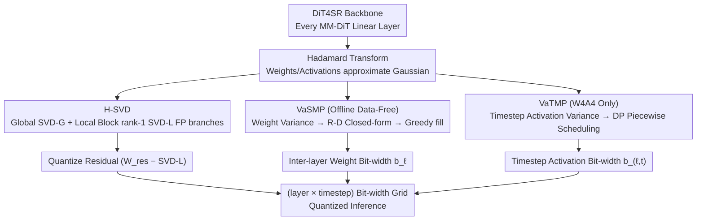

# Q-DiT4SR: Exploration of Detail-Preserving Diffusion Transformer Quantization for Real-World Image Super-Resolution

**Conference**: ICML 2026  
**arXiv**: [2602.01273](https://arxiv.org/abs/2602.01273)  
**Code**: https://github.com/xunzhang1128/Q-DiT4SR (To be released)  
**Area**: Model Compression / Diffusion Model Quantization / Real-World Image Super-Resolution  
**Keywords**: PTQ, Diffusion Transformer, Hierarchical SVD, Mixed Precision, Real-ISR

## TL;DR
This paper introduces Q-DiT4SR, the first PTQ framework designed for DiT-based Real-World Image Super-Resolution (Real-ISR). It preserves high-frequency details through a "global low-rank + local block-wise rank-1" hierarchical SVD decomposition (H-SVD). Furthermore, it proposes data-free inter-layer weight bit-width allocation (VaSMP) based on rate-distortion theory and dynamic programming-based timestep activation bit-width scheduling (VaTMP). Q-DiT4SR achieves SOTA performance under ultra-low bit settings of W4A6 / W4A4, compressing the model by 5.8× and reducing computations by 6.14×.

## Background & Motivation

**Background**: Real-World Image Super-Resolution (Real-ISR) has evolved from CNN/Transformer-based methods to diffusion models. Recent Diffusion Transformer (DiT) based methods (e.g., DiT4SR, DreamClear) have achieved superior texture restoration using pure DiT architectures with all-linear layers and self-attention. However, DiT models possess massive parameter counts and computational demands, further amplified by iterative denoising, making deployment challenging.

**Limitations of Prior Work**: PTQ is a recognized low-cost acceleration solution, but current methods generally fall into two categories that do not directly suit DiT-based Real-ISR: (1) General diffusion model PTQ (Q-Diffusion, PTQD, TDQ) designed for U-Net and text-to-image tasks, which leads to severe high-frequency texture degradation when migrated to DiT-SR; (2) DiT-specific PTQ (PTQ4DiT, Q-Dit, SVDQuant) aimed at text-to-image generation, which is unfriendly to the local details required for "pixel-level fidelity" in SR tasks, typically failing under W4A4 settings.

**Key Challenge**: The authors identify three specific deficiencies: ① Existing SVD low-rank decompositions are too "global," treating high-frequency residuals as noise to be discarded, whereas SR relies precisely on these residuals; ② Weight variances differ across DiT layers by several orders of magnitude, yet they are assigned uniform bit-widths; ③ Activation variances fluctuate significantly across the diffusion sampling trajectory, but existing methods use "time-invariant" static precision allocation.

**Goal**: To address weight reconstruction accuracy, inter-layer weight bit-width allocation, and timestep-wise activation bit-width scheduling for DiT-based Real-ISR under W4A6 / W4A4 settings, while avoiding expensive calibration processes.

**Key Insight**: Two key observations: (a) PCA analysis reveals that removing the first 128 principal components of DiT layer outputs significantly damages SR quality, indicating that dominant components must be preserved in FP; (b) After Hadamard transformation, weights and activations approximate a Gaussian distribution, where variance directly determines uniform quantization distortion. Thus, "variance" serves as a natural proxy for sensitivity.

**Core Idea**: Use hierarchical SVD ("global low-rank + local block rank-1") to more thoroughly preserve FP information flow; utilize "variance-driven + rate-distortion theory" through closed-form solutions and greedy discretization for data-free layer-wise bit allocation; and apply "variance-driven + dynamic programming" for intra-layer timestep activation bit-width scheduling.

## Method

### Overall Architecture
Q-DiT4SR uses DiT4SR as the backbone, where all MM-DiT blocks are quantized (Softmax is kept at 8-bit for numerical stability). Every linear layer first undergoes a Hadamard transform (to make weights/activations approximate Gaussian, a prerequisite for quantization and variance analysis). Then, three independent but cascaded processes follow: ① H-SVD splits the weights into two FP branches, "Global SVD-G + Local Block rank-1 SVD-L," applying quantization only to the "Weight Residual − SVD-L"; ② VaSMP solves a rate-distortion problem during the offline stage using per-layer weight variance $\bar{\sigma}^2_\ell$ to determine the layer's weight bit-width $b_\ell$; ③ VaTMP (enabled only for W4A4) collects activation variances $v_{\ell,t}$ per layer and per timestep on a small calibration set (32 LR images) and uses dynamic programming to find a "piecewise constant" timestep bit-width schedule. These three orthogonal steps result in a (layer × timestep) bit-width grid for inference.

### Key Designs

**1. H-SVD: Preserving High-Frequencies from the Quantizer using Dual FP Branches**

Super-resolution tasks suffer when methods like SVDQuant only keep a single global SVD branch, as this pushes all "non-low-rank components" into the quantizer, whereas SR depends on local high-frequency residuals. H-SVD splits each Hadamard-transformed weight $\mathbf{W}_H = \mathbf{W}\mathbf{H}_n$ into two FP branches before quantizing the remainder: first, a truncated SVD extracts the global rank-$r$ branch $\mathbf{W}_{\text{SVD-G}}$; second, the residual $\mathbf{W}_{\text{res}} = \mathbf{W}_H - \mathbf{W}_{\text{SVD-G}}$ is partitioned into $s_o \times s_i$ small blocks, and a rank-1 SVD $\mathbf{W}^{(p,q)} \approx \sigma_{p,q}\mathbf{u}_{p,q}\mathbf{v}_{p,q}^\top$ is performed on each block to form the local branch $\mathbf{W}_{\text{SVD-L}}$. Block sizes $(s_o, s_i)$ are grid-searched under the budget constraint $P_{\text{SVD-L}} \lesssim P_{\text{SVD-G}}(r)$ to maximize local texture capture while matching the parameter count of the global branch. The final reconstruction is $\hat{\mathbf{W}} = (\mathbf{W}_{\text{SVD-G}} + \mathbf{W}_{\text{SVD-L}} + Q_w(\mathbf{W}_{\text{res}} - \mathbf{W}_{\text{SVD-L}}))\mathbf{H}_n^\top$. This allows the quantizer to handle much finer-grained residuals, with error masked by both FP branches. Effectiveness is demonstrated in Figure 4, where H-SVD projections in the FP principal component space are significantly closer to the original FP model than single-branch schemes.

**2. VaSMP: Variance-Driven Rate-Distortion Solution for Data-Free Layer-wise Bit Allocation**

DiT weight variances vary by orders of magnitude across layers, making uniform bit-width inefficient. Standard mixed-precision methods (HAWQ, MixDQ, MPQ-DM) require Hessian calculations or iterative forward passes, which are costly. VaSMP leverages the fact that inter-layer variance is a clean proxy for sensitivity. Specifically, based on high-rate approximation $\mathbb{E}[e^2] \propto \sigma^2 \cdot 2^{-2b}$, layer-wise distortion is modeled as $D_\ell(b_\ell) \propto N_\ell \bar{\sigma}_\ell^2 2^{-2b_\ell}$ (where $\bar{\sigma}_\ell^2$ is the mean output channel variance and $N_\ell$ is the parameter count). Solving the Lagrangian under the budget $\sum_\ell w_\ell b_\ell = B_{\text{target}} \sum_\ell w_\ell$ ($w_\ell = N_\ell$) yields a continuous closed-form solution: $b_\ell^* = B_{\text{target}} + \tfrac{1}{2}(\log_2 \bar{\sigma}_\ell^2 - \overline{\log_2 \bar{\sigma}})$, meaning layers with higher variance receive more bits. Bits are then initialized via $\text{clip}(\lfloor b_\ell^* \rfloor, b_{\min}, b_{\max})$ and remaining bits are allocated using a greedy approach based on gain $\text{Gain}_\ell \propto \bar{\sigma}_\ell^2 \cdot 4^{-b_\ell}$. This process is entirely data-free and relies only on offline statistics in the Hadamard domain. Ablations (Table 3) confirm that this "closed-form + greedy" approach is more robust than naive MSE-based inter-layer allocation.

**3. VaTMP: DP-based Timestep Scheduling for Activation Bit-widths in W4A4**

Diffusion SR activation variance follows a distinct "rise-then-fall" structure along the sampling trajectory (Figure 6). Static bit-widths are either wasteful at low-sensitivity steps or fail at high-sensitivity steps. VaTMP targets the "intra-layer temporal dimension" for bit allocation, specifically for W4A4 scenarios where activation precision is the bottleneck. It partitions $T_\ell$ timesteps into segments, assigning activation bit-width $b_{\ell,t} \in \{2,3,\dots,8\}$ to each. Under the constraint $\sum_t b_{\ell,t} \le B_\ell$, it minimizes total distortion. Given a Gaussian assumption $z \sim \mathcal{N}(0, v_{\ell,t})$ and optimal clipping threshold $A = \sqrt{v_{\ell,t}} A^\star(b)$, the step-wise distortion is $D_{\ell,t}(b) = v_{\ell,t} \cdot \kappa(b)$. Token variances $v_{\ell,t} = \tfrac{1}{NC}\sum_n \|\mathbf{z}_n^{(\ell,t)}\|_2^2$ are collected on a small calibration set. The optimal scheduling is then solved as an optimal partitioning problem with segment cost $\text{SegCost}(i,j;b) = \kappa(b)\sum_{t=i}^{j-1} v_{\ell,t}$ using dynamic programming. This ensures high-variance (more sensitive) timesteps receive higher bit-widths.

### Loss & Training
Q-DiT4SR is a PTQ framework and requires no retraining. VaSMP is entirely data-free. VaTMP requires only a small calibration set of 32 LR images cropped to $128 \times 128$ purely to collect activation variances. All computations were performed on an NVIDIA RTX A6000. The backbone used is DiT4SR for $\times 4$ SR.

## Key Experimental Results

### Main Results

Compared against Q-Diffusion, EfficientDM, PTQ4DiT, QuaRot, SVDQuant, Q-DiT, PassionSR, FlatQuant, and QueST under W4A6 / W4A4 settings on DrealSR, RealSR, RealLR200, and RealLQ250. Selected results purely on RealSR (lower is better for LPIPS, higher for others):

| Dataset / Setting | Metric | FP | SVDQuant | Q-DiT | FlatQuant | Q-DiT4SR (Ours) |
|--------|------|------|----------|-------|-----------|-----------------|
| RealSR W4A6 | MUSIQ ↑ | 67.89 | 66.63 | 59.02 | 57.11 | **67.72** |
| RealSR W4A6 | LIQE ↑ | 3.988 | 3.434 | 1.790 | 2.455 | **3.980** |
| RealSR W4A4 | MUSIQ ↑ | 67.89 | 63.14 | 59.97 | 59.41 | **66.36** |
| RealSR W4A4 | LIQE ↑ | 3.988 | 3.115 | 2.009 | 1.996 | **3.179** |
| RealLR200 W4A4 | MUSIQ ↑ | 70.33 | 67.37 | 58.16 | 56.47 | **68.98** |

Under W4A4, Q-DiT4SR reduces Peak Memory from 15086 to 3974 MiB, achieving ~4.5× end-to-end acceleration. Quantized linear layers specifically show an acceleration of **8.99×** (1580.91 ms to 175.88 ms), with 5.8× model size reduction and 6.14× computation reduction.

### Ablation Study

| Config (RealSR W4A4) | MUSIQ ↑ | MANIQA ↑ | CLIP-IQA ↑ | LIQE ↑ |
|------|---------|----------|------------|--------|
| Baseline (Naive PTQ) | 64.94 | 0.4111 | 0.4899 | 3.191 |
| + H-SVD + VaSMP | 65.83 | 0.4227 | 0.4922 | 3.091 |
| + H-SVD + VaSMP + VaTMP (Full) | **66.36** | **0.4367** | **0.4956** | **3.179** |

SVD-L rank ablation (Table 2): rank 8 was selected as the best balance between performance (MUSIQ 67.72) and parameter overhead.

### Key Findings
- The three modules address three independent error sources: H-SVD for "weight reconstruction accuracy," VaSMP for "inter-layer budget allocation," and VaTMP for "timestep activation precision."
- Naive mixed-precision (optimizing global MSE) performs worse than H-SVD because end-to-end MSE can misinterpret sensitivity signals in non-convex PTQ; VaSMP’s variance-driven closed-form approach is more stable.
- Some IQA metrics (like MANIQA) can yield misleadingly high scores for heavily quantized models due to "sharpness noise," whereas LPIPS and LIQE more accurately reflect the visual degradation.

## Highlights & Insights
- **Design Philosophy**: The dual FP branches (H-SVD) explicitly decompose weight space into "global structure + local texture + quantizable residual," ensuring the quantizer only handles fine-grained details that FP branches cannot capture.
- **Closed-form R-D Mixed Precision**: Formulating bit allocation as a mathematical optimization with analytical solutions, rather than an iterative process, makes mixed precision "free" to implement.
- **Unified Variance Proxy**: Using variance in the Hadamard domain as a proxy for sensitivity across both layers and timesteps provides a theoretically clean framework ($D \propto \sigma^2 \cdot 2^{-2b}$).

## Limitations & Future Work
- **Limitations**: (1) Dependence on Gaussian approximation after Hadamard transform; (2) DP complexity for VaTMP may scale poorly with high timestep counts (e.g., >1000); (3) Evaluation is limited to the DiT4SR backbone.
- **Future Work**: Combine with KV-cache quantization for end-to-end DiT inference; integrate bit-width scheduling with joint sampler optimization.

## Related Work & Insights
- **vs. SVDQuant (ICLR 2025)**: SVDQuant uses only a single global FP branch; Q-DiT4SR adds a block-wise rank-1 branch to specifically protect high-frequency SR features.
- **vs. PTQ4DiT / Q-DiT**: These general DiT schemes fail to handle the high-sensitivity requirements of pixel-level super-resolution, collapsing at W4A4.
- **vs. PassionSR (CVPR 2025)**: PassionSR is limited to one-step U-Net models; Q-DiT4SR is specifically tailored for iterative DiT architectures.

## Rating
- Novelty: ⭐⭐⭐⭐ Innovative application of hierarchical SVD and closed-form R-D bit allocation for the niche but high-impact DiT-SR task.
- Experimental Thoroughness: ⭐⭐⭐⭐ Comprehensive testing across four benchmarks and nine baselines, though focused on a single backbone.
- Writing Quality: ⭐⭐⭐⭐ Clear derivations and intuitive visualizations.
- Value: ⭐⭐⭐⭐ High practical value for deploying DiT-based SR models on edge devices.

<!-- RELATED:START -->

## Related Papers

- [\[AAAI 2026\] Realism Control One-step Diffusion for Real-World Image Super-Resolution](../../AAAI2026/image_generation/realism_control_one-step_diffusion_for_real-world_image_super-resolution.md)
- [\[AAAI 2026\] Continuous Degradation Modeling via Latent Flow Matching for Real-World Super-Resolution](../../AAAI2026/image_generation/continuous_degradation_modeling_via_latent_flow_matching_for_real-world_super-re.md)
- [\[AAAI 2026\] Mixture of Ranks with Degradation-Aware Routing for One-Step Real-World Image Super-Resolution](../../AAAI2026/image_generation/mixture_of_ranks_with_degradation-aware_routing_for_one-step_real-world_image_su.md)
- [\[CVPR 2026\] FRAMER: Frequency-Aligned Self-Distillation with Adaptive Modulation Leveraging Diffusion Priors for Real-World Image Super-Resolution](../../CVPR2026/image_generation/framer_frequency-aligned_self-distillation_with_adaptive_modulation_leveraging_d.md)
- [\[NeurIPS 2025\] DOVE: Efficient One-Step Diffusion Model for Real-World Video Super-Resolution](../../NeurIPS2025/image_generation/dove_efficient_one-step_diffusion_model_for_real-world_video_super-resolution.md)

<!-- RELATED:END -->
## Related Papers

- [\[AAAI 2026\] Realism Control One-step Diffusion for Real-World Image Super-Resolution](../../AAAI2026/image_generation/realism_control_one-step_diffusion_for_real-world_image_super-resolution.md)
- [\[AAAI 2026\] Continuous Degradation Modeling via Latent Flow Matching for Real-World Super-Resolution](../../AAAI2026/image_generation/continuous_degradation_modeling_via_latent_flow_matching_for_real-world_super-re.md)
- [\[AAAI 2026\] Mixture of Ranks with Degradation-Aware Routing for One-Step Real-World Image Super-Resolution](../../AAAI2026/image_generation/mixture_of_ranks_with_degradation-aware_routing_for_one-step_real-world_image_su.md)
- [\[CVPR 2026\] FRAMER: Frequency-Aligned Self-Distillation with Adaptive Modulation Leveraging Diffusion Priors for Real-World Image Super-Resolution](../../CVPR2026/image_generation/framer_frequency-aligned_self-distillation_with_adaptive_modulation_leveraging_d.md)
- [\[NeurIPS 2025\] DOVE: Efficient One-Step Diffusion Model for Real-World Video Super-Resolution](../../NeurIPS2025/image_generation/dove_efficient_one-step_diffusion_model_for_real-world_video_super-resolution.md)

<!-- RELATED:END -->
