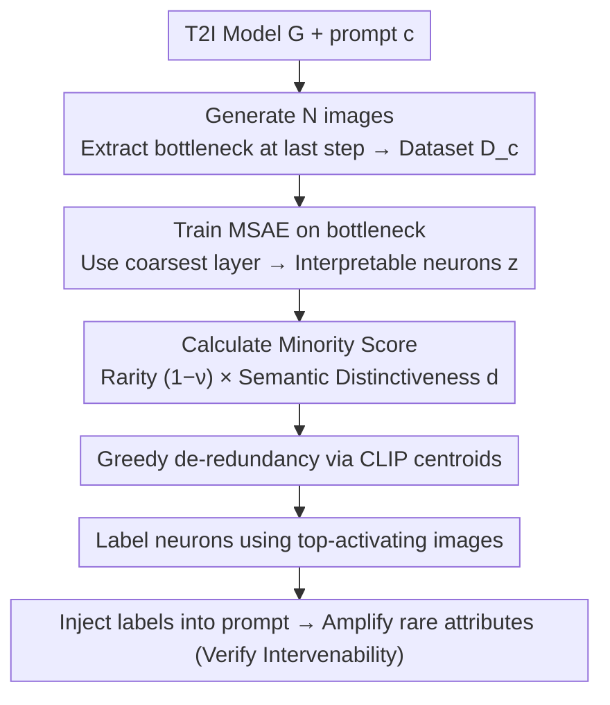

# RAIGen: Rare Attribute Identification in Text-to-Image Generative Models

**Conference**: ICML 2026  
**arXiv**: [2602.06806](https://arxiv.org/abs/2602.06806)  
**Code**: https://vssilpa.github.io/RAIGen_webpage/ (Project Homepage)  
**Area**: Diffusion Models / Image Generation / Model Explainability / Bias Auditing  
**Keywords**: Diffusion models, Sparse Autoencoders, minority attribute discovery, bias auditing, T2I generation

## TL;DR
RAIGen utilizes Matryoshka Sparse Autoencoders (MSAE) to decompose the bottleneck representations of T2I diffusion models into interpretable neurons. By applying a combined score of "activation rarity $\times$ CLIP semantic distinctiveness," it identifies minority neurons that are "internally encoded but rarely appear in generation," extending bias auditing from "predefined categories" and "salient majority patterns" to label-free rare attribute discovery.

## Background & Motivation

**Background**: T2I diffusion models (Stable Diffusion, SDXL, FLUX, etc.) produce high-fidelity images but inherit and amplify attribute biases from training data. Existing debiasing methods follow two paths: closed-set methods (e.g., fair diffusion based on gender/race, classifier-free guidance, learnable projection modules) can only handle predefined categories; open-set methods (e.g., OpenBias) rely on external LLMs to propose candidate attributes and VQA for voting to discover unknown biases, but they primarily expose **majority attributes** (patterns that over-appear in generation).

**Limitations of Prior Work**: Closed-set methods rely on manual categorization, failing to cover non-equity-oriented minority patterns such as "rare attire, cultural symbols, or composition modes." Open-set methods treat the model as a black box and rely on external world models to infer attributes, revealing "what is over-generated" rather than "what is suppressed." In Appendix G.1, the authors empirically demonstrate that merely suppressing majority attributes does not uniformly redistribute probability mass to minority groups but instead redistributes it unevenly among other minority groups.

**Key Challenge**: The presence of minority attributes cannot be inferred solely from the output. A model can **internally encode** a concept yet rarely output it during sampling (e.g., while "teachers" in LAION are nearly gender-balanced, SD outputs are heavily male-skewed). To find these "suppressed minority attributes," one must **inspect internal model representations** rather than just looking at generated images.

**Goal**: (1) Propose a label-free framework to extract attributes that are "encoded but systematically under-expressed" directly from internal representations without any prior knowledge of minority categories; (2) Provide a quantitative minority score for each candidate neuron; (3) Verify that these attributes can be targeted and amplified during generation.

**Key Insight**: Diffusion bottleneck representations are naturally entangled and unreadable. Recently, Matryoshka Sparse Autoencoders (MSAE) demonstrated hierarchical and interpretable conceptual decomposition on CLIP. The authors train MSAE on the diffusion bottleneck and select the **coarsest granularity layer** (finer levels tend to fragment single concepts into part-features, unnecessarily increasing the search space).

**Core Idea**: After decomposing representations into sparse neurons using MSAE, a "minority attribute neuron" should simultaneously satisfy two conditions: **low activation frequency** (rarely fires) and **top-activating images that significantly deviate from the global semantic center in CLIP space** (distinct). The product of these two gives the Minority Score $s(\mathbf{z}) = \mathbf{d} \odot (\mathbf{1} - \boldsymbol{\nu})$.

## Method

### Overall Architecture
RAIGen aims to answer a question invisible at the output stage: which attributes are already encoded within the model but almost never rendered. The approach moves this problem into the internal representations of the diffusion model. Given a T2I model $G$ and prompt $\mathbf{c}$, $N$ images are generated, and the bottleneck representation $\mathbf{h} \in \mathbb{R}^{h \times w \times n}$ is extracted at the final denoising step. Each spatial location is treated as an $n$-dimensional sample to form a dataset $\mathcal{D}_c = \{(\mathbf{h}^{(j)}, \mathbf{x}^{(j)})\}$. Then, an MSAE is trained on these vectors to decompose entangled representations into interpretable neurons. A "minority score" is calculated for each neuron followed by semantic de-redundancy. Finally, top-activating images are used to label the winning neurons, and these labels are injected back into the prompt to verify if the rare attributes can be amplified. This pipeline requires no prior minority categories and uncovers "suppressed concepts" directly from internal representations.

### Key Designs

**1. Training MSAE on the diffusion bottleneck and using only the coarsest layer**

Diffusion bottleneck representations are entangled, making it impossible to read "which concepts are encoded here." The authors use MSAE to decompose them into sparse interpretable neurons $\mathbf{z} = \{z_1, \dots, z_d\}$. MSAE trains a single encoder/decoder pair using a set of increasing Top-$k$ operators $\{k_1 < k_2 < \dots < k_f = d\}$, with a training objective defined by the weighted sum of reconstruction errors at different sparsity levels: $\mathcal{L}_{\text{MSAE}} = \sum_i \alpha_i \|\mathbf{r} - \hat{\mathbf{r}}^{(k_i)}\|_2^2$. This makes "concept granularity" a controllable knob. A crucial counter-intuitive choice is: despite MSAE's multi-granularity capability, the authors **only use the coarsest layer $k_1$**. Finer layers fragment "female doctor" into part-features like "white coat sleeves + curly hair + stethoscope," which theoretically locates finer attributes but practically explodes the search space with false-positive rare neurons. Ensuring neurons are stable, human-readable semantic units is an engineering trade-off of "granularity for interpretability and coverage."

**2. Scoring each neuron with Minority Score = Rarity $\times$ Semantic Distinctiveness**

Identifying "minority attribute candidates" from neurons requires a metric. The observation is that truly suppressed minority attribute neurons must satisfy two conditions: low activation frequency and representation of images that deviate significantly from the semantic center. The Minority Score is decomposed into two orthogonal observables. First is **activation frequency** $\nu_i = |\{(\mathbf{h}, \mathbf{x}) \in \mathcal{D}_c : z_i(\mathbf{h}) > 0\}| / |\mathcal{D}_c|$, where lower signifies rarity. Second is **semantic distinctiveness** $d_i$, defined as the cosine distance between the neuron's activation-weighted CLIP centroid $\mu_i = \sum z_i(\mathbf{h}) \cdot \text{CLIP}(\mathbf{x}) / \sum z_i(\mathbf{h})$ and the global CLIP centroid $\mu_{\mathcal{D}_c}$. Both terms are min–max normalized to $[0,1]$ before element-wise multiplication: $s(\mathbf{z}) = \mathbf{d} \odot (\mathbf{1} - \boldsymbol{\nu})$. Higher scores indicate "internally encoded, externally suppressed" true minority attributes. This product is necessary because low $\nu$ might just be noise, and high $d$ might be high-frequency but skewed semantic clusters. Experiments in Appendix G.10 confirm both terms are indispensable.

**3. Greedy de-redundancy via CLIP centroid distance**

MSAE often distributes the same minority concept (e.g., "curly-haired female doctor") across multiple high-scoring neurons. To avoid redundant entries in the Top-K list, neurons are traversed in descending order of Minority Score. For each retained neuron, others with a centroid $\mu_i$ within a cosine distance threshold $\tau$ are removed—essentially a greedy NMS using semantic distance. The threshold $\tau$ controls semantic redundancy, ensuring the final set is semantically distinct without needing to pre-specify the number of attributes.

### Loss & Training
The sole training objective is the multi-sparsity reconstruction error sum $\mathcal{L}_{\text{MSAE}} = \sum_{i=1}^{f} \alpha_i \|\mathbf{r} - \hat{\mathbf{r}}^{(k_i)}\|_2^2$. Minority Score calculation and de-redundancy are forward-pass operations involving no gradients. Bottleneck representations are extracted only at the final denoising step $t = T_{\text{final}}$, where semantic information is most complete. The framework is architecture-agnostic: for U-Net models (SD 1.4/2/XL), the bottleneck is used; for transformer-based FLUX.1-schnell, hook points are fixed at `transformer.transformer_blocks.18` with 4-step sampling. Neuron labeling is performed using top-activating images and activation heatmaps via human inspection or MLLMs (e.g., GPT-5.2).

> ⚠️ Model names such as GPT-5.2 / Llama 4-Scout are kept as per the original text.

## Key Experimental Results

### Main Results

**Main Results (Attribute Presence: lower is rarer, compared to OpenBias majority attributes)**:

| Model | Method | WinoBias (↓) | COCO (↓) |
|------|------|--------------|----------|
| SD v1.4 | OpenBias (Majority) | 0.941 | 0.933 |
| SD v1.4 | **RAIGen (Ours)** | **0.205** | **0.220** |
| SDXL | OpenBias (Majority) | 0.941 | 0.933 |
| SDXL | **RAIGen (Ours)** | **0.194** | **0.199** |

Attributes discovered by RAIGen appear only $\sim 20\%$ of the time, whereas OpenBias majority attributes appear $\sim 94\%$. This proves RAIGen uncovers suppressed rare patterns rather than salient majorities. Rarity is slightly lower on SDXL than SD v1.4, suggesting that larger model capacity does not automatically result in higher coverage of rare patterns.

**Amplification via prompt revision (WinoBias)**:

| Model | Prompt | NLL (↑) | Dev. ratio (↓) | CLIP Align. (↑) |
|------|--------|---------|----------------|-----------------|
| SD v1.4 | Base | 1.917 | 0.50 | 20.30 |
| SD v1.4 | RAIGen-Revised | 1.935 | **0.22** | 19.80 |
| SDXL | Base | 1.812 | 0.49 | 27.26 |
| SDXL | RAIGen-Revised | 1.852 | **0.23** | 26.89 |

Injecting RAIGen's discovered minority attribute labels into prompts via Llama 4-Scout reduced distribution deviation from $\sim 0.5$ to $\sim 0.22$ (closer to uniform). NLL increased slightly (entering low-density regions of the original distribution), while CLIP alignment dropped only by $\sim 0.5$, maintaining semantic integrity.

**User Study (25 participants, 5 occupations, Top-6 minority attributes per occupation, estimated occurrences out of 10 images)**:

| Occupation | Avg. Occurrences (↓) | 95% CI |
|------|----------------|--------|
| Analyst | 1.35 | [1.03, 1.67] |
| **CEO** | **0.70** | [0.44, 0.96] |
| Doctor | 1.18 | [0.97, 1.39] |
| Salesperson | 1.45 | [0.99, 1.91] |
| Sheriff | 2.64 | [2.21, 3.07] |

RAIGen attribute occurrences were $< 3/10$ across all occupations, with CEO being the rarest ($0.70/10$). This confirms human perception of "internally encoded but rare in generation" attributes.

### Key Findings
- Frequency alone is sufficient in toy settings (Spearman $\rho \approx 0.991$), but real SD representations require distinctiveness for stability; Appendix G.10 shows removing either term significantly degrades rare neuron recall.
- Limiting analysis to the coarsest MSAE layer is a critical engineering choice: while finer layers could theoretically locate more granular attributes, they produce fragmented "part-features" that the authors consciously avoid.
- The framework is architecture-agnostic: it works on both U-Net (SD 1.4/2/XL) and transformer-based DiT (FLUX.1-schnell). On FLUX, Attribute Presence is $0.11$, though it shows a higher ratio of high-score but weakly interpretable neurons, likely due to a lack of explicit spatial alignment in transformer hook points compared to U-Net bottlenecks.
- Attributes revealed by RAIGen go beyond social fairness categories: besides "female doctors," it uncovers stylistic/compositional rare patterns like "doctor portraits inside frames" or "side-view trains with motion blur."

## Highlights & Insights
- **Defining "what is not generated" as an independent task**: While prior fairness methods perform "debiasing of known categories" and OpenBias performs "discovery of unknown majority attributes," this work establishes "discovery of unknown minority attributes" as a third niche with a label-free solution.
- **Clean "rarity $\times$ distinctiveness" design**: Low-frequency neurons are often polluted by noise. Instead of over-complicating the frequency definition, the authors introduce the orthogonal CLIP-centroid distance as a secondary filter. The product form is simple enough to implement in a single line of code yet covers both "rare" and "meaningful" conditions.
- **Counter-intuitive choice of coarsest-layer only**: While MSAE's selling point is multi-granularity, the authors demonstrate that finer is not always better for minority discovery, as it fragments concepts and increases false positives. This lesson is valuable for any downstream task using SAE for concept discovery.
- **Discovery → Amplification loop**: Beyond identifying rare attributes, using an LLM to inject labels into prompts via "prompt revision" halves the distribution deviation. This confirms that the discovered attributes are intervenable, making RAIGen a mitigation pre-module rather than just an auditing tool.

## Limitations & Future Work
- RAIGen can only find minority attributes that are **already encoded** by the model; social minorities entirely missing from the model's knowledge will still be overlooked. Hybrid auditing with LLM-based external priors is a more comprehensive direction.
- The Minority Score is asymmetric: "high score = minority" holds true, but "low score = majority" does not (low scores can stem from noise or non-distinctive neurons), as detailed in Appendix G.3.
- The pipeline relies heavily on CLIP as a "semantic prior." Biases within CLIP itself (e.g., weak encoding of certain ethnicities or cultures) will pollute the distinctiveness evaluation—a key compromise for being label-free.
- Hook point selection for transformer-based diffusion (FLUX) lacks systematicity, currently fixed at `transformer_blocks.18`. Establishing a systematic approach for selecting hook points in attention/MLP streams is left for future work.
- Dual ethical risk: These capabilities could be misused to target and generate sensitive or stereotypical images. The authors emphasize the necessity of governance and safeguards in the Impact Statement.

## Related Work & Insights
- **vs OpenBias (D'Incà et al., CVPR 2024)**: OpenBias uses LLM proposals + VQA voting to find **majority** attributes based on external world models; RAIGen looks inside the model for **minority** attributes. They are complementary.
- **vs DiffLens / SAeUron (Cywiński & Deja, ICML 2025)**: These use SAE to intervene on **predefined** sensitive attributes or unlearning targets (downstream mitigation); RAIGen is upstream discovery.
- **vs Fair Diffusion / Debiased Prompts (Chuang et al., Friedrich et al.)**: Traditional methods require manual categories (gender/race). RAIGen bypasses category priors and uncovers non-equity-oriented rare patterns (composition, cultural symbols) that these methods cannot see.
- **vs Matryoshka SAE for CLIP (Pach et al., 2025)**: Borrows the Matryoshka idea from CLIP to the diffusion bottleneck but challenges the "multi-granularity = multi-gain" assumption by proving the utility of the coarsest layer.

## Rating
- Novelty: ⭐⭐⭐⭐⭐ Establishes label-free rare attribute discovery as an independent task; the rarity $\times$ distinctiveness score is elegant and effective.
- Experimental Thoroughness: ⭐⭐⭐⭐ Tested on SD v1.4/2/XL and FLUX; covers WinoBias, COCO, user studies, and amplification, though dataset scale and baseline count could be higher.
- Writing Quality: ⭐⭐⭐⭐ Clear formal definitions (Def. 1/2), consistent notation, and a well-paced narrative from toy experiments to human verification.
- Value: ⭐⭐⭐⭐ Provides a complementary "other eye" to OpenBias for T2I auditing; the discovery-intervention loop is verified, offering both tool and conceptual value.

<!-- RELATED:START -->

## Related Papers

- [\[ICML 2026\] Content-Style Identification via Differential Independence](content-style_identification_via_differential_independence.md)
- [\[ICML 2026\] Alignment-Guided Score Matching for Text-to-Image Alignment in Diffusion Models](alignment-guided_score_matching_for_text-to-image_alignment_in_diffusion_models.md)
- [\[ICML 2025\] Origin Identification for Text-Guided Image-to-Image Diffusion Models](../../ICML2025/image_generation/origin_identification_for_text-guided_image-to-image_diffusion_models.md)
- [\[ICML 2026\] SAEmnesia: Erasing Concepts in Diffusion Models with Supervised Sparse Autoencoders](saemnesia_erasing_concepts_in_diffusion_models_with_supervised_sparse_autoencode.md)
- [\[ICLR 2026\] AttriCtrl: A Generalizable Framework for Controlling Semantic Attribute Intensity in Diffusion Models](../../ICLR2026/image_generation/attrictrl_a_generalizable_framework_for_controlling_semantic_attribute_intensity.md)

<!-- RELATED:END -->
