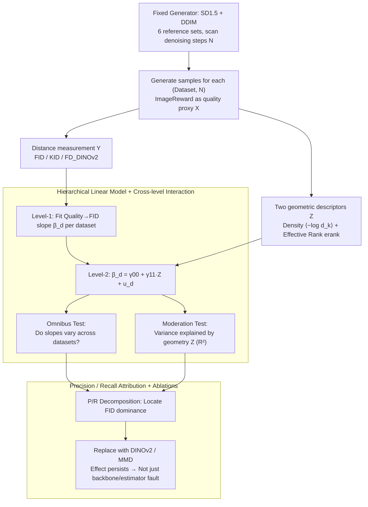

# Rethinking FID Through the Geometry of the Reference Dataset

**Conference**: ICML 2026  
**arXiv**: [2605.29335](https://arxiv.org/abs/2605.29335)  
**Code**: To be confirmed  
**Area**: Image Generation / Generative Model Evaluation  
**Keywords**: FID, Generative Evaluation, Reference Set Geometry, Distribution Density, Effective Rank

## TL;DR
This paper demonstrates that the "lower-is-better" assumption of FID systematically fails across different reference datasets. By introducing two geometric descriptors—distribution density $\langle -\log d_k\rangle$ and effective rank $\mathrm{erank}(A)$—the authors use hierarchical linear modeling to prove these descriptors explain ~70% of the cross-dataset variance in the "sample quality → FID" slope, providing the first quantitative attribution of FID's fragility to the reference set itself.

## Background & Motivation

**Background**: FID, which utilizes Inception-v3 features and the Fréchet distance to measure the discrepancy between generated and reference distributions, has become the de facto evaluation standard for image generation. It serves as the primary benchmark in nearly all papers involving diffusion, GAN, and autoregressive models.

**Limitations of Prior Work**: Recent counter-examples have emerged—Choi et al. (2025) showed that extra compute on COCO yields clearer images but worse FID; Lee et al. (2025) found that tuning hyperparameters for minimum FID results in the worst ImageReward scores; Jayasumana et al. (2024) demonstrated that stronger image perturbations can paradoxically improve FID. These findings suggest that "FID decrease = quality increase" no longer holds in practice.

**Key Challenge**: Previous explanations either blame the fragility of Inception-v3 features (Kynkäänniemi et al. 2022, Parmar et al. 2022) or the instability of Fréchet distance for long-tail estimation (Chong & Forsyth 2020). However, the other core component of FID—the reference dataset itself—has rarely been scrutinized. How are reference sets selected? Why does FID work on CelebA-HQ but fail on COCO? Are there quantifiable "geometric" differences between them?

**Goal**: To formalize how the reference set shapes FID and to identify a small set of geometric descriptors that can predict the behavioral variance of FID across different reference sets.

**Key Insight**: As a distribution distance, FID naturally depends on two aspects of the reference set: its clustering density in feature space and the number of principal directions it spans (effective dimension). Single-modality datasets like CelebA-HQ and multi-category open-domain datasets like COCO occupy different regions of the feature space, which should lead to different FID response directions.

**Core Idea**: Characterize reference set geometry using two scalars—mean kNN log-density and effective rank. Then, employ a two-level hierarchical linear model (HLM) to explicitly model the "sample quality → FID" slope as a function of the reference set geometry and perform statistical tests across datasets.

## Method

### Overall Architecture
The study fixes a generator (Stable Diffusion 1.5 + DDIM) and generates images across six reference sets with diverse semantic spans (FFHQ, CelebA-HQ, MJHQ-30K, ImageNet, Flickr30K, COCO). Quality is controlled by scanning denoising steps $N \in \{15, 20, \dots, 50\}$, with ImageReward serving as a quality proxy. Two steps follow: (1) calculating two geometric descriptors for each dataset; (2) using HLM to test if slope differences are explained by these geometric quantities. Finally, FID is decomposed into precision/recall to identify the dominant side, and ablations are performed by replacing Inception-v3 (with DINOv2) and Fréchet (with MMD/KID).

### Key Designs

**1. Two Geometric Descriptors: Characterizing Reference "Shape" via Density and Effective Rank**

To quantify how the reference set shapes FID, its feature space morphology must be compressed into comparable scalars. This paper selects two complementary ones: Distribution density is defined using a log-version of $k$-NN:

$$\langle -\log d_k\rangle = \frac{1}{n}\sum_i -\log d_k(x_i)$$

where $d_k(x_i)$ is the Euclidean distance to the $k$-th nearest neighbor ($k=80$). The log-average is used because the Loftsgaarden-Quesenberry estimator $\hat p(x)\propto d_k(x)^{-D}$ spans dozens of magnitudes in $D=2048$ dimensions. Effective rank is defined as the exponential of the Shannon entropy of normalized singular values: $\mathrm{erank}(A)=\exp(H(\bm\sigma/\|\bm\sigma\|_1))$, where $A$ is the centered feature matrix. This provides a continuous extension of dimensionality. Together, they distinguish distributions: CelebA-HQ is a compact single-modality (density $-2.36$, erank $1220$), while COCO is a spread-out open domain (density $-2.67$, erank $1337$).

**2. Hierarchical Linear Model (HLM): Testing if Geometry Explains Slope Variance**

Simple scatter plots of quality vs. FID are insufficient to quantify differences. The HLM splits the problem: Level-1 fits $Y=\alpha_d+\beta_d X+\epsilon$ within each dataset $d$ to obtain the within-dataset slope $\beta_d$. Level-2 regresses these slopes onto dataset-level geometric descriptors: $\beta_d=\gamma_{00}+\gamma_{11}Z_d+u_d$. Two tests are conducted: The Omnibus test uses a likelihood ratio test to check if all $\beta_d$ are equal, while the Moderation test uses a Wald test for $H_0:\gamma_{11}=0$ and reports $R^2_{\mathrm{slope}}$. Here, $X$ is $N$ or ImageReward, and $Y$ is FID (or KID/$\mathrm{FD_{DINOv2}}$).

**3. Precision / Recall Attribution + Ablations: Locating FID Bias**

To understand *why* FID changes, it is decomposed into precision (fidelity) and recall (coverage). The authors calculate $R^2(\text{Precision},\text{FID})$ and $R^2(\text{Recall},\text{FID})$ via OLS for each dataset. This explains the anomaly where COCO samples become more refined as steps increase, but modes narrow and recall drops, causing FID to worsen. To ensure this isn't merely an artifact of Inception-v3 or Fréchet distance, ablations replace the backbone with DINOv2 and the distance with MMD (KID), re-running the HLM tests.

## Key Experimental Results

### Main Results
Geometric descriptors of the six reference sets:

| Dataset | $\langle -\log d_k\rangle$ | $\mathrm{erank}(A)$ | Type |
|--------|------|------|------|
| FFHQ | $-2.48$ | $1243$ | Concentrated (Face) |
| CelebA-HQ | $-2.36$ | $1220$ | Concentrated (Face) |
| MJHQ-30K | $-2.74$ | $1341$ | Intermediate |
| ImageNet | $-2.68$ | $1431$ | Dispersed |
| Flickr30K | $-2.80$ | $1341$ | Dispersed |
| COCO | $-2.67$ | $1337$ | Dispersed |

Main Finding: As $N$ increases, FID decreases on CelebA-HQ/FFHQ (quality and FID align) but increases on COCO/Flickr30K/ImageNet (inverse relationship). Omnibus tests ($D = 44.3, p < .001$ for $X=N$; $D = 90.9, p < .001$ for $X=\text{ImageReward}$) strongly reject the hypothesis of uniform slopes.

### Ablation Study
Moderation test and ablation results:

| $X$ | $Y$ | $Z$ | $\gamma_{11}$ | $p$ | $R^2_{\mathrm{slope}}$ |
|------|------|------|------|------|------|
| $N$ | FID | $\langle -\log d_k\rangle$ | $-0.0323$ | $<.001$ | $0.707$ |
| $N$ | FID | $\mathrm{erank}$ | $0.0314$ | $.002$ | $0.661$ |
| IR | FID | $\langle -\log d_k\rangle$ | $-0.120$ | $.007$ | $0.548$ |
| IR | FID | $\mathrm{erank}$ | $0.119$ | $.010$ | $0.530$ |
| $N$ | KID | $\langle -\log d_k\rangle$ | $-0.0343$ | $<.001$ | $0.763$ |
| $N$ | FD$_{\text{DINOv2}}$ | $\langle -\log d_k\rangle$ | $-0.0108$ | $<.001$ | $0.827$ |

Precision / Recall Attribution ($R^2$): FFHQ 0.989 / 0.672, CelebA-HQ 0.951 / 0.001, ImageNet 0.690 / **0.949**, COCO 0.676 / **0.833**. In concentrated datasets, FID follows precision; in dispersed datasets, FID is dominated by recall.

### Key Findings
- Density coefficients are consistently negative, while effective rank coefficients are positive: Denser reference sets allow FID to align with quality improvement, whereas broader sets lead to inverse behavior.
- Switching to DINOv2 increased $R^2_{\mathrm{slope}}$ to $0.83$, proving this is not an Inception-v3 specific issue.
- On dispersed datasets, FID correlates strongly with recall (COCO $R^2 = 0.833$). The mechanism for the FID anomaly is: increased steps → finer samples but mode collapse/narrowing → recall drop → FID increase.
- Practical Conclusion: FID is reliable on concentrated sets (FFHQ, CelebA-HQ); on dispersed sets, geometric descriptors must be reported or alternative metrics used.

## Highlights & Insights
- **Metric fragility as a statistical problem**: Unlike previous anecdotal evidence, this work uses HLM to turn "reference set → slope variance" into a testable hypothesis with reportable $p$-values and $R^2$.
- **Explaining 70%+ variance with two descriptors**: Just two scalars (density and effective rank) explain over half of FID's behavioral differences, shifting benchmark selection from intuition to quantification.
- **Actionable reporting standards**: The authors suggest either using concentrated datasets for FID or reporting $\langle -\log d_k\rangle$ and $\mathrm{erank}$ alongside FID scores.
- **Metric Generality**: The effects are even stronger for KID and FD$_{\text{DINOv2}}$, indicating this is a common issue for "distributional metrics on a reference set."

## Limitations & Future Work
- Evaluation was limited to 6 datasets and 1 generator (SD 1.5). Conclusions need replication in more text-to-image or class-conditional settings.
- Geometric descriptors are chosen post-hoc; no learnable solution to directly "correct" geometric bias during FID calculation is provided.
- Quality proxies still rely on ImageReward, which is biased; human evaluation should be integrated into the regression.

## Related Work & Insights
- **vs. Kynkäänniemi et al. (2022, 2024)**: They blamed the Inception-v3 feature space; this paper shows the effect is stronger on DINOv2.
- **vs. Chong & Forsyth (2020)**: They blamed the Fréchet distance's estimation bias; this paper shows the effect persists with MMD.
- **vs. Jayasumana et al. (2024) CMMD**: CMMD proposes changing backbones and distances; this paper provides a more fundamental diagnosis based on reference set geometry.
- **vs. Precision/Recall (Kynkäänniemi 2019, Sajjadi 2018)**: While traditionally seen as complementary, this paper uses P/R to deconstruct FID's bias under different geometries.

<!-- RELATED:START -->

## Related Papers

- [\[ICML 2026\] Geometry-Aware Dataset Condensation for Diffusion Model Training](geometry-aware_dataset_condensation_for_diffusion_model_training.md)
- [\[ICML 2026\] Geometry-Aware Tabular Diffusion](geometry-aware_tabular_diffusion.md)
- [\[CVPR 2026\] Garments2Look: A Multi-Reference Dataset for High-Fidelity Outfit-Level Virtual Try-On with Clothing and Accessories](../../CVPR2026/image_generation/garments2look_a_multi-reference_dataset_for_high-fidelity_outfit-level_virtual_t.md)
- [\[ICML 2026\] Geometry-based Schrödinger Bridges for Trustworthy Multimodal Fusion](geometry-based_schrödinger_bridges_for_trustworthy_multimodal_fusion.md)
- [\[ICML 2026\] GASS: Geometry-Aware Spherical Sampling for Disentangled Diversity Enhancement in Text-to-Image Generation](gass_geometry-aware_spherical_sampling_for_disentangled_diversity_enhancement_in.md)

<!-- RELATED:END -->
