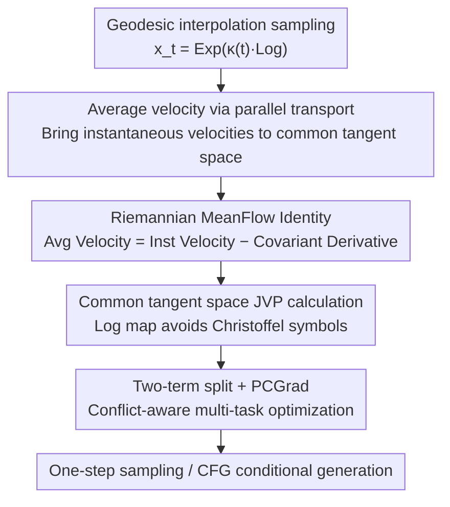

# Riemannian MeanFlow for One-Step Generation on Manifolds

**Conference**: ICML2026  
**arXiv**: [2603.10718](https://arxiv.org/abs/2603.10718)  
**Code**: Not provided in the paper  
**Area**: Diffusion Models / Flow Matching / Riemannian Manifold Generation  
**Keywords**: MeanFlow, Riemannian Manifold, One-step Generation, Average Velocity, Parallel Transport, Multi-task Optimization

## TL;DR
The paper extends the "average velocity one-step generation" of MeanFlow to Riemannian manifolds. By using **parallel transport** to move instantaneous velocities from different tangent spaces to a common one before averaging, it defines the average velocity on manifolds and derives the **Riemannian MeanFlow Identity**. It employs intrinsic training via log maps in the common tangent space (avoiding trajectory simulation and Christoffel symbols), decomposes the objective into two terms, and resolves gradient conflicts using PCGrad. The method achieves one-step sampling quality comparable to the strongest baselines on spheres, tori, SO(3), and SE(3), while significantly reducing sampling costs.

## Background & Motivation

**Background**: Flow Matching (FM) enables simulation-free training of generative models in Euclidean space. Riemannian Flow Matching (RFM) extends this to manifolds such as spheres, tori, and SO(3), maintaining benefits like simulation-free training and scalability. It learns a time-varying velocity field $v_t$ that induces a probability flow ODE mapping a base distribution to the data distribution.

**Limitations of Prior Work**: Although RFM training is simulation-free, **sampling still requires numerical integration of this ODE on the manifold**. High-quality samples often necessitate many integration steps, which is slow and expensive. While Euclidean space offers various accelerators (Progressive Distillation, Consistency Models, Shortcut, IMM, and MeanFlow which directly parameterizes long-range average velocity for stable one-step generation), porting these "average velocity-type" one-step methods to manifolds is **non-trivial**.

**Key Challenge**: Instantaneous velocities on a manifold are tangent vectors residing in **point-specific tangent spaces** $T_{x_t}\mathcal M$, which must be compared under the Riemannian metric. This means "average velocity" cannot be directly defined—simply time-averaging velocity vectors from different points is ill-defined, and naively applying Euclidean MeanFlow identities would break geometric consistency.

**Goal**: ① Provide a geometrically self-consistent definition of "manifold average velocity"; ② Derive a training objective identity that acts as a supervisory signal without requiring trajectory integration; ③ Avoid complex geometric calculations in implementation; ④ Address optimization instabilities arising from this formulation.

**Key Insight**: Since the problem stems from "different tangent spaces cannot be directly averaged," one should first use parallel transport to move instantaneous velocities along the trajectory to the current point's tangent space, then average them there—the only geometrically correct way to "average" on a manifold.

**Core Idea**: Define intrinsic average velocity via parallel transport $\to$ Derive the Riemannian MeanFlow Identity (average velocity = instantaneous velocity − covariant derivative term) $\to$ Use log maps in common tangent spaces to transform this into a training objective efficiently calculable via JVP.

## Method

### Overall Architecture

RMF aims to learn an average velocity field network $u_\theta(x_t,r,t)$ on a manifold $(\mathcal M,g)$ such that after training, one-step generation from noise $x_0$ to data $x_1$ can be achieved by setting $r=0,t=1$, bypassing numerical ODE integration. The framework follows four steps: ① Geometrically define average velocity on the manifold using parallel transport (Eq. 5); ② Differentiate the definition to derive the Riemannian MeanFlow Identity, replacing the "integral over the whole trajectory" with a trainable form involving "current instantaneous velocity + covariant derivative"; ③ Map the covariant derivative into a common tangent space using log maps and compute it via JVP, avoiding Christoffel symbols and trajectory simulation; ④ Decompose the loss into two terms and resolve gradient conflicts via PCGrad for conflict-aware multi-task optimization, supporting CFG conditional generation.

### Key Designs

**1. Defining average velocity via parallel transport: Making "average on manifolds" geometrically valid**

Euclidean MeanFlow defines average velocity over $[r,t]$ as $u=\tfrac{1}{t-r}\int_r^t v_\tau\,\mathrm d\tau$. On manifolds, $v(x_\tau,\tau)\in T_{x_\tau}\mathcal M$ are vectors in different tangent spaces, making direct integration meaningless. This paper uses the parallel transport operator $\mathcal P^\gamma_{\tau\to t}$ induced by the Levi–Civita connection to move each instantaneous velocity along trajectory $\gamma$ to the current tangent space $T_{x_t}\mathcal M$:

$$u(x_t,r,t)=\frac{1}{t-r}\int_r^t \mathcal P^{\gamma}_{\tau\to t}\big(v(x_\tau,\tau)\big)\,\mathrm d\tau$$

This integral is well-defined. When $\mathcal M=\mathbb R^d$, parallel transport becomes the identity map, and the equation reduces to the Euclidean time average. This step is the geometric foundation: it ensures the average velocity respects the manifold structure from the start.

**2. Riemannian MeanFlow Identity: Replacing "trajectory integration" with a "point-wise" trainable target**

Equation (5) is geometrically natural but cannot be used directly for supervision because it requires the full trajectory $\{x_\tau\}$ and parallel transport for every $\tau$. By multiplying both sides by $(t-r)$ and differentiating with respect to $t$, the authors derive the identity in Proposition 3.1:

$$u(x_t,r,t)=v(x_t,t)-(t-r)\,\nabla_{\dot\gamma(t)}u(x_t,r,t)$$

where $\nabla_{\dot\gamma(t)}u$ is the **covariant derivative** along the trajectory velocity. It implies that to supervise the average velocity, one only needs the current instantaneous velocity $v(x_t,t)$ and a local covariant derivative term, **completely bypassing time integration**. This is the manifold version of the MeanFlow "identity instead of integral" trick.

**3. Common Tangent Space + Log Map + JVP: Avoiding Christoffel symbols and trajectory simulation**

Calculating the covariant derivative in local coordinates requires handling local bases and Christoffel symbols. Instead, the authors work in the common tangent space $T_{x_t}\mathcal M$. Using geodesic interpolation $x_t=\operatorname{Exp}_{x_1}(\kappa(t)\operatorname{Log}_{x_1}(x_0))$ with $\kappa(t)=1-t$, the path velocity is $\dot x_t=\tfrac{1}{1-t}\operatorname{Log}_{x_t}(x_1)$. Replacing the covariant derivative with the network's directional derivative along the path yields the trainable objective:

$$u_{\text{gt}}(x_t,r,t):=v(x_t,t)-(t-r)\big(\dot x_t\,\partial_{x_t}u_\theta+\partial_t u_\theta\big)$$

The term $\dot x_t\,\partial_{x_t}u_\theta$ is computed efficiently via **Jacobian–vector product (JVP)**. This avoids both high-order derivatives and coordinate-based covariant calculations, making the intrinsic identity practical. The instantaneous velocity $v(x_t,t)$ is approximated by the network output at $r=t$, $v(x_t,t)\approx u_\theta(x_t,t,t)$.

**4. Two-term split + PCGrad: Stabilizing training with conflict-aware multi-task optimization**

Expanding the RMF loss $\mathcal L_{\text{RMF}}=\mathbb E\|u_\theta-u\|_g^2$ via the identity reveals two terms (Proposition 3.2): $\mathcal L_1$ aligns the output with the instantaneous velocity; $\mathcal L_2$ is the inner product of the output and the covariant derivative term (a stop-gradient $\operatorname{sg}(\cdot)$ is applied to the derivative term in $\mathcal L_2$ to prevent high-order derivatives). In practice, the gradients $g_1, g_2$ of these terms often show **negative cosine similarity** (gradient conflict), leading to oscillations. Instead of manual weight scheduling, RMF-MT treats the decomposed objective as a two-task learning problem with shared parameters and uses PCGrad. If $\langle g_1,g_2\rangle<0$, the conflicting component of each gradient is projected out:

$$\tilde g_1=g_1-\mathbb I[\langle g_1,g_2\rangle<0]\frac{\langle g_1,g_2\rangle}{\|g_2\|^2+\varepsilon}g_2,\qquad \tilde g=\tilde g_1+\tilde g_2$$

This improves optimization stability without additional learnable parameters. RMF also supports CFG by replacing condition $c$ with a null token with probability $p_{\mathrm{drop}}$, allowing a single network to perform both conditional and unconditional prediction.

### Loss & Training

Training procedure (Algorithm 1): Sample $x_1\sim p_1$, $x_0\sim p_0$, and $(r,t)$ such that $0\le r<t\le1$ $\to$ Compute $x_t$ and path velocity $\dot x_t$ $\to$ Use one JVP to obtain $u$ and the directional derivative term $\xi_t$ (with stop-gradient) $\to$ Compute $\mathcal L_1=\|u-\dot x_t\|_g^2$ and $\mathcal L_2=2\langle u,(t-r)\xi_t\rangle_g$ $\to$ Compute gradients, apply PCGrad to get $\tilde g$, and update. Two variants: RMF (direct sum) and RMF-MT (conflict-aware multi-task optimization).

## Key Experimental Results

### Main Results

Strict evaluation protocol (train/val/test=8/1/1). Quality is measured by **MMD** (based on geodesic distance RBF kernel) between generated samples and the test distribution at 1 NFE (one-step). Baselines include RFM, Riemannian Consistency Training (RCT), and Generalized Flow Maps (GFM, specifically the G-LSD variant).

MMD (↓) at 1 NFE on Sphere ($\mathbb S^2$, Earth disaster datasets):

| Category | RFM | RCT | G-LSD | RMF | RMF-MT |
|------|-----|-----|-------|-----|--------|
| Volcano (827) | 0.351 | 0.155 | 0.115 | **0.092** | 0.102 |
| Earthquake (6120) | 0.309 | 0.053 | **0.032** | 0.042 | 0.035 |
| Flood (4875) | 0.272 | 0.086 | 0.065 | 0.068 | **0.048** |
| Fire (12809) | 0.377 | 0.080 | **0.027** | 0.042 | 0.032 |

Tori (Protein dihedral 2D + RNA 7D) MMD (↓, selected) at 1 NFE: RMF-MT outperforms all baselines on high-dimensional RNA (7D) with 0.07 (vs G-LSD 0.08, RCT 0.11). On SO(3), RMF-MT achieves best results on Fisher (0.039) and Line (0.035).

### SE(3) Grasp Success Rate vs Sampling Steps

SE(3) Robotic Grasping Dataset (Success Rate %↑):

| Step | 1 | 2 | 3 | 7 |
|------|---|---|---|---|
| RFM | 3.2 | 23 | 38 | 88 |
| G-LSD | 60 | 75 | 81 | 90 |
| **Ours (RMF)** | **65** | **80** | 82 | 90 |
| RMF-MT | 60 | 67 | 70 | — |

RMF Leads in success rate for minimal steps (1/2), remaining competitive as steps increase.

### Key Findings
- **Gradient conflicts are real and PCGrad is effective**: In Earth datasets, $\nabla\mathcal L_1$ and $\nabla\mathcal L_2$ frequently show negative cosine similarity. Gains from RMF-MT correlate with conflict intensity (e.g., higher gain on Flood, lower on Volcano).
- **Multi-task optimization may hinder small datasets**: On Volcano (827 samples), RMF-MT is slightly worse than RMF, suggesting inconsistent benefits of PCGrad in low-data regimes.
- **"Good fit $\neq$ Good downstream performance"**: On SE(3), while RMF-MT might fit the pose distribution better, RMF achieves higher grasp success because the task also depends on physical feasibility and collision avoidance.

## Highlights & Insights
- **Geometric Consistency**: Respecting the manifold structure from the first principle (parallel transport for averaging) ensures the approach is geometrically sound rather than a crude Euclidean port.
- **Transforming Geometry into Engineering**: Using log maps and JVP avoids Christoffel symbols, allowing the intrinsic identity to be implemented with standard first-order automatic differentiation.
- **Optimization Insight**: Treating loss decomposition as a multi-task problem with PCGrad avoids manual weight scheduling and provides an interpretable solution to training instability.
- **Transferability**: This paradigm (unifying tangent spaces via parallel transport for cross-point comparison) can be applied to other manifold-based models like Consistency or Shortcut models.

## Limitations & Future Work
- **Dependency on Closed-form Exp/Log**: The method assumes the manifold has available closed-form exponential/log maps and operates within injective radii (avoiding cut loci).
- **Inconsistent PCGrad Gains**: On low-data or specific downstream tasks like SE(3) grasping, RMF-MT does not always win; a clear criterion for usage is missing.
- **SOTA Gaps**: G-LSD still leads in categories like Earthquake/Fire; the absolute quality ceiling for one-step generation remains to be raised.
- **Concurrent Work**: A concurrent Riemannian MeanFlow paper (Woo et al. 2026) uses a flow map perspective; a systematic comparison between the two routes (parallel transport vs. flow map) is needed.

## Related Work & Insights
- **vs MeanFlow (Geng et al. 2025, Euclidean)**: This is its strict Riemannian generalization. The core difficulty lies in cross-tangent space averaging and covariant derivatives.
- **vs RFM (Chen & Lipman 2024)**: RFM is simulation-free in training but not in sampling. RMF learns the average velocity directly, drastically lowering sampling costs.
- **vs GFM (Davis et al. 2026)**: GFM learns flow maps between arbitrary times. RMF parameterizes long-range dynamics using geometric operators; they have similar goals but different modeling starting points.
- **vs $\alpha$-Flow (Zhang et al. 2026, Euclidean)**: $\alpha$-Flow uses manual schedules to stabilize decomposed targets; RMF uses PCGrad to resolve conflicts automatically.

## Rating
- Novelty: ⭐⭐⭐⭐⭐ Formulating manifold averaging via parallel transport to derive an intrinsic identity is a complete and geometrically self-consistent solution.
- Experimental Thoroughness: ⭐⭐⭐⭐ Broad coverage (S2/Tori/SO3/SE3) and conflict analysis, though it doesn't surpass the strongest baseline in every metric.
- Writing Quality: ⭐⭐⭐⭐⭐ Clear progression from geometric challenges to trainable objectives and optimization stability.
- Value: ⭐⭐⭐⭐ Greatly reduces sampling costs for manifold-based generation, practical for non-Euclidean domains like molecules and robotics.

<!-- RELATED:START -->

## Related Papers

- [\[ICML 2026\] OMP: One-step Meanflow Policy with Directional Alignment](omp_one-step_meanflow_policy_with_directional_alignment.md)
- [\[CVPR 2026\] Temporal Equilibrium MeanFlow: Bridging the Scale Gap for One-Step Generation](../../CVPR2026/image_generation/temporal_equilibrium_meanflow_bridging_the_scale_gap_for_one-step_generation.md)
- [\[ICML 2026\] Rao-Blackwellized Score Matching on Manifolds](rao-blackwellized_score_matching_on_manifolds.md)
- [\[AAAI 2026\] MP1: MeanFlow Tames Policy Learning in 1-step for Robotic Manipulation](../../AAAI2026/image_generation/mp1_meanflow_tames_policy_learning_in_1-step_for_robotic_manipulation.md)
- [\[CVPR 2026\] InverFill: One-Step Inversion for Enhanced Few-Step Diffusion Inpainting](../../CVPR2026/image_generation/inverfill_one-step_inversion_for_enhanced_few-step_diffusion_inpainting.md)

<!-- RELATED:END -->
