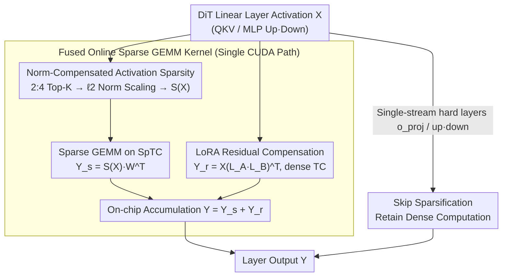

# RT-Lynx: Putting the GEMM Sparsity In a Right Way for Diffusion Models

**Conference**: ICML 2026  
**arXiv**: [2605.26632](https://arxiv.org/abs/2605.26632)  
**Code**: To be confirmed  
**Area**: Model Compression / Diffusion Model Acceleration / N:M Sparsity / CUDA Kernel  
**Keywords**: Activation Sparsity, 2:4 Semi-structured Sparsity, DiT Inference Acceleration, LoRA Error Compensation, Sparse Tensor Core

## TL;DR
The authors observe that the **activations** of DiT are naturally sparser than its **weights** (with each token activating only 5–10% of channels). Consequently, they migrate 2:4 semi-structured sparsity from the weight side to the activation side, utilizing norm scaling, LoRA residual compensation, and selective layer skipping to recover quality loss. Furthermore, they develop a CUDA pipeline that fuses "online Top-K selection + Sparse GEMM" into a single kernel, achieving an average linear layer speedup of 1.55× on Qwen-Image / FLUX / Z-Image without FID/IR degradation.

## Background & Motivation

**Background**: Diffusion Transformer (DiT) has become the mainstream backbone for high-resolution image generation. However, each inference step is a GEMM-dominant operation involving dense large matrices. Coupled with dozens of denoising iterations, reducing latency and energy consumption remains challenging. In the LLM domain, N:M semi-structured sparsity (especially the 2:4 mode natively supported by NVIDIA) has been proven to be a hardware-friendly acceleration path that balances accuracy, represented by methods such as SparseGPT, Wanda, RIA, BaWA, and Slim—all of which primarily focus on **weight pruning**.

**Limitations of Prior Work**: Applying the "weight pruning" paradigm directly to DiT significantly degrades generation quality. Control experiments on Qwen-Image show that naive 2:4 weight sparsity causes FID to surge from 21.98 to 51.63 and Image Reward to drop from 1.219 to −0.16. Even advanced methods like Wanda/RIA/BaWA only recover FID to around 40. While Slim performs better, it utilizes LoRA compensation with rank $R=0.1d$, leading to high inference overhead. Additionally, even with activation sparsity, the total overhead of **online** Top-K selection, format rearrangement, and Sparse GEMM calls can consume 40–59% of the runtime, negating the theoretical 2× speedup.

**Key Challenge**: The weight distribution of DiT is approximately Gaussian with "universally diffused" values, lacking the local sparse structure required for 2:4 patterns. Forcing this pattern cuts critical parameters. Conversely, the decision of "what to prune" is dictated by the fact that **a single token in the FFN activates only a small subset of neurons**—sparsity naturally resides in activations rather than weights. However, migrating to the activation side introduces systematic $\ell_2$ norm drops and loss of high-frequency details, while online sparsification is hindered by kernel scheduling overhead.

**Goal**: (1) Demonstrate that activation sparsity is inherently more compatible with DiT than weight sparsity; (2) Design a sparsification pipeline capable of compensating for quality loss to achieve "lossless" results; (3) Fuse online Top-K and Sparse GEMM into a single CUDA kernel to realize over 1.5× end-to-end acceleration for linear layers.

**Key Insight**: The authors observe statistical characteristics of weights and activations at the distribution level. Weight elements are quasi-Gaussian and spread across frequencies without local structure. Activations, due to the superposition phenomenon in Transformers, are concentrated near zero, with only ~5–10% of channels significantly activated. Based on this, the relative error introduced by imposing a 2:4 "keep 2 out of 4" hard constraint on activations is much smaller than that on weights.

**Core Idea**: Shift from "weight pruning" to "activation pruning." Use norm scaling and low-rank LoRA residuals to recover discarded energy and high-frequency details. Finally, employ a fused Sparse GEMM kernel to compress online overhead to under 10%, translating theoretical gains into approximately 1.2× end-to-end acceleration.

## Method

### Overall Architecture
RT-Lynx addresses how to enable SpTC 2:4 sparse acceleration for DiT linear layers $\mathbf{Y}=\mathbf{X}\cdot\mathbf{W}^{\top}$ without quality loss. The authors rewrite the traditional weight sparsity $\mathbf{Y}=\mathbf{X}\cdot\mathbf{W}_s^{\top}$ as $\mathbf{Y}=S(\mathbf{X})\cdot\mathbf{W}^{\top}+\mathbf{X}\cdot(\mathbf{L}_A\mathbf{L}_B)^{\top}$. The first term applies sparsity to the **activations** ($S(\cdot)$ denotes token-wise 2:4 Top-K with norm scaling), and the second term is a LoRA branch with rank $R=64$ designed specifically to compensate for the residuals lost during sparsification. The sparsified layers include QKV projections and MLP Up/Down projections in the DiT blocks. Layers that cannot be recovered by LoRA in the single-stream path are skipped. The entire "online Top-K + format rearrangement + Sparse GEMM + LoRA accumulation" sequence is collapsed into a single CUDA execution path. During training, backbone weights are frozen, and only LoRA is fine-tuned.

### Key Designs

**1. Norm-Compensated Activation Sparsification: Eliminating Systematic Bias from Pruning**

Naive 2:4 Top-K introduces a vulnerability: while each token retains the two largest absolute values in a group of four to obtain $\tilde{\mathbf{X}}$, the energy ratio of these elements is inconsistent. This causes the token output to be systematically smaller, biasing the statistics of downstream RMSNorm/Attention and leading to FID collapse. The authors scale the vector back to its original $\ell_2$ norm after pruning by calculating a scaling factor $s=\sqrt{\|\mathbf{X}\|_2^2/(\|\tilde{\mathbf{X}}\|_2^2+\epsilon)}$ (where $\epsilon=10^{-8}$), setting $S(\mathbf{X})=s\cdot\tilde{\mathbf{X}}$. This aligns the magnitude with the dense path without changing the vector direction, eliminating systematic bias. The computational cost is negligible—merely one reduction and one division integrated into the Top-K kernel—yet the benefit is substantial, improving Qwen-Image FID from 35.85 to 25.28 and eliminating magnitude shift.

**2. LoRA Residual Compensation: Recovering High-Frequency Details via Low-Rank Branches**

Norm compensation aligns magnitude, but discarded near-zero activations still carry high-frequency details like hair, edges, and textures. The authors use a low-rank branch $\mathbf{X}(\mathbf{L}_A\mathbf{L}_B)^{\top}$ to fit this residual, with the training objective minimizing $\|\mathbf{X}\mathbf{W}^{\top}-(S(\mathbf{X})\mathbf{W}^{\top}+\mathbf{X}(\mathbf{L}_A\mathbf{L}_B)^{\top})\|^2$. The backbone $\mathbf{W}$ is frozen while LoRA is updated. During inference, LoRA generates $\mathbf{Y}_r$ on dense Tensor Cores, which is accumulated on-chip with the sparse GEMM output $\mathbf{Y}_s$. The core argument is that the residual itself is low-rank: most energy remains in the Top-K channels, leaving only fine-grained high-frequency perturbations. Thus, $R=64$ is sufficient. Compared to Slim's heavy compensation ($R\approx 0.1d$, e.g., 307), this minimizes extra GEMM overhead while achieving higher accuracy. For "hard" layers in single-stream DiT (e.g., `attn.o_proj`/`mlp.up` in Z-Image), sparsification is skipped to maintain quality.

**3. Fused Online Sparse GEMM Kernel: Realizing Theoretical 2× Speedup End-to-End**

Existing libraries like PyTorch-SpMM, cuSPARSElt, or CUTLASS separate "pruning," "formatting," and "computation" into multiple kernels. The launch overhead and intermediate memory access consume 40–59% of the runtime. The authors collapse the entire pipeline—pattern determination, Top-K, SpTC layout compression, Sparse GEMM, and LoRA accumulation—into a single CUDA path. Structured activations and 2-bit indices are generated at the register level without writing back to global memory. Sparse GEMM uses a streamK-style block-parallel pipeline to stream K-dimension blocks through SpTC, overlapping bandwidth and latency across memory layers. The LoRA branch runs asynchronously with Sparse GEMM, and $\mathbf{Y}_s$ is added directly to the $\mathbf{Y}_r$ register, eliminating materialization of intermediate LoRA tensors and host-side synchronization. By pinning algorithm-level sparsification and hardware-level SpTC to the same register file, online overhead is reduced below 10%. Real-world measurements show 1.88× Sparse GEMM speedup and 1.55× average linear layer speedup.

### Loss & Training
Only the LoRA matrices $\mathbf{L}_A, \mathbf{L}_B$ are trainable; backbone weights and optimizer states are not updated. Training data consists of 20k prompt-image pairs generated by Qwen-Image from user prompts. The loss function is MSE-based: $\|\mathbf{X}\mathbf{W}^{\top}-\mathbf{Y}\|^2$, with convergence reached in approximately 2k steps. Training is conducted on NVIDIA H20 using CUDA 13.0. Inference can be orthogonally combined with FP8 quantization, step distillation, TeaCache, and SpargeAttn.

## Key Experimental Results

### Main Results (Comparison of Sparsification Strategies on Qwen-Image, MJHQ / sDCI)

| Method | MJHQ FID↓ | MJHQ IR↑ | sDCI FID↓ | sDCI IR↑ |
|------|-----------|----------|-----------|----------|
| Full (FP16) | 21.98 | 1.219 | 31.15 | 1.172 |
| Sparse Weight (naive 2:4) | 51.63 | −0.16 | 66.91 | −0.22 |
| Sparse Activation (naive 2:4) | 35.85 | 0.599 | 48.59 | 0.472 |
| Wanda (ICLR'24) | 40.81 | 0.536 | 55.61 | 0.325 |
| BaWA (ICML'25) | 39.68 | 0.589 | 54.54 | 0.376 |
| Slim (ICML'25, $R\approx 0.1d$) | 22.25 | 1.278 | 29.26 | 1.217 |
| **RT-Lynx (Ours, $R=64$)** | **21.25** | **1.304** | **25.78** | **1.226** |

RT-Lynx is the only sparse method that **outperforms the FP16 dense baseline** in both FID and IR across datasets, while using a LoRA rank less than 1/5 of Slim's.

### Kernel and End-to-End Acceleration (H20, specific matrix sizes from Qwen-Image)

| $M{=}N$ | $K$ | PyTorch GEMM | cuSPARSElt | RT-Lynx Kernel | Online Sparsity Overhead |
|---------|-----|--------------|-----------|----------------|--------------|
| 4096 | 3072 | 0.781 ms | 0.709 (1.10×) | 0.465 (**1.68×**) | 4.60% |
| 4096 | 12288 | 3.099 ms | 2.669 (1.16×) | 1.652 (**1.88×**) | 4.83% |
| 8192 | 12288 | 11.95 ms | 8.202 (1.45×) | 6.754 (**1.77×**) | 2.37% |

End-to-end: Qwen-Image per-image time reduced from 0.75s to 0.62s (1.21×). Combined with 8-step Turbo distillation, Z-Image reaches 11.86× total speedup (compared to 9.91× for Turbo alone). It maintains approximately 1.3× additional speedup when stacked with W8A8, TeaCache, and SpargeAttn.

### Ablation Study (Qwen-Image / FLUX / Z-Image, Selected)

| Model | Config | MJHQ FID↓ | MJHQ IR↑ | Description |
|------|------|-----------|----------|------|
| Qwen-Image | SA-Native | 35.85 | 0.599 | Activation sparsity only, no compensation |
| Qwen-Image | + Norm Comp. | 25.28 | 0.939 | Norm compensation contributes ~10 FID |
| Qwen-Image | + LoRA ($R=64$) | **21.25** | **1.304** | LoRA closes the gap, outperforming Full |
| FLUX.1-dev | SA-NC-LoRA | 22.61 | 0.978 | Dual-stream compensation is sufficient |
| FLUX.1-dev | + Skip Layers | **21.17** | **1.011** | Skip layers in single-stream path |
| Z-Image | SA-NC-LoRA | 27.39 | 0.929 | LoRA alone insufficient |
| Z-Image | + Skip Layers | **26.17** | **0.967** | Skipping `o_proj`/`up` layers approaches Full (25.70) |

### Key Findings
- The impact of the three compensations follows: LoRA > Norm Comp. > Skip Layer. However, **for single-stream DiTs (FLUX, Z-Image), skipping layers is essential** as LoRA cannot fully compensate otherwise.
- Reducing online sparsity overhead from 40–59% (PyTorch/cuSPARSElt) to **<10%** is the decisive factor for end-to-end acceleration.
- RT-Lynx is fully orthogonal to W8A8 quantization, step distillation, TeaCache, and SpargeAttn. While weight sparsity on 8-step models causes FID to collapse to 360.2, RT-Lynx remains nearly lossless.
- Regarding GEMM performance, the RT-Lynx Kernel achieves 1.88× speedup on $4096\times 4096\times 12288$, approaching the SpTC theoretical limit of 2×.

## Highlights & Insights
- "Putting sparsity in the right place": The authors use distribution comparisons to demonstrate that 2:4 patterns should not be forced on weights. This is the first systematic migration of LLM superposition observations (where only a few FFN neurons are activated) to DiT acceleration.
- Norm compensation is a near-zero cost technique with significant impact, alone improving Qwen-Image FID from 35.85 to 25.28. This approach of "rescaling back to original norm after pruning" is applicable to any token-wise sparsity scenario (e.g., LLM decoding, Video DiT).
- The value of LoRA residual compensation lies in **proving the low-rank nature of residuals**: the fact that $R=64$ suffices suggests that discarded information consists of low-rank, near-zero perturbations rather than dense energy.
- The core kernel innovation is **fusing online Top-K, format rearrangement, Sparse GEMM, and LoRA accumulation into a single register pipeline**, which is critical for transforming theoretical 2× gains into 1.2× end-to-end speedup.
- Orthogonality is rigorously verified, demonstrating that RT-Lynx can serve as an independent acceleration module in the DiT inference stack.

## Limitations & Future Work
- The paper relies on **manual selection of skipped layers** (`attn.o_proj` / `mlp.up` or `mlp.down`) for single-stream DiTs, and the skip list varies by model without a principled criterion.
- Evaluation is concentrated on the H20 GPU. Performance on H100/B200 (FP8/FP4 + 2:4) or consumer-grade cards (without SpTC, e.g., RTX 4090) using PyTorch-SpMM is not documented.
- Datasets like MJHQ-30K and sDCI have limited sensitivity to "blurring" details. Systemic failure mode analysis for faces, text, and complex scenes is lacking.
- LoRA is fitted using data generated by the **same** model (20k prompt-image pairs), effectively a form of self-distillation. Cross-model transferability of LoRA weights is unverified.
- Sparsity is limited to 2:4 (50%). Future research could explore more aggressive patterns (e.g., 4:8 or 1:4) and their corresponding compensation needs.

## Related Work & Insights
- **vs SparseGPT / Wanda / RIA / BaWA / Slim**: These methods prune **weights** via calibration or sensitivity estimation. RT-Lynx demonstrates that DiT weights lack 2:4 structure, shifts focus to activations, and outperforms Slim using a significantly smaller LoRA rank ($R=64$ vs $R\approx 0.1d$).
- **vs LLM Activation Sparsity (PowerInfer / CATS / ReLU-strikes-back / Q-Sparse / RoSA)**: These focus on LLM **decoding** (small token counts) and cannot be directly applied to DiT image generation with token counts > 1000. RT-Lynx is the first work to apply activation sparsity to DiT acceleration.
- **vs Amber / Haziza et al.**: Amber uses 8:16 patterns not natively supported by current GPUs; Haziza et al. focus on LLM **pre-training** activation sparsity for FFNs. RT-Lynx provides a complete solution for native 2:4 + DiT + end-to-end kernels.
- **vs DiT Acceleration (SVDQuant, DMD2, TeaCache, TaylorSeer, SLA, VSA)**: These address quantization, distillation, feature caching, or sparse attention. RT-Lynx specifically targets GEMM-dominant linear layers and is orthogonally compatible with these methods.
- **Insights**: (1) Distribution and induced error analysis before applying sparsity constraints is a valuable paradigm; (2) "Norm compensation + low-rank residual" is applicable to all lossy compression involving hard masks; (3) Algorithm-system co-design is essential for realizing theoretical gains.

## Rating
- Novelty: ⭐⭐⭐⭐ Excellent insight into DiT activation sparsity and comprehensive kernel implementation, though individual components (activation sparsity + LoRA) exist in LLM literature.
- Experimental Thoroughness: ⭐⭐⭐⭐⭐ Covers three mainstream DiTs, four quality metrics, systematic ablation, and stacking with four types of orthogonal acceleration across kernel-level and end-to-end benchmarks.
- Writing Quality: ⭐⭐⭐⭐ Clear motivation and algorithmic figures, though some sections read like an engineering report; high information density in the appendix.
- Value: ⭐⭐⭐⭐⭐ Realizes ~1.2× end-to-end lossless DiT acceleration on SpTC, directly applicable to industrial deployment and orthogonal to existing stacks.

<!-- RELATED:START -->

## Related Papers

- [\[CVPR 2026\] Semantics Lead the Way: Harmonizing Semantic and Texture Modeling with Asynchronous Latent Diffusion](../../CVPR2026/image_generation/semantics_lead_the_way_harmonizing_semantic_and_texture_modeling_with_asynchrono.md)
- [\[ECCV 2024\] Getting it Right: Improving Spatial Consistency in Text-to-Image Models](../../ECCV2024/image_generation/getting_it_right_improving_spatial_consistency_in_text-to-image_models.md)
- [\[CVPR 2026\] SparVAR: Exploring Sparsity in Visual Autoregressive Modeling for Training-Free Acceleration](../../CVPR2026/image_generation/sparvar_exploring_sparsity_in_visual_autoregressive_modeling_for_training-free_a.md)
- [\[CVPR 2025\] Panorama Generation From NFoV Image Done Right](../../CVPR2025/image_generation/panorama_generation_from_nfov_image_done_right.md)
- [\[AAAI 2026\] Right Looks, Wrong Reasons: Compositional Fidelity in Text-to-Image Generation](../../AAAI2026/image_generation/right_looks_wrong_reasons_compositional_fidelity_in_text-to-image_generation.md)

<!-- RELATED:END -->
