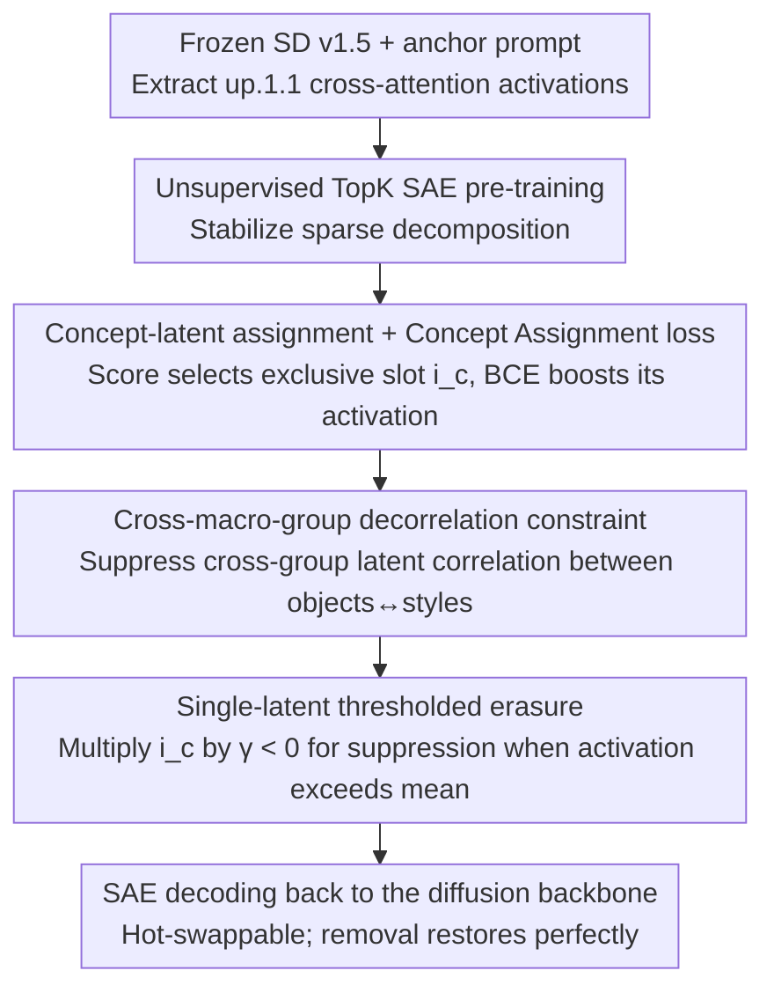

# SAEmnesia: Erasing Concepts in Diffusion Models with Supervised Sparse Autoencoders

**Conference**: ICML 2026  
**arXiv**: [2509.21379](https://arxiv.org/abs/2509.21379)  
**Code**: https://github.com/EIDOSLAB/SAEmnesia  
**Area**: AI Safety / Concept Unlearning / Diffusion Model Interpretability  
**Keywords**: Concept Erasure, Sparse Autoencoders, Supervised Training, Feature Centralization, Diffusion Models

## TL;DR
By incorporating a supervised "concept-latent" assignment loss during the Sparse Autoencoder (SAE) training phase, this work enforces each target concept to concentrate into a single neuron (feature centralization). This reduces concept erasure in diffusion models from a two-dimensional hyperparameter search of "searching multiple neurons + tuning intensity" to "tuning a single multiplier." On UnlearnCanvas, it achieves an average improvement of 9.22 points over the SOTA SAeUron, reduces hyperparameter search costs by 96.67%, and demonstrates higher robustness against adversarial attacks.

## Background & Motivation

**Background**: The safe deployment of text-to-image diffusion models (SD series) requires "concept unlearning"—selectively erasing undesired concepts such as nudity, copyrighted characters, or specific objects while preserving the model's other generative capabilities. Current mainstream approaches fall into two categories: (i) fine-tuning model weights (ESD, UCE, SalUn, etc.); (ii) keeping weights frozen and performing mechanistic intervention on cross-attention activations using Sparse Autoencoders (SAE) (Concept Steerers, SAeUron). The latter offers the advantages of being **reversible** (the model is fully restored upon removing the SAE) and providing interpretability.

**Limitations of Prior Work**: The strongest representative of the SAE route, SAeUron, trains the SAE in an **unsupervised** manner, leading to *feature splitting*—where a single concept (e.g., "Bears") is scattered across multiple latent variables. To erase it, one must: (1) search for "which combination of latents represents Bears" among thousands of variables; evaluations in literature require enumerating 30 latent subsets $\times$ 7 intensities = 210 evaluations. (2) Overlap between multiple latents and adjacent concepts can lead to collateral damage to related concepts like "Cats" during intervention.

**Key Challenge**: The properties of monosemanticity (one neuron sensitive to only one concept) and one-to-one mapping (one concept corresponding to only one neuron) in unsupervised SAEs are not naturally guaranteed; the latter has been consistently missing. Without one-to-one mapping, mechanistic intervention necessitates combinatorial search, and interpretability remains merely post-hoc attribution.

**Goal**: While maintaining the reconstruction quality of the SAE, this work aims to bind each concept to be erased to a unique latent **during training**, reducing erasure at inference time to "multiplying a single scalar by a negative value."

**Key Insight**: Diffusion training **already provides existing supervision signals**—anchor prompts used during generation (e.g., `An image of Bears`) naturally contain concept labels. Feeding this signal back into SAE training is far more direct than using a post-hoc score function for alignment.

**Core Idea**: Two supervised losses are added to the standard TopK SAE loss: a Concept Assignment loss that pushes activations of each concept to a designated latent, and a Decorrelation loss that suppresses correlations between latent activations of different macro-groups (objects vs. styles). This effectively suppresses "feature splitting" during the training phase.

## Method

### Overall Architecture

SAEmnesia attaches a Sparse Autoencoder after the `up.1.1` cross-attention block of a frozen Stable Diffusion v1.5. To solve the issue where "unsupervised SAEs spread a concept across multiple latents," it utilizes the concept labels provided by anchor prompts as supervision during SAE training. By hard-binding each target concept to a unique latent, erasure during inference is simplified to "multiplying that specific latent's activation by a negative scalar." The entire SAE is hot-swappable, leaving the diffusion backbone unchanged, allowing "forgetting-restoration" with a single line of code.

### Key Designs

**1. Supervised Concept-Latent Assignment and Concept Assignment Loss: Moving post-hoc attribution to hard constraints during training**

Feature splitting in unsupervised SAEs arises because the model is never told "which latent should encode which concept," necessitating post-hoc attribution using a score function. SAEmnesia integrates this score function directly into training. First, it uses the metric from SAeUron: $\text{score}(i,t,c,D) = \frac{\mu(i,t,D_c)}{\sum_j \mu(j,t,D_c)+\delta} - \frac{\mu(i,t,D_{\neg c})}{\sum_j \mu(j,t,D_{\neg c})+\delta}$ to measure the "exclusivity" of latent $i$ for concept $c$ (high relative activation in concept set $D_c$, low in complement $D_{\neg c}$). The latent with the maximum score is chosen as the designated slot $i_c$. During training, for every sample containing concept $c$, a loss is added: $\mathcal{L}_{\text{CA}} = -\frac{1}{B}\sum_b \frac{1}{|\mathcal{T}^{(b)}|}\sum_{c \in \mathcal{T}^{(b)}} \log \sigma(v^{(b)}_{i_c})$. This is essentially a Binary Cross-Entropy (BCE) on the pre-activation $v_{i_c}$ of the assigned latent, forcing it to activate strongly when the concept appears. Since this pressure is only applied to the small set of "samples where the concept appears $\times$ the corresponding latent," it acts as local sparse supervision that does not disturb the unsupervised representation of other latents. This allows it to be stacked on the standard SAE loss without hurting reconstruction quality—ablation shows it brings a 2.43× boost in peak score, which is the source of subsequent sequential, adversarial, and efficiency gains.

**2. Decorrelation Constraint: Decoupling "resonance" at the user semantic level**

Binding a concept to a single latent is insufficient if latents assigned to different macro-groups still fire together within the same batch—for example, if the "Bears" latent consistently activates with the "Cubism" latent, erasing the object would inadvertently affect the style. To prevent this, the concept set is partitioned into disjoint macro-groups $\mathcal{C} = \bigcup_m \mathcal{C}_m$ (in the paper: objects and styles). For each latent, the Pearson correlation coefficient $\rho$ is calculated for the activation vectors $\mathbf{a}_c = [v_{i_c}^{(1)}, \dots, v_{i_c}^{(B)}]^\top$ within a mini-batch. The loss $\mathcal{L}_{\text{DC}} = \frac{\sum_{m<m'} \sum_{i\in\mathcal{I}_m, j\in\mathcal{I}_{m'}} \rho(\mathbf{a}_i, \mathbf{a}_j)}{\sum_{m<m'}|\mathcal{I}_m||\mathcal{I}_{m'}|}$ penalizes only **cross-group** latent pair correlations. Pairwise decorrelation is not applied to all pairs because "Cats" and "Dogs" should remain correlated; forcing them apart would damage natural semantics. Decorrelating at the macro-group level preserves intra-group similarity while directly addressing the requirement to "erase objects without affecting styles." The cost is that within-group interference is intentionally ignored, which remains an open problem. The two supervised terms form $\mathcal{L}_{\text{supSAE}} = \mathcal{L}_{\text{CA}} + \eta \mathcal{L}_{\text{DC}}$.

**3. Single-Latent Thresholded Erasure: Reducing deletion to a "conditional" scalar multiplication**

After binding, the assigned latent $i_c$ is modified during inference as $z_{i_c} = \gamma_c\, \mu(i_c, t, D_c)\, z_{i_c}$, but **only if** $z_{i_c} > \mu(i_c, t, D)$ (the current activation exceeds the average activation across all samples). Otherwise, it remains unchanged. Here, $\gamma_c < 0$ is the only tunable hyperparameter, and $\mu(i_c, t, D_c)$ is the average activation of concept samples on the validation set, serving as a normalization factor. This threshold acts as a hidden guardrail for precision: a high static score does not mean "Bears are definitely being drawn at this specific denoising step or spatial location." The threshold ensures intervention only occurs when the concept is actually being expressed, minimizing collateral damage. Normalization via $\mu(i_c, t, D_c)$ allows $\gamma_c$ to share a unified scale across different concepts; a single value of $\gamma_c = -1$ robustly covers all 20 object categories (Figure 3). Optionally, intervention can be enabled only for the final 25 denoising steps to preserve pre-trained priors and reduce artifacts.

### Loss & Training

The full objective is $\mathcal{L}_{\text{SAEmnesia}} = \mathcal{L}_{\text{unsupSAE}} + \beta(\mathcal{L}_{\text{CA}} + \eta \mathcal{L}_{\text{DC}}) + \lambda \mathcal{L}_{L_1}$. Training is conducted in two stages: first, pure unsupervised TopK SAE pre-training (reconstruction loss + auxiliary loss for dead latents) to stabilize sparse decomposition, followed by a fine-tuning stage with supervised terms to strengthen binding. Activations are taken from the `up.1.1` cross-attention of SD v1.5 across all timesteps. On UnlearnCanvas, 70 concepts are assigned (20 objects + 50 styles).

### Mechanism

Taking the erasure of "Bears" as an example: 80 anchor prompts (`An image of Bears`) are used to run 50 denoising steps in SD. Cross-attention feature maps $\mathbf{F}_t \in \mathbb{R}^{h\times w\times d}$ are extracted from `up.1.1`. Each $d$-dimensional vector at each spatial position is treated as an SAE sample and labeled with the "object" tag. After unsupervised pre-training, the score function identifies the latent $i_{\text{Bears}}$ with the highest exclusivity for Bears. The CA loss pushes the activation of $i_{\text{Bears}}$ higher in samples containing Bears, while the DC loss suppresses its correlation with style latents like Cubism. During deployment, one simply sets $\gamma = -1$ for $i_{\text{Bears}}$. During inference, any activation where $z_{i_{\text{Bears}}} > \mu$ is multiplied by $-\mu$ to become inhibitory and decoded back into the diffusion backbone. The model stops generating bears, while remaining harmless to Cats, Dogs, and all styles. Removing the SAE restores the model completely.

## Key Experimental Results

### Main Results

Object erasure on UnlearnCanvas (Percentage, higher is better; UA = Unlearning Accuracy, IRA/CRA = In-/Cross-domain Retain Accuracy):

| Method Family | Method | UA ↑ | IRA ↑ | CRA ↑ | Avg ↑ |
|---------------|--------|------|-------|-------|-------|
| Fine-tune | ESD | 92.15 | 55.78 | 44.23 | 64.05 |
| Fine-tune | SalUn | 86.91 | 96.35 | 99.59 | 94.28 |
| Adapter | SPM | 71.25 | 90.79 | 81.65 | 81.23 |
| SAE Unsup | SAeUron | 87.16 | 85.57 | 74.14 | 82.29 |
| **SAE Supervised** | **SAEmnesia** | **94.65** | 91.39 | 88.48 | **91.51** |

Compared to the SAE SOTA SAeUron: UA +7.49, IRA +5.82, CRA +14.34, Avg **+9.22**. While SalUn achieves higher Avg on pure objects, SAEmnesia outperforms it with 94.85% when stylistic erasure is considered (Appendix Table 15).

### Ablation Study

| Config / Scenario | Key Metric | Description |
|-------------------|------------|-------------|
| Hyperparameter search cost | 7 vs. 210 evaluations | SAeUron needs $m=7$ multipliers $\times$ $l=30$ latent sets; Ours tunes only $m$, down 96.67% |
| Sequential Erasure (9 objects) | UA 92.4% vs. 64.0% | +28.4 points; Retain accuracy (RA) 60.9% vs. 48.4% |
| White-box Attack (UnlearnDiffAtk) | Post-attack UA 57.50% vs. 34.20% | Drop of 40.1 points; SAeUron drops 49.5 points |
| Black-box Attack (Ring-A-Bell) | Post-attack UA 97.0% vs. 79.5% | Robustness holds across threat models |
| NSFW Suppression (I2P, SD v1.4)| 9 cases detected vs. 18 | Using only 2 latents ("naked man"/"naked woman") |
| K-NN on top-1 latent | Approaches "all latents" | Confirms concept information is concentrated in a single latent |
| Feature score distribution | 0.0404 vs. 0.0166 | 2.43× peak score increase after supervised training |

### Key Findings

- **CA loss is the primary contributor to erasure performance**: The 2.43× peak score is the root of all downstream benefits; without feature centralization, sequential erasure, adversarial robustness, and efficiency gains would not materialize.
- **Decorrelation works primarily at the macro-group level**: The authors state that within-group interference (e.g., Dogs vs. Cats) remains unresolved and is an explicit limitation.
- **"Spillover benefit" in adversarial robustness**: One-to-one mapping forces adversarial prompts to hit that specific latent precisely, narrowing the attack surface. This was not an explicit optimization goal but emerged naturally.
- **Stable uniform multiplier**: Figure 3 shows SAEmnesia with a universal $\gamma_c$ still outperforms SAeUron with optimal hyperparameter search, suggesting the need to fine-tune $\gamma$ for each concept is significantly weakened.

## Highlights & Insights

- **Transforming "post-hoc attribution" into "hard training constraint"**: The SAE community has long treated monosemanticity as a post-training evaluation metric. This work demonstrates it can be directly optimized as a training objective without damaging reconstruction—a key step in upgrading mechanistic interpretability from an "observation tool" to a "control tool."
- **1:1 mapping is more than just clean; it collapses search space from multiplicative to additive**: The difference between $m \times l$ and $m$ scales linearly with the number of concepts. The 28.4-point gain in 9-object sequential erasure is essentially due to cutting off the combinatorial explosion.
- **Activation thresholding as a guardrail**: The `if $z_{i_c} > \mu(i_c, t, D)$` logic decouples "statically high score" from "actual expression in the current forward pass." This is a hidden key to precision and could be applied to other latent steering or controllable generation tasks.
- **Trade-off in macro-group decorrelation**: The decision to decorrelate only at the "user-semantic level" macro-groups (objects vs. styles) rather than all pairs preserves intra-group similarity while fulfilling practical needs. This idea of "requirement-driven decorrelation" could be transferred to multi-task SAEs or modular LoRAs.

## Limitations & Future Work

- **Limitations**: (1) Validated only on U-Net; transformer-based diffusion like FLUX requires architectural adaptation. (2) Closed-vocabulary; new concepts require score recalculation (without retraining, it defaults to post-hoc binding like SAeUron, losing consistency guarantees). (3) **Within-group interference** (e.g., Dogs vs. Cats) remains unaddressed. (4) Scalability issues regarding latent capacity and stable assignment for 20K+ concepts.
- **Additional Insights**: The two-stage training (unsupervised + supervised fine-tuning) implies maintaining two versions of SAE checkpoints, which may underestimate storage/engineering costs. The work only targets the `up.1.1` block; how to select or merge concept representations across multiple blocks remains unexplored.
- **Future Directions**: (1) Using concept similarity (CLIP embedding cosine) as pairwise DC weights to alleviate within-group interference. (2) Applying SAEs to MM-DiT modulation outputs in transformer-based diffusion. (3) Designing SAEs with "backbone latents + concept-specific latents" to allow fine-tuning only the latter for new concepts.

## Related Work & Insights

- **vs SAeUron**: Both use SAE on cross-attention for erasure. SAeUron is purely unsupervised and relies on post-hoc scores, leading to feature splitting. SAEmnesia integrates the score into the loss, gaining +9.22 points on UnlearnCanvas and reducing search costs by 96.67%.
- **vs Concept Steerers (Kim & Ghadiyaram)**: Concept Steerers train SAE on text embeddings before cross-attention. SAEmnesia intervenes on the visual path after cross-attention, making it more robust against adversarial attacks that bypass the text encoder (e.g., Ring-A-Bell).
- **vs SalUn / ESD / UCE**: Fine-tuning methods modify weights, which is irreversible and prone to damaging downstream capabilities. SAEmnesia is a plug-and-play additive module, offering better controllability for safe deployment (errors can be undone by removing the SAE, and individual latents are auditable).
- **vs ScaPre (Sequential erasure specific)**: ScaPre uses spectral trace regularization for interference; SAEmnesia naturally supports sequential erasure (UA 92.4% for 9 objects) through its one-to-one property, suggesting that "fixing representation before scheduling" is a viable alternative path.

## Rating
- Novelty: ⭐⭐⭐⭐ Incorporating supervision into SAE training for feature centralization is a clear leap in SAE-based unlearning, though the innovation is in the loss design rather than the SAE architecture itself.
- Experimental Thoroughness: ⭐⭐⭐⭐ UnlearnCanvas + I2P + White/Black-box attacks + Sequential erasure provide a strong chain of evidence, though limited to SD v1.5/1.4.
- Writing Quality: ⭐⭐⭐⭐ Clear motivation-method-evidence chain with rigorous notation and honest limitations.
- Value: ⭐⭐⭐⭐⭐ Pushes mechanistic erasure from a research demo toward engineering deployment (single latent, single multiplication, hot-swappable, auditable), providing direct value for generative model compliance.

<!-- RELATED:START -->

## Related Papers

- [\[CVPR 2026\] Interpretable and Steerable Concept Bottleneck Sparse Autoencoders](../../CVPR2026/image_generation/interpretable_and_steerable_concept_bottleneck_sparse_autoencoders.md)
- [\[CVPR 2026\] Erasing Thousands of Concepts: Towards Scalable and Practical Concept Erasure for Text-to-Image Diffusion Models](../../CVPR2026/image_generation/erasing_thousands_of_concepts_towards_scalable_and_practical_concept_erasure_for.md)
- [\[ICML 2026\] Evaluating the Representation Space of Diffusion Models via Self-Supervised Principles](evaluating_the_representation_space_of_diffusion_models_via_self-supervised_prin.md)
- [\[NeurIPS 2025\] When Are Concepts Erased From Diffusion Models?](../../NeurIPS2025/image_generation/when_are_concepts_erased_from_diffusion_models.md)
- [\[ICML 2026\] Skipping the Zeros in Diffusion Models for Sparse Data Generation](skipping_the_zeros_in_diffusion_models_for_sparse_data_generation.md)

<!-- RELATED:END -->
