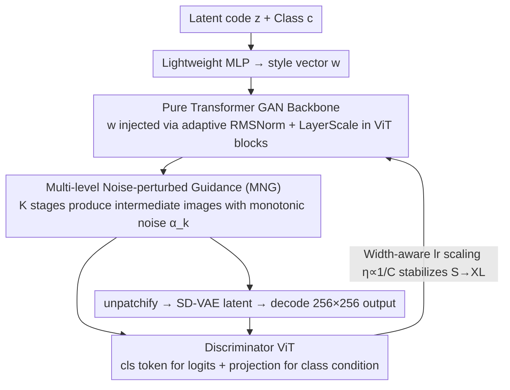

# Scalable GANs with Transformers

**Conference**: ICML2026  
**arXiv**: [2509.24935](https://arxiv.org/abs/2509.24935)  
**Code**: https://hse1032.github.io/GAT (Available, project page)  
**Area**: Image Generation / GAN / Transformer  
**Keywords**: GAN Scalability, Transformer Generator, VAE Latent Space, Single-step Generation, ImageNet Class-conditional Generation

## TL;DR
This paper proposes GAT (Generative Adversarial Transformers), a scalable GAN framework constructed with pure Transformer generators and discriminators in the VAE latent space. By activating early generator layers through Multi-level Noise-perturbed Guidance (MNG) and stabilizing large-scale training with width-aware learning rate scaling, GAT-XL/2 achieves a single-step SOTA FID of 2.18 on ImageNet-256 class-conditional generation in only 60 epochs, using $4\times$ fewer epochs than comparable 1-NFE diffusion/flow baselines.

## Background & Motivation

**Background**: Recent leaps in generative models have been largely built upon "scalability"—performance rises almost monotonically as model capacity, data volume, and compute are scaled up. Diffusion (DiT, SiT) and autoregressive (VAR, MAR) routes have repeatedly validated this scaling law: using pure Transformer backbones with VAE latent spaces allows stable scaling from small models to the multi-billion parameter level.

**Limitations of Prior Work**: The scalability of GANs has not been systematically discussed. Existing "Big GAN" works (GigaGAN, StyleGAN-XL, R3GAN) are typically constructed by fine-tuning single high-capacity models for specific tasks, which does not constitute evidence that "GANs can scale." However, GANs possess advantages that diffusion lacks—single-step inference and a semantically controllable low-dimensional latent space—making the scaling of GANs valuable.

**Key Challenge**: Directly applying the mature scalable recipe (VAE latent space + pure Transformer) to GANs reveals two failure modes during naive scaling: (1) **Early generator layers remain largely inactive**—PCA visualizations show that features in the first few blocks barely change, and ablating early blocks has minimal LPIPS impact on the final image, meaning most compute from capacity expansion is wasted; (2) **Training diverges** when scaling from S to XL using the same hyperparameters (especially learning rate)—GANs are inherently sensitive to learning rates, and as Transformers widen, the magnitude of output changes per step increases linearly with the number of channels, causing large models to collapse under the original lr.

**Goal**: Investigate whether GANs can scale using the "VAE latent space + pure Transformer" architecture and provide minimal fix solutions for the two specific obstacles mentioned above.

**Key Insight**: The authors decouple GAN scaling into independent "architectural" and "optimization" problems. For the architecture, auxiliary supervision is used to "wake up" idle early layers; for optimization, a simple lr scaling formula aligns the effective update magnitudes across different model sizes, avoiding per-scale tuning.

**Core Idea**: **Multi-level Noise-perturbed Guidance (MNG)** is used to force intermediate generator layers to produce images for discriminator inspection, compelling each layer to participate in coarse-to-fine refinement. Concurrently, a width-aware lr rule, $\eta_{\text{adapt}} = \eta_{\text{base}} \cdot C_{\text{base}} / C_{\text{model}}$, allows models from S to XL to share the same base hyperparameters while maintaining stable convergence.

## Method

### Overall Architecture
The question GAT aims to answer is straightforward: Can GANs scale if the diffusion community's validated recipe—VAE latent space plus pure ViT—is applied? The answer is a latent GAN where both G and D are standard ViTs. A random latent code $z\sim p_z$ ($d_z=64$) and class $c$ are mapped via a lightweight MLP to a style vector $w$. $w$ is injected via adaptive RMSNorm + LayerScale in each ViT block. A final unpatchify linear head restores the token sequence into a $32\times 32$ latent map of SD-VAE, which is then decoded into a $256\times 256$ image. The entire pipeline produces an image in a single forward pass. The discriminator is another ViT using the `[cls]` token for a linear head to output real/fake logits, paired with a projection discriminator for class conditioning.

### Key Designs

**1. Pure Transformer GAN Backbone on VAE Latent Space: Minimizing architectural changes to inherit ViT scalability**

Earlier Transformer-GANs (TransGAN, HiT, etc.) introduced numerous non-ViT modifications to achieve stability, which inadvertently compromised the scaling advantages of the Transformer itself. GAT takes the opposite approach by keeping the backbone close to the original: the generator replaces standard patchify with unpatchify as a linear RGB decoding head. Inside the ViT block, only an adaptive RMSNorm + LayerScale driven by the style vector $w$ is added. Modulation parameters $\gamma, \alpha$ are initialized near zero to prevent early training from being disrupted. The discriminator similarly processes the `[cls]` token alongside patch tokens through the ViT. All modulations are intentionally "lightweight feature modulations" to ensure the backbone remains as close to a standard ViT as possible, leaving GAN-specific issues to be resolved by two independent modules.

**2. Multi-level Noise-perturbed Guidance (MNG): Activating idle early layers without providing discriminator shortcuts**

Empirical evidence showed that early blocks in vanilla GAT were inactive. MNG fixes this by dividing the generator into $K$ stages. Each stage accumulates an intermediate image $\hat{x}_k$ via residuals, with the total output represented as $G(z,c)=[\hat{x}_1,\hat{x}_2,\dots,\hat{x}_K]$. The discriminator inspects each intermediate product, providing per-layer gradients. Crucially, each $\hat{x}_k$ is perturbed with Gaussian noise $\mathcal{E}(\hat{x}_k)=\alpha_k\hat{x}_k+\sqrt{1-\alpha_k^2}\,\epsilon$, where $\alpha_1<\alpha_2<\dots<\alpha_K=1$ follows a monotonically increasing exponential schedule. Shallow outputs receive stronger noise, while deeper outputs approach clean images. This forces shallow layers to match coarse structures under high noise while deep layers handle fine details. Using "single image with multiple noise levels" instead of MSG-GAN's multi-scale real images prevents the discriminator from exploiting "cross-scale consistency" shortcuts, which would otherwise suppress G's generation quality.

**3. Width-aware Learning Rate Scaling: Stabilizing S to XL scales with one set of base parameters**

GANs are highly sensitive to learning rates. Naive scaling often leads to divergence when moving from S to XL using the same lr. The authors observe that after normalization to unit variance, the expected squared norm of ViT layer inputs is proportional to the channel dimension $C$. To maintain a consistent output update magnitude across different widths, the lr should be inversely proportional to the number of channels: $\eta_{\text{adapt}}=\eta_{\text{base}}\cdot C_{\text{base}}/C_{\text{model}}$. Batch size, optimizer, and loss weights remain unchanged. Ablations confirm that applying GAT-B's lr to GAT-S causes slow convergence, while the reverse causes divergence. This rule can be orthogonally combined with large-batch $\sqrt{}$-scaling.

### Loss & Training
The discriminator loss is an approximated relativistic pairing loss plus bilateral gradient penalty and REPA alignment: $\mathcal{L}_D = \mathcal{L}_D^{\text{adv}} + \lambda_{\text{aGP}}(\mathcal{L}_{\text{aR1}} + \mathcal{L}_{\text{aR2}}) + \lambda_{\text{REPA}} \mathcal{L}_{\text{REPA}}$, where $\mathcal{L}_{\text{aR}}$ approximates the gradient penalty using $\frac{1}{\sigma^2}\|D(\mathcal{E}(x),c) - D(\mathcal{E}(x+\epsilon'),c)\|^2$ for efficiency. $\mathcal{L}_{\text{REPA}} = \frac{1}{N+1}\sum_i \text{sim}(P(h_i), \hat{h}_i)$ aligns discriminator tokens with frozen DINOv2 teacher tokens. The generator only optimizes $\mathcal{L}_G^{\text{adv}}$. All $x$ and $G(z,c)$ are MNG-processed noise-perturbed versions.

## Key Experimental Results

### Main Results

SOTA comparison for ImageNet-256 class-conditional single-step generation (FID-50K):

| Type | Method | Params | NFE | Epoch | FID |
|--------|------|------|------|---------|------|
| 2-NFE flow | MeanFlow-XL/2 | 676M | 2 | 240 | 2.93 |
| 1-NFE flow | MeanFlow-XL/2 | 676M | 1 | 240 | 3.43 |
| 1-NFE flow | Shortcut-XL/2 | 675M | 1 | 250 | 10.60 |
| 1-NFE GAN | BigGAN | 112M | 1 | - | 6.95 |
| 1-NFE GAN | GigaGAN | 569M | 1 | 480 | 3.45 |
| 1-NFE GAN | StyleGAN-XL† | 166M | 1 | - | 2.30 |
| **1-NFE GAN** | **GAT-XL/2** | **602M** | **1** | **60** | **2.18** |

† StyleGAN-XL uses an ImageNet-pretrained discriminator, causing FIDs to be biased low relative to visual quality.
GAT-XL/2 improves FID from 3.43 to 2.18 compared to 1-NFE MeanFlow, while using 1/4 of the training epochs.

Scalability curves (Fig. 3): FID-50K decreases monotonically with (a) model size (S→XL); (b) smaller patch sizes for equivalent parameters; (c)(d) FID correlates at $-0.95$ with inference GFLOPs and fits a power law with total training GFLOPs: $\text{FID}(C) \approx 3.52 \times 10^5 \cdot C^{-0.456}$.

### Ablation Study

| Configuration | FID Trend | Description |
|------|---------|------|
| Full GAT (MNG-exp) | Best | Default configuration |
| w/o MNG | Significantly worse | Early layers inactive, performance collapse |
| MSG (multi-scale resize) | Worst | Cross-scale shortcuts suppress generation quality |
| MNG-lin (linear schedule) | Worse than exp | Exponential schedule is superior |
| lr mismatch (S lr on B / B lr on S) | Severe degradation | GAT-S too slow, GAT-B diverges |
| w/o REPA | Obvious drop | Aligning D with VFM significantly improves G |

Decoupled G/D scaling (Fig. 6a): Scaling the discriminator alone yields significantly higher returns than scaling the generator alone. CKNNA metrics show that the discriminator's alignment with DINOv2-g is higher on fake data than real data, suggesting generation quality is bounded by discriminator representation quality.

### Key Findings
- **MNG's contribution comes from "multi-noise on single image" rather than "multi-scale images"**: MSG-style multi-scale supervision performed worst, likely because the discriminator learns "cross-scale consistency" as a shortcut. MNG provides per-layer gradients without shortcuts.
- **GAN lr scaling is heavily width-dependent**: The DiT convenience of "one set of hyperparameters for all scales" does not hold for GANs; explicit scaling via $\eta \propto 1/C_{\text{model}}$ is required.
- **Discriminator representation is the true bottleneck for GAN scaling**: Decoupled scaling shows larger gains when expanding D. REPA alignment on D alone indirectly improves G significantly.
- **Scalability is monotonic and follows a power law**: FID-50K fits $\text{FID}(C) \approx 3.52 \times 10^5 \cdot C^{-0.456}$ against training GFLOPs, similar to diffusion/AR models.

## Highlights & Insights
- **"Harvesting diffusion's dividends in GAN form"**: GAT transplants nearly all scaling experiences from the diffusion community (VAE latent space, pure ViT, REPA alignment) into GANs while retaining single-step inference and semantic latent spaces.
- **MNG is a "noise-perturbed version" of MSG-GAN**: Replacing multi-scale image hierarchies with single-image multi-noise hierarchies preserves intermediate supervision benefits while eliminating shortcut side effects.
- **Width-aware lr formula is both theoretical and practical**: $\eta \propto 1/C$ is a simple observation—normalized input norms $\propto C$ lead to update magnitudes $\propto \eta \cdot C$—but it is the decisive factor for scaling stability in GANs.
- **"Scaling D is more cost-effective than scaling G"**: Contrary to traditional focus on G capacity, empirical evidence shows G is bounded by the gradient quality provided by D.

## Limitations & Future Work
- **Performance Gap**: Compared to 1.5B+ parameter AR/MAR models or multi-step diffusion (FID 1.35 for SiT+REPA), GAT-XL/2's FID of 2.18 still has room for improvement.
- **VAE Dependency**: Reliance on SD-VAE as a frozen tokenizer means its reconstruction limits and latent distribution biases are inherited.
- **T2I Scaling**: Experiments were primarily on ImageNet. Scaling the recipe to large-scale Text-to-Image (T2I) datasets is necessary to confirm broad scalability.
- **MNG Schedule**: The exponential decay for $\alpha_k$ is manually set; a systematic search might reveal better schedules coupled with model depth.

## Related Work & Insights
- **vs StyleGAN-XL / GigaGAN**: Both are large GANs, but GAT adopts a "Pure ViT + VAE latent + systematic scaling" approach, which is more "scale-friendly" and engineering-consistent with diffusion models.
- **vs DiT / SiT**: Shared architecture, but GAT uses GAN training instead of score matching, reducing inference to 1 NFE. GAT's MNG and lr scaling solve GAN-specific scaling instabilities.
- **vs MSG-GAN**: Identical underlying idea (intermediate supervision), but MNG's switch to noise-perturbed single-image inputs is critical for performance in the GAT framework.
- **vs MeanFlow / Shortcut**: GAT uses direct GAN training rather than distillation from multi-step teachers, avoiding the "teacher quality ceiling" and achieving superior 1-NFE performance (FID 2.18 vs 3.43).

## Rating
- Novelty: ⭐⭐⭐⭐ MNG is an elegant variant of MSG; width-aware lr is not entirely new, but the systematic validation of GAN scaling laws is a significant first for this direction.
- Experimental Thoroughness: ⭐⭐⭐⭐⭐ Comprehensive coverage including scaling curves, power law fitting, decoupled G/D analysis, CKNNA analysis, and lr mismatch experiments.
- Writing Quality: ⭐⭐⭐⭐ Clear logic; the story of "two failure modes and two corresponding solutions" is well-supported.
- Value: ⭐⭐⭐⭐⭐ Provides the first reproducible recipe for scaling GANs, demonstrating that single-step generators can be competitive and scalable.

<!-- RELATED:START -->

## Related Papers

- [\[NeurIPS 2025\] Flatten Graphs as Sequences: Transformers are Scalable Graph Generators](../../NeurIPS2025/image_generation/flatten_graphs_as_sequences_transformers_are_scalable_graph_generators.md)
- [\[ECCV 2024\] Distilling Diffusion Models into Conditional GANs](../../ECCV2024/image_generation/distilling_diffusion_models_into_conditional_gans.md)
- [\[ICLR 2026\] Condition Matters in Full-head 3D GANs](../../ICLR2026/image_generation/condition_matters_in_full-head_3d_gans.md)
- [\[ICML 2026\] Krause Synchronization Transformers](krause_synchronization_transformers.md)
- [\[ICML 2026\] DiScoFormer: Plug-In Density and Score Estimation with Transformers](discoformer_plug-in_density_and_score_estimation_with_transformers.md)

<!-- RELATED:END -->
