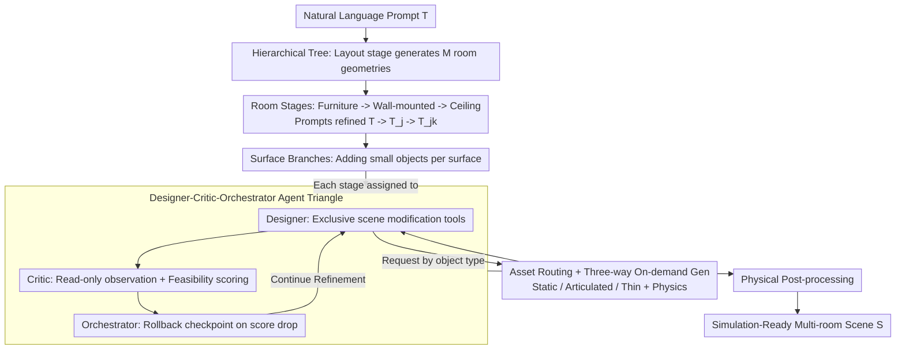

# SceneSmith: Agentic Generation of Simulation-Ready Indoor Scenes

**Conference**: ICML 2026 Spotlight  
**arXiv**: [2602.09153](https://arxiv.org/abs/2602.09153)  
**Code**: https://scenesmith.github.io/ (Project Homepage)  
**Area**: 3D Vision / Indoor Scene Generation / Agentic AI / Robotics Simulation  
**Keywords**: Indoor Scene Synthesis, VLM Agent, Robotics Simulation, Text-to-3D, Hierarchical Generation

## TL;DR
SceneSmith utilizes a designer-critic-orchestrator VLM agent triangle to construct indoor scenes layer-by-layer on a hierarchical tree of "layout $\rightarrow$ furniture $\rightarrow$ small objects." It deeply couples text-to-3D generation, articulated object retrieval, and physical property estimation into the agent toolchain. Generating directly from a single natural language prompt, it produces dense, actionable environments ready for physical simulators. Each room averages 71 objects (compared to 11–23 in baselines), with an inter-object collision rate $< 2\%$ and a gravity-based stability rate of $96\%$, significantly outperforming all prior methods.

## Background & Motivation
**Background**: Training home robots increasingly relies on large-scale simulations, but existing simulated scenes are mostly "empty rooms with a few sparsely placed pieces of furniture." They are either procedurally generated (ProcTHOR, Infinigen Indoors) based on hand-written rules with poor expressiveness, or data-driven (DiffuScene, etc.) limited by $SE(2)$ ground-alignment assumptions. Recent LLM/VLM-driven methods (Holodeck, I-Design, LayoutVLM, SceneWeaver) focus on furniture-level layout and visual realism while ignoring small objects, articulated objects, and physical properties.

**Limitations of Prior Work**: Real home scenes contain dense, articulated, and actionable cluttered structures like "cabinets filled with cups, plates, and bowls." In contrast, simulated rooms typically contain only a dozen static objects. Policies learned by robots in sparse scenes fail in real environments, as clutter manipulation is a core difficulty. Furthermore, scenes generated by previous methods lack collision geometry and physical properties (mass, friction, inertia), making them unsuitable for direct use in physics simulators.

**Key Challenge**: Existing pipelines split "asset generation" and "scene organization." Asset-side research (generating high-quality 3D objects) and scene-side research (arranging layouts on fixed asset libraries) operate independently. Consequently, no system can generate "geometrically realistic, physically attributed, dense, and physically feasible" simulation-ready houses from a single sentence. Additionally, the single-agent reason-act-reflect paradigm (SceneWeaver) is prone to self-evaluation bias, struggling to converge to dense and feasible configurations when generation, evaluation, and control are conflated into one role.

**Goal**: To generate "immediately simulation-ready" multi-room indoor environments from a single natural language prompt that satisfy: (1) object density close to real homes; (2) open-vocabulary assets generated on-demand; (3) geometric non-penetration and physical stability under gravity; (4) a full pipeline without human intervention.

**Key Insight**: Decompose scene construction into a tree-structured stage-level pipeline (layout $\rightarrow$ furniture $\rightarrow$ wall-mounted $\rightarrow$ ceiling $\rightarrow$ small object branches for each supporting surface). Each stage is handled by three VLM agents: a designer, a critic, and an orchestrator. Simultaneously, text-to-3D, articulated object retrieval, thin coverings, and physical property estimation are unified as agent tools scheduled by an asset router.

**Core Idea**: Replace single-shot generation or single-agent reflection with a "hierarchical agent tree + designer-critic-orchestrator triangle + integrated asset generation-routing-verification." This merges "scene generation" and "asset generation" at the agent tool level into an end-to-end, simulation-ready pipeline.

## Method

### Overall Architecture
The input is a natural language scene prompt $\mathcal{T}$, and the output is a multi-room scene $\mathcal{S}=\{\mathcal{R}_j\}$ that can be directly exported to Drake / MuJoCo / Isaac Sim / Genesis. Each room $\mathcal{R}_j=(\mathcal{G}_j, \mathcal{O}_j)$ includes architectural geometry (walls with thickness, floors, doors/windows) and a set of objects $\{(\mathcal{A}_i, \mathcal{X}_i)\}$. Each asset $\mathcal{A}_i$ contains a visual mesh, convex-decomposed collision geometry, physical properties (mass, center of mass, inertia, friction), and joint definitions for articulated objects.

The construction process follows a stage tree: the root stage uses a layout agent to generate the architectural geometry of $M$ rooms. Each room independently proceeds through three stages: "Furniture $\rightarrow$ Wall-mounted $\rightarrow$ Ceiling," with the global prompt $\mathcal{T}$ refined into room-level prompts $\mathcal{T}_j$. Subsequently, selected supporting entities (furniture surfaces, wall shelves, floor areas) in each room branch out to add small objects using entity-level prompts $\mathcal{T}_{j,k}$. Cross-surface coordination—such as "books on this shelf, plants on that one"—is explicitly constrained in these branch prompts. After all stages, physical post-processing (projection de-penetration + gravity settling) is performed before flattening into $\mathcal{S}$. Within each stage, execution is managed by the designer-critic-orchestrator agent triangle, with the designer calling the asset router to fetch objects as needed.

### Key Designs

**1. Designer-Critic-Orchestrator Agent Triangle: Breaking self-evaluation bias via tool permission isolation**

The single-agent reason-act-reflect paradigm (e.g., SceneWeaver) often falls into the trap of "rating its own proposal 90 points." Mixing generation, evaluation, and control into one role makes it difficult to converge to dense and feasible configurations. SceneSmith splits these tasks among three roles at each stage, assigning them different tool permissions. The Designer exclusively holds scene modification tools (placing/adjusting assets, snapping, assembling compound objects like fruit bowls) and can call any number of tools sequentially within a turn. The Critic is strictly limited to observation and feasibility verification tools (querying poses, rendering views, collision detection, reachability detection) and outputs a scalar score along with natural language feedback. Lacking modification permissions, the Critic provides an external perspective to catch semantic and physical errors missed by the Designer.

The Orchestrator treats both the Designer and Critic as schedulable tools and maintains historical checkpoints. If the Critic's score drops compared to the previous step, it rolls back to the prior state—turning "exploration" into "safe exploration" and preventing iterations from degrading. Each agent is equipped with a turn-based sliding window memory; earlier turns are compressed by LLM summarization, and visual observations are handled via a limited window cleared at the end of a stage to manage context length. This "role decomposition by permission" is significantly more stable than pure prompt-based role-playing.

**2. Asset Routing + Three-way On-demand Generation: Balancing open-vocabulary and simulation readiness**

Designer requests vary greatly: a "red apple" is a static object, a "kitchen cabinet with drawers" is articulated, and a "carpet" is a thin covering. Using a single text-to-3D pipeline for everything would result in cabinets with unopenable doors, while retrieval-only methods are limited by library capacity. SceneSmith's asset router diverts traffic by object type: compound requests (e.g., fruit bowl) are decomposed into atomic assets (a bowl plus multiple fruits). Static objects follow a generation path using GPT Image 1.5 for reference images, SAM3 for foreground segmentation, and SAM3D for textured mesh reconstruction. Poses are normalized, scaled to target sizes, collision parts are convex-decomposed, and physical properties (mass, center of mass, friction, inertia) are estimated by the VLM. Articulated objects are retrieved from the ArtVIP library (providing pre-made multi-link models with joint definitions) and supplemented with physical properties. Thin coverings use lightweight geometric planes paired with PBR materials retrieved from ambientCG to avoid unnecessary rigid-body complexity.

All candidate assets undergo mesh integrity checks and VLM semantic verification. Failures trigger retries within a budget or a strategy change, with failure reasons fed back to the agent. This "type-specific strategy + unified physical post-processing" is currently the only engineering balance that achieves an open vocabulary, articulation support, and immediate simulation readiness. On-demand generation also prevents robot policies from "cheating" by training on pre-known asset libraries.

**3. Hierarchical Tree Construction + Physical Post-processing: Agents for semantics, solvers for physical baselines**

Enforcing strict physical constraints within agents is extremely costly and slow to converge. SceneSmith assigns semantics and aesthetics to hierarchical tree construction and physical feasibility to deterministic solvers. Construction follows a tree that commits layer-by-layer from large to small: rooms branch first, then selected supporting entities within each room. Prompts refine across levels ($\mathcal{T} \to \mathcal{T}_j \to \mathcal{T}_{j,k}$), passing global style, room purpose, and surface semantics downward. Related surfaces, like two shelves of the same bookcase, are merged into a single branch to coordinate placement (e.g., "books on top, plants on bottom"). Object placement is specified as $SE(2)$ poses in the supporting surface coordinate system, then lifted to full $SE(3)$ using the surface's known $SE(3)$ pose, fundamentally preventing "floating vases" or "cups intersecting tables."

A physical post-processing pass is run at the end of the furniture and small object stages: first, non-linear optimization projects each object to the nearest collision-free configuration (preserving orientation), then gravity simulation in Drake allows unstable objects to settle into static equilibrium. This division of labor—"agent for rough logic + solver for refinement"—uses cheap, deterministic steps like mm-level de-penetration and gravity settling to ensure simulation readiness. Final residual penetration is only 3.8 mm. Walls and floors are modeled as volumetric geometry with thickness rather than planes to resist penetration during discrete-time-step physical simulation.

### Loss & Training
SceneSmith does not train new models; it combines off-the-shelf VLMs (GPT, etc.) with off-the-shelf vision foundation models (SAM3, SAM3D, text-to-image). The scalar score provided by the Critic is used for the Orchestrator's accept/rollback/refine decisions rather than gradient optimization. Agent behavior is controlled entirely via prompt engineering and tool-call budgets without any parameter fine-tuning.

## Key Experimental Results

### Main Results
210 prompts covering five categories: SceneEval-100, Type Diversity (pet shops, yoga studios, etc.), Object Density, Themed Scenes, and House-Level multi-room. 205 crowdsourced participants provided 3,051 valid pairwise comparisons.

| Dataset / Dimension | Metric | Ours (SceneSmith) | Prev. SOTA | Gain |
|--------|------|------|----------|------|
| Indoor Scene | Objects per room | **71.1 ± 13.0** | HSM 22.7 / Holodeck 23.0 | 3–6× |
| Indoor Scene | Collision Rate COL ↓ | **1.2%** | 3–29% (Baselines) | Significant |
| Indoor Scene | Static Stability STB ↑ | **95.6%** | 8–61% (Baselines) | 1.5–12× |
| Indoor Scene | Object-Object Rel. OOR ↑ | **67.6** | I-Design 28.6 | 2.2× |
| User Study | Realism Win Rate (vs 6 Baselines) | **92.2%** | — | All p < 0.001 |
| User Study | Prompt Fidelity Win Rate | **91.5%** | — | All p < 0.001 |
| House-Level | Object Count | **214.1 ± 60.9** | Holodeck 81.3 | 2.6× |
| House-Level | vs Holodeck Realism Win Rate | **80.3%** | — | p < 0.001 |
| Policy Eval | Evaluator-Human Agreement | **99.7%** (300 cases) | — | Only 1 marginal case |

### Ablation Study
6 ablations compared SceneSmith against itself via user studies and automated metrics.

| Configuration | Realism / Fidelity Win Rate | Object Count | Key Findings |
|------|----------------|--------|------|
| Full SceneSmith | — | 71.1 | Complete method |
| w/o Generated (Replaced with HSSD retrieval) | 63.8% / 67.0% | 57.7 | Generated assets are key contributors; provide open vocabulary. |
| w/o AssetValidation | 63.0% / 62.2% | 72.7 | Suppresses poor assets (mesh integrity & semantic checks). |
| w/o ObserveScene (Removes vision tools) | 61.5% / 53.2% | 69.7 | Visual feedback significantly aids realism; marginal for text fidelity. |
| w/o SpecializedTools (Removes snapping/grouping) | 54.8% / 53.2% | 61.5 | Smaller effect; requires more comparisons to detect. |
| w/o AgentMemory | 53.4% / 55.1% | 78.9 | Limited effect within a single stage. |
| w/o Critic | 51.8% / 47.5% | 54.0 | **Saves 70% cost but object count drops 24%**; a cost-effective trade-off. |

### Key Findings
- **Density is the primary axis where SceneSmith distances itself**: 71 vs 11–23 objects is not just a cosmetic improvement; it determines whether robots can learn to handle clutter. House-level results (214 vs 81) are similarly dominant.
- **Simulation-ready is a qualitative leap, not just quantitative update**: Baseline collision rates of 3–29% and stability as low as 8% mean objects intersect at the start or fly apart when physics starts. SceneSmith crushes collisions to 1.2% and raises stability to 96%.
- **Slightly lower ACC/NAV** is expected—the 3–6× higher object density naturally reduces free space, reflecting real-world messiness.
- **NoCritic realism didn't drop significantly but object count fell 24%**: This reveals the Critic's main contribution is "filling the scene" and "increasing object diversity" rather than just boosting realism.
- **House connectivity** is qualitatively more logical: Generated hotels have "entrance $\rightarrow$ reception $\rightarrow$ corridor $\rightarrow$ rooms," whereas Holodeck often generates houses accessible only through a random guest room.
- **Closed-loop policy evaluation**: The evaluator achieved 99.7% agreement with humans across 300 cases; successful differentiation between standard (16%) and degraded (12%) policies shows the pipeline's utility.

## Highlights & Insights
- **Tool permission isolation in the agent triangle** is a transferable design pattern: the Critic cannot modify, the Designer cannot rollback, and the Orchestrator treats colleagues as tools. This "permission-based role separation" is superior for any generative task requiring iterative refinement (code generation, UI design).
- **The "agent for rough logic + solver for refinement" division** is a universal paradigm for physics-aware generation. Enforcing hard constraints via agents is inefficient; mm-level projection and gravity settling are deterministic and cheap. Assigning hard constraints to solvers and aesthetics to agents finds the "simulation-ready" sweet spot.
- **Asset Routing by object type**: Co-existence of generation, retrieval, and thin coverings—rather than choosing just one—acknowledges that text-to-3D is still poor for articulated bodies. This is a pragmatic engineering trade-off.
- **On-demand asset generation avoids data contamination**: Evaluating on generated rather than library-based assets ensures that "seeing the asset during training" is no longer a bias variable, which is crucial for zero-shot evaluation of robot foundation models.
- **Hierarchical prompt refinement** allows local decisions to be parallelized while maintaining global consistency.

## Limitations & Future Work
- The full pipeline relies heavily on closed-source frontier models (GPT Image 1.5), leading to high costs and latency.
- Articulated objects are still limited by the coverage of the ArtVIP library; true on-demand generation for articulated objects remains an open problem.
- Physical post-processing focuses on stability; dynamic reachability, grasp feasibility, and joint motion envelopes are not explicitly optimized, potentially leading to "stable but unreachable" configurations.
- Automatic evaluation via SceneEval (also VLM-based) has known false positive/negative issues. High realism win rates (92%) are likely influenced by the sheer gap in object density relative to baselines (density confusion).
- End-to-end policy evaluation is still "toy-level" (pick-and-place, 12–16% success): scene generation capabilities have far outpaced current robot policy capabilities.

## Related Work & Insights
- **vs HSM (Pun et al., 2026)**: SceneSmith adopts its hierarchical philosophy but adds refined prompts and the agent triangle, resulting in vastly better object counts (71 vs 23) and simulation readiness (STB 96% vs 45%).
- **vs Holodeck (Yang et al., 2024b)**: Holodeck uses constraint solvers + retrieval for layouts but only supports sparse scenes; SceneSmith achieves 2.6× the object count at the house level.
- **vs SceneWeaver (Yang et al., 2025)**: SceneWeaver uses a single LLM planner for reason-act-reflect; SceneSmith upgrades this to a three-agent division of labor with visual feedback and multi-tool turns, achieving a 91.7% win rate.
- **vs ProcTHOR (Deitke et al., 2022b)**: Purely rule-based methods have limited semantics; SceneSmith achieves open-vocabulary semantic control while using a tool system to ensure physical feasibility.
- **vs LayoutVLM / I-Design**: These focus on visual-language layout optimization with low object counts (11–14) and poor stability (8–61%). SceneSmith represents a leap in all relevant dimensions.

## Rating
- **Novelty**: ⭐⭐⭐⭐ The combination of agent triangles and hierarchical asset routing is a powerful engineering synthesis that creates a truly end-to-end usable system.
- **Experimental Thoroughness**: ⭐⭐⭐⭐⭐ 210 prompts, 205 participants, 3,051 comparisons, 6 ablations, 5 baselines, and real-bot demos across four dimensions.
- **Writing Quality**: ⭐⭐⭐⭐⭐ Clear motivation ("clutter is the core difficulty") and transparent discussion of trade-offs like the NoCritic alternative.
- **Value**: ⭐⭐⭐⭐⭐ The claim that "environment generation is no longer the bottleneck for simulation training" is justified. This is an infrastructure-level contribution to the robot learning community.

<!-- RELATED:START -->

## Related Papers

- [\[ECCV 2024\] A Diffusion Model for Simulation Ready Coronary Anatomy with Morpho-skeletal Control](../../ECCV2024/image_generation/a_diffusion_model_for_simulation_ready_coronary_anatomy_with.md)
- [\[CVPR 2025\] Channel-wise Noise Scheduled Diffusion for Inverse Rendering in Indoor Scenes](../../CVPR2025/image_generation/channel-wise_noise_scheduled_diffusion_for_inverse_rendering_in_indoor_scenes.md)
- [\[CVPR 2026\] Agentic Retoucher for Text-To-Image Generation](../../CVPR2026/image_generation/agentic_retoucher_for_texttoimage_generation.md)
- [\[ICML 2026\] AtelierEval: Agentic Evaluation of Humans & LLMs as Text-to-Image Prompters](ateliereval_agentic_evaluation_of_humans_llms_as_text-to-image_prompters.md)
- [\[CVPR 2026\] Vinedresser3D: Agentic Text-guided 3D Editing](../../CVPR2026/image_generation/vinedresser3d_agentic_text-guided_3d_editing.md)

<!-- RELATED:END -->
