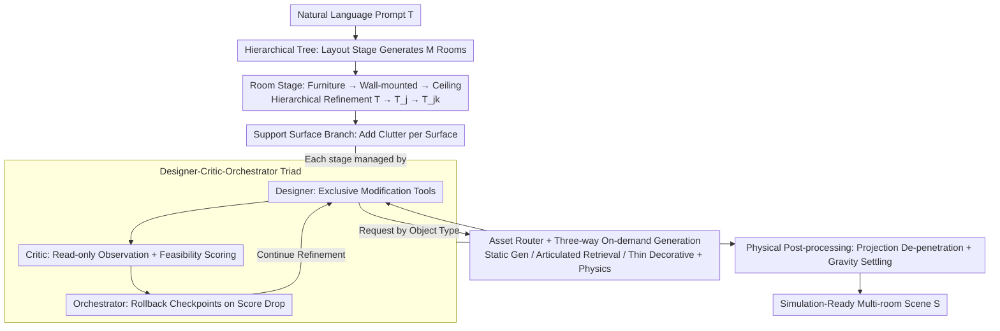

# SceneSmith: Agentic Generation of Simulation-Ready Indoor Scenes

**Conference**: ICML 2026 Spotlight  
**arXiv**: [2602.09153](https://arxiv.org/abs/2602.09153)  
**Code**: https://scenesmith.github.io/ (Project Homepage)  
**Area**: 3D Vision / Indoor Scene Generation / Agentic AI / Robot Simulation  
**Keywords**: Indoor Scene Synthesis, VLM Agent, Robot Simulation, Text-to-3D, Hierarchical Generation

## TL;DR
SceneSmith constructs indoor scenes layer-by-layer on a "layout → furniture → clutter" hierarchical tree using a designer-critic-orchestrator VLM agent triad. It deeply integrates text-to-3D generation, articulated object retrieval, and physical property estimation into the agent's toolchain. From a single natural language prompt, it directly produces dense, interactable environments ready for physical simulators. Each room averages 71 objects (compared to 11–23 in baselines), with an inter-object collision rate $< 2\%$ and a 96% stability rate under gravity, significantly outperforming all prior methods.

## Background & Motivation
**Background**: Training home robots increasingly relies on large-scale simulations. However, existing simulation scenes are mostly "empty rooms with a few sparsely placed pieces of furniture." They are either procedurally generated (ProcTHOR, Infinigen Indoors) relying on hand-written rules with poor expressiveness, or data-driven (e.g., DiffuScene) limited by SE(2) ground-alignment assumptions. Recent LLM/VLM-driven methods (Holodeck, I-Design, LayoutVLM, SceneWeaver) focus on furniture-level layout and visual realism while ignoring small objects, articulated parts, and physical properties.

**Limitations of Prior Work**: Real home environments contain dense, articulated, and interactable clutter structures, such as "cabinets filled with plates and cups." In contrast, simulated rooms typically contain only a dozen static objects. Policies learned in sparse environments fail in real-world settings, where clutter manipulation is a core difficulty. Furthermore, many generated scenes lack collision geometry, mass, friction, or inertia, making them incompatible with physical simulators.

**Key Challenge**: Current pipelines split "asset generation" and "scene organization." Asset-side research (generating high-quality 3D objects) and scene-side research (layout optimization on fixed libraries) operate independently. Consequently, no system can generate "densely populated, physically feasible, and simulation-ready" houses from a single sentence. Additionally, single-agent reason-act-reflect paradigms (like SceneWeaver) suffer from self-evaluation bias, struggling to converge on dense yet feasible configurations.

**Goal**: To enable a single natural language prompt to grow "immediately simulation-ready" multi-room indoor environments that satisfy: (1) Object density comparable to real homes; (2) Open-vocabulary asset generation on demand; (3) Geometrical non-penetration and gravitational stability; (4) A fully automated pipeline without human intervention.

**Key Insight**: Decompose scene construction into a stage-based tree structure (layout → furniture → wall-mounted → ceiling → small objects branching from each support surface). Each stage is managed by a designer/critic/orchestrator VLM agent triad. Text-to-3D, articulated object retrieval, thin-covering materials, and physical property estimation are unified as agent tools dispatched by an asset router.

**Core Idea**: Replace single-shot generation or single-agent reflection with a "hierarchical agent tree + designer-critic-orchestrator specialization + asset generation-routing-validation integration." This merges scene generation and asset generation at the agent tool level into an end-to-end, simulation-oriented pipeline.

## Method
### Overall Architecture
The input is a natural language scene prompt $\mathcal{T}$, and the output is a multi-room scene $\mathcal{S}=\{\mathcal{R}_j\}$ exportable to Drake / MuJoCo / Isaac Sim / Genesis. Each room $\mathcal{R}_j=(\mathcal{G}_j, \mathcal{O}_j)$ includes architectural geometry (walls with thickness, floors, doors, windows) and a set of objects $\{(\mathcal{A}_i, \mathcal{X}_i)\}$. Each asset $\mathcal{A}_i$ contains a visual mesh, convex decomposition collision geometry, and physical properties (mass, center of mass, inertia, friction). Articulated objects also include joint definitions.

The construction process follows a stage tree: the root stage generates the architectural geometry for $M$ rooms via a layout agent. Each room then independently follows three stages: "Furniture → Wall-mounted → Ceiling," with prompts refined from the global $\mathcal{T}$ into room-level $\mathcal{T}_j$. Subsequently, selected support entities (furniture surfaces, wall shelves, floor areas) branch out to add small objects using entity-level prompts $\mathcal{T}_{j,k}$. Cross-surface coordination (e.g., "books here, plants there") is explicitly constrained in these branch prompts. After all stages, physical post-processing (projection de-penetration + gravity settling) is performed before flattening into $\mathcal{S}$. Each stage is executed by the designer-critic-orchestrator agent triad.

### Key Designs

**1. Designer-Critic-Orchestrator Triad: Breaking Self-Evaluation Bias via Tool Privilege Isolation**

Single-agent paradigms often fall into the trap of "rating one's own proposal with a 90/100." Mixing generation, evaluation, and control makes it difficult to converge on dense, feasible configurations. SceneSmith splits these tasks among three roles with distinct tool privileges. The **Designer** has exclusive access to scene modification tools (placement, adjustment, snapping, and assembling complex objects like fruit bowls), allowing multiple atomic edits per turn. The **Critic** is strictly limited to observation and feasibility verification tools (querying poses, rendering views, collision detection, reachability checks), outputting a scalar score and feedback without modification rights. This external perspective helps catch semantic and physical issues overlooked by the designer.

The **Orchestrator** manages the designer and critic as dispatchable tools and maintains historical checkpoints. If the critic's score drops, it rolls back to the previous state—turning "exploration" into "safe exploration." Each agent uses a sliding-window memory; earlier turns are compressed via LLM summarization, and visual observations are cleared at the end of each stage to manage context length. This privilege-based isolation is significantly more stable than pure prompt-based roleplay.

**2. Asset Routing + Three-way On-demand Generation: Balancing Open Vocabulary and Simulation-Ready Physics**

Requests from the designer vary greatly: "a red apple" is static, "a kitchen cabinet with drawers" is articulated, and "a rug" is a thin decorative item. Using a single text-to-3D pipeline for everything would result in cabinets with non-functional doors, while retrieval-only methods are limited by library size. The asset router diverts requests as follows: complex requests (e.g., fruit bowl) are decomposed into atomic assets; static objects follow a generation path (GPT Image 1.5 for reference, SAM3 for segmentation, SAM3D for mesh reconstruction), followed by orientation normalization, scaling, convex decomposition, and VLM-based estimation of physical properties ($m, CoM, \mu, I$). Articulated objects are retrieved from the ArtVIP library (including joint definitions) with supplementary physical properties. Thin coverings use lightweight geometry with PBR materials from ambientCG.

All candidate assets undergo mesh integrity checks and VLM semantic verification. This hybrid "strategy-by-type + unified physical post-processing" approach is the current engineering sweet spot for combining open-vocabulary, articulated functionality, and immediate simulation readiness. On-demand generation also prevents data contamination where robot policies might "cheat" on known asset libraries.

**3. Hierarchical Tree Construction + Physical Post-processing: Agents Manage Semantics, Solvers Manage Physics**

Enforcing strict physical constraints solely through agents is costly and slow. SceneSmith delegates semantics and aesthetics to the hierarchical tree and physical feasibility to deterministic solvers. Construction follows a "big-to-small" tree: rooms branch first, followed by support entities within rooms. Prompts are refined hierarchically ($\mathcal{T} \to \mathcal{T}_j \to \mathcal{T}_{j,k}$) to pass global style and room utility down the tree. Related surfaces (e.g., two shelves of one bookcase) are merged to coordinate placement. Objects are placed in the $SE(2)$ pose of the support surface coordinate system, then lifted to $SE(3)$, fundamentally preventing "floating vases" or "cups intersecting tables."

Physical post-processing occurs after the furniture and clutter stages: non-linear optimization projects objects to the nearest collision-free configuration, followed by a gravity simulation in Drake to allow unstable objects to settle into equilibrium. This labor division—agent for "roughly reasonable" and solver for "refined precision"—ensures simulation readiness with minimal penetration (3.8 mm). Walls and floors use volumetric geometry with thickness to prevent tunneling during discrete-time-step physics simulations.

### Loss & Training
SceneSmith does not train new models; it utilizes off-the-shelf VLMs (GPT-4o, etc.) + visual foundation models (SAM3, SAM3D, T2I). The scalar score from the critic is used for the orchestrator's acceptance/rollback decisions rather than gradient optimization. Agent behavior is controlled entirely via prompt engineering and tool-calling budgets without parameter fine-tuning.

## Key Experimental Results

### Main Results
210 prompts covering five categories: SceneEval-100, Type Diversity (pet shops, yoga studios, etc.), Object Density, Themed Scenes, and House-Level multi-room. 205 crowdsourced participants provided 3,051 valid pairwise comparisons.

| Dataset / Dimension | Metric | Ours (SceneSmith) | Prev. SOTA | Gain |
|--------|------|------|----------|------|
| Indoor Scene | Objects/Room | **71.1 ± 13.0** | HSM 22.7 / Holodeck 23.0 | 3–6× |
| Indoor Scene | Collision Rate COL ↓ | **1.2%** | 3–29% (Baselines) | Significant |
| Indoor Scene | Static Stability STB ↑ | **95.6%** | 8–61% (Baselines) | 1.5–12× |
| Indoor Scene | Obj-Obj Rel. OOR ↑ | **67.6** | I-Design 28.6 | 2.2× |
| User Study | Realism Win Rate (vs 6 Baselines) | **92.2%** | — | All p < 0.001 |
| User Study | Prompt Fidelity Win Rate | **91.5%** | — | All p < 0.001 |
| House-Level | Object Count | **214.1 ± 60.9** | Holodeck 81.3 | 2.6× |
| House-Level | vs Holodeck Realism Win | **80.3%** | — | p < 0.001 |
| Policy Eval | Eval-Human agreement | **99.7%** (300 cases) | — | Only 1 edge case |

### Ablation Study
Six ablations were compared against the full SceneSmith using human studies and automated metrics.

| Configuration | Realism / Fidelity Win Rate | Obj Count | Mechanism & Insight |
|------|----------------|--------|------|
| Full SceneSmith | — | 71.1 | Complete method |
| w/o Generated (HSSD retrieval replacement) | 63.8% / 67.0% (Sig) | 57.7 | Generated assets are critical for realism and open-vocabulary support. |
| w/o AssetValidation | 63.0% / 62.2% (Sig) | 72.7 | Validation prevents low-quality assets from entering the scene. |
| w/o ObserveScene (Visual toolkit) | 61.5% / 53.2% | 69.7 | Visual feedback significantly improves realism. |
| w/o SpecializedTools (snapping/facing/etc.) | 54.8% / 53.2% (N.S.) | 61.5 | Specialized tools had small marginal effects. |
| w/o AgentMemory | 53.4% / 55.1% (N.S.) | 78.9 | Memory within a single stage has limited impact. |
| w/o Critic | 51.8% / 47.5% (N.S.) | 54.0 | **Saves 70% cost but obj count drops 24%**; a useful trade-off. |

### Key Findings
- **Density is the primary differentiator**: 71 vs. 11–23 objects per room directly determines if a robot can learn to handle clutter.
- **Physical readiness is a qualitative shift**: Baseline collision rates of 3–29% and stability as low as 8% mean objects explode or fall through floors upon simulation start. SceneSmith achieves 1.2% collision and 96% stability.
- **Lower ACC/NAV is expected**: High object density naturally reduces free space, reflecting the realistic messiness of homes.
- **NoCritic saves money but reduces density**: The Critic's main contribution is "filling the scene" and "increasing diversity" rather than just visual realism.
- **House Connectivity**: Generated layouts show realistic topology (e.g., entrance → reception → hallway → rooms), whereas baselines like Holodeck often generate isolated or nonsensical room connections.
- **Policy Evaluation Loop**: 99.7% agreement between the evaluator and human labels demonstrates that the pipeline accurately distinguishes between standard and degraded robot strategies.

## Highlights & Insights
- **Privilege Isolation in Agent Triads**: Scaling the "roles with restricted tools" concept to other generative tasks (coding, document review) is a robust design pattern to prevent self-bias.
- **"Agent for Semantics + Solver for Physics" division**: This is a universal paradigm for physics-aware generation. Delegating millimetric de-penetration and settling to cheap, deterministic solvers is far more efficient than agent-based iterative optimization.
- **Multi-modal Asset Routing**: Orchestrating generation, retrieval, and thin coverings acknowledges the current limitations of Text-to-Articulated models while providing a functional engineering solution.
- **On-demand asset generation avoids evaluation contamination**: Generating assets rather than retrieving from common libraries ensures that zero-shot robot foundation model evaluation remains unbiased.
- **Hierarchical Prompt Refinement**: Breaking $\mathcal{T}$ into $\mathcal{T}_j$ and $\mathcal{T}_{j,k}$ allows for parallel local execution while maintaining global stylistic consistency.

## Limitations & Future Work
- Dependency on expensive closed-source VLMs and vision foundation models results in high latency; the NoCritic version is the only cost-efficient alternative.
- Articulated objects are still limited by the coverage of existing libraries (e.g., ArtVIP); true on-demand generation for articulated assets remains unsolved.
- Post-processing focuses on static stability. Constraints like dynamic reachability, grasp feasibility, and joint motion envelopes are not explicitly optimized.
- Automatic evaluation via VLM scoring (SceneEval) has known false positive/negative issues despite high human agreement.
- Cross-cultural interior design styles and distributions were not explored, as all prompts were in English and reflected Western home layouts.

## Related Work & Insights
- **vs HSM (Pun et al., 2026)**: SceneSmith borrows the support surface detection and hierarchical philosophy but adds hierarchical prompt refinement and the agent triad, leading to significantly higher density and stability.
- **vs Holodeck (Yang et al., 2024b)**: Holodeck uses constraint solvers for sparse layouts; SceneSmith achieves 2.6× the object count and 1/4 the collision rate at the house level.
- **vs SceneWeaver (Yang et al., 2025)**: Upgrades single-agent reflection to a triad with expanded toolsets and visual feedback, achieving a 91.7% win rate.
- **vs ProcTHOR / Infinigen Indoors**: Procedural methods lack semantic flexibility; SceneSmith provides open-vocabulary control while maintaining physical validity via its tool system.
- **Value**: The claim that "environment generation is no longer the bottleneck for simulation training" is valid—SceneSmith's density and stability move robot simulation training from "research demo" to "industrial utility."

## Rating
- Novelty: ⭐⭐⭐⭐ The combination of agent triads and hierarchical routing is an engineering consolidation that provides massive functional value.
- Experimental Thoroughness: ⭐⭐⭐⭐⭐ Comprehensive evaluation across human study (3,051 pairs), physical metrics, and robot policy closed-loop testing.
- Writing Quality: ⭐⭐⭐⭐⭐ Clearly articulated motivations and honest discussions of trade-offs and limitations.
- Value: ⭐⭐⭐⭐⭐ A foundational contribution to the robot learning community by enabling complex, realistic, and physically valid simulation environments.

<!-- RELATED:START -->

## Related Papers

- [\[ECCV 2024\] A Diffusion Model for Simulation Ready Coronary Anatomy with Morpho-skeletal Control](../../ECCV2024/image_generation/a_diffusion_model_for_simulation_ready_coronary_anatomy_with.md)
- [\[CVPR 2025\] Channel-wise Noise Scheduled Diffusion for Inverse Rendering in Indoor Scenes](../../CVPR2025/image_generation/channel-wise_noise_scheduled_diffusion_for_inverse_rendering_in_indoor_scenes.md)
- [\[CVPR 2026\] Agentic Retoucher for Text-To-Image Generation](../../CVPR2026/image_generation/agentic_retoucher_for_texttoimage_generation.md)
- [\[ICML 2026\] AtelierEval: Agentic Evaluation of Humans & LLMs as Text-to-Image Prompters](ateliereval_agentic_evaluation_of_humans_llms_as_text-to-image_prompters.md)
- [\[CVPR 2026\] Vinedresser3D: Agentic Text-guided 3D Editing](../../CVPR2026/image_generation/vinedresser3d_agentic_text-guided_3d_editing.md)

<!-- RELATED:END -->
