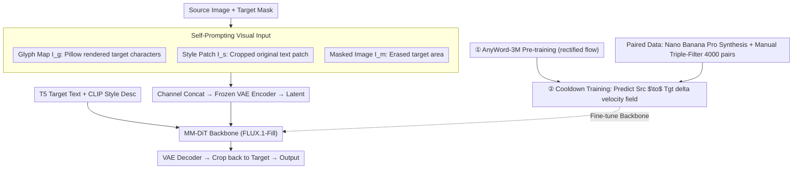

# Self-Prompting Diffusion Transformer for Open-Vocabulary Scene Text Editing via In-Context Learning

**Conference**: ICML 2026  
**arXiv**: [2605.15523](https://arxiv.org/abs/2605.15523)  
**Code**: https://hongxiii.github.io/mstedit (Project Page)  
**Area**: Diffusion Models / Image Editing / Scene Text Editing  
**Keywords**: Scene Text Editing, MM-DiT, Self-Prompting, In-Context Learning, Open-Vocabulary

## TL;DR
Ours proposes a self-prompting scene text editing method based on FLUX-Fill (MM-DiT). It directly crops style prompts from the original image and renders glyph prompts using Pillow. These prompts are concatenated channel-wise with the masked image and fed into the diffusion backbone. Following this, cooldown training is performed on 4,000 high-quality paired images generated by Nano Banana Pro. This approach achieves open-vocabulary text replacement while maintaining consistency with original styles across 13 languages.

## Background & Motivation

**Background**: Current mainstream scene text editing (STE) solutions follow the image inpainting paradigm: the original text area is erased with a mask, and the diffusion model regenerates new text within the mask. To ensure correct character structures, methods like AnyText / AnyText2 / GlyphMastero often use a pre-trained OCR model as a glyph encoder to extract character-level features.

**Limitations of Prior Work**: This paradigm introduces two specific issues. First, OCR is essentially a classifier with a closed dictionary. For rare characters, low-resource languages, or artistic fonts, it exceeds the editable vocabulary. Training a glyph encoder from scratch requires massive amounts of data. Second, inpainting erases visual information in the target area. Newly generated text must "borrow" style from surrounding pixels—if the target text style differs from the background text (e.g., red "Charmander" surrounded by blue text as in Fig. 1), the new characters are erroneously rendered in blue, losing original color, font, and texture.

**Key Challenge**: To preserve the original style of the target text, the model needs to see the pixels of the target area; however, the inpainting setup requires erasing that very area. Similarly, to support any language/character, one cannot rely on a closed-vocabulary OCR encoder, yet sufficient fine-grained glyph structure must be injected into the model.

**Goal**: Enable MM-DiT to satisfy both "open-vocabulary glyph correctness" and "consistency with original style" without introducing additional style or glyph encoders.

**Key Insight**: MM-DiT (specifically FLUX-Fill) inherently possesses multimodal in-context learning capabilities. By inserting information as visual tokens into the input sequence, the model can spontaneously utilize it during attention. Based on this, the authors propose "self-prompting": directly cropping the style signal from the original image and rendering the glyph signal via a font library, allowing MM-DiT to learn how to use them.

**Core Idea**: Concatenate the style patch cropped from the original image and the glyph map rendered by Pillow with the masked image along the channel dimension. This forms the "self-prompting" visual input for MM-DiT, replacing specialized OCR or style encoders.

## Method

### Overall Architecture
The method addresses the need for "both arbitrary open-vocabulary glyphs and style consistency," which the inpainting paradigm fails to achieve. Consequently, Ours avoids training any specialized encoders and instead feeds style and glyph information as "ready-made visual materials" into the MM-DiT input sequence, leveraging its in-context learning. Specifically, the backbone is FLUX.1-Fill-Dev (an inpainting-oriented MM-DiT utilizing rectified flow and dual/single-stream transformers). On the visual side, a style patch $I_s$ cropped from the source, a glyph map $I_g$ rendered via Pillow, and a masked image $I_m$ with the target area erased are concatenated as $I_{\text{input}}=\mathrm{Concat}(I_g, I_s, I_m)$. This is passed through a frozen VAE encoder to obtain latent $z_0$. On the text side, frozen T5 encodes the target text (glyph text prompt for semantic structure), and CLIP encodes the style description (style text prompt for visual alignment). Training involves fine-tuning the MM-DiT backbone in two stages: 1 epoch of self-supervised pre-training on AnyWord-3M, and 10 epochs of cooldown training on 4,000 high-quality paired images. During inference, guidance scale=30 and 30 sampling steps are used, with the output restored via VAE decoder and pasted back into the target region.

### Key Designs

**1. Self-Prompting Visual Input: Feeding Style and Glyphs Directly as Ready-made Materials**

The two pain points of STE—closed OCR vocabularies and style loss due to inpainting—originate from the requirement to encode information into specialized features. Ours takes the opposite approach: the style prompt $I_s$ comes directly from the source image (the minimal bounding box patch of the original text), carrying inherent color, font, texture, and local lighting. The glyph prompt $I_g$ uses Pillow to render target strings as high-contrast black-and-white single-line glyph maps, providing stroke-level geometric priors. When concatenated with the masked image $I_m$ and passed through the VAE, MM-DiT's attention performs work-sharing via in-context learning: "copy style from $I_s$, content from $I_g$, and background from $I_m$." Using "rendered images" replaces OCR encoders, completely opening the vocabulary (any Unicode character supported by the font can be edited). Using "source patches" replaces style encoders, avoiding representation misalignment between glyph encoders and VAE latent spaces seen in TextCtrl and saving the data cost of training style encoders from scratch.

**2. Cooldown Training: Predicting "Source $\to$ Target" Delta Velocity Fields to Prevent Collapse**

Rendering signals alone are insufficient—in datasets like AnyWord-3M, original text is already erased, so models only learn to "render text" rather than "replace text with style consistency." Ours designs a two-stage objective: First, standard rectified flow $\mathcal{L}_{\text{RF}}=\mathbb{E}[\|\hat v_\theta(z_t,t,c)-(z_1-z_0)\|_2^2]$ on AnyWord-3M for general text inpainting. Second, borrowing from MECO, the "original text area" is injected as meta-information into the style prompt, and the training objective shifts from "noise $\to$ image" to a "source $\to$ target" velocity field, where $z_t=(1-\sigma_t)z_0^{\text{src}}+\sigma_t z_0^{\text{tgt}}$, minimizing $\mathcal{L}_{\text{CD}}=\mathbb{E}[\|\hat v_\theta(z_t,t,c)-(z_0^{\text{tgt}}-z_0^{\text{src}})\|_2^2]$. If source images were fed directly into training, the model might lazily copy both style and glyphs, leading to editing failure. Predicting the "source $\to$ target delta velocity field" explicitly tells the model "what to change and what to keep," decoupling style preservation from content replacement during optimization.

**3. Paired Data Construction: LLM as Synthesizer, Human as Filter**

Cooldown requires seeing "two images identical except for text" to learn style preservation, but such real-world pairs are nearly impossible to collect. Ours uses the instruction-based editing model Nano Banana Pro to generate candidate pairs, which are then manually filtered based on three criteria: (a) non-target areas remain identical; (b) generated text is semantically correct; (c) edited text maintains consistent color, font, and texture with the original. This yielded 4,000 pairs. Using a strong generative model as a synthesizer and humans as filters is the most cost-effective compromise given the absence of style-consistent pairs.

### Loss & Training
Two stages: (1) 1 epoch on AnyWord-3M with standard rectified flow objective $\mathcal{L}_{\text{RF}}$; (2) 10 epochs on 4,000 paired images with cooldown objective $\mathcal{L}_{\text{CD}}$. Optimizer: AdamW, constant lr=$2\times10^{-5}$, bf16 + 8-bit optimizer state, per-GPU batch=1 with grad-accum 8 (effective batch 64), 8×A100. Multi-language data mixed training without language-level scheduling.

## Key Experimental Results

### Main Results
Compared against 7 SOTAs on the AnyText-benchmark (1,000 test images each for Chinese/English):

| Dataset | Metric | Ours | Prev. SOTA (TextFlux) | Gain |
|--------|------|------|----------|------|
| English | Sen.ACC ↑ | 0.8857 | 0.8231 | +6.26 pt |
| English | NED ↑ | 0.9568 | 0.9235 | +3.33 pt |
| English | FID ↓ | 7.62 | 13.42 | −43% |
| English | LPIPS ↓ | 0.0365 | 0.0721 | −49% |
| Chinese | Sen.ACC ↑ | 0.8249 | 0.7289 | +9.60 pt |
| Chinese | NED ↑ | 0.9147 | 0.8612 | +5.35 pt |
| Chinese | FID ↓ | 7.95 | 13.67 | −42% |
| Chinese | LPIPS ↓ | 0.0268 | 0.0524 | −49% |

On the self-constructed MST-Edit multilingual dataset (covering 11 languages including Arabic, French, German, Korean, Japanese, Italian, Bengali, Hindi, Russian, Thai, and Swahili), Ours significantly leads two OCR-free baselines (FluxText, TextFlux). Latin-based languages performed best due to similar stroke structures, while Thai performed relatively lower due to complex glyph and stroke layout.

### Ablation Study

| Config | Eng Sen.ACC | Eng FID | Eng LPIPS | Chi Sen.ACC | Chi FID | Chi LPIPS |
|------|------|------|------|------|------|------|
| w/o cooldown (no style prompt + no cooldown) | 0.8738 | 11.56 | 0.0608 | 0.8125 | 12.01 | 0.0425 |
| w/ cooldown (Full Model) | 0.8857 | 7.62 | 0.0365 | 0.8249 | 7.95 | 0.0268 |

### Key Findings
- The primary gain from Style prompt + cooldown is reflected in image quality (FID/LPIPS generally improved by ~40%), while text accuracy improvements are moderate (~+1%). This indicates the design focuses on "style correction" rather than "glyph correction."
- Stroke-level rather than character-level representation brings positive multilingual transfer: following an Arabic $\to$ English $\to$ French $\to$ Chinese $\to \dots \to$ Swahili training sequence, Seq.ACC for previously learned languages did not drop but rose steadily—shared low-level stroke primitives were strengthened by multilingual exposure.
- Qualitative results (Fig 6) show: without the style prompt, the model renders target text in fonts never seen in the source (e.g., rendering "HOT SUMMER" in an alien font) or preserves the font but destroys the original background; the full model preserves both.

## Highlights & Insights
- **"Self-Prompting" is the most direct physical realization of in-context learning**: rather than training specialized encoders to turn info into tokens, feeding original patches and rendered images as tokens allows MM-DiT's attention to choose for itself. This logic applies to other local editing tasks requiring style/content decoupling (logo replacement, sticker editing, badge modification).
- **Using general-purpose generative LLMs as "Data Synthesizers"**: Nano Banana Pro generation + triple filtering provided 4,000 high-quality pairs, significantly cheaper than real-world collection. This is a versatile training data acquisition paradigm for low-resource tasks.
- **The Cooldown objective $z_0^{\text{tgt}}-z_0^{\text{src}}$ delta velocity field is clever**: It effectively tells the model "only predict the change," naturally preventing collapse. This trick can be migrated to other diffusion tasks involving "local editing with identity preservation."

## Limitations & Future Work
- Glyph prompts rely on Pillow and font files. If the target character is missing from the font file, rendering fails—the "openness" of the vocabulary is capped by font coverage, making it unfriendly to extremely rare ancient scripts or hand-drawn artistic characters.
- Style prompts come from the minimal bounding box of the target mask. When the mask includes substantial background or multiple fonts, the cropped patch includes irrelevant styles, potentially causing style drift. Boundary control is not strictly enforced.
- Cooldown data is limited to 4,000 pairs and relies on a single generator (Nano Banana Pro), risking the distillation of generator-specific style biases. Multi-generator mixing and auto-scoring filters could be explored.
- High computational overhead: FLUX-Fill full-parameter fine-tuning, 8×A100, guidance=30, and 30 sampling steps result in deployment costs higher than LoRA-based STE solutions. Distillation into a lighter student model would be more practical.

## Related Work & Insights
- **vs AnyText/AnyText2 (Tuo 2023/2024)**: They use OCR encoders for character-level features; Ours uses rendered glyph maps for stroke-level features. Ours offers open-vocabulary support across 13 languages, while they are limited by OCR vocabularies.
- **vs FluxText / TextFlux (2025)**: Also OCR-free, but FluxText/TextFlux render glyphs inside the mask for feature extraction. Ours adds "cropping original image as style prompt + cooldown training," resulting in a 40%+ gap in FID/LPIPS.
- **vs TextCtrl (Zeng 2024)**: TextCtrl uses specialized text style encoders, but suffers from representation space misalignment with VAE latents. Ours places style signals directly into VAE input channels, ensuring natural alignment.
- **Insight**: MM-DiT in-context learning doesn't necessarily require "training an adapter to turn info into tokens." Feeding info in raw visual form (crops, renders, references) stacked along the VAE input channels is a minimalist and efficient injection method worth trying in ID-preserving generation and stylized editing.

## Rating
- Novelty: ⭐⭐⭐⭐ The combination of self-prompting and cooldown delta objectives is clean, though individual components are incremental.
- Experimental Thoroughness: ⭐⭐⭐⭐ Covers 13 languages, two datasets, ablation of cooldown, and multilingual cyclical training.
- Writing Quality: ⭐⭐⭐⭐ Clear argumentation chain (motivation—contradiction—method—ablation).
- Value: ⭐⭐⭐⭐ Pushes the multilingual STE SOTA to a new level with strong engineering reproducibility.

## Related Papers

- [\[NeurIPS 2025\] Seg4Diff: Unveiling Open-Vocabulary Segmentation in Text-to-Image Diffusion Transformers](../../NeurIPS2025/image_generation/seg4diff_unveiling_open-vocabulary_segmentation_in_text-to-image_diffusion_trans.md)
- [\[CVPR 2026\] Dynamic-eDiTor: Training-Free Text-Driven 4D Scene Editing with Multimodal Diffusion Transformer](../../CVPR2026/image_generation/dynamic-editor_training-free_text-driven_4d_scene_editing_with_multimodal_diffus.md)
- [\[NeurIPS 2025\] ICEdit: Enabling Instructional Image Editing with In-Context Generation in Large Scale Diffusion Transformer](../../NeurIPS2025/image_generation/in-context_edit_enabling_instructional_image_editing_with_in-context_generation_.md)
- [\[CVPR 2026\] Omni-Attribute: Open-vocabulary Attribute Encoder for Visual Concept Personalization](../../CVPR2026/image_generation/omni-attribute_open-vocabulary_attribute_encoder_for_visual_concept_personalizat.md)
- [\[CVPR 2026\] A Self-Conditioned Representation Guided Diffusion Model for Realistic Text-to-LiDAR Scene Generation](../../CVPR2026/image_generation/a_self-conditioned_representation_guided_diffusion_model_for_realistic_text-to-l.md)

<!-- RELATED:END -->

<!-- RELATED:START -->

## Related Papers

- [\[NeurIPS 2025\] Seg4Diff: Unveiling Open-Vocabulary Segmentation in Text-to-Image Diffusion Transformers](../../NeurIPS2025/image_generation/seg4diff_unveiling_open-vocabulary_segmentation_in_text-to-image_diffusion_trans.md)
- [\[CVPR 2026\] Dynamic-eDiTor: Training-Free Text-Driven 4D Scene Editing with Multimodal Diffusion Transformer](../../CVPR2026/image_generation/dynamic-editor_training-free_text-driven_4d_scene_editing_with_multimodal_diffus.md)
- [\[CVPR 2026\] Omni-Attribute: Open-vocabulary Attribute Encoder for Visual Concept Personalization](../../CVPR2026/image_generation/omni-attribute_open-vocabulary_attribute_encoder_for_visual_concept_personalizat.md)
- [\[NeurIPS 2025\] ICEdit: Enabling Instructional Image Editing with In-Context Generation in Large Scale Diffusion Transformer](../../NeurIPS2025/image_generation/in-context_edit_enabling_instructional_image_editing_with_in-context_generation_.md)
- [\[ICLR 2026\] ColorCtrl: Training-Free Text-Guided Color Editing Based on Multi-Modal Diffusion Transformer](../../ICLR2026/image_generation/training-free_text-guided_color_editing_with_multi-modal_diffusion_transformer.md)

<!-- RELATED:END -->
