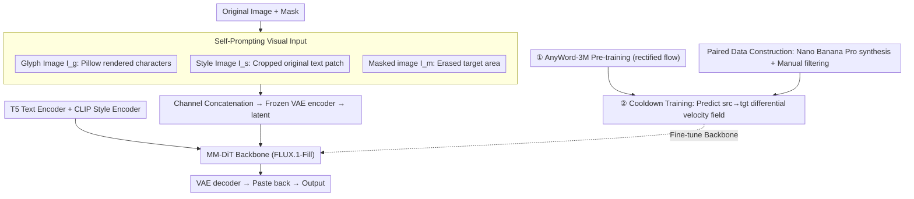

# Self-Prompting Diffusion Transformer for Open-Vocabulary Scene Text Editing via In-Context Learning

**Conference**: ICML 2026  
**arXiv**: [2605.15523](https://arxiv.org/abs/2605.15523)  
**Code**: https://hongxiii.github.io/mstedit (Project Page)  
**Area**: Diffusion Models / Image Editing / Scene Text Editing  
**Keywords**: Scene Text Editing, MM-DiT, Self-Prompting, In-Context Learning, Open-Vocabulary

## TL;DR
This paper proposes a self-prompting scene text editing method based on FLUX-Fill (MM-DiT). It directly crops style prompts from the original image and renders glyph prompts using Pillow. These are concatenated along the channel dimension with the masked image and fed into the diffusion backbone. Following pre-training, a cooldown training phase is conducted using 4,000 high-quality paired images generated by Nano Banana Pro, achieving open-vocabulary text replacement across 13 languages while maintaining consistency with the original style.

## Background & Motivation

**Background**: Current mainstream Scene Text Editing (STE) solutions follow the image inpainting paradigm: the original text area is removed with a mask, and the diffusion model regenerates new text within that mask. To ensure correct character structures, methods like AnyText, AnyText2, and GlyphMastero typically use a pre-trained OCR model as a glyph encoder to extract character-level features.

**Limitations of Prior Work**: This paradigm introduces two specific issues. First, since OCR is essentially a classifier with a closed dictionary, it fails for rare characters, low-resource languages, or artistic fonts that exceed the editable vocabulary. Training a glyph encoder from scratch requires massive data. Second, inpainting erases visual information from the target area, forcing the generated text to "borrow" styles from surrounding pixels. If the target text style differs from the background text (e.g., red text "Charmander" surrounded by blue text in Fig. 1), the new text may be erroneously colored blue, losing its original color, font, and texture.

**Key Challenge**: To preserve the original style of the target text, the model needs to see the pixels of the target area; however, the inpainting setup requires erasing that very area. Similarly, to support any language/character, the model cannot rely on a closed-vocabulary OCR encoder but must still receive fine-grained glyph structure information.

**Goal**: To enable MM-DiT to simultaneously satisfy "accurate open-vocabulary glyphs" and "consistent style before and after editing" without introducing additional style or glyph encoders.

**Key Insight**: MM-DiT (specifically FLUX-Fill) naturally possesses multi-modal in-context learning capabilities. As long as information is provided as visual tokens in the input sequence, the model can spontaneously utilize it through attention mechanisms. The authors propose the "self-prompting" concept: directly cropping the original image for style signals and rendering glyph signals via font libraries, allowing MM-DiT to learn how to use them.

**Core Idea**: Concatenate the style patch cropped from the original image and the glyph map rendered by Pillow with the masked image along the channel dimension. This forms the "self-prompting" visual input for MM-DiT, replacing specialized OCR/style encoders.

## Method

### Overall Architecture
The method addresses the need for both arbitrary open-vocabulary glyphs and consistent style, which the standard inpainting paradigm fails to achieve. Instead of training specialized encoders, the authors feed style and glyph information into the MM-DiT input sequence as "ready-made visual materials," leveraging its in-context learning. Specifically, the backbone is FLUX.1-Fill-Dev (an inpainting-oriented MM-DiT using rectified flow + dual/single-stream transformer). On the visual side, a style image $I_s$ (cropped from original text), a glyph image $I_g$ (rendered via Pillow), and a masked image $I_m$ (erased target area) are concatenated as $I_{\text{input}}=\mathrm{Concat}(I_g, I_s, I_m)$ and processed by a frozen VAE encoder to obtain latent $z_0$. On the text side, frozen T5 encodes the target text (glyph text prompt for semantic structure) and CLIP encodes the style description (style text prompt for visual alignment). Training involves fine-tuning the MM-DiT backbone in two stages: 1 epoch of self-supervised pre-training on AnyWord-3M, followed by 10 epochs of cooldown training on 4,000 high-quality paired images. During inference, guidance scale=30 and 30 sampling steps are used, with the output restored by the VAE decoder and pasted back into the target area.

### Key Designs

**1. Self-Prompting Visual Input: Treating Style and Glyphs as Raw Input Tokens**

The two main pain points of STE—closed OCR vocabularies and style loss due to inpainting—stem from "forcing information to be encoded into specialized features." The authors do the opposite. The style prompt $I_s$ comes directly from the original image, cropped using the minimum bounding box of the mask, naturally preserving color, font, texture, and local lighting. The glyph prompt $I_g$ uses Pillow to render the target string as a high-contrast single-line glyph map, providing stroke-level geometric priors. After concatenation into the VAE, MM-DiT's attention mechanism performs task allocation through in-context learning: "copy style from $I_s$, content from $I_g$, and background from $I_m$." Replacing OCR encoders with "rendered images" opens the vocabulary completely. Using "original image patches" instead of style encoders avoids representation misalignment issues found in methods like TextCtrl and eliminates data costs for training style encoders.

**2. Cooldown Training: Learning the "Source-to-Target" Differential Velocity Field**

Rendering signals alone are insufficient. In datasets like AnyWord-3M, original text is erased, so the model learns to "render text" but not "replace text with consistent style." The authors design a two-stage objective. The first stage uses standard rectified flow on AnyWord-3M: $\mathcal{L}_{\text{RF}}=\mathbb{E}[\|\hat v_\theta(z_t,t,c)-(z_1-z_0)\|_2^2]$. The second stage injects the "original text area" as meta-information into the style prompt and changes the training objective from "noise-to-image" to a "source-to-target" velocity field. Let $z_t=(1-\sigma_t)z_0^{\text{src}}+\sigma_t z_0^{\text{tgt}}$, the objective minimizes $\mathcal{L}_{\text{CD}}=\mathbb{E}[\|\hat v_\theta(z_t,t,c)-(z_0^{\text{tgt}}-z_0^{\text{src}})\|_2^2]$. If the original image were used directly, the model might lazily copy both style and glyphs, causing editing failure. Predicting the "differential velocity field" explicitly tells the model what to change and what to keep, decoupling style preservation from content replacement.

**3. Paired Data Construction: Using LLMs as Synthesizers and Humans as Filters**

Cooldown training requires "pairs of images identical except for the text" to learn style preservation. Such real-world pairs are nearly impossible to collect. The authors use an instruction-based editing model, Nano Banana Pro, to generate candidate pairs, which are then manually filtered based on three criteria: (a) non-target areas remain unchanged; (b) generated text is semantically correct; (c) edited text maintains consistent color, font, and texture. This resulted in 4,000 pairs. Using a strong generative model as a synthesizer and humans as filters is a cost-effective compromise given the lack of style-consistent pairs.

### Loss & Training
Two stages: (1) 1 epoch of standard rectified flow $\mathcal{L}_{\text{RF}}$ on AnyWord-3M; (2) 10 epochs of cooldown objective $\mathcal{L}_{\text{CD}}$ on 4,000 paired images. Optimizer: AdamW, lr=$2\times10^{-5}$ constant, bf16 + 8-bit optimizer state, per-GPU batch=1 with grad-accum 8 (effective batch 64), 8×A100. Multi-lingual data is mixed without language-level scheduling.

## Key Experimental Results

### Main Results
Comparison with 7 SOTA methods on AnyText-benchmark (1,000 test images each for Chinese/English):

| Dataset | Metric | Ours | Prev. SOTA (TextFlux) | Gain |
|--------|------|------|----------|------|
| English | Sen.ACC ↑ | 0.8857 | 0.8231 | +6.26 pt |
| English | NED ↑ | 0.9568 | 0.9235 | +3.33 pt |
| English | FID ↓ | 7.62 | 13.42 | −43% |
| English | LPIPS ↓ | 0.0365 | 0.0721 | −49% |
| Chinese | Sen.ACC ↑ | 0.8249 | 0.7289 | +9.60 pt |
| Chinese | NED ↑ | 0.9147 | 0.8612 | +5.35 pt |
| Chinese | FID ↓ | 7.95 | 13.67 | −42% |
| Chinese | LPIPS ↓ | 0.0268 | 0.0524 | −49% |

On the self-constructed MST-Edit multilingual dataset (11 languages including Arabic, French, German, Korean, Japanese, Italian, Bengali, Hindi, Russian, Thai, Swahili), the model significantly outperformed two OCR-free baselines (FluxText, TextFlux). Latin-based languages performed best due to similar stroke structures, while Thai performed relatively lower due to complex glyph arrangements.

### Ablation Study

| Configuration | Eng Sen.ACC | Eng FID | Eng LPIPS | Chi Sen.ACC | Chi FID | Chi LPIPS |
|------|------|------|------|------|------|------|
| w/o cooldown (No style prompt + No cooldown) | 0.8738 | 11.56 | 0.0608 | 0.8125 | 12.01 | 0.0425 |
| w/ cooldown (Full Model) | 0.8857 | 7.62 | 0.0365 | 0.8249 | 7.95 | 0.0268 |

### Key Findings
- The benefits of the style prompt and cooldown are primarily reflected in image quality (FID/LPIPS reduced by ~40%), while text accuracy improvements are more moderate (~+1%), indicating these designs focus on "fixing style" rather than "fixing glyphs."
- Stroke-level rather than character-level representation facilitates positive multi-lingual transfer. When training languages in a cycle (Arabic→English→French...), the Seq.ACC of previously learned languages did not drop but improved steadily as more languages were added, as shared low-level stroke primitives were reinforced.
- Qualitative analysis (Fig. 6) shows that without the style prompt, the model may render fonts not present in the original image or preserve the font but destroy the background. The full model preserves both.

## Highlights & Insights
- **Self-prompting is the most direct physical realization of in-context learning**: Instead of training encoders to turn information into tokens, directly feeding the original image patch and rendered image as tokens allows MM-DiT attention to select the necessary info. This approach is applicable to other local editing tasks requiring style-content decoupling (logo replacement, sticker editing).
- **Using general generative models as "data synthesizers"**: Obtaining 4,000 high-quality pairs via Nano Banana Pro generation and manual filtering is significantly cheaper than real-world collection and represents a general paradigm for low-resource tasks.
- **The cooldown objective $z_0^{\text{tgt}}-z_0^{\text{src}}$ is an elegant design**: It explicitly instructs the model to only predict the change, naturally preventing training collapse. This trick can be migrated to other diffusion tasks requiring local editing with identity preservation.

## Limitations & Future Work
- The glyph prompt depends on Pillow and font files. If a character is missing from the font file, rendering fails. The "openness" of the vocabulary is limited by font coverage, hindering performance on rare ancient characters or handwritten art fonts.
- The style prompt is taken from the minimum bounding box. If the mask contains a large background or multiple fonts, the patch may include irrelevant styles, causing style drift.
- Cooldown data relies on a single generator (Nano Banana Pro), risking the distillation of generator-specific style biases. Future work could use multiple generators and auto-scoring filters.
- High computational overhead: Full parameter fine-tuning of FLUX-Fill with guidance=30 and 30 sampling steps makes deployment costs higher than LoRA-based STE solutions. Distilling into a lighter student model would be more practical.

## Related Work & Insights
- **vs AnyText/AnyText2 (Tuo 2023/2024)**: They use OCR encoders for character-level features, while this work uses rendered glyph maps for stroke-level features. This approach offers an open vocabulary and stable support for 13 languages, though it is limited by font libraries.
- **vs FluxText / TextFlux (2025)**: These are also OCR-free, rendering glyphs within the mask. This work adds "original patches as style prompts + cooldown training," achieving a 40%+ gap in FID/LPIPS.
- **vs TextCtrl (Zeng 2024)**: TextCtrl uses a specialized style encoder but suffers from representation misalignment with the VAE latent space. This work places style signals directly into the VAE input channels, ensuring natural alignment.
- **Insight**: In-context learning in MM-DiT does not necessarily require training an adapter to map info to tokens. Stacking information in raw visual forms (crops, renders, references) along the VAE input channels is a minimalist and efficient injection method.

## Rating
- Novelty: ⭐⭐⭐⭐ The combination of self-prompting and the cooldown differential objective is clean, though the individual innovations are incremental.
- Experimental Thoroughness: ⭐⭐⭐⭐ Covers 13 languages, two datasets, ablation of cooldown, and multi-lingual cyclic training.
- Writing Quality: ⭐⭐⭐⭐ Clear argumentation chain from motivation to method to ablation.
- Value: ⭐⭐⭐⭐ Significantly pushes the SOTA for multi-lingual STE with high engineering reusability for downstream tasks.

<!-- RELATED:START -->

## Related Papers

- [\[CVPR 2026\] Dynamic-eDiTor: Training-Free Text-Driven 4D Scene Editing with Multimodal Diffusion Transformer](../../CVPR2026/image_generation/dynamic-editor_training-free_text-driven_4d_scene_editing_with_multimodal_diffus.md)
- [\[NeurIPS 2025\] Seg4Diff: Unveiling Open-Vocabulary Segmentation in Text-to-Image Diffusion Transformers](../../NeurIPS2025/image_generation/seg4diff_unveiling_open-vocabulary_segmentation_in_text-to-image_diffusion_trans.md)
- [\[CVPR 2026\] SHOE: Semantic HOI Open-Vocabulary Evaluation Metric](../../CVPR2026/image_generation/shoe_semantic_hoi_open-vocabulary_evaluation_metric.md)
- [\[NeurIPS 2025\] ICEdit: Enabling Instructional Image Editing with In-Context Generation in Large Scale Diffusion Transformer](../../NeurIPS2025/image_generation/in-context_edit_enabling_instructional_image_editing_with_in-context_generation_.md)
- [\[CVPR 2026\] Omni-Attribute: Open-vocabulary Attribute Encoder for Visual Concept Personalization](../../CVPR2026/image_generation/omni-attribute_open-vocabulary_attribute_encoder_for_visual_concept_personalizat.md)

<!-- RELATED:END -->
