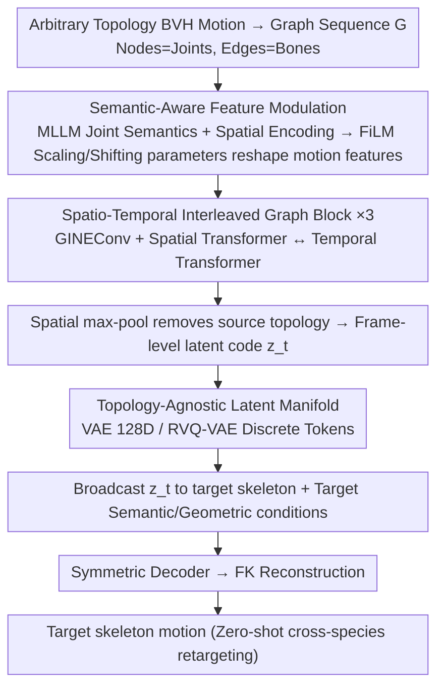

# Semantic-Aware Motion Encoding for Topology-Agnostic Character Animation

**Conference**: ICML 2026  
**arXiv**: [2605.27055](https://arxiv.org/abs/2605.27055)  
**Code**: https://github.com/zzysteve/SATA  
**Area**: 3D Vision / Human Motion / Character Animation / Representation Learning  
**Keywords**: Motion Representation, Topology-Agnostic, Cross-Species Retargeting, Semantic Modulation, Graph Auto-Encoders

## TL;DR
SATA utilizes joint semantic labels generated by MLLMs for FiLM-style feature modulation, combined with spatio-temporal interleaved graph auto-encoders, to compress BVH motions of arbitrary skeletal topologies into a shared latent space. This achieves high-fidelity reconstruction and zero-shot cross-species motion retargeting without paired data.

## Background & Motivation
**Background**: Current motion representation learning for character animation is predominantly built upon the "canonical skeleton" assumption. Large-scale datasets like HumanML3D and AMASS map original SMPL sequences to a fixed number and hierarchy of joints, subsequently using VAE or VQ/RVQ-VAE to compress these fixed-dimensional trajectories into latent codes. While this paradigm achieves high reconstruction fidelity within a single species, it is inherently "tailored for a specific skeleton."

**Limitations of Prior Work**: In practice, digital characters range from humans to quadrupeds and fantasy creatures, exhibiting vast differences in joint counts and hierarchies. Even for "humans," different datasets vary in joint definitions and naming conventions. This directly hinders the development of unified multi-species generative models. Existing topology-flexible solutions either employ graph convolutions (e.g., SAME) that focus only on local graph structures and lack cross-species functional correspondence, or use Transformer + zero-padding (Gat 2025, Lee 2025), which introduces quadratic computational redundancy, constrains the maximum number of joints, and fails to learn compact continuous latent manifolds.

**Key Challenge**: The contradiction between topological variance and compact generative motion representations. Fixed templates provide compact latent spaces at the expense of topological flexibility; zero-padding and graph structures provide flexibility but sacrifice latent space structure or lack semantic alignment. A mechanism is required to decouple "topology" from "semantics."

**Goal**: To construct a padding-free auto-encoder capable of directly processing raw BVH data of arbitrary topologies, encoding motions into a species-shared continuous latent manifold, and decoding from this latent code to any target skeleton without paired supervision.

**Key Insight**: The authors observe that while skeletal topologies vary, the "semantics" of motion are shared cross-species: human arms and animal forelimbs align at the functional level of "support/locomotion/grasping." Therefore, rather than matching geometry or graph structures, it is better to attach a semantic description to each joint (generated by MLLM and encoded by T5) to establish functional correspondence in the semantic space.

**Core Idea**: Utilize MLLM-generated joint semantic embeddings for FiLM-style feature modulation (where semantic and spatial information jointly generate scaling/shifting parameters to reshape motion features), combined with spatio-temporal interleaved graph blocks, to encode motions from arbitrary skeletons into a unified, topology-agnostic latent space.

## Method

### Overall Architecture
SATA aims to encode motions of arbitrary topologies into a shared latent space and decode them onto different skeletons without paired data. It represents a $T$-frame motion as a graph sequence $\mathcal{G}=\{G_1,\dots,G_T\}$. Each frame $G_t=(V,E,E_f,F_s,F_{m,t})$ consists of nodes (joints), edges (bone chains), edge features (topological depth/inverse depth), and node features. Node features are decomposed into static skeleton components $F_s=(X_g,X_l,X_t)$ (global offsets, rest pose coordinates relative to parents, joint semantic embeddings) and dynamic motion components $F_m=(q,x,v_q,v_x,r,c)\in\mathbb{R}^{J\times D}$ (6D rotation, relative position, angular/linear velocity, root motion, foot contact). The encoder first reshapes each joint's motion features according to its functional identity via semantic-aware modulation, extracts features through spatio-temporal interleaved graph blocks, and finally performs a spatial max-pool to compress the entire skeleton into a frame-level latent code $z_t$, thereby removing source topology information. The decoder broadcasts $z_t$ to each node of the target skeleton, concatenates target-specific semantic/geometric conditions, and utilizes a symmetric decoder to output $\hat F_m^{out}=(q,r,c)\in\mathbb{R}^{J\times 11}$, which is reconstructed into full motion via Forward Kinematics (FK).

### Key Designs

**1. Semantic-Aware Feature Modulation: Using joint semantics as cross-species "functional identities" to modulate motion features**

Since topologies vary and geometry cannot be directly aligned, "human left hand" and "cat left front paw" are treated as functionally identical. This design explicitly establishes functional correspondence so that they map to similar regions in the latent space despite different skeletal positions. Specifically, Gemini 2.5 Pro generates neutralized functional descriptions for each joint (emphasizing function over species naming for better transfer), which are encoded into semantic embeddings $X_t$ using a frozen T5. Three inputs are projected: motion $z_m=\phi_m(F_m)$, spatial $z_s=\phi_s([X_g;X_l])$ (a sinusoidal encoder mapping coordinates to high-frequency spectra), and semantic $z_t=\phi_t(X_t)$. Spatial and semantic features are concatenated and passed through a non-linear layer to obtain node conditions $c=\Phi([z_s;z_t])$, which then project FiLM parameters $[\gamma,\beta]=\Psi(c)$ to reshape motion features: $\hat x=\mathrm{LN}(z_m)\odot(1+\gamma)+\beta$. Compared to simple addition, FiLM allows conditions to scale/shift the features themselves. A gated residual layer $\widetilde F_m=z_m+g\odot\hat x$ ($g=\sigma(W_g c)$) allows the model to suppress modulation in cases of semantic noise or modal conflict.

**2. Spatio-Temporal Interleaved Graph Block: Interleaved blocks to preserve skeletal physical priors while ensuring long-term coherence**

Using only graph convolutions loses long-term context, while pure self-attention loses topological priors. This block stacks both. The spatial branch borrows from GPSConv with two parallel paths: a GINEConv for message passing (utilizing topological depth in edge features to reinforce bone length/hierarchy priors) and a Spatial Transformer to model long-range coordination between non-adjacent joints (e.g., hand-foot coordination). The temporal branch adopts the spatio-temporal interleaving of TimeSformer: a mapping operator $\mathcal{T}$ rearranges the batched graph sequence $\mathcal{G}_{batch}$ into "joint-aggregated temporal streams" $\mathcal{X}_{temp}$. After adding sinusoidal position encodings, a Temporal Transformer captures long-term dependencies before $\mathcal{T}^{-1}$ writes the features back to the graph. The encoder stacks three such blocks, mirrored symmetrically in the decoder. Intuitively, this "ensures physical plausibility per frame before straightening the sequence along the time dimension."

**3. Topology-Agnostic Latent Manifold + Arbitrary Skeleton Data Pipeline: Erasing source structure at the encoder and injecting target structure at the decoder**

To make $z_t$ compatible with arbitrary species, the latent code must not retain information about the number or connectivity of source joints. SATA uses a spatial max-pool at the end of the encoder to aggregate $J$ node features into a single frame-level vector $z_t$, flattening the source topology. During decoding, only the latent code and the target skeleton's $(X'_t,X'_g,X'_l)$ are considered, allowing the same $z_t$ to be broadcast to any target skeleton. The latent space represents the "semantics of the action" rather than its implementation on a specific skeleton. $z_t$ can be implemented as a VAE (128D) for reconstruction/retargeting or an RVQ-VAE (256D, 6 residual quantizers, codebook size 1024) to provide discrete tokens for text-to-motion. The data pipeline "de-canonicalizes" HumanML3D and AniMo4D back to quaternion BVH, performing canonicalization and augmentation to produce AT-HumanML3D (80,508 segments) and AT-AniMo4D (30,097 segments, 115 species). This enables joint training across multiple datasets, more thoroughly achieving a "one latent space for all species" approach than prior methods like WalkTheDog (one AE per character) or OmniMotionGPT (fixed SMAL quadruped template).

### Loss & Training
End-to-end optimization of $\mathcal{L}=\mathcal{L}_{rec}+\lambda\mathcal{L}_{reg}$. Reconstruction terms follow the SAME recipe: MSE for rotation, position, and velocity, plus physical regularizations for foot contact, ground penetration, and smoothness. Latent space regularization uses KL divergence for VAE or commitment loss for RVQ-VAE. Training utilizes Adam with an initial lr of 1e-4, 30-round linear warmup, and exponential decay $\gamma=0.99$ for 400 epochs. Inference uses a sliding window of 64 frames with 16 frames of overlap. The base model contains 8.41M parameters / 29.66 GFLOPs.

## Key Experimental Results

### Main Results

Reconstruction and zero-shot cross-dataset evaluation for single-dataset training (gray columns indicate zero-shot; JR=Joint Rotation, RT=Root Trajectory, JP=Joint Position, FS=foot skating, GP=ground penetration):

| Train Source | Method | AT-HumanML3D JR↓ | AT-HumanML3D JP↓ | AT-AniMo4D JR↓ | AT-AniMo4D JP↓ |
|---|---|---|---|---|---|
| HumanML3D | SAME | 0.0831 | 2.81 | 0.5721 | 398.1 (Fail) |
| HumanML3D | Ours | **0.0568** | **1.36** | **0.4855** | **34.6** |
| AniMo4D | SAME | 0.5266 | 122.7 (Fail) | 0.5227 | 4.30 |
| AniMo4D | Ours | 0.6616 | 80.9 | **0.3901** | 4.51 |

Multi-dataset joint training (trained simultaneously on both benchmarks):

| Method | AT-HumanML3D JR↓ | AT-HumanML3D JP↓ | AT-AniMo4D JR↓ | AT-AniMo4D JP↓ |
|---|---|---|---|---|
| SAME | 0.1060 | 2.34 | 0.2357 | 3.68 |
| Ours | **0.0769** | **1.63** | **0.1971** | **3.27** |

Human motion retargeting (global joint position error):

| Method | Internal↓ | Cross↓ |
|---|---|---|
| MoMask | 89.42 | 103.72 |
| SAN | 15.96 | 34.82 |
| SAME | 1.48 | 0.96 |
| Ours (RVQ) | 1.12 | 0.97 |
| Ours (VAE) | **0.21** | **0.20** |

### Ablation Study

Component ablation on AT-HumanML3D (selected):

| Configuration | JR↓ | JP↓ | Internal Retarget↓ | Cross Retarget↓ |
|---|---|---|---|---|
| Full | 0.0568 | 1.36 | 0.21 | 0.20 |
| w/o Spatial Transformer | 0.1243 | 10.23 | 1.78 | 1.67 |
| w/o GNN | 0.0747 | 2.38 | 1.10 | 1.06 |
| w/o Temporal Transformer | 0.0584 | 1.78 | 0.32 | 0.29 |
| w/o Fusion Block (Modulation) | 0.1196 | 7.81 | 0.48 | 0.48 |
| w/o Text Fusion (Text only) | 0.0663 | 1.52 | 0.35 | 0.25 |
| w/o Sliding Window | 0.0630 | 3.45 | 0.75 | 0.65 |

Pre-training effectiveness (ratio of AniMo4D data used; ✗=from scratch, ✓=finetuned from AT-HumanML3D):

| Data \% | PT | JR↓ | JP↓ |
|---|---|---|---|
| 10% | ✗ / ✓ | 0.62 / **0.28** | 14.34 / **7.71** |
| 30% | ✗ / ✓ | 0.52 / **0.22** | 8.72 / **4.06** |
| 100% | ✗ / ✓ | 0.39 / **0.18** | 4.51 / **3.14** |

### Key Findings
- **The Fusion Block is critical**: Removing it increases JP from 1.36 to 7.81 and doubles retargeting errors. This confirms that "semantic-spatial modulation" is key for cross-species alignment.
- **Spatial Transformer outweighs GNN**: Removing the former increases JP by 7.5x, while the latter only by 1.7x. This suggests that long-range joint coordination is vital for motion reconstruction; local message passing alone is insufficient.
- **Joint training provides bi-directional benefits**: While the Ours retargeting was slightly behind SAME when trained only on AniMo4D, it outperformed SAME after adding human data, indicating that semantic alignment allows human motion to benefit animal trajectory modeling.
- **Robustness in zero-shot cross-species**: SAME effectively fails (JP=398) in the Human→Animal setting, while Ours maintains 34.6, thanks to the decoupled "topology-agnostic latent space + target skeleton conditioning."
- **Significant pre-training gains**: With only 10% of data, JP dropped from 14.34 to 7.71 (approx. 46% improvement), suggesting the shared latent manifold can serve as a universal backbone for motion.

## Highlights & Insights
- **The philosophy of "Topology Decoupling = Semantic Bridge" is elegant**: Rather than struggling at the geometric or graph levels, using MLLMs to label joints allows the network to implicitly establish functional correspondences like "human left hand ↔ cat left front paw."
- **Reliable FiLM + Gated Residual trick**: Simple addition might drown out semantic identity. FiLM reshapes rather than contaminates features, and the gating mechanism allows the model to ignore noisy conditions.
- **Max-pool (erasing) + Broadcast (injecting)**: This asymmetric design is the technical core for a truly topology-agnostic space. Information seen by the encoder must be flattened, while information seen by the decoder must be expanded.
- **The data pipeline is a major contribution**: AT-HumanML3D and AT-AniMo4D provide benchmarks for testing true topological generalization, rather than relying on inconsistent custom datasets.

## Limitations & Future Work
- **MLLM output quality control**: Although "neutralized" templates are used, the meaningfulness of descriptions for bizarre topologies (e.g., multi-armed creatures, non-animal robots) remains underexplored.
- **Dependency on BVH format**: The pipeline is tied to quaternion BVH, limiting its direct utility for mesh-driven, blendshape-driven, or soft-body characters.
- **Geometric vs. Perceptual metrics**: Cross-species retargeting is primarily evaluated with geometric metrics; more robust user studies or perceptual metrics are needed to evaluate the "naturalness" and "species characteristic preservation."
- **Topology-agnostic ≠ Physics-agnostic**: The decoder considers bone length and semantics but lacks explicit physical constraints (mass distribution, joint limits). Jumping motions for humans might appear unnatural when transferred to smaller animals.
- **Future Work**: Incorporate physical parameters (mass, inertia, limits) as decoder conditions; introduce perceptual metrics for retargeting; align the RVQ codebook with text for controllable multi-species text-to-motion.

## Related Work & Insights
- **vs. SAME (Lee 2023)**: Both use topology-flexible graph AEs, but SAME lacks cross-species semantic alignment, leading to failure in Human→Animal zero-shot scenarios. SATA uses MLLM modulation to reduce the zero-shot JP from 398 to 34.
- **vs. Zero-padding Transformers (Gat 2025, Lee 2025)**: They use padding for arbitrary topologies, introducing quadratic redundancy and joint limits. SATA is padding-free and provides a compact generative latent space.
- **vs. MoMask / VQ-VAE series**: These excel on fixed skeletons but cannot transfer. SATA exchanges a small amount of reconstruction fidelity for topological generalization.
- **vs. WalkTheDog / OmniMotionGPT**: Previous cross-species work was either non-scalable (one AE per character) or restrictive (fixed quadruped templates). SATA handles 115 animal species plus humans in a single model.

## Rating
- Novelty: ⭐⭐⭐⭐ The combination of "MLLM joint semantics + FiLM modulation + topology-agnostic manifold" is novel and clean.
- Experimental Thoroughness: ⭐⭐⭐⭐ Covers single/joint training, zero-shot, retargeting, ablation, and pre-training scalability.
- Writing Quality: ⭐⭐⭐⭐ Clear motivation and methodology; high information density in tables.
- Value: ⭐⭐⭐⭐ Connects arbitrary topology, multi-species joint training, and zero-shot retargeting, paving the way for future multi-species foundation models.

<!-- RELATED:START -->

## Related Papers

- [\[ICML 2025\] FlexiClip: Locality-Preserving Free-Form Character Animation](../../ICML2025/image_generation/flexiclip_locality-preserving_free-form_character_animation.md)
- [\[ICCV 2025\] LIFT: Latent Implicit Functions for Task- and Data-Agnostic Encoding](../../ICCV2025/image_generation/lift_latent_implicit_functions_for_task-_and_data-agnostic_encoding.md)
- [\[AAAI 2026\] Playmate2: Training-Free Multi-Character Audio-Driven Animation via Diffusion Transformer with Reward Feedback](../../AAAI2026/image_generation/playmate2_training-free_multi-character_audio-driven_animation_via_diffusion_tra.md)
- [\[CVPR 2026\] BiMotion: B-spline Motion for Text-guided Dynamic 3D Character Generation](../../CVPR2026/image_generation/bimotion_b-spline_motion_for_text-guided_dynamic_3d_character_generation.md)
- [\[ECCV 2024\] LivePhoto: Real Image Animation with Text-guided Motion Control](../../ECCV2024/image_generation/livephoto_real_image_animation_with_text-guided_motion_control.md)

<!-- RELATED:END -->
